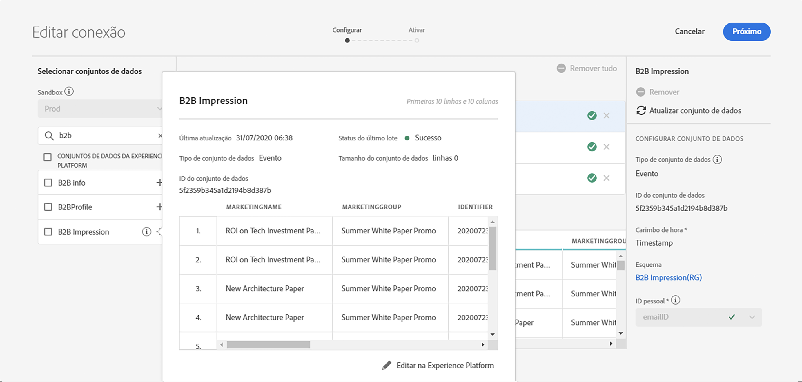

# Estimar tamanho da conexão

Talvez seja necessário saber quantas linhas de dados você tem atualmente em [!UICONTROL Customer Journey Analytics]. A finalidade deste tópico é mostrar como relatar o uso atual de [!UICONTROL Customer Journey Analytics], para fins de faturamento.

1. Em [!UICONTROL Customer Journey Analytics], clique na guia **[!UICONTROL Conexões]**.
1. Na tela [!UICONTROL Editar conexão], selecione uma conexão para a qual deseja determinar o tamanho de uso/conexão.

   

1. Selecione um conjunto de dados que faça parte da conexão no painel esquerdo. Nesse caso, é o conjunto de dados &quot;Impressão B2B&quot;.

   

1. Clique no ícone azul (i) (informações) ao lado de seu nome. Você observará que o Conjunto de dados tem 3,8 mil linhas/eventos. Além disso, para o número exato de linhas, clique em **[!UICONTROL Editar em Experience Platform]** abaixo da tabela de pré-visualização. Isso redirecionará você para os conjuntos de dados em [!UICONTROL Adobe Experience Platform].

   

1. Observe que o **[!UICONTROL Total de registros]** desse conjunto de dados é de 3,83 k, com o tamanho dos dados de 388,59 KB.

1. Repita as etapas de 1 a 5 para outros conjuntos de dados em sua conexão e adicione o número de registros/linhas. O número agregado final será a métrica de uso de sua conexão, e esse é o número de linhas dos conjuntos de dados de sua conexão que você vai assimilar de [!UICONTROL Adobe Experience Platform].

## Determinar o número de linhas ingeridas

O número de eventos realmente ingeridos no CJA depende das configurações de sua conexão. Além disso, se você selecionou a ID de pessoa incorreta ou se essa ID não estiver disponível para algumas linhas nos conjuntos de dados, então [!UICONTROL Customer Journey Analytics] ignorará essas linhas. É assim que você descobre as linhas reais de eventos ingeridos depois que uma conexão é salva.

1. Depois de salvar a conexão, crie uma visualização de dados da mesma conexão sem filtros.
1. Crie um projeto do Workspace e selecione a visualização de dados correta. Crie uma tabela de forma livre e arraste e solte a métrica **[!UICONTROL Eventos]** com uma dimensão **[!UICONTROL Ano]**. Escolha o intervalo máximo de datas do seu calendário de seleção de datas. Isso permitirá que você veja o número de eventos sendo ingeridos em [!UICONTROL Customer Journey Analytics].

   

   >[!NOTE]
   >
   >Isso permite que você veja o número de eventos que estão sendo assimilados do conjunto de dados de eventos. Ela não inclui conjuntos de dados de tipo de perfil e pesquisa. Siga as etapas de 1 a 3 para conjuntos de dados de perfil e pesquisa e adicione os números para obter o total de eventos para essa conexão.

## Depurar discrepâncias

Você pode ter notado que o número total de eventos ingeridos é &quot;7650&quot;, mas a conexão tinha apenas o conjunto de dados do evento &quot;Impressão B2B&quot; com &quot;3830 linhas&quot; no AEP. Por que há uma discrepância? Vamos fazer alguma depuração.

1. Analise essa dimensão por **[!UICONTROL ID do conjunto de dados da plataforma]** e você observará dois conjuntos de dados com o mesmo tamanho, mas diferentes **[!UICONTROL IDs do conjunto de dados da plataforma]**. Cada conjunto de dados tem 3825 registros. Isso significa que [!UICONTROL Customer Journey Analytics] ignorou 5 registros devido a IDs de pessoa ausentes ou BAVIDs (IDs de Visitante grande):

   

1. Além disso, se verificarmos [!UICONTROL Adobe Experience Platform], não há conjunto de dados com a ID &quot;5f21c12b732044194bffc1d0&quot;, portanto, alguém excluiu esse conjunto de dados específico de [!UICONTROL Adobe Experience Platform] quando a conexão inicial estava sendo criada. Mais tarde, ele foi adicionado a [!UICONTROL Customer Journey Analytics] novamente, mas [!UICONTROL ID do conjunto de dados da plataforma] diferente foi gerado por [!UICONTROL Adobe Experience Platform].

   Leia mais sobre as [implicações do conjunto de dados e da exclusão de conexão](https://experienceleague.adobe.com/docs/analytics-platform/using/cja-overview/cja-faq.html?lang=en#implications-of-deleting-data-components) em [!UICONTROL Customer Journey Analytics] e [!UICONTROL Adobe Experience Platform].