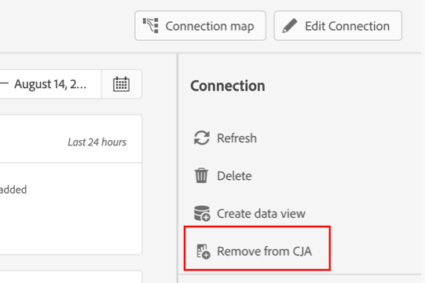

# Gerenciar conexões {#manage-connections}

>[!CONTEXTUALHELP]
>id="connections_use_ajo"
>title="Usar conexão com o Journey Optimizer"
>abstract="Utiliza os recursos avançados de geração de relatórios do Customer Journey Analytics com o Journey Optimizer."

>[!CONTEXTUALHELP]
>id="connections_cancel_ajo"
>title="Cancelar conexão com o Journey Optimizer"
>abstract="Cancela os recursos avançados de geração de relatórios do Customer Journey Analytics com o Journey Optimizer."

Depois de [criar ou editar uma ou mais conexões](/help/connections/create-connection.md), você poderá gerenciá-las em **[!UICONTROL Conexões]**. A interface [!UICONTROL Conexões] permite:

* Exibir imediatamente todas as suas conexões, incluindo o proprietário, a sandbox e quando elas foram criadas e modificadas.
* Editar uma conexão.
* Exclua uma conexão.
* Crie uma visualização de dados a partir de uma conexão.
* Visualizar todos os conjuntos de dados em uma conexão.
* Verifique o status dos conjuntos de dados da conexão e do processo de ingestão. Por exemplo, quando seus dados estão disponíveis para que você possa começar com relatórios e análises no Analysis Workspace.
* Identifique quaisquer discrepâncias de dados devido a uma configuração incorreta. Há alguma linha faltando? Em caso afirmativo, quais linhas estão faltando e por quê? Você configurou conexões incorretamente e causou a ausência de dados no Customer Journey Analytics?
* Obtenha insights sobre o uso de linhas assimiladas e reportáveis em todas as suas conexões.

[!UICONTROL Conexões] têm duas interfaces: [[!UICONTROL Lista]](#list) e [[!UICONTROL Uso]](#usage).

## Lista

A interface **[!UICONTROL Lista]** é a interface padrão para Conexões. Se não for selecionada, clique na guia **[!UICONTROL Lista]** para acessar a interface.

A interface [!UICONTROL Lista] mostra uma tabela de todas as conexões disponíveis.

### Procurar uma conexão

Você pode pesquisar rapidamente por uma conexão usando a caixa de pesquisa .

### Aplicar um filtro à lista de conexões

Para aplicar um filtro à lista de conexões, selecione o ícone de filtro e, em seguida, selecione uma das seguintes opções de filtro:

| Opção de filtro | Descrição |
|---------|----------|
| **[!UICONTROL Conjuntos de dados]** | Somente as conexões associadas aos conjuntos de dados selecionados são exibidas. |
| **[!UICONTROL Proprietário]** | Somente as conexões de propriedade das pessoas que você selecionar serão exibidas. |
| **[!UICONTROL Sandbox]** | Somente as conexões disponíveis nas sandboxes selecionadas são exibidas. |
| **[!UICONTROL Uso no CJA]** | Selecione **[!UICONTROL Ligado]** para mostrar apenas as conexões habilitadas para uso com o Customer Journey Analytics. Selecione **[!UICONTROL Desativado]** para mostrar apenas as conexões que ainda não estão habilitadas para uso com o Customer Journey Analytics. |

### Colunas disponíveis

As seguintes colunas ou ícones estão disponíveis na tabela.

| Coluna ou ícone | Descrição |
| --- | --- |
| **[!UICONTROL _Nome_]** | O nome amigável da conexão. Selecione o nome com hiperlink para ver os [detalhes da conexão](#connection-details). |
|  | Para exibir informações sobre [!UICONTROL Conjuntos de dados incluídos], [!UICONTROL Sandbox], [!UICONTROL Proprietário] e muito mais, selecione  ao lado do nome da conexão.
Uma janela pop-up exibe detalhes sobre o conjunto de dados. 
 |
|  | Para [criar uma exibição de dados](#create-a-data-view) para a conexão, selecione . Esse ícone só é exibido quando nenhuma exibição de dados já está associada à conexão. |
|  | Selecione  para abrir um menu de contexto. Você pode selecionar: 
 **[!UICONTROL Editar]** para [editar](#edit-a-connection) uma conexão.
 **[!UICONTROL Excluir]** para [excluir](#delete-a-connection) uma conexão.
 **[!UICONTROL Criar nova visualização de dados]** para [criar uma nova visualização de dados](#create-a-data-view) para a conexão.
 **[!UICONTROL Mapa de conexão]** para exibir um [mapa de conexão](#map-a-connection) para a conexão. |
| [!BADGE B2B edition]{type=Informative url="https://experienceleague.adobe.com/pt-br/docs/analytics-platform/using/cja-overview/cja-b2b/cja-b2b-edition" newtab=true tooltip="Customer Journey Analytics B2B edition"} **[!UICONTROL Tipo de conexão &#x200B;]** | O tipo de conexão: com base em **[!UICONTROL Pessoa]** ou em **[!UICONTROL Conta]**. |
| **[!UICONTROL Conjuntos de dados]** | Um ou mais links para os conjuntos de dados que fazem parte da conexão. É possível selecionar o hiperlink do conjunto de dados para exibi-lo na conexão. Se mais conjuntos de dados fizerem parte da conexão selecionada, selecione **[!UICONTROL +*x* mais]** para mostrar um painel **[!UICONTROL Conjuntos de dados incluídos]**. Este painel mostra links para todos os conjuntos de dados e uma opção para  para procurar conjuntos de dados específicos que façam parte da conexão.

Selecione um nome de conjunto de dados para abrir o conjunto de dados na interface do Experience Platform em uma nova guia. |
| **[!UICONTROL Sandbox]** | A [sandbox da Adobe Experience Platform](https://experienceleague.adobe.com/pt-br/docs/experience-platform/sandbox/home) da qual essa conexão obtém seus conjuntos de dados. Você seleciona essa sandbox ao criar a conexão. Não é possível alterar a sandbox depois que uma conexão é salva. |
| **[!UICONTROL Proprietário]** | A pessoa que criou a conexão. |
| **[!UICONTROL Importar novos dados]** | O status da importação de novos dados para conjuntos de dados: 
   **[!UICONTROL _x _Em]**&#x200B;para conjuntos de dados configurados para importar novos dados e
   **[!UICONTROL _x Desativado_]** para conjuntos de dados não configurados para importar novos dados. |
| **[!UICONTROL Data de criação]** | O carimbo de data e hora em que a conexão foi criada. |
| **[!UICONTROL Última modificação]** | O carimbo de data e hora da última atualização da conexão. |
| **[!UICONTROL Dados de preenchimento retroativo]** | O status para dados de preenchimento retroativo em conjuntos de dados.
   **[!UICONTROL _x _preenchimentos retroativos com falha]**&#x200B;para o número de preenchimentos retroativos com falha entre conjuntos de dados,
   **[!UICONTROL _x _processamento de preenchimentos retroativos]**&#x200B;para o número de processamentos de preenchimentos retroativos em conjuntos de dados,
   **[!UICONTROL _x _preenchimentos retroativos concluídos]**&#x200B;para o número de preenchimentos retroativos concluídos para conjuntos de dados e
   **[!UICONTROL _Desativado_]** caso nenhum preenchimento retroativo seja definido para os conjuntos de dados na conexão. |
| **[!UICONTROL Integrações]** | Mostra todos os aplicativos do Experience Platform que estão habilitados com a conexão. |
| **[!UICONTROL Uso no CJA]** | Mostra se a conexão foi habilitada para uso com o Customer Journey Analytics. |

Para definir quais colunas serão exibidas na tabela, selecione . Na caixa de diálogo Personalizar tabela, selecione as colunas a serem mostradas.

### Editar uma conexão

Para editar uma conexão:

1. Selecione  ao lado do nome da conexão
1. Selecione  **[!UICONTROL Editar]** no menu de contexto.

Como alternativa, você pode:

1. Selecione a linha de conexão.

1. Selecione  **[!UICONTROL Editar]** na barra de ações azul.

Consulte [Criar ou editar uma conexão](create-connection.md) para obter mais informações.

### Exclua uma conexão {#connections-delete}

Para excluir uma conexão:

1. Selecione  ao lado do nome da conexão.
1. Selecione  **[!UICONTROL Excluir]**.

Como alternativa, você pode:

1. Selecione a linha de conexão.

1. Selecione  **[!UICONTROL Excluir]** na barra de ação azul.

Ao excluir uma conexão, um painel **[!UICONTROL Excluir conexão]** indica quais exibições de dados são excluídas e quais projetos do espaço de trabalho são afetados.

* Em ➊ **[!UICONTROL Informações]**, as implicações da exclusão da conexão são mostradas.

  

  Selecione **[!UICONTROL Continuar]** para confirmar a exclusão.

* Em ➋ **[!UICONTROL Confirmação]**, digite o nome da conexão em **[!UICONTROL Digite o nome da conexão]** e selecione **[!UICONTROL Excluir]** para excluir a conexão. Selecione **[!UICONTROL Cancelar]** para cancelar.

Consulte [Implicações da exclusão](/help/technotes/deletion.md) para obter mais informações sobre a exclusão de uma conexão.

### Criar uma exibição de dados para uma conexão

Para criar uma visualização de dados para uma conexão:

1. Selecione  ao lado do nome da conexão.
1. Selecione  **[!UICONTROL Criar nova exibição de dados]**.

Como alternativa, você pode:

1. Selecione a linha de conexão.

1. Selecione  **[!UICONTROL Criar visualização de dados]** na barra de ação azul.

Consulte [Criação e edição de uma visualização de dados](/help/data-views/create-dataview.md) para obter mais informações.

### Conexões do Journey Optimizer

Você pode usar uma conexão Journey Optimizer no Customer Journey Analytics para trazer o seguinte valor adicional à sua conexão:

* Execute uma análise detalhada dos dados do Journey Optimizer no Customer Journey Analytics (usando o botão **[!UICONTROL Analisar no CJA]** no Journey Optimizer).

  Para obter mais informações, consulte [Analisar no Customer Journey Analytics](https://experienceleague.adobe.com/en/docs/journey-optimizer/using/reporting/channel-report/report-cja-manage#cja-template) na documentação do Journey Optimizer.

* Edite a conexão do Journey Optimizer e as visualizações de dados associadas.

  Para obter mais informações sobre opções de edição, consulte [Editar uma conexão](#edit-a-connection).

>[!IMPORTANT]
>
>Quando você habilita uma conexão do Journey Optimizer para uso com o Customer Journey Analytics conforme descrito nesta seção, cada Linha de dados na conexão é contada em relação às Linhas de dados licenciadas a cada mês para o Customer Journey Analytics e é exibida na Interface de uso das Conexões. Selecione a opção **[!UICONTROL Usar no CJA]** na conexão somente se você estiver familiarizado com o uso adicional de Linhas de Dados no Customer Journey Analytics.
>
>**Se você tiver direito ao Customer Journey Analytics e ao Journey Optimizer entre outubro de 2024 e outubro de 2025, consulte o documento a seguir sobre [Conexões Habilitadas para AJO](https://view.adobe.com/viewer/1ed94fc35c7860b260766c620889e7a0#1)**.

Para habilitar essa funcionalidade, sua organização precisa acessar o Customer Journey Analytics. Se você não tiver acesso, entre em contato com o representante de vendas da Adobe.

#### Usar uma conexão do Journey Optimizer {#use-connection-in-cja}

Para usar uma conexão Journey Optimizer no Customer Journey Analytics:

1. Localize a conexão do Journey Optimizer que deseja usar com o Customer Journey Analytics.

   1. Selecione  **[!UICONTROL Filtro]** na guia **[!UICONTROL Conexões]**.

   1. Na seção **[!UICONTROL Usar no CJA]**, selecione **[!UICONTROL Desativado]**.

      Isso exibe todas as conexões do Journey Optimizer que não estão configuradas para uso no Customer Journey Analytics.

      

1. Selecione o nome da conexão do Journey Optimizer.

1. Selecione  **[!UICONTROL Use no CJA]**.

   

   A caixa de diálogo **[!UICONTROL Usar esta conexão no Customer Journey Analytics]** é exibida.

1. Habilite a opção **[!UICONTROL Usar conexão no CJA]**.

1. Selecione **[!UICONTROL Usar conexão]**. <!-- double-check these dialog button names -->

#### Remover uma conexão do Journey Optimizer {#remove-connection-in-cja}

Você pode remover uma conexão Journey Optimizer do Customer Journey Analytics a qualquer momento. No entanto, a remoção da conexão do Customer Journey Analytics após seu uso resulta no seguinte:

* A conexão do Journey Optimizer e quaisquer visualizações de dados associadas são redefinidas para o estado padrão e não podem mais ser editadas

* Todos os campos derivados personalizados associados à conexão são excluídos.

* Não é mais possível executar uma análise detalhada dos dados do Journey Optimizer no Customer Journey Analytics.

  Isso significa que o botão **[!UICONTROL Analisar no CJA]** no Journey Optimizer está desabilitado.

>[!IMPORTANT]
>
>A cobrança da conexão no Customer Journey Analytics inclui o mês completo durante o qual a conexão é removida.

Para remover a conexão do Customer Journey Analytics:

1. Localize a conexão do Journey Optimizer que deseja remover do Customer Journey Analytics.

   1. Selecione  **[!UICONTROL Filtro]** na guia **[!UICONTROL Conexões]**.

   1. Na seção **[!UICONTROL Usar no CJA]**, selecione **[!UICONTROL Em]**.

      Isso exibe todas as conexões do Journey Optimizer configuradas para uso no Customer Journey Analytics.

      

1. Para exibir a conexão, selecione o nome da conexão do Journey Optimizer que deseja remover do Customer Journey Analytics.

1. Ao exibir a conexão do Journey Optimizer, selecione **[!UICONTROL Remover do CJA]**.

   A caixa de diálogo **[!UICONTROL Remover esta conexão do Customer Journey Analytics]** exibe:

   

1. Desabilite a opção **[!UICONTROL Remover conexão do CJA]**.

1. Selecione **[!UICONTROL Remover conexão]**.

### Mapear uma conexão

Para exibir um [mapa de conexão](/help/connections/create-connection.md#connection-map) que detalha os relacionamentos entre os conjuntos de dados que fazem parte de uma conexão:

1. Selecione  ao lado do nome da conexão.
1. Selecione  **[!UICONTROL Mapa de conexão]**.

### Detalhes da conexão {#connection-detail}

Para acessar os detalhes de uma conexão, selecione um nome de conexão com hiperlink na tabela de conexões.

A interface de detalhes das conexões fornece uma exibição detalhada do status de uma conexão. É possível:

* Verifique o status dos conjuntos de dados da conexão e do processo de ingestão.
* Identifique problemas de configuração que fazem com que registros sejam ignorados ou excluídos.
* Veja quando os dados estão disponíveis para relatórios.

| Interface do usuário | Descrição |
| --- | --- |
|  **[!UICONTROL Editar conexão]** | Para editar os detalhes de uma conexão, selecione  **[!UICONTROL Editar conexão]**. Consulte [Criar ou editar uma conexão](create-connection.md) para obter mais informações. |
| **[!UICONTROL *Seletor de conjunto de dados *]** | Selecione um ou todos os conjuntos de dados para exibir detalhes na conexão. Não é possível selecionar vários conjuntos de dados simultaneamente. O padrão é **[!UICONTROL Todos os conjuntos de dados]**. |
| **[!UICONTROL *Seletor de intervalo de datas *]** | Selecione um intervalo de dados para exibir detalhes na conexão. Edite a data inicial, a data final ou selecione  para abrir o seletor de intervalo de datas. No seletor de intervalo de datas, selecione um intervalo de datas usando um dos períodos predefinidos (por exemplo **[!UICONTROL Últimos 6 meses]**) ou use o calendário para selecionar a data inicial e a data final. Selecione **[!UICONTROL Aplicar]** para aplicar o novo intervalo de datas aos detalhes da conexão. |
| **[!UICONTROL Registros de dados do evento disponíveis]** | O número total de linhas do conjunto de dados de eventos disponíveis para relatórios, **para toda a conexão**. Essa contagem independe de qualquer intervalo de datas ou seleção de conjunto de dados. |
| [!UICONTROL **[!UICONTROL Métricas]**] | Resuma os registros de evento, pesquisa, perfil e conjunto de dados de resumo que são adicionados, ignorados e excluídos, e o número de lotes adicionados. Essas métricas são baseadas em **o conjunto de dados e o intervalo de datas selecionados**.
Selecione **[!UICONTROL Verificar detalhes]** para mostrar o pop-up **[!UICONTROL Verificar detalhes ignorados]**. O pop-up lista o número de registros ignorados e o motivo para todos os conjuntos de dados de evento ou conjuntos de dados selecionados.

Selecione o pop-up  com mais informações. Por alguns motivos ignorados, como [!UICONTROL ID de visitante vazia], o pop-up exibe **[!UICONTROL PSQL de Exemplo para EQS]** (Experience Platform para Serviço de Consulta) que você pode usar no [Serviço de Consulta](https://experienceleague.adobe.com/pt-br/docs/experience-platform/query/home) para consultar os registros ignorados no conjunto de dados. Selecione  **[!UICONTROL Copiar PSQL de exemplo para EQS]** para copiar o SQL. |
| **[!UICONTROL Registros adicionados]** | Uma visualização para indicar quantas linhas foram adicionadas no período selecionado, **para o conjunto de dados e o intervalo de datas selecionados**. Atualizações a cada 10 minutos. |
| **[!UICONTROL Registros ignorados]** | Uma visualização para indicar quantas linhas foram ignoradas no período selecionado, **para o conjunto de dados e o intervalo de datas selecionados**. Os motivos para os registros serem ignorados são: carimbos de data e hora ausentes, ID de pessoa ausente ou inválida ou ID de conta [!BADGE B2B edition]{type=Informative url="https://experienceleague.adobe.com/pt-br/docs/analytics-platform/using/cja-overview/cja-b2b/cja-b2b-edition" newtab=true tooltip="Customer Journey Analytics B2B Edition"} e assim por diante. Atualizações a cada 10 minutos. 
IDs inválidas (como `undefined`, `00000000` ou qualquer combinação de números e letras em uma [!UICONTROL ID de pessoa] que aparecem em um evento mais de 1 milhão de vezes em um determinado mês) são IDs que não podem ser atribuídas a nenhum usuário ou pessoa específica. Essas linhas não podem ser assimiladas no sistema e resultam em assimilação e relatórios propensos a erros. Para corrigir IDs de pessoa ou IDs de conta inválidas [!BADGE B2B edition]{type=Informative url="https://experienceleague.adobe.com/pt-br/docs/analytics-platform/using/cja-overview/cja-b2b/cja-b2b-edition" newtab=true tooltip="Customer Journey Analytics B2B Edition"}, você tem três opções:<ul><li>Use [Compilação](/help/stitching/overview.md) para preencher as IDs de usuário indefinidas ou totalmente nulas com IDs de usuário válidas.</li><li>IDs de usuário em branco, que são ignoradas durante a assimilação (preferível a IDs de usuário inválidas ou totalmente nulas).</li><li>Corrija IDs de usuário inválidas em seu sistema antes de assimilar os dados.</li></ul> |
| **[!UICONTROL Registros excluídos]** | Uma visualização para indicar quantas linhas foram excluídas no período selecionado, **para o conjunto de dados e o intervalo de datas selecionados**. Alguém pode ter excluído um conjunto de dados na [!DNL Experience Platform], por exemplo. Atualizações a cada 10 minutos.
Em alguns cenários, esse valor também pode incluir registros substituídos, como na compilação ou em algumas atualizações de conjunto de dados de pesquisa. Considere este exemplo:
<ul><li>Você faz upload de um registro para um conjunto de dados de Perfil individual XDM, que o Customer Journey Analytics está configurado para assimilar como dados de pesquisa de perfil. Nos detalhes da conexão, esse conjunto de dados exibiria 1 registro adicionado.</li><li>Você faz upload de uma duplicata do registro original no mesmo conjunto de dados da AEP, que agora contém dois registros. O Customer Journey Analytics assimila o registro adicional do conjunto de dados de pesquisa de perfil ou conta [!BADGE B2B Edition]{type=Informative url="https://experienceleague.adobe.com/pt-br/docs/analytics-platform/using/cja-overview/cja-b2b/cja-b2b-edition" newtab=true tooltip="Customer Journey Analytics B2B Edition"}. Vendo que um perfil ou registro de conta já foi assimilado na conexão para essa ID de pessoa ou ID de conta [!BADGE B2B edition]{type=Informative url="https://experienceleague.adobe.com/pt-br/docs/analytics-platform/using/cja-overview/cja-b2b/cja-b2b-edition" newtab=true tooltip="Customer Journey Analytics B2B Edition"}, a Customer Journey Analytics exclui sua versão anterior e adiciona os novos dados de perfil. Nos detalhes da conexão, esta ação representaria 1 registro adicionado e 1 registro excluído, pois a Customer Journey Analytics retém apenas os dados de pesquisa de perfil mais recentes para qualquer ID de pessoa ou ID de conta assimilada [!BADGE B2B edition]{type=Informative url="https://experienceleague.adobe.com/pt-br/docs/analytics-platform/using/cja-overview/cja-b2b/cja-b2b-edition" newtab=true tooltip="Customer Journey Analytics B2B edition"}.</li><li>No total, o conjunto de dados da AEP contém dois registros que são idênticos. Separadamente, os detalhes de conexão do Customer Journey Analytics exibem o status de seus dados assimilados: 2 registros adicionados e 1 registro excluído para esse conjunto de dados de perfil. </li></ul> |
|  | Campo de pesquisa de conjunto de dados. Você pode pesquisar a tabela de conjuntos de dados pelo nome ou ID do conjunto de dados. |
| [!UICONTROL Tabela de conjuntos de dados] | Os conjuntos de dados que fazem parte da conexão. Consulte a tabela abaixo para obter mais explicações. Selecione  um único conjunto de dados para mostrar apenas os detalhes da conexão do conjunto de dados selecionado. Equivale à seleção de um conjunto de dados no **[!UICONTROL _Seletor de conjunto de dados_]**. |

A tabela de conjuntos de dados exibe as seguintes colunas para cada conjunto de dados:

| Coluna | Descrição |
| --- | --- |
| **[!UICONTROL Conjuntos de dados]** | O nome do conjunto de dados. É possível selecionar o hiperlink para abrir o conjunto de dados na interface da Experience Platform em uma nova guia. Você pode selecionar a linha ou a caixa de seleção para mostrar detalhes somente do conjunto de dados selecionado. |
| **[!UICONTROL ID do conjunto de dados]** | A ID do conjunto de dados, gerada pela Experience Platform. |
| **[!UICONTROL Registros adicionados]** | O número de registros (linhas) do conjunto de dados adicionados a uma conexão durante o intervalo de datas selecionado. |
| **[!UICONTROL Registros ignorados]** | O número de registros (linhas) de conjunto de dados ignorados durante a transferência de dados para uma conexão durante o intervalo de datas selecionado. |
| **[!UICONTROL Registros excluídos]** | O número de registros (linhas) de conjunto de dados removidos de uma conexão durante o intervalo de datas selecionado. |
| **[!UICONTROL Lotes adicionados]** | O número de lotes que foram adicionados a uma conexão durante o intervalo de datas selecionado. |
| **[!UICONTROL Última adição]** | O carimbo de data e hora do lote mais recente que foi adicionado a uma conexão. |
| **[!UICONTROL Tipo de fonte de dados]** | O tipo de origem. Você define o tipo de origem ao adicionar um conjunto de dados a uma conexão. |
| **[!UICONTROL Tipo de conjunto de dados]** | O [tipo de conjunto de dados](create-connection.md#dataset-types). O tipo pode ser **[!UICONTROL Evento]**, **[!UICONTROL Perfil]**, **[!UICONTROL Pesquisa]**, **[!UICONTROL Resumo]**. Um conjunto de dados adhoc ou relacional é identificado por **[!UICONTROL (Adhoc)]** ou **[!UICONTROL (Relational)]**. Por exemplo, **[!UICONTROL Evento (Adhoc)]** ou **[!UICONTROL Pesquisa (Relacional)]**. |
| **[!UICONTROL Esquema]** | O esquema da Experience Platform no qual esse conjunto de dados se baseia. |
| **[!UICONTROL Importar novos dados]** | O status de importação de novos dados para o conjunto de dados: 
   **[!UICONTROL _x _Ativado]**&#x200B;se o conjunto de dados estiver configurado para importar novos dados e
   **[!UICONTROL _x Desativado_]** se o conjunto de dados estiver configurado para não importar uma nova importação de dados. |
| **[!UICONTROL Transformar dados]** | O status de transformação dos conjuntos de dados de pesquisa B2B aplicáveis. Consulte [Transformar conjuntos de dados para pesquisas B2B](transform-datasets-b2b-lookups.md) para obter mais informações.
   **[!UICONTROL _x _Ativado]**&#x200B;para conjuntos de dados aplicáveis habilitados para transformação, 
   **[!UICONTROL _x Desativado_]** para conjuntos de dados aplicáveis não habilitados para transformação e
**[!UICONTROL N/D]** para todos os outros conjuntos de dados, não aplicável para transformação. |
| **[!UICONTROL Dados de preenchimento retroativo]** | O status dos dados de preenchimento retroativo do conjunto de dados.
   **[!UICONTROL _x _preenchimentos retroativos com falha]**&#x200B;para o número de preenchimentos retroativos com falha,
   **[!UICONTROL _x _processamento de preenchimentos retroativos]**&#x200B;para o número de preenchimentos retroativos em processamento,
   **[!UICONTROL _x _preenchimentos retroativos concluídos]**&#x200B;para o número de preenchimentos retroativos concluídos e
   **[!UICONTROL _Desativado_]** caso os preenchimentos retroativos não estejam configurados. |

>[!IMPORTANT]
>
>Todos os dados assimilados antes de 13 de agosto de 2021 não serão refletidos na interface [!UICONTROL Conexões].
>

#### Painel Conexão

Quando nenhum conjunto de dados individual é selecionado na tabela de conjuntos de dados, o painel direito mostra as opções e os detalhes da conexão.

| Opções | Descrição |
| --- | --- |
|  **[!UICONTROL Atualizar]** | Para atualizar a conexão e permitir que registros adicionados recentemente sejam refletidos, selecione  **[!UICONTROL Atualizar]**. |
|  **[!UICONTROL Excluir]** | [Exclua](#delete-a-connection) esta conexão. |
|  **[!UICONTROL Criar exibição de dados]** | [Crie uma exibição de dados](#create-a-data-view) com base nesta conexão. Consulte [Exibições de dados](https://experienceleague.adobe.com/pt-br/docs/analytics-platform/using/cja-dataviews/data-views) para obter mais informações. |
| **[!UICONTROL Uso no CJA]** | Use uma conexão Journey Optimizer no Customer Journey Analytics para agregar valor à sua conexão Journey Optimizer. Para obter mais informações, consulte [Usar uma conexão Journey Optimizer no Customer Journey Analytics](#use-a-journey-optimizer-connection-in-customer-journey-analytics). |
| **[!UICONTROL Nome da conexão]** | O nome amigável da conexão. |
| **[!UICONTROL Descrição da conexão]** | Uma descrição mais detalhada que descreve o propósito desta conexão. |
| **[!UICONTROL Sandbox]** | A [sandbox da Adobe Experience Platform](https://experienceleague.adobe.com/pt-br/docs/experience-platform/sandbox/home) da qual essa conexão obtém seus conjuntos de dados. Você seleciona essa sandbox ao criar a conexão. Não é possível alterar a sandbox depois que uma conexão é salva. |
| **[!UICONTROL ID da conexão]** | Um identificador gerado para a conexão. Você pode usar  para copiar o valor. |
| [!BADGE B2B edition]{type=Informative url="https://experienceleague.adobe.com/pt-br/docs/analytics-platform/using/cja-overview/cja-b2b/cja-b2b-edition" newtab=true tooltip="Customer Journey Analytics B2B Edition"} **[!UICONTROL Tipo de ID Primária &#x200B;]** | O tipo de ID primária da conexão: **[!UICONTROL Pessoa]** para uma conexão baseada em pessoa, **[!UICONTROL Conta]** para uma conexão baseada em conta. |
| [!BADGE B2B edition]{type=Informative url="https://experienceleague.adobe.com/pt-br/docs/analytics-platform/using/cja-overview/cja-b2b/cja-b2b-edition" newtab=true tooltip="Customer Journey Analytics B2B Edition"} **[!UICONTROL Contêineres &#x200B;]** | Os contêineres configurados para a conexão. |
| **[!UICONTROL Visualizações de dados usando conexão]** | As visualizações de dados que usam essa conexão. |
| **[!UICONTROL Importar novos dados]** | O status da importação de novos dados para conjuntos de dados: 
   **[!UICONTROL _x _Ativado]**&#x200B;para quantos conjuntos de dados estão configurados para importar novos dados e
   **[!UICONTROL _x Desativado_]** para quantos conjuntos de dados a nova importação de dados está desativada. |
| **[!UICONTROL Dados de preenchimento retroativo]** | O status dos dados de preenchimento retroativo para conjuntos de dados.
   **[!UICONTROL _x _preenchimentos retroativos com falha]**&#x200B;para o número de preenchimentos retroativos com falha entre conjuntos de dados,
   **[!UICONTROL _x _processamento de preenchimentos retroativos]**&#x200B;para o número de processamentos de preenchimentos retroativos em conjuntos de dados,
   **[!UICONTROL _x _preenchimentos retroativos concluídos]**&#x200B;para o número de preenchimentos retroativos concluídos para conjuntos de dados e
   **[!UICONTROL _Desativado_]** caso nenhum preenchimento retroativo seja definido para os conjuntos de dados na conexão. |
| **[!UICONTROL Transformar dados]** | O status de transformação dos conjuntos de dados de pesquisa B2B aplicáveis. Consulte [Transformar conjuntos de dados para pesquisas B2B](transform-datasets-b2b-lookups.md) para obter mais informações.
   **[!UICONTROL _x _Ativado]**&#x200B;para o número de conjuntos de dados habilitados para transformação. |
| **[!UICONTROL Criado por]** | O nome da pessoa que criou a conexão. |
| **[!UICONTROL Última modificação]** | O carimbo de data/hora da última alteração feita na conexão. |
| **[!UICONTROL Modificado pela última vez por]** | O nome da pessoa que modificou a conexão pela última vez. |

#### Painel de conjuntos de dados

Quando uma linha do conjunto de dados é selecionada na tabela de conjuntos de dados, um painel no lado direito da interface Conexões mostra detalhes do conjunto de dados selecionado.

| Detalhes | Descrição |
| --- | --- |
| [!BADGE B2B Edition]{type=Informative url="https://experienceleague.adobe.com/pt-br/docs/analytics-platform/using/cja-overview/cja-b2b/cja-b2b-edition" newtab=true tooltip="Customer Journey Analytics B2B Edition"} **[!UICONTROL ID da conta global &#x200B;]** | A identidade que você especificou como a ID de conta global para a conexão. Aplicável somente para uma conexão baseada em conta para a qual um contêiner de Conta global está configurado. |
| [!BADGE B2B Edition]{type=Informative url="https://experienceleague.adobe.com/pt-br/docs/analytics-platform/using/cja-overview/cja-b2b/cja-b2b-edition" newtab=true tooltip="Customer Journey Analytics B2B Edition"} **[!UICONTROL ID da conta &#x200B;]** | A identidade que você especificou como a ID da conta para a conexão. Aplicável somente para uma conexão baseada em conta para a qual nenhum contêiner de Conta global está configurado. |
| **[!UICONTROL ID de pessoa]** | A identidade especificada como a ID de pessoa para a conexão. |
| **[!UICONTROL Chave]** | A chave especificada para um conjunto de dados de pesquisa. |
| **[!UICONTROL Chave correspondente]** | A chave correspondente especificada para um conjunto de dados de pesquisa. |
| **[!UICONTROL Carimbo de data e hora]** | O carimbo de data/hora definido para um conjunto de dados de evento. |
| **[!UICONTROL Registros disponíveis]** | Representa a quantidade total de linhas assimiladas para esse conjunto de dados durante o período específico selecionado por meio do calendário. Não há latência para que os dados apareçam nos relatórios, uma vez adicionados. No entanto, quando você cria uma nova conexão, existe uma [latência](https://experienceleague.adobe.com/en/docs/analytics-platform/using/cja-overview/cja-b2c-overview/cja-faq). |
| **[!UICONTROL Registros adicionados]** | O número de registros (linhas) do conjunto de dados adicionados a uma conexão durante o intervalo de datas selecionado. |
| **[!UICONTROL Registros ignorados]** | O número de registros (linhas) de conjunto de dados ignorados durante a transferência de dados para uma conexão durante o intervalo de datas selecionado. |
| **[!UICONTROL Lotes adicionados]** | O número de lotes que foram adicionados a uma conexão. |
| **[!UICONTROL Registros excluídos]** | O número de registros (linhas) de conjunto de dados removidos de uma conexão durante o intervalo de datas selecionado. |
| **[!UICONTROL Última adição]** | O carimbo de data e hora do lote mais recente que foi adicionado a uma conexão. |
| **[!UICONTROL Importar novos dados]** | O status de importação de novos dados para o conjunto de dados: 
   **[!UICONTROL _x _Ativado]**&#x200B;se o conjunto de dados estiver configurado para importar novos dados e
   **[!UICONTROL _x Desativado_]** se o conjunto de dados estiver configurado para não importar novos dados. |
| **[!UICONTROL Dados de preenchimento retroativo]** | O status dos dados de preenchimento retroativo do conjunto de dados.
   **[!UICONTROL _x _preenchimentos retroativos com falha]**&#x200B;para o número de preenchimentos retroativos com falha,
   **[!UICONTROL _x _processamento de preenchimentos retroativos]**&#x200B;para o número de preenchimentos retroativos em processamento,
   **[!UICONTROL _x _preenchimentos retroativos concluídos]**&#x200B;para o número de preenchimentos retroativos concluídos e
   **[!UICONTROL _Desativado_]**, caso nenhum preenchimento retroativo tenha sido configurado.
Para mostrar uma caixa de diálogo com uma visão geral dos preenchimentos retroativos anteriores do conjunto de dados, selecione  **[!UICONTROL Preenchimentos retroativos anteriores]**. |
| **[!UICONTROL Tipo de fonte de dados]** | Tipo de fonte de dados conforme definido quando o conjunto de dados foi adicionado à conexão. |
| **[!UICONTROL Tipo de conjunto de dados]** | O [tipo de conjunto de dados](create-connection.md#dataset-types). O tipo pode ser **[!UICONTROL Evento]**, **[!UICONTROL Perfil]**, **[!UICONTROL Pesquisa]**, **[!UICONTROL Resumo]**. Um conjunto de dados adhoc ou relacional é identificado por **[!UICONTROL (Adhoc)]** ou **[!UICONTROL (Relational)]**. Por exemplo, **[!UICONTROL Evento (Adhoc)]** ou **[!UICONTROL Pesquisa (Relacional)]**. |
| **[!UICONTROL Esquema]** | O esquema da Adobe Experience Platform no qual esse conjunto de dados se baseia. |
| **[!UICONTROL ID do conjunto de dados]** | A ID do conjunto de dados, conforme gerada na Experience Platform. |

## Uso {#connections-usage}

>[!CONTEXTUALHELP]
>id="connections_usage_keyusagemetrics"
>title="Principais métricas de uso"
>abstract="Forneça dados mensais e totais para linhas principais e históricas relatáveis."

>[!CONTEXTUALHELP]
>id="connections_usage_monthlyingestedrows"
>title="Linhas assimiladas mensais"
>abstract="Mede o número total de registros adicionados ao sistema a cada mês para fornecer insights sobre o crescimento dos dados e as taxas de ingestão."

>[!CONTEXTUALHELP]
>id="connections_usage_monthlyreportablerows"
>title="Linhas relatáveis mensais"
>abstract="Rastreia o número de linhas disponíveis para relatórios. Linhas relatáveis são as linhas assimiladas menos as linhas que são ignoradas e excluídas durante a assimilação. As linhas relatáveis servem como uma métrica principal para cobrança e uso de dados."

>[!CONTEXTUALHELP]
>id="connections_usage_detailbreakdown"
>title="Detalhamento."
>abstract="Você pode visualizar métricas detalhadas por conexão, conjunto de dados, sandbox e tags, com a opção de baixar um arquivo CSV desses dados."

>[!CONTEXTUALHELP]
>id="connections_usage_otherdatasets"
>title="Outros conjuntos de dados"
>abstract="Em meses anteriores a setembro de 2024, os dados eram coletados no nível do conjunto de dados e são exibidos como *Outros conjuntos de dados* para maior clareza. A partir de setembro de 2024, os dados são coletados em um nível de conjunto de dados granular, e *outros conjuntos de dados* não são mais exibidos."

>[!CONTEXTUALHELP]
>id="connections_usage_unknowndatasetsorconnections"
>title="Conjuntos de dados ou conexões desconhecidos"
>abstract="Conjuntos de dados ou conexões desconhecidos são exibidos usando suas IDs."

>[!CONTEXTUALHELP]
>id="connections_usage_datanotavailable"
>title="Dados indisponíveis"
>abstract="Os dados históricos anteriores a setembro de 2024 não estão disponíveis devido a limitações do sistema. As métricas são coletadas e exibidas a partir de setembro de 2024. O gráfico mostra os últimos 18 meses na linha do tempo e dados futuros serão exibidos à medida que forem disponibilizados."

>[!CONTEXTUALHELP]
>id="connections_corereportablerows"
>title="Principais linhas para relatório"
>abstract="O número total de linhas disponíveis nos últimos 13 meses para o mês atual, com uma alteração de porcentagem em comparação ao mês anterior.  Por exemplo, em 1º de fevereiro de 2024, o número mostra o total de linhas disponíveis com um carimbo de data e hora de evento de janeiro de 2023 a janeiro de 2024."

>[!CONTEXTUALHELP]
>id="connections_historicalreportablerows"
>title="Linhas históricas para relatório"
>abstract="O número total de linhas disponíveis durante um período superior aos últimos 13 meses para o mês atual, com uma alteração de porcentagem em comparação ao mês anterior. Por exemplo, em 1º de fevereiro de 2024, o número mostra o total de linhas disponíveis com um carimbo de data e hora de evento anterior a janeiro de 2023."

>[!CONTEXTUALHELP]
>id="connections_averagerowsize"
>title="Tamanho médio da linha"
>abstract="A quantidade média de armazenamento consumida por cada linha de dados assimilados e armazenados no mês atual (em KB), com uma alteração de porcentagem em comparação ao mês anterior."

>[!CONTEXTUALHELP]
>id="connections_coredatavolume"
>title="Volume de dados principais"
>abstract="A quantidade total de dados armazenados no disco com carimbo de data/hora no mês atual (em TB), com uma alteração de porcentagem em comparação com o mês anterior."

>[!CONTEXTUALHELP]
>id="connections_breakdown_corereportablerows"
>title="Principais linhas para relatório"
>abstract="As linhas principais de relatório são valores de instantâneo, não totais agregados. Esses valores são atualizados dinamicamente com base no último mês no intervalo de datas selecionado. Se um cliente selecionar janeiro a março, os valores refletirão o instantâneo de março."

>[!CONTEXTUALHELP]
>id="connections_breakdown_historicalreportablerows"
>title="Linhas históricas para relatório"
>abstract="As linhas históricas de relatório são valores de instantâneo, não totais agregados. Esses valores são atualizados dinamicamente com base no último mês no intervalo de datas selecionado. Se um cliente selecionar janeiro a março, os valores refletirão o instantâneo de março."

>[!CONTEXTUALHELP]
>id="connections_breakdown_cumulativereportablerows"
>title="Linhas relatáveis cumulativas"
>abstract="As linhas relatáveis cumulativas são valores de instantâneo, não totais agregados. Esses valores são atualizados dinamicamente com base no último mês no intervalo de datas selecionado. Se um cliente selecionar janeiro a março, os valores refletirão o instantâneo de março."

A interface de [!UICONTROL Uso] mostra o uso de linhas assimiladas e relatáveis em todas as conexões. Se não estiver selecionada, selecione a guia **[!UICONTROL Uso]** para acessar a interface.

Essa interface ajuda a determinar se o uso do Customer Journey Analytics está em conformidade com o que foi acordado contratualmente. Além dos propósitos de monitoramento, você pode usar a interface “Uso” para planejar a renovação da sua licença do Customer Journey Analytics.

A interface de Uso do usa as seguintes métricas:

| Nome da métrica | Descrição |
|---|---|
| **Linhas históricas reportáveis** | Contagem de linhas para um período de mais de 13 meses. |
| **Linhas relatáveis principais** | Contagem de linhas dos últimos 13 meses. |
| **Volume de dados principais** | Quantidade total de dados armazenados em disco. |
| **Tamanho médio da linha** | Quantidade média de armazenamento consumido para cada linha de dados assimilada e armazenada. |
| **Linhas assimiladas** | Quantas linhas foram assimiladas para o período especificado. |
| **Linhas relatáveis** | Quantas linhas de dados você possui como parte da conexão no período especificado. |
| **Linhas cumulativas** | Quantas linhas foram assimiladas até o mês especificado. |

>[!NOTE]
>
>Desde julho de 2024, os dados são coletados para os registros principal, histórico e total. Entre em contato com o gerente da conta para obter dados históricos anteriores.
>

A interface “Uso” consiste em dois painéis:

* O painel **[!UICONTROL Métricas de uso principais]** que exibe:

   * Quatro visualizações de resumo que exibem o total e o percentual do mês anterior para:

      * **[!UICONTROL Linhas relatáveis de dados principais]**. O número total de linhas disponíveis nos últimos 13 meses para o mês atual, com uma alteração de porcentagem em comparação ao mês anterior. Por exemplo, em 1º de fevereiro de 2024, o número mostra o total de linhas disponíveis com um carimbo de data e hora de evento de janeiro de 2023 a janeiro de 2024.
      * **[!UICONTROL Linhas reportáveis de dados históricos]**. O número total de linhas disponíveis durante um período superior aos últimos 13 meses para o mês atual, com uma alteração de porcentagem em comparação ao mês anterior. Por exemplo, em 1º de fevereiro de 2024, o número mostra o total de linhas disponíveis com um carimbo de data e hora de evento anterior a janeiro de 2023.
      * **[!UICONTROL Volume de dados principais]**. A quantidade total de dados armazenados no disco com carimbo de data/hora no mês atual (em TB), com uma alteração de porcentagem em comparação com o mês anterior.
      * **[!UICONTROL Tamanho médio de linha]**. A quantidade média de armazenamento consumida por cada linha de dados assimilados e armazenados no mês atual (em KB), com uma alteração de porcentagem em comparação ao mês anterior.

   * Uma visualização de barra vertical empilhada que exibe as **[!UICONTROL linhas reportáveis de dados Principais e Históricos]** dos últimos 13 meses.

     Quando você passa o mouse sobre qualquer barra empilhada na visualização, um pop-up mostra o número de linhas dessa parte específica da barra. No exemplo abaixo, as linhas reportáveis dos dados principais são mostradas para o mês atual (agosto de 2025: 936M (936.347.325)).

     

* Um painel combinado que contém três subpainéis referentes a:

  +++ Linhas assimiladas

  O subpainel de **[!UICONTROL Linhas assimiladas]** mede a quantidade total de registros adicionados ao sistema a cada mês, fornecendo insights sobre o crescimento dos dados e as taxas de ingestão. O subpainel fornece um resumo do total de linhas assimiladas deste mês e a mudança em relação ao mês anterior.

  

  Você pode passar o mouse sobre pontos de dados na visualização para exibir uma janela pop-up com mais detalhes.

  +++

  +++ Linhas relatáveis

  A visualização de **[!UICONTROL Linhas relatáveis]** rastreia a quantidade de linhas disponíveis para relatórios, subtraindo as linhas ignoradas e excluídas das linhas assimiladas, e atuando como uma métrica principal de faturamento e uso de dados. O subpainel fornece dois resumos:

   * **[!UICONTROL Total do último mês]**: um resumo do total de linhas relatáveis até este mês.
   * **[!UICONTROL Este mês]**: um resumo do total de linhas relatáveis deste mês e a diferença em relação ao mês anterior.

  

  Você pode passar o mouse sobre pontos de dados na visualização para exibir uma janela pop-up com mais detalhes.

  +++

  +++ Detalhamento

  Você pode usar a tabela de **[!UICONTROL Detalhamento]** para exibir métricas detalhadas por conexão, conjunto de dados, sandbox e tags. Os conjuntos de dados são relatados com IDs em vez de nomes, pois os nomes dos conjuntos de dados podem ser modificados durante um período de relatório. Conjuntos de dados ou conexões desconhecidos são exibidos com seus IDs.

  Para meses anteriores a setembro de 2024, os dados foram coletados no nível do conjunto de dados e são exibidos como [!UICONTROL Outros conjuntos de dados] para maior clareza. A partir de setembro de 2024, os dados serão coletados em um nível de conjunto de dados granular e [!UICONTROL Outros conjuntos de dados] não serão mais exibidos.

   * Para alterar o detalhamento, selecione uma combinação de **[!UICONTROL Exibir por]** e **[!UICONTROL Detalhar por]**.

     | Opções de **[!UICONTROL Exibir por]** | Opções de **[!UICONTROL Detalhar por]** |
     |---|---|
     | **[!UICONTROL Conexão]** | **[!UICONTROL -]** e **[!UICONTROL Conjunto de dados]** |
     | **[!UICONTROL Conjunto de dados]** | **[!UICONTROL -]** |
     | **[!UICONTROL Sandbox]** | **[!UICONTROL Conexão]** |
     | **[!UICONTROL Tag]** | **[!UICONTROL Conexão]** |

  

  +++

  Você pode definir um **[!UICONTROL Intervalo de tempo]** em meses para relatar. Use o  para selecionar o intervalo de tempo.

>[!MORELIKETHIS]
>
>Tutorial sobre [Exibir, resolver problemas e modificar configurações de conexão](https://experienceleague.adobe.com/pt-br/docs/customer-journey-analytics-learn/tutorials/connections/connections-details-experience-in-cja).
>[Gerenciar o uso do Customer Journey Analytics](/help/technotes/estimate-usage.md)
>
