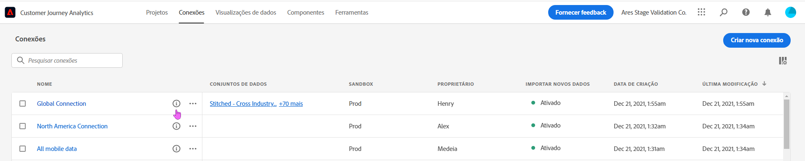
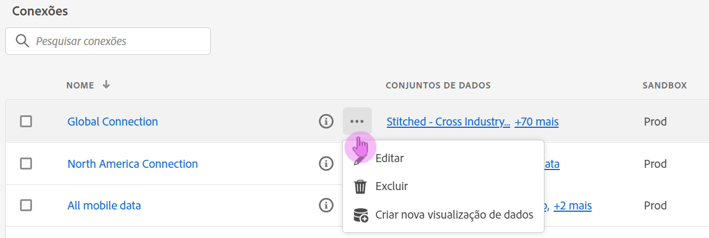

# Gerenciar conexões

Depois que usuários administradores [criam uma ou mais conexões](/help/connections/create-connection.md), eles podem gerenciá-las no Gerenciador de [!UICONTROL conexões]. A última atualização da experiência de conexão adiciona dois recursos importantes na página Detalhes da conexão, descrita mais adiante nesta página:

* Ela permite verificar o **status dos conjuntos de dados da sua conexão e do processo de assimilação**. Essa verificação de status permite saber quando seus dados estão disponíveis para que você possa entrar no Analysis Workspace e iniciar a análise.

* Ela permite **identificar quaisquer discrepâncias de dados** devido a uma configuração incorreta. Há alguma linha faltando? Em caso afirmativo, quais linhas estão faltando e por quê? Você configurou conexões incorretamente e causou a ausência de dados no Customer Journey Analytics?

Este é um vídeo sobre o novo Gerenciador de conexões:

>[!VIDEO](https://video.tv.adobe.com/v/342097/?quality=12&learn=on)

## Gerenciador de conexões {#connections-manager}

O Gerenciador de conexões permite:

* Visualizar imediatamente todas as suas conexões, incluindo o proprietário, a sandbox e quando elas foram criadas e modificadas.
* Visualizar todos os conjuntos de dados em uma conexão.
* Verificar o status de uma conexão.
* Exclua uma conexão.
* Renomeie uma conexão.
* Crie uma visualização de dados a partir de uma conexão.

### Configurações do Gerenciador de conexões

| Configuração | Descrição |
| --- | --- |
| [!UICONTROL Nome] | O nome amigável da conexão. Ao clicar no nome, você é levado para a página Detalhes da conexão descrita abaixo. |
| Informações da conexão | Clique no ícone de informações ao lado do nome da conexão para exibir as seguintes informações: |
| Editar uma conexão | Clique nas reticências (...) ao lado do nome da conexão e clique em [!UICONTROL Editar]. Para obter mais informações, consulte &quot;Editar conexão&quot; abaixo. |
| Exclua uma conexão | Clique nas reticências (...) ao lado do nome da conexão e clique em [!UICONTROL Excluir]. Mais informações no cabeçalho &quot;Excluir conexões&quot; abaixo. |
| Criar visualização de dados | Clique nas reticências (...) ao lado do nome da conexão e clique em [!UICONTROL Criar visualização de dados]. Essa ação cria uma nova visualização de dados com base nessa conexão. [Saiba mais](https://experienceleague.adobe.com/docs/analytics-platform/using/cja-dataviews/data-views.html?lang=pt-BR) |
| [!UICONTROL Conjuntos de dados] | Os conjuntos de dados que fazem parte da conexão. Você pode clicar no hiperlink para exibir todos os conjuntos de dados na conexão. Se você clicar em um conjunto de dados, ele será aberto em uma nova guia na Adobe Experience Platform. |
| [!UICONTROL Sandbox] | A [sandbox da Adobe Experience Platform](https://experienceleague.adobe.com/docs/experience-platform/sandbox/home.html?lang=pt-BR) da qual essa conexão obtém seus conjuntos de dados. Esta sandbox foi selecionada quando você criou a conexão pela primeira vez. Ela não pode ser alterada. |
| [!UICONTROL Proprietário] | A pessoa que criou a conexão. |
| [!UICONTROL Importar conjuntos de dados] | Permite ativar ou desativar o processo anteriormente chamado de “transmissão de dados”. |
| [!UICONTROL Data da criação] | A data em que a conexão foi criada pela primeira vez. |
| [!UICONTROL Última modificação] | A data em que a conexão foi atualizada pela última vez. |

### Excluir conexões {#connections-delete}

Somente administradores têm permissão para excluir uma conexão. Essa ação não é exibida para não administradores.

1. Clique nas reticências (...) ao lado do nome da conexão.
1. Clique em [!UICONTROL Excluir].

Quando você excluir uma conexão no [!UICONTROL Customer Journey Analytics], uma mensagem de erro indicará que:

* As exibições de dados criadas com base na conexão excluída deixarão de funcionar.
* Da mesma forma, qualquer projeto do Espaço de trabalho que dependa de visualizações de dados na conexão excluída deixará de funcionar.

[Saiba mais](/help/admin/cja-deletion.md) sobre as implicações da exclusão.

### Pesquisar uma conexão ou um conjunto de dados

Você pode pesquisar conexões usando a barra de Pesquisa na parte superior, abaixo do título [!UICONTROL Conexões].

### Classificar conexões

Para classificar as conexões, clique no cabeçalho de cada coluna e classifique-a em uma posição acima ou abaixo.

## Página Detalhes da conexão {#connection-detail}

A nova página Detalhes da conexão fornece uma exibição bastante detalhada do status de uma conexão.

Ele permite:

* Verifique o status dos conjuntos de dados da conexão e do processo de assimilação.
* Identifique problemas de configuração que fazem com que registros sejam ignorados ou excluídos.
* Veja quando os dados estão disponíveis para relatórios.

>[!IMPORTANT]
>Quaisquer dados assimilados antes de 13 de agosto de 2021 não serão refletidos nesta caixa de diálogo [!UICONTROL Conexões].

Veja as explicações sobre widgets e configurações:

### Configurações de detalhes da conexão

| Widget/Configuração | Descrição |
| --- | --- |
| Seletor de conjunto de dados | Permite escolher um dos conjuntos de dados na conexão ou todos eles. Não é possível selecionar vários conjuntos de dados simultaneamente. O padrão é [!UICONTROL Todos os conjuntos de dados]. |
| Calendário/Intervalos de datas | O intervalo de datas indica quando foram adicionados dados à conexão. Todas as predefinições de calendário padrão são incluídas. Você pode personalizar o intervalo de datas, mas intervalos de datas personalizados não serão exibidos na lista suspensa. |
| Widget de [!UICONTROL Registros de dados de eventos disponíveis] | Representa o número total de linhas de conjunto de dados de evento disponíveis para relatórios, **para toda a conexão**. Essa contagem independe de qualquer configuração de calendário. Ela será alterada se você selecionar um conjunto de dados por meio do seletor de conjunto de dados ou na tabela. (Observe que há uma latência de uma a duas horas para que os dados sejam mostrados no relatório, uma vez adicionados.) |
| Widget de [!UICONTROL Métricas] | Resume os registros de eventos adicionados/ignorados/excluídos e o número de lotes adicionados, **para o conjunto de dados e o intervalo de datas selecionados**. |
| Widget de [!UICONTROL Registros adicionados] | Indica quantas linhas foram adicionadas no período selecionado **para o conjunto de dados e o intervalo de datas selecionados**. Atualizado a cada dez minutos. 
**Observação**: Os dados de **[!UICONTROL Registros adicionados]** incluem apenas dados do evento no momento, não dados de perfil ou de pesquisa. |
| Widget de [!UICONTROL Registros ignorados] | Indica quantas linhas foram ignoradas no período selecionado **para o conjunto de dados e o intervalo de datas selecionados**. Os motivos para os registros serem ignorados são: carimbos de data e hora ausentes, ID de pessoa ausente ou inválida etc. Atualizado a cada dez minutos.
IDs de pessoa inválidas (como “não definida”, ou “00000000” ou qualquer combinação de números e letras em uma [!UICONTROL ID de pessoa] que aparece em um evento mais de 1 milhão de vezes em um determinado mês) não podem ser atribuídas a nenhum usuário ou pessoa específica. Elas não podem ser assimiladas no sistema e resultam em assimilação e relatórios propensos a erros. Para corrigir IDs de pessoa inválidas, você tem 3 opções:<ul><li>Usar [Cross-Channel Analytics](/help/cca/overview.md) para preencher as IDs de usuário indefinidas ou nulas com IDs de usuário válidas.</li><li>Apagar a ID de usuário, que também será ignorada durante a assimilação (preferível a IDs de usuário inválidas ou totalmente nulas).</li><li>Corrigir IDs de usuário inválidas em seu sistema antes de assimilar os dados.</li></ul>
**Observação**: Os dados de **[!UICONTROL Registros ignorados]** incluem apenas dados do evento no momento, não dados de perfil ou de pesquisa. |
| Widget de [!UICONTROL Registros excluídos] | Indica quantas linhas foram excluídas no período selecionado **para o conjunto de dados e o intervalo de datas selecionados**. Alguém pode ter excluído um conjunto de dados da Experience Platform, por exemplo. Atualizado a cada dez minutos. 
**Observação**: Os dados de **[!UICONTROL Registros excluídos]** incluem apenas dados do evento no momento, não dados de perfil ou de pesquisa. |
| Caixa de pesquisa de conjunto de dados | Você pode pesquisar pelo ou pela [!UICONTROL ID do conjunto de dados]. |
| [!UICONTROL Conjuntos de dados] | Exibe os conjuntos de dados que fazem parte da conexão. Você pode clicar no hiperlink para exibir todos os conjuntos de dados na conexão. |
| [!UICONTROL ID do conjunto de dados] | Essa ID é gerada automaticamente pela Adobe Experience Platform. |
| [!UICONTROL Lotes] | Indica quantos lotes de dados foram adicionados a esse conjunto de dados. |
| [!UICONTROL Última adição] | Exibe o carimbo de data e hora do último lote adicionado a esse conjunto de dados. |
| [!UICONTROL Tipo de conjunto de dados] | Esse conjunto de dados pode ser do tipo [!UICONTROL Evento], [!UICONTROL Consulta] ou [!UICONTROL Perfil]. [Saiba mais](https://experienceleague.adobe.com/docs/analytics-platform/using/cja-connections/create-connection.html?lang=pt-BR#configure-dataset) |
| Esquema | O esquema da Adobe Experience Platform no qual os conjuntos de dados nesta conexão se baseiam. |

### Configurações do painel direito no nível da conexão

| Configuração | Descrição |
| --- | --- |
| [!UICONTROL Atualizar] | Atualize a conexão para refletir registros adicionados recentemente. |
| [!UICONTROL Excluir] | Exclua esta conexão. |
| [!UICONTROL Criar visualização de dados] | Crie uma nova visualização de dados com base nesta conexão. [Saiba mais](https://experienceleague.adobe.com/docs/analytics-platform/using/cja-dataviews/data-views.html?lang=pt-BR) |
| [!UICONTROL Nome da conexão] | Exibe o nome amigável da conexão. |
| [!UICONTROL Descrição da conexão] | Exibe uma descrição mais detalhada que descreve idealmente a finalidade dessa conexão. |
| [!UICONTROL Sandbox] | A [sandbox da Adobe Experience Platform](https://experienceleague.adobe.com/docs/experience-platform/sandbox/home.html?lang=pt-BR) da qual essa conexão obtém seus conjuntos de dados. Essa sandbox foi selecionada quando você criou a conexão pela primeira vez. Ela não pode ser alterada. |
| [!UICONTROL ID da conexão] | Essa ID é gerada pelo sistema na Adobe Experience Platform. |
| [!UICONTROL Visualizações de dados usando conexão] | Lista todas as visualizações de dados que usam essa conexão. |
| [!UICONTROL Importar novos dados] | (Ligado/Desligado) Indica se novos lotes de dados devem ou não ser adicionados aos dados históricos (preenchimento retroativo). |
| [!UICONTROL Dados de preenchimento retroativo] | Os dados de preenchimento retroativo (históricos) são rastreados em três estados: [!UICONTROL Na fila], [!UICONTROL Em andamento] (com porcentagem de progresso indicada) e [!UICONTROL Concluído]. |
| [!UICONTROL Criado por] | Exibe o nome da pessoa que criou a conexão. |
| [!UICONTROL Última modificação] | Exibe a data e a hora da última modificação na conexão. |
| [!UICONTROL Modificado pela última vez por] | Mostra a pessoa que modificou a conexão pela última vez. |

### Configurações do painel direito no nível do conjunto de dados

| Configuração | Descrição |
| --- | --- |
| [!UICONTROL ID de pessoa] | Exibe uma identidade que foi definida no esquema do conjunto de dados na Experience Platform. Esta é a ID de pessoa que você escolheu durante a criação da conexão. Se você criar uma conexão que inclui conjuntos de dados com IDs diferentes, isso será refletido nos relatórios. Para unir, de fato, conjuntos de dados, é necessário usar a mesma ID de pessoa nos conjuntos de dados. |
| [!UICONTROL Registros disponíveis] | Representa o número total de linhas assimiladas para esse conjunto de dados durante o período específico selecionado no calendário. Não há latência para que os dados apareçam nos relatórios, uma vez adicionados. (A exceção é que, quando você criar uma conexão totalmente nova, haverá [latência](https://experienceleague.adobe.com/docs/analytics-platform/using/cja-overview/cja-faq.html?lang=pt-BR#3.-getting-data-into-customer-journey-analytics). |
| [!UICONTROL Registros adicionados] | Indica quantas linhas foram adicionadas no período selecionado. 
**Observação**: Os dados de **[!UICONTROL Registros adicionados]** incluem apenas dados do evento no momento, não dados de perfil ou de pesquisa. |
| [!UICONTROL Registros excluídos] | Indica quantos registros foram excluídos durante o período selecionado. 
**Observação**: Os dados de **[!UICONTROL Registros excluídos]** incluem apenas dados do evento no momento, não dados de perfil ou de pesquisa. |
| [!UICONTROL Lotes adicionados] | Indica quantos lotes de dados foram adicionados a esse conjunto de dados. |
| [!UICONTROL Registros ignorados] | Indica quantas linhas foram ignoradas durante a assimilação no período selecionado.
Os motivos para os registros serem ignorados são: carimbos de data e hora ausentes, ID de pessoa ausente ou inválida etc. Atualizado a cada dez minutos.
IDs de pessoa inválidas (como “não definida”, ou “00000000” ou qualquer combinação de números e letras em uma [!UICONTROL ID de pessoa] que aparece em um evento mais de 1 milhão de vezes em um determinado mês) não podem ser atribuídas a nenhum usuário ou pessoa específica. Elas não podem ser assimiladas no sistema e resultam em assimilação e relatórios propensos a erros. Para corrigir IDs de pessoa inválidas, você tem 3 opções:<ul><li>Usar [Cross-Channel Analytics](/help/cca/overview.md) para preencher as IDs de usuário indefinidas ou nulas com IDs de usuário válidas.</li><li>Apagar a ID de usuário, que também será ignorada durante a assimilação (preferível a IDs de usuário inválidas ou totalmente nulas).</li><li>Corrigir IDs de usuário inválidas em seu sistema antes de assimilar os dados.</li></ul>
**Observação**: Os dados de **[!UICONTROL Registros ignorados]** incluem apenas dados do evento no momento, não dados de perfil ou de pesquisa. |
| [!UICONTROL Última adição] | Indica quando o último lote foi adicionado. |
| [!UICONTROL Tipo de conjunto de dados] | [!UICONTROL Evento], [!UICONTROL Consulta] ou [!UICONTROL Perfil]. [Saiba mais](https://experienceleague.adobe.com/docs/analytics-platform/using/cja-connections/create-connection.html?lang=pt-BR#configure-dataset) |
| [!UICONTROL Esquema] | Mostra o esquema da Adobe Experience Platform no qual esse conjunto de dados se baseia. |
| [!UICONTROL ID do conjunto de dados] | Essa ID é gerada pelo sistema na Adobe Experience Platform. |

## Editar conexão

Permite que administradores editem a conexão. Selecione uma conexão e clique em [!UICONTROL Editar conexão] para acessar essa caixa de diálogo. Aqui, você pode fazer o seguinte:

* Iniciar e parar a importação de novos dados. Esse processo era conhecido anteriormente como “transmissão de dados”.
* Renomeie uma conexão.
* Atualize o(s) conjunto(s) de dados.
* Remova o(s) conjunto(s) de dados das conexões.

