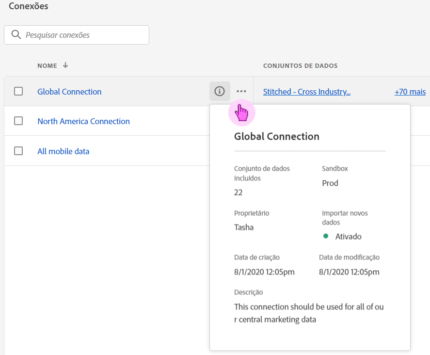
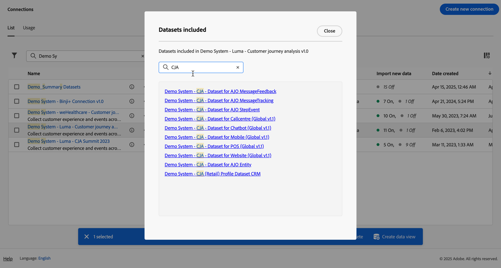
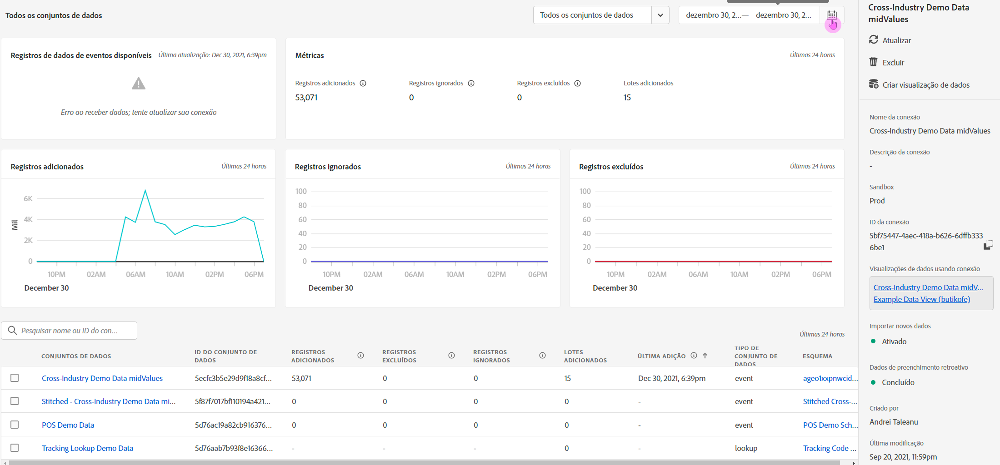

# Gerenciar conexões

Depois de [criar ou editar uma ou mais conexões](/help/connections/create-connection.md), você poderá gerenciá-las em **[!UICONTROL Conexões]**. As conexões permitem:

* Visualizar imediatamente todas as suas conexões, incluindo o proprietário, a sandbox e quando as conexões foram criadas e modificadas.
* Editar uma conexão.
* Exclua uma conexão.
* Crie uma visualização de dados a partir de uma conexão.
* Visualizar todos os conjuntos de dados em uma conexão.
* Verifique o status dos conjuntos de dados da sua conexão e o status do processo de assimilação. Por exemplo, quando seus dados estão disponíveis para que você possa começar com relatórios e análises no Analysis Workspace.
* Identifique quaisquer discrepâncias de dados devido a uma configuração incorreta. Há alguma linha faltando? Em caso afirmativo, quais linhas estão ausentes e por quê? Você configurou conexões incorretamente e causou a ausência de dados no Customer Journey Analytics?
* Obtenha insights sobre o uso de linhas assimiladas e reportáveis em todas as suas conexões.

[!UICONTROL Conexões] tem duas interfaces: [[!UICONTROL Lista]](#list) e [[!UICONTROL Uso]](#usage).

## Lista

A interface [!UICONTROL Lista] é a interface padrão para Conexões. Se não for selecionada, selecione a guia **[!UICONTROL Lista]** para acessar a interface.

A interface [!UICONTROL Lista] mostra uma tabela de todas as conexões disponíveis. Você pode pesquisar rapidamente por uma conexão usando a caixa Pesquisar .

As seguintes colunas ou ícones estão disponíveis na tabela.

| Coluna ou ícone | Descrição |
| --- | --- |
| [!UICONTROL Nome] | O nome amigável da conexão. Para ver os detalhes da conexão, selecione o nome do hiperlink. Consulte [Detalhes da conexão](#connection-details). |
|  | Para exibir informações sobre [!UICONTROL Conjuntos de Dados incluídos], [!UICONTROL Sandbox], [!UICONTROL Proprietário] e muito mais, selecione  ao lado do nome da conexão.
Uma janela pop-up exibe detalhes. 
 |
|  | Para [criar uma visualização de dados](#create-a-data-view) para a conexão, selecione . Esse ícone só é exibido quando nenhuma visualização de dados já está associada à conexão. |
|  | Selecione  para: 
 [Editar](#edit-a-connection) uma conexão.
 [Excluir](#delete-a-connection) uma conexão.
 [Criar nova visualização de dados](#create-a-data-view). Para criar visualizações de dados adicionais para a conexão. |
| [!UICONTROL Conjuntos de dados] | Um ou mais links para os conjuntos de dados que fazem parte da conexão. É possível selecionar o hiperlink do conjunto de dados para exibi-lo na conexão. Se mais conjuntos de dados fizerem parte da conexão selecionada, selecione **[!UICONTROL +*x* mais]** para mostrar um painel **[!UICONTROL Conjuntos de Dados incluídos]**. Esse painel mostra links para todos os conjuntos de dados e uma opção para procurar um conjunto de dados específico que faça parte da conexão.

Selecionar o nome de um conjunto de dados abre o conjunto de dados na interface do usuário do Experience Platform em uma nova guia. |
| [!UICONTROL Sandbox] | A [sandbox de Experience Platform](https://experienceleague.adobe.com/pt-br/docs/experience-platform/sandbox/home) da qual essa conexão obtém seus conjuntos de dados. Esta sandbox foi selecionada quando você criou a conexão pela primeira vez. Ela não pode ser alterada. |
| [!UICONTROL Proprietário] | A pessoa que criou a conexão. |
| [!UICONTROL Importar novos dados] | O status da importação de novos dados para conjuntos de dados: 
)    **[!UICONTROL _x _Em]**para conjuntos de dados configurados para importar novos dados e
   **[!UICONTROL _x Desativado_]** para conjuntos de dados não configurados para importar novos dados. |
| [!UICONTROL Data de criação] | O carimbo de data e hora quando a conexão foi criada. |
| [!UICONTROL Última modificação] | O carimbo de data e hora quando a conexão é atualizada pela última vez. |
| [!UICONTROL Dados de preenchimento retroativo] | O status para dados de preenchimento retroativo em conjuntos de dados.
   **[!UICONTROL _x _preenchimentos retroativos com falha]**para o número de preenchimentos retroativos com falha entre conjuntos de dados,
   **[!UICONTROL _x _preenchimentos retroativos processando]**para o número de preenchimentos retroativos de processamento em conjuntos de dados,
   **[!UICONTROL _x _preenchimentos retroativos concluídos]**para o número de preenchimentos retroativos concluídos para conjuntos de dados e
   **[!UICONTROL _Desativado_]** caso nenhum preenchimento retroativo seja definido para os conjuntos de dados na conexão. |

Para definir quais colunas serão exibidas, selecione , que mostra a caixa de diálogo **Personalizar tabela**, permitindo ativar ou desativar colunas na tabela.

### Editar uma conexão

1. Selecione  ao lado do nome da conexão
1. Selecione  **[!UICONTROL Editar]** no menu de contexto.

Como alternativa, você pode:

1. Selecione a linha de conexão.

1. Selecione  **[!UICONTROL Editar]** na barra azul.

Ao editar uma conexão, você pode:

* Iniciar e parar a importação de novos dados.
* Renomeie uma conexão.
* Atualize o(s) conjunto(s) de dados.
* Remova o(s) conjunto(s) de dados das conexões.

Consulte [Criar ou editar uma conexão](create-connection.md) para obter mais informações.

### Exclua uma conexão {#connections-delete}

1. Selecione  ao lado do nome da conexão.
1. Selecione  **[!UICONTROL Excluir]**.

Como alternativa, você pode:

1. Selecione a linha de conexão.

1. Selecione  **[!UICONTROL Excluir]** da barra azul.

Quando você exclui uma conexão, um painel **[!UICONTROL Excluir conexão]** indica quais visualizações de dados são excluídas e quais projetos do espaço de trabalho são afetados.

Selecione **[!UICONTROL Continuar]** para excluir a conexão.

Consulte [Implicações da exclusão](/help/technotes/deletion.md) para obter mais informações sobre a exclusão de uma conexão.

### Criar uma visualização de dados para uma conexão

* Se nenhuma visualização de dados estiver associada à conexão:

   1. Selecione  ao lado do nome da conexão.

* Se uma ou mais visualizações de dados já estiverem criadas para a conexão:

   1. Selecione  ao lado do nome da conexão.
   1. Selecione  **[!UICONTROL Criar nova visualização de dados]**.

Como alternativa, você pode:

1. Selecione a linha de conexão.

1. Selecione  **[!UICONTROL Criar visualização de dados]** na barra de botões azul.

Consulte [Criação e edição de uma visualização de dados](/help/data-views/create-dataview.md) para obter mais informações.

### Detalhes da conexão {#connection-detail}

Para acessar os detalhes de uma conexão, selecione um nome de conexão na tabela de conexões.

A interface de detalhes de Conexões fornece uma exibição detalhada do status de uma conexão. É possível:

* Verifique o status dos conjuntos de dados da conexão e do processo de assimilação.
* Identifique problemas de configuração que podem causar registros ignorados ou excluídos.
* Veja quando os dados estão disponíveis para relatórios.

| Interface do usuário | Descrição |
| --- | --- |
|  [!UICONTROL Editar Conexão] | Para editar os detalhes de uma conexão, selecione  **[!UICONTROL Editar Conexão]**. Consulte [Criar ou editar uma conexão](create-connection.md) para obter mais informações. |
| Seletor de conjunto de dados | Permite escolher um dos conjuntos de dados na conexão ou todos eles. Não é possível selecionar vários conjuntos de dados simultaneamente. O padrão é [!UICONTROL Todos os conjuntos de dados]. |
| Seletor de intervalo de datas | Edite a data de início e a data de término ou selecione  para abrir o seletor de intervalo de datas. No seletor de intervalo de datas, selecione um intervalo de datas usando um dos períodos predefinidos (por exemplo **[!UICONTROL Últimos 6 meses]**) ou use o calendário para selecionar a data inicial e final. Selecione **[!UICONTROL Aplicar]** para aplicar o novo intervalo de datas. |
| [!UICONTROL Registros de dados do evento disponíveis] | O número total de linhas de conjunto de dados de evento disponíveis para relatórios, **para toda a conexão**. Essa contagem independe de qualquer configuração de calendário. A contagem é alterada se você selecionar um conjunto de dados por meio do seletor de conjunto de dados ou na tabela. Depois que os dados são adicionados, há uma latência de 1 a 2 horas para que eles apareçam nos relatórios. |
| [!UICONTROL Métricas] | Resuma os registros de evento, pesquisa, perfil e conjunto de dados de resumo que são adicionados, ignorados e excluídos, e o número de lotes adicionados. Essas métricas são baseadas em **o conjunto de dados e o intervalo de datas selecionados**.
Selecione **[!UICONTROL Verificar detalhes]** para mostrar o pop-up **[!UICONTROL Verificar detalhes ignorados]**. O pop-up lista o número de registros ignorados e o motivo para todos os conjuntos de dados de evento ou conjuntos de dados selecionados.

Selecione o pop-up  com mais informações. Por alguns motivos ignorados, como [!UICONTROL ID de visitante vazia], o pop-up exibe um PSQL de Exemplo para EQS (Experience Platform para o Serviço de Consulta) que você pode usar no [Serviço de Consulta](https://experienceleague.adobe.com/pt-br/docs/experience-platform/query/home) para consultar os registros ignorados no conjunto de dados. Selecione  **[!UICONTROL Copiar PSQL de amostra para EQS]** para copiar o SQL. |
| [!UICONTROL Registros adicionados] | Indica quantas linhas foram adicionadas no período selecionado **para o conjunto de dados e o intervalo de datas selecionados**. Atualizado a cada dez minutos. |
| [!UICONTROL Registros ignorados] | Indica quantas linhas foram ignoradas no período selecionado **para o conjunto de dados e o intervalo de datas selecionados**. Os motivos para os registros serem ignorados são: carimbos de data e hora ausentes, ID de pessoa ausente ou inválida e assim por diante. Atualizado a cada dez minutos. 
IDs de pessoa inválidas (como `undefined` ou `00000000`, ou qualquer combinação de números e letras em uma [!UICONTROL ID de pessoa] que aparece em um evento mais de 1 milhão de vezes em um determinado mês) são IDs que não podem ser atribuídas a nenhum usuário ou pessoa específica. Essas linhas não podem ser assimiladas no sistema e resultam em assimilação e relatórios propensos a erros. Para corrigir IDs de pessoa inválidas, você tem 3 opções:<ul><li>Use a [compilação](/help/stitching/overview.md) para preencher as IDs de usuário indefinidas ou nulas com IDs de usuário válidas.</li><li>Apagar a ID de usuário, que é ignorada durante a assimilação (preferível a IDs de usuário inválidas ou totalmente nulas).</li><li>Corrigir IDs de usuário inválidas em seu sistema antes de assimilar os dados.</li></ul> |
| [!UICONTROL Registros] excluídos | Indica quantas linhas foram excluídas no período selecionado **para o conjunto de dados e o intervalo de datas selecionados**. Alguém pode ter excluído um conjunto de dados em [!DNL Experience Platform], por exemplo. Atualizado a cada dez minutos.
Em alguns cenários, esse valor também pode incluir registros substituídos, como na compilação ou em algumas atualizações de conjunto de dados de pesquisa. Considere este exemplo:
<ul><li>Você faz upload de um registro para um conjunto de dados de Perfil individual XDM, que o Customer Journey Analytics está configurado para assimilar como dados de pesquisa de perfil. Nos detalhes da conexão, esse conjunto de dados exibiria 1 registro adicionado.</li><li>Você faz upload de uma duplicata do registro original no mesmo conjunto de dados da AEP, que agora contém dois registros. O Customer Journey Analytics assimila o registro adicional do conjunto de dados de pesquisa de perfil. Ao ver que já assimilou um registro de perfil na conexão para essa ID de pessoa, o Customer Journey Analytics exclui sua versão anterior e adiciona os novos dados de perfil. Nos detalhes da conexão, essa ação representaria 1 registro adicionado e 1 registro excluído, pois o Customer Journey Analytics retém apenas os dados de pesquisa de perfil mais recentes para qualquer ID de pessoa assimilada.</li><li>No total, o conjunto de dados da AEP contém dois registros que são idênticos. Separadamente, os detalhes da conexão Customer Journey Analytics exibem o status dos dados assimilados: 2 registros adicionados e 1 registro excluído para esse conjunto de dados de perfil. </li></ul> |
|  _Pesquisar nome ou ID do conjunto de dados_ | Campo de pesquisa do conjunto de dados. Você pode pesquisar a tabela de conjuntos de dados por nome de conjunto de dados ou [!UICONTROL ID de conjunto de dados]. |
| [!UICONTROL Tabela de conjuntos de dados] | Os conjuntos de dados que fazem parte da conexão. |
| [!UICONTROL Conjuntos de dados] | O nome do conjunto de dados que faz parte da conexão. É possível selecionar o hiperlink para abrir o conjunto de dados na interface do usuário do Experience Platform em uma nova guia. Você pode marcar a linha ou a caixa de seleção para mostrar detalhes somente do conjunto de dados selecionado. |
| [!UICONTROL ID do conjunto de dados] | Gerado automaticamente pelo Experience Platform. |
| [!UICONTROL Registros adicionados] | O número de registros (linhas) do conjunto de dados adicionados a uma conexão durante o intervalo selecionado. |
| [!UICONTROL Registros ignorados] | O número de registros (linhas) de conjunto de dados ignorados durante a transferência de dados para uma conexão durante o intervalo selecionado. |
| [!UICONTROL Registros excluídos] | O número de registros (linhas) de conjunto de dados removidos de uma conexão durante o intervalo selecionado. |
| [!UICONTROL Lotes adicionados] | O número de lotes de conjuntos de dados foi adicionado a uma conexão. |
| [!UICONTROL Última adição] | O carimbo de data e hora do lote mais recente do conjunto de dados que foi adicionado a uma conexão. |
| [!UICONTROL Tipo de fonte de dados] | O tipo de origem do conjunto de dados. Você define o tipo de origem ao criar uma conexão. |
| [!UICONTROL Tipo de conjunto de dados] | O tipo de conjunto de dados para esse conjunto de dados. O tipo pode ser [!UICONTROL Evento], [!UICONTROL Perfil], [!UICONTROL Pesquisa] ou [!UICONTROL Resumo]. [Saiba mais](https://experienceleague.adobe.com/en/docs/analytics-platform/using/cja-connections/create-connection) |
| Esquema | O esquema de Experience Platform no qual o conjunto de dados se baseia. |
| [!UICONTROL Importar novos dados] | O status da importação de novos dados para o conjunto de dados: 
   **[!UICONTROL _x _Em]**se o conjunto de dados estiver configurado para importar novos dados e
   **[!UICONTROL _x Desativado_]** se o conjunto de dados estiver configurado para não importar nova importação de dados. |
| [!UICONTROL Transformar dados] | O status de transformação dos conjuntos de dados de pesquisa B2B aplicáveis. Consulte [Transformar conjuntos de dados para pesquisas B2B](transform-datasets-b2b-lookups.md) para obter mais informações.
   **[!UICONTROL _x _Em]**para conjuntos de dados aplicáveis habilitados para transformação, 
   **[!UICONTROL _x Desativado_]** para conjuntos de dados aplicáveis não habilitados para transformação e
**[!UICONTROL N/D]** para todos os outros conjuntos de dados, não aplicável para transformação. |
| [!UICONTROL Dados de preenchimento retroativo] | O status dos dados de preenchimento retroativo do conjunto de dados.
   **[!UICONTROL _x _preenchimentos retroativos com falha]**para o número de preenchimentos retroativos com falha,
   **[!UICONTROL _x _preenchimentos retroativos em processamento]**para o número de preenchimentos retroativos em processamento,
   **[!UICONTROL _x _preenchimentos retroativos concluídos]**para o número de preenchimentos retroativos concluídos e
   **[!UICONTROL _Desativado_]** caso os preenchimentos retroativos não estejam configurados. |
| [!UICONTROL Importar novos dados] | O status da importação de novos dados para o conjunto de dados: 
   **[!UICONTROL _x _Em]**se o conjunto de dados estiver configurado para importar novos dados e
   **[!UICONTROL _x Desativado_]** se o conjunto de dados estiver configurado para não importar novos dados. |
| [!UICONTROL Dados de preenchimento retroativo] | O status dos dados de preenchimento retroativo do conjunto de dados.
   **[!UICONTROL _x _preenchimentos retroativos com falha]**para o número de preenchimentos retroativos com falha,
   **[!UICONTROL _x _preenchimentos retroativos em processamento]**para o número de preenchimentos retroativos em processamento,
   **[!UICONTROL _x _preenchimentos retroativos concluídos]**para o número de preenchimentos retroativos concluídos e
   **[!UICONTROL _Desativado_]** caso nenhum preenchimento retroativo esteja configurado. |

>[!IMPORTANT]
>
>Quaisquer dados assimilados antes de 13 de agosto de 2021 não serão refletidos na interface das [!UICONTROL Conexões].

#### Painel Conexão

Quando nenhum conjunto de dados é selecionado na tabela de conjuntos de dados, um painel no lado direito da interface Conexões mostra opções e detalhes de conexão.

| Opções | Descrição |
| --- | --- |
|  [!UICONTROL Atualizar] | Para atualizar a conexão e permitir que registros adicionados recentemente sejam refletidos, selecione  **[!UICONTROL Atualizar]**. |
|  **[!UICONTROL Excluir]** | [Excluir](#delete-a-connection) esta conexão. |
|  **[!UICONTROL Criar exibição de dados]** | [Criar uma visualização de dados](#create-a-data-view) com base nesta conexão. Consulte [Visualizações de dados](https://experienceleague.adobe.com/en/docs/analytics-platform/using/cja-dataviews/data-views) para obter mais informações. |
| [!UICONTROL Nome da conexão] | O nome amigável da conexão. |
| [!UICONTROL Descrição da conexão] | Uma descrição mais detalhada que descreve a finalidade dessa conexão. |
| [!UICONTROL Sandbox] | A [sandbox de Experience Platform](https://experienceleague.adobe.com/pt-br/docs/experience-platform/sandbox/home) da qual essa conexão obtém seus conjuntos de dados. Esta sandbox foi selecionada quando você criou a conexão pela primeira vez. Ela não pode ser alterada. |
| [!UICONTROL ID da conexão] | Essa ID é gerada no Experience Platform. Você pode usar a  para copiar a ID. |
| [!UICONTROL Visualizações de dados usando conexão] | Lista todas as visualizações de dados que usam essa conexão. |
| [!UICONTROL Importar novos dados] | O status da importação de novos dados para conjuntos de dados: 
   **[!UICONTROL _x _Em]**para quantos conjuntos de dados estão configurados para importar novos dados e
   **[!UICONTROL _x Desativado_]** para quantos conjuntos de dados a nova importação de dados está desativada. |
| [!UICONTROL Dados de preenchimento retroativo] | O status dos dados de preenchimento retroativo para conjuntos de dados.
   **[!UICONTROL _x _preenchimentos retroativos com falha]**para o número de preenchimentos retroativos com falha entre conjuntos de dados,
   **[!UICONTROL _x _preenchimentos retroativos processando]**para o número de preenchimentos retroativos de processamento em conjuntos de dados,
   **[!UICONTROL _x _preenchimentos retroativos concluídos]**para o número de preenchimentos retroativos concluídos para conjuntos de dados e
   **[!UICONTROL _Desativado_]** caso nenhum preenchimento retroativo seja definido para os conjuntos de dados na conexão. |
| Transformar dados | O status de transformação dos conjuntos de dados de pesquisa B2B aplicáveis. Consulte [Transformar conjuntos de dados para pesquisas B2B](transform-datasets-b2b-lookups.md) para obter mais informações.
   **[!UICONTROL _x _Em]**para o número de conjuntos de dados habilitados para transformação. |
| [!UICONTROL Criado por] | O nome da pessoa que criou a conexão. |
| [!UICONTROL Última modificação] | O carimbo de data e hora da última alteração na conexão. |
| [!UICONTROL Modificado pela última vez por] | A pessoa que modificou a conexão pela última vez. |

#### Painel Conjunto de dados

Quando um conjunto de dados é selecionado na tabela de conjuntos de dados, um painel no lado direito da interface Conexões mostra detalhes para o conjunto de dados selecionado.

| Detalhes | Descrição |
| --- | --- |
| [!UICONTROL ID de pessoa] | Uma identidade que foi definida no esquema do conjunto de dados no Experience Platform. Essa identidade é a ID de pessoa selecionada durante a criação da conexão. Se você criar uma conexão que inclui conjuntos de dados com IDs diferentes, o relatórios refletirá isso. Para mesclar conjuntos de dados, é necessário usar a mesma ID de pessoa nos conjuntos de dados. |
| [!UICONTROL Chave] | A chave especificada para um conjunto de dados de pesquisa. |
| [!UICONTROL Chave correspondente] | A chave correspondente especificada para um conjunto de dados de pesquisa. |
| [!UICONTROL Carimbo de data e hora] | O carimbo de data e hora definido para um conjunto de dados de evento. |
| [!UICONTROL Registros disponíveis] | O número total de linhas assimiladas para esse conjunto de dados durante o período específico selecionado no calendário. Não há latência para que os dados apareçam nos relatórios, uma vez adicionados. No entanto, quando você cria uma conexão totalmente nova, há [latência](https://experienceleague.adobe.com/en/docs/analytics-platform/using/cja-overview/cja-faq). |
| [!UICONTROL Registros adicionados] | Quantas linhas foram adicionadas no período selecionado. |
| [!UICONTROL Registros excluídos] | Quantos registros foram excluídos durante o período selecionado. |
| [!UICONTROL Lotes adicionados] | Quantos lotes de dados foram adicionados a esse conjunto de dados. |
| [!UICONTROL Registros ignorados] | Quantas linhas foram ignoradas durante a assimilação no período selecionado.
Os motivos para os registros serem ignorados são: carimbos de data e hora ausentes, ID de pessoa ausente ou inválida e assim por diante. Atualizado a cada dez minutos.
IDs de pessoa inválidas (como `undefined` ou `00000000`, ou qualquer combinação de números e letras em uma [!UICONTROL ID de pessoa] que aparece em um evento mais de 1 milhão de vezes em um determinado mês) são IDs que não podem ser atribuídas a nenhum usuário ou pessoa específica. Essas linhas não podem ser assimiladas no sistema e resultam em assimilação e relatórios propensos a erros. Para corrigir IDs de pessoa inválidas, você tem 3 opções:<ul><li>Use a [compilação](/help/stitching/overview.md) para preencher as IDs de usuário indefinidas ou nulas com IDs de usuário válidas.</li><li>Apagar a ID de usuário, que é ignorada durante a assimilação (preferível a IDs de usuário inválidas ou totalmente nulas).</li><li>Corrigir IDs de usuário inválidas em seu sistema antes de assimilar os dados.</li></ul> |
| [!UICONTROL Última adição] | Quando o último lote foi adicionado. |
| [!UICONTROL Importar novos dados] | O status da importação de novos dados para o conjunto de dados: 
   **[!UICONTROL _x _Em]**se o conjunto de dados estiver configurado para importar novos dados e
   **[!UICONTROL _x Desativado_]** se o conjunto de dados estiver configurado para não importar novos dados. |
| [!UICONTROL Dados de preenchimento retroativo] | O status dos dados de preenchimento retroativo do conjunto de dados.
   **[!UICONTROL _x _preenchimentos retroativos com falha]**para o número de preenchimentos retroativos com falha,
   **[!UICONTROL _x _preenchimentos retroativos em processamento]**para o número de preenchimentos retroativos em processamento,
   **[!UICONTROL _x _preenchimentos retroativos concluídos]**para o número de preenchimentos retroativos concluídos e
   **[!UICONTROL _Desativado_]** caso nenhum preenchimento retroativo esteja configurado.
Para mostrar uma caixa de diálogo com uma visão geral dos preenchimentos retroativos anteriores do conjunto de dados, selecione  **[!UICONTROL Preenchimentos retroativos anteriores]**. |
| [!UICONTROL Tipo de fonte de dados] | Tipo de fonte de dados conforme definido ao adicionar o conjunto de dados à conexão. |
| [!UICONTROL Tipo de conjunto de dados] | [!UICONTROL Evento], [!UICONTROL Perfil], [!UICONTROL Pesquisa] ou [!UICONTROL Resumo]. [Saiba mais](https://experienceleague.adobe.com/en/docs/analytics-platform/using/cja-connections/create-connection) |
| [!UICONTROL Esquema] | O esquema de Experience Platform no qual esse conjunto de dados se baseia. |
| [!UICONTROL ID do conjunto de dados] | Essa ID do conjunto de dados é gerada no Experience Platform. |

## Uso

<!-- markdownlint-disable MD034 -->

>[!CONTEXTUALHELP]
>id="cja_connections_usage_keyusagemetrics"
>title="Principais métricas de uso"
>abstract="Forneça dados mensais e totais para linhas reportáveis principais e históricas."

<!-- markdownlint-enable MD034 -->

<!-- markdownlint-disable MD034 -->

>[!CONTEXTUALHELP]
>id="cja_connections_usage_monthlyingestedrows"
>title="Linhas assimiladas mensalmente"
>abstract="Mede o número total de registros adicionados ao sistema a cada mês para fornecer insights sobre o crescimento dos dados e as taxas de assimilação."

<!-- markdownlint-enable MD034 -->

<!-- markdownlint-disable MD034 -->

>[!CONTEXTUALHELP]
>id="cja_connections_usage_monthlyreportablerows"
>title="Linhas relatáveis mensalmente"
>abstract="Rastreia o número de linhas disponíveis para relatórios. Linhas relatáveis são as linhas assimiladas menos as linhas que são ignoradas e excluídas durante a assimilação. As linhas relatáveis servem como uma métrica principal para cobrança e uso de dados."

<!-- markdownlint-enable MD034 -->

<!-- markdownlint-disable MD034 -->

>[!CONTEXTUALHELP]
>id="cja_connections_usage_detailbreakdown"
>title="Detalhamento detalhado."
>abstract="Você pode visualizar métricas detalhadas por conexão, conjunto de dados, sandbox e tags, com a opção de baixar um arquivo CSV dos dados."

<!-- markdownlint-enable MD034 -->

<!-- markdownlint-disable MD034 -->

>[!CONTEXTUALHELP]
>id="cja_connections_usage_otherdatasets"
>title="Outros conjuntos de dados"
>abstract="Para meses antes de setembro de 2024, os dados foram coletados no nível do conjunto de dados e são exibidos como *Outros conjuntos de dados* para maior clareza. A partir de setembro de 2024, os dados serão coletados em um nível de conjunto de dados granular, e *Outros conjuntos de dados* não serão mais exibidos."

<!-- markdownlint-enable MD034 -->

<!-- markdownlint-disable MD034 -->

>[!CONTEXTUALHELP]
>id="cja_connections_usage_unknowndatasetsorconnections"
>title="Conjuntos de dados ou conexões desconhecidos"
>abstract="Conjuntos de dados ou conexões desconhecidos são exibidos usando suas IDs."

<!-- markdownlint-enable MD034 -->

<!-- markdownlint-disable MD034 -->

>[!CONTEXTUALHELP]
>id="cja_connections_usage_datanotavailable"
>title="Dados não disponíveis"
>abstract="Os dados históricos anteriores a setembro de 2024 não estão disponíveis devido a limitações do sistema. As métricas são coletadas e exibidas a partir de setembro de 2024. O gráfico mostra os últimos 18 meses na linha do tempo e dados futuros serão exibidos à medida que os dados forem disponibilizados."

<!-- markdownlint-enable MD034 -->

<!-- markdownlint-disable MD034 -->

>[!CONTEXTUALHELP]
>id="cja_connections_corereportablerows"
>title="Linhas relatáveis de dados principais"
>abstract="Exibe o número total de linhas disponíveis nos últimos 13 meses. Por exemplo, em 1º de fevereiro de 2024, o número mostra o total de linhas disponíveis com um carimbo de data e hora de evento de janeiro de 2023 a janeiro de 2024."

<!-- markdownlint-enable MD034 -->

<!-- markdownlint-disable MD034 -->

>[!CONTEXTUALHELP]
>id="cja_connections_historicalreportablerows"
>title="Linhas relatáveis de dados históricos"
>abstract="Exibe o número total de linhas disponíveis para o período com mais de 13 meses. Por exemplo, em 1º de fevereiro de 2024, o número mostra o total de linhas disponíveis com um carimbo de data e hora de evento anterior a janeiro de 2023."

<!-- markdownlint-enable MD034 -->

A interface [!UICONTROL Uso] mostra o uso de linhas assimiladas e reportáveis em todas as conexões. Essa interface permite determinar se o uso de Customer Journey Analytics está em conformidade com o que foi concordado contratualmente. Além dos propósitos de monitoramento, você pode usar a interface do usuário de Uso para planejar a renovação da licença de Customer Journey Analytics.

Você pode selecionar um intervalo de tempo (entre os últimos 6 meses, acumulado no ano ou os últimos 2 anos) e um intervalo (entre mensal ou trimestral) para monitorar o uso do Customer Journey Analytics. A interface do é dividida em duas seções:

* Linhas assimiladas: total de linhas assimiladas/enviadas de conjuntos de dados de evento em todas as Conexões Customer Journey Analytics, incluindo registros ignorados durante a assimilação
* Linhas relatáveis: total de linhas relatáveis que incluem todos os dados de eventos em todas as Conexões Customer Journey Analytics

Selecione a guia **[!UICONTROL Uso]** para acessar a interface.

### Relatório de uso

1. Selecione um **[!UICONTROL intervalo de tempo]**. Você pode selecionar entre **[!UICONTROL Últimos 6 meses]**, **[!UICONTROL Ano até a data]** ou **[!UICONTROL Últimos 2 Anos]**.
1. Selecione um **[!UICONTROL intervalo]**. Você pode selecionar entre **[!UICONTROL Mensal]** ou **[!UICONTROL Trimestral]**.

Para [!UICONTROL linhas assimiladas]:

* Um painel exibe o total de linhas assimiladas que incluem todos os dados de eventos em todas as conexões atualizadas a cada 2º dia de um mês. No painel:
   * uma caixa exibe o número de linhas assimiladas do último mês e a alteração em % (indicada por ▲ ou _) em relação ao mês anterior.
   * um gráfico de linhas exibe as ◼︎ [!UICONTROL linhas assimiladas mensalmente]. Para ver um pop-up que exibe o número de linhas assimiladas mensalmente para um mês, passe o mouse sobre qualquer ponto de dados no gráfico de linhas.

Para [!UICONTROL linhas relatáveis]:

* Um painel exibe o total de linhas reportáveis que incluem todos os dados de eventos em todas as conexões atualizadas a cada 2 dias de um mês. No painel:
   * uma caixa exibe o número total cumulativo de linhas reportáveis.
   * uma caixa exibe o número total de linhas reportáveis do último mês e a alteração em % (indicada por ▲ ou _) em relação ao mês anterior.
   * um gráfico de linhas exibe as ◼︎ [!UICONTROL linhas reportáveis mensais]. Para ver um pop-up que exibe o número de linhas reportáveis cumulativas para um mês específico, passe o mouse sobre qualquer ponto de dados no gráfico de linhas.
   * um gráfico de linhas exibe as [!UICONTROL ◼︎ linhas reportáveis cumulativas]. Para ver um pop-up que exibe o número de linhas mensais reportáveis para um mês, passe o mouse sobre qualquer ponto de dados no gráfico de linhas.

>[!MORELIKETHIS]
>
>[Exibir, solucionar problemas e modificar as configurações de conexão](https://experienceleague.adobe.com/en/docs/customer-journey-analytics-learn/tutorials/connections/connections-details-experience-in-cja).
