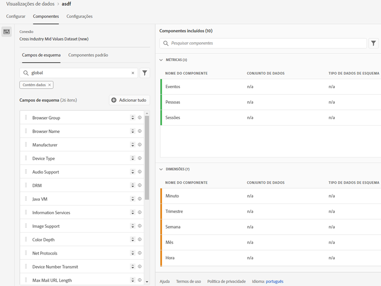
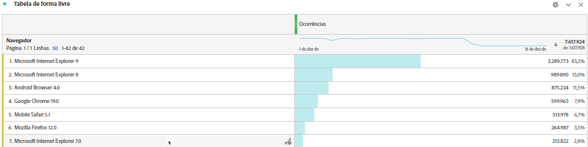

# Adicionar pesquisas padrão aos seus conjuntos de dados

>[!IMPORTANT]
>As Pesquisas padrão só estão disponíveis para fontes de dados do conector de origem do Analytics no Customer Journey Analytics. Você pode usá-las com implementações padrão do Adobe Analytics, com o [SDK da Web da Adobe Experience Platform](https://experienceleague.adobe.com/docs/experience-platform/edge/home.html?lang=pt-BR) ou com as APIs de coleção de dados da Experience Platform.

Pesquisas padrão (também conhecidas por pesquisas fornecidas pela Adobe) aprimoram a capacidade do Customer Journey Analytics em relatar algumas dimensões/atributos que não são úteis por si mesmos, mas são úteis quando unidos a outros dados. Exemplos incluem atributos de dispositivos móveis e atributos de dimensões de SO e navegador, como números de versão do navegador. Uma &quot;Pesquisa padrão&quot; é semelhante a um conjunto de dados de pesquisa. As pesquisas padrão são aplicáveis em organizações da Experience Cloud. Elas são automaticamente aplicadas a todos os conjuntos de dados de evento que contêm determinados campos de esquema XDM (veja abaixo os campos específicos). Existe um conjunto de dados de pesquisa padrão para cada localização de esquema que a Adobe está classificando.

No Adobe Analytics tradicional, essas dimensões são exibidas sozinhas, enquanto no Customer Journey Analytics, é necessário incluir essas dimensões ativamente ao criar visualizações de dados. No fluxo de trabalho Conexões, você seleciona um conjunto de dados que é sinalizado com uma chave para pesquisa padrão. A interface de exibições de dados de usuário inclui automaticamente todas as dimensões de pesquisa padrão disponíveis para relatórios. Os arquivos de pesquisa são automaticamente mantidos atualizados e disponíveis em todas as regiões e para todas as contas. Eles são armazenados em organizações específicas da região associadas ao cliente.

## Usar pesquisas padrão com conjuntos de dados do conector de origem do Analytics

Os conjuntos de dados de pesquisa padrão são aplicados automaticamente no momento do relatório. Se você usar o conector de origem do Analytics e trouxer uma dimensão para a qual o Adobe fornece uma pesquisa padrão, aplicaremos automaticamente essa pesquisa padrão. Se um conjunto de dados de evento contiver campos XDM, poderemos aplicar pesquisas padrão a ele.

<!--
### Specific IDs that need to be populated

The following IDs need to be populated in the specific XDM mixins for this functionality to work:

* Environment Details Mixin – device/typeID value populated - Must match Device Atlas IDs and will populate device data.
* Adobe Analytics ExperienceEvent Template Mixin or Adobe Analytics ExperienceEvent Full Extension Mixin with analytics/environment/browserIDStr and analytics/environment/operatingSystemIDStr. Both must match the Adobe IDs and  populate browser and OS data, respectively.

You need these mixins with the three IDs populated (device/typeID, environment/browserIDStr, and environment/operatingSystemIDStr). The lookup dimensions will then be pulled automatically by Customer Journey Analytics and will be available in the Data View.

The catch here is that they can only populate those IDs today if they have a direct relationship with Device Atlas. They are Device Atlas IDs, and they provide an API to allow a customer to look them up. This is a significant hurdle, and we may just want to take the reference to this capability out of the product documentation until we have a productized way to expose the Device Atlas ID lookup functionality.
-->

### Campos de pesquisa padrão disponíveis

* `browser`
   * `browser`, `group_id`, `id`
* `browser_group`
   * `browser_group`, `id`
* `os`
   * `os`, `group_id`, `id`
* `os_group`
   * `os_group`, `id`
* `mobile_audio_support - multi`
* `mobile_color_depth`
* `mobile_cookie_support`
* `mobile_device_name`
* `mobile_device_number_transmit`
* `mobile_device_type`
* `mobile_drm - multi`
* `mobile_image_support - multi`
* `mobile_information_services`
* `mobile_java_vm - multi`
* `mobile_mail_decoration`
* `mobile_manufacturer`
* `mobile_max_bookmark_url_length`
* `mobile_max_browser_url_length`
* `mobile_max_mail_url_length`
* `mobile_net_protocols - multi`
* `mobile_os`
* `mobile_push_to_talk`
* `mobile_screen_height`
* `mobile_screen_size`
* `mobile_screen_width`
* `mobile_video_support - multi`

## Relatório sobre dimensões de pesquisa padrão

Para relatar as dimensões de pesquisa padrão é necessário adicioná-las ao criar uma visualização de dados no Customer Journey Analytics:

Você poderá ver os dados de pesquisa no Espaço de trabalho:

