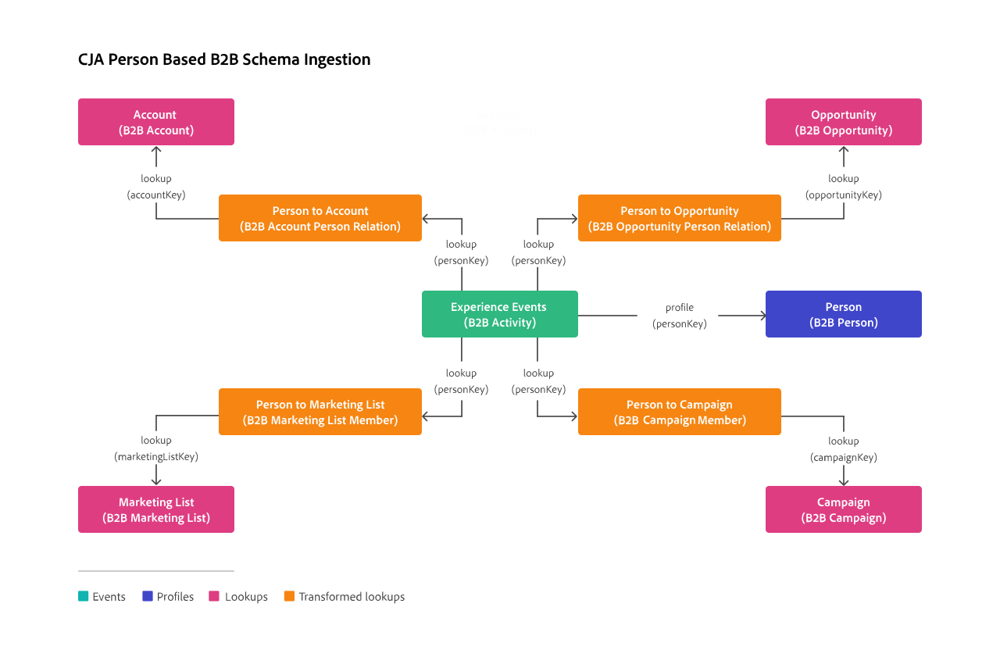

# Transformar conjunto de dados para pesquisas B2B

Para oferecer suporte a pesquisas com base em pessoas em dados B2B (incluindo contas, oportunidades, listas de marketing e campanhas), é necessária a transformação de conjuntos de dados de pesquisa B2B.

Essa transformação só está disponível para conjuntos de dados com dados para esquemas de pesquisa B2B, com base nas seguintes classes:

* [Relação pessoal da conta comercial XDM](https://experienceleague.adobe.com/en/docs/experience-platform/xdm/classes/b2b/business-account-person-relation)
* [Relação pessoal de oportunidade de negócios XDM](https://experienceleague.adobe.com/en/docs/experience-platform/xdm/classes/b2b/business-opportunity-person-relation)
* [Membros da Lista de Marketing Comercial XDM](https://experienceleague.adobe.com/en/docs/experience-platform/xdm/classes/b2b/business-marketing-list-members)
* [Membros da campanha de negócios XDM](https://experienceleague.adobe.com/en/docs/experience-platform/xdm/classes/b2b/business-campaign-members)

>[!NOTE]
>
>Há um limite máximo de 10.000 itens para cada ID. Essa limitação implica que para qualquer ID de pessoa específica você pode ter apenas 10.000 contas, 10.000 oportunidades ou 10.000 listas de marketing ou 10.000 campanhas.

>[!PREREQUISITES]
>
>Para que a assimilação funcione corretamente, você deve validar se os conjuntos de dados de pesquisa B2B têm dados preenchidos para os seguintes campos (conforme definido nos esquemas de pesquisa B2B):
>
>| Conjunto de dados que contém dados em conformidade com o esquema | Campo preenchido com dados |
>|---|---|
>| Relação pessoal da conta de negócios XDM | `accountPersonID` |
>| Pessoa de oportunidade de negócios XDM | `opportunityPersonID` |
>| Lista de marketing de negócios XDM | `marketingListMemberID` |
>| Membros da campanha de negócios XDM | `campaign.sourceKey` |
>

Para ativar a transformação para um conjunto de dados de pesquisa B2B:

* Verifique, para cada conjunto de dados, os valores sugeridos para **[!UICONTROL Chave]** e **[!UICONTROL Chave correspondente]**. Se alterar os valores dos valores sugeridos, você verá um aviso solicitando que continue. Você deve ter certeza de que:

   * O valor selecionado para **Chave** é baseado no tipo de dados da ID de pessoa.
   * O valor selecionado para **Chave Correspondente** é definido como o campo de identidade principal para o conjunto de dados do evento.

* Selecione as opções para importar novos dados e preenchimento retroativo de conjunto de dados.

* Selecione **[!UICONTROL Transformar conjunto de dados para pesquisas B2B]**.

  Essa opção transforma o conjunto de dados para que ele possa ser usado para pesquisas baseadas em pessoas em cenários B2B.

  >[!IMPORTANT]
  >
  >Uma vez ativada e quando a conexão é salva, a transformação é irreversível. Não é possível modificar a configuração das chaves Chave, Chave correspondente e Conjunto de dados Transformar. Você só pode remover, adicionar e reconfigurar o conjunto de dados.

Para habilitar a transformação para um ou mais conjuntos de dados que já fazem parte de uma conexão existente:

1. Remova os conjuntos de dados da conexão.
1. Salve a conexão.
1. Adicione os conjuntos de dados à conexão ao ativar a transformação para os conjuntos de dados.

## Informações de fundo

Os conjuntos de dados não transformados para esquemas baseados nas quatro classes de esquema mencionadas acima podem conter várias linhas para um único identificador de pessoa. As pesquisas com base em pessoas correspondem apenas à ocorrência mais recente desse identificador de pessoa, impedindo uma pesquisa adequada com base em ID de pessoa de contas, oportunidades, listas de marketing ou campanhas.

A transformação modifica o conjunto de dados de cada uma das quatro classes de esquema (laranja na ilustração abaixo) para que cada identificador de pessoa crie uma matriz (objeto) para os dados relevantes (contas, oportunidades, listas de marketing ou campanhas) nos conjuntos de dados de pesquisa (rosa na ilustração abaixo). Essa transformação permite o funcionamento correto de pesquisas baseadas em ID de pessoa.

