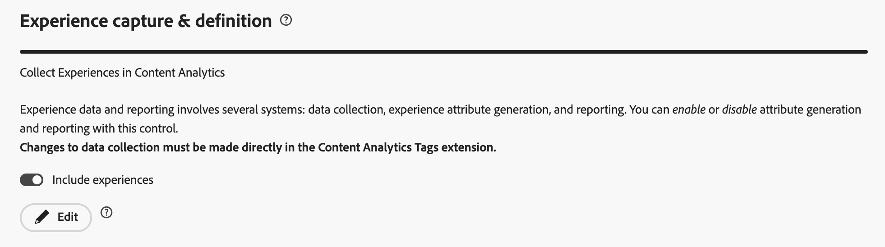

# Configuração guiada do Content Analytics

A configuração guiada ajuda a configurar o Content Analytics de forma rápida e fácil. A configuração guiada usa um assistente para definir os requisitos para configurar o Content Analytics automaticamente para sua organização. Na tela **[!UICONTROL Configuração]**, você pode criar uma nova configuração ou editar uma configuração existente.

>[!IMPORTANT]
>
>Você pode ter somente uma configuração do Content Analytics por sandbox em sua organização.

>[!NOTE]
>
>O assistente de configuração é compatível com várias visualizações de dados e canais, e é diferente da versão anterior, que oferecia suporte apenas a uma visualização de dados e somente ao canal da Web. Você precisa selecionar uma sandbox e uma conexão para poder selecionar uma ou mais visualizações de dados na seção [Visualizações de dados](#data-views). As configurações para **[!UICONTROL Captura de experiência]**, **[!UICONTROL Coleta de dados]** e **[!UICONTROL Substituições de cabeçalho]** dependem do canal e fazem parte de cada um dos canais configurados na seção [Canais](#channels).

Para acessar a configuração do Content Analytics

* Selecione **[!UICONTROL Gerenciamento de dados]** > **[!UICONTROL Configuração do Content Analytics]** no menu principal do Customer Journey Analytics.

Na tela **[!UICONTROL Configurações do Content Analytics]**, você verá uma tabela de configurações existentes do Content Analytics.

Para cada configuração, os seguintes detalhes estão disponíveis:

| Coluna | Descrição |
|---|---|
| **[!UICONTROL Nome]** | O nome da configuração. |
| **[!UICONTROL Criado por]** | A conta técnica que criou a configuração. |
| **[!UICONTROL Criada em]** | O carimbo de data e hora quando a configuração foi criada. |
| **[!UICONTROL Modificada em]** | O carimbo de data e hora quando a configuração foi modificada pela última vez. |
| **[!UICONTROL Sandbox]** | A sandbox na organização em que o Content Analytics é (planejada para ser) configurada e implementada. |
| **[!UICONTROL Status]** | O status da configuração. O status indica para quantos canais ativados a configuração foi concluída. Use  para abrir um pop-up com mais detalhes. |

Você pode usar  para personalizar a tabela. Selecione quais colunas serão exibidas na caixa de diálogo **[!UICONTROL Personalizar tabela]** e selecione **[!UICONTROL Aplicar]** para aplicar as alterações.

Na tela **[!UICONTROL Configuração]** do Content Analytics, você pode criar uma nova configuração ou editar uma configuração existente.

Para criar uma nova configuração:

* Selecione **[!UICONTROL Criar configuração]**. Esta ação abre o [assistente de configuração guiada](#guided-configuration-wizard).

Para editar uma configuração existente:

* Selecione  e depois  **[!UICONTROL Editar]** para editar uma configuração existente da Análise de conteúdo. Esta ação abre o [assistente de configuração guiada](#guided-configuration-wizard).

## Assistente de configuração guiada

O assistente de configuração guiado consiste em quatro seções ([Detalhes](#details), [Conexão](#connection), [Visualização de dados](#data-view) e [Canais](#channels)), cada uma solicitando os detalhes necessários para configurar o Content Analytics corretamente. Conclua cada seção antes de passar para a próxima seção, pois algumas configurações em uma seção podem depender dos valores de configuração nas seções anteriores.

### Detalhes {#onboarding-details}

>[!CONTEXTUALHELP]
>id="aca_onboarding_details_button"
>title="Detalhes"
>abstract="Insira um nome para a conexão. Nas seções **[!UICONTROL Exibição de dados]**, **[!UICONTROL Captura e definição de experiência]** e **[!UICONTROL Coleção de dados]**, é possível fornecer mais detalhes para garantir que a análise de conteúdo seja configurada corretamente."

>[!CONTEXTUALHELP]
>id="aca_onboarding_details_name_header"
>title="Detalhes"
>abstract="Este guia define os requisitos necessários para configurar o Content Analytics. Forneça um nome para esta configuração"

>[!CONTEXTUALHELP]
>id="aca_onboarding_connection_boldheader"
>title="Conexão"
>abstract="**Conexão**"

>[!CONTEXTUALHELP]
>id="aca_onboarding_connection_header"
>title="Conexão"
>abstract="Selecione uma conexão do Customer Journey Analytics para mesclar com os dados do Content Analytics."

Cada configuração requer um nome exclusivo. Por exemplo, `Example Content Analytics configuration`. O nome é necessário para salvar ou implementar uma configuração.

Para cada configuração, também é necessário selecionar a sandbox para a qual deseja configurar o Content Analytics.

* **[!UICONTROL Nome]**: cada configuração requer um nome exclusivo. Por exemplo, `Example Content Analytics configuration`. O nome é necessário para salvar ou implementar uma configuração.

* **[!UICONTROL Sandbox]**: a configuração requer uma sandbox. Selecione uma sandbox na lista de sandboxes às quais você tem acesso e na qual os dados são coletados que deseja usar para o Content Analytics.

  Se você alterar uma sandbox configurada para a qual definiu uma conexão e, opcionalmente, visualizações de dados, será notificado de que a conexão e as visualizações de dados precisam ser reconfiguradas.

### Conexão

É necessário selecionar uma conexão à qual deseja adicionar a coleção de dados do Content Analytics.

Se você não selecionou uma conexão para sua configuração:

1. Usar  **[!UICONTROL Selecione uma conexão]** para abrir a caixa de diálogo **[!UICONTROL Selecionar uma conexão]** que lista todas as conexões disponíveis na sandbox.
1. Na caixa de diálogo **[!UICONTROL Selecionar uma conexão]**, selecione  uma conexão que você deseja usar. Você só pode selecionar uma conexão.
1. Selecione **[!UICONTROL Usar conexão]**.

Se você já tiver selecionado uma conexão, mas quiser alterá-la:

1. Selecione  **[!UICONTROL Editar]**.
1. Na caixa de diálogo **[!UICONTROL Selecionar uma conexão]**, modifique a conexão que deseja usar.
1. Selecione **[!UICONTROL Usar conexão]**.

### Visualizações de dados {#onboarding-data-view}

>[!CONTEXTUALHELP]
>id="ac_onboarding_dataview_button"
>title="Visualização de dados"
>abstract="Para a configuração da análise de conteúdo, é necessário selecionar uma exibição de dados existente. Assim, você pode mesclar seus dados de Análise de Conteúdo com outros dados."

>[!CONTEXTUALHELP]
>id="aca_onboarding_dataview_header"
>title="Visualização de dados"
>abstract="Selecione uma visualização de dados já existente do Customer Journey Analytics com a qual você deseja mesclar seus dados de Análise de Conteúdo."

>[!CONTEXTUALHELP]
>id="aca_onboarding_dataview_header_alt"
>title="Visualização de dados"
>abstract="Selecione uma visualização de dados já existente do Customer Journey Analytics com a qual você deseja mesclar seus dados de Análise de Conteúdo. "

>[!CONTEXTUALHELP]
>id="aca_onboarding_dataview_change_dialog"
>title="Nova visualização de dados"
>abstract="Você selecionou uma nova exibição de dados para essa configuração. A nova exibição de dados será atualizada para incluir métricas e dimensões do Content Analytics. Estas métricas e dimensões serão removidas da visualização de dados selecionada originalmente.  Se uma conexão diferente estiver associada à nova exibição de dados, ela será atualizada para incluir conjuntos de dados do Content Analytics. Os conjuntos de dados do Content Analytics não são removidos da conexão selecionada originalmente."

>[!CONTEXTUALHELP]
>id="aca_onboarding_dataview_current_cleanup_labels_dialog"
>title="Limpar visualização de dados selecionada"
>abstract="Você selecionou uma visualização de dados já provisionada para o Content Analytics. A configuração existente do Content Analytics é removida e a visualização de dados é provisionada com sua nova configuração."

>[!CONTEXTUALHELP]
>id="aca_onboarding_dataview_prev_cleanup_labels_dialog"
>title="Limpar visualização de dados anterior"
>abstract="Você selecionou uma nova visualização de dados. A configuração do Content Analytics para a visualização de dados selecionada anteriormente é removida."

>[!CONTEXTUALHELP]
>id="aca_onboarding_dataview_new_dialog"
>title="Nova visualização de dados"
>abstract="Você selecionou uma nova exibição de dados para essa configuração. A nova exibição de dados será atualizada para incluir métricas e dimensões do Content Analytics. Métricas e dimensões semelhantes serão removidas da exibição de dados existente. Se uma conexão diferente estiver associada à nova exibição de dados, ela será atualizada para incluir conjuntos de dados do Content Analytics. Observe que os conjuntos de dados do Content Analytics não são removidos da configuração existente."

>[!CONTEXTUALHELP]
>id="ac_onboarding_dataviews_button"
>title="Exibição de dados"
>abstract="Para a configuração do Content Analytics, é necessário selecionar uma ou mais exibições de dados. Assim, você pode mesclar seus dados de Análise de Conteúdo com outros dados."

>[!CONTEXTUALHELP]
>id="aca_onboarding_dataviews_header"
>title="Visualizações de dados"
>abstract="Selecione uma ou mais visualizações de dados do Customer Journey Analytics para mesclar com os dados do Content Analytics."

>[!CONTEXTUALHELP]
>id="aca_onboarding_dataviews_header_alt"
>title="Visualizações de dados"
>abstract="Selecione uma ou mais visualizações de dados do Customer Journey Analytics para mesclar com os dados do Content Analytics. "

>[!CONTEXTUALHELP]
>id="aca_onboarding_dataviews_new_dialog"
>title="Visualizações de dados selecionadas"
>abstract="As visualizações de dados selecionadas foram modificadas para essa configuração. A visualização de dados selecionada será atualizada para incluir métricas e dimensões do Content Analytics. Essas métricas e dimensões serão removidas das visualizações de dados selecionadas anteriormente que não estão mais selecionadas.  Se uma conexão diferente estiver associada às visualizações de dados selecionadas, ela será atualizada para incluir conjuntos de dados do Content Analytics. Os conjuntos de dados do Content Analytics não são removidos da conexão selecionada originalmente.  Todas as visualizações de dados selecionadas herdam os canais que fazem parte dessa configuração."

>[!CONTEXTUALHELP]
>id="aca_onboarding_dataviews_change_dialog"
>title="Visualizações de dados selecionadas"
>abstract="As visualizações de dados selecionadas foram modificadas para essa configuração. A visualização de dados selecionada será atualizada para incluir métricas e dimensões do Content Analytics. Essas métricas e dimensões serão removidas das visualizações de dados selecionadas anteriormente que não estão mais selecionadas.  Se uma conexão diferente estiver associada à visualização de dados selecionada, ela será atualizada para incluir conjuntos de dados do Content Analytics. Os conjuntos de dados do Content Analytics não são removidos da conexão selecionada originalmente.  Todas as visualizações de dados selecionadas herdam os canais que fazem parte dessa configuração."

>[!CONTEXTUALHELP]
>id="aca_onboarding_dataviews_current_cleanup_labels_dialog"
>title="Visualizações de dados selecionadas"
>abstract="As visualizações de dados selecionadas foram modificadas para essa configuração. A visualização de dados selecionada será atualizada para incluir métricas e dimensões do Content Analytics. Essas métricas e dimensões serão removidas das visualizações de dados selecionadas anteriormente que não estão mais selecionadas.  Se uma conexão diferente estiver associada à visualização de dados selecionada, ela será atualizada para incluir conjuntos de dados do Content Analytics. Os conjuntos de dados do Content Analytics não são removidos da conexão selecionada originalmente.  Todas as visualizações de dados selecionadas herdam os canais que fazem parte dessa configuração."

>[!CONTEXTUALHELP]
>id="aca_onboarding_dataviews_prev_cleanup_labels_dialog"
>title="Visualizações de dados selecionadas"
>abstract="As visualizações de dados selecionadas foram modificadas para essa configuração. A visualização de dados selecionada será atualizada para incluir métricas e dimensões do Content Analytics. Essas métricas e dimensões serão removidas das visualizações de dados selecionadas anteriormente que não estão mais selecionadas.  Se uma conexão diferente estiver associada à visualização de dados selecionada, ela será atualizada para incluir conjuntos de dados do Content Analytics. Os conjuntos de dados do Content Analytics não são removidos da conexão selecionada originalmente.  Todas as visualizações de dados selecionadas herdam os canais que fazem parte dessa configuração."

>[!CONTEXTUALHELP]
>id="aca_onboarding_channels_button"
>title="Canais"
>abstract="Habilite e configure um ou mais canais para a configuração."

>[!CONTEXTUALHELP]
>id="aca_onboarding_channels_header"
>title="Canais"
>abstract="Habilite e configure um ou mais canais para a configuração. Todas as visualizações de dados que fazem parte da configuração herdam os canais ativados."

Sua configuração requer a seleção de uma ou mais [visualizações de dados](/help/data-views/data-views.md).

Se você não tiver selecionado visualizações de dados para sua configuração:

1. Use  **[!UICONTROL Selecionar exibição de dados]** para abrir a caixa de diálogo **[!UICONTROL Exibição de dados]**, que lista todas as exibições de dados disponíveis para a conexão configurada para o Content Analytics.
1. Na caixa de diálogo **[!UICONTROL Visualização de dados]**, selecione  uma ou mais visualizações de dados que você deseja usar.
1. Selecione **[!UICONTROL Salvar]**.

Se você já tiver selecionado uma ou mais visualizações de dados, mas quiser alterar essa seleção:

1. Selecione  **[!UICONTROL Editar seleção de visualização de dados]**.
1. Na caixa de diálogo **[!UICONTROL Visualização de dados]**, modifique a seleção  das visualizações de dados que você deseja usar.
1. Selecione **[!UICONTROL Salvar]**.

Depois de selecionar **[!UICONTROL Salvar]**, você verá uma caixa de diálogo **[!UICONTROL Visualizações de dados selecionadas]** que informa sobre as implicações da inclusão do Content Analytics nas visualizações de dados selecionadas. Selecione **[!UICONTROL Continuar]** para continuar ou **[!UICONTROL Cancelar]** para cancelar.

As seguintes ações estão disponíveis na caixa de diálogo **[!UICONTROL Visualização de dados]**:

* Para pesquisar uma visualização de dados específica, use o campo .
* Para filtrar a lista de visualizações de dados disponíveis, selecione . Você pode filtrar a lista em [!UICONTROL Proprietário]. Usar  **[!UICONTROL Ocultar filtros]** para ocultar o painel de segmentos.
* Para definir quais colunas serão exibidas na tabela, selecione . Selecione quais colunas serão exibidas na caixa de diálogo **[!UICONTROL Personalizar tabela]** e selecione **[!UICONTROL Aplicar]** para aplicar as alterações.

### Canais

Na seção **[!UICONTROL Canais]**, selecione os canais que deseja habilitar para o Content Analytics. Você pode selecionar entre **[!UICONTROL Celular]** e **[!UICONTROL Web]**.

* Para selecionar um canal que você ainda não configurou, selecione **[!UICONTROL Habilitar]**.
* Para selecionar um canal que já está configurado, mas cuja configuração você deseja alterar, selecione **[!UICONTROL Editar configuração]**.

Em seguida, você pode configurar o canal com mais detalhes. Esta configuração é diferente se você habilitar e configurar ou editar uma configuração para o canal [mobile](#mobile) ou [web](#web).

#### Dispositivo móvel {#mobile}

<!-- For updated ACA -->

>[!CONTEXTUALHELP]
>id="aca_onboarding_datacollection_mobile_experience_locations_boldheader"
>title="Coleção de dados de locais de experiência móvel"
>abstract="**Locais de experiência a serem excluídos**"

>[!CONTEXTUALHELP]
>id="aca_onboarding_datacollection_mobile_experience_locations_header"
>title="Coleção de dados de locais de experiência móvel"
>abstract="Indique quais locais de experiências devem ser **excluídos** ao coletar dados para o Content Analytics. Certifique-se de excluir as localizações de experiência com dados de identificação pessoal."

>[!CONTEXTUALHELP]
>id="aca_onboarding_datacollection_mobile_asset_locations_boldheader"
>title="Coleta de dados de locais de ativos móveis"
>abstract="**Locais de ativos a serem excluídos**"

>[!CONTEXTUALHELP]
>id="aca_onboarding_datacollection_mobile_asset_locations_header"
>title="Coleta de dados de locais de ativos móveis"
>abstract="Indique quais locais de ativos devem ser **excluídos** ao coletar dados para o Content Analytics. Certifique-se de excluir as localizações de ativos com dados de identificação pessoal."

>[!CONTEXTUALHELP]
>id="aca_onboarding_datacollection_mobile_asset_urls_boldheader"
>title="Coleta de dados de URLs de ativos móveis"
>abstract="**URLs de ativos a serem excluídos**"

>[!CONTEXTUALHELP]
>id="aca_onboarding_datacollection_mobile_asset_urls_header"
>title="Coleta de dados de URLs de ativos móveis"
>abstract="Indique quais URLs de ativos devem ser **excluídos** ao coletar dados para o Content Analytics. Certifique-se de excluir URLs de ativos com dados de identificação pessoal."

Para o canal móvel, você pode configurar a [captura e definição de experiência](#experience-capture-and-definition), a [coleção de dados](#data-collection) e as [substituições de cabeçalho](#header-overrides).

##### Captura e definição de experiência {#mobile-experience-capture-and-definition}

Nesta seção, você pode optar por incluir experiências nos dados móveis coletados com o Content Analytics.  Para o canal móvel, uma experiência é o que você registrou como uma experiência usando o Adobe Experience Platform SDK para Content Analytics.

Por padrão, **[!UICONTROL Incluir experiências]** está desabilitado.

Considere incluir experiências somente quando tiver instrumentado o aplicativo móvel para registrar experiências e rastrear visualizações de experiência e cliques de experiência.

##### Coleção de dados {#mobile-data-collection}

As configurações de coleta de dados permitem definir quais dados (locais de experiência, locais de ativos, URLs de ativos) você deseja coletar para o Content Analytics. Certifique-se de não coletar informações pessoalmente identificáveis como parte dessa coleta de dados.

Para configurar a coleta de dados do:

* Use uma propriedade de Tags para dispositivos móveis existente ou crie uma nova propriedade de Tags para dispositivos móveis.

   * Para usar uma propriedade existente de Tags para dispositivos móveis:

      1. Selecione **[!UICONTROL Escolher existente]**.
      2. Selecione uma propriedade existente no menu suspenso **[!UICONTROL Propriedade de tags]**. Comece a digitar para pesquisar e limitar as opções disponíveis. Não é possível selecionar uma propriedade Tags que outra configuração implementada do Content Analytics já usa.

   * Para criar uma nova propriedade de Tags para dispositivos móveis:

      1. Selecione **[!UICONTROL Criar nova]**.
      1. Especifique um **[!UICONTROL nome de tag]**, por exemplo, `ACA Test for Documentation`.
      1. Especifique **[!UICONTROL Domínios]**, por exemplo, `example.com`.

* Indique quais locais de experiência devem ser excluídos ao coletar dados para o Content Analytics. Certifique-se de excluir as localizações de experiência com dados de identificação pessoal.

  Especifique uma **[!UICONTROL Cadeia de caracteres de expressão regular]** para **[!UICONTROL Locais de experiência a serem excluídos]**.  Por exemplo: `^(?!.*documentation).*` para excluir todos os locais de experiência de documentação do Content Analytics.

* Indique quais locais de ativos devem ser excluídos ao coletar dados para o Content Analytics. Certifique-se de excluir as localizações de ativos com dados de identificação pessoal.

  Especifique uma **[!UICONTROL cadeia de caracteres de expressão regular]** para **[!UICONTROL locais de ativos a serem excluídos]**.  Por exemplo: `^(?!.*(logo\.jpg)).*$` para excluir todas as localizações de ativos com imagens de logotipo do JPEG da Content Analytics.

* Indique quais URLs de ativos devem ser excluídos ao coletar dados para o Content Analytics. Certifique-se de excluir URLs de ativos com dados de identificação pessoal.

  Especifique uma **[!UICONTROL cadeia de caracteres de expressão regular]** para **[!UICONTROL URLs de ativos a serem excluídos]**.  Por exemplo: `^(?!.*(logo\.jpg)).*$` para excluir todas as URLs de ativos referentes a imagens de logotipo do JPEG da Content Analytics.

##### Substituições de cabeçalho {#mobile-header-overrides}

<!-- needs modification for mobile channel -->

Opcionalmente, você pode especificar na seção **[!UICONTROL Substituições de cabeçalho]** um nome de cabeçalho e um valor de cabeçalho secreto.  Essa configuração de substituições de cabeçalho garante que o Content Analytics envie um cabeçalho HTTP personalizado para recuperar ativos de aplicativos móveis, ignorando a detecção de bot ou as tecnologias de marcação de tráfego.

1. Habilitar **[!UICONTROL Configurar substituições de cabeçalho]**.
1. Insira o **[!UICONTROL Nome do cabeçalho]**. Por exemplo, `x-asset-service`.
1. Insira o **[!UICONTROL Valor do cabeçalho]**. O que quer que você especifique é secreto e não visível na interface do usuário (a menos que você selecione explicitamente para revelar o valor  durante a entrada).

##### Salvar {#mobile-save}

Depois de configurar o canal móvel, selecione **[!UICONTROL Salvar]** para salvar a configuração. Selecione **[!UICONTROL Cancelar]** para cancelar a configuração.

#### Web {#web}

Para o canal Web, você pode configurar [captura e definição de experiência](#experience-capture-and-definition-1), [coleção de dados](#data-collection-1) e [substituições de cabeçalho](#header-overrides-1).

>[!CONTEXTUALHELP]
>id="aca_onboarding_experiences_button"
>title="Captura e definição de experiência"
>abstract="Você pode optar por incluir experiências nos dados coletados com o Content Analytics. Quando selecionada, é necessário definir uma ou mais combinações de um regex e parâmetros de consulta para decidir em quais URLs você deseja a inclusão de experiências."

>[!CONTEXTUALHELP]
>id="aca_onboarding_experiences_header"
>title="Captura e definição de experiência"
>abstract="Coletar experiências no Content Analytics"

>[!CONTEXTUALHELP]
>id="aca_onboarding_experiences_parameters_header"
>title="Captura e definição de experiência"
>abstract="Especifique os parâmetros que determinam como o conteúdo é renderizado no site."

>[!CONTEXTUALHELP]
>id="aca_onboarding_experiencecapture_new_include_experiences"
>title="Captura e definição de experiência"
>abstract="Quando habilitado, os dados de experiência são coletados, os atributos de experiência são gerados e os relatórios de experiência ficam disponíveis."

>[!CONTEXTUALHELP]
>id="aca_onboarding_experiencecapture_edit_include_experiences"
>title="Captura e definição de experiência"
>abstract="Quando habilitado, os dados de experiência são coletados, os atributos de experiência são gerados e os relatórios de experiência ficam disponíveis.   Use  **[!UICONTROL Editar]** para modificar a configuração de coleta de dados das experiências na propriedade de tags associada à configuração atual."

>[!CONTEXTUALHELP]
>id="aca_onboarding_experiencecapture_edit_button"
>title="Captura e definição de experiência"
>abstract="Você deve editar as configurações da coleta de dados da experiência na extensão do Adobe Content Analytics."

>[!CONTEXTUALHELP]
>id="aca_onboarding_datacollection_button"
>title="Coleção de dados"
>abstract="Defina qual propriedade de tags você deseja usar ou crie uma nova. Defina também as páginas e os ativos que deseja incluir ou excluir usando expressões regulares. Para uma implementação independente de tags, selecione **[!UICONTROL Criar novo]**.  Uma propriedade de Tags é criada, mas você não precisa usá-la."
>additional-url="https://experienceleague.adobe.com/en/docs/analytics-platform/using/content-analytics/configuration/tags-agnostic" text="Biblioteca JavaScript do Content Analytics"

>[!CONTEXTUALHELP]
>id="aca_onboarding_datacollection_tag_header"
>title="Coleção de dados"
>abstract="**Fornecer uma propriedade de tags**"

>[!CONTEXTUALHELP]
>id="aca_onboarding_datacollection_pages_excluded_boldheader"
>title="Coleção de dados"
>abstract="**Páginas a serem incluídas / excluídas**"

>[!CONTEXTUALHELP]
>id="aca_onboarding_datacollection_pages_excluded_header"
>title="Coleção de dados"
>abstract="Indique quais páginas devem ser **incluídas** ou **excluídas** ao coletar dados para o Content Analytics. Certifique-se de excluir páginas com dados de identificação pessoal."

>[!CONTEXTUALHELP]
>id="aca_onboarding_datacollection_assets_excluded_boldheader"
>title="Coleção de dados"
>abstract="**Ativos a serem incluídos / excluídos**"

>[!CONTEXTUALHELP]
>id="aca_onboarding_datacollection_assets_excluded_header"
>title="Coleção de dados"
>abstract="Indique quais ativos devem ser **incluídos** ou **excluídos** ao coletar dados para o Content Analytics. Certifique-se de excluir ativos com dados de identificação pessoal."

>[!CONTEXTUALHELP]
>id="aca_onboarding_datacollection_experiences_edit_button"
>title="Coleção de dados"
>abstract="Você pode editar as configurações das páginas na extensão do Adobe Content Analytics na propriedade de tags associada à configuração atual."

>[!CONTEXTUALHELP]
>id="aca_onboarding_datacollection_assets_edit_button"
>title="Coleção de dados"
>abstract="Você pode editar as configurações de ativos na extensão do Adobe Content Analytics na propriedade de tags associada à configuração atual."

>[!CONTEXTUALHELP]
>id="aca_onboarding_datacollection_tags_disabled_description "
>title="Propriedade de tags desabilitada"
>abstract="A extensão do Content Analytics já está ativa."

<!-- For updated ACA -->

>[!CONTEXTUALHELP]
>id="aca_onboarding_datacollection_web_pages_boldheader"
>title="Coleção de dados das páginas da Web"
>abstract="**Páginas a serem incluídas / excluídas**"

>[!CONTEXTUALHELP]
>id="aca_onboarding_datacollection_web_pages_header"
>title="Coleção de dados das páginas da Web"
>abstract="Indique quais páginas devem ser **incluídas** ou **excluídas** ao coletar dados para o Content Analytics."

>[!CONTEXTUALHELP]
>id="aca_onboarding_datacollection_web_assets_boldheader"
>title="Coleção de dados de ativos da Web"
>abstract="**Ativos a serem incluídos / excluídos**"

>[!CONTEXTUALHELP]
>id="aca_onboarding_datacollection_web_assets_header"
>title="Coleção de dados de ativos da Web"
>abstract="Indique quais ativos devem ser **incluídos** ou **excluídos** ao coletar dados para o Content Analytics. Certifique-se de excluir ativos com dados de identificação pessoal."

##### Captura e definição de experiência {#web-experience-capture-and-definition}

Nesta seção, você pode optar por incluir experiências nos dados da Web coletados com o Content Analytics.  Uma experiência consiste em todo o texto em uma página da Web que pode ser reproduzido usando o URL da visita inicial do usuário.

Por padrão, a opção **[!UICONTROL Incluir experiências]** está desativada. Quando selecionado, defina os URLs que deseja incluir nas experiências.

Inclua experiências somente nos seguintes casos:

* As páginas do site devem ser reproduzíveis usando o URL da página.
* O conteúdo de texto visualizado por qualquer usuário possa ser reproduzido usando o URL da página e não dependa de cookies ou outros mecanismos de personalização.

>[!IMPORTANT]
>
>Implemente o [controle de versão do Content Analytics](manual.md#versioning) para coletar alterações feitas nas experiências (páginas) sujeitas ao Content Analytics.

###### Nova configuração {#new-experiences-configuration}

Para incluir experiências em uma configuração nova ou não implementada:

1. Habilite a opção **[!UICONTROL Incluir experiências]**. O botão de alternância para habilitar experiências afeta o seguinte:

   * Coleta de dados na extensão do Content Analytics
   * O processo que gera atributos de experiência a partir de dados do evento do Content Analytics
   * O modelo de relatórios no Customer Journey Analytics.

1. Selecione **[!UICONTROL Adicionar Regex]** para adicionar uma combinação de uma expressão regular de domínio e parâmetros de consulta.
1. Especifique como o conteúdo é renderizado no site definindo combinações de uma **[!UICONTROL Expressão regular de domínio]** e **[!UICONTROL Parâmetros de consulta]** que afetam o conteúdo da página.
   1. Insira uma **[!UICONTROL expressão regular de domínio]**, por exemplo, `/^(?!.*\b(store|help|admin)\b)/`. Escape as expressões regulares usando `/`. A expressão regular de domínio indica a quais URLs esses parâmetros se aplicam. Por exemplo, é possível ter vários sites e parâmetros diferentes que direcionam o conteúdo para cada site. Se os parâmetros de consulta se aplicam a todas as suas páginas, você pode usar `.*` para indicar todas as páginas.
   1. Especifique uma lista separada por vírgulas de **[!UICONTROL Parâmetros de consulta]**, por exemplo `outdoors, patio, kitchen`.
1. Selecione **[!UICONTROL Remover]** se desejar remover uma combinação de expressão regular de domínio e parâmetros de consulta.
1. Selecione **[!UICONTROL Adicionar regex]** para adicionar outra combinação de uma expressão regular e parâmetros de consulta.

###### Configuração implementada {#implemented-experiences-configuration}

Para editar experiências existentes ou incluir novas experiências em uma configuração implementada:

* Habilitar ou desabilitar a opção **[!UICONTROL Incluir experiências]**:

   * O processo que gera atributos de experiência a partir de dados do evento do Content Analytics
   * O modelo de relatórios no Customer Journey Analytics.

* Selecione  **[!UICONTROL Editar]** para editar ainda mais a configuração da coleta de dados para experiências no Content Analytics. Sua tela será redirecionada para a [extensão do Adobe Content Analytics](https://experienceleague.adobe.com/pt-br/docs/experience-platform/tags/extensions/client/content-analytics/overview#configure-event-segmenting) na propriedade de tags associada à configuração atual.

##### Coleção de dados {#web-data-collection}

As configurações de coleta de dados permitem definir quais dados (páginas, ativos) você deseja coletar para o Content Analytics. Não colete informações de identificação pessoal como parte dessa coleta de dados.

Para configurar a coleta de dados do:

* Use uma propriedade de Tags da Web existente ou crie uma nova propriedade de Tags da Web.

   * Para usar uma propriedade existente de Tags da Web:

      1. Selecione **[!UICONTROL Escolher existente]**.
      2. Selecione uma propriedade existente no menu suspenso **[!UICONTROL Propriedade de tags]**. Comece a digitar para pesquisar e limitar as opções disponíveis. Não é possível selecionar uma propriedade Tags que outra configuração implementada do Content Analytics já usa.

   * Para criar uma nova propriedade de Tags da Web:

      1. Selecione **[!UICONTROL Criar nova]**.
      1. Especifique um **[!UICONTROL nome de tag]**, por exemplo, `ACA Test for Documentation`.
      1. Especifique **[!UICONTROL Domínios]**, por exemplo, `example.com`.

     Use uma nova propriedade de marcas se desejar criar uma implementação agnóstica de marcas para o canal da Web, usando a [biblioteca JavaScript do Content Analytics](/help/content-analytics/config/tags-agnostic.md). A propriedade Tags é criada, mas você não usará a propriedade na implementação agnóstica. No entanto, a implementação agnóstica exige que você execute o assistente de configuração guiada pelo menos uma vez.

* Indique quais páginas devem ser incluídas ou excluídas ao coletar dados para o Content Analytics. Certifique-se de excluir páginas com dados de identificação pessoal.

  Especifique uma **[!UICONTROL Cadeia de caracteres de expressão regular]** para **[!UICONTROL Páginas a serem incluídas/excluídas]**.  Por exemplo: `^(?!.*documentation).*` para excluir todas as páginas de documentação do Content Analytics.

* Indique quais ativos devem ser incluídos ou excluídos ao coletar dados para o Content Analytics. Certifique-se de excluir ativos com dados de identificação pessoal.

  Especifique uma **[!UICONTROL Cadeia de caracteres de expressão regular]** para **[!UICONTROL Ativo a ser incluído/excluído]**.  Por exemplo: `^(?!.*(logo\.jpg)).*$` para excluir todas as imagens JPEG de logotipo do Content Analytics.

##### Substituições de cabeçalho {#web-header-overrides}

>[!CONTEXTUALHELP]
>id="aca_onboarding_datacollection_header_overrides_boldheader"
>title="Substituições de cabeçalho"
>abstract="**Substituições de cabeçalho**"

>[!CONTEXTUALHELP]
>id="aca_onboarding_datacollection_header_overrides_header"
>title="Substituições de cabeçalho"
>abstract="Recurso avançado para ignorar a detecção de bots ou tráfego de porta. O Content Analytics inclui os cabeçalhos HTTP personalizados ao chamar os pontos de extremidade."

<!-- needs modification for mobile channel -->

Opcionalmente, você pode especificar na seção **[!UICONTROL Substituições de cabeçalho]** um nome de cabeçalho e um valor de cabeçalho secreto.  Essa configuração de substituição de cabeçalho garante que o Content Analytics envie cabeçalhos HTTP personalizados para ignorar qualquer detecção de bot ou tecnologia de marcação de tráfego que você tenha implementado.

1. Habilitar **[!UICONTROL Configurar substituições de cabeçalho]**.
1. Insira o **[!UICONTROL Nome do cabeçalho]**. Por exemplo, `x-asset-service`.
1. Insira o **[!UICONTROL Valor do cabeçalho]**. O que quer que você especifique é secreto e não visível na interface do usuário (a menos que você selecione explicitamente para revelar o valor  durante a entrada).

#### Salvar {#web-save}

Depois de especificar os detalhes do canal Web, selecione **[!UICONTROL Salvar]** para salvar a configuração. Selecione **[!UICONTROL Cancelar]** para cancelar a configuração.

### Resumo {#summary}

Depois de fornecer todas as informações necessárias, um resumo oferecerá detalhes sobre os artefatos criados ou modificados.

* Você vê um nome de configuração **[!UICONTROL Está quase tudo pronto para implementar _para o resumo do_Content Analytics]** ao implementar uma nova configuração.

* Para configurações implementadas existentes, você verá um nome de configuração **[!UICONTROL Você implementou _para o resumo do_Content Analytics]**.

### Ações {#actions}

>[!CONTEXTUALHELP]
>id="aca_onboarding_implementation_warning_dialog"
>title="Confirmação de implementação"
>abstract="Se você selecionar **[!UICONTROL Implementar]**, configurará o Content Analytics com base na entrada fornecida neste fluxo de trabalho. Várias configurações são escolhidas por padrão com base no que geralmente é útil para o Content Analytics, mas você (como controlador(a) de dados) deve revisar as configurações de cada artefato para confirmar se as configurações estão implementadas de acordo com sua política de privacidade, direitos e obrigações contratuais e requisitos de consentimento da lei aplicável.  Observe que nenhum dado será coletado até que a biblioteca de tags associada a esta configuração seja publicada manualmente.  Para derivar atributos de imagens e texto, a Adobe recuperará os atributos usando:<ol><li>O URL da página, capturado no momento da visita do usuário ao site de acordo com as configurações de coleta de dados configuradas e</li><li>O URL no qual a imagem está hospedada.</li></ol>Você não deve marcar imagens que estão hospedadas em sites de terceiros."

Ao criar ou editar uma configuração, você tem estas opções:

* **[!UICONTROL Descartar]**: todas as alterações feitas como parte da configuração são descartadas.
* **[!UICONTROL Salvar para mais tarde]**: as alterações feitas em uma configuração são salvas. Você pode rever a configuração posteriormente para fazer mais alterações ou implementar a configuração. É necessário somente um valor de [!UICONTROL Nome] para salvar uma configuração.
* **[!UICONTROL Implementar]**: as definições ou alterações feitas em uma configuração são salvas e implementadas. Todos os campos marcados como  precisam ter valores adequados. A implementação consiste em:

   * Configuração do **[!UICONTROL Customer Journey Analytics]**:
      * A visualização de dados selecionada é atualizada para incluir dimensões e métricas do Content Analytics.
      * A conexão vinculada à visualização de dados selecionada é modificada para incluir eventos e conjuntos de dados de atributos do Content Analytics.
      * Um modelo de relatório do Content Analytics é adicionado ao espaço de trabalho.

   * Configuração da **[!UICONTROL Adobe Experience Platform]**:
      * A criação de esquemas para modelar eventos do Content Analytics, atributos de ativos e (se configurados) atributos de experiência.
      * A criação de conjuntos de dados para coletar eventos do Content Analytics, atributos de ativos e (se configurados) atributos de experiência.
      * A criação de um fluxo de dados que usa o serviço de caracterização para gerar e atualizar atributos de conteúdo de eventos do Content Analytics.

   * Configuração da **[!UICONTROL Coleção de dados]**:
      * A propriedade de tags nova ou existente é configurada para dar auxiliar a coleta de dados do Content Analytics. Essa configuração implica a inclusão da extensão do Adobe Content Analytics para tags.
      * Uma sequência de dados é criada para eventos do Content Analytics.
      * A extensão do Adobe Content Analytics é configurada para garantir que os eventos do Content Analytics sejam enviados para a sequência de dados do Content Analytics.
      * Se o Web SDK ou o Mobile SDK não estiver configurado para a propriedade Tags, uma nova configuração do Web SDK ou do Mobile SDK será criada para enviar somente eventos do Content Analytics.
      * Se o Web SDK ou o Mobile SDK estiver configurado para a propriedade Tags, nenhuma alteração será feita na configuração existente do Web SDK ou do Mobile SDK.

* **[!UICONTROL Salvar]**: as alterações feitas em uma configuração implementada são salvas e a implementação é atualizada.
* **[!UICONTROL Sair]**. Sai da configuração guiada. Todas as alterações feitas em uma configuração implementada são descartadas.

## Publicar {#publish}

Para começar a coletar dados para a configuração do Content Analytics, você precisa [publicar manualmente](manual.md) as propriedades de marcas criadas para os canais que você habilitou.

>[!MORELIKETHIS]
>
>[Configuração manual](manual.md)
>

