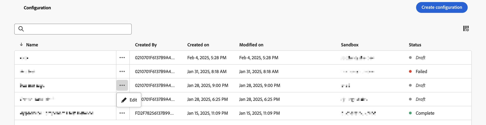
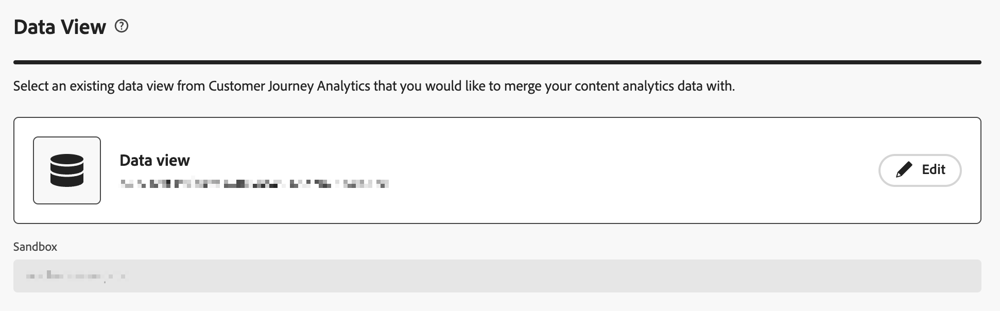

# Configuração guiada da Análise de conteúdo

A configuração guiada ajuda a configurar a Análise de conteúdo de forma rápida e fácil. A configuração guiada usa um assistente para definir os requisitos para configurar a Análise de conteúdo automaticamente para sua organização. Na tela **[!UICONTROL Configuração]**, você pode criar uma nova configuração ou editar uma configuração existente.

>[!IMPORTANT]
>
>Você pode ter somente uma configuração da Análise de conteúdo por sandbox em sua organização.

Para acessar a configuração da Análise de conteúdo

* Selecione **[!UICONTROL Data Management]** > **[!UICONTROL Content Analytics Configuration]** no menu principal do Customer Journey Analytics.

Na tela **[!UICONTROL Configurações do Content Analytics]**, você verá uma tabela de configurações existentes do Content Analytics.

Para cada configuração, os seguintes detalhes estão disponíveis:

| Coluna | Descrição |
|---|---|
| **[!UICONTROL Nome]** | O nome da configuração. |
| **[!UICONTROL Criado por]** | A conta técnica que criou a configuração. |
| **[!UICONTROL Criada em]** | O carimbo de data e hora quando a configuração foi criada. |
| **[!UICONTROL Modificada em]** | O carimbo de data e hora quando a configuração foi modificada pela última vez. |
| **[!UICONTROL Sandbox]** | A sandbox na organização em que a Análise de conteúdo é (planejada para ser) configurada e implementada. |
| **[!UICONTROL Status]** | O status da configuração. O status pode ser:  **[!UICONTROL Rascunho]**: a configuração é salva para depois e não é implantada.  **[!UICONTROL Falha]**: falha na configuração. Você pode selecionar **[!UICONTROL Editar]** para obter informações sobre a falha. A Adobe aborda proativamente qualquer falha na implementação. Você pode entrar em contato com o Atendimento ao cliente para obter detalhes.  **[!UICONTROL Concluído]**: a configuração foi concluída e implementada com êxito. |

Você pode usar  para personalizar a tabela. Selecione quais colunas serão exibidas na caixa de diálogo **[!UICONTROL Personalizar tabela]** e selecione **[!UICONTROL Aplicar]** para aplicar as alterações.

Na tela **[!UICONTROL Configuração]** da Análise de conteúdo, você pode criar uma nova configuração ou editar uma configuração existente.

Para criar uma nova configuração:

* Selecione **[!UICONTROL Criar configuração]**. Esta ação abre o [assistente de configuração guiada](#guided-configuration-wizard).

Para editar uma configuração existente:

* Selecione  e depois  **[!UICONTROL Editar]** para editar uma configuração existente da Análise de conteúdo. Esta ação abre o [assistente de configuração guiada](#guided-configuration-wizard).

## Assistente de configuração guiada

O assistente de configuração guiado consiste em quatro seções ([Detalhes](#details), [Visualização de dados](#data-view), [Captura e definição de experiência](#experience-capture-and-definition) e [Coleta de dados](#data-collection)), cada uma solicitando os detalhes necessários para configurar o Content Analytics corretamente. Conclua cada seção antes de passar para a próxima seção, pois algumas configurações em uma seção podem depender dos valores de configuração nas seções anteriores.

### Detalhes {#onboarding-details}

<!-- markdownlint-disable MD034 -->

>[!CONTEXTUALHELP]
>id="aca_onboarding_details_button"
>title="Detalhes"
>abstract="Insira um nome para a conexão. Nas seções **[!UICONTROL Exibição de dados]**, **[!UICONTROL Captura e definição de experiência]** e **[!UICONTROL Coleção de dados]**, é possível fornecer mais detalhes para garantir que a análise de conteúdo seja configurada corretamente."

>[!CONTEXTUALHELP]
>id="aca_onboarding_details_name_header"
>title="Detalhes"
>abstract="Este guia define os requisitos necessários para configurar a Análise de conteúdo. Forneça um nome para esta configuração"

<!-- markdownlint-enable MD034 -->

Cada configuração requer um nome exclusivo. Por exemplo, `Example Content Analytics configuration`. O nome é necessário para salvar ou implementar uma configuração.

### Visualização de dados {#onboarding-data-view}

<!-- markdownlint-disable MD034 -->

>[!CONTEXTUALHELP]
>id="ac_onboarding_dataview_button"
>title="Visualização de dados"
>abstract="Para a configuração da análise de conteúdo, é necessário selecionar uma exibição de dados existente. Assim, você pode mesclar seus dados de análise de conteúdo com outros dados."

>[!CONTEXTUALHELP]
>id="aca_onboarding_dataview_header"
>title="Visualização de dados"
>abstract="Selecione uma exibição de dados existente do Customer Journey Analytics com a qual você gostaria de mesclar os dados da análise de conteúdo."

>[!CONTEXTUALHELP]
>id="aca_onboarding_dataview_header_alt"
>title="Visualização de dados"
>abstract="Selecione uma exibição de dados existente do Customer Journey Analytics com a qual você gostaria de mesclar os dados da análise de conteúdo. "

>[!CONTEXTUALHELP]
>id="aca_onboarding_dataview_change_dialog"
>title="Nova visualização de dados"
>abstract="Selecionar uma nova exibição de dados atualizará essa exibição para incluir métricas e dimensões de análise de conteúdo. Se necessário, a conexão associada também é atualizada para incluir conjuntos de dados da Análise de conteúdo. A conexão e a exibição de dados configuradas atualmente para a Análise de conteúdo não são modificadas."

>[!CONTEXTUALHELP]
>id="aca_onboarding_dataview_current_cleanup_labels_dialog"
>title="Limpar visualização de dados selecionada."
>abstract="Você selecionou uma visualização de dados que já está provisionada para o Content Analytics. Essa configuração do Content Analytics é removida e a visualização de dados é provisionada com a nova configuração."

>[!CONTEXTUALHELP]
>id="aca_onboarding_dataview_prev_cleanup_labels_dialog"
>title="Limpar visualização de dados anterior"
>abstract="Você selecionou uma nova visualização de dados. A configuração do Content Analytics para a visualização de dados selecionada anteriormente é removida."

>[!CONTEXTUALHELP]
>id="aca_onboarding_dataview_new_dialog"
>title="Nova visualização de dados"
>abstract="Você selecionou uma nova visualização de dados para esta configuração. A nova visualização de dados será atualizada para incluir métricas e dimensões do Content Analytics. Métricas e dimensões semelhantes serão removidas da visualização de dados existente. Se uma conexão diferente estiver associada à nova visualização de dados, a conexão será atualizada para incluir conjuntos de dados do Content Analytics. Observe que os conjuntos de dados do Content Analytics não são removidos da configuração existente."

<!-- markdownlint-enable MD034 -->

Sua configuração exige a seleção de uma [Exibição de dados](/help/data-views/data-views.md).

1. Selecionar uma visualização de dados

   * Para selecionar uma nova visualização de dados para uma configuração, use  **[!UICONTROL Selecionar visualização de dados]**.

     

   * Para modificar uma exibição de dados para uma configuração, selecione  **[!UICONTROL Editar]**.

     

   Em ambos os cenários, você verá uma caixa de diálogo **[!UICONTROL Visualização de dados]**, na qual poderá selecionar uma visualização de dados para sua configuração.

   

   Para uma nova configuração, a lista mostra apenas as visualizações de dados associadas a sandboxes que não têm uma configuração ativa. Além disso, você só verá visualizações de dados associadas a sandboxes às quais você tem acesso e conexões às quais tem direito de modificar.

   Se você editar uma configuração existente, a lista mostrará apenas as visualizações de dados disponíveis na sandbox que já estão associadas à configuração existente.

   Você pode executar as seguintes ações:

   * Para procurar uma visualização de dados específica, use o campo .
   * Para filtrar a lista de visualizações de dados disponíveis, selecione . Você pode filtrar a lista em [!UICONTROL Conexão], [!UICONTROL Proprietário] e [!UICONTROL Sandbox]. Use  **[!UICONTROL Ocultar segmentos]** para ocultar o painel de segmentos.
   * Para definir quais colunas serão exibidas na tabela, selecione . Selecione quais colunas serão exibidas na caixa de diálogo **[!UICONTROL Personalizar tabela]** e selecione **[!UICONTROL Aplicar]** para aplicar as alterações.

1. Selecione  a exibição de dados que você deseja usar.
1. Selecione **[!UICONTROL Salvar]** para confirmar a visualização de dados selecionada. Selecione **[!UICONTROL Cancelar]** para cancelar.

No Customer Journey Analytics, uma [visualização de dados](/help/data-views/data-views.md) está vinculada a uma [conexão](/help/connections/overview.md) do Customer Journey Analytics. E uma conexão é baseada em uma sandbox na sua organização. Depois de salvar a configuração, o campo **[!UICONTROL Sandbox]** é preenchido automaticamente com o nome da sandbox, com base na visualização de dados selecionada.

### Captura e definição de experiência {#onboarding-experiences}

<!-- markdownlint-disable MD034 -->

>[!CONTEXTUALHELP]
>id="aca_onboarding_experiences_button"
>title="Captura e definição de experiência"
>abstract="É possível optar por incluir as experiências nos dados coletados com o Content Analytics. Quando selecionada, é necessário definir uma ou mais combinações de um regex e parâmetros de consulta para decidir em quais URLs você deseja a inclusão de experiências."

>[!CONTEXTUALHELP]
>id="aca_onboarding_experiences_header"
>title="Captura e definição de experiência"
>abstract="Coletar experiências no Content Analytics"

>[!CONTEXTUALHELP]
>id="aca_onboarding_experiences_parameters_header"
>title="Captura e definição de experiência"
>abstract="Especifique os parâmetros que determinam como o conteúdo é renderizado no site."

>[!CONTEXTUALHELP]
>id="aca_onboarding_experiencecapture_new_include_experiences"
>title="Captura e definição de experiência"
>abstract="Quando habilitada, os dados da experiência são coletados, os atributos são gerados e os relatórios ficam disponíveis."

>[!CONTEXTUALHELP]
>id="aca_onboarding_experiencecapture_edit_include_experiences"
>title="Captura e definição de experiência"
>abstract="Quando habilitada, os dados da experiência são coletados, os atributos são gerados e os relatórios ficam disponíveis.   Use  **[!UICONTROL Editar]** para modificar a configuração de coleta de dados para experiências na propriedade Tags associada à configuração atual."

>[!CONTEXTUALHELP]
>id="aca_onboarding_experiencecapture_edit_button"
>title="Captura e definição de experiência"
>abstract="Você deve editar as configurações para coleta de dados de experiência na extensão do Adobe Content Analytics."

<!-- markdownlint-enable MD034 -->

Nesta seção, você pode optar por incluir experiências nos dados coletados com o Content Analytics.  Uma experiência é todo o texto em uma página da Web que pode ser reproduzido usando o URL usado pelo usuário inicial que visita essa página da Web.

Por padrão, a opção **[!UICONTROL Incluir experiências]** está desativada. Quando selecionada, você deve definir para quais URLs deseja incluir experiências.

Considere incluir experiências somente quando o seguinte for aplicável:

* As páginas do site devem ser reproduzíveis usando o URL da página.
* O conteúdo de texto visto por qualquer usuário pode ser reproduzido usando o URL da página e não depende de cookies ou outros mecanismos de personalização.

>[!IMPORTANT]
>
>Implemente o [controle de versão do Content Analytics](manual.md#versioning) para coletar as alterações feitas nas experiências (páginas) sujeitas ao Content Analytics.

#### Nova configuração {#new-experiences-configuration}

Para incluir experiências em uma configuração nova ou não implementada:

1. Habilitar **[!UICONTROL Incluir experiências]**. A alternância para ativar experiências afeta o seguinte:

   * Coleta de dados na extensão do Content Analytics
   * O processo que gera atributos de experiência dos dados de evento do Content Analytics
   * O modelo de relatórios no Customer Journey Analytics.

1. Especifique os parâmetros de como o conteúdo é renderizado no site. Os parâmetros são zero ou mais combinações de uma **[!UICONTROL expressão regular de domínio]** e **[!UICONTROL parâmetros de consulta]**. Os parâmetros de consulta indicam quais parâmetros afetam o conteúdo da página. Essa entrada permite que o Content Analytics ignore quaisquer parâmetros que não afetem o conteúdo na página ao definir uma experiência exclusiva.
   1. Insira uma **[!UICONTROL Expressão regular de domínio]**, por exemplo `/^(?!.*\b(store|help|admin)\b)/`. Esvazie as expressões regulares usando `/`. A expressão regular do domínio indica a quais URLs esses parâmetros se aplicam. Por exemplo, você pode ter vários sites e, para cada site, parâmetros diferentes direcionam o conteúdo. Se os parâmetros de consulta se aplicam a todas as suas páginas, você pode usar `.*` para indicar todas as páginas.
   1. Especifique uma lista separada por vírgulas de **[!UICONTROL Parâmetros de consulta]**, por exemplo `outdoors, patio, kitchen`.
1. Selecione **[!UICONTROL Remover]** se desejar remover uma combinação de expressão regular de domínio e parâmetros de consulta.
1. Selecione **[!UICONTROL Adicionar Regex]** se quiser adicionar outra combinação de uma expressão regular e parâmetros de consulta.

#### Configuração implementada {#implemented-experiences-configuration}

Para editar experiências existentes ou incluir novas experiências em uma configuração implementada:

* Alternar **[!UICONTROL Incluir experiências]** para habilitar ou desabilitar:

   * O processo que gera atributos de experiência dos dados de evento do Content Analytics
   * O modelo de relatórios no Customer Journey Analytics.

* Selecione  **[!UICONTROL Editar]** para editar ainda mais a configuração da coleta de dados para experiências no Content Analytics. Você é redirecionado para a [extensão do Adobe Content Analytics](https://experienceleague.adobe.com/pt-br/docs/experience-platform/tags/extensions/client/content-analytics/overview#configure-event-segmenting) na propriedade Tags associada à configuração atual.

### Coleção de dados {#onboarding-data-collection}

Nesta seção, você configura como coletar os dados de análise de conteúdo.

<!-- markdownlint-disable MD034 -->

>[!CONTEXTUALHELP]
>id="aca_onboarding_datacollection_button"
>title="Coleção de dados"
>abstract="Defina qual propriedade de Tags deseja usar ou crie uma nova. Defina também as páginas e os ativos que deseja incluir ou excluir usando expressões regulares."

>[!CONTEXTUALHELP]
>id="aca_onboarding_datacollection_tag_header"
>title="Coleção de dados"
>abstract="**Fornecer uma propriedade de Tags**"

>[!CONTEXTUALHELP]
>id="aca_onboarding_datacollection_pages_excluded_boldheader"
>title="Coleção de dados"
>abstract="**Páginas a serem incluídas / excluídas**"

>[!CONTEXTUALHELP]
>id="aca_onboarding_datacollection_pages_excluded_header"
>title="Coleção de dados"
>abstract="Indique quais páginas devem ser **incluídas** ou **excluídas** ao coletar dados para a Análise de conteúdo"

>[!CONTEXTUALHELP]
>id="aca_onboarding_datacollection_assets_excluded_boldheader"
>title="Coleção de dados"
>abstract="**Ativos a serem incluídos / excluídos**"

>[!CONTEXTUALHELP]
>id="aca_onboarding_datacollection_assets_excluded_header"
>title="Coleção de dados"
>abstract="Indique quais ativos devem ser **incluídos** ou **excluídos** ao coletar dados para a Análise de conteúdo"

>[!CONTEXTUALHELP]
>id="aca_onboarding_datacollection_experiences_edit_button"
>title="Coleção de dados"
>abstract="É possível editar as configurações das páginas na extensão de análise de conteúdo da Adobe referente à propriedade de Tags associada à configuração atual."

>[!CONTEXTUALHELP]
>id="aca_onboarding_datacollection_assets_edit_button"
>title="Coleção de dados"
>abstract="É possível editar as configurações de ativos na extensão de análise de conteúdo da Adobe referente à propriedade de Tags associada à configuração atual."

>[!CONTEXTUALHELP]
>id="aca_onboarding_datacollection_tags_disabled_description "
>title="Propriedade de tags desabilitada"
>abstract="A extensão de análise de conteúdo já está ativa."

<!-- markdownlint-enable MD034 -->

#### Nova configuração {#new-configuration}

Em uma nova configuração, é necessário definir se você deseja usar uma propriedade de Tags existente ou criar uma nova propriedade de Tags. E você precisa definir as páginas e os ativos que deseja incluir ou excluir, usando expressões regulares.

* Para usar uma propriedade de Tags existente:

  

   1. Selecione **[!UICONTROL Escolher existente]**.
   2. Selecione uma propriedade existente no menu suspenso **[!UICONTROL Propriedade de marcas]**. Você pode começar a digitar para procurar e limitar as opções disponíveis. Não é possível selecionar uma propriedade Tags que já esteja sendo usada por outra configuração implementada do Content Analytics.

* Para criar uma nova propriedade de Tags:

  

   1. Selecione **[!UICONTROL Criar nova]**.
   1. Especifique um **[!UICONTROL Nome de marcas]**, por exemplo `ACA Test for Documentation`.
   1. Especifique **[!UICONTROL Domínios]**, por exemplo, `example.com`.

* Indique quais páginas devem ser incluídas ou excluídas ao coletar dados para o Content Analytics.

  Especifique uma cadeia de caracteres de expressão regular para **[!UICONTROL Páginas a serem incluídas/excluídas]**.  Por exemplo: `^(?!.*documentation).*` para excluir todas as páginas de documentação do Content Analytics.

* Indique quais ativos devem ser incluídos ou excluídos ao coletar dados para a Análise de conteúdo.

  Especifique uma cadeia de caracteres de expressão regular para **[!UICONTROL Assets a ser incluída/excluída]**.  Por exemplo: `^(?!.*(logo\.jpg|\.svg)).*$` para excluir todas as imagens de logotipo do JPEG e do SVG do Content Analytics.

>[!IMPORTANT]
>
>Remova manualmente a extensão automática incluída do Web SDK da propriedade de marcas recém-criada caso você tenha uma implementação existente do Web SDK que use a [biblioteca do JavaScript](https://experienceleague.adobe.com/pt-br/docs/experience-platform/web-sdk/install/library) em vez da [extensão de marcas](https://experienceleague.adobe.com/pt-br/docs/experience-platform/tags/extensions/client/web-sdk/web-sdk-extension-configuration).
>

#### Configuração existente {#existing-configuration}

Para uma configuração existente, não é possível editar a propriedade Tags. No entanto, é possível editar as páginas e os ativos para incluir ou excluir.

* Para editar quais páginas devem ser incluídas ou excluídas ao coletar dados para a Análise de Conteúdo, selecione  **[!UICONTROL Editar]** abaixo de **[!UICONTROL Experiência]**. Você é redirecionado para a [extensão do Adobe Content Analytics](https://experienceleague.adobe.com/pt-br/docs/experience-platform/tags/extensions/client/content-analytics/overview#configure-event-segmenting) associada à propriedade Tags da configuração atual do Content Analytics. É possível editar a expressão regular para incluir ou excluir páginas. Certifique-se de [publicar](#publish) suas alterações.

* Para editar quais ativos devem ser incluídos ou excluídos ao coletar dados para a Análise de conteúdo, selecione  **[!UICONTROL Editar]** abaixo de **[!UICONTROL Ativo]**. Você é redirecionado para a [extensão do Adobe Content Analytics](https://experienceleague.adobe.com/pt-br/docs/experience-platform/tags/extensions/client/content-analytics/overview#configure-event-segmenting) associada à propriedade Tags da configuração atual do Content Analytics. É possível editar a expressão regular para incluir ou excluir ativos. Certifique-se de [publicar](#publish) suas alterações.

### Resumo {#summary}

Depois de fornecer todos os detalhes necessários, um resumo fornecerá detalhes sobre os artefatos criados ou modificados.

* Você vê um nome de configuração **[!UICONTROL Está quase tudo pronto para implementar _para o resumo da_Análise de conteúdo]** ao implementar uma nova configuração.

* Para configurações implementadas existentes, você verá um nome de configuração **[!UICONTROL Você implementou _para o resumo da_Análise de conteúdo]**.

### Ações {#actions}

<!-- markdownlint-disable MD034 -->

>[!CONTEXTUALHELP]
>id="aca_onboarding_implementation_warning_dialog"
>title="Confirmação de implementação"
>abstract="Se você selecionar **[!UICONTROL Implementar]**, configurará a Análise de conteúdo com base na entrada fornecida neste fluxo de trabalho. Há várias configurações definidas por padrão com base no que geralmente é útil para a análise de conteúdo, mas você (como controlador(a) de dados) deve revisar as configurações de cada artefato para confirmar se estão implementadas de acordo com a política de privacidade, os direitos e obrigações contratuais e os requisitos de consentimento da legislação aplicável.  Observe que nenhum dado será coletado até que a biblioteca de tags associada a esta configuração seja publicada manualmente.  Para derivar atributos de imagens e texto, a Adobe recupera os atributos usando:<ol><li>O URL capturado no momento da visita do usuário ao site, de acordo com as configurações de coleta de dados que você configurou e</li><li>O URL no qual a imagem está hospedada.</li></ol>Você não deve marcar imagens que estão hospedadas em sites de terceiros."

<!-- markdownlint-enable MD034 -->

Ao criar ou editar uma configuração, você tem estas opções:

* **[!UICONTROL Descartar]**: todas as alterações feitas como parte da configuração são descartadas.
* **[!UICONTROL Salvar para mais tarde]**: as alterações feitas em uma configuração são salvas. Você pode rever a configuração em um estágio posterior para fazer mais alterações ou implementar a configuração. Somente um valor para [!UICONTROL Name] é necessário para salvar uma configuração.
* **[!UICONTROL Implementar]**: as configurações ou alterações feitas em uma configuração são salvas e implementadas. Todos os campos marcados como  precisam ter valores adequados. A implementação consiste em:

   * Configuração do **[!UICONTROL Customer Journey Analytics]**:
      * A visualização de dados selecionada é atualizada para incluir dimensões e métricas do Content Analytics.
      * A Conexão vinculada à visualização de dados selecionada é modificada para incluir eventos Content Analytics e conjuntos de dados de atributos.
      * Um modelo de relatório de Análise de conteúdo é adicionado ao Espaço de trabalho.

   * Configuração da **[!UICONTROL Adobe Experience Platform]**:
      * A criação de esquemas para modelar eventos da Análise de conteúdo, atributos de ativos e (se configurados) atributos de experiência.
      * A criação de conjuntos de dados para coletar eventos da Análise de conteúdo, atributos de ativos e (se configurados) atributos de experiência.
      * A criação de um fluxo de dados que usa o serviço de caracterização para gerar e atualizar atributos de conteúdo de eventos da Análise de conteúdo.

   * Configuração da **[!UICONTROL Coleção de dados]**:
      * A propriedade Tags nova ou existente está configurada para ser compatível com a coleção de dados do Content Analytics. Essa configuração implica a inclusão da extensão de Análise de conteúdo da Adobe para tags.
      * Uma sequência de dados é criada para eventos da Análise de conteúdo.
      * A extensão de Análise de conteúdo da Adobe é configurada para garantir que os eventos de Análise de conteúdo sejam enviados para a sequência de dados da Análise de conteúdo.
      * Se o SDK da web não estiver configurado para a propriedade de tags, uma nova configuração do SDK da web será criada para enviar somente eventos da Análise de conteúdo.
      * Se o Web SDK estiver configurado para essa propriedade de Tags, nenhuma alteração será feita na configuração existente do Web SDK.

* **[!UICONTROL Salvar]**: as alterações feitas em uma configuração implementada são salvas e a implementação é atualizada.
* **[!UICONTROL Sair]**. Sai da configuração guiada. Todas as alterações feitas em uma configuração implementada são descartadas.

## Publicar {#publish}

Para começar a coletar dados para sua configuração do Content Analytics, você precisa [publicar manualmente](manual.md) a propriedade de marcas criada após selecionar **[!UICONTROL Implementar]**.

>[!MORELIKETHIS]
>
>[Configuração manual](manual.md)
>
