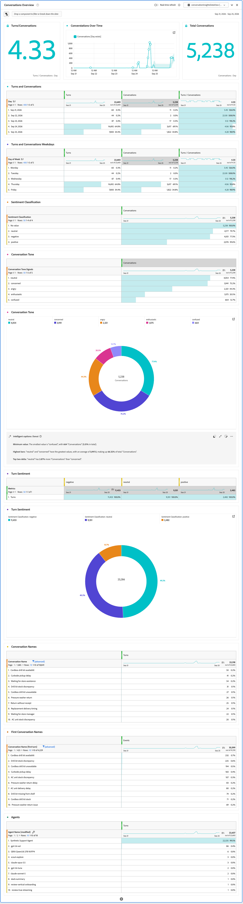

# Analisar Insights de Conversa

## Análise simples

Para analisar Insights de conversa, crie ou edite um projeto no Analysis Workspace e use uma das visualizações de dados configuradas como a visualização de dados para um ou mais painéis no seu projeto.

+++ Exemplo de projeto

+++

## Análise de conversas em escala e em contexto

Para analisar conversas em escala e fornecer contexto para essas conversas na jornada completa do cliente:

* Combine seus eventos de Insights de conversa com outros conjuntos de dados de evento e conjuntos de dados de perfil e pesquisa adicionais. Adicione esses conjuntos de dados à conexão selecionada para a configuração do Insights de conversa.
* Adicione mais componentes (métricas e dimensões) às visualizações de dados selecionadas para a configuração de Insights de conversa.

+++ Exemplo de projeto

A determinar.

+++ 
