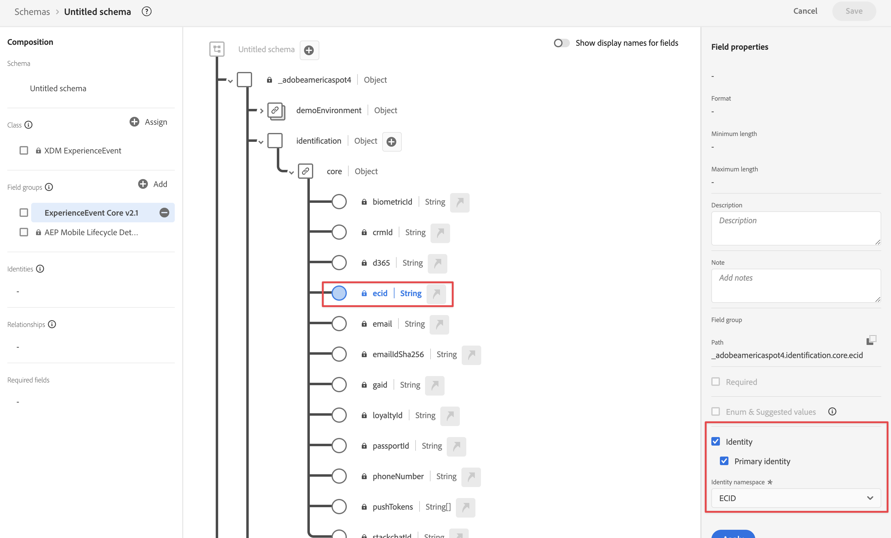

# Assimilar dados por meio do SDK móvel do Adobe Experience Platform

Este guia de início rápido explica como você pode assimilar dados de rastreamento de aplicativos móveis diretamente na Adobe Experience Platform usando o SDK móvel da Adobe Experience Platform e a rede de borda. Em seguida, use esses dados no Customer Journey Analytics.

Para isso, é necessário:

- **Configurar um esquema e um conjunto de dados** na Adobe Experience Platform para definir o modelo (esquema) dos dados que você deseja coletar e onde realmente coletar os dados (conjunto de dados).

- **Configurar um armazenamento de dados** para configurar a Rede de borda da Adobe Experience Platform para direcionar seus dados coletados para o conjunto de dados configurado na Adobe Experience Platform.

- **Usar tags** para configurar facilmente regras e elementos de dados em relação aos dados no aplicativo móvel. Em seguida, verifique se os dados são enviados para a sequência de dados configurada na Rede de borda da Adobe Experience Platform.

- **Implantar e validar**. Tenha um ambiente em que possa interagir com o desenvolvimento de tags e, uma vez que tudo esteja validado, publique-o ao vivo no ambiente de produção.

- **Configurar uma conexão** no Customer Journey Analytics. Essa conexão deve (pelo menos) incluir o conjunto de dados da Adobe Experience Platform.

- **Configurar uma visualização de dados** no Customer Journey Analytics para definir métricas e dimensões que você deseja usar no Analysis Workspace.

- **Configurar um projeto** no Customer Journey Analytics para criar relatórios e visualizações.

>[!NOTE]
>
>Este guia de início rápido é um guia simplificado sobre como assimilar dados coletados de seu aplicativo na Adobe Experience Platform e usar no Customer Journey Analytics. É altamente recomendável estudar as informações adicionais quando referidas.

## Configurar um esquema e um conjunto de dados

Para assimilar dados na Adobe Experience Platform, primeiro defina quais dados deseja coletar. Todos os dados assimilados na Adobe Experience Platform devem estar em conformidade com uma estrutura padrão e desnormalizada para que sejam reconhecidos e utilizados pelos recursos e capacidades downstream. O Experience Data Model (XDM) é a estrutura padrão que fornece uma estrutura no formato de esquemas.

Após definir um esquema, use um ou mais conjuntos de dados para armazenar e gerenciar a coleta de dados. Um conjunto de dados é uma construção de armazenamento e gerenciamento para uma coleção de dados (normalmente uma tabela) que contém um esquema (colunas) e campos (linhas).

Todos os dados assimilados na Adobe Experience Platform devem estar em conformidade com um esquema predefinido antes que possam ser mantidos como um conjunto de dados.

### Configurar um esquema

Você deseja rastrear alguns dados mínimos de perfis usando seu aplicativo móvel, por exemplo, nome da cena, identificação.
Primeiro, é necessário definir um esquema que modele esses dados.

Para configurar o esquema:

1. Na interface do usuário da Adobe Experience Platform, no painel esquerdo, selecione **[!UICONTROL Esquemas]** no [!UICONTROL GERENCIAMENTO DE DADOS].

1. Selecionar **[!UICONTROL Criar esquema]**. .
1. Na etapa Selecionar uma classe do assistente Criar esquema:

   1. Selecionar **[!UICONTROL Evento de experiência]**.

      

      >[!INFO]
      >
      >    Um esquema de Evento de experiência é usado para modelar o _comportamento_ de um perfil (como nome da cena, botão para adicionar ao carrinho). Um esquema de Perfil individual é usado para modelar os _atributos_ de perfil (como nome, email, gênero).

   1. Selecione **[!UICONTROL Próximo]**.

1. No [!UICONTROL Nomear e revisar a etapa] do [!UICONTROL Criar esquema] assistente:

   1. Insira um **[!UICONTROL Nome de exibição do esquema]** para o esquema e (opcional) uma **[!UICONTROL Descrição]**.

      

   1. Selecione **[!UICONTROL Concluir]**.

1. Na guia Estrutura de Esquema de Exemplo:

   1. Selecione **[!UICONTROL + Adicionar]** em [!UICONTROL Grupos de campos].

      

      Grupos de campos são coleções reutilizáveis de objetos e atributos que permitem estender facilmente o esquema.

   1. No [!UICONTROL Adicionar grupos de campos] , selecione a **[!UICONTROL ExperienceEvent do SDK do AEP Mobile]** grupo de campos na lista.

      

      É possível selecionar o botão de visualização para visualizar os campos que fazem parte desse grupo de campos, como `application > name`.

      

      Selecione **[!UICONTROL Voltar]** para fechar a visualização.

   1. Selecione **[!UICONTROL Adicionar grupos de campos]**.

1. Selecione **[!UICONTROL +]** ao lado do nome do esquema no painel [!UICONTROL Estrutura].

   

1. No [!UICONTROL Propriedades do campo] , insira `identification` como o [!UICONTROL Nome do campo], **[!UICONTROL Identificação]** como o [!UICONTROL Nome de exibição], selecione **[!UICONTROL Objeto]** como o [!UICONTROL Tipo] e selecione **[!UICONTROL ExperienceEvent Core v2.1]** como o [!UICONTROL Grupo de campos].

   >[!NOTE]
   >
   >Se esse grupo de campos não estiver disponível, procure outro grupo de campos que contenha campos de identidade. Ou [criar um novo grupo de campos](https://experienceleague.adobe.com/docs/experience-platform/xdm/ui/resources/field-groups.html) e [adicionar novos campos de identidade](https://experienceleague.adobe.com/docs/experience-platform/xdm/ui/fields/identity.html#define-a-identity-field) (como `ecid`, `crmId`, e outras necessárias) ao grupo de campos e selecione esse novo grupo de campos.

   

   O objeto de identificação adiciona recursos de identificação ao esquema. No seu caso, você deseja identificar perfis usando seu aplicativo móvel com a ID de Experience Cloud e o endereço de email. Há muitos outros atributos disponíveis para rastrear a identificação da pessoa (por exemplo, ID do cliente, ID de fidelidade).

   Selecione **[!UICONTROL Aplicar]** para adicionar esse objeto ao esquema.

1. Selecione o campo **[!UICONTROL ecid]** no objeto de identificação que você acabou de adicionar e selecione **[!UICONTROL Identidade]** e **[!UICONTROL Identidade principal]** e **[!UICONTROL ECID]** do [!UICONTROL Namespace de identidade] no painel direito.

   

   Você está especificando a Experience Cloud Identity como a identidade principal que o serviço Adobe Experience Platform Identity pode usar para combinar (compilar) o comportamento dos perfis com a mesma ECID.

   Selecione **[!UICONTROL Aplicar]**. Você verá um ícone de impressão digital no atributo ecid.

1. Selecione o **[!UICONTROL email]** no objeto de identificação que você acabou de adicionar e selecione **[!UICONTROL Identidade]** e **[!UICONTROL Email]** na lista [!UICONTROL Namespace de identidade] no painel [!UICONTROL Propriedades do campo].

   

   Você está especificando o endereço de email como outra identidade que o serviço Adobe Experience Platform Identity pode usar para combinar (compilar) o comportamento dos perfis.

   Selecione **[!UICONTROL Aplicar]**. Você vê que um ícone de impressão digital aparece no atributo de email.

   Selecione **[!UICONTROL Salvar]**.

1. Selecione o elemento raiz do esquema que exibe o nome dele e selecione a opção **[!UICONTROL Perfil]**.

   Você deve habilitar o esquema para o perfil. Depois de ativados, quando os dados são assimilados em conjuntos de dados com base nesse esquema, esses dados são mesclados ao Perfil do cliente em tempo real.

   Consulte [Ativar o esquema para usar no Perfil do cliente em tempo real](https://experienceleague.adobe.com/docs/experience-platform/xdm/tutorials/create-schema-ui.html#profile) para obter mais informações.

   >[!IMPORTANT]
   >
   >    Depois de salvar um esquema ativado para perfil, ele não pode mais ser desativado para perfil.

   

1. Selecione **[!UICONTROL Salvar]** para salvar o esquema.

Você criou um esquema mínimo que modela os dados que você pode capturar de seu aplicativo móvel. O esquema permite que os perfis sejam identificados usando a Experience Cloud Identity e o endereço de email. Ao ativar o esquema para perfil, você garante que os dados capturados do aplicativo móvel sejam adicionados ao Perfil do cliente em tempo real.

Além dos dados de comportamento, também é possível capturar dados de atributos de perfil do aplicativo móvel (por exemplo, detalhes de perfis que estão assinando um boletim informativo).

Para capturar dados do perfil, você deve:

- Criar um esquema com base na classe Perfil individual XDM.

- Adicionar o grupo de campos Profile Core v2 ao esquema.

- Adicionar um objeto de identificação com base no grupo de campos Profile Core v2.

- Defina a ID do Experience Cloud como identificador principal e o email como identificador.

- Ativar o esquema do perfil

Consulte [Criar e editar esquemas na interface do usuário](https://experienceleague.adobe.com/docs/experience-platform/xdm/ui/resources/schemas.html?lang=pt-BR) para obter mais informações sobre a adição e remoção de grupos de campos e campos individuais a um esquema.

### Configurar um conjunto de dados

Com seu esquema, você definiu seu modelo de dados. Agora é necessário definir a construção para armazenar e gerenciar esses dados usando conjuntos de dados.

Para configurar seu conjunto de dados:

1. Na interface do usuário da Adobe Experience Platform, no painel esquerdo, selecione **[!UICONTROL Conjuntos de dados]** no [!UICONTROL GERENCIAMENTO DE DADOS].

2. Selecione **[!UICONTROL Criar conjunto de dados]**.

   

3. Selecione **[!UICONTROL Criar conjunto de dados a partir do esquema]**.

   

4. Selecione o esquema criado anteriormente e selecione **[!UICONTROL Próximo]**.

5. Nomeie seu conjunto de dados e (opcional) forneça uma descrição.

   

6. Selecione **[!UICONTROL Concluir]**.

7. Selecione a opção **[!UICONTROL Perfil]**.

   Você deve habilitar o conjunto de dados para perfil. Depois de habilitado, o conjunto de dados enriquece os perfis do cliente em tempo real com seus dados assimilados.

   >[!IMPORTANT]
   >
   >    Você só pode habilitar um conjunto de dados para perfil quando o esquema, ao qual o conjunto de dados corresponde, também estiver habilitado para perfil.

   

Consulte [Guia da interface do usuário de conjuntos de dados](https://experienceleague.adobe.com/docs/experience-platform/catalog/datasets/user-guide.html?lang=pt-BR) para obter muito mais informações sobre como visualizar, visualizar, criar, excluir um conjunto de dados. E como ativar um conjunto de dados para o Perfil do cliente em tempo real.

## Configurar um fluxo de dados

Uma sequência de dados representa a configuração do lado do servidor ao implementar os SDKs móveis e da Web da Adobe Experience Platform. Ao coletar dados com os SDKs da Adobe Experience Platform, os dados são enviados para a Rede de borda da Adobe Experience Platform. É o fluxo de dados que determina para quais serviços esses dados são encaminhados.

Na configuração, você deseja que os dados coletados do aplicativo móvel sejam enviados para seu conjunto de dados no Adobe Experience Platform.

Para configurar seu armazenamento de dados:

1. Na interface do usuário da Adobe Experience Platform, selecione **[!UICONTROL Sequências de dados]** em [!UICONTROL COLEÇÃO DE DADOS] no painel esquerdo.

2. Selecione **[!UICONTROL Novo fluxo de dados]**.

3. Nomeie e descreva o armazenamento de dados. Selecione o esquema na lista [!UICONTROL Esquema do evento].

   

4. Selecione **[!UICONTROL Salvar]**.

5. Selecione **[!UICONTROL Adicionar serviço]**.

6. Na tela [!UICONTROL Adicionar serviço]:

   1. Selecione **[!UICONTROL Adobe Experience Platform]** na lista [!UICONTROL Serviço].

   2. Verifique se a opção **[!UICONTROL Ativado]** está selecionada.

   3. Selecione o conjunto de dados na lista [!UICONTROL Conjunto de dados do evento].

      

   4. Deixe as outras configurações e selecione **[!UICONTROL Salvar]** para salvar a sequência de dados.

A sequência de dados agora está configurada para encaminhar os dados coletados do aplicativo móvel para o conjunto de dados na Adobe Experience Platform.

Consulte [Visão geral dos conjuntos de dados](https://experienceleague.adobe.com/docs/experience-platform/edge/datastreams/overview.html?lang=pt-BR) para obter mais informações sobre como configurar um conjunto de dados e como lidar com dados confidenciais.

## Usar tags

Para implementar o código em seu site para realmente coletar dados, use o recurso Tags no Adobe Experience Platform. Esta solução de gerenciamento de tags permite implantar o código do junto com outros requisitos de marcação. As tags oferecem integração perfeita com o Adobe Experience Platform usando a extensão SDK móvel da Adobe Experience Platform.

### Criar sua tag

1. Na interface do usuário da Adobe Experience Platform, no painel esquerdo, selecione **[!UICONTROL Tags]** em [!UICONTROL COLEÇÃO DE DADOS].

2. Selecione **[!UICONTROL Nova propriedade]**.

   Nomeie a tag e selecione **[!UICONTROL Dispositivo móvel]**. Selecione **[!UICONTROL Salvar]** para continuar.

   

### Configurar sua tag

Depois de criar a tag, você precisa configurá-la com as extensões corretas e configurar os elementos de dados e as regras de acordo com a maneira como deseja rastrear seu site e enviar dados para a Adobe Experience Platform.

Para configurar, selecione a tag recém-criada na lista de [!UICONTROL Propriedades da tag].

#### **Extensões**

Adicione a extensão de Rede de borda da plataforma Adobe à sua tag para garantir que você possa enviar dados para a Adobe Experience Platform (por meio de sua sequência de dados).

Para criar e configurar a extensão SDK do Adobe Experience Platform Mobile:

1. Selecionar **[!UICONTROL Extensões]** no painel esquerdo. As extensões Mobile Core e Perfil já estão disponíveis.

1. Selecione **[!UICONTROL Catálogo]** na barra superior.

1. Pesquise ou role até o **[!UICONTROL Rede de borda Adobe Experience Platform]** e selecione **[!UICONTROL Instalar]** no painel direito para instalá-lo.

1. Selecione a sandbox e a sequência de dados criadas anteriormente para o [!UICONTROL Ambiente de produção], o [!UICONTROL Ambiente de preparo] (opcional) e o [!UICONTROL Ambiente de desenvolvimento].

   

1. Insira seu **[!UICONTROL Domínio da rede de borda]** abaixo [!UICONTROL Configuração de domínio]. Normalmente, use `<organizationName>.data.adobedc.net`.

1. Selecione **[!UICONTROL Salvar]**.

Consulte [Configurar a extensão da rede de borda do Adobe Experience Platform](https://developer.adobe.com/client-sdks/documentation/edge-network) para obter mais informações.

Você também pode configurar as seguintes extensões adicionais no catálogo:

- Identidade.
- Garantia da AEP.
- Consentimento.

Consulte [Configurar uma propriedade de tag](https://experienceleague.adobe.com/docs/platform-learn/implement-mobile-sdk/initial-configuration/configure-tags.html?lang=pt-BR) no Tutorial do aplicativo móvel para a Experience Platform, para obter muito mais informações sobre extensões e suas configurações.

#### **Elementos de dados**

Os elementos de dados são os blocos fundamentais do seu dicionário de dados (ou mapa de dados). Use elementos de dados para coletar, organizar e entregar dados em toda a tecnologia de marketing e anúncios. Você configura elementos de dados na tag que leem dados ou eventos de aplicativos móveis e podem ser usados para fornecer dados à Adobe Experience Platform.

Por exemplo, você deseja coletar o nome da operadora do aplicativo móvel.

Para definir um elemento de dados do nome da transportadora:

1. Selecione **[!UICONTROL Elementos de dados]** no painel esquerdo.

2. Selecione **[!UICONTROL Adicionar elemento de dados]**.

3. Na caixa de diálogo [!UICONTROL Criar elemento de dados]:

   - Nomeie seu elemento de dados, por exemplo `Carrier Name`.

   - Selecionar **[!UICONTROL Núcleo móvel]** do [!UICONTROL Extensão] lista.

   - Selecionar **[!UICONTROL Nome da operadora]** do [!UICONTROL Tipo de elemento de dados] lista.

     

   - Selecione **[!UICONTROL Salvar]**.

Você pode criar quantos elementos de dados desejar e usá-los nas regras.

#### **Regras**

As tags na Adobe Experience Platform seguem um sistema baseado em regras. Elas buscam a interação do usuário e dados associados. Quando os critérios definidos nas regras são cumpridos, a regra aciona a extensão, o script ou o código do lado do cliente identificado. Você pode usar regras para enviar dados (como um objeto XDM) para o Adobe Experience Platform usando a extensão Rede de borda da Adobe Experience Platform.

Por exemplo, você deseja enviar dados de evento quando o aplicativo móvel é usado (em primeiro plano) e quando o aplicativo móvel não é usado (enviado de volta para o segundo plano).

Para definir uma regra:

1. Selecione **[!UICONTROL Regras]** no painel esquerdo.

2. Selecione **[!UICONTROL Criar nova regra]**.

3. Na caixa de diálogo [!UICONTROL Criar regra]:

   - Nomeie a regra, por exemplo `Application Status`.

   - Selecione **[!UICONTROL + Adicionar]** abaixo de [!UICONTROL Eventos].

   - Na caixa de diálogo [!UICONTROL Configuração de evento]:

      - Selecionar **[!UICONTROL Núcleo móvel]** do [!UICONTROL Extensão] lista.

      - Selecionar **[!UICONTROL Primeiro plano]** do [!UICONTROL Tipo de evento] lista.

      - Selecione **[!UICONTROL Manter alterações]**.

   - Clique em  ao lado de [!UICONTROL Mobile Core - Primeiro plano].

      - Selecionar **[!UICONTROL Núcleo móvel]** do [!UICONTROL Extensão] lista.

      - Selecionar **[!UICONTROL Histórico]** do [!UICONTROL Tipo de evento] lista.

      - Selecione **[!UICONTROL Manter alterações]**.

   - Clique em  Adicionar abaixo [!UICONTROL AÇÕES]. Na caixa de diálogo [!UICONTROL Configuração de ação]:

      - Selecionar **[!UICONTROL Rede de borda Adobe Experience Platform]** do [!UICONTROL Extensão] lista.

      - Selecionar **[!UICONTROL Encaminhar evento para a rede de borda]** do [!UICONTROL Tipo de ação] lista.

      - Selecione **[!UICONTROL Manter alterações]**.

   - Sua regra deve ter a seguinte aparência:

     

   - Selecione **[!UICONTROL Salvar]**.

O exposto acima é apenas um exemplo de definição de uma regra que envia dados XDM, contendo o status do aplicativo, para a Rede do Adobe Edge e para o Adobe Experience Platform.

Você pode usar as regras de várias maneiras na tag para manipular variáveis (usando os elementos de dados).

Consulte [Regras de](https://developer.adobe.com/client-sdks/documentation/lifecycle-for-edge-network/#configure-a-rule-to-forward-lifecycle-metrics-to-platform) para obter mais informações.

### Criar e publicar a tag

Após definir elementos de dados e regras, é necessário criar e publicar sua tag. Ao criar um build de biblioteca, você deve atribuí-lo a um ambiente. As extensões, regras e elementos de dados da build são compilados e colocados no ambiente atribuído. Cada ambiente fornece um código integrado exclusivo que permite integrar a build atribuída ao site.

Para criar e publicar a tag:

1. Selecione **[!UICONTROL Fluxo de publicação]** no painel esquerdo.

2. Selecione **[!UICONTROL Selecionar uma biblioteca de trabalho]**, seguida de **[!UICONTROL Adicionar biblioteca...]**.

3. Na caixa de diálogo [!UICONTROL Criar biblioteca]:

   - Dê um nome para a biblioteca.

   - Selecione **[!UICONTROL Desenvolvimento]** na lista suspensa [!UICONTROL Ambiente].

   - Clique em **[!UICONTROL + Adicionar todos os recursos alterados]**.

     

   - Selecione **[!UICONTROL Salvar e criar no desenvolvimento]**.

   A tag é salva e é criada para o ambiente de desenvolvimento. Um ponto verde indica uma criação bem-sucedida da tag no ambiente de desenvolvimento.

4. Você pode selecionar **[!UICONTROL ...]** para recriar a biblioteca ou mover a biblioteca para um ambiente de preparo ou produção.

As tags do Adobe Experience Platform são compatíveis com fluxos de trabalho de publicação simples a complexos que devem acomodar a implantação da rede de borda da Adobe Experience Platform.

Consulte [Visão geral de publicação](https://developer.adobe.com/client-sdks/documentation/getting-started/create-a-mobile-property/#publish-the-configuration) para obter mais informações.

### Recuperar o código da tag

Por fim, é necessário usar a tag no aplicativo móvel que você deseja rastrear.

Para obter instruções de código que explicam como configurar seu aplicativo móvel e usar sua tag no aplicativo:

1. Selecione **[!UICONTROL Ambientes]** no painel esquerdo.

2. Na lista de ambientes, selecione a instalação correta  botão.

   No [!UICONTROL Instruções de instalação em dispositivos móveis] , selecione a plataforma apropriada ([!UICONTROL iOS], [!UICONTROL Android]). Em seguida, use a cópia  botão ao lado de cada trecho de código relevante que você deseja usar para configurar e inicializar seu aplicativo móvel:

   

3. Selecione **[!UICONTROL Fechar]**.

Em vez do código do ambiente de desenvolvimento, você poderia ter selecionado outro ambiente (preparo, produção) com base no local em que está implantando o SDK do Adobe Experience Platform Mobile.

Consulte [Ambientes](https://experienceleague.adobe.com/docs/experience-platform/tags/publish/environments/environments.html?lang=pt-BR) para obter mais informações.

## Implantar e validar

Agora você pode implantar o código no aplicativo móvel. Quando implantado, o aplicativo móvel começa a coletar dados na Adobe Experience Platform.

Valide a implementação, corrija-a sempre que necessário e, uma vez correto, implante-a no ambiente de preparo e produção usando o recurso de fluxo de trabalho de publicação Tags.

Consulte [Tutorial Implementar o Adobe Experience Cloud em aplicativos para dispositivos móveis](https://experienceleague.adobe.com/docs/platform-learn/implement-mobile-sdk/overview.html?lang=pt-BR) para obter informações muito mais detalhadas.

## Configurar uma conexão

Para usar os dados da Adobe Experience Platform no Customer Journey Analytics, crie uma conexão que inclua os dados resultantes da configuração do esquema, do conjunto de dados e do fluxo de trabalho.

Uma conexão permite integrar conjuntos de dados da Adobe Experience Platform ao Espaço de trabalho. Para criar relatórios sobre esses conjuntos de dados, primeiro é necessário estabelecer uma conexão entre os conjuntos de dados na Adobe Experience Platform e no Workspace.

Para criar sua conexão:

1. Na interface do usuário do Customer Journey Analytics, selecione **[!UICONTROL Conexões]** na navegação superior.

2. Selecione **[!UICONTROL Criar nova conexão]**.

3. Na tela [!UICONTROL Conexão sem título]:

   Nomeie e descreva sua conexão em [!UICONTROL Configurações de conexão].

   Selecione a sandbox correta na lista [!UICONTROL Sandbox] em [!UICONTROL Configurações de dados] e selecione o número de eventos diários na lista [!UICONTROL Número médio de eventos diários].

   

   Selecione **[!UICONTROL Adicionar conjuntos de dados]**.

   Na etapa [!UICONTROL Selecionar conjuntos de dados] em [!UICONTROL Adicionar conjuntos de dados]:

   - Selecione conjuntos de dados criados anteriormente e/ou outros conjuntos de dados relevantes que deseja incluir em sua conexão (por exemplo, dados de eventos de experiência de rastreamento de push e dados de perfil de push do Adobe Journey Optimizer)

     

   - Selecione **[!UICONTROL Próximo]**.

   Na etapa [!UICONTROL Configurações de conjuntos de dados] em [!UICONTROL Adicionar conjuntos de dados]:

   - Para cada conjunto de dados:

      - Selecione uma [!UICONTROL ID de pessoa] a partir das identidades disponíveis definidas nos esquemas de conjunto de dados da Adobe Experience Platform.

      - Selecione a fonte de dados correta na lista [!UICONTROL Tipo de fonte de dados]. Se você especificar **[!UICONTROL Outros]**, em seguida, adicione uma descrição para a fonte de dados.

      - Definir **[!UICONTROL Importar todos os novos dados]** e **[!UICONTROL Preenchimento retroativo de conjunto de dados com dados existentes]** de acordo com suas preferências.

     

   - Selecione **[!UICONTROL Adicionar conjuntos de dados]**.

   Selecione **[!UICONTROL Salvar]**.

Consulte [Visão geral das conexões](../connections/overview.md) para obter mais informações sobre como criar e gerenciar uma conexão e como selecionar e combinar conjuntos de dados.

## Configurar uma visualização de dados

Uma visualização de dados é um container específico do Customer Journey Analytics que permite determinar como interpretar dados de uma conexão. Ele especifica todas as dimensões e métricas disponíveis no Analysis Workspace e de quais colunas elas obtêm seus dados. As visualizações de dados são definidas na preparação de relatórios no Analysis Workspace.

Para criar a visualização de dados:

1. Na interface do usuário do Customer Journey Analytics, selecione **[!UICONTROL Visualizações de dados]** na navegação superior.

2. Selecione **[!UICONTROL Criar nova visualização de dados]**.

3. Na etapa [!UICONTROL Configurar]:

   Selecione a conexão na lista [!UICONTROL Conexão].

   Nomeie e (opcionalmente) descreva a conexão.

   

   Selecione **[!UICONTROL Salvar e continuar]**.

4. Na etapa [!UICONTROL Componentes]:

   Adicione qualquer campo de esquema e/ou componente padrão que deseja incluir às caixas de componentes [!UICONTROL MÉTRICAS] ou [!UICONTROL DIMENSÃO].

   

   Selecione **[!UICONTROL Salvar e continuar]**.

5. Na etapa [!UICONTROL Configurações]:

   Configurações de 

   Deixe as configurações como estão e selecione **[!UICONTROL Salvar e concluir]**.

Consulte [Visão geral das visualizações de dados](../data-views/data-views.md) para obter mais informações sobre como criar e editar uma visualização de dados, quais componentes estão disponíveis para você usar na visualização de dados e como usar configurações de filtro e sessões.

## Configurar um projeto

O Analysis Workspace é uma ferramenta de navegador flexível que permite criar análises e compartilhar insights rapidamente com base em dados. Os projetos do Espaço de trabalho permitem combinar componentes de dados, tabelas e visualizações para criar a análise e compartilhar com qualquer pessoa na organização.

Para criar o projeto:

1. Na interface do usuário do Customer Journey Analytics, selecione **[!UICONTROL Projetos]** na navegação superior.

2. Selecione **[!UICONTROL Projetos]** no painel de navegação esquerdo.

3. Selecione **[!UICONTROL Criar projeto]**.

   

   Selecione **[!UICONTROL Projeto em branco]**.

   

4. Selecione a visualização de dados na lista.

   .

5. Para criar seu primeiro relatório, comece a arrastar e soltar dimensões e métricas no [!UICONTROL Tabela de forma livre] no [!UICONTROL Painel] . Como exemplo, arraste `Events` como métricas e `Push Title` como dimensão, detalhado por `Event Type` para obter uma visão geral das notificações por push para seu aplicativo móvel e o que aconteceu com elas.

   

Consulte [Visão geral do Analysis Workspace](../analysis-workspace/home.md) para obter mais informações sobre como criar projetos e sua análise usando componentes, visualizações e painéis.

>[!SUCCESS]
>
>Você concluiu todas as etapas. A partir da definição de quais dados você deseja coletar (esquema) e onde armazená-los (conjunto de dados) na Adobe Experience Platform, você configurou um armazenamento de dados na Rede de borda para garantir que os dados possam ser encaminhados para esse conjunto de dados. Em seguida, você definiu e implantou sua tag contendo as extensões (Adobe Experience Platform Edge Network e outras), elementos de dados e regras para capturar dados do aplicativo móvel e enviá-los para a sequência de dados. Você definiu uma conexão no Customer Journey Analytics para usar os dados de rastreamento de notificação por push do aplicativo móvel e outros dados. Sua definição de visualização de dados permitiu especificar quais dimensões e métricas usar e, finalmente, você criou seu primeiro projeto visualizando e analisando os dados do aplicativo móvel.
