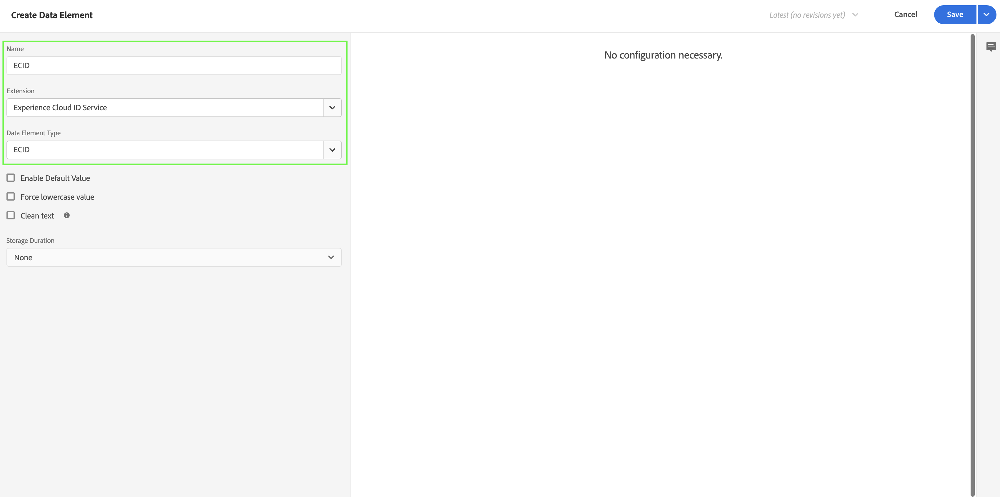

# Assimilar dados via Adobe Experience Platform Web SDK e Edge Network

Este guia de início rápido explica como você pode assimilar dados de rastreamento de site diretamente no Adobe Experience Platform usando o SDK da Web da Adobe Experience Platform e a Edge Network e, em seguida, usar esses dados no Customer Journey Analytics.

Para isso, é necessário:

- **Configurar um esquema e um conjunto de dados** no Adobe Experience Platform para definir o modelo (esquema) dos dados que você deseja coletar e onde realmente coletar os dados (conjunto de dados).

- **Configurar um armazenamento de dados** para configurar a Rede de borda da Adobe Experience Platform para direcionar seus dados coletados para o conjunto de dados configurado no Adobe Experience Platform.

- **Usar tags** para configurar regras e elementos de dados facilmente em relação aos dados na camada de dados do seu site. Em seguida, verifique se os dados são enviados para o armazenamento de dados configurado na Adobe Experience Platform Edge Network.

- **Implantar e validar**. Tenha um ambiente em que possa interagir com o desenvolvimento de tags e, uma vez que tudo esteja validado, publique-o ao vivo no ambiente de produção.

- **Configurar uma conexão** em Customer Journey Analytics. Essa conexão deve (pelo menos) incluir o conjunto de dados do Adobe Experience Platform.

- **Configurar uma visualização de dados** no Customer Journey Analytics para definir métricas e dimensões que deseja usar no Analysis Workspace.

- **Configurar um projeto** no Customer Journey Analytics para criar relatórios e visualizações.

>[!NOTE]
>
>Este é um guia simplificado sobre como assimilar dados coletados de seu site no Adobe Experience Platform e usar no Customer Journey Analytics. É altamente recomendável estudar as informações adicionais quando referidas.


## Configurar um esquema e um conjunto de dados

Para assimilar dados no Adobe Experience Platform, primeiro defina quais dados deseja coletar. Todos os dados assimilados no Adobe Experience Platform devem estar em conformidade com uma estrutura padrão e desnormalizada para que sejam reconhecidos e utilizados pelos recursos e capacidades downstream. O Experience Data Model (XDM) é a estrutura padrão que fornece essa estrutura no formato de schemas.

Após definir um esquema, use um ou mais conjuntos de dados para armazenar e gerenciar a coleta de dados. Um conjunto de dados é uma construção de armazenamento e gerenciamento para uma coleção de dados, normalmente uma tabela, que contém um esquema (colunas) e campos (linhas).

Todos os dados assimilados no Adobe Experience Platform devem estar em conformidade com um esquema predefinido antes que possam ser mantidos como um conjunto de dados.

### Configurar um esquema

Você deseja rastrear o mínimo de dados de perfis que visitam seu site, por exemplo, nome de página e identificação.
Para isso, primeiro defina um schema que modele esses dados.

Para configurar seu esquema:

1. Na interface do usuário do Adobe Experience Platform, no painel esquerdo, selecione **[!UICONTROL Esquemas]** within [!UICONTROL GERENCIAMENTO DE DADOS].

2. Selecionar **[!UICONTROL Criar esquema]**. Selecionar **[!UICONTROL ExperiênciaEvento XDM]** na lista de opções.

   

   >[!INFO]
   >
   >    Um esquema de evento de experiência é usado para modelar a variável _comportamento_ de um perfil (como exibição de página, adicionar ao carrinho). Um esquema Perfil individual é usado para modelar o perfil _atributos_ (como nome, email, gênero).


3. No [!UICONTROL Esquema sem título] tela:

   1. Insira um nome de exibição para o esquema e (opcional) uma descrição.

      

   2. Selecionar **[!UICONTROL + Adicionar]** em [!UICONTROL Grupos de campos].

      

      Grupos de campos são coleções reutilizáveis de objetos e atributos que permitem estender facilmente o esquema.

   3. No [!UICONTROL Adicionar grupos de campos] selecione a caixa de diálogo **[!UICONTROL AEP Web SDK ExperienceEvent]** grupo de campos na lista.

      

      É possível selecionar o botão de visualização para visualizar os campos que fazem parte desse grupo de campos, como `web > webPageDetails > name`.

      

      Selecionar **[!UICONTROL Voltar]** para fechar a visualização.

   4. Selecionar **[!UICONTROL Adicionar grupos de campos]**.

4. Selecionar **[!UICONTROL +]** ao lado do nome do esquema no [!UICONTROL Estrutura] painel.

   

5. No [!UICONTROL Propriedades do campo] , digite `Identification` como nome, **[!UICONTROL Identificação]** como [!UICONTROL Nome de exibição], selecione **[!UICONTROL Objeto]** como [!UICONTROL Tipo] e selecione **[!UICONTROL ExperienceEvent Core v2.1]** como [!UICONTROL Grupo de campos].

   

   Isso adiciona recursos de identificação ao esquema. No seu caso, você deseja identificar os perfis que visitam seu site usando a ID do Experience Cloud e o endereço de email. Há muitos outros atributos disponíveis para rastrear a identificação do visitante (por exemplo, ID do cliente, ID de fidelidade).

   Selecionar **[!UICONTROL Aplicar]** para adicionar esse objeto ao esquema.

6. Selecione o **[!UICONTROL ecid]** no objeto de identificação que você acabou de adicionar e selecione **[!UICONTROL Identidade]** e **[!UICONTROL Identidade principal]** e **[!UICONTROL ECID]** do [!UICONTROL Namespace de identidade] no painel direito.

   

   Você está especificando a Experience Cloud Identity como a identidade primária que o serviço Adobe Experience Platform Identity pode usar para combinar (compilar) o comportamento dos perfis com a mesma ECID.

   Selecionar **[!UICONTROL Aplicar]**. Você vê que um ícone de impressão digital aparece no atributo ecid.

7. Selecione o **[!UICONTROL email]** no objeto de identificação que você acabou de adicionar e selecione **[!UICONTROL Identidade]** e **[!UICONTROL Email]** do [!UICONTROL Namespace de identidade] na lista de [!UICONTROL Propriedades do campo] painel.

   

   Você está especificando o endereço de email como outra identidade que o serviço Adobe Experience Platform Identity pode usar para combinar (compilar) o comportamento dos perfis.

   Selecionar **[!UICONTROL Aplicar]**. Você vê que um ícone de impressão digital aparece no atributo de email.

   Selecione **[!UICONTROL Salvar]**.

8. Selecione o elemento raiz do esquema que exibe o nome dele e selecione o **[!UICONTROL Perfil]** switch.

   Você é solicitado a habilitar o esquema para o perfil. Depois de ativados, quando os dados são assimilados em conjuntos de dados com base nesse esquema, esses dados são mesclados ao Perfil do cliente em tempo real.

   Consulte [Ative o esquema para usar no Perfil do cliente em tempo real](https://experienceleague.adobe.com/docs/experience-platform/xdm/tutorials/create-schema-ui.html?lang=en#profile) para obter mais informações.

   >[!IMPORTANT]
   >
   >    Depois de salvar um esquema ativado para perfil, ele não pode mais ser desativado para perfil.

   

9. Selecionar **[!UICONTROL Salvar]** para salvar o esquema.

Você criou um schema mínimo que modela os dados que pode capturar de seu site. O schema permite que os perfis sejam identificados usando a Experience Cloud Identity e o endereço de email. Ao ativar o esquema para o perfil, você garante que os dados capturados de seu site sejam adicionados ao Perfil do cliente em tempo real.

Ao lado dos dados de comportamento, você também pode capturar os dados do atributo de perfil do site (por exemplo, detalhes de perfis que assinam um boletim informativo).

Para capturar esses dados de perfil, você deve:

- Crie um esquema com base na classe Perfil individual XDM .

- Adicione o grupo de campos Profile Core v2 ao schema.

- Adicione um objeto de identificação com base no grupo de campos Profile Core v2 .

- Defina ecid como identificador principal e email como identificador.

- Ativar o esquema do perfil

Consulte [Criar e editar esquemas na interface do usuário](https://experienceleague.adobe.com/docs/experience-platform/xdm/ui/resources/schemas.html) para obter mais informações sobre a adição e remoção de grupos de campos e campos individuais a um schema.

### Configurar um conjunto de dados

Com seu esquema, você definiu seu modelo de dados. Agora é necessário definir a construção para armazenar e gerenciar esses dados. Isso é feito por meio de conjuntos de dados.

Para configurar seu conjunto de dados:

1. Na interface do usuário do Adobe Experience Platform, no painel esquerdo, selecione **[!UICONTROL Conjuntos de dados]** within [!UICONTROL GERENCIAMENTO DE DADOS].

2. Selecionar **[!UICONTROL Criar conjunto de dados]**.

   

3. Selecionar **[!UICONTROL Criar conjunto de dados a partir do esquema]**.

   

4. Selecione o schema criado anteriormente e selecione **[!UICONTROL Próximo]**.

5. Nomeie seu conjunto de dados e (opcional) forneça uma descrição.

   

6. Selecionar **[!UICONTROL Concluir]**.

7. Selecione o **[!UICONTROL Perfil]** switch.

   Você é solicitado a habilitar o conjunto de dados para perfil. Depois de habilitado, o conjunto de dados enriquece os perfis do cliente em tempo real com seus dados assimilados.

   >[!IMPORTANT]
   >
   >    Você só pode ativar um conjunto de dados para perfil quando o esquema, ao qual o conjunto de dados adere, também estiver ativado para perfil.

   

Consulte [Guia da interface do usuário de conjuntos de dados](https://experienceleague.adobe.com/docs/experience-platform/catalog/datasets/user-guide.html?lang=pt-BR) para obter muito mais informações sobre como visualizar, visualizar, criar, excluir um conjunto de dados. E como ativar um conjunto de dados para o Perfil do cliente em tempo real.

## Configurar um armazenamento de dados

Um armazenamento de dados representa a configuração do lado do servidor ao implementar os SDKs móveis e da Web do Adobe Experience Platform. Ao coletar dados com os SDKs da Adobe Experience Platform, os dados são enviados para a Rede de borda da Adobe Experience Platform. É o armazenamento de dados que determina para quais serviços os dados são encaminhados.

Em sua configuração, você deseja que os dados coletados do site sejam enviados para seu conjunto de dados no Adobe Experience Platform.

Para configurar seu armazenamento de dados:

1. Na interface do usuário do Adobe Experience Platform, selecione **[!UICONTROL Datastreams]** from [!UICONTROL COLETA DE DADOS] no painel esquerdo.

2. Selecionar **[!UICONTROL Novo fluxo de dados]**.

3. Nomeie e descreva o armazenamento de dados. Selecione o esquema da [!UICONTROL Esquema do evento] lista.

   

4. Selecione **[!UICONTROL Salvar]**.

5. Selecionar **[!UICONTROL Adicionar Serviço]**.

6. No [!UICONTROL Adicionar tela Serviço]:

   1. Selecionar **[!UICONTROL Adobe Experience Platform]** do [!UICONTROL Serviço] lista.

   2. Garantir **[!UICONTROL Ativado]** está selecionada.

   3. Selecione seu conjunto de dados no [!UICONTROL Conjunto de dados do evento] lista.

      

   4. Deixe as outras configurações e selecione **[!UICONTROL Salvar]** para salvar o armazenamento de dados.

Seu conjunto de dados agora está configurado para encaminhar os dados coletados de seu site para seu conjunto de dados no Adobe Experience Platform.

Consulte [Visão geral dos conjuntos de dados](https://experienceleague.adobe.com/docs/experience-platform/edge/datastreams/overview.html?lang=pt-BR) para obter mais informações sobre como configurar um conjunto de dados e como lidar com dados confidenciais.


## Usar tags

Use o recurso Tags no Adobe Experience Platform para implementar o código em seu site para realmente coletar dados. Esta solução de gerenciamento de tags permite implantar o código do junto com outros requisitos de marcação. As tags oferecem integração perfeita com o Adobe Experience Platform usando a extensão Adobe Experience Platform Web SDK.

### Criar sua tag

1. Na interface do usuário do Adobe Experience Platform, no painel esquerdo, selecione **[!UICONTROL Tags]** within [!UICONTROL COLETA DE DADOS].

2. Selecione **[!UICONTROL Nova propriedade]**.

   Nomeie a tag, selecione **[!UICONTROL Web]** e insira um nome de domínio. Selecionar **[!UICONTROL Salvar]** para continuar.

   

### Configurar sua tag

Depois de criar a tag, você precisa configurá-la com as extensões corretas e configurar os elementos de dados e as regras de acordo com a maneira como deseja rastrear seu site e enviar dados para a Adobe Experience Platform.

Selecione a tag criada recentemente na lista de [!UICONTROL Propriedades da tag] para abri-lo.


#### **Extensões**

Adicione a extensão Adobe Platform Web SDK à tag para garantir que você possa enviar dados para o Adobe Experience Platform (por meio do armazenamento de dados).

Para criar e configurar a extensão Adobe Experience Platform Web SDK:

1. Selecionar **[!UICONTROL Extensões]** no painel esquerdo.

2. Selecionar **[!UICONTROL Catálogo]** na barra superior.

3. Procure ou role até a extensão SDK da Web da Adobe Experience Platform e selecione **[!UICONTROL Instalar]** para instalá-lo.

   

4. Selecione a sandbox e o armazenamento de dados criado anteriormente para [!UICONTROL Ambiente de produção] e (opcional) [!UICONTROL Ambiente de preparo] e [!UICONTROL Ambiente de desenvolvimento].

   

   Selecione **[!UICONTROL Salvar]**.

Consulte [Configurar a extensão Adobe Experience Platform Web SDK](https://experienceleague.adobe.com/docs/experience-platform/edge/extension/web-sdk-extension-configuration.html) para obter mais informações.

Você também deseja configurar a extensão do Serviço de ID do Experience Cloud para usar facilmente a ID do Experience Cloud. O serviço de Experience Cloud ID identifica visitantes em todas as soluções da Adobe Experience Cloud.

Para criar e configurar a extensão do Serviço de ID do Experience Cloud:

1. Selecionar **[!UICONTROL Extensões]** no painel esquerdo.

2. Selecionar **[!UICONTROL Catálogo]** na barra superior.

3. Procure ou role até a extensão Serviço de ID do Experience Cloud e selecione **[!UICONTROL Instalar]** para instalá-lo.

   

4. Deixe todas as configurações em seu padrão.

5. Selecione **[!UICONTROL Salvar]**.

#### **Elementos de dados**

Os elementos de dados são os blocos fundamentais do seu dicionário de dados (ou mapa de dados). Use elementos de dados para coletar, organizar e entregar dados em toda a tecnologia de marketing e anúncios. Você configura elementos de dados na tag que são lidos a partir da camada de dados e podem ser usados para fornecer dados ao Adobe Experience Platform.

Há diferentes tipos de elementos de dados. Primeiro, você configura um elemento de dados para capturar o nome da página que os visitantes estão visualizando em seu site.

Para definir um elemento de dados de nome de página:

1. Selecionar **[!UICONTROL Elementos de dados]** no painel esquerdo.

2. Selecionar **[!UICONTROL Adicionar elemento de dados]**.

3. No [!UICONTROL Criar elemento de dados] caixa de diálogo:

   - Nomeie seu elemento de dados, por exemplo `Page Name`.

   - Selecionar **[!UICONTROL Núcleo]** do [!UICONTROL Extensão] lista.

   - Selecionar **[!UICONTROL Informações da página]** do [!UICONTROL Tipo de elemento de dados] lista.

   - Selecionar **[!UICONTROL Título]** do [!UICONTROL Atributo] lista.

      

      Como alternativa, você pode ter usado o valor de uma variável da camada de dados, por exemplo `pageName` e [!UICONTROL Variável JavaScript] tipo de elemento de dados para definir o elemento de dados.

      

   - Selecione **[!UICONTROL Salvar]**.

Agora você deseja configurar um elemento de dados que faça referência à ID do Experience Cloud, fornecida automaticamente pelo SDK da Web da Adobe Experience Platform e disponível por meio da extensão do Experience Cloud ID Service.

Para definir um elemento de dados ECID:

1. Selecionar **[!UICONTROL Elementos de dados]** no painel esquerdo.

2. Selecionar **[!UICONTROL Adicionar elemento de dados]**.

3. No [!UICONTROL Criar elemento de dados] caixa de diálogo:

   - Nomeie seu elemento de dados, por exemplo `ECID`.

   - Selecionar **[!UICONTROL Serviço de ID de Experience Cloud]** do [!UICONTROL Extensão] lista.

   - Selecionar **[!UICONTROL ECID]** do [!UICONTROL Tipo de elemento de dados] lista.

      

   - Selecione **[!UICONTROL Salvar]**.

Por fim, agora é possível mapear qualquer um dos elementos de dados específicos para o schema definido anteriormente. Você define outro elemento de dados que fornece uma representação do esquema XDM.

Para definir um elemento de dados de objeto XDM:

1. Selecionar **[!UICONTROL Elementos de dados]** no painel esquerdo.

2. Selecionar **[!UICONTROL Adicionar elemento de dados]**.

3. No [!UICONTROL Criar elemento de dados] caixa de diálogo:

   - Nomeie seu elemento de dados, por exemplo `XDM - Page View`.

   - Selecionar **[!UICONTROL Adobe Experience Platform Web SDK]** do [!UICONTROL Extensão] lista.

   - Selecionar **[!UICONTROL Objeto XDM]** do [!UICONTROL Tipo de elemento de dados] lista.

   - Selecione sua sandbox no [!UICONTROL Sandbox] lista.

   - Selecione o esquema da [!UICONTROL Esquema] lista.

   - Mapeie o `identification > core > ecid` , definido em seu schema, no elemento de dados ECID. Selecione o ícone de cilindro para escolher facilmente o elemento de dados ECID na lista de elementos de dados.

      

      


   - Mapeie o `web > webPageDetails > name` , definido em seu esquema, para o elemento de dados Nome da página .

      

   - Selecione **[!UICONTROL Salvar]**.


#### **Regras**

As tags na Adobe Experience Platform seguem um sistema baseado em regras. Elas buscam a interação do usuário e dados associados. Quando os critérios definidos nas regras são cumpridos, a regra aciona a extensão, o script ou o código do lado do cliente identificado. Você pode usar regras para enviar dados (como um objeto XDM) para o Adobe Experience Platform usando a extensão Adobe Experience Platform Web SDK.

Para definir uma regra:

1. Selecionar **[!UICONTROL Regras]** no painel esquerdo.

2. Selecionar **[!UICONTROL Criar nova regra]**.

3. No [!UICONTROL Criar regra] caixa de diálogo:

   - Nomeie a regra, por exemplo `Page View`.

   - Selecionar **[!UICONTROL + Adicionar]** underneath [!UICONTROL Eventos].

   - No [!UICONTROL Configuração de evento] caixa de diálogo:

      - Selecionar **[!UICONTROL Núcleo]** do [!UICONTROL Extensão] lista.

      - Selecionar **[!UICONTROL Janela carregada]** do [!UICONTROL Tipo de evento] lista.

         

      - Selecione **[!UICONTROL Manter alterações]**.
   - Selecionar **[!UICONTROL + Adicionar]** underneath [!UICONTROL Ações].

   - No [!UICONTROL Configuração de ação] caixa de diálogo:

      - Selecionar **[!UICONTROL Adobe Experience Platform Web SDK]** do [!UICONTROL Extensão] lista.

      - Selecionar **[!UICONTROL Enviar evento]** do [!UICONTROL Tipo de ação] lista.

      - Selecionar **[!UICONTROL web.webpagedetails.pageViews]** do [!UICONTROL Tipo] lista.

      - Selecione o ícone do cilindro ao lado de  [!UICONTROL Dados XDM] e Selecione **[!UICONTROL XDM - Exibição de página]** na lista de elementos de dados.

         

      - Selecione **[!UICONTROL Manter alterações]**.
   - Sua regra deve ter a seguinte aparência:

      

   - Selecione **[!UICONTROL Salvar]**.


Este é apenas um exemplo de definição de uma regra que envia dados XDM, contendo valores de outros elementos de dados, para o Adobe Experience Platform.

Você pode usar as regras de várias maneiras na tag para manipular variáveis (usando os elementos de dados).

Consulte [Regras de ](https://experienceleague.adobe.com/docs/experience-platform/tags/ui/rules.html?lang=pt-BR) para obter mais informações.

### Criar e publicar sua tag

Após definir elementos de dados e regras, é necessário criar e publicar sua tag. Ao criar um build de biblioteca, você deve atribuí-lo a um ambiente. As extensões, regras e elementos de dados da build são compilados e colocados no ambiente atribuído. Cada ambiente fornece um código integrado exclusivo que permite integrar a build atribuída ao site.

Para criar e publicar sua tag:

1. Selecionar **[!UICONTROL Fluxo de publicação]** no painel esquerdo.

2. Selecionar **[!UICONTROL Selecionar uma biblioteca de trabalho]**, seguida de **[!UICONTROL Adicionar biblioteca...]**.

3. No [!UICONTROL Criar biblioteca] caixa de diálogo:

   - Dê um nome para a biblioteca.

   - Selecionar **[!UICONTROL Desenvolvimento (desenvolvimento)]** do [!UICONTROL Ambiente] lista.

   - Selecionar **[!UICONTROL + Adicionar todos os recursos alterados]**.

      

   - Selecionar **[!UICONTROL Salvar e criar no desenvolvimento]**.

   Isso salva e cria a tag para o seu ambiente de desenvolvimento. Um ponto verde indica uma criação bem-sucedida da tag no ambiente de desenvolvimento.

4. Você pode selecionar **[!UICONTROL ...]** para recriar a biblioteca ou mover a biblioteca para um ambiente de preparo ou produção.

   

As Tags do Adobe Experience Platform são compatíveis com fluxos de trabalho de publicação simples e complexos, que devem acomodar a implantação do SDK da Web da Adobe Experience Platform.

Consulte [Visão geral da publicação](https://experienceleague.adobe.com/docs/experience-platform/tags/publish/overview.html) para obter mais informações.


### Recuperar o código da tag

Por fim, é necessário instalar sua tag no site que você deseja rastrear. Isso implica colocar o código na tag de cabeçalho do modelo do site.

Para obter o código que faz referência à sua tag:

1. Selecionar **[!UICONTROL Ambientes]** no painel esquerdo.

2. Na lista de ambientes, selecione o botão de instalação correto (caixa).

   No [!UICONTROL Instruções de instalação da Web] selecione o botão copiar ao lado do código de script que deve ser lido como:

   ```javascript
   <script src="https://assets.adobedtm.com/2a518741ab24/806645a0b9bb/launch-716db315b4e2-development.min.js" async></script>
   ```

   

3. Selecionar **[!UICONTROL Fechar]**.

Em vez do código para o ambiente de desenvolvimento, você pode ter selecionado outro ambiente (armazenamento temporário, produção) com base em onde você está no processo de implantar o SDK da Web da Adobe Experience Platform.

Consulte [Ambientes](https://experienceleague.adobe.com/docs/experience-platform/tags/publish/environments/environments.html?) para obter mais informações.

## Implantar e validar

Agora você pode implantar o código na versão de desenvolvimento do seu site dentro do `<head>` . Quando implantado, seu site começa a coletar dados no Adobe Experience Platform.

Valide a implementação, corrija-a sempre que necessário e, uma vez correto, implante-a no ambiente de preparo e produção usando o recurso de fluxo de trabalho de publicação Tags.

## Configurar uma conexão

Para usar os dados do Adobe Experience Platform no Customer Journey Analytics, crie uma conexão que inclua os dados resultantes da configuração do esquema, do conjunto de dados e do fluxo de trabalho.

Uma conexão permite integrar conjuntos de dados da Adobe Experience Platform ao Espaço de trabalho. Para criar relatórios sobre esses conjuntos de dados, primeiro é necessário estabelecer uma conexão entre os conjuntos de dados no Adobe Experience Platform e no Workspace.

Para criar sua conexão:

1. Na interface do usuário do Customer Journey Analytics, selecione **[!UICONTROL Conexões]** na navegação superior.

2. Selecionar **[!UICONTROL Criar nova conexão]**.

3. No [!UICONTROL Conexão sem título] tela:

   Nomeie e descreva sua conexão em [!UICONTROL Configurações de conexão].

   Selecione a sandbox correta no [!UICONTROL Sandbox] listar em [!UICONTROL Configurações de dados] e selecione o número de eventos diários no [!UICONTROL Número médio de eventos diários] lista.

   

   Selecionar **[!UICONTROL Adicionar conjuntos de dados]**.

   No [!UICONTROL Selecionar conjuntos de dados] etapa em [!UICONTROL Adicionar conjuntos de dados]:

   - Selecione o conjunto de dados criado anteriormente (`Example dataset`) e qualquer outro conjunto de dados que você deseja incluir em sua conexão.

      

   - Selecione **[!UICONTROL Próximo]**.
   No [!UICONTROL Configurações de conjuntos de dados] etapa em [!UICONTROL Adicionar conjuntos de dados]:

   - Para cada conjunto de dados:

      - Selecione um [!UICONTROL ID da pessoa] nas identidades disponíveis definidas nos esquemas do conjunto de dados no Adobe Experience Platform.

      - Selecione a fonte de dados correta no [!UICONTROL Tipo de fonte de dados] lista. Se você especificar **[!UICONTROL Outras]**, em seguida, adicione uma descrição para a fonte de dados.

      - Definir **[!UICONTROL Importar todos os novos dados]** e **[!UICONTROL Preenchimento retroativo de conjunto de dados com dados existentes]** de acordo com suas preferências.

      

   - Selecionar **[!UICONTROL Adicionar conjuntos de dados]**.
   Selecione **[!UICONTROL Salvar]**.

Consulte [Visão geral das conexões](../connections/overview.md) para obter mais informações sobre como criar e gerenciar uma conexão e como selecionar e combinar conjuntos de dados.

## Configurar uma visualização de dados

Uma visualização de dados é um container específico do Customer Journey Analytics que permite determinar como interpretar dados de uma conexão. Ele especifica todas as dimensões e métricas disponíveis no Analysis Workspace e de quais colunas elas obtêm seus dados. As visualizações de dados são definidas na preparação de relatórios no Analysis Workspace.

Para criar sua visualização de dados:

1. Na interface do usuário do Customer Journey Analytics, selecione **[!UICONTROL Visualizações de dados]** na navegação superior.

2. Selecionar **[!UICONTROL Criar nova visualização de dados]**.

3. No [!UICONTROL Configurar] etapa:

   Selecione sua conexão no [!UICONTROL Conexão] lista.

   Nomeie e (opcionalmente) descreva sua conexão.

   

   Selecionar **[!UICONTROL Salvar e continuar]**.

4. No [!UICONTROL Componentes] etapa:

   Adicione qualquer campo de esquema e/ou componente padrão que deseja incluir à [!UICONTROL MÉTRICAS] ou [!UICONTROL DIMENSION] caixas de componentes.

   

   Selecionar **[!UICONTROL Salvar e continuar]**.

5. No [!UICONTROL Configurações] etapa:

   Configurações de 

   Deixe as configurações como estão e selecione **[!UICONTROL Salvar e concluir]**.

Consulte [Visão geral das visualizações de dados](../data-views/data-views.md) para obter mais informações sobre como criar e editar uma visualização de dados, quais componentes estão disponíveis para você usar na visualização de dados e como usar configurações de filtro e sessões.


## Configurar um projeto

O Analysis Workspace é uma ferramenta de navegador flexível que permite criar análises e compartilhar insights rapidamente com base em seus dados. Você usa projetos do Workspace para combinar componentes de dados, tabelas e visualizações para criar sua análise e compartilhar com qualquer pessoa em sua organização.

Para criar o projeto:

1. Na interface do usuário do Customer Journey Analytics, selecione **[!UICONTROL Projetos]** na navegação superior.

2. Selecionar **[!UICONTROL Projetos]** no painel de navegação esquerdo.

3. Selecionar **[!UICONTROL Criar projeto]**.

   

   Selecionar **[!UICONTROL Projeto em branco]**.

   

4. Selecione sua visualização de dados na lista.

   .

5. Comece a arrastar e soltar dimensões e métricas na [!UICONTROL Tabela de forma livre] no [!UICONTROL Painel] para criar seu primeiro relatório. Como exemplo, arraste `Program Points Balance` e `Page View` como métricas e `email` como dimensão para obter uma visão geral rápida dos perfis que visitaram seu site e fazem parte do programa de fidelidade que coleta pontos de fidelidade.

   

Consulte [Visão geral do Analysis Workspace](../analysis-workspace/home.md) para obter mais informações sobre como criar projetos e sua análise usando componentes, visualizações e painéis.

>[!SUCCESS]
>
>Você concluiu todas as etapas. A partir da definição de quais dados você deseja coletar (esquema) e onde armazená-los (conjunto de dados) no Adobe Experience Platform, você configurou um armazenamento de dados na Edge Network para garantir que os dados possam ser encaminhados para esse conjunto de dados. Em seguida, você definiu e implantou sua tag contendo as extensões (Adobe Experience Platform Web SDK, Serviço de ID do Experience Cloud), os elementos de dados e as regras para capturar dados do seu site e enviar esses dados para o armazenamento de dados. Você definiu uma conexão no Customer Journey Analytics para usar os dados de rastreamento do site e outros dados. A definição da visualização de dados permite especificar qual dimensão e métricas usar e, por fim, criar seu primeiro projeto visualizando e analisando seus dados.
