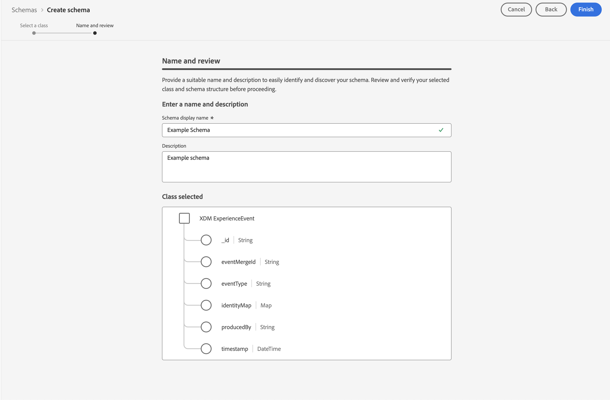

# Assimilar dados por meio do SDK da Web da Adobe Experience Platform

Este guia de início rápido explica como você pode assimilar dados de rastreamento de site diretamente na Adobe Experience Platform usando o SDK da Web da Adobe Experience Platform e a Rede de borda e, em seguida, usar esses dados no Customer Journey Analytics.

Para isso, é necessário:

- **Configurar um esquema e um conjunto de dados** na Adobe Experience Platform para definir o modelo (esquema) dos dados que você deseja coletar e onde realmente coletar os dados (conjunto de dados).

- **Configurar um armazenamento de dados** para configurar a Rede de borda da Adobe Experience Platform para direcionar seus dados coletados para o conjunto de dados configurado na Adobe Experience Platform.

- **Usar tags** para configurar regras e elementos de dados facilmente em relação aos dados na camada de dados do seu site. Em seguida, verifique se os dados são enviados para a sequência de dados configurada na Rede de borda da Adobe Experience Platform.

- **Implantar e validar**. Tenha um ambiente em que possa interagir com o desenvolvimento de tags e, uma vez que tudo esteja validado, publique-o ao vivo no ambiente de produção.

- **Configurar uma conexão** no Customer Journey Analytics. Essa conexão deve (pelo menos) incluir o conjunto de dados da Adobe Experience Platform.

- **Configurar uma visualização de dados** no Customer Journey Analytics para definir métricas e dimensões que você deseja usar no Analysis Workspace.

- **Configurar um projeto** no Customer Journey Analytics para criar relatórios e visualizações.

>[!NOTE]
>
> Este guia de início rápido é um guia simplificado sobre como assimilar dados coletados de seu site na Adobe Experience Platform e usar no Customer Journey Analytics. É altamente recomendável estudar as informações adicionais quando referidas.


## Configurar um esquema e um conjunto de dados

Para assimilar dados na Adobe Experience Platform, primeiro é necessário definir quais dados você deseja coletar. Todos os dados assimilados na Adobe Experience Platform devem estar em conformidade com uma estrutura padrão e desnormalizada para que sejam reconhecidos e utilizados pelos recursos e capacidades downstream. O Experience Data Model (XDM) é a estrutura padrão que fornece essa estrutura no formato de esquemas.

Após definir um esquema, use um ou mais conjuntos de dados para armazenar e gerenciar a coleta de dados. Um conjunto de dados é uma construção de armazenamento e gerenciamento para uma coleção de dados (normalmente uma tabela) que contém um esquema (colunas) e campos (linhas).

Todos os dados assimilados na Adobe Experience Platform devem estar em conformidade com um esquema predefinido antes que possam ser mantidos como um conjunto de dados.

### Configurar um esquema

Você deseja rastrear o mínimo de dados de perfis que visitam seu site, por exemplo, nome de página e identificação.
Primeiro, você deve definir um esquema que modele esses dados.

Para configurar o esquema:

1. Na interface do usuário da Adobe Experience Platform, no painel esquerdo, selecione **[!UICONTROL Esquemas]** no [!UICONTROL GERENCIAMENTO DE DADOS].

1. Selecionar **[!UICONTROL Criar esquema]**. .
1. Na etapa Selecionar uma classe do assistente Criar esquema:

   1. Selecionar **[!UICONTROL Evento de experiência]**.

      

      >[!INFO]
      >
      >    Um esquema de Evento de experiência é usado para modelar o _comportamento_ de um perfil (como nome da cena, botão para adicionar ao carrinho). Um esquema de Perfil individual é usado para modelar os _atributos_ de perfil (como nome, email, gênero).

   1. Selecione **[!UICONTROL Próximo]**.


1. No [!UICONTROL Nomear e revisar a etapa] do [!UICONTROL Criar esquema] assistente:

   1. Insira um **[!UICONTROL Nome de exibição do esquema]** para o esquema e (opcional) uma **[!UICONTROL Descrição]**.

      

   1. Selecione **[!UICONTROL Concluir]**.

1. Na guia Estrutura de Esquema de Exemplo:

   1. Selecione **[!UICONTROL + Adicionar]** em [!UICONTROL Grupos de campos].

      

      Grupos de campos são coleções reutilizáveis de objetos e atributos que permitem estender facilmente o esquema.

   1. Na caixa de diálogo [!UICONTROL Adicionar grupos de campos], selecione o grupo de campos **[!UICONTROL SDK da Web ExperienceEvent da AEP]** na lista.

      

      É possível selecionar o botão de visualização para visualizar os campos que fazem parte desse grupo de campos, como `web > webPageDetails > name`.

      

      Selecione **[!UICONTROL Voltar]** para fechar a visualização.

   1. Selecione **[!UICONTROL Adicionar grupos de campos]**.

1. Selecione **[!UICONTROL +]** ao lado do nome do esquema no painel [!UICONTROL Estrutura].

   

1. No painel [!UICONTROL Propriedades do campo], digite `Identification` como nome, **[!UICONTROL Identificação]** como [!UICONTROL Nome de exibição], selecione **[!UICONTROL Objeto]** como [!UICONTROL Tipo] e selecione **[!UICONTROL ExperienceEvent Core v2.1]** como [!UICONTROL Grupo de campos].

   >[!NOTE]
   >
   >Se esse grupo de campos não estiver disponível, procure outro grupo de campos que contenha campos de identidade. Ou [criar um novo grupo de campos](https://experienceleague.adobe.com/docs/experience-platform/xdm/ui/resources/field-groups.html) e [adicionar novos campos de identidade](https://experienceleague.adobe.com/docs/experience-platform/xdm/ui/fields/identity.html#define-a-identity-field) (como `ecid`, `crmId`, e outras necessárias) ao grupo de campos e selecione esse novo grupo de campos.

   

   O objeto de identificação adiciona recursos de identificação ao esquema. No seu caso, você deseja identificar os perfis que visitam seu site usando a Experience Cloud ID e o endereço de email. Há muitos outros atributos disponíveis para rastrear a identificação da pessoa (por exemplo, ID do cliente, ID de fidelidade).

   Selecione **[!UICONTROL Aplicar]** para adicionar esse objeto ao esquema.

1. Selecione o campo **[!UICONTROL ecid]** no objeto de identificação que você acabou de adicionar e selecione **[!UICONTROL Identidade]** e **[!UICONTROL Identidade principal]** e **[!UICONTROL ECID]** do [!UICONTROL Namespace de identidade] no painel direito.

   

   Você está especificando a Experience Cloud Identity como a identidade principal que o serviço Adobe Experience Platform Identity pode usar para combinar (compilar) o comportamento dos perfis com a mesma ECID.

   Selecione **[!UICONTROL Aplicar]**. Você verá um ícone de impressão digital no atributo ecid.

1. Selecione o **[!UICONTROL email]** no objeto de identificação que você acabou de adicionar e selecione **[!UICONTROL Identidade]** e **[!UICONTROL Email]** na lista [!UICONTROL Namespace de identidade] no painel [!UICONTROL Propriedades do campo].

   

   Você está especificando o endereço de email como outra identidade que o serviço Adobe Experience Platform Identity pode usar para combinar (compilar) o comportamento dos perfis.

   Selecione **[!UICONTROL Aplicar]**. Você vê que um ícone de impressão digital aparece no atributo de email.

   Selecione **[!UICONTROL Salvar]**.

1. Selecione o elemento raiz do esquema que exibe o nome dele e selecione a opção **[!UICONTROL Perfil]**.

   Você deve habilitar o esquema para o perfil. Depois de ativados, quando os dados são assimilados em conjuntos de dados com base nesse esquema, esses dados são mesclados ao Perfil do cliente em tempo real.

   Consulte [Ativar o esquema para usar no Perfil do cliente em tempo real](https://experienceleague.adobe.com/docs/experience-platform/xdm/tutorials/create-schema-ui.html#profile) para obter mais informações.

   >[!IMPORTANT]
   >
   >    Depois de salvar um esquema ativado para perfil, ele não pode mais ser desativado para perfil.

   

1. Selecione **[!UICONTROL Salvar]** para salvar o esquema.

Você criou um esquema mínimo que modela os dados que pode capturar de seu site. O esquema permite que os perfis sejam identificados usando a Experience Cloud Identity e o endereço de email. Ao ativar o esquema para o perfil, você garante que os dados capturados de seu site sejam adicionados ao Perfil do cliente em tempo real.

Ao lado dos dados de comportamento, você também pode capturar os dados do atributo de perfil do site (por exemplo, detalhes de perfis que assinam um boletim informativo).

Para capturar esses dados de perfil, você deve:

- Criar um esquema com base na classe Perfil individual XDM.

- Adicionar o grupo de campos Profile Core v2 ao esquema.

- Adicionar um objeto de identificação com base no grupo de campos Profile Core v2.

- Defina a ID do Experience Cloud como identificador principal e o email como identificador.

- Ativar o esquema do perfil

Consulte [Criar e editar esquemas na interface do usuário](https://experienceleague.adobe.com/docs/experience-platform/xdm/ui/resources/schemas.html?lang=pt-BR) para obter mais informações sobre a adição e remoção de grupos de campos e campos individuais a um esquema.

### Configurar um conjunto de dados

Com seu esquema, você definiu seu modelo de dados. Agora é necessário definir a construção para armazenar e gerenciar esses dados, o que é feito por meio de conjuntos de dados.

Para configurar seu conjunto de dados:

1. Na interface do usuário da Adobe Experience Platform, no painel esquerdo, selecione **[!UICONTROL Conjuntos de dados]** no [!UICONTROL GERENCIAMENTO DE DADOS].

2. Selecione **[!UICONTROL Criar conjunto de dados]**.

   

3. Selecione **[!UICONTROL Criar conjunto de dados a partir do esquema]**.

   

4. Selecione o esquema criado anteriormente e selecione **[!UICONTROL Próximo]**.

5. Nomeie seu conjunto de dados e (opcional) forneça uma descrição.

   

6. Selecione **[!UICONTROL Concluir]**.

7. Selecione a opção **[!UICONTROL Perfil]**.

   Você deve habilitar o conjunto de dados para perfil. Depois de habilitado, o conjunto de dados enriquece os perfis do cliente em tempo real com seus dados assimilados.

   >[!IMPORTANT]
   >
   >    Você só pode habilitar um conjunto de dados para perfil quando o esquema, ao qual o conjunto de dados corresponde, também estiver habilitado para perfil.

   

Consulte [Guia da interface do usuário de conjuntos de dados](https://experienceleague.adobe.com/docs/experience-platform/catalog/datasets/user-guide.html?lang=pt-BR) para obter muito mais informações sobre como visualizar, visualizar, criar, excluir um conjunto de dados. E como ativar um conjunto de dados para o Perfil do cliente em tempo real.

## Configurar um fluxo de dados

Uma sequência de dados representa a configuração do lado do servidor ao implementar os SDKs móveis e da Web da Adobe Experience Platform. Ao coletar dados com os SDKs da Adobe Experience Platform, os dados são enviados para a Rede de borda da Adobe Experience Platform. É o fluxo de dados que determina para quais serviços esses dados são encaminhados.

Em sua configuração, você deseja que os dados coletados do site sejam enviados para seu conjunto de dados na Adobe Experience Platform.

Para configurar seu armazenamento de dados:

1. Na interface do usuário da Adobe Experience Platform, selecione **[!UICONTROL Sequências de dados]** em [!UICONTROL COLEÇÃO DE DADOS] no painel esquerdo.

2. Selecione **[!UICONTROL Novo fluxo de dados]**.

3. Nomeie e descreva o armazenamento de dados. Selecione o esquema na lista [!UICONTROL Esquema do evento].

   

4. Selecione **[!UICONTROL Salvar]**.

5. Selecione **[!UICONTROL Adicionar serviço]**.

6. Na tela [!UICONTROL Adicionar serviço]:

   1. Selecione **[!UICONTROL Adobe Experience Platform]** na lista [!UICONTROL Serviço].

   2. Verifique se a opção **[!UICONTROL Ativado]** está selecionada.

   3. Selecione o conjunto de dados na lista [!UICONTROL Conjunto de dados do evento].

      

   4. Deixe as outras configurações e selecione **[!UICONTROL Salvar]** para salvar a sequência de dados.

O conjunto de dados agora está configurado para encaminhar os dados coletados de seu site para seu conjunto de dados na Adobe Experience Platform.

Consulte [Visão geral dos conjuntos de dados](https://experienceleague.adobe.com/docs/experience-platform/datastreams/overview.html) para obter mais informações sobre como configurar um conjunto de dados e como lidar com dados confidenciais.


## Usar tags

Para implementar o código em seu site para realmente coletar dados, use o recurso de Tags no Adobe Experience Platform. Esta solução de gerenciamento de tags permite implantar o código do junto com outros requisitos de marcação. As tags oferecem integração perfeita com a Adobe Experience Platform usando a extensão do SDK da Web da Adobe Experience Platform.

### Criar sua tag

1. Na interface do usuário da Adobe Experience Platform, no painel esquerdo, selecione **[!UICONTROL Tags]** em [!UICONTROL COLEÇÃO DE DADOS].

2. Selecione **[!UICONTROL Nova propriedade]**.

   Nomeie a tag, selecione **[!UICONTROL Web]** e insira um nome de domínio. Selecione **[!UICONTROL Salvar]** para continuar.

   

### Configurar sua tag

Depois de criar a tag, você deve configurá-la com as extensões corretas e configurar os elementos de dados e as regras de acordo com como deseja rastrear seu site e enviar dados para a Adobe Experience Platform.

Selecione a tag criada recentemente na lista de [!UICONTROL Propriedades da tag] para abri-la.


#### **Extensões**

Para garantir que você possa enviar dados para a Adobe Experience Platform (por meio de sua sequência de dados), adicione a extensão SDK da Web da Plataforma Adobe à sua tag.

Para criar e configurar a extensão do SDK da Web da Adobe Experience Platform:

1. Selecione **[!UICONTROL Extensões]** no painel esquerdo.

2. Selecione **[!UICONTROL Catálogo]** na barra superior.

3. Procure ou role a tela até a extensão do SDK da Web da Adobe Experience Platform e selecione **[!UICONTROL Instalar]** para instalá-la.

   

4. Selecione a sandbox e a sequência de dados criadas anteriormente para o [!UICONTROL Ambiente de produção], o [!UICONTROL Ambiente de preparo] (opcional) e o [!UICONTROL Ambiente de desenvolvimento].

   

   Selecione **[!UICONTROL Salvar]**.

Consulte [Configurar a extensão do SDK da Web da Adobe Experience Platform](https://experienceleague.adobe.com/docs/experience-platform/tags/extensions/client/web-sdk/web-sdk-extension-configuration.html) para obter mais informações.

Você também pode configurar a extensão do Serviço da Experience Cloud ID para usar facilmente a Experience Cloud ID. O serviço de ID de Experience Cloud identifica pessoas em todas as soluções da Adobe Experience Cloud.

Para criar e configurar a extensão do Serviço da Experience Cloud ID:

1. Selecione **[!UICONTROL Extensões]** no painel esquerdo.

2. Selecione **[!UICONTROL Catálogo]** na barra superior.

3. Procure ou role a tela até a extensão do Serviço da Experience Cloud ID e selecione **[!UICONTROL Instalar]** para instalá-la.

   

4. Deixe todas as configurações como padrão.

5. Selecione **[!UICONTROL Salvar]**.

#### **Elementos de dados**

Os elementos de dados são os blocos fundamentais do seu dicionário de dados (ou mapa de dados). Use elementos de dados para coletar, organizar e entregar dados em toda a tecnologia de marketing e anúncios. Você configura elementos de dados na tag que são lidos a partir da camada de dados e podem ser usados para fornecer dados à Adobe Experience Platform.

Há diferentes tipos de elementos de dados. Primeiro, configure um elemento de dados para capturar o nome da página que as pessoas estão visualizando no site.

Para definir um elemento de dados de nome de página:

1. Selecione **[!UICONTROL Elementos de dados]** no painel esquerdo.

2. Selecione **[!UICONTROL Adicionar elemento de dados]**.

3. Na caixa de diálogo [!UICONTROL Criar elemento de dados]:

   - Nomeie seu elemento de dados, por exemplo `Page Name`.

   - Selecione **[!UICONTROL Núcleo]** na lista [!UICONTROL Extensão].

   - Selecione **[!UICONTROL Informações da página]** na lista [!UICONTROL Tipo de elemento de dados].

   - Selecione **[!UICONTROL Título]** na lista [!UICONTROL Atributo].

     

     Como alternativa, você pode usar o valor de uma variável da camada de dados, por exemplo `pageName` e o tipo de elemento de dados da [!UICONTROL Variável JavaScript] para definir o elemento de dados.

     

   - Selecione **[!UICONTROL Salvar]**.

Agora você deseja configurar um elemento de dados que faça referência à ID da Experience Cloud, fornecida automaticamente pelo SDK da Web da Adobe Experience Platform e disponível por meio da extensão do Serviço da Experience Cloud ID.

Para definir um elemento de dados da ECID:

1. Selecione **[!UICONTROL Elementos de dados]** no painel esquerdo.

2. Selecione **[!UICONTROL Adicionar elemento de dados]**.

3. Na caixa de diálogo [!UICONTROL Criar elemento de dados]:

   - Nomeie seu elemento de dados, por exemplo `ECID`.

   - Selecione **[!UICONTROL Serviço da Experience Cloud ID]** da lista [!UICONTROL Extensão].

   - Selecione **[!UICONTROL ECID]** na lista [!UICONTROL Tipo de elemento de dados].

     

   - Selecione **[!UICONTROL Salvar]**.

Por fim, agora é possível mapear qualquer um dos elementos de dados específicos para o esquema definido anteriormente. Você define outro elemento de dados que fornece uma representação do esquema XDM.

Para definir um elemento de dados de objeto XDM:

1. Selecione **[!UICONTROL Elementos de dados]** no painel esquerdo.

2. Selecione **[!UICONTROL Adicionar elemento de dados]**.

3. Na caixa de diálogo [!UICONTROL Criar elemento de dados]:

   - Nomeie seu elemento de dados, por exemplo `XDM - Page View`.

   - Selecione **[!UICONTROL SDK da Web da Adobe Experience Platform]** na lista [!UICONTROL Extensão].

   - Selecione **[!UICONTROL Objeto XDM]** na lista [!UICONTROL Tipo de elemento de dados].

   - Selecione a sandbox na lista [!UICONTROL Sandbox].

   - Selecione o esquema na lista [!UICONTROL Esquema].

   - Mapeie o atributo `identification > core > ecid`, definido no esquema, no elemento de dados da ECID. Selecione o ícone de cilindro para escolher facilmente o elemento de dados da ECID na lista de elementos de dados.

     

     


   - Mapeie o atributo `web > webPageDetails > name`, definido no esquema, para o elemento de dados Nome da página.

     

   - Selecione **[!UICONTROL Salvar]**.


#### **Regras**

As tags na Adobe Experience Platform seguem um sistema baseado em regras. Elas buscam a interação do usuário e dados associados. Quando os critérios definidos nas regras são cumpridos, a regra aciona a extensão, o script ou o código do lado do cliente identificado. Você pode usar regras para enviar dados (como um objeto XDM) para a Adobe Experience Platform usando a extensão do SDK da Web da Adobe Experience Platform.

Para definir uma regra:

1. Selecione **[!UICONTROL Regras]** no painel esquerdo.

2. Selecione **[!UICONTROL Criar nova regra]**.

3. Na caixa de diálogo [!UICONTROL Criar regra]:

   - Nomeie a regra, por exemplo `Page View`.

   - Selecione **[!UICONTROL + Adicionar]** abaixo de [!UICONTROL Eventos].

   - Na caixa de diálogo [!UICONTROL Configuração de evento]:

      - Selecione **[!UICONTROL Núcleo]** na lista [!UICONTROL Extensão].

      - Selecione **[!UICONTROL Janela carregada]** na lista [!UICONTROL Tipo de evento].

        

      - Selecione **[!UICONTROL Manter alterações]**.


   - Selecione **[!UICONTROL + Adicionar]** abaixo de [!UICONTROL Ações].

   - Na caixa de diálogo [!UICONTROL Configuração de ação]:

      - Selecione **[!UICONTROL SDK da Web da Adobe Experience Platform]** na lista [!UICONTROL Extensão].

      - Selecione **[!UICONTROL Enviar evento]** na lista [!UICONTROL Tipo de ação].

      - Selecione **[!UICONTROL web.webpagedetails.pageViews]** na lista [!UICONTROL Tipo].

      - Selecione o ícone do cilindro ao lado de [!UICONTROL Dados XDM] e Selecione **[!UICONTROL XDM - Exibição de página]** na lista de elementos de dados.

     

      - Selecione **[!UICONTROL Manter alterações]**.

   - Sua regra deve ter a seguinte aparência:

     

   - Selecione **[!UICONTROL Salvar]**.

O exposto acima é apenas um exemplo de definição de uma regra que envia dados XDM, contendo valores de outros elementos de dados, para o Adobe Experience Platform.

Você pode usar as regras de várias maneiras na tag para manipular variáveis (usando os elementos de dados).

Consulte [Regras de](https://experienceleague.adobe.com/docs/experience-platform/tags/ui/rules.html?lang=pt-BR) para obter mais informações.

### Criar e publicar a tag

Depois de definir elementos de dados e regras, você deve criar e publicar sua tag. Ao criar um build de biblioteca, você deve atribuí-lo a um ambiente. As extensões, regras e elementos de dados da build são compilados e colocados no ambiente atribuído. Cada ambiente fornece um código integrado exclusivo que permite integrar a build atribuída ao site.

Para criar e publicar a tag:

1. Selecione **[!UICONTROL Fluxo de publicação]** no painel esquerdo.

2. Selecione **[!UICONTROL Selecionar uma biblioteca de trabalho]**, seguida de **[!UICONTROL Adicionar biblioteca...]**.

3. Na caixa de diálogo [!UICONTROL Criar biblioteca]:

   - Dê um nome para a biblioteca.

   - Selecione **[!UICONTROL Desenvolvimento]** na lista suspensa [!UICONTROL Ambiente].

   - Clique em **[!UICONTROL + Adicionar todos os recursos alterados]**.

     

   - Selecione **[!UICONTROL Salvar e criar no desenvolvimento]**.

   A tag é salva e é criada para o ambiente de desenvolvimento. Um ponto verde indica uma criação bem-sucedida da tag no ambiente de desenvolvimento.

4. Você pode selecionar **[!UICONTROL ...]** para recriar a biblioteca ou mover a biblioteca para um ambiente de preparo ou produção.

   

As tags da Adobe Experience Platform são compatíveis com fluxos de trabalho de publicação simples e complexos, que devem acomodar a implantação do SDK da Web da Adobe Experience Platform.

Consulte [Visão geral de publicação](https://experienceleague.adobe.com/docs/experience-platform/tags/publish/overview.html?lang=pt-BR) para obter mais informações.


### Recuperar o código da tag

Por fim, você deve instalar sua tag no site que deseja rastrear, o que implica colocar o código na tag de cabeçalho do modelo do site.

Para obter o código que faz referência à sua tag:

1. Selecione **[!UICONTROL Ambientes]** no painel esquerdo.

2. Na lista de ambientes, selecione o botão de instalação correto (caixa).

   Na caixa de diálogo [!UICONTROL Instruções de instalação da Web] clique no botão copiar ao lado do código de script que deve ser lido como:

   ```
   <script src="https://assets.adobedtm.com/2a518741ab24/.../launch-...-development.min.js" async></script>>
   ```

   

3. Selecione **[!UICONTROL Fechar]**.

Em vez do código para o ambiente de desenvolvimento, você pode ter selecionado outro ambiente (armazenamento temporário, produção) com base em onde você está no processo de implantação do SDK da Web da Adobe Experience Platform.

Consulte [Ambientes](https://experienceleague.adobe.com/docs/experience-platform/tags/publish/environments/environments.html?lang=pt-BR) para obter mais informações.

## Implantar e validar

Agora você pode implantar o código na versão de desenvolvimento do seu site dentro da tag `<head>`. Quando implantado, seu site começa a coletar dados na Adobe Experience Platform.

Valide a implementação, corrija-a sempre que necessário e, uma vez correto, implante-a no ambiente de preparo e produção usando o recurso de fluxo de trabalho de publicação Tags.

## Configurar uma conexão

Para usar os dados da Adobe Experience Platform no Customer Journey Analytics, crie uma conexão que inclua os dados resultantes da configuração do esquema, do conjunto de dados e do fluxo de trabalho.

Uma conexão permite integrar conjuntos de dados da Adobe Experience Platform ao Espaço de trabalho. Para criar relatórios sobre esses conjuntos de dados, primeiro é necessário estabelecer uma conexão entre os conjuntos de dados na Adobe Experience Platform e no Workspace.

Para criar sua conexão:

1. Na interface do usuário do Customer Journey Analytics, selecione **[!UICONTROL Conexões]** na navegação superior.

2. Selecione **[!UICONTROL Criar nova conexão]**.

3. Na tela [!UICONTROL Conexão sem título]:

   Nomeie e descreva sua conexão em [!UICONTROL Configurações de conexão].

   Selecione a sandbox correta na lista [!UICONTROL Sandbox] em [!UICONTROL Configurações de dados] e selecione o número de eventos diários na lista [!UICONTROL Número médio de eventos diários].

   

   Selecione **[!UICONTROL Adicionar conjuntos de dados]**.

   Na etapa [!UICONTROL Selecionar conjuntos de dados] em [!UICONTROL Adicionar conjuntos de dados]:

   - Selecione o conjunto de dados criado anteriormente (`Example dataset`) e qualquer outro conjunto de dados que você deseja incluir em sua conexão.

     

   - Selecione **[!UICONTROL Próximo]**.

   Na etapa [!UICONTROL Configurações de conjuntos de dados] em [!UICONTROL Adicionar conjuntos de dados]:

   - Para cada conjunto de dados:

      - Selecione uma [!UICONTROL ID de pessoa] a partir das identidades disponíveis definidas nos esquemas de conjunto de dados da Adobe Experience Platform.

      - Selecione a fonte de dados correta na lista [!UICONTROL Tipo de fonte de dados]. Se você especificar **[!UICONTROL Outros]**, em seguida, adicione uma descrição para a fonte de dados.

      - Definir **[!UICONTROL Importar todos os novos dados]** e **[!UICONTROL Preenchimento retroativo de conjunto de dados com dados existentes]** de acordo com suas preferências.

     

   - Selecione **[!UICONTROL Adicionar conjuntos de dados]**.

   Selecione **[!UICONTROL Salvar]**.

Consulte [Visão geral das conexões](../connections/overview.md) para obter mais informações sobre como criar e gerenciar uma conexão e como selecionar e combinar conjuntos de dados.

## Configurar uma visualização de dados

Uma visualização de dados é um container específico do Customer Journey Analytics que permite determinar como interpretar dados de uma conexão. Ele especifica todas as dimensões e métricas disponíveis no Analysis Workspace e de quais colunas elas obtêm seus dados. As visualizações de dados são definidas na preparação de relatórios no Analysis Workspace.

Para criar a visualização de dados:

1. Na interface do usuário do Customer Journey Analytics, selecione **[!UICONTROL Visualizações de dados]** na navegação superior.

2. Selecione **[!UICONTROL Criar nova visualização de dados]**.

3. Na etapa [!UICONTROL Configurar]:

   Selecione a conexão na lista [!UICONTROL Conexão].

   Nomeie e (opcionalmente) descreva a conexão.

   

   Selecione **[!UICONTROL Salvar e continuar]**.

4. Na etapa [!UICONTROL Componentes]:

   Adicione qualquer campo de esquema e/ou componente padrão que deseja incluir às caixas de componentes [!UICONTROL MÉTRICAS] ou [!UICONTROL DIMENSÃO].

   

   Selecione **[!UICONTROL Salvar e continuar]**.

5. Na etapa [!UICONTROL Configurações]:

   Configurações de 

   Deixe as configurações como estão e selecione **[!UICONTROL Salvar e concluir]**.

Consulte [Visão geral das visualizações de dados](../data-views/data-views.md) para obter mais informações sobre como criar e editar uma visualização de dados, quais componentes estão disponíveis para você usar na visualização de dados e como usar configurações de filtro e sessões.


## Configurar um projeto

O Analysis Workspace é uma ferramenta de navegador flexível que permite criar análises e compartilhar insights rapidamente com base em dados. Os projetos do Espaço de trabalho permitem combinar componentes de dados, tabelas e visualizações para criar a análise e compartilhar com qualquer pessoa na organização.

Para criar o projeto:

1. Na interface do usuário do Customer Journey Analytics, selecione **[!UICONTROL Projetos]** na navegação superior.

2. Selecione **[!UICONTROL Projetos]** no painel de navegação esquerdo.

3. Selecione **[!UICONTROL Criar projeto]**.

   

   Selecione **[!UICONTROL Projeto em branco]**.

   

4. Selecione a visualização de dados na lista.

   .

5. Para criar seu primeiro relatório, comece a arrastar e soltar dimensões e métricas no [!UICONTROL Tabela de forma livre] no [!UICONTROL Painel]. Como exemplo, arraste `Program Points Balance` e `Page View` como métricas e `email` como dimensão para obter uma visão geral rápida dos perfis que visitaram seu site e fazem parte do programa de fidelidade que coleta pontos.

   

Consulte [Visão geral do Analysis Workspace](../analysis-workspace/home.md) para obter mais informações sobre como criar projetos e sua análise usando componentes, visualizações e painéis.

>[!SUCCESS]
>
>Você concluiu todas as etapas. Começando por definir quais dados você deseja coletar (esquema) e onde armazená-los (conjunto de dados) no Adobe Experience Platform. Em seguida, você configurou um fluxo de dados na Rede de borda para garantir que os dados possam ser encaminhados para esse conjunto de dados. Em seguida, você definiu e implantou a tag contendo as extensões (SDK da Web da Adobe Experience Platform, Serviço da Experience Cloud ID), os elementos de dados e as regras para capturar dados do seu site e enviar esses dados para o armazenamento de dados. Você definiu uma conexão no Customer Journey Analytics para usar os dados de rastreamento do site e outros dados. A definição da visualização de dados permite especificar qual dimensão e métricas usar e, por fim, criar seu primeiro projeto visualizando e analisando seus dados.
