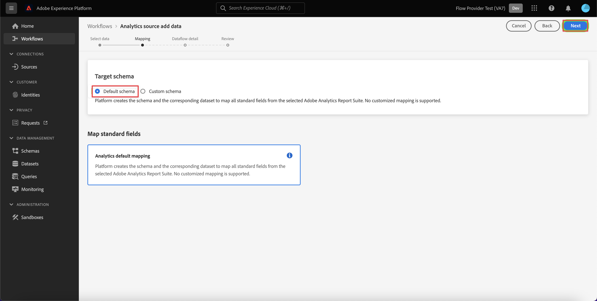

# Assimilar e usar dados do Adobe Analytics

Este guia de início rápido explica como você pode usar os dados coletados pelo Adobe Analytics no Customer Journey Analytics.

>[!PREREQUISITES]
>
>Você tem o Adobe Analytics licenciado e implantado em um ou mais de seus sites, usando qualquer um dos métodos de implementação documentados:
>
>- [Implementar o Analytics usando a Experience Platform Edge](https://experienceleague.adobe.com/docs/analytics/implementation/aep-edge/overview.html?lang=pt-BR)
>
>- [Implementar o Analytics usando a extensão do Adobe Analytics](https://experienceleague.adobe.com/docs/analytics/implementation/launch/overview.html?lang=pt-BR)
>
>- [Implementar o Analytics usando JavaScript](https://experienceleague.adobe.com/docs/analytics/implementation/js/overview.html?lang=pt-BR)

Para isso, é necessário:

- **Configure um Conector de origem do Adobe Analytics** na Adobe Experience Platform. O conector de origem cuida da assimilação dos dados atuais do Adobe Analytics em um conjunto de dados na Adobe Experience Platform.

- **Configurar uma conexão** no Customer Journey Analytics. A conexão deve (pelo menos) incluir seu conjunto de dados do Adobe Experience Platform.

- **Configurar uma visualização de dados** no Customer Journey Analytics para definir métricas e dimensões que você deseja usar no Analysis Workspace.

- **Configurar um projeto** no Customer Journey Analytics para criar relatórios e visualizações.

>[!NOTE]
>
>Este guia de início rápido é um guia simplificado sobre como assimilar dados usando o conector de origem do Adobe Analytics e usar esses dados no Customer Journey Analytics. É altamente recomendável estudar as informações adicionais quando referidas.

## Configurar um conector de origem do Adobe Analytics

O conector de origem do Adobe Analytics permite trazer os dados do conjunto de relatórios do Adobe Analytics para a Adobe Experience Platform.

Para criar um conector de origem do Adobe Analytics:

1. Na interface do usuário da Platform, selecione **[!UICONTROL Fontes]**, no painel esquerdo.

2. Selecione **[!UICONTROL Aplicativos da Adobe]** na lista de [!UICONTROL CATEGORIAS].

3. Selecione **[!UICONTROL Configurar]** ou **[!UICONTROL Adicionar dados]** no bloco Adobe Analytics.

   

4. Selecione **[!UICONTROL Conjunto de relatórios]**. Na lista de conjuntos de relatórios, selecione aquele que deseja usar.

   

   Selecione **[!UICONTROL Próximo]**.

5. Selecione **[!UICONTROL Esquema padrão]** como [!UICONTROL Esquema de destino]. A Adobe Experience Platform cria automaticamente o esquema e o conjunto de dados correspondente para mapear todos os campos padrão do conjunto de relatórios do Adobe Analytics selecionado.

   

   Selecione **[!UICONTROL Próximo]**.

6. Nomeie o fluxo de dados e (opcionalmente) forneça uma descrição.

   

   Selecione **[!UICONTROL Próximo]**.

7. Revise a conexão e selecione **[!UICONTROL Concluir]**.

   

Depois que a conexão é criada, o fluxo de dados é criado automaticamente para preencher um conjunto de dados com os dados do Adobe Analytics no conjunto de relatórios. O fluxo de dados assimila até 13 meses de dados históricos para sandboxes de produção. O preenchimento retroativo em sandboxes que não são de produção é limitado a três meses.

Quando a assimilação inicial for concluída, os dados do conjunto de relatórios do Adobe Analytics estarão prontos para serem usados pelo Customer Journey Analytics.

Consulte [Criar uma conexão de origem do Adobe Analytics na interface do usuário](https://experienceleague.adobe.com/pt-br/docs/experience-platform/sources/ui-tutorials/create/adobe-applications/analytics) para obter um tutorial muito mais abrangente.

## Configurar uma conexão

Para usar os dados da Adobe Experience Platform no Customer Journey Analytics, crie uma conexão que inclua os dados resultantes da configuração do esquema, do conjunto de dados e do fluxo de trabalho.

Uma conexão permite integrar conjuntos de dados da Adobe Experience Platform ao Espaço de trabalho. Para criar relatórios sobre esses conjuntos de dados, primeiro é necessário estabelecer uma conexão entre os conjuntos de dados na Adobe Experience Platform e no Workspace.

Para criar sua conexão:

1. Na interface do usuário do Customer Journey Analytics, selecione **[!UICONTROL Conexões]**, opcionalmente em **[!UICONTROL Gerenciamento de dados]**, no menu superior.

2. Selecione **[!UICONTROL Criar nova conexão]**.

3. Na tela [!UICONTROL Conexão sem título]:

   Nomeie e descreva sua conexão em [!UICONTROL Configurações de conexão].

   Selecione a sandbox correta na lista [!UICONTROL Sandbox] em [!UICONTROL Configurações de dados] e selecione o número de eventos diários na lista [!UICONTROL Número médio de eventos diários].

   

   Selecione **[!UICONTROL Adicionar conjuntos de dados]**.

   Na etapa [!UICONTROL Selecionar conjuntos de dados] em [!UICONTROL Adicionar conjuntos de dados]:

   - Selecione o conjunto de dados criado automaticamente pelo conector de origem do Adobe Analytics e qualquer outro conjunto de dados que você deseja incluir na conexão.

     

   - Selecione **[!UICONTROL Próximo]**.

   Na etapa [!UICONTROL Configurações de conjuntos de dados] em [!UICONTROL Adicionar conjuntos de dados]:

   - Para cada conjunto de dados:

      - Selecione uma [!UICONTROL ID de pessoa] a partir das identidades disponíveis definidas nos esquemas de conjunto de dados da Adobe Experience Platform.

      - Selecione a fonte de dados correta na lista [!UICONTROL Tipo de fonte de dados]. Se você especificar **[!UICONTROL Outros]**, em seguida, adicione uma descrição para a fonte de dados.

      - Definir **[!UICONTROL Importar todos os novos dados]** e **[!UICONTROL Preenchimento retroativo de conjunto de dados com dados existentes]** de acordo com suas preferências.

     

   - Selecione **[!UICONTROL Adicionar conjuntos de dados]**.

   Selecione **[!UICONTROL Salvar]**.

Consulte [Visão geral das conexões](../connections/overview.md) para obter mais informações sobre como criar e gerenciar uma conexão e como selecionar e combinar conjuntos de dados.

## Configurar uma visualização de dados

Uma visualização de dados é um container específico do Customer Journey Analytics que permite determinar como interpretar dados de uma conexão. Ele especifica todas as dimensões e métricas disponíveis no Analysis Workspace e de quais colunas elas obtêm seus dados. As visualizações de dados são definidas na preparação de relatórios no Analysis Workspace.

Para criar a visualização de dados:

1. Na interface do usuário do Customer Journey Analytics, selecione **[!UICONTROL Visualizações de dados]**, opcionalmente em **[!UICONTROL Gerenciamento de dados]**, no menu superior.

2. Selecione **[!UICONTROL Criar nova visualização de dados]**.

3. Na etapa [!UICONTROL Configurar]:

   Selecione a conexão na lista [!UICONTROL Conexão].

   Nomeie e (opcionalmente) descreva a conexão.

   

   Selecione **[!UICONTROL Salvar e continuar]**.

4. Na etapa [!UICONTROL Componentes]:

   Adicione qualquer campo de esquema e/ou componente padrão que deseja incluir às caixas de componentes [!UICONTROL MÉTRICAS] ou [!UICONTROL DIMENSÃO].

   

   Selecione **[!UICONTROL Salvar e continuar]**.

5. Na etapa [!UICONTROL Configurações]:

   Configurações de 

   Deixe as configurações como estão e selecione **[!UICONTROL Salvar e concluir]**.

Consulte [Visão geral das visualizações de dados](../data-views/data-views.md) para obter mais informações sobre como criar e editar uma visualização de dados, quais componentes estão disponíveis para você usar na visualização de dados e como usar as configurações de segmento e sessões.

## Configurar um projeto

O Analysis Workspace é uma ferramenta de navegador flexível que permite criar análises e compartilhar insights rapidamente com base em dados. Os projetos do Espaço de trabalho permitem combinar componentes de dados, tabelas e visualizações para criar a análise e compartilhar com qualquer pessoa na organização.

Para criar o projeto:

1. Na interface do usuário do Customer Journey Analytics, selecione **[!UICONTROL Projetos]** no menu superior.

2. Selecione **[!UICONTROL Projetos]** no painel de navegação esquerdo.

3. Selecione **[!UICONTROL Criar projeto]**.

   

   Selecione **[!UICONTROL Projeto em branco]**.

   

4. Selecione a visualização de dados na lista.

   .

5. Para criar seu primeiro relatório, comece a arrastar e soltar dimensões e métricas na [!UICONTROL Tabela de forma livre] do [!UICONTROL Painel]. Como exemplo, arraste `Program Points Balance` e `Page View` como métricas e `email` como dimensão para obter uma visão geral rápida dos perfis que visitaram seu site e fazem parte do programa de fidelidade que coleta pontos.

   

Consulte [Visão geral do Analysis Workspace](../analysis-workspace/home.md) para obter mais informações sobre como criar projetos e sua análise usando componentes, visualizações e painéis.

>[!SUCCESS]
>
>Você concluiu todas as etapas. A partir da configuração do conector da fonte de dados do Adobe Analytics e da configuração desse conector para o conjunto de relatórios, os dados do Adobe Analytics são automaticamente carregados na Adobe Experience Platform. Você definiu uma conexão no Customer Journey Analytics para usar os dados Adobe Analytics assimilados e outros dados. A definição da visualização de dados permite especificar qual dimensão e métricas usar e, por fim, criar seu primeiro projeto visualizando e analisando seus dados.

