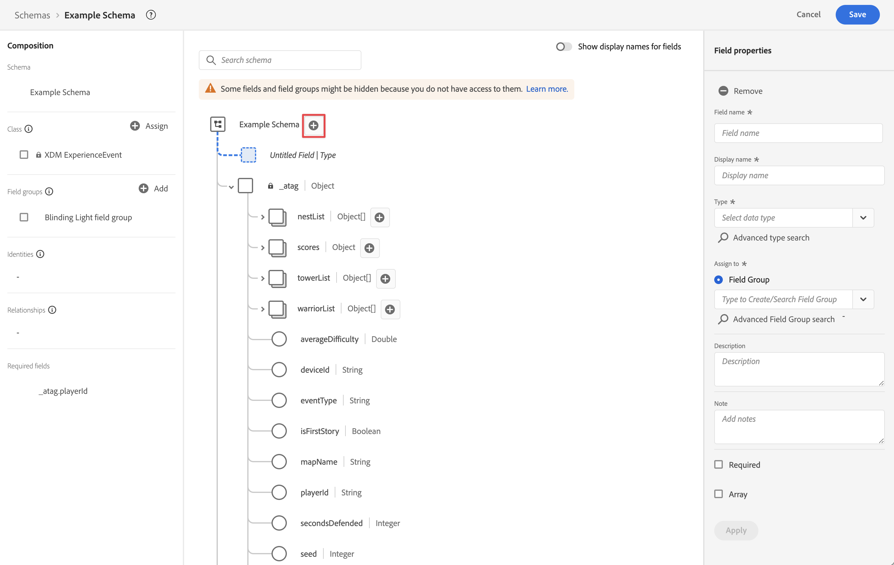
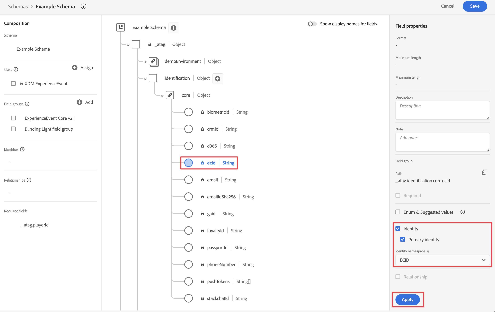
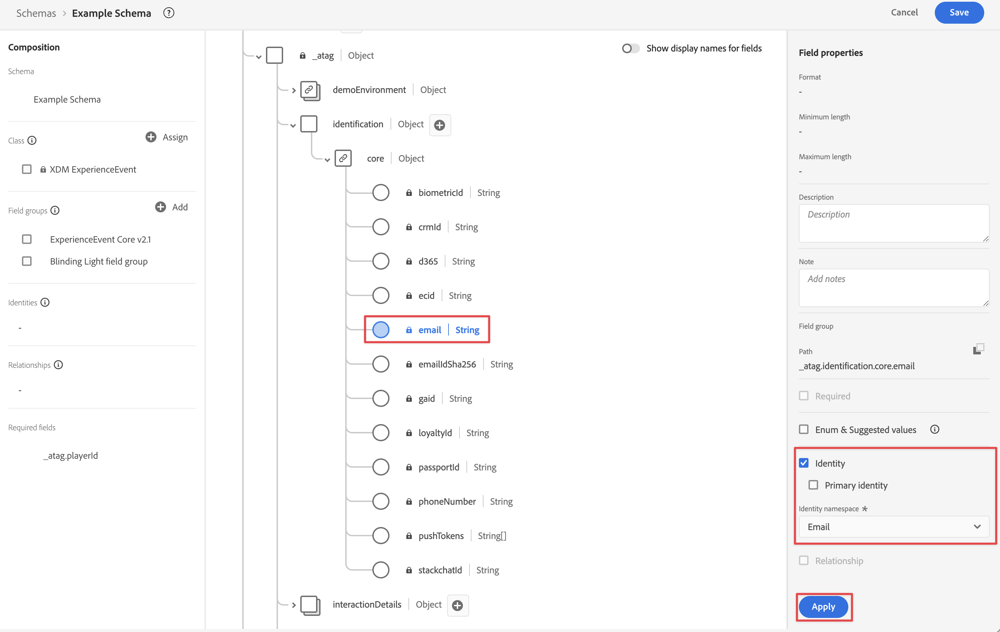

# Assimilar dados por meio da API do servidor do Edge Network

Este guia de início rápido explica como você pode assimilar dados de rastreamento de dispositivos como dispositivos IoT, decodificadores de sinais, consoles de jogos, aplicativos de desktop diretamente no Adobe Experience Platform usando a API do Adobe Experience Platform Edge Network Server e o Edge Network. Em seguida, use esses dados no Customer Journey Analytics.

Para isso, você deve:

- **Configurar um esquema e um conjunto de dados** na Adobe Experience Platform para definir o modelo (esquema) dos dados que você deseja coletar e onde realmente coletar os dados (conjunto de dados).

- **Configurar um armazenamento de dados** para configurar a Rede de borda da Adobe Experience Platform para direcionar seus dados coletados para o conjunto de dados configurado na Adobe Experience Platform.

- **Use a API do Servidor** para enviar dados diretamente do seu aplicativo ou jogo em execução em uma área de trabalho, console de jogos, dispositivo IoT ou decodificador de sinais para sua sequência de dados.

- **Implantar e validar**. Tenha um ambiente em que possa interagir com o desenvolvimento e, uma vez tudo validado, publique-o em tempo real no ambiente de produção.

- **Configurar uma conexão** no Customer Journey Analytics. Essa conexão deve (pelo menos) incluir o conjunto de dados da Adobe Experience Platform.

- **Configurar uma visualização de dados** no Customer Journey Analytics para definir métricas e dimensões que você deseja usar no Analysis Workspace.

- **Configurar um projeto** no Customer Journey Analytics para criar relatórios e visualizações.

>[!NOTE]
>
>Este guia de início rápido é um guia simplificado sobre como assimilar dados coletados de um aplicativo ou jogo em execução em um dispositivo IoT, decodificador de sinais, console de jogos ou desktop no Adobe Experience Platform e usar no Customer Journey Analytics. É altamente recomendável estudar as informações adicionais quando referidas.


## Configurar um esquema e um conjunto de dados

Para assimilar dados na Adobe Experience Platform, primeiro é necessário definir quais dados você deseja coletar. Todos os dados assimilados na Adobe Experience Platform devem estar em conformidade com uma estrutura padrão e desnormalizada para que sejam reconhecidos e utilizados pelos recursos e capacidades downstream. O Experience Data Model (XDM) é a estrutura padrão que fornece uma estrutura no formato de esquemas.

Após definir um esquema, use um ou mais conjuntos de dados para armazenar e gerenciar a coleta de dados. Um conjunto de dados é uma construção de armazenamento e gerenciamento para uma coleção de dados (normalmente uma tabela) que contém um esquema (colunas) e campos (linhas).

Todos os dados assimilados na Adobe Experience Platform devem estar em conformidade com um esquema predefinido antes que possam ser mantidos como um conjunto de dados.

### Configurar um esquema

Você deseja rastrear alguns dados mínimos de perfis que estão jogando seu jogo em um console, por exemplo, identificação, pontuações, progresso e outras informações.
Primeiro, você deve definir um esquema que modele esses dados.

Para configurar o esquema:

1. Na interface do usuário da Adobe Experience Platform, no painel esquerdo, selecione **[!UICONTROL Esquemas]** no [!UICONTROL GERENCIAMENTO DE DADOS].

1. Selecione **[!UICONTROL Criar esquema]**.
.
1. Na etapa Selecionar uma classe do assistente Criar esquema:

   1. Selecione **[!UICONTROL Evento de experiência]**.

      

      >[!INFO]
      >
      >    Um esquema de evento de experiência é usado para modelar o _comportamento_ de um perfil (como nome do cenário, pressione o botão para adicionar ao carrinho). Um esquema de Perfil individual é usado para modelar os _atributos_ de perfil (como nome, email, gênero).

   1. Selecione **[!UICONTROL Próximo]**.


1. No [!UICONTROL Nome e etapa de revisão] do assistente [!UICONTROL Criar esquema]:

   1. Insira um **[!UICONTROL nome de exibição]** para o esquema e uma **[!UICONTROL descrição]** (opcional).

      

   1. Selecione **[!UICONTROL Concluir]**.

1. Na guia Estrutura de Esquema de Exemplo:

   1. Selecione **[!UICONTROL + Adicionar]** em [!UICONTROL Grupos de campos].

      

      Grupos de campos são coleções reutilizáveis de objetos e atributos que permitem estender facilmente o esquema.

   1. Na caixa de diálogo [!UICONTROL Adicionar grupos de campos], selecione o grupo de campos **[!UICONTROL Luz oculta]** na lista. Este grupo de campo é criado para rastrear o progresso do usuário jogando um jogo fictício intitulado Blinding Light em um console.

      

      É possível selecionar o botão de visualização para visualizar os campos que fazem parte desse grupo de campos, como `scores > afterMatch`.

      

      Selecione **[!UICONTROL Voltar]** para fechar a visualização.

   1. Selecione **[!UICONTROL Adicionar grupos de campos]**.

1. Selecione **[!UICONTROL +]** próximo ao nome do esquema.

   

1. No painel [!UICONTROL Propriedades do Campo], digite `identification` como o [!UICONTROL Nome do Campo], **[!UICONTROL Identificação]** como o [!UICONTROL Nome de exibição], selecione **[!UICONTROL Objeto]** como o [!UICONTROL Tipo] e selecione **[!UICONTROL Núcleo do ExperienceEvent v2.1]** como o [!UICONTROL Grupo de Campos].

   >[!NOTE]
   >
   >Se esse grupo de campos não estiver disponível, procure outro grupo de campos que contenha campos de identidade. Ou [crie um novo grupo de campos](https://experienceleague.adobe.com/docs/experience-platform/xdm/ui/resources/field-groups.html?lang=pt-BR) e [adicione novos campos de identidade](https://experienceleague.adobe.com/docs/experience-platform/xdm/ui/fields/identity.html?lang=pt-BR#define-a-identity-field) (como `ecid`, `crmId` e outros que você precise) ao grupo de campos e selecione esse novo grupo de campos.

   

   O objeto de identificação adiciona recursos de identificação ao esquema. No seu caso, você quer identificar os perfis que estão jogando usando a Experience Cloud ID e o endereço de email que eles usam para fazer logon no console de jogos deles. Há muitos outros atributos disponíveis para rastrear a identificação da sua pessoa.

   Selecione **[!UICONTROL Aplicar]** para adicionar esse objeto ao esquema.

1. Selecione o campo **[!UICONTROL ecid]** no objeto de identificação que você acabou de adicionar e selecione **[!UICONTROL Identidade]** e **[!UICONTROL Identidade principal]** e **[!UICONTROL ECID]** do [!UICONTROL Namespace de identidade] no painel direito.

   

   Você está especificando a Experience Cloud Identity como a identidade principal que o serviço Adobe Experience Platform Identity pode usar para combinar (compilar) o comportamento dos perfis com a mesma ECID.

   Selecione **[!UICONTROL Aplicar]**. Você verá um ícone de impressão digital no atributo ecid.

1. Selecione o **[!UICONTROL email]** no objeto de identificação que você acabou de adicionar e selecione **[!UICONTROL Identidade]** e **[!UICONTROL Email]** na lista [!UICONTROL Namespace de identidade] no painel [!UICONTROL Propriedades do campo].

   

   Você está especificando o endereço de email como outra identidade que o serviço Adobe Experience Platform Identity pode usar para combinar (compilar) o comportamento dos perfis.

   Selecione **[!UICONTROL Aplicar]**. Você vê que um ícone de impressão digital aparece no atributo de email.

   Selecione **[!UICONTROL Salvar]**.

1. Selecione o elemento raiz do esquema que exibe o nome dele e selecione a opção **[!UICONTROL Perfil]**.

   Você deve habilitar o esquema para o perfil. Depois de ativados, quando os dados são assimilados em conjuntos de dados com base nesse esquema, esses dados são mesclados ao Perfil do cliente em tempo real.

   Consulte [Ativar o esquema para usar no Perfil do cliente em tempo real](https://experienceleague.adobe.com/docs/experience-platform/xdm/tutorials/create-schema-ui.html?lang=pt-BR#profile) para obter mais informações.

   >[!IMPORTANT]
   >
   >    Depois de salvar um esquema ativado para perfil, ele não pode mais ser desativado para perfil.

   

1. Selecione **[!UICONTROL Salvar]** para salvar o esquema.

Você criou um esquema mínimo que modela os dados que você pode capturar do seu jogo. O esquema permite que os perfis sejam identificados usando a Experience Cloud Identity e o endereço de email. Ao ativar o esquema para perfil, você garante que os dados capturados do seu jogo de console sejam adicionados ao Perfil do cliente em tempo real.

Ao lado dos dados de comportamento, você também pode capturar dados de atributos de perfil do seu console (por exemplo, detalhes de perfis conectados ao console).

Para capturar dados do perfil, você deve:

- Criar um esquema com base na classe Perfil individual XDM.

- Adicionar o grupo de campos Profile Core v2 ao esquema.

- Adicionar um objeto de identificação com base no grupo de campos Profile Core v2.

- Defina a Experience Cloud ID como identificador principal e o email como identificador.

- Ativar o esquema do perfil

Consulte [Criar e editar esquemas na interface do usuário](https://experienceleague.adobe.com/docs/experience-platform/xdm/ui/resources/schemas.html?lang=pt-BR) para obter mais informações sobre a adição e remoção de grupos de campos e campos individuais a um esquema.

### Configurar um conjunto de dados

Com seu esquema, você definiu seu modelo de dados. Agora é necessário definir a construção para armazenar e gerenciar esses dados usando conjuntos de dados.

Para configurar seu conjunto de dados:

1. Na interface do usuário da Adobe Experience Platform, no painel esquerdo, selecione **[!UICONTROL Conjuntos de dados]** no [!UICONTROL GERENCIAMENTO DE DADOS].

2. Selecione **[!UICONTROL Criar conjunto de dados]**.

   

3. Selecione **[!UICONTROL Criar conjunto de dados a partir do esquema]**.

   

4. Selecione o esquema criado anteriormente e selecione **[!UICONTROL Próximo]**.

5. Nomeie seu conjunto de dados e (opcional) forneça uma descrição.

   

6. Selecione **[!UICONTROL Concluir]**.

7. Selecione a opção **[!UICONTROL Perfil]**.

   Você deve habilitar o conjunto de dados para perfil. Depois de habilitado, o conjunto de dados enriquece os perfis do cliente em tempo real com seus dados assimilados.

   >[!IMPORTANT]
   >
   >    Você só pode habilitar um conjunto de dados para perfil quando o esquema, ao qual o conjunto de dados corresponde, também estiver habilitado para perfil.

   

Consulte [Guia da interface do usuário de conjuntos de dados](https://experienceleague.adobe.com/docs/experience-platform/catalog/datasets/user-guide.html?lang=pt-BR) para obter muito mais informações sobre como visualizar, visualizar, criar, excluir um conjunto de dados. E como ativar um conjunto de dados para o Perfil do cliente em tempo real.

## Configurar um fluxo de dados

Uma sequência de dados representa a configuração do lado do servidor ao implementar os SDKs da Web e móvel da Adobe Experience Platform e a API do servidor do Adobe Experience Platform Edge Network. Ao coletar dados com os SDKs do Adobe Experience Platform e as APIs do Edge Network Server, os dados são enviados para o Adobe Experience Platform Edge Network. É a sequência de dados que determina para quais serviços os dados são encaminhados.

Na configuração, você deseja que os dados coletados do jogo sejam enviados para o seu conjunto de dados no Adobe Experience Platform.

Para configurar seu armazenamento de dados:

1. Na interface do usuário da Adobe Experience Platform, selecione **[!UICONTROL Sequências de dados]** em [!UICONTROL COLEÇÃO DE DADOS] no painel esquerdo.

2. Selecione **[!UICONTROL Novo fluxo de dados]**.

3. Nomeie e descreva o armazenamento de dados. Selecione o esquema na lista [!UICONTROL Esquema do evento].

   

4. Selecione **[!UICONTROL Salvar]**.

5. Selecione **[!UICONTROL Adicionar serviço]**.

6. Na tela [!UICONTROL Adicionar serviço]:

   1. Selecione **[!UICONTROL Adobe Experience Platform]** na lista [!UICONTROL Serviço].

   2. Verifique se a opção **[!UICONTROL Ativado]** está selecionada.

   3. Selecione o conjunto de dados na lista [!UICONTROL Conjunto de dados do evento].

      

   4. Deixe as outras configurações e selecione **[!UICONTROL Salvar]** para salvar a sequência de dados.

Sua sequência de dados agora está configurada para encaminhar os dados coletados do jogo para seu conjunto de dados no Adobe Experience Platform.

Consulte [Visão geral dos conjuntos de dados](https://experienceleague.adobe.com/docs/experience-platform/datastreams/overview.html) para obter mais informações sobre como configurar um conjunto de dados e como lidar com dados confidenciais.

## Usar a API do Edge Network Server

No desenvolvimento do jogo, você pode adicionar chamadas relevantes à API do Edge Network Server do Adobe Experience Platform, quando apropriado.

Por exemplo, para atualizar a pontuação do player, você usaria:

```
curl -X POST "https://server.adobedc.net/ee/v2/interact?dataStreamId={DATASTREAM_ID}"
-H "Authorization: Bearer {TOKEN}"
-H "x-gw-ims-org-id: {ORG_ID}"
-H "x-api-key: {API_KEY}"
-H "Content-Type: application/json"
-d '{
   "event": {
      "xdm": {
         "identityMap": {
            "Email_LC_SHA256": [
               {
                  "id": "0c7e6a405862e402eb76a70f8a26fc732d07c32931e9fae9ab1582911d2e8a3b",
                  "primary": true
               }
            ]
         },
         "eventType": "game.scoreUpdate",
         "{sandbox}": {
            "scores": {
               "afterMatch": 132391",
            }
         },
         "timestamp": "2021-08-09T14:09:20.859Z"
      }
   }
}'
```

Na solicitação POST de exemplo, `{DATASTREAM_ID}` aponta para o identificador da sequência de dados de exemplo que você configurou anteriormente. `{sandbox}` é o nome exclusivo da sua sandbox, identificando o caminho para o grupo de campos Luz oculta personalizada.

Consulte [Coleta de dados interativa](https://experienceleague.adobe.com/docs/experience-platform/edge-network-server-api/data-collection/interactive-data-collection.html?lang=pt-BR) e [Coleta de dados não interativa](https://experienceleague.adobe.com/docs/experience-platform/edge-network-server-api/data-collection/non-interactive-data-collection.html) para obter mais informações sobre como usar a API do Edge Network Server.

## Configurar uma conexão

Para usar os dados da Adobe Experience Platform no Customer Journey Analytics, crie uma conexão que inclua os dados resultantes da configuração do esquema, do conjunto de dados e do fluxo de trabalho.

Uma conexão permite integrar conjuntos de dados da Adobe Experience Platform ao Espaço de trabalho. Para criar relatórios sobre esses conjuntos de dados, primeiro é necessário estabelecer uma conexão entre os conjuntos de dados na Adobe Experience Platform e no Workspace.

Para criar sua conexão:

1. Na interface do usuário do Customer Journey Analytics, selecione **[!UICONTROL Conexões]**, opcionalmente em **[!UICONTROL Gerenciamento de dados]**, no menu superior.

2. Selecione **[!UICONTROL Criar nova conexão]**.

3. Na tela [!UICONTROL Conexão sem título]:

   Nomeie e descreva sua conexão em [!UICONTROL Configurações de conexão].

   Selecione a sandbox correta na lista [!UICONTROL Sandbox] em [!UICONTROL Configurações de dados] e selecione o número de eventos diários na lista [!UICONTROL Número médio de eventos diários].

   

   Selecione **[!UICONTROL Adicionar conjuntos de dados]**.

   Na etapa [!UICONTROL Selecionar conjuntos de dados] em [!UICONTROL Adicionar conjuntos de dados]:

   - Selecione conjuntos de dados criados anteriormente e/ou outros conjuntos de dados relevantes que deseja incluir em sua conexão

   - Selecione **[!UICONTROL Próximo]**.

   Na etapa [!UICONTROL Configurações de conjuntos de dados] em [!UICONTROL Adicionar conjuntos de dados]:

   - Para cada conjunto de dados:

      - Selecione uma [!UICONTROL ID de pessoa] a partir das identidades disponíveis definidas nos esquemas de conjunto de dados da Adobe Experience Platform.

      - Selecione a fonte de dados correta na lista [!UICONTROL Tipo de fonte de dados]. Se você especificar **[!UICONTROL Outros]**, em seguida, adicione uma descrição para a fonte de dados.

      - Definir **[!UICONTROL Importar todos os novos dados]** e **[!UICONTROL Preenchimento retroativo de conjunto de dados com dados existentes]** de acordo com suas preferências.

   - Selecione **[!UICONTROL Adicionar conjuntos de dados]**.

   Selecione **[!UICONTROL Salvar]**.

Consulte [Visão geral das conexões](../connections/overview.md) para obter mais informações sobre como criar e gerenciar uma conexão e como selecionar e combinar conjuntos de dados.

## Configurar uma visualização de dados

Uma visualização de dados é um container específico do Customer Journey Analytics que permite determinar como interpretar dados de uma conexão. Ele especifica todas as dimensões e métricas disponíveis no Analysis Workspace e de quais colunas elas obtêm seus dados. As visualizações de dados são definidas na preparação de relatórios no Analysis Workspace.

Para criar a visualização de dados:

1. Na interface do usuário do Customer Journey Analytics, selecione **[!UICONTROL Visualizações de dados]**, opcionalmente em **[!UICONTROL Gerenciamento de dados]**, no menu superior.

2. Selecione **[!UICONTROL Criar nova visualização de dados]**.

3. Na etapa [!UICONTROL Configurar]:

   Selecione a conexão na lista [!UICONTROL Conexão].

   Nomeie e (opcionalmente) descreva a conexão.

   

   Selecione **[!UICONTROL Salvar e continuar]**.

4. Na etapa [!UICONTROL Componentes]:

   Adicione qualquer campo de esquema e/ou componente padrão que deseja incluir às caixas de componentes [!UICONTROL MÉTRICAS] ou [!UICONTROL DIMENSÃO].

   Selecione **[!UICONTROL Salvar e continuar]**.

5. Na etapa [!UICONTROL Configurações]:

   Configurações de 

   Deixe as configurações como estão e selecione **[!UICONTROL Salvar e concluir]**.

Consulte [Visão geral das visualizações de dados](../data-views/data-views.md) para obter mais informações sobre como criar e editar uma visualização de dados, quais componentes estão disponíveis para você usar na visualização de dados e como usar as configurações de segmento e sessões.


## Configurar um projeto

O Analysis Workspace é uma ferramenta de navegador flexível que permite criar análises e compartilhar insights rapidamente com base em dados. Os projetos do Espaço de trabalho permitem combinar componentes de dados, tabelas e visualizações para criar a análise e compartilhar com qualquer pessoa na organização.

Para criar o projeto:

1. Na interface do usuário do Customer Journey Analytics, selecione **[!UICONTROL Projetos]** no menu superior.

2. Selecione **[!UICONTROL Projetos]** no painel de navegação esquerdo.

3. Selecione **[!UICONTROL Criar projeto]**.

   

   Selecione **[!UICONTROL Projeto em branco]**.

   

4. Selecione a visualização de dados na lista.

   .

5. Para criar seu primeiro relatório, comece a arrastar e soltar dimensões e métricas na [!UICONTROL Tabela de forma livre] do [!UICONTROL Painel].

Consulte [Visão geral do Analysis Workspace](../analysis-workspace/home.md) para obter mais informações sobre como criar projetos e sua análise usando componentes, visualizações e painéis.

>[!SUCCESS]
>
>Você concluiu todas as etapas. Começando por definir quais dados você deseja coletar (esquema) e onde armazená-los (conjunto de dados) no Adobe Experience Platform. Você configurou um fluxo de dados na Edge Network para garantir que os dados possam ser encaminhados para esse conjunto de dados. Em seguida, você usou a API do servidor do Edge Network para enviar esses dados para o fluxo de dados. Você definiu uma conexão no Customer Journey Analytics para usar seus dados de jogos e outros dados. Sua definição de visualização de dados permitiu especificar quais dimensões e métricas usar e, finalmente, você criou seu primeiro projeto visualizando e analisando seus dados de jogo.
