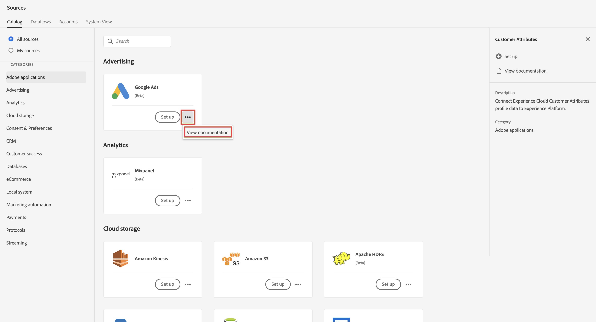

# Assimilar e usar dados usando conectores de origem.

Este guia de início rápido explica como você pode assimilar dados no Adobe Experience Platform usando um conector de origem para um provedor de dados e, em seguida, usar esses dados no Customer Journey Analytics.

Para isso, é necessário:

- **Configurar um esquema e um conjunto de dados** no Adobe Experience Platform para definir o modelo (esquema) dos dados que você deseja coletar e onde realmente coletar os dados (conjunto de dados).

- **Usar um conector de origem** no Adobe Experience Platform para configurar seus dados no conjunto de dados.

- **Configurar uma conexão** em Customer Journey Analytics. Essa conexão deve (pelo menos) incluir o conjunto de dados do Adobe Experience Platform.

- **Configurar uma visualização de dados** no Customer Journey Analytics para definir métricas e dimensões que deseja usar no Analysis Workspace.

- **Configurar um projeto** no Customer Journey Analytics para criar relatórios e visualizações.

>[!NOTE]
>
>Este é um guia simplificado sobre como assimilar dados usando um conector de origem no Adobe Experience Platform e usá-los no Customer Journey Analytics. É altamente recomendável estudar as informações adicionais quando referidas.

## Configurar um esquema e um conjunto de dados

Para assimilar dados no Adobe Experience Platform, primeiro defina quais dados deseja coletar. Todos os dados assimilados no Adobe Experience Platform devem estar em conformidade com uma estrutura padrão e desnormalizada para que sejam reconhecidos e utilizados pelos recursos e capacidades downstream. O Experience Data Model (XDM) é a estrutura padrão que fornece essa estrutura no formato de schemas.

Após definir um esquema, use um ou mais conjuntos de dados para armazenar e gerenciar a coleta de dados. Um conjunto de dados é uma construção de armazenamento e gerenciamento para uma coleção de dados, normalmente uma tabela, que contém um esquema (colunas) e campos (linhas).

Todos os dados assimilados no Adobe Experience Platform devem estar em conformidade com um esquema predefinido antes que possam ser mantidos como um conjunto de dados.

### Configurar um esquema

Para esse início rápido, você deseja coletar alguns dados de fidelidade, por exemplo, id de fidelidade, pontos de fidelidade e status de fidelidade.
Para isso, primeiro defina um schema que modele esses dados.

Para configurar seu esquema:

1. Na interface do usuário do Adobe Experience Platform, no painel esquerdo, selecione **[!UICONTROL Esquemas]** within [!UICONTROL GERENCIAMENTO DE DADOS].

2. Selecionar **[!UICONTROL Criar esquema]**. Selecionar **[!UICONTROL Perfil individual XDM]** na lista de opções.

   

   >[!INFO]
   >
   >    Um esquema Perfil individual é usado para modelar o perfil _atributos_ (como nome, email, gênero). Um esquema de evento de experiência é usado para modelar a variável _comportamento_ de um perfil (como exibição de página, adicionar ao carrinho).

3. No [!UICONTROL Esquema sem título] tela:

   1. Insira um nome de exibição para o esquema e (opcional) uma descrição.

      

   2. Selecionar **[!UICONTROL + Adicionar]** em [!UICONTROL Grupos de campos].

      

      Grupos de campos são coleções reutilizáveis de objetos e atributos que permitem estender seus esquemas facilmente.

   3. No [!UICONTROL Adicionar grupos de campos] selecione a caixa de diálogo **[!UICONTROL Detalhes da Fidelidade]** grupo de campos na lista.

      

      Você pode selecionar o botão de visualização para ver uma visualização dos campos que fazem parte desse grupo de campos.

      

      Selecionar **[!UICONTROL Voltar]** para fechar a visualização.

   4. Selecionar **[!UICONTROL Adicionar grupos de campos]**.

4. Selecionar **[!UICONTROL +]** ao lado do nome do esquema no [!UICONTROL Estrutura] painel.

   

5. No [!UICONTROL Propriedades do campo] , digite `Identification` como nome, **[!UICONTROL Identificação]** como [!UICONTROL Nome de exibição], selecione **[!UICONTROL Objeto]** como [!UICONTROL Tipo] e selecione **[!UICONTROL Core v2 de perfil]** como [!UICONTROL Grupo de campos].

   

   Isso adiciona recursos de identificação ao esquema. No seu caso, você deseja identificar as informações de fidelidade usando o endereço de email nos dados de lote.

   Selecionar **[!UICONTROL Aplicar]** para adicionar esse objeto ao esquema.

6. Selecione o **[!UICONTROL email]** no objeto de identificação que você acabou de adicionar e selecione **[!UICONTROL Identidade]** e **[!UICONTROL Email]** do [!UICONTROL Namespace de identidade] no [!UICONTROL Propriedades do campo] painel.

   

   Você está especificando o endereço de email como a identidade que o serviço Adobe Experience Platform Identity pode usar para combinar (compilar) o comportamento dos perfis.

   Selecionar **[!UICONTROL Aplicar]**. Você vê que um ícone de impressão digital aparece no atributo de email.

7. Selecione o nível raiz do esquema (com o nome do esquema) e selecione a variável **[!UICONTROL Perfil]** switch.

   Você é solicitado a habilitar o esquema para o perfil. Depois de ativados, quando os dados são assimilados em conjuntos de dados com base nesse esquema, esses dados são mesclados ao Perfil do cliente em tempo real.

   Consulte [Ative o esquema para usar no Perfil do cliente em tempo real](https://experienceleague.adobe.com/docs/experience-platform/xdm/tutorials/create-schema-ui.html?lang=en#profile) para obter mais informações.

   >[!IMPORTANT]
   >
   >    Depois de salvar um esquema ativado para perfil, ele não pode mais ser desativado para perfil.

   

8. Selecionar **[!UICONTROL Salvar]** para salvar o esquema.

Você criou um schema mínimo que modela os dados de fidelidade que podem ser assimilados no Adobe Experience Platform. O schema permite que os perfis sejam identificados usando o endereço de email. Ao ativar o esquema para perfil, você garante que os dados da fonte de transmissão sejam adicionados ao Perfil do cliente em tempo real.

Consulte [Criar e editar esquemas na interface do usuário](https://experienceleague.adobe.com/docs/experience-platform/xdm/ui/resources/schemas.html) para obter mais informações sobre a adição e remoção de grupos de campos e campos individuais a um schema.

### Configurar um conjunto de dados

Com seu esquema, você definiu seu modelo de dados. Agora é necessário definir a construção para armazenar e gerenciar esses dados. Isso é feito por meio de conjuntos de dados.

Para configurar seu conjunto de dados:

1. Na interface do usuário do Adobe Experience Platform, no painel esquerdo, selecione **[!UICONTROL Conjuntos de dados]** within [!UICONTROL GERENCIAMENTO DE DADOS].

2. Selecionar **[!UICONTROL Criar conjunto de dados]**.

   

3. Selecionar **[!UICONTROL Criar conjunto de dados a partir do esquema]**.

   

4. Selecione o schema criado anteriormente e selecione **[!UICONTROL Próximo]**.

5. Nomeie seu conjunto de dados e (opcional) forneça uma descrição.

   

6. Selecionar **[!UICONTROL Concluir]**.

7. Selecione o **[!UICONTROL Perfil]** switch.

   Você é solicitado a habilitar o conjunto de dados para perfil. Depois de habilitado, o conjunto de dados enriquece os perfis do cliente em tempo real com seus dados assimilados.

   >[!IMPORTANT]
   >
   >    Você só pode ativar um conjunto de dados para perfil quando o esquema, ao qual o conjunto de dados adere, também estiver ativado para perfil.

   

Consulte [Guia da interface do usuário de conjuntos de dados](https://experienceleague.adobe.com/docs/experience-platform/catalog/datasets/user-guide.html?lang=pt-BR) para obter muito mais informações sobre como visualizar, visualizar, criar, excluir um conjunto de dados. E como ativar um conjunto de dados para o Perfil do cliente em tempo real.

## Usar um conector de origem

Dependendo de onde você recebe os dados de fidelidade, você escolhe o conector de origem relevante disponível no Adobe Experience Platform.

Para configurar um conector de origem:

1. Na interface do usuário do Adobe Experience Platform, selecione **[!UICONTROL Fontes]** from [!UICONTROL CONEXÕES] no painel esquerdo.

2. Selecione o conector de origem na lista de conectores de origem disponíveis. Cada conector segue um workflow semelhante:

   - **[!UICONTROL Autenticação]**. Você fornece detalhes de autenticação para acessar a fonte de dados.

   - **[!UICONTROL Selecionar dados]**: Você seleciona os dados de origem que deseja assimilar.

   - **[!UICONTROL Detalhes do fluxo de dados]**: Você fornece detalhes adicionais sobre o fluxo de dados, ou seja, nome e qual conjunto de dados usar.

   - **[!UICONTROL Mapeamento]**: Você mapeia os campos de dados de origem de entrada para atributos no esquema associado ao conjunto de dados selecionado.

   - **[!UICONTROL Agendamento]**: Se disponível, é possível agendar a assimilação de dados.

   - **[!UICONTROL Revisão]**: Você verá uma análise da definição do conector de origem.

   Cada conector fornece documentação detalhada.

   Para acessar esta documentação:

   - No bloco do conector, selecione o **[!UICONTROL ...]** ao lado de [!UICONTROL Configurar] ou [!UICONTROL Adicionar dados].

      

   - Selecionar **[!UICONTROL Exibir documentação]**.

Consulte [Assimilar e usar dados da Adobe Analytics tradicional](./analytics.md) como usar o conector de origem do Adobe Analytics.

Consulte [Assimilar e usar dados de transmissão](./streaming.md) como usar o conector de origem da API HTTP.

Consulte [Visão geral dos conectores de origem](https://experienceleague.adobe.com/docs/experience-platform/sources/home.html?lang=en#terms-and-conditions) para obter uma visão geral dos conectores de origem, incluindo links para mais informações sobre cada conector.

## Configurar uma conexão

Para usar os dados do Adobe Experience Platform no Customer Journey Analytics, crie uma conexão que inclua os dados resultantes da configuração do esquema, do conjunto de dados e do fluxo de trabalho.

Uma conexão permite integrar conjuntos de dados da Adobe Experience Platform ao Espaço de trabalho. Para criar relatórios sobre esses conjuntos de dados, primeiro é necessário estabelecer uma conexão entre os conjuntos de dados no Adobe Experience Platform e no Workspace.

Para criar sua conexão:

1. Na interface do usuário do Customer Journey Analytics, selecione **[!UICONTROL Conexões]** na navegação superior.

2. Selecionar **[!UICONTROL Criar nova conexão]**.

3. No [!UICONTROL Conexão sem título] tela:

   Nomeie e descreva sua conexão em [!UICONTROL Configurações de conexão].

   Selecione a sandbox correta no [!UICONTROL Sandbox] listar em [!UICONTROL Configurações de dados] e selecione o número de eventos diários no [!UICONTROL Número médio de eventos diários] lista.

   

   Selecionar **[!UICONTROL Adicionar conjuntos de dados]**.

   No [!UICONTROL Selecionar conjuntos de dados] etapa em [!UICONTROL Adicionar conjuntos de dados]:

   - Selecione o conjunto de dados criado anteriormente (`Example Loyalty Dataset`) e qualquer outro conjunto de dados que você deseja incluir em sua conexão.

      

   - Selecione **[!UICONTROL Próximo]**.
   No [!UICONTROL Configurações de conjuntos de dados] etapa em [!UICONTROL Adicionar conjuntos de dados]:

   - Para cada conjunto de dados:

      - Selecione um [!UICONTROL ID da pessoa] nas identidades disponíveis definidas nos esquemas do conjunto de dados no Adobe Experience Platform.

      - Selecione a fonte de dados correta no [!UICONTROL Tipo de fonte de dados] lista. Se você especificar **[!UICONTROL Outras]**, em seguida, adicione uma descrição para a fonte de dados.

      - Definir **[!UICONTROL Importar todos os novos dados]** e **[!UICONTROL Preenchimento retroativo de conjunto de dados com dados existentes]** de acordo com suas preferências.

      

   - Selecionar **[!UICONTROL Adicionar conjuntos de dados]**.
   Selecione **[!UICONTROL Salvar]**.

Consulte [Visão geral das conexões](../connections/overview.md) para obter mais informações sobre como criar e gerenciar uma conexão e como selecionar e combinar conjuntos de dados.

## Configurar uma visualização de dados

Uma visualização de dados é um container específico do Customer Journey Analytics que permite determinar como interpretar dados de uma conexão. Ele especifica todas as dimensões e métricas disponíveis no Analysis Workspace e de quais colunas elas obtêm seus dados. As visualizações de dados são definidas na preparação de relatórios no Analysis Workspace.

Para criar sua visualização de dados:

1. Na interface do usuário do Customer Journey Analytics, selecione **[!UICONTROL Visualizações de dados]** na navegação superior.

2. Selecionar **[!UICONTROL Criar nova visualização de dados]**.

3. No [!UICONTROL Configurar] etapa:

   Selecione sua conexão no [!UICONTROL Conexão] lista.

   Nomeie e (opcionalmente) descreva sua conexão.

   

   Selecionar **[!UICONTROL Salvar e continuar]**.

4. No [!UICONTROL Componentes] etapa:

   Adicione qualquer campo de esquema e/ou componente padrão que deseja incluir à [!UICONTROL MÉTRICAS] ou [!UICONTROL DIMENSION] caixas de componentes.

   

   Selecionar **[!UICONTROL Salvar e continuar]**.

5. No [!UICONTROL Configurações] etapa:

   Configurações de 

   Deixe as configurações como estão e selecione **[!UICONTROL Salvar e concluir]**.

Consulte [Visão geral das visualizações de dados](../data-views/data-views.md) para obter mais informações sobre como criar e editar uma visualização de dados, quais componentes estão disponíveis para você usar na visualização de dados e como usar configurações de filtro e sessões.

## Configurar um projeto

O Analysis Workspace é uma ferramenta de navegador flexível que permite criar análises e compartilhar insights rapidamente com base em seus dados. Você usa projetos do Workspace para combinar componentes de dados, tabelas e visualizações para criar sua análise e compartilhar com qualquer pessoa em sua organização.

Para criar o projeto:

1. Na interface do usuário do Customer Journey Analytics, selecione **[!UICONTROL Projetos]** na navegação superior.

2. Selecionar **[!UICONTROL Projetos]** no painel de navegação esquerdo.

3. Selecionar **[!UICONTROL Criar projeto]**.

   

   Selecionar **[!UICONTROL Projeto em branco]**.

   

4. Selecione sua visualização de dados na lista.

   .

5. Comece a arrastar e soltar dimensões e métricas na [!UICONTROL Tabela de forma livre] no [!UICONTROL Painel] para criar seu primeiro relatório. Como exemplo, arraste `Program Points Balance` e `Page View` como métricas e `email` como dimensão para obter uma visão geral rápida dos perfis que visitaram seu site e fazem parte do programa de fidelidade que coleta pontos de fidelidade.

   

Consulte [Visão geral do Analysis Workspace](../analysis-workspace/home.md) para obter mais informações sobre como criar projetos e sua análise usando componentes, visualizações e painéis.

>[!SUCCESS]
>
>Você concluiu todas as etapas. A partir da definição de quais dados de fidelidade você deseja coletar (esquema) e onde armazená-los (conjunto de dados) no Adobe Experience Platform, você configurou o conector de origem apropriado para fornecer os dados de fidelidade. Você definiu uma conexão no Customer Journey Analytics para usar os dados de fidelidade assimilados e outros dados. A definição da visualização de dados permite especificar qual dimensão e métricas usar e, por fim, criar seu primeiro projeto visualizando e analisando seus dados.
