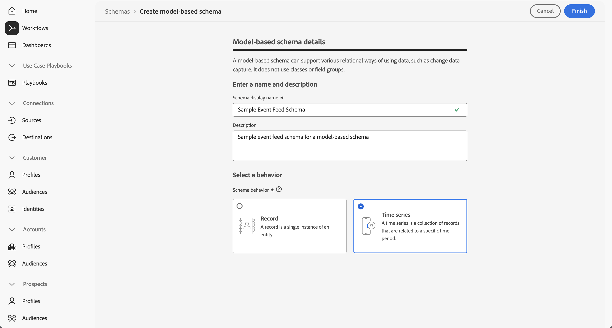
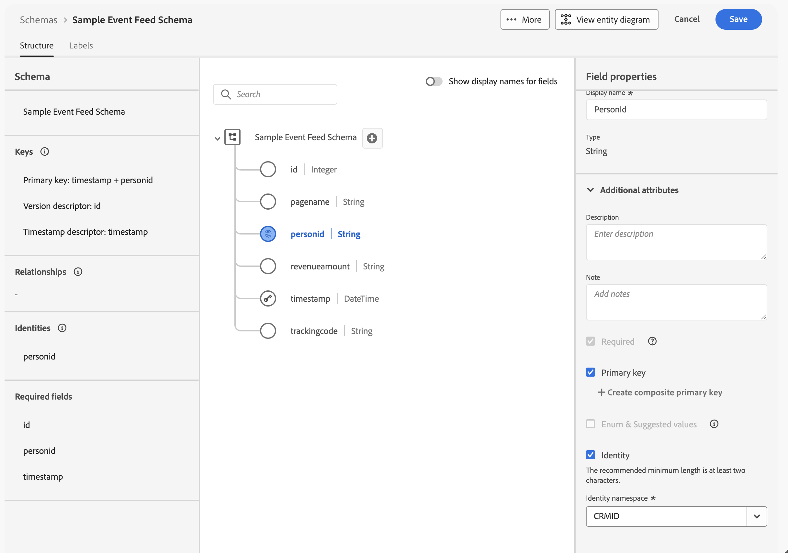

# Espelhar e usar dados baseados em modelo

{{release-limited-testing}}

Este guia de início rápido explica como usar o [Experience Platform Data Mirror for Customer Journey Analytics](data-mirror.md) para espelhar dados baseados em modelo a partir de uma solução nativa de data warehouse no Adobe Experience Platform. E então usar aqueles dados no Customer Journey Analytics.

Para realizar esse caso de uso, é necessário:

* **Use uma solução nativa de data warehouse** para armazenar dados que você deseja espelhar no Experience Platform. Em seguida, use esses dados no Customer Journey Analytics para relatar e analisar.

* **Configure um esquema** no Experience Platform para definir o modelo (esquema) dos dados que você deseja espelhar.

* **Use um conector de origem** no Experience Platform para obter seus dados espelhados em um conjunto de dados.

* **Configurar uma conexão** no Customer Journey Analytics. Essa conexão deve (pelo menos) incluir seu conjunto de dados baseado em modelo do Experience Platform.

* **Configurar uma visualização de dados** no Customer Journey Analytics para definir métricas e dimensões que você deseja usar no Analysis Workspace.

* **Configurar um projeto** no Customer Journey Analytics para criar relatórios e visualizações.

O Experience Platform Data Mirror para Customer Journey Analytics requer esquemas baseados em modelo.


>[!NOTE]
>
>Este guia de início rápido é um guia simplificado sobre como espelhar dados baseados em modelo no Adobe Experience Platform e usar esses dados no Customer Journey Analytics. É altamente recomendável estudar as informações adicionais quando referidas.


## Usar uma solução nativa de data warehouse

Este guia de início rápido usa o [[!DNL Google BigQuery]](datawarehouse.md#google-bigquery) como a solução nativa de data warehouse. Outras [soluções com suporte](datawarehouse.md) são [[!DNL Snowflake]](datawarehouse.md#snowflake) e [[!DNL Azure Databricks]](datawarehouse.md#azure-databricks).

Em [!DNL Google BigQuery], os seguintes dados de exemplo são armazenados e atualizados regularmente em uma tabela chamada **[!UICONTROL eventdata]**.

+++ Detalhes de dados de evento de amostra

| carimbo de data e hora | id | pagename | personid | trackingcode | ordens | valor de receita |
| :---                      |  ---: | :---              | :---            | :---          |   ---: | :---           |
| 03/2025-06T19:15:39+00:00 | 10001 | página inicial | person-1abc123 | abc123 |        |                |
| 03/2025-06T19:15:39+00:00 | 10002 | página de confirmação | person-1abc123 |               | 1 | 174,25 |
| 03/2025-06T19:15:39+00:00 | 10003 | página inicial | person-2def123 | def123 |        |                |
| 03/2025-06T19:15:39+00:00 | 10004 | página inicial | person-3ghi123 | ghi123 |        |                |
| 03/2025-06T19:15:39+00:00 | 10005 | página de confirmação | person-3ghi123 |               | 1 | 149,25 |
| 03/2025-06T19:15:39+00:00 | 10006 | página inicial | person-4abc456 | abc456 |        |                |
| 03/2025-06T19:15:39+00:00 | 10007 | página inicial | person-5def456 | def456 |        |                |
| 03/2025-06T19:15:39+00:00 | 10008 | página inicial | pessoa-6ghi456 | ghi456 |        |                |
| 03/2025-06T19:15:39+00:00 | 10009 | página de confirmação | pessoa-6ghi456 |               | 1 | 159,25 |
| 03/2025-06T19:15:39+00:00 | 10010 | página inicial | person-7abc789 | abc789 |        |                |
| 03/2025-06T19:15:39+00:00 | 10011 | página inicial | pessoa-8def789 | def789 |        |                |
| 03/2025-06T19:15:39+00:00 | 10012 | página inicial | pessoa-9ghi789 | ghi789 |        |                |
| 03/2025-06T19:15:39+00:00 | 10013 | página de confirmação | pessoa-9ghi789 |               | 1 | 124,25 |
| 03/2025-06T19:15:39+00:00 | 10014 | página inicial | person-10abc987 | abc987 |        |                |
| 03/2025-06T19:15:39+00:00 | 10015 | página inicial | person-11def987 | def987 |        |                |
| 03/2025-06T19:15:39+00:00 | 10016 | página inicial | person-12ghi987 | ghi987 |        |                |
| 03/2025-06T19:15:39+00:00 | 10017 | página inicial | person-13abc654 | abc654 |        |                |
| 03/2025-06T19:15:39+00:00 | 10018 | página inicial | person-14def654 | def654 |        |                |
| 03/2025-06T19:15:39+00:00 | 10019 | página inicial | person-15ghi654 | ghi654 |        |                |
| 03/2025-06T19:15:39+00:00 | 10020 | página de confirmação | person-15ghi654 |               | 1 | 174,25 |

+++

Os dados são armazenados em uma tabela de banco de dados com um schema associado. Para inspecionar a tabela de banco de dados:

1. Faça logon no Google BigQuery.
1. Selecione **[!UICONTROL BigQuery]** > **[!UICONTROL Studio]**.
1. Selecione o projeto, o conjunto de dados e a tabela. Na guia **[!UICONTROL Schema]**, você verá uma visão geral do esquema para os dados do evento.

   

Para inspecionar os dados:

1. Selecione **[!UICONTROL Consulta]**.
1. Execute uma consulta de exemplo no editor de consultas, onde `project` é o nome do seu projeto e `datasets` é o nome dos seus conjuntos de dados:

   ```sql
   SELECT * FROM `project.datasets.eventdata` LIMIT 100
   ```

   

Para o Experience Platform Data Mirror para Customer Journey Analytics, as tabelas na solução nativa de data warehouse devem estar habilitadas para o histórico de alterações. Para verificar se a tabela está ativada para o histórico de alterações:

1. Execute a seguinte instrução SQL no editor de consultas para verificar a configuração, em que `project` é o nome do seu projeto e `datasets` é o nome dos seus conjuntos de dados:

   ```sql
   SELECT
      table_name,
      MAX(CASE WHEN option_name = 'enable_change_history' THEN option_value END) AS enable_change_history
   FROM `project.datasets.INFORMATION_SCHEMA.TABLE_OPTIONS`
   WHERE table_name = 'eventdata'
   GROUP BY table_name
   ORDER BY table_name;
   ```

1. Se o resultado não for **[!UICONTROL TRUE]**, use a seguinte instrução SQL para habilitar o histórico de alterações, onde `project` é o nome do seu projeto e `datasets` é o nome dos seus conjuntos de dados:

   ```sql
   ALTER TABLE `project.datasets.eventdata` 
   SET OPTIONS (enable_change_history = TRUE);
   ```

Os dados na tabela na solução nativa de data warehouse estão prontos para o Experience Platform Data Mirror para Customer Journey Analytics.


## Configurar um esquema

Para espelhar dados no Experience Platform, primeiro defina o esquema para os dados. Todos os dados que você deseja espelhar no Experience Platform e que usam o Experience Platform Data Mirror para Customer Journey Analytics devem estar em conformidade com um esquema baseado em modelo.

Defina um esquema que modele esses dados. Para configurar o esquema:

1. Na interface da Adobe Experience Platform, no painel à esquerda, selecione **[!UICONTROL Esquemas]** em **[!UICONTROL Gerenciamento de dados]**.

1. Selecione **[!UICONTROL Criar esquema]**. 
1. No menu suspenso, selecione **[!UICONTROL Baseado em modelo]**.
1. Se você vir um pop-up com a opção para selecionar entre **[!UICONTROL Criar manualmente]** ou **[!UICONTROL Carregar um arquivo DDL]**:
   1. Selecione **[!UICONTROL Criar manualmente]**.

      

   1. Selecione **[!UICONTROL Próximo]**.
1. Na interface **[!UICONTROL Esquemas]** > **[!UICONTROL Criar esquema baseado em modelo]**:
   1. Insira um **[!UICONTROL nome para exibição do esquema]**. Por exemplo: `Sample Event Feed Schema`.
   1. Insira uma **[!UICONTROL Descrição]**. Por exemplo: `Sample event feed schema for a model-based schema`.
   1. Selecione **[!UICONTROL Série temporal]** como o **[!UICONTROL Comportamento do esquema]**. Você seleciona **[!UICONTROL Série temporal]** para dados baseados em série temporal e **[!UICONTROL Registro]** para dados baseados em registro. O comportamento define a estrutura do schema e as propriedades incluídas.

      O Experience Platform Data Mirror for Customer Journey Analytics é usado principalmente para dados de séries de tempo (por exemplo, dados de evento).

      

   1. Selecione **[!UICONTROL Concluir]**.

1. Na interface **[!UICONTROL Esquemas]** > **[!UICONTROL Esquema de feed de eventos de amostra]**, você verá um aviso de que os esquemas baseados em modelo oferecem suporte à assimilação como linhas de alteração.

   

   A assimilação como linhas de alteração também é conhecida como captura de dados de alteração (CDC). Para ser compatível com a captura de dados de alteração, o esquema exige:

   * Chave primária.
   * Descritor de versão.
   * Descritor de carimbo de data e hora para dados de série temporal.

1. Selecione  ao lado de **[!UICONTROL Esquema do feed de eventos de exemplo]** para começar a adicionar campos ao esquema. Adicione os seguintes campos com tipo de dados e atributos adicionais ao esquema.

   | Nome do campo | Nome de exibição | Tipo | Atributos adicionais |
   |---|---|---|---|
   | `id` | `Id` | **[!UICONTROL Inteiro]** | Descritor de versão de  |
   | `orders` | `Orders` | **[!UICONTROL Inteiro]** | |
   | `pagename` | `Page Name` | **[!UICONTROL String]** | |
   | `personid` | `Person Id` | **[!UICONTROL String]** |  Chave primária<br/> Identidade<br/>Selecione CRMID para o namespace de Identidade. |
   | `revenueamount` | `Revenue Amount` | **[!UICONTROL Duplo]** | |
   | `timestamp` | `Timestamp` | **[!UICONTROL DateTime]** |  Descritor de carimbo de data/hora |
   | `trackingcode` | `Tracking Code` | **[!UICONTROL String]** | |


   * O campo **[!UICONTROL id]** está configurado como **[!UICONTROL Descritor de versão]**.

     

   * O campo **[!UICONTROL personid]** está configurado, junto com **[!UICONTROL carimbo de data/hora]** como **[!UICONTROL Chave primária]**. Selecione  **[!UICONTROL Criar chave primária composta]** para criar uma chave composta.

     

     O campo **[!UICONTROL personid]** também está configurado como uma **[!UICONTROL Identidade]**, com **[!UICONTROL CRMID]** como o **[!UICONTROL Namespace de identidade]**.

     

   * O campo **[!UICONTROL carimbo de data/hora]** está configurado, junto com o campo **[!UICONTROL personid]** como a **[!UICONTROL Chave primária]**. O campo **[!UICONTROL carimbo de data/hora]** também está configurado como **[!UICONTROL descritor de carimbo de data/hora]**. Você só precisa definir um campo como **[!UICONTROL Descritor de carimbo de data/hora]** para dados baseados em modelo de série temporal.

     


   Se você tiver definido corretamente **[!UICONTROL Chave primária]**, **[!UICONTROL Descritor de versão]** e **[!UICONTROL Descritor de carimbo de data/hora]**, o aviso na parte superior da definição do esquema desaparecerá.

1. Selecione **[!UICONTROL Salvar]** para salvar o esquema.


## Usar um conector de origem

Use um conector de origem para conectar a solução nativa de data warehouse à Experience Platform.

Na interface do Experience Platform:

1. Selecione **[!UICONTROL Fontes]**.
1. Selecione ou procure por **[!UICONTROL Google BigQuery]**.
1. Selecione **[!UICONTROL Adicionar dados]**.

O assistente de Adição de dados o orienta pelas etapas a seguir para conectar os dados da tabela no [!DNL Google BigQuery] ao Experience Platform.

### Autenticação

Na etapa **[!UICONTROL Autenticação]**, selecione:

* **[!UICONTROL Conta existente]** quando você já tiver uma configuração de conta para o Google BigQuery. Continue na etapa [Selecionar dados](#select-data).
* **[!UICONTROL Nova conta]** quando precisar se conectar ao Google BigQuery.
   1. Especifique um **[!UICONTROL Nome da conta]** e (opcional) **[!UICONTROL Descrição]**.
   1. Selecione seu **[!UICONTROL Tipo de autenticação]**: **[!UICONTROL Autenticação Básica]** ou **[!UICONTROL Autenticação de Serviço]**. Com base na sua seleção, forneça a entrada necessária.
   1. Selecionar **[!UICONTROL Conectar à origem]**

      

      Sua conexão foi verificada. Um  **[!UICONTROL Connected]** indicou uma conexão bem-sucedida.

   1. Selecione **[!UICONTROL Próximo]**.

  Consulte a documentação do Experience Platform para obter detalhes sobre como conectar e autenticar quando você usa o [Azure Databricks](https://experienceleague.adobe.com/pt-br/docs/experience-platform/sources/connectors/databases/databricks) ou o conector [Snowflake](https://experienceleague.adobe.com/pt-br/docs/experience-platform/sources/connectors/databases/snowflake).


### Selecionar dados

Na etapa **[!UICONTROL Selecionar dados]**:

1. Selecione a tabela na lista de tabelas. Por exemplo: **[!UICONTROL eventdata]**.

   

   Você verá uma amostra dos dados exibidos para verificação.

1. Clique em **[!UICONTROL Avançar]** para continuar.


### Detalhes do fluxo de dados

Na etapa **[!UICONTROL detalhes do fluxo de dados]**:

1. Selecione **[!UICONTROL Habilitar captura de dados de alteração]**. Uma caixa de informações **[!UICONTROL Alterar requisito de captura de dados]** é exibida com mais informações.
1. Selecione **[!UICONTROL Novo conjunto de dados]** para **[!UICONTROL Conjunto de dados de destino]** para criar um novo conjunto de dados que contenha os dados espelhados.
1. Insira um **[!UICONTROL Nome do conjunto de dados de saída]**. Por exemplo: `event-data-mirror`.
1. Selecione o esquema baseado em modelo criado anteriormente no menu suspenso **[!UICONTROL Esquema]**. Por exemplo: **[!UICONTROL Exemplo de esquema de feed de eventos]**.

   

1. Especifique outros detalhes.
1. Selecione **[!UICONTROL Próximo]**.


### Mapeamento

Na etapa **[!UICONTROL Mapeamento]**:

1. Mapeie os campos. Do esquema no Google BigQuery (**[!UICONTROL dados do Source]**) para os campos no esquema que você definiu no Experience Platform (**[!UICONTROL campos de Destino]**).

   

1. Se todos os campos estiverem mapeados corretamente, selecione **[!UICONTROL Avançar]** para continuar.


### Agendamento

Na etapa **[!UICONTROL Agendamento]**:

1. Especifique a **[!UICONTROL Frequência]** e o **[!UICONTROL Intervalo]** para agendar a sincronização dos dados espelhados.
1. Especifique a **[!UICONTROL Hora de início]** para o agendamento.

   

1. Clique em **[!UICONTROL Avançar]** para continuar.


### Consulte a seção

Na etapa **[!UICONTROL Revisão]**.

1. Revise a configuração do conector de origem.

   

1. Selecione **[!UICONTROL Concluir]**. Você é direcionado para o fluxo de dados configurado.

   


## Configurar uma conexão

Neste guia de início rápido, você cria uma nova conexão para usar os dados espelhados do Experience Platform. Como alternativa, adicione os dados espelhados a uma conexão existente.

Na interface do Customer Journey Analytics:

1. Selecione **[!UICONTROL Conexões]** do menu **[!UICONTROL Gerenciamento de Dados]**.
1. Selecione **[!UICONTROL Criar nova conexão]**.
1. Especifique o **[!UICONTROL Nome da conexão]**, **[!UICONTROL Sandbox]**, **[!UICONTROL Número médio de eventos diários]** e outros parâmetros opcionais.
1. Selecione **[!UICONTROL Adicionar conjuntos de dados]**.

   1. Na etapa **[!UICONTROL Selecionar conjuntos de dados]** de **[!UICONTROL Adicionar conjuntos de dados]**:

      1. Selecione o conjunto de dados que contém os dados espelhados. Por exemplo: **[!UICONTROL event-data-mirror]**. O conjunto de dados tem **[!UICONTROL Modelo]** como o **[!UICONTROL tipo de conjunto de dados]**.

         

      1. Adicione conjuntos de dados adicionais que sejam relevantes para a conexão.
      1. Selecione **[!UICONTROL Próximo]**.

   1. Na etapa **[!UICONTROL Configurações do conjunto de dados]** de **[!UICONTROL Adicionar conjuntos de dados]**:

      Para o conjunto de dados baseado em modelo **[!UICONTROL event-data-mirror]**

      1. Selecione **[!UICONTROL Evento]** como o **[!UICONTROL Tipo de conjunto de dados]**.
      1. Selecione o campo **[!UICONTROL PersonId]** como a **[!UICONTROL ID da pessoa]**.
      1. **[!UICONTROL Carimbo de data/hora]** é preenchido automaticamente como **[!UICONTROL Carimbo de data/hora]**.
      1. Selecione **[!UICONTROL Outros]** como o **[!UICONTROL tipo de fonte de dados]**.
      1. Insira `Google BigQuery Event Data` como a **[!UICONTROL descrição da fonte de dados]**.
      1. Especifique outros detalhes, como **[!UICONTROL Importar todos os dados novos]** e **[!UICONTROL Preencher retroativamente todos os dados existentes]**.

         

      Opcionalmente, especifique detalhes para outros conjuntos de dados.

   1. Selecione **[!UICONTROL Adicionar conjuntos de dados]**.
1. Selecione **[!UICONTROL Salvar]**.

Depois de criar uma [conexão](/help/connections/overview.md), você poderá executar várias tarefas de gerenciamento. Como [seleção e combinação de conjuntos de dados](/help/connections/combined-dataset.md), [verificação do status dos conjuntos de dados de uma conexão e do status da assimilação de dados](/help/connections/manage-connections.md) e muito mais.


## Configurar uma visualização de dados

Para criar a visualização de dados:

1. Na interface do Customer Journey Analytics, selecione **[!UICONTROL Visualizações de dados]**, opcionalmente em **[!UICONTROL Gerenciamento de dados]**, no menu superior.

2. Selecione **[!UICONTROL Criar nova visualização de dados]**.

3. Na etapa **[!UICONTROL Configurar]**:

   1. Selecione a conexão na lista **[!UICONTROL Conexão]**.

   1. Nomeie e (opcionalmente) descreva a conexão.

   1. Selecione **[!UICONTROL Salvar e continuar]**.

4. Na etapa **[!UICONTROL Componentes]**:

   1. Adicione qualquer campo de esquema e/ou componente padrão que você deseja incluir nas caixas de componentes **[!UICONTROL MÉTRICAS]** ou **[!UICONTROL DIMENSÕES]**. Adicione campos relevantes do conjunto de dados que contém os dados espelhados. Para acessar esses campos:

      1. Selecione **[!UICONTROL Conjuntos de dados de evento]**.
      1. Selecione **[!UICONTROL Campos adhoc e baseados em modelo]**.
      1. Arraste e solte campos dos esquemas baseados em modelo para **[!UICONTROL METRICS]** ou **[!UICONTROL DIMENSIONS]**.

         

   1. Defina campos derivados para campos que não têm o tipo adequado, não estão no formato adequado ou você deseja modificar por outros motivos. Por exemplo, para **[!UICONTROL Valor de receita]**.

      1. Selecione **[!UICONTROL Criar campo derivado.]**
      1. No editor de campo derivado:
         1. Defina um novo campo `Revenue Amount (Numeric)`, como abaixo.

            

         1. Selecione **[!UICONTROL Salvar]**.
      1. Arraste o novo campo derivado **[!UICONTROL Valor de receita (Numérico)]** e solte o campo em **[!UICONTROL MÉTRICAS]**.

         

   1. Selecione **[!UICONTROL Salvar e continuar]**.

5. Na etapa **[!UICONTROL Configurações]**:

   Deixe as configurações como estão e selecione **[!UICONTROL Salvar e concluir]**.

Consulte [Visão geral das visualizações de dados](../data-views/data-views.md) para obter mais informações sobre como criar e editar uma visualização de dados. E quais componentes estão disponíveis para você usar na visualização de dados e como usar as configurações de segmento e sessões.


## Configurar um projeto

O Analysis Workspace é uma ferramenta de navegador flexível que permite criar análises rapidamente e compartilhar insights com base em seus dados. Os projetos do Espaço de trabalho permitem combinar componentes de dados, tabelas e visualizações para criar a análise e compartilhar com qualquer pessoa na organização.

Para criar o projeto:

1. Na interface do Customer Journey Analytics, selecione **[!UICONTROL Workspace]** no menu superior.

2. Selecione **[!UICONTROL Projetos]** no painel de navegação esquerdo.

3. Selecione **[!UICONTROL Criar projeto]**. No pop-up:


   1. Selecione **[!UICONTROL Projeto Workspace em branco]**.

   1. Selecione **[!UICONTROL Criar]**.


4. No espaço de trabalho do **[!UICONTROL Novo projeto]**, verifique se a sua [visualização de dados](#set-up-a-data-view) está selecionada. Este modo de exibição de dados está vinculado à [conexão](#set-up-a-connection) que contém os dados espelhados.

5. Para criar seu primeiro relatório, arraste e solte dimensões e métricas na **[!UICONTROL Tabela de forma livre]** do painel **[!UICONTROL Forma livre]**. Por exemplo, arraste **[!UICONTROL Valor de receita (Numérico)]** até **[!UICONTROL _Arraste uma métrica aqui_]**. E arraste **[!UICONTROL PersonId]** e solte o campo no cabeçalho da primeira coluna. Faça outros ajustes como achar conveniente.

   O resultado final é uma visão geral dos perfis e suas receitas com base em dados espelhados originados de uma tabela do Google BigQuery.

   

Consulte [Visão geral do Analysis Workspace](../analysis-workspace/home.md) para obter mais informações sobre como criar projetos e sua análise usando componentes, visualizações e painéis.

>[!SUCCESS]
>
>Você concluiu todas as etapas. Você começou definindo quais dados espelhados desejava coletar (esquema) de uma solução nativa de data warehouse. E onde armazenar esses dados (conjunto de dados) na Experience Platform. Você configurou o conector de origem apropriado para fornecer os dados espelhados no Experience Platform. Você definiu uma conexão no Customer Journey Analytics para usar os dados do evento espelhados e (opcionalmente) outros dados. Sua definição de visualização de dados permitiu especificar quais dimensões e métricas usar com base nos dados espelhados. E, por fim, você criou seu primeiro projeto visualizando e analisando seus dados espelhados.
