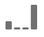

# Configurações de componente de atribuição

A atribuição dá a capacidade de personalizar como os itens de dimensão obtêm crédito por eventos bem-sucedidos.

Por exemplo:

1. Uma pessoa no seu site clica em um link de pesquisa paga para uma de suas páginas de produtos. Eles adicionam o produto ao carrinho, mas não o compram.
2. No dia seguinte, eles veem uma publicação de mídia social de um de seus amigos. Eles clicam no link e concluem a compra.

Em alguns relatórios, você pode desejar que a ordem seja atribuída à pesquisa paga. Em outros relatórios, você pode desejar que a ordem seja atribuída ao Social. A atribuição permite controlar esse aspecto dos relatórios.

## Definir um modelo de atribuição padrão do componente

É possível definir um modelo de atribuição padrão para uma determinada métrica atualizando a configuração da métrica na visualização de dados. Isso substitui o modelo de atribuição da métrica sempre que é usada no Analysis Workspace.

>[!NOTE]
>
>Considere o seguinte ao ativar a atribuição em uma métrica:
>
>* **Ao usar o componente em um relatório com o *uma única dimensão*:** A atribuição do componente ignora o modelo de alocação quando um modelo de atribuição não padrão é usado.
>
>* **Ao usar o componente em um relatório com o *várias dimensões*:** A atribuição do componente retém o modelo de alocação quando um modelo de atribuição não padrão é usado.
>
>   Várias dimensões estão disponíveis somente quando [exportação de dados para a nuvem](/help/analysis-workspace/export/export-cloud.md).
>
> Para obter mais informações sobre alocação, consulte [Configurações do componente de Persistência](/help/data-views/component-settings/persistence.md).

Para atualizar o modelo de atribuição padrão de um componente:

1. Vá para a visualização de dados que contém o componente cujo modelo de atribuição padrão você deseja atualizar.

1. Selecione o componente e expanda a seção Atribuição no lado direito da tela.

   

1. Selecionar [!UICONTROL **Definir atribuição**] e selecione o modelo de atribuição na [!UICONTROL **Modelo de atribuição**] menu suspenso.

   Consulte [Modelos de atribuição](#attribution-models) para saber mais sobre cada modelo de atribuição.

1. Selecione [!UICONTROL **Salvar e continuar**].

>[!TIP]
>
>Se sua organização exigir que uma métrica tenha várias configurações de atribuição, você poderá executar um dos seguintes procedimentos:
>
> * Copie a métrica na visualização de dados com cada configuração de atribuição desejada. É possível incluir a mesma métrica várias vezes em uma visualização de dados, dando a cada métrica uma configuração diferente. Certifique-se de rotular cada métrica apropriadamente para que os analistas entendam a diferença entre essas métricas ao gerar relatórios.
>
> * Substitua a métrica no Analysis Workspace. Em métricas de [Configurações de coluna](/help/analysis-workspace/visualizations/freeform-table/column-row-settings/column-settings.md), selecione **[!UICONTROL Usar modelo de atribuição não-padrão]** para alterar o modelo de atribuição da métrica e a janela de retrospectiva desse relatório específico.

## Modelos de atribuição

Um modelo de atribuição determina quais itens de dimensão recebem crédito por uma métrica quando vários valores são vistos na janela de pesquisa de uma métrica. Os modelos de atribuição se aplicam somente quando há vários itens de dimensão definidos na janela de pesquisa. Se apenas um único item de dimensão for definido, esse item de dimensão receberá 100% de crédito independentemente do modelo de atribuição usado.

| Ícone | Modelo de atribuição | Definição |
| :---: | :--- | --- |
|  | Último contato | Dá 100% de crédito ao ponto de contato mais recente antes da conversão. Normalmente, esse modelo de atribuição é o valor padrão para qualquer métrica em que um modelo de atribuição não é especificado de outra forma. As organizações normalmente usam esse modelo, em que o tempo de conversão é relativamente curto, como na análise de palavras-chave de pesquisa interna. |
|  | Primeiro contato | Dá 100% de crédito ao primeiro ponto de contato visto na janela de retrospectiva de atribuição. As organizações normalmente usam esse modelo para entender a percepção da marca ou a aquisição do cliente. |
|  | Linear | Dá crédito igual a todos os pontos de contato que resultem em uma conversão. É útil quando os ciclos de conversão são mais longos ou exigem um engajamento do cliente mais frequente. As organizações normalmente usam esse modelo de atribuição que mede a eficácia da notificação de aplicativos móveis ou com produtos baseados em assinatura. |
|  | Participação | Dá 100% de crédito a todos os pontos de contato exclusivos. Como cada ponto de contato recebe 100% de crédito, os dados de métrica normalmente somam mais de 100%. Se um item de dimensão for exibido várias vezes separadas até uma conversão, os valores serão desduplicados em 100%. Esse modelo de atribuição é ideal em situações em que você deseja entender a quais pontos de contato os clientes estão mais expostos. As organizações de mídia normalmente usam esse modelo para calcular a velocidade do conteúdo. As varejistas geralmente usam esse modelo para entender quais partes do site são essenciais para a conversão. |
|  | Mesmo contato | Dá 100% de crédito ao mesmo evento em que ocorreu a conversão. Se um ponto de contato não ocorrer no mesmo evento que uma conversão, ele será agrupado em &quot;Nenhum&quot;. Às vezes, esse modelo de atribuição é equiparado a não ter nenhum modelo de atribuição. Ela é importante em cenários nos quais você não deseja valores de outros eventos que afetam como uma métrica dá crédito a itens de dimensão. Equipes de produto ou de design podem usar esse modelo para avaliar a eficácia de uma página na qual ocorre a conversão. |
|  | Em forma de U | Dá crédito de 40% à primeira interação, de 40% à última interação, e divide os 20% restantes para os pontos de contato entre as duas. Para conversões com um só ponto de contato, o crédito é de 100%. Para conversões com dois pontos de contato, o crédito é de 50% para ambos. Esse modelo de atribuição é melhor usado em cenários em que você valoriza mais a primeira e a última interações, mas não deseja descartar totalmente as interações adicionais entre elas. |
|  | Curva J | Dá crédito de 60% à última interação, de 20% à primeira interação, e divide os 20% restantes para os pontos de contato entre as duas. Para conversões com um só ponto de contato, o crédito é de 100%. Para conversões com dois pontos de contato, o crédito é de 75% para a última interação e de 25% para a primeira. Semelhante à forma de U, esse modelo de atribuição favorece a primeira e a última interações, mas favorece mais a última interação. |
|  | J invertido | Dá 60% de crédito ao primeiro ponto de contato, 20% de crédito ao último ponto de contato e divide os 20% restantes para os pontos de contato entre os dois. Para conversões com um só ponto de contato, o crédito é de 100%. Para conversões com dois pontos de contato, o crédito é de 75% para a primeira interação e de 25% para a última. Semelhante ao Forma de J, esse modelo de atribuição favorece a primeira e a última interações, mas favorece mais a primeira interação. |
|  | Declínio de tempo | Segue um declínio exponencial com um parâmetro personalizado de meia-vida e padrão de 7 dias. O peso de cada canal depende da quantidade de tempo decorrido entre a iniciação do ponto de contato e a conversão final. A fórmula usada para determinar o crédito é `2^(-t/halflife)`, em que `t` é o tempo entre um ponto de contato e uma conversão. Todos os pontos de contato são normalizados para 100%. Ideal para cenários em que você deseja medir a atribuição em relação a um evento específico e significativo. Quanto mais tarde ocorrer uma conversão após esse evento, menos crédito será dado. |
|  | Personalizado | Permite que você especifique os pesos que deseja atribuir ao primeiro, ao último e ao resto de pontos de contato. Os valores especificados são regularizados para 100% mesmo se os números inseridos, quando somados, não resultarem em 100. Para conversões com um só ponto de contato, o crédito é de 100%. Para interações com dois pontos de contato, o parâmetro intermediário é ignorado. O primeiro e o último ponto de contato são normalizados para 100% e o crédito é atribuído em conformidade. Esse modelo é ideal para analistas que desejam ter controle total sobre seu modelo de atribuição e têm necessidades específicas que outros modelos de atribuição não atendem. |
|  | Algorítmico | Usa técnicas estatísticas para determinar dinamicamente a alocação ideal de crédito para a métrica selecionada. O algoritmo usado para atribuição é baseado no Harsanyi Dividend da teoria dos jogos cooperativos. O dividendo de Harsanyi é uma generalização da solução de valor de Shapley (batizada de Lloyd Shapley, economista vencedor do Nobel) para distribuir crédito entre os jogadores em um jogo com contribuições desiguais para o resultado. Em um alto nível, a atribuição é calculada como uma coalizão de jogadores aos quais um excedente deve ser distribuído de forma equitativa. A distribuição excedente de cada coalizão é determinada de acordo com o excedente anteriormente criado por cada subcoalizão (ou itens de dimensão anteriormente participantes) de forma recursiva. Para obter mais detalhes, consulte os documentos originais de John Harsanyi e Lloyd Shapley: Shapley, Lloyd S. (1953). Um valor para jogos em pessoa. *Contribuições para a Teoria dos Jogos, 2(28)*, 307-317. Harsanyi, John C. (1963). Um modelo de negociação simplificado para o jogo cooperativo entre pessoas. *International Economic Review 4(2)*, 194-220. |

{style="table-layout:auto"}

## Janela de lookback

As janelas de retrospectiva representam quanto tempo uma conversão deve retroceder para incluir pontos de contato. Se um item de dimensão for definido fora da janela de pesquisa, o valor não será incluído em nenhum cálculo de atribuição.

* **14 dias**: retroage até 14 dias a partir do momento em que a conversão ocorreu.
* **30 dias**: retroage até 30 dias a partir do momento em que a conversão ocorreu.
* **60 dias**: retroage até 60 dias a partir do momento em que a conversão ocorreu.
* **90 dias**: retroage até 90 dias a partir do momento em que a conversão ocorreu.
* **Session**: retroage até o início da sessão em que ocorreu uma conversão. As janelas de retrospectiva de sessão respeitam as [Tempo limite da sessão](../create-dataview.md#session-settings).
* **Pessoa (Janela Relatórios)**: verifica todas as visitas até o primeiro dia do mês do intervalo de datas atual. Por exemplo, se o intervalo de datas de um relatório for de 15 a 30 de setembro, o intervalo de datas da retrospectiva da pessoa será de 1º a 30 de setembro. Se você usar essa janela de lookback, poderá ver ocasionalmente que os itens de dimensão são atribuídos a datas fora da janela de relatórios.
* **Tempo personalizado:** Permite definir uma janela de retrospectiva personalizada a partir de quando ocorreu uma conversão. Você pode especificar o número de minutos, horas, dias, semanas, meses ou trimestres. Por exemplo, se uma conversão ocorresse em 20 de fevereiro, uma janela de pesquisa de cinco dias avaliaria todos os pontos de contato de dimensão de 15 a 20 de fevereiro no modelo de atribuição.

## Exemplo

Considere o exemplo a seguir:

1. Em 15 de setembro, uma pessoa chega ao seu site através de um anúncio de pesquisa pago e depois sai.
2. Em 18 de setembro, a pessoa chega ao seu site novamente através de um link de mídia social que recebeu de um amigo. Eles adicionam vários itens ao carrinho, mas não compram nada.
3. Em 24 de setembro, sua equipe de marketing envia um email com um cupom para alguns dos itens em seu carrinho. Eles aplicam o cupom, mas visitam vários outros sites para ver se existem outros cupons disponíveis. Eles encontram outro cupom por meio de um anúncio de exibição e, em seguida, fazem uma compra de US$ 50.

Dependendo da janela de retrospectiva e do modelo de atribuição, os canais recebem crédito diferente. Veja a seguir alguns exemplos:

* Usar **primeiro contato** e uma **janela de retrospectiva de sessão**, a atribuição considera somente a terceira visita. Entre email e exibição, o email foi o primeiro, então o email recebe 100% de crédito pela compra de US$ 50.
* Usar **primeiro contato** e uma **janela de retrospectiva de pessoa**, a atribuição considera todas as três visitas. A pesquisa paga foi a primeira, então ela recebe 100% de crédito pela compra de US$ 50.
* Usar **linear** e uma **janela de retrospectiva de sessão**, o crédito é dividido entre email e exibição. Ambos os canais recebem um crédito de US$ 25 dólares.
* Usar **linear** e uma **janela de retrospectiva de pessoa**, o crédito é dividido entre pesquisa paga, redes sociais, email e exibição. Cada canal recebe um crédito de US$ 12,50 por esta compra.
* Usar **Forma de J** e uma **janela de retrospectiva de pessoa**, o crédito é dividido entre pesquisa paga, redes sociais, email e exibição.
   * O crédito será de 60% para a exibição (US$ 30).
   * De 20% para a pesquisa paga (US$ 10).
   * Os 20% restantes são divididos entre redes sociais e email (US$ 5 para cada).
* Usar **Decaimento de tempo** e uma **janela de retrospectiva de pessoa**, o crédito é dividido entre pesquisa paga, redes sociais, email e exibição. Usando a meia-vida padrão de 7 dias:
   * Espaço de zero dias entre o ponto de contato de exibição e a conversão. `2^(-0/7) = 1`
   * Intervalo de zero dias entre o ponto de contato do email e a conversão. `2^(-0/7) = 1`
   * Intervalo de seis dias entre o ponto de contato social e a conversão. `2^(-6/7) = 0.552`
   * Intervalo de nove dias entre o ponto de contato de pesquisa paga e a conversão. `2^(-9/7) = 0.41`
   * A normalização desses valores resulta no seguinte:
      * Exibição: 33,8%, crédito de US$ 16,88
      * Email: 33,8%, crédito de US$ 16,88
      * Redes sociais: 18,6%, crédito de US$ 9,32
      * Pesquisa paga: 13,8%, crédito de US$ 6,92

Os eventos de conversão que normalmente têm números inteiros são divididos se o crédito pertencer a mais de um canal. Por exemplo, se dois canais contribuem para um pedido usando um modelo de atribuição Linear, ambos os canais obtêm 0,5 desse pedido. Essas métricas parciais são somadas em todas as pessoas e depois arredondadas para o número inteiro mais próximo para o relatório.
