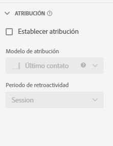

# Configurações de componente de atribuição {#attribution-component-settings}

<!-- markdownlint-disable MD034 -->

>[!CONTEXTUALHELP]
>id="cja_dataview_component_metric_attribution"
>title="Atribuição"
>abstract="Configure o modelo de atribuição padrão aplicado a uma métrica nos relatórios."

<!-- markdownlint-enable MD034 -->

A atribuição permite personalizar como os itens de dimensão recebem crédito por eventos bem-sucedidos.

Por exemplo:

1. Uma pessoa no seu site clica em um link de pesquisa paga para uma de suas páginas de produtos. Eles adicionam o produto ao carrinho, mas não o compram.
2. No dia seguinte, eles veem uma publicação de mídia social de um de seus amigos. Eles clicam no link e concluem a compra.

Em alguns relatórios, você pode desejar que a ordem seja atribuída à pesquisa paga. Em outros relatórios, você pode desejar que a ordem seja atribuída ao Social. A atribuição permite controlar esse aspecto dos relatórios.

## Definir um modelo de atribuição padrão do componente

É possível definir um modelo de atribuição padrão para uma determinada métrica atualizando a configuração da métrica na visualização de dados. Isso substitui o modelo de atribuição da métrica sempre que é usada no Analysis Workspace.

>[!NOTE]
>
>Considere o seguinte ao ativar a atribuição em uma métrica:
>
>* **Ao usar o componente em um relatório com *uma única dimensão*:** a atribuição do componente ignora o modelo de alocação quando um modelo de atribuição não padrão é usado.
>
>* **Ao usar o componente em um relatório com *várias dimensões*:** a atribuição do componente retém o modelo de alocação quando um modelo de atribuição não padrão é usado.
>
>   Várias dimensões estão disponíveis somente ao [exportar dados para a nuvem](/help/analysis-workspace/export/export-cloud.md).
>
> Para obter mais informações sobre alocação, consulte [Configurações do componente de Persistência](/help/data-views/component-settings/persistence.md).

Para atualizar o modelo de atribuição padrão de um componente:

1. Vá para a visualização de dados que contém o componente cujo modelo de atribuição padrão você deseja atualizar.

1. Selecione o componente e expanda a seção Atribuição no lado direito da tela.

   

1. Selecione [!UICONTROL **Definir atribuição**] e selecione o modelo de atribuição no menu suspenso [!UICONTROL **Modelo de atribuição**].

   Consulte [Modelos de atribuição](#attribution-models) para saber mais sobre cada modelo de atribuição.

1. Selecione [!UICONTROL **Salvar e continuar**].

>[!TIP]
>
>Se sua organização exigir que uma métrica tenha várias configurações de atribuição, você poderá executar um dos seguintes procedimentos:
>
> * Copie a métrica na visualização de dados com cada configuração de atribuição desejada. É possível incluir a mesma métrica várias vezes em uma visualização de dados, dando a cada métrica uma configuração diferente. Certifique-se de rotular cada métrica apropriadamente para que os analistas entendam a diferença entre essas métricas ao gerar relatórios.
>
> * Substitua a métrica no Analysis Workspace. Nas [Configurações de coluna](/help/analysis-workspace/visualizations/freeform-table/column-row-settings/column-settings.md) de uma métrica, selecione **[!UICONTROL Usar modelo de atribuição não padrão]** para alterar o modelo de atribuição da métrica e a janela de retrospectiva desse relatório específico.

## Modelos de atribuição {#attribution-models}

<!-- markdownlint-disable MD034 -->

>[!CONTEXTUALHELP]
>id="cja_dataviews_component_attribution_attributionmodels"
>title="Modelo"
>abstract="Selecione um modelo de atribuição para a métrica."

<!-- markdownlint-enable MD034 -->

{{attribution-models-details}}

## Janela de lookback

{{attribution-lookback-window}}

## Exemplo de atribuição {#attribution-example}

Considere o exemplo a seguir:

1. Em 15 de setembro, uma pessoa chega ao seu site através de um anúncio de pesquisa pago e depois sai.
1. Em 18 de setembro, a pessoa chega ao seu site novamente através de um link de mídia social que recebeu de um amigo. Eles adicionam vários itens ao carrinho, mas não compram nada.
1. Em 24 de setembro, sua equipe de marketing envia um email com um cupom para alguns dos itens em seu carrinho. Eles aplicam o cupom, mas visitam vários outros sites para ver se existem outros cupons disponíveis. Eles encontram outro cupom por meio de um anúncio de exibição e, em seguida, fazem uma compra de US$ 50.

Dependendo da janela de retrospectiva e do modelo de atribuição, os canais recebem crédito diferente. Veja a seguir alguns exemplos:

* Usando o **primeiro contato** e uma **janela de retrospectiva de sessão**, a atribuição considera somente a terceira visita. Entre email e exibição, o email foi o primeiro, então o email recebe 100% de crédito pela compra de US$ 50.

* Usando o **primeiro contato** e uma **janela de retrospectiva de pessoa**, a atribuição considera todas as três visitas. A pesquisa paga foi a primeira, então ela recebe 100% de crédito pela compra de US$ 50.

* Usando o **linear** e uma **janela de retrospectiva de sessão**, o crédito é dividido entre email e exibição. Ambos os canais recebem um crédito de US$ 25 dólares.
Usando o **linear** e uma **janela de retrospectiva de pessoa**, o crédito é dividido entre pesquisa paga, redes sociais, email e exibição. Cada canal recebe um crédito de US$ 12,50 por esta compra.

* Usando o **Forma de J** e uma **janela de retrospectiva de pessoa**, o crédito é dividido entre pesquisa paga, redes sociais, email e exibição.

   * O crédito será de 60% para a exibição (US$ 30).
   * De 20% para a pesquisa paga (US$ 10).
   * Os 20% restantes são divididos entre redes sociais e email (US$ 5 para cada).

* Usando o **Declínio de Tempo** e uma **janela de retrospectiva de pessoa**, o crédito é dividido entre pesquisa paga, redes sociais, email e exibição. Usando a meia-vida padrão de 7 dias:

   * Espaço de zero dias entre o ponto de contato de exibição e a conversão. `2^(-0/7) = 1`
   * Intervalo de zero dias entre o ponto de contato do email e a conversão. `2^(-0/7) = 1`
   * Intervalo de seis dias entre o ponto de contato social e a conversão. `2^(-6/7) = 0.552`
   * Intervalo de nove dias entre o ponto de contato de pesquisa paga e a conversão. `2^(-9/7) = 0.41`
   * A normalização desses valores resulta no seguinte:

      * Exibição: 33,8%, crédito de US$ 16,88
      * Email: 33,8%, crédito de US$ 16,88
      * Redes sociais: 18,6%, crédito de US$ 9,32
      * Pesquisa paga: 13,8%, crédito de US$ 6,92

Os eventos de conversão que normalmente têm números inteiros são divididos se o crédito pertencer a mais de um canal. Por exemplo, se dois canais contribuem para um pedido usando um modelo de atribuição Linear, ambos os canais obtêm 0,5 desse pedido. Essas métricas parciais são somadas em todas as pessoas e depois arredondadas para o número inteiro mais próximo para o relatório.

