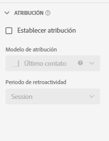

# Configurações de componente de atribuição {#attribution-component-settings}

<!-- markdownlint-disable MD034 -->

>[!CONTEXTUALHELP]
>id="dataview_component_metric_attribution"
>title="Atribuição"
>abstract="Configure o modelo de atribuição padrão aplicado a uma métrica nos relatórios."

<!-- markdownlint-enable MD034 -->

A atribuição permite personalizar como os itens de dimensão obtêm crédito por eventos bem-sucedidos.

Por exemplo:

1. Um visitante do site clica em um link de pesquisa paga para uma das suas páginas do produto. Ele adiciona o produto ao carrinho, mas não o compra.
2. No dia seguinte, ele vê uma publicação nas redes sociais de um amigo. Ele clica no link e conclui a compra.

Em alguns relatórios, você pode desejar que a ordem seja atribuída à pesquisa paga. Em outros relatórios, você pode desejar que a ordem seja atribuída ao Social. A atribuição permite controlar esse aspecto dos relatórios.

## Definir um modelo de atribuição do componente

É possível alterar o modelo de atribuição padrão de um determinado componente, atualizando a configuração do componente na visualização de dados. Isso substitui o modelo de atribuição do componente sempre que é usado no Analysis Workspace.

>[!NOTE]
>
>Considere o seguinte ao ativar um modelo de atribuição não padrão em uma métrica:
>
>* **Ao usar a métrica em um relatório com *uma única dimensão*:** a atribuição da métrica substitui o conjunto de modelos de alocação na dimensão. Por exemplo, uma métrica com uma atribuição &quot;primeiro contato&quot; substitui uma alocação de dimensão &quot;mais recente&quot;.
>
>* **Ao usar a métrica em um relatório com *várias dimensões*:** a atribuição da métrica é aplicada sobre o modelo de alocação para cada dimensão. Por exemplo, uma métrica com uma atribuição &quot;primeiro contato&quot; é aplicada sobre uma alocação de dimensão &quot;mais recente&quot;.
>
> Para mais informações sobre alocação, consulte [Configurações do componente de persistência](/help/data-views/component-settings/persistence.md).

Para atualizar o modelo de atribuição padrão de um componente:

1. Abra a visualização de dados que contém o componente cujo modelo de atribuição padrão você deseja atualizar.

1. Selecione o componente e expanda a seção **[!UICONTROL Atribuição]** no lado direito da tela.

   

1. Selecione [!UICONTROL **Definir atribuição**] e selecione a janela [modelo de atribuição](#attribution-models), [contêiner](#container) e [retrospectiva](#lookback-window).

1. Selecione [!UICONTROL **Salvar e continuar**].

>[!TIP]
>
>Se a sua organização exigir que uma métrica tenha várias configurações de atribuição, você poderá executar um dos seguintes procedimentos:
>
> * Copie a métrica na visualização de dados com cada configuração de atribuição desejada. É possível incluir a mesma métrica várias vezes em uma visualização de dados, dando a cada métrica uma configuração diferente. Certifique-se de rotular cada métrica apropriadamente, para que os analistas entendam a diferença entre essas métricas ao gerar relatórios.
>
> * Substitua a métrica no Analysis Workspace. Nas [Configurações de coluna](/help/analysis-workspace/visualizations/freeform-table/column-row-settings/column-settings.md) de uma métrica, selecione **[!UICONTROL Usar modelo de atribuição não padrão]** para alterar o modelo de atribuição da métrica e a janela de retrospectiva desse relatório específico.

## Modelos de atribuição {#attribution-models}

<!-- markdownlint-disable MD034 -->

>[!CONTEXTUALHELP]
>id="dataviews_component_attribution_attributionmodels"
>title="Modelo"
>abstract="Selecione um modelo de atribuição para a métrica."

<!-- markdownlint-enable MD034 -->

{{attribution-models-details}}

## Container

{{attribution-container}}

## Janela de retrospectiva

{{attribution-lookback-window}}

## Exemplo

{{attribution-example}}
