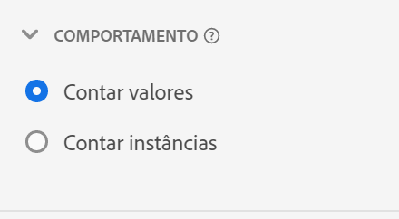
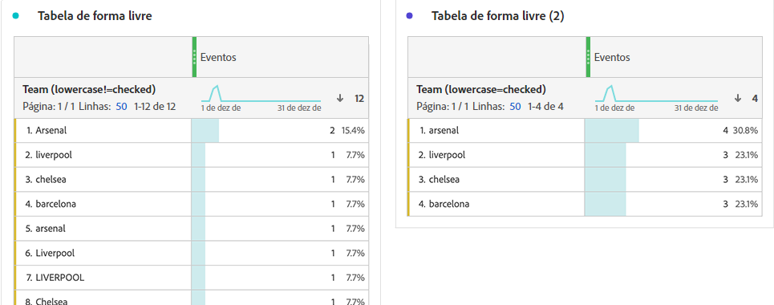

# Configurações do componente de comportamento {#behavior-component-settings}

<!-- markdownlint-disable MD034 -->

>[!CONTEXTUALHELP]
>id="dataview_component_dimension_behavior"
>title="Comportamento"
>abstract="Determine como os itens de linha são agregados nessa dimensão. Especifique se os valores da cadeia de caracteres no campo devem ser minúsculos."

<!-- markdownlint-enable MD034 -->

As configurações de comportamento estão disponíveis em dimensões e métricas. A disponibilidade das configurações depende do tipo de componente e do tipo de dados do esquema.

## Configurações de comportamento da dimensão

| Configuração | Descrição |
| --- | --- |
| [!UICONTROL Minúsculas] | Elimina a duplicação de linhas que têm o mesmo valor, mas com maiúsculas e minúsculas diferentes. Se ativada, todas as instâncias de uma dimensão com o mesmo valor são relatadas como minúsculas. Por exemplo, os dados contêm os valores `"liverpool"`, `"Liverpool"` e `"LIVERPOOL"` em uma dimensão de sequência. Se [!UICONTROL Minúsculas] estiver ativado, todos os três valores são combinados em `"liverpool"`. Se desativado, todos os três valores são tratados como distintos. |

{style="table-layout:auto"}

>[!NOTE]
>
>Se você ativar [!UICONTROL Minúsculas] em uma dimensão de conjunto de dados de pesquisa, vários valores de pesquisa poderão existir para o mesmo identificador. Se esse conflito ocorrer, o Customer Journey Analytics usará o primeiro valor ASCII agrupado (valores em maiúsculas precedem valores em minúsculas). A Adobe recomenda não usar conjuntos de dados de pesquisa que contenham o mesmo valor quando [!UICONTROL Minúsculas] estiverem ativadas.

## Configurações de comportamento da métrica

| Configuração | Descrição/Caso de uso |
| --- | --- |
| [!UICONTROL Contar valores] | Visível nos dados de esquema do tipo Integer e Double. Aumenta a métrica de acordo com o valor especificado. Por exemplo, aumenta uma métrica em 50, se o valor da coluna for `50`. |
| [!UICONTROL Contar instâncias] | Visível nos dados de esquema do tipo Integer e Double. Aumenta a métrica em um ponto, independentemente do valor. A presença de qualquer valor aumenta a métrica. Por exemplo, aumenta uma métrica em 1 se o valor da coluna for `50`. |
| [!UICONTROL Valores para contar] | Visível nos dados de esquema do tipo Booleano. Permite determinar se a métrica aumenta ao contar `true`, `false` ou ambos. |

{style="table-layout:auto"}

Você pode gerar métricas de “Pedidos” e “Receita” no Analysis Workspace usando a mesma coluna do conjunto de dados de evento, com comportamentos diferentes. Arraste a coluna do conjunto de dados “Receita” para a visualização de dados duas vezes, e configure uma para “Contar valores” e a outra para “Contar instâncias”. A métrica “Pedidos” conta instâncias, enquanto a métrica “Receita” conta valores.
