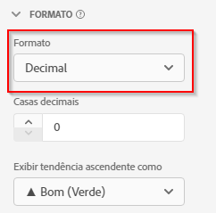

# Configurações do componente de formato

O Formato permite definir como uma determinada métrica é exibida.

| Configuração | Descrição |
| --- | --- |
| **[!UICONTROL Formato]** | Permite especificar a formatação de uma métrica como Decimal, Hora, Porcentagem ou Moeda. |
| **[!UICONTROL Casas decimais]** | Isso não é visível nos dados de esquema do tipo Integer. Permite especificar o número de casas decimais que uma métrica deve exibir. |
| **[!UICONTROL Data]** | Permite determinar como você deseja que o campo de data e hora seja exibido quando usado como uma dimensão no relatório. [Saiba mais](../../use-cases/data-views/data-views-usecases.md#date-and-date-time-use-cases) |
| **[!UICONTROL Data e hora]** | Permite determinar como você deseja que o campo de data e hora seja exibido quando usado como uma dimensão no relatório. [Saiba mais](../../use-cases/data-views/data-views-usecases.md#date-and-date-time-use-cases) |
| **[!UICONTROL Moeda]** | Permite determinar em qual moeda a métrica será exibida. Consulte [Moeda](#currency) mais detalhes. |
| **[!UICONTROL Exibir tendência ascendente como]** | Permite especificar se uma tendência de alta nessa métrica é boa (verde) ou ruim (vermelho). |
| **[!UICONTROL Valor verdadeiro]** e **[!UICONTROL Valor falso]** | Visível somente em dados de esquema do tipo Booleano. Permite personalizar o rótulo do item de dimensão para valores `true` e `false`. |

{style="table-layout:auto"}

## Moeda

Ao selecionar **[!UICONTROL Moeda]** como o [!UICONTROL Formato] para uma métrica, você pode determinar como exibir e converter moedas.

### Exibir moeda

Para exibir uma moeda para uma métrica:

1. Insira o número de **[!UICONTROL Casas decimais]**.

1. Selecione uma moeda na caixa **[!UICONTROL Exibir moeda em]** lista.

### Converter e exibir moeda

{{release-limited-testing-section}}

Para ativar a conversão de uma moeda para uma ou mais métricas:

- Configure sua conexão Customer Journey Analytics para conter pelo menos um conjunto de dados de evento que contenha uma dimensão de código de moeda para cada evento que contenha uma métrica de moeda. Essa dimensão de código monetário usa um código monetário alfabético em conformidade com a [ISO 4217](https://www.iso.org/iso-4217-currency-codes.html) padrão para representação de moedas. Esses valores devem estar no formato de letras maiúsculas, como USD por $, EUR por €, GBP por £.

   1. Selecione a dimensão de um de seus conjuntos de dados que contém os códigos monetários. Por exemplo, [!UICONTROL Código de moeda].

   1. Selecionar **[!UICONTROL Código de moeda]** da lista de dimensões.

- Repita essas etapas caso tenha mais dimensões com códigos de moeda que deseja usar para a conversão de moeda.

>[!NOTE]
>
>A métrica selecionada para conversão de moeda deve ter um tipo numérico (Duplo, Longo, Inteiro, Curto, Byte).

Para definir como converter e exibir uma moeda para uma métrica:

1. Insira o número de **[!UICONTROL Casas decimais]**.

1. Selecionar **[!UICONTROL Converter Simultaneidade]**.

1. Selecione a dimensão apropriada na lista de dimensões que contém o campo de código de moeda.

1. Selecione uma moeda na caixa **[!UICONTROL Converter e exibir moeda em]** lista.

### Perguntas frequentes

+++ Como a conversão de moeda é executada?

Após o tempo do relatório, o valor da métrica e o código de moeda original são convertidos em USD e, em seguida, convertidos na moeda configurada para exibição. Para essa conversão, são usadas as taxas de câmbio diárias da moeda, aplicáveis no momento do evento.

+++

+++ Até que ponto as taxas de conversão diárias são mantidas?

As taxas de conversão diárias são mantidas nos últimos quatro anos?

+++

+++ E se eu não tiver um campo de código monetário como parte do meu esquema de dados atual?

Existem várias opções para criar um novo campo de código monetário, incluindo Preparo de dados, Distiller de dados e Campos derivados. O Preparo de dados seria ideal para novas implementações, pois seria apenas progressivo. Dependendo da configuração de uma organização, o Data Distiller e os Campos derivados podem ser usados para acessar os valores do código monetário historicamente.

+++

