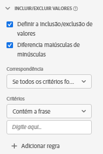

# Configurações do componente dos valores de Inclusão e Exclusão {#include-exclude-values-component-settings}

<!-- markdownlint-disable MD034 -->

>[!CONTEXTUALHELP]
>id="dataview_component_metric_includeexcludevalues"
>title="Incluir/excluir valores"
>abstract="Filtre uma métrica para contar apenas os valores que correspondem a critérios específicos."

<!-- markdownlint-enable MD034 -->

<!-- markdownlint-disable MD034 -->

>[!CONTEXTUALHELP]
>id="dataview_component_dimension_includeexcludevalues"
>title="Incluir/excluir valores"
>abstract="Restrinja uma dimensão para incluir apenas valores que correspondam a critérios específicos. Inclusões e exclusões ocorrem antes da alocação e segmentação nos relatórios. Determine se a lógica de segmento especificada diferencia maiúsculas de minúsculas."

<!-- markdownlint-enable MD034 -->

Valores de inclusão e exclusão permitem criar regras que dependem do valor de um item de dimensão. Valores que não atendem aos critérios definidos são tratados no Analysis Workspace como se nunca houvessem existido, embora os dados ainda existam no conjunto de dados subjacente.

| Configuração | Descrição/Caso de uso |
| --- | --- |
| [!UICONTROL Definir a inclusão/exclusão de valores] | Uma caixa de seleção que permite ativar as condições em que dados são incluídos em uma visualização de dados. |
| [!UICONTROL Diferencia maiúsculas de minúsculas] | Visível nos tipos de dados String do esquema. Definido como ativado por padrão. Essa configuração se aplica somente à lógica dos [!UICONTROL Valores de Inclusão/Exclusão], não ao valor resultante. Permite especificar se a regra diferencia maiúsculas de minúsculas. |
| [!UICONTROL Corresponder] | Permite especificar quais valores você gostaria de considerar para os relatórios antes da atribuição e segmentos (por exemplo, usar apenas valores contendo a frase &quot;erro&quot;). Você pode especificar **[!UICONTROL Se todos os critérios forem satisfeitos]** ou **[!UICONTROL Se qualquer critério for satisfeito]**. Separe cada valor com um espaço. |
| [!UICONTROL Critérios] | Permite especificar a lógica de correspondência que deve ser aplicada a uma regra de segmento específica.<ul><li>**String**: [!UICONTROL Contém a frase], [!UICONTROL Contém qualquer termo], [!UICONTROL Contém todos os termos], [!UICONTROL Não contém nenhum termo], [!UICONTROL Não contém a frase], [!UICONTROL É igual a], [!UICONTROL Não é igual a], [!UICONTROL Começa com], [!UICONTROL Termina com]</li><li>**Número duplo/inteiro**: [!UICONTROL É igual a], [!UICONTROL Não é igual a], [!UICONTROL É maior que], [!UICONTROL É menor que], [!UICONTROL É maior que ou igual a], [!UICONTROL É menor que ou igual a]</li><li>**Data**: [!UICONTROL É igual a], [!UICONTROL Não é igual a], [!UICONTROL É posterior a], [!UICONTROL É anterior a], [!UICONTROL Ocorre dentro de]</li></ul> |
| [!UICONTROL Corresponder operando] | Permite especificar o operando correspondente ao qual o operador deve ser aplicado.<ul><li>**Sequência**: Campo de texto</li><li>**Duplo/Número inteiro**: Campo de texto com setas para cima/para baixo para valores numéricos</li><li>**Data**: Seletor de granularidade do dia (calendário)</li><li>**Data Hora**: Seletor de granularidade de data e hora</li></ul> |
| [!UICONTROL Adicionar regra] | Permite especificar um operador e um operando de correspondência adicional. |

{style="table-layout:auto"}
