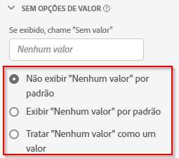

# Configurações do componente Opções de valor nulo {#no-value-options-component-settings}

<!-- markdownlint-disable MD034 -->

>[!CONTEXTUALHELP]
>id="dataview_component_dimension_novalueoptions"
>title="Sem opções de valor"
>abstract="Configure o comportamento padrão para quando nenhum valor estiver presente em uma dimensão."

<!-- markdownlint-enable MD034 -->

As [!UICONTROL opções de valor nulo] permitem determinar como o Analysis Workspace lida com situações em que um evento de um conjunto de dados contém uma métrica, mas a dimensão não contém um valor. Permite escolher o nome desse item de dimensão, ocultá-lo totalmente ou até mesmo tratá-lo como um valor real.

## Configurações {#settings}

| Configuração | Descrição |
| --- | --- |
| **[!UICONTROL Se exibido, chamar de “Valor nulo”]** | Um campo de texto que permite dar um outro nome para o item de dimensão **[!UICONTROL Valor nulo]**. |
| **[!UICONTROL Não mostrar “Nenhum valor” por padrão]** | Não mostra esse valor nos relatórios. Ocorrências de métrica não vinculadas a essa dimensão não são visíveis no relatório. |
| **[!UICONTROL Mostrar “Nenhum valor” por padrão]** | Mostra esse valor nos relatórios. |
| **[!UICONTROL Tratar “Nenhum valor” como um valor]** | (Não compatível com dimensões numéricas) Substitui valores em branco nos dados pelo texto que você especificou em [!UICONTROL Se exibido, chamar “Nenhum valor”]. Por exemplo, se você tiver tipos de dispositivo móvel como a dimensão, poderá renomear o item **[!UICONTROL Nenhum valor]** para &quot;Desktop&quot;. Ao alterar este campo para um valor personalizado, ele será tratado como um valor legítimo de sequência de caracteres. Portanto, se você inserir o valor &quot;Vermelho&quot; nesse campo, qualquer instância da sequência &quot;Vermelho&quot; que for mostrada nos próprios dados também será inserida sob o mesmo item da linha especificado. |

## Compatibilidade com “Nenhum valor” em dimensões numéricas {#numeric}

Ao usar um valor numérico como uma dimensão, você pode

* Configurar a opção “Nenhum valor” em uma visualização de dados. Observe que todas as configurações mostradas acima são compatíveis, exceto **[!UICONTROL Tratar “Nenhum valor” como um valor]**.
* Use **[!UICONTROL Incluir “Nenhum valor”]** para dimensões numéricas em uma tabela de forma livre no espaço de trabalho.
* No Construtor de segmentos, use os operadores **[!UICONTROL existe]** ou **[!UICONTROL não existe]** com dimensões numéricas.

>[!MORELIKETHIS]
>
>[O manual completo para manipular &quot;Nenhum valor&quot; no Adobe Customer Journey Analytics](https://experienceleaguecommunities.adobe.com/t5/adobe-analytics-blogs/the-complete-playbook-for-handling-no-value-in-adobe-cja/ba-p/756696#M598).

