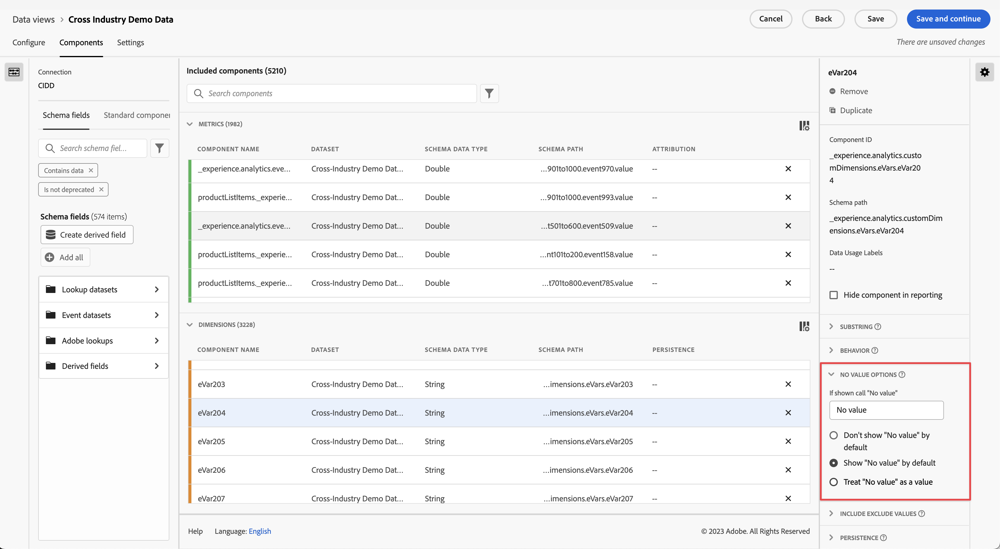

# Configurações do componente Opções de valor nulo

As Opções de valor nulo permitem determinar como o Analysis Workspace trata situações em que um evento em um conjunto de dados contém uma métrica, mas a dimensão não continha um valor. Permite escolher o nome desse item de dimensão, ocultá-lo totalmente ou até mesmo tratá-lo como um valor real.

| Configuração | Descrição |
| --- | --- |
| [!UICONTROL Se exibido, chamar de “Valor nulo”] | Um campo de texto que permite dar um outro nome para o item de dimensão **[!UICONTROL Valor nulo]**. |
| [!UICONTROL Não mostrar Nenhum valor por padrão] | Não mostra esse valor nos relatórios. Ocorrências de métrica não vinculadas a essa dimensão não são visíveis no relatório. |
| [!UICONTROL Mostrar Nenhum valor por padrão] | Mostra esse valor nos relatórios. |
| [!UICONTROL Tratar Nenhum valor como um valor] | Substitui valores em branco nos dados pelo texto especificado em [!UICONTROL Se exibido, chamar de “Nenhum valor”]. Por exemplo, se você tiver tipos de dispositivo móvel como a dimensão, poderá renomear o item **[!UICONTROL Nenhum valor]** para &quot;Desktop&quot;. Ao alterar este campo para um valor personalizado, ele será tratado como um valor legítimo de sequência de caracteres. Portanto, se você inserir o valor &quot;Vermelho&quot; nesse campo, qualquer instância da sequência &quot;Vermelho&quot; que for mostrada nos próprios dados também será inserida sob o mesmo item da linha especificado. |
