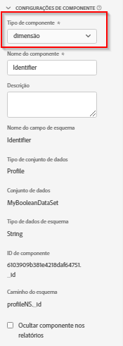

# Configurações de componente

Configurações principais que um componente de visualização de dados usa.

| Configuração | Descrição/Caso de uso |
| --- | --- |
| [!UICONTROL Tipo de componente] | Obrigatório. Permite alterar um componente de Métrica para Dimension ou o oposto. Alterar essa seleção suspensa altera o componente para sua respectiva área de componentes incluída. |
| [!UICONTROL Nome do componente] | Obrigatório. Permite especificar o nome amigável que aparecerá no Analysis Workspace. É possível renomear um componente, dando a ele um nome específico para a visualização de dados. |
| [!UICONTROL Descrição] | Opcional, mas recomendado. Fornece informações sobre o componente para outros usuários. |
| [!UICONTROL Tags] | Opcional. Permite marcar o componente com tags personalizadas ou prontas para uso para facilitar a pesquisa/filtragem na interface do Analysis Workspace. |
| [!UICONTROL Rótulos de contexto] | Opcional. Uma lista suspensa de rótulos disponíveis definidos pelo sistema que podem ser aplicados a um componente. Esses rótulos podem ser necessários para definir um conjunto de componentes usados para relatórios em projetos ou painéis do Analysis Workspace. |
| [!UICONTROL Nome do campo de esquema] | O nome do campo de esquema. |
| [!UICONTROL Tipo de conjunto de dados] | Obrigatório. Um campo não editável que mostra de qual tipo de conjunto de dados (evento, pesquisa ou perfil) o componente veio. |
| [!UICONTROL Conjunto de dados] | Um campo não editável que mostra de qual conjunto de dados o componente se originou. Este campo pode conter vários conjuntos de dados. |
| [!UICONTROL Tipo de esquema] | Um campo não editável que mostra o tipo de dados do componente. Embora você possa usar qualquer tipo de campo de esquema compatível na Platform, nem todos os tipos de campos são compatíveis no Customer Journey Analytics. Os seguintes tipos de dados são compatíveis: `Integer`, `Int`, `Long`, `Double`, `Float`, `Number`, `Short`, `Byte`, `String` e `Boolean`. Somente o `String` O tipo de dados de esquema é permitido atualmente nos conjuntos de dados de Pesquisa. |
| [!UICONTROL ID de componente] | Obrigatório. A variável [API CUSTOMER JOURNEY ANALYTICS](https://adobe.io/cja-apis/docs) O usa esse campo para fazer referência ao componente. Cada componente em uma visualização de dados deve ser exclusivo. A Adobe gera automaticamente uma ID para cada componente; no entanto, você pode clicar no ícone editar e modificar a ID do componente. Alterar a ID do componente interrompe todos os projetos existentes do Workspace que contêm esse componente. Embora cada componente precise de uma ID exclusiva em uma única visualização de dados, é possível usar a mesma ID do componente em outras visualizações de dados. Se você usar a mesma ID do componente em outras visualizações de dados, será possível tornar os projetos do Workspace compatíveis entre as visualizações de dados.  Para componentes baseados em perfil e pesquisa, a ID do componente tem um prefixo de ID com base na ID do conjunto de dados (por exemplo: `642b28fcc1f0ee1c074265a0.person.name.firstName`). Quando quiser reutilizar um perfil ou componente baseado em pesquisa, como `person.name.firstName`, no projeto do Workspace, e configurar esse componente em diferentes visualizações de dados, renomeie a ID do componente de forma exclusiva (por exemplo: `myUniqueID.person.name.firstName`) em suas visualizações de dados. |
| [!UICONTROL Caminho] | Obrigatório. Um campo não editável que mostra o caminho do esquema de onde o componente veio. |
| [!UICONTROL Rótulos de uso de dados] | Quaisquer rótulos de uso de dados atribuídos a este componente na Adobe Experience Platform. [Saiba mais](/help/data-views/data-governance.md). |
| [!UICONTROL Ocultar componente nos relatórios] | Permite a preparação do componente fora da visualização de dados para não administradores. Os administradores ainda podem acessá-lo clicando em [!UICONTROL Mostrar todos os componentes] em um projeto do Analysis Workspace. |

{style="table-layout:auto"}

Este é um vídeo sobre configurações de componentes em visualizações de dados:

>[!VIDEO](https://video.tv.adobe.com/v/333112/?quality=12)
