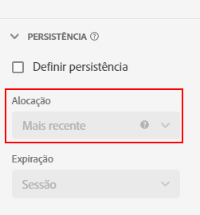

# Configurações de componente de [!UICONTROL Persistência] {#persistence-component-settings}

<!-- markdownlint-disable MD034 -->

>[!CONTEXTUALHELP]
>id="cja_dataview_component_dimension_persistence"
>title="Persistência"
>abstract="Configure o modelo de alocação padrão aplicado a uma dimensão. A alocação é aplicada antes dos filtros nos relatórios."

<!-- markdownlint-enable MD034 -->

[!UICONTROL Persistência] é a capacidade de um determinado valor de dimensão se relacionar a uma métrica além do evento em que está definido. Ela usa uma combinação de alocação e expiração.

* A **Alocação** permite determinar qual valor é mantido quando mais de um item de dimensão pode persistir de cada vez em uma única coluna.

  >[!NOTE]
  >
  >Se você tiver um [modelo de atribuição não padrão](/help/data-views/component-settings/attribution.md) definido em uma métrica em um relatório, o modelo de atribuição ignorará a alocação definida na dimensão para o mesmo relatório.
  >
  >No entanto, ao fazer uma [exportação de tabela completa](/help/analysis-workspace/export/export-cloud.md) que inclui várias dimensões, a atribuição retém os modelos de alocação aplicados a cada dimensão.

* A **Expiração** permite determinar por quanto tempo um item de dimensão persiste além do evento em que está definido.

A [!UICONTROL Persistência] está disponível somente em dimensões e é retroativa aos dados aos quais é aplicada. É uma transformação imediata de dados que ocorre antes da aplicação da filtragem ou de outras operações de análise.

| Configuração | Descrição |
| --- | --- |
| [!UICONTROL Definir persistência] | Habilite a persistência para a dimensão. Se a persistência não estiver habilitada, a dimensão se relacionará somente às métricas que existem no mesmo evento. Essa configuração é desativada pelo padrão. |
| [!UICONTROL Alocação] | Permite especificar o modelo de alocação usado em uma dimensão para persistência. As opções são: [!UICONTROL Mais recente], [!UICONTROL Original], [!UICONTROL Instância], [!UICONTROL Tudo]. A partir de 28 de outubro de 2021, uma janela de lookback de até 90 dias será adicionada à configuração de [!UICONTROL Alocação]. |
| [!UICONTROL Expiração] | Permite especificar a janela de persistência para uma dimensão. As opções são: [!UICONTROL Sessão] (padrão), [!UICONTROL Pessoa], [!UICONTROL Tempo personalizado] e [!UICONTROL Métrica]. Talvez seja necessário poder expirar a dimensão em uma compra (como termos de pesquisa interna ou outros casos de uso de merchandising). O tempo máximo de expiração que pode ser definido é de 90 dias. Se você selecionar uma alocação de [!UICONTROL Todos], somente a expiração de [!UICONTROL Sessão] ou [!UICONTROL Pessoa] estará disponível. |

{style="table-layout:auto"}

## Configurações de [!UICONTROL Alocação]

Detalhes sobre as configurações de alocação disponíveis.

* **[!UICONTROL Mais recente]**: persiste o valor mais recente (por carimbo de data e hora) presente na dimensão. Qualquer valor subsequente que ocorrer dentro do período de expiração da dimensão substitui o valor persistente anterior. Se “Tratar &#39;Valor nulo&#39; como um valor” estiver ativado nas [Opções de valor nulo](no-value-options.md) desta dimensão, os valores vazios substituirão os valores persistentes anteriores. Por exemplo, considere a seguinte tabela com a alocação [!UICONTROL Mais recente] e a expiração de [!UICONTROL Sessão]:

  | Dimensão | Ocorrência 1 | Ocorrência 2 | Ocorrência 3 | Ocorrência 4 | Ocorrência 5 |
  | --- | --- | --- | --- | --- | --- |
  | Valores do conjunto de dados |  | C | B |  | A |
  | Alocação mais recente |  | C | B | B | A |

* **[!UICONTROL Original]**: persiste o valor original por carimbo de data e hora presente na dimensão durante o período de expiração. Se essa dimensão tiver um valor, ele não será substituído quando um valor diferente for visualizado em um evento subsequente. Por exemplo, considere a seguinte tabela com a alocação [!UICONTROL Original] e expiração de [!UICONTROL Sessão]:

  | Dimensão | Ocorrência 1 | Ocorrência 2 | Ocorrência 3 | Ocorrência 4 | Ocorrência 5 |
  | --- | --- | --- | --- | --- | --- |
  | Valores do conjunto de dados |  | C | B |  | A |
  | Alocação original |  | C | C | C | C |

* **[!UICONTROL Todos]**: age de forma semelhante ao modelo de atribuição de [!UICONTROL Participação] para métricas. Persiste todos os valores igualmente para que cada um obtenha crédito total pela métrica no relatório. Por exemplo, considere a seguinte tabela com a alocação [!UICONTROL Todos] e a expiração de [!UICONTROL Sessão]:

  | Dimensão | Ocorrência 1 | Ocorrência 2 | Ocorrência 3 | Ocorrência 4 | Ocorrência 5 |
  | --- | --- | --- | --- | --- | --- |
  | Valores do conjunto de dados | A | B | C |  | A |
  | Toda alocação | A | A,B | A,B,C | A,B,C | A,B,C |

* **[!UICONTROL Primeiro conhecimento]** e **[!UICONTROL Último conhecimento]**: (19 de janeiro de 2022 ) Esses dois modelos de alocação atendem a casos de uso de dimensão de “entrada” e “saída”. Eles selecionam o primeiro ou o último valor observado de uma dimensão dentro de um escopo de persistência especificado (sessão, pessoa ou período de tempo personalizado com retrospectiva) e o aplicam a todos os eventos dentro do escopo especificado. Exemplo:

  | Dimensão | Ocorrência 1 | Ocorrência 2 | Ocorrência 3 | Ocorrência 4 | Ocorrência 5 |
  | --- | --- | --- | --- | --- | --- |
  | Carimbo de data e hora (min) | 1 | 2 | 3 | 6 | 7 |
  | Valores originais |  | C | B |  | A |
  | Primeiro conhecimento | C | C | C | C | C |
  | Último conhecimento | A | A | A | A | A |

## Configurações de [!UICONTROL Expiração]

Detalhes sobre as configurações de expiração disponíveis.

* **Sessão**: expira após uma determinada sessão. Janela de expiração padrão.
* **Pessoa**: expira ao final da janela de relatório.
* **Hora personalizada**: expira após um período específico (até 90 dias). Essa opção de expiração só está disponível para modelos de alocação Original e Mais recente. Ao usar a expiração com base em tempo, os valores anteriores ao início da janela de relatórios (até 90 dias) são considerados.
* **Métrica**: quando essa métrica é vista em um evento, expire imediatamente o valor persistente na dimensão. Você pode usar qualquer métrica como o fim da expiração dessa dimensão. Essa opção de expiração só está disponível para as configurações de alocação Original e Mais recente.

## [!UICONTROL Dimensão de ligação]

Uma lista suspensa que permite vincular a persistência de um valor de dimensão a valores de outra dimensão. As opções válidas incluem outras dimensões incluídas na visualização de dados.

Consulte [Uso de dimensões e métricas de ligação no Customer Journey Analytics](../../use-cases/data-views/binding-dimensions-metrics.md) para obter exemplos sobre como usar efetivamente dimensões de ligação.

>[!VIDEO](https://video.tv.adobe.com/v/342694/?quality=12)

## [!UICONTROL Métrica de ligação]

Uma lista suspensa que permite escolher uma métrica que atue como um acionador de ligação. As opções válidas incluem métricas incluídas na visualização de dados.

Essa configuração só aparece quando a Dimensão de ligação está mais abaixo no array de objetos do que no componente. Quando a métrica de ligação está presente em um evento, os valores de dimensão são copiados da dimensão de nível de evento para o nível de esquema inferior da dimensão de ligação.

Veja o segundo exemplo em [Uso de dimensões e métricas de ligação no Customer Journey Analytics](../../use-cases/data-views/binding-dimensions-metrics.md) para obter mais informações sobre como usar métricas de ligação de maneira eficaz.
