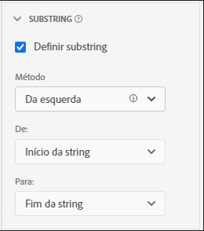

# Configurações do componente de substring {#substring-component-settings}

<!-- markdownlint-disable MD034 -->

>[!CONTEXTUALHELP]
>id="dataview_component_dimension_substring"
>title="Substring"
>abstract="Extraia partes de uma string com base em regras ou expressões regulares."

<!-- markdownlint-enable MD034 -->

As configurações do componente [!UICONTROL Substring] permitem executar métodos de manipulação de sequência de caracteres para obter os itens de dimensão desejados nos relatórios.

[!UICONTROL Substring] está disponível somente em dimensões e é retroativa aos dados aos quais é aplicada. É uma transformação imediata de dados que ocorre antes da aplicação da segmentação ou de outras operações de análise.

## Da esquerda/direita

Pegue uma parte de uma string com base em sua posição no início ou no fim de uma string. Os métodos **[!UICONTROL Da esquerda]** e **[!UICONTROL Da direita]** oferecem duas listas suspensas: **[!UICONTROL De]** (onde a saída começa) e **[!UICONTROL Para]** (onde a saída termina).

* **[!UICONTROL Início da string]**: o início da string.
* **[!UICONTROL Fim da string]**: o fim da string.
* **[!UICONTROL Posição]**: um número estático de caracteres da esquerda ou direita, dependendo do método.
* **[!UICONTROL String]**: corresponder a um caractere ou sequência de caracteres para indicar o início ou o fim de uma string. Esta lista suspensa também revela opções adicionais:
   * **[!UICONTROL Corresponder]**: a string que será correspondida. Se a entrada não tiver correspondência com esse campo, [Nenhuma opção de valor](no-value-options.md) será aplicada.
   * **[!UICONTROL Índice]**: o critério **[!UICONTROL Corresponder]** pode ser apresentado várias vezes em uma string. Esse número inteiro determina qual correspondência deve iniciar ou finalizar a saída, dependendo do método. Por exemplo, um índice de `1` representa a primeira correspondência. Se o índice for superior ao número de correspondências disponíveis, [Nenhuma opção de valor](no-value-options.md) será aplicada.
   * **[!UICONTROL Incluir string]**: uma caixa de seleção que inclui a string **[!UICONTROL Corresponder]** na saída, se ativada.
* **[!UICONTROL Comprimento]**: um número inteiro que especifica a contagem de caracteres a ser incluída após a posição inicial da saída. Disponível somente na lista suspensa **[!UICONTROL Para]**.

## Delimitador

Use esse método para campos que usam um delimitador para separar vários valores de string. Você pode extrair um elemento individual para usar como saída ou converter a string em um elemento de esquema da matriz de objetos.

* **[!UICONTROL Critério]**: como você deseja tratar a lista delimitada de valores.
   * **[!UICONTROL Da Esquerda]**: comece a partir do início da lista delimitada e conte para a frente.
   * **[!UICONTROL Da direita]**: comece no final da lista delimitada e conte para trás.
   * **[!UICONTROL Converter em matriz]**: trate essa dimensão como se fosse um elemento de esquema da matriz de objetos.
* **[!UICONTROL Delimitador]**: o delimitador usado pelo campo.
* **[!UICONTROL Índice]**: presente somente se o critério for Da esquerda/direita. O número do elemento como se ele estivesse em uma matriz. Por exemplo, se a entrada da string for `"Fox,Turtle,Rabbit,Wolf"` com um índice de 3, a saída é `"Rabbit"`. Se o índice for maior que o número de elementos delimitados, [Nenhuma opção de valor](no-value-options.md) será aplicada.

## Análise de URL

Para uso com campos que contêm URLs. Usando o URL de exemplo `https://example.com/store/index.html?cid=campaign#cart`, as seguintes opções estão disponíveis:

* **[!UICONTROL Obter protocolo]**: obtenha o protocolo do URL. Por exemplo, `"https://"`.
* **[!UICONTROL Obter host]**: obtenha o host do URL. Por exemplo, `"example.com"`.
* **[!UICONTROL Obter caminho]**: obtenha o caminho do URL. Por exemplo, `"store/index.html"`.
* **[!UICONTROL Obter valor da string de consulta]**: obtenha o valor de uma única string de consulta. Coloque o parâmetro da string de consulta desejado o campo **[!UICONTROL Chave de consulta]**. Se o URL acima for usado com a chave de consulta `"cid"`, a saída será `"campaign"`.
* **[!UICONTROL Obter valor de hash]**: obtenha o valor de hash do URL. Por exemplo, `"cart"`.

Se a entrada não for um URL válido ou se o componente de URL desejado não estiver presente, [Nenhuma opção de valor](no-value-options.md) será aplicada.

## Cortar

Cortar espaço em branco ou caracteres especiais da string.

* **[!UICONTROL Aparar espaços em branco]**: uma caixa de seleção que remove todos os espaços em branco no início e no fim da cadeia de caracteres, se ativada.
* **[!UICONTROL Aparar caracteres especiais]**: uma caixa de seleção que revela um campo de entrada **[!UICONTROL Caracteres especiais]**, se ativado. Todos os caracteres neste campo são removidos da saída. Caracteres multibyte não são aceitos.

## Regex

Aplique expressões regulares a uma dimensão para recuperar o valor desejado.

* **[!UICONTROL Regex]**: a fórmula da expressão regular.
* **[!UICONTROL Formato de saída]**: um campo opcional que permite adicionar texto ou reordenar a saída do subgrupo regex. Se esse campo estiver em branco, a saída da string será a expressão regex avaliada.
* **[!UICONTROL Diferenciação de maiúsculas e minúsculas]**: uma caixa de seleção que força a expressão regular a diferenciar maiúsculas de minúsculas, se estiver ativada.

O CJA usa um subconjunto da sintaxe de regex Perl. Se a entrada não corresponder à expressão regular e a variável **[!UICONTROL Formato de saída]** estiver em branco, [Nenhuma opção de valor](no-value-options.md) será aplicada. As seguintes expressões são suportadas:

| Expressão | Descrição |
| --- | --- |
| `a` | Um caractere único `a`. |
| `a\|b` | Um caractere único `a` ou `b`. |
| `[abc]` | Um caractere único `a`, `b` ou `c`. |
| `[^abc]` | Qualquer caractere único exceto `a`, `b` ou `c`. |
| `[a-z]` | Qualquer caractere único no intervalo de `a`-`z`. |
| `[a-zA-Z0-9]` | Qualquer caractere único no intervalo de `a`-`z`, `A`-`Z` ou dígitos `0`-`9`. |
| `^` | Corresponde ao início da linha. |
| `$` | Corresponde ao final da linha. |
| `\A` | Início da sequência. |
| `\z` | Final da sequência. |
| `.` | Corresponde a qualquer caractere. |
| `\s` | Qualquer caractere invisível. |
| `\S` | Sem caracteres diferentes de invisíveis. |
| `\d` | Qualquer dígito. |
| `\D` | Qualquer não dígito. |
| `\w` | Qualquer letra, número ou sublinhado. |
| `\W` | Qualquer caractere que não seja da palavra. |
| `\b` | Qualquer limite da palavra. |
| `\B` | Qualquer caractere que não seja um limite de palavra. |
| `\<` | Início da palavra. |
| `\>` | Fim da palavra. |
| `(...)` | Capturar tudo delimitado. |
| `(?:...)` | Captura sem marcação. Impede que a correspondência seja referenciada na string de saída. |
| `a?` | Zero ou um de `a`. |
| `a*` | Zero ou mais de `a`. |
| `a+` | Um ou mais de `a`. |
| `a{3}` | Exatamente 3 de `a`. |
| `a{3,}` | 3 ou mais de `a`. |
| `a{3,6}` | Entre 3 e 6 de `a`. |

Espaços reservados de saída também são permitidos. É possível usar essas sequências no **[!UICONTROL Formato de saída]** qualquer número de vezes e em qualquer ordem para alcançar a saída da string desejada.

| Sequência de espaço reservado de saída | Descrição |
| --- | --- |
| `$&` | Gera o que correspondeu à expressão inteira. |
| `$n` | Gera o que correspondeu à subexpressão nth. Por exemplo, o `$1` gera a primeira subexpressão. |
| ``$` `` | Gera o texto entre o fim da última correspondência encontrada (ou o início do texto, se nenhuma correspondência anterior tiver sido encontrada) e o início da correspondência atual. |
| `$+` | Gera o que correspondeu à última subexpressão marcada na expressão regular. |
| `$$` | Gera o caractere de string `"$"`. |

{style="table-layout:auto"}
