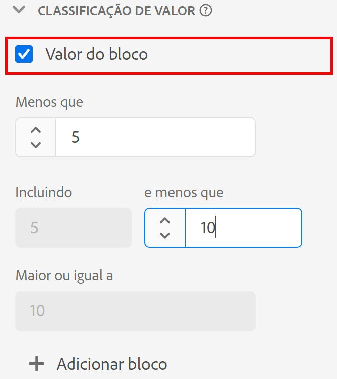

# Configurações do componente de [!UICONTROL Segmentação de valores]

Ao criar ou editar uma visualização de dados, a segmentação de valores permite combinar valores numéricos com base em um intervalo. Essa função está disponível apenas para dimensões que utilizam dados de esquema do tipo Integer ou Double.

A segmentação de valores é importante quando você deseja agrupar intervalos, em vez de tratar cada número único como um item de dimensão separado. Por exemplo, um segmento “Entre 5 e 10” será exibido como um item de linha “5 a 10” no Analysis Workspace.

Se você quiser a flexibilidade de criar relatórios tanto em dimensões segmentadas como não segmentadas, arraste duas cópias do componente para a lista de dimensões disponíveis. Ative a segmentação em uma dimensão e desative-a na outra.

| Configuração | Descrição |
| --- | --- |
| [!UICONTROL Valor do bloco] | Uma caixa de seleção que permite ativar a segmentação. |
| [!UICONTROL Menos que] | O limite superior do segmento da primeira dimensão. |
| [!UICONTROL Incluindo] [!UICONTROL e menor que] | Limites de segmentos subsequentes. |
| [!UICONTROL Maior que ou igual a] | O limite inferior do segmento da última dimensão. |
| [!UICONTROL Adicionar bloco] | Permite adicionar outro intervalo à classificação de dimensão numérica. Você pode adicionar até 20 segmentos em uma única dimensão. |

{style="table-layout:auto"}
