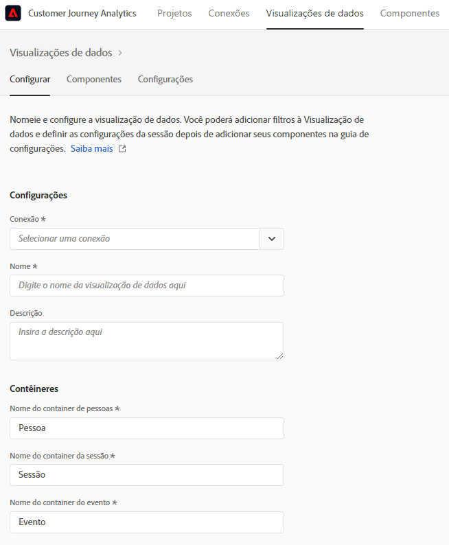
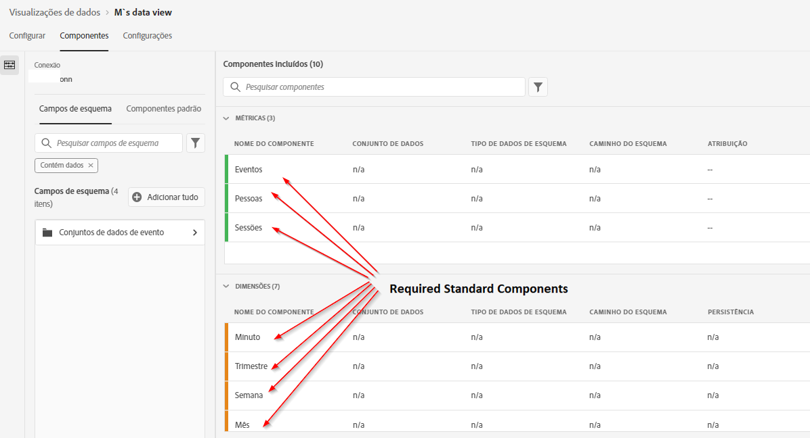
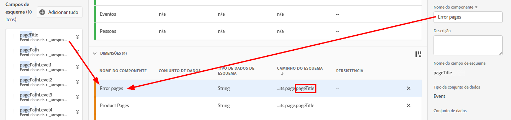
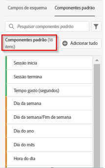
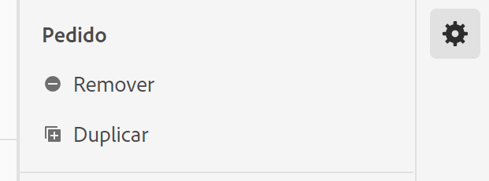
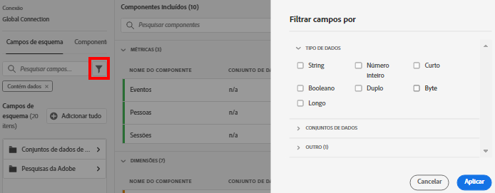
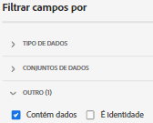

# Criar uma nova visualização de dados

A criação de uma visualização de dados envolve a criação de métricas e dimensões com base em elementos de esquema ou a utilização de componentes padrão. A criação de métricas ou dimensões oferece enorme flexibilidade. Anteriormente, a premissa era que, se você tivesse conjuntos de dados na Adobe Experience Platform, os campos de sequência seriam usados como dimensões e os campos numéricos seriam usados como métricas. Para alterar qualquer um desses campos, você tinha que editar seu esquema na Platform. A interface de visualizações de dados agora permite [mais definição de forma livre de métricas e dimensões](/help/data-views/data-views.md). Para obter mais casos de uso, consulte [Casos de uso de visualizações de dados](/help/data-views/data-views-usecases.md).

## 1. Definir configurações e containers de visualizações de dados

1. No Customer Journey Analytics, acesse a guia **[!UICONTROL Visualizações de dados]**.
2. Clique em **[!UICONTROL Adicionar]** para criar uma nova visualização de dados e definir suas configurações.

| Configuração | Descrição/Caso de uso |
| --- | --- |
| [!UICONTROL Conexão] | Esse campo vincula a visualização de dados à conexão estabelecida anteriormente, que contém um ou mais conjuntos de dados da Adobe Experience Platform. |
| [!UICONTROL Nome] | É obrigatório dar um nome à visualização de dados. |
| [!UICONTROL Descrição] | Uma descrição detalhada não é obrigatória, mas é recomendada. |
| [!UICONTROL Fuso horário] | Escolha em qual fuso horário você deseja que seus dados sejam apresentados. |
| [!UICONTROL Tags] | [!UICONTROL As tags permitem organizar as visualizações de dados em categorias.] |
| [!UICONTROL Contêineres] | Você pode renomear seus contêineres aqui para determinar como eles aparecem em qualquer projeto do Workspace baseado nessa visualização de dados.  Os contêineres são usados em filtros e fallout/fluxo e assim por diante, para definir a amplitude ou o estreitamento do escopo ou do contexto. [Saiba mais](https://experienceleague.adobe.com/docs/analytics-platform/using/cja-components/cja-filters/filters-overview.html?lang=pt-BR#filter-containers) |
| [!UICONTROL O nome do container de pessoa é...] | [!UICONTROL Pessoa] (padrão). O container [!UICONTROL Pessoa] inclui cada visita e exibição de página de visitante em um intervalo de tempo especificado. Você pode renomear esse contêiner como &quot;Usuário&quot; ou qualquer outro termo que desejar. |
| [!UICONTROL O nome do container da sessão é...] | [!UICONTROL Sessão] (padrão). O container [!UICONTROL Sessão] permite identificar as interações de página, campanhas ou conversões de uma sessão específica. Você pode renomear esse contêiner como &quot;Visita&quot; ou qualquer outro termo que desejar. |
| [!UICONTROL O nome do container de evento é...] | [!UICONTROL Evento] (padrão). O container [!UICONTROL Evento] define quais eventos de página você deseja incluir ou excluir de um filtro. |

Em seguida, você pode criar métricas e dimensões com base em elementos do esquema. Você também pode usar os componentes padrão.

## 2. Criar métricas e dimensões com base em elementos de esquema

1. Em [!UICONTROL Customer Journey Analytics] > [!UICONTROL Visualizações de dados], clique na guia [!UICONTROL Componentes].

Você pode ver a [!UICONTROL Conexão] no canto superior esquerdo, que contém os conjuntos de dados, e seus [!UICONTROL Campos de esquema] abaixo. Lembre-se:

* Os componentes já incluídos são os componentes obrigatórios padrão (gerados pelo sistema).
* O Adobe aplica o filtro **[!UICONTROL Contém dados]** por padrão, para que sejam exibidos apenas os campos Esquema que contêm dados. Se estiver procurando um campo que não contenha dados, remova o filtro .

1. Agora arraste um campo de esquema, como [!UICONTROL pageTitle], do painel esquerdo para a seção Métricas ou Dimensão.

   Você pode arrastar o mesmo campo de esquema nas seções de dimensões ou métricas várias vezes e configurar a mesma dimensão ou métrica de maneiras diferentes.
Por exemplo, no campo **[!UICONTROL pageTitle]**, é possível criar uma dimensão chamada &quot;Páginas de produto&quot; e outra chamada &quot;Páginas de erro&quot; etc. renomeando o **[!UICONTROL Nome do componente]** à direita. No campo **[!UICONTROL pageTitle]**, você também pode criar métricas com base em um valor de sequência. Por exemplo, você pode criar uma ou mais métricas **[!UICONTROL Pedidos]** com diferentes configurações de atribuição e diferentes valores de inclusão/exclusão.

   

   >[!NOTE]
   >
   >Você pode arrastar todas as pastas de campo de esquema do painel esquerdo e elas serão classificadas automaticamente em seções tradicionais. Os campos de sequência terminarão na seção [!UICONTROL Dimensões] e nos números na seção [!UICONTROL Métricas]. Ou clique em **[!UICONTROL Adicionar tudo]** e todos os campos de esquema serão adicionados.

1. Depois de selecionar o componente, você verá várias configurações à direita. Configure o componente usando as configurações descritas abaixo.

### Definir configurações do componente

| Configuração | Descrição/Caso de uso |
| --- | --- |
| [!UICONTROL Tipo de componente] | Obrigatório. Permite alterar um componente de Métrica para Dimensão ou vice-versa. |
| [!UICONTROL Nome do componente] | Obrigatório. Permite especificar o nome amigável que será mostrado no Analysis Workspace. É possível renomear um componente para atribuir a ele um nome específico da visualização de dados. |
| [!UICONTROL Descrição] | Opcional, mas recomendado, para fornecer informações sobre o componente para outros usuários. |
| [!UICONTROL Tags] | Opcional. Permite marcar o componente com tags personalizadas ou prontas para uso para facilitar a pesquisa/filtragem na interface do Analysis Workspace. |
| [!UICONTROL Nome do campo] | O nome do campo de esquema. |
| [!UICONTROL Tipo de conjunto de dados] | Obrigatório. Um campo não editável que mostra de qual tipo de conjunto de dados (evento, pesquisa ou perfil) o componente veio. |
| [!UICONTROL Conjunto de dados] | Obrigatório. Um campo não editável que mostra de qual tipo de campo o componente veio (por exemplo, sequência, inteiro etc.). Este campo pode conter vários conjuntos de dados. |
| [!UICONTROL Tipo de dados de esquema] | Refere-se a se o componente é uma string, um inteiro e assim por diante.  Embora você possa usar qualquer tipo de campo de esquema compatível na Plataforma, nem todos os tipos de campos são compatíveis no CJA. Os seguintes tipos de dados são suportados: `Integer`, `Int`, `Long`, `Double`, `Float`, `Number`, `Short`, `Byte`, `String` e `Boolean`. Observe que somente as sequências de caracteres são permitidas em conjuntos de dados de Pesquisa no momento. |
| [!UICONTROL ID de componente] | Obrigatório. A [API CJA](https://adobe.io/cja-apis/docs) usa esse campo para fazer referência ao componente. Você pode clicar no ícone editar e modificar essa ID de componente. No entanto, alterar essa ID de componente interrompe todos os projetos existentes do Workspace que contêm esse componente. Se você criar outra visualização de dados que use um campo diferente para uma dimensão pageTitle, será possível renomeá-la e tornar a visualização compatível com dados cruzados. |
| [!UICONTROL Caminho do esquema] | Obrigatório. Um campo não editável que mostra o caminho do esquema de onde o componente veio. |
| [!UICONTROL Ocultar componente nos relatórios] | Padrão = desativado. Permite coletar o componente da Visualização de dados quando usado em relatórios. Isso não afeta as permissões, apenas a coleta de componentes. Em outras palavras, você pode ocultar o componente de usuários não administradores nos relatórios. Os administradores ainda podem acessá-lo clicando em [!UICONTROL Mostrar todos os componentes] em um projeto do Analysis Workspace. |

### Definir configurações de formato

As configurações de formato são somente para métricas.

| Configuração | Descrição/Caso de uso |
| --- | --- |
| [!UICONTROL Formato] | Permite especificar a formatação de uma métrica, como Decimal, Hora, Porcentagem ou Moeda. |
| [!UICONTROL Casas decimais] | Permite especificar o número de casas decimais que uma métrica deve exibir. |
| [!UICONTROL Exibir tendência ascendente como] | Permite especificar se uma tendência de alta nessa métrica deve ser considerada boa (verde) ou ruim (vermelho). |
| [!UICONTROL Moeda] | Essa configuração será mostrada somente se o formato de métrica selecionado for [!UICONTROL Moeda]. Uma lista de opções de moeda está disponível. O padrão é nenhuma moeda. Dessa forma, você pode representar a receita na moeda de sua escolha no relatório. Não é uma conversão de moeda, apenas uma opção de formatação da interface. |

### Definir configurações de Atribuição

| Configuração | Descrição/Caso de uso |
| --- | --- |
| [!UICONTROL Definir atribuição] | Permite especificar as configurações de atribuição que você deseja aplicar a essa métrica por padrão quando ela for usada. Esse padrão pode ser substituído em uma [!UICONTROL Tabela de forma livre] ou em uma Métrica calculada. |
| [!UICONTROL Modelo de atribuição] | Permite especificar um modelo de atribuição padrão, ativo somente ao acionar a configuração [!UICONTROL Usar modelo de atribuição não padrão]. O padrão é [!UICONTROL Último contato]. As opções são: Último contato, Primeiro contato, Linear, Participação, Mesmo contato, Forma de U, Curva de J, J inverso, Declínio de tempo, Personalizado, Algorítmico. Algumas dessas opções criam campos adicionais que precisam ser preenchidos - como Personalizado ou Declínio de tempo. É possível criar várias métricas usando o mesmo campo. Isso significa que você pode ter uma métrica de receita de [!UICONTROL Último contato] e uma métrica de receita de [!UICONTROL Primeiro contato], mas com base no mesmo campo de receita no esquema. |
| [!UICONTROL Janela de lookback] | Permite especificar uma janela de lookback padrão para uma métrica, ativa somente ao acionar a configuração [!UICONTROL Usar modelo de atribuição não padrão]. As opções são: [!UICONTROL Pessoa] (Janela de relatórios), [!UICONTROL Sessão], [!UICONTROL Personalizada]. Quando [!UICONTROL Personalizado] é selecionado, também oferecemos a opção de selecionar qualquer número de dias/semanas/meses/etc. (até 90 dias), exatamente como [!UICONTROL Attribution IQ]. Você pode ter várias métricas usando o mesmo campo de esquema, mas cada uma com uma janela de pesquisa separada. |

### Definir as configurações de valores de inclusão/exclusão

Essa configuração permite modificar os dados subjacentes que você está relatando, no momento da consulta. Não é o mesmo que um filtro. Mas os filtros respeitarão essa nova dimensão, assim como a definição de caminho e a atribuição.

Por exemplo, você pode criar uma dimensão fora do campo pageTitle, mas chamá-la de &quot;páginas de erro&quot; e incluir qualquer página que [!UICONTROL contenha a frase] &quot;erro&quot;.

| Configuração | Descrição/Caso de uso |
| --- | --- |
| [!UICONTROL Diferencia maiúsculas de minúsculas] | Padrão = Ativado. Essa configuração se aplica somente à seção [!UICONTROL Incluir/Excluir valores]. Isso permite dizer se a regra de inclusão/exclusão que você está aplicando deve diferenciar maiúsculas de minúsculas. |
| [!UICONTROL Corresponder] | Permite especificar quais valores você gostaria de considerar para os relatórios antes da atribuição e filtros (por exemplo, usar apenas valores contendo a frase &quot;erro&quot;). Você pode especificar: **[!UICONTROL Se todos os critérios forem atendidos]** ou **[!UICONTROL Se algum critério for atendido]**. |
| [!UICONTROL Critérios] | Permite especificar a lógica de correspondência que deve ser aplicada a uma regra de filtro específica.<ul><li>**Sequência**: Contém a frase, Contém qualquer termo, Contém todos os termos, Não contém nenhum termo, Não contém a frase, É igual, Não é igual, Começa com, Termina com</li><li>**Duplo/Número inteiro**: é igual, não é igual, é maior que, é menor que, é maior que ou igual a, é menor que ou igual a</li><li>**Data**: é igual a, não é igual, é posterior a, é anterior, ocorre dentro de</li></ul> |
| [!UICONTROL Corresponder operando] | Permite especificar o operando correspondente ao qual o operador deve ser aplicado.<ul><li>**Sequência**: Campo de texto</li><li>**Duplo/Número inteiro**: Campo de texto com setas para cima/para baixo para valores numéricos</li><li>**Data**: Seletor de granularidade do dia (calendário)</li><li>**Data Hora**: Seletor de granularidade de data e hora</li></ul> |
| [!UICONTROL Adicionar regra] | Permite especificar um operador e um operando de correspondência adicional. |

### Definir configurações de comportamento

Permite especificar como uma métrica deve se comportar nos relatórios.

| Configuração | Descrição/Caso de uso |
| --- | --- |
| [!UICONTROL Contar valores] | Somente para métricas booleanas, essa configuração permite especificar se você deseja [!UICONTROL Contar Verdadeiro], [!UICONTROL Contar Falso] ou [!UICONTROL Contar Verdadeiro ou Falso] como o valor da métrica. O padrão é [!UICONTROL Count True]. Isso fornece o valor real de uma métrica, como &quot;50&quot;, se houver um valor de pedido de 50. |
| [!UICONTROL Contar instâncias] | Permite especificar se um campo numérico ou de tipo de data usado como uma métrica deve contar os horários em que foi definido, em vez do valor propriamente dito.  Se desejar adicionar as instâncias de um campo numérico e quiser simplesmente adicionar o número de vezes que um campo foi *definido* como diferente do valor real nele contido. Isso é útil para criar uma métrica [!UICONTROL Pedidos] de um campo [!UICONTROL Receita], por exemplo. Se a receita foi definida, devemos contar um pedido único em vez do valor numérico da receita. |

### Definir configurações [!UICONTROL Nenhuma opção de valor]

[!UICONTROL  As configurações Sem opções de valor] são análogas aos valores [!UICONTROL Não especificado] ou [!UICONTROL Nenhum] no relatório. Na interface das visualizações de dados, componente por componente, é possível decidir como você deseja que esses valores sejam tratados nos relatórios. Você também pode renomear [!UICONTROL Nenhum valor] para algo que se ajuste melhor ao seu ambiente, como [!UICONTROL Nulo], [!UICONTROL Não definido] ou outros.

Observe também que qualquer item especificado neste campo pode ser usado para o tratamento especial da interface do item de linha [!UICONTROL Nenhum valor] no relatório, conforme declarado na configuração [!UICONTROL Sem opções de valor].

| Configuração | Descrição/Caso de uso |
| --- | --- |
| [!UICONTROL Se exibido, chame Nenhum valor...] | É aqui que você pode renomear **[!UICONTROL Nenhum valor]** para algo diferente. |
| [!UICONTROL Não mostrar Nenhum valor por padrão] | Não mostra esse valor nos relatórios. |
| [!UICONTROL Mostrar Nenhum valor por padrão] | Mostra esse valor nos relatórios. |
| [!UICONTROL Tratar Nenhum valor como um valor] | Essa configuração substituirá valores em branco nos dados pelo texto especificado em [!UICONTROL Se mostrado, chame No value...]. Por exemplo, se você tiver tipos de dispositivo móvel como a dimensão, poderá renomear o item **[!UICONTROL Nenhum valor]** para &quot;Desktop&quot;. Observe que, quando você alterar esse campo para um valor personalizado, ele será tratado como um valor de sequência de caracteres legítimo. Portanto, se você inserir o valor &quot;Vermelho&quot; nesse campo, qualquer instância da sequência &quot;Vermelho&quot; que for mostrada nos próprios dados também será inserida sob o mesmo item da linha especificado. |

### Definir configurações de persistência

Para obter mais informações, consulte o tópico sobre [Persistência](/help/data-views/persistence.md).

| Configuração | Descrição/Caso de uso |
| --- | --- |
| [!UICONTROL Definir persistência] | Alternar tecla |
| [!UICONTROL Alocação] | Permite especificar o modelo de alocação usado em uma dimensão para persistência. As opções são: [!UICONTROL Mais recente], [!UICONTROL Original], [!UICONTROL Instância], [!UICONTROL Tudo]. Se você quiser que um valor persista (semelhante às eVars no Analytics tradicional), é aqui que ele deverá ser definido. A única diferença principal é que a persistência máxima que você pode definir é 90 dias. Além disso, [!UICONTROL Nunca expirar] não é uma opção. |
| [!UICONTROL Expiração] | Permite especificar a janela de persistência para uma dimensão. As opções são: [!UICONTROL Sessão] (padrão), [!UICONTROL Pessoa], [!UICONTROL Tempo], [!UICONTROL Métrica]. Talvez seja necessário poder expirar a dimensão em uma compra (como termos de pesquisa interna ou outros casos de uso de merchandising). [!UICONTROL Métrica] permite especificar qualquer uma das métricas definidas como a expiração dessa dimensão (por exemplo, uma métrica de [!UICONTROL Compra]). **Observação**: Não é possível definir uma expiração personalizada para uma dimensão ao selecionar uma alocação de  [!UICONTROL Todos]. |

### Definir configurações de intervalo de valor

Por exemplo, um intervalo &quot;entre 5 e 10&quot; será exibido como um item da linha &quot;5 a 10&quot; nos relatórios do Workspace.

| Configuração | Descrição/Caso de uso |
| --- | --- |
| [!UICONTROL Valor do bloco] | Permite criar uma versão classificada de uma dimensão numérica. Permite relatar intervalos de receita ou outros valores numéricos como uma dimensão nos relatórios. |
| [!UICONTROL Até] | Permite especificar os limites do primeiro intervalo de dimensão numérica. Isso se aplica somente a dimensões numéricas. |
| [!UICONTROL Entre e até] | Permite especificar os limites de intervalos de dimensão numérica subsequentes. |
| [!UICONTROL Adicionar bloco] | Permite adicionar outro intervalo à classificação de dimensão numérica. |

### Usar [!UICONTROL Componentes padrão]

Além de criar métricas e dimensões de elementos do esquema, você também pode usar componentes padrão em suas visualizações de dados.

[!UICONTROL Componentes padrão] são componentes que não são gerados de campos de esquema do conjunto de dados, mas que são gerados pelo sistema. Alguns componentes do sistema são necessários em qualquer visualização de dados para facilitar os recursos de relatórios no Analysis Workspace, enquanto outros componentes do sistema são opcionais.

Esses componentes padrão obrigatórios são adicionados a cada visualização de dados por padrão.

| Nome do componente | Dimensão ou métrica | Notas |
| --- | --- | --- |
| [!UICONTROL Pessoas] | Métrica | Essa métrica se baseia na ID de pessoa especificada em uma [!UICONTROL Conexão]. |
| [!UICONTROL Sessões] | Métrica | Essa métrica se baseia nas configurações de sessão especificadas abaixo. |
| [!UICONTROL Eventos] | Métrica | Essa métrica representa o número de linhas de todos os conjuntos de dados de eventos em uma [!UICONTROL Conexão]. |
| [!UICONTROL Dia] | Dimensão | A dimensão “Dia” informa o dia em que determinada métrica ocorreu. O primeiro item de dimensão é o primeiro dia no intervalo de datas, e o último item de dimensão é o último dia no intervalo de datas. |
| [!UICONTROL Semana] | Dimensão | A dimensão “Semana” informa a semana em que determinada métrica ocorreu. O primeiro item de dimensão é a primeira semana no intervalo de datas, e o último item de dimensão é a última semana no intervalo de datas. |
| [!UICONTROL Mês] | Dimensão | A dimensão “Mês” informa o mês em que determinada métrica ocorreu. O primeiro item de dimensão é o primeiro mês no intervalo de datas, e o último item de dimensão é o último mês no intervalo de datas. |
| [!UICONTROL Trimestre] | Dimensão | A dimensão “Trimestre” informa o trimestre em que determinada métrica ocorreu. O primeiro item de dimensão é o primeiro trimestre no intervalo de datas, e o último item de dimensão é o último trimestre no intervalo de datas. |
| [!UICONTROL Ano] | Dimensão | A dimensão “Ano” relata o ano em que determinada métrica ocorreu. O primeiro item de dimensão é o primeiro ano no intervalo de datas, e o último item de dimensão é o ano mais recente no intervalo de datas. |
| [!UICONTROL Hora] | Dimensão | A dimensão “Hora” informa a hora em que determinada métrica ocorreu (arredondada para baixo). O primeiro item de dimensão é a primeira hora no intervalo de datas, e o último item de dimensão é a última hora no intervalo de datas. |
| [!UICONTROL Minuto] | Dimensão | A dimensão “Minuto” informa o minuto em que determinada métrica ocorreu (arredondado para baixo). O primeiro item de dimensão é o primeiro minuto no intervalo de datas, e o último item de dimensão é o último minuto no intervalo de datas. |

### Componentes padrão opcionais

Os componentes padrão opcionais estão disponíveis na guia **[!UICONTROL Componentes padrão]**.

| Nome do componente | Dimensão ou métrica | Notas |
| --- | --- | --- |
| [!UICONTROL Sessão inicia] | Métrica | Essa métrica conta o número de eventos que foram o primeiro evento de uma sessão. Quando usado em uma definição de filtro (por exemplo, &quot;[!UICONTROL Inícios de sessão] existe&quot;), ela filtra somente para o primeiro evento de cada sessão. |
| [!UICONTROL Sessão termina] | Métrica | Essa métrica conta o número de eventos que foram o último evento de uma sessão. Semelhante a [!UICONTROL Inícios de sessão], também pode ser usado em uma definição de filtro para filtrar os itens para o último evento de cada sessão. |
| [!UICONTROL Tempo gasto (segundos)] | Métrica | A métrica [!UICONTROL Tempo gasto] adiciona o tempo entre dois valores diferentes para uma dimensão. |
| [!UICONTROL Tempo gasto por evento] | Dimensão | [!UICONTROL Tempo gasto por evento] agrupa a métrica [!UICONTROL Tempo gasto] em compartimentos de [!UICONTROL Eventos]. |
| [!UICONTROL Tempo gasto por sessão] | Dimensão | [!UICONTROL Tempo gasto por sessão] agrupa a métrica [!UICONTROL Tempo] em compartimentos de [!UICONTROL Sessão]. |
| [!UICONTROL Tempo gasto por pessoa] | Dimensão | [!UICONTROL Tempo gasto por pessoa] agrupa a métrica [!UICONTROL Tempo gasto] em compartimentos de [!UICONTROL Pessoa]. |
| [!UICONTROL ID em lote] | Dimensão | Representa o lote da Experience Platform do qual um [!UICONTROL Evento] fez parte. |
| [!UICONTROL ID do conjunto de dados] | Dimensão | Representa o conjunto de dados Experience Platform do qual um [!UICONTROL Evento] fazia parte. |

## Use o recurso [!UICONTROL Duplicar]

Duplicar métricas ou dimensões e depois modificar configurações específicas é uma maneira fácil de criar várias métricas ou dimensões a partir de um único campo de esquema. Basta selecionar a configuração [!UICONTROL Duplicate] abaixo do nome da métrica ou das dimensões na parte superior direita. Em seguida, modifique a nova métrica ou dimensão e salve-a com um nome mais descritivo.

### Filtrar campos de esquema e dimensões/métricas

Você pode filtrar campos de esquema no painel esquerdo pelos seguintes tipos de dados:

Também é possível filtrar por conjuntos de dados e se um campo de esquema contém dados ou se é uma identidade. Por padrão, aplicamos o filtro **[!UICONTROL Contém dados]** a todas as visualizações de dados.

## Adicionar um filtro global à visualização de dados

É possível adicionar filtros que se aplicam a toda a visualização de dados. Esse filtro será aplicado a qualquer relatório executado no Workspace.

1. Clique na guia [!UICONTROL Configurações] em [!UICONTROL Visualizações de dados].
1. Arraste um filtro da lista no painel à esquerda para o campo [!UICONTROL Adicionar filtros].
