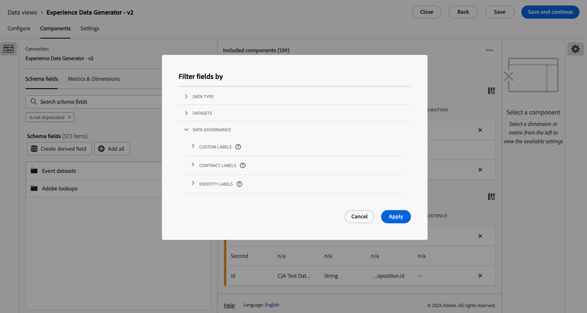

# Criar ou editar uma visualização de dados

A criação de uma visualização de dados envolve criar métricas e dimensões com base em elementos de esquema ou utilizar componentes padrão. A maioria dos elementos do esquema pode ser uma dimensão ou uma métrica, dependendo das necessidades da sua empresa. Depois de arrastar um elemento do esquema para uma visualização de dados, algumas opções serão exibidas à direita, onde você poderá ajustar como a dimensão ou métrica opera no Customer Journey Analytics.

>[!BEGINSHADEBOX]

Consulte  [Criar ou editar uma visualização de dados](https://video.tv.adobe.com/v/35110/?quality=12&learn=on){target="_blank"} para assistir a um vídeo de demonstração.

>[!ENDSHADEBOX]

Criar ou editar uma visualização de dados:

1. Faça logon no [Customer Journey Analytics](https://analytics.adobe.com) e selecione **[!UICONTROL Visualizações de dados]**, ou use a seção **[!UICONTROL Gerenciamento de dados]** no menu superior.
1. Para criar uma visualização de dados, selecione **[!UICONTROL Criar nova visualização de dados]**. Como alternativa, selecione uma visualização de dados existente na lista de visualizações de dados para editá-la.

## Configurar {#configure}

Para configurar uma visualização de dados nova ou existente:

>[!BEGINTABS]

>[!TAB Padrão]

>[!TAB B2B Edition]

>[!ENDTABS]

1. Selecione a guia **[!UICONTROL Configurar]** (se ainda não estiver ativa).

1. Especifique os detalhes de [!UICONTROL configurações], [!UICONTROL container] e [!UICONTROL calendário] (veja abaixo).
1. Selecione **[!UICONTROL Salvar e continuar]** para continuar configurando sua visualização de dados nova ou existente. Selecione **[!UICONTROL Salvar]** para salvar a configuração da visualização de dados existente.

### Configurações  {#configure-settings}

>[!CONTEXTUALHELP]
>id="dataview_externalid"
>title="ID externa"
>abstract="A alteração da ID externa pode afetar como o nome da visualização de dados aparece em fontes externas, como ferramentas de inteligência de negócios."

Fornece configurações abrangentes para a visualização de dados.

| Configuração | Descrição |
| --- | --- |
| **[!UICONTROL Conexão]** | Esse campo vincula a visualização de dados à conexão estabelecida anteriormente, que contém um ou mais conjuntos de dados da Adobe Experience Platform. |
| **[!UICONTROL Nome]** | Obrigatório. O nome da visualização de dados. Esse valor aparece no menu suspenso no canto superior direito do Analysis Workspace. |
| **[!UICONTROL ID externa]** | Obrigatório. O nome da visualização de dados que você pode usar em fontes externas, como ferramentas de business intelligence. O padrão é `unspecified`. Se você não especificar uma ID externa, o nome será gerado a partir do Nome da visualização de dados, substituindo espaços por sublinhados. |
| **[!UICONTROL Descrição]** | Opcional. A Adobe recomenda uma descrição detalhada para que os usuários entendam por que a visualização de dados existe e para quem ela foi projetada. |

{style="table-layout:auto"}

### Compatibilidade {#compatibility}

>[!CONTEXTUALHELP]
>id="dataview_dataviewsinadobejourneyoptimizer"
>title="Visualizações de dados no Journey Optimizer"
>abstract="O Customer Journey Analytics precisa usar uma conexão e uma visualização de dados compatíveis com o Adobe Journey Optimizer. Por padrão, uma conexão e uma visualização de dados são criadas automaticamente para essa finalidade. Alternativamente, você pode habilitar esta opção para torná-la a visualização de dados padrão usada nos relatórios do Adobe Journey Optimizer. Quando habilitada, todos os componentes necessários para o Journey Optimizer são adicionados a essa visualização de dados, e todos os conjuntos de dados do Journey Optimizer necessários são adicionados à conexão associada a essa visualização de dados."
>additional-url="https://experienceleague.adobe.com/pt-br/docs/analytics-platform/using/integrations/ajo#connection" text="Quais componentes e conjuntos de dados são adicionados."

Fornece as configurações aplicáveis ao usar o Adobe Journey Optimizer junto com o Customer Journey Analytics.

Esta seção é visível somente para admins provisionados com o Journey Optimizer.

| Configuração | Descrição |
| --- | --- |
| [!UICONTROL **Definir como visualização de dados padrão no Adobe Journey Optimizer**] | Essa opção de configuração padroniza os relatórios no Journey Optimizer e no Customer Journey Analytics. Também permite executar análises avançadas dos dados do Adobe Journey Optimizer no Customer Journey Analytics (selecionando as opções  e [!UICONTROL **Analisar no CJA**] no Journey Optimizer).
Para executar esse tipo de análise, o Journey Optimizer precisa acessar uma visualização de dados do Customer Journey Analytics.
Habilite esta opção para torná-la a visualização de dados padrão usada nos relatórios do Journey Optimizer da sandbox.

Essa opção de configuração automaticamente:
<ul><li>Configura todos os conjuntos de dados do Journey Optimizer necessários na conexão associada no Customer Journey Analytics para uso com o Journey Optimizer.</li><li>Cria um conjunto de métricas e dimensões do Journey Optimizer na visualização de dados (incluindo campos derivados e métricas calculadas). Os rótulos de contexto são definidos automaticamente em todas essas métricas e dimensões.</li></ul>

Considere o seguinte ao habilitar essa opção: <ul><li>É possível alterar a visualização de dados padrão posteriormente, mas isso pode alterar os dados dos relatórios do Journey Optimizer. Se optar por desabilitar essa opção posteriormente, será necessário selecionar uma nova visualização de dados padrão.</li><li>Se você já fez personalizações manuais nos conjuntos de dados, dimensões ou métricas na visualização de dados do Customer Journey Analytics, elas permanecerão intactas ao habilitar essa opção de configuração. Essa opção faz personalizações adicionais que padronizam ainda mais os relatórios no Journey Optimizer e no Customer Journey Analytics. Você também pode fazer personalizações manuais depois de habilitar essa opção.</li><li>Quando essa opção está selecionada, a conexão associada à visualização de dados não pode ser excluída.</li></ul>Consulte [Integrar o Adobe Journey Optimizer ao Adobe Customer Journey Analytics](/help/integrations/ajo.md) para obter mais informações. |

{style="table-layout:auto"}

### Containers

Determina o nome dos containers para a visualização de dados. Os nomes dos containers são usados com frequência em [segmentos](/help/components/segments/seg-overview.md#containers).

| Configuração | Descrição |
| --- | --- |
| [!BADGE B2B Edition]{type=Informative url="https://experienceleague.adobe.com/pt-br/docs/analytics-platform/using/cja-overview/cja-b2b/cja-b2b-edition" newtab=true tooltip="Customer Journey Analytics B2B edition"} **[!UICONTROL Nome do container da conta global ]** | `Global Account` (padrão). O container [!UICONTROL Conta global] inclui todas as sessões e eventos para contas globais no intervalo de tempo especificado. Se sua organização usa um termo diferente, é possível renomear o container aqui. |
| [!BADGE B2B Edition]{type=Informative url="https://experienceleague.adobe.com/pt-br/docs/analytics-platform/using/cja-overview/cja-b2b/cja-b2b-edition" newtab=true tooltip="Customer Journey Analytics B2B edition"} **[!UICONTROL Nome do container de conta ]** | `Account` (padrão). O container [!UICONTROL Conta] inclui todas as sessões e eventos para contas no intervalo de tempo especificado. Se sua organização usa um termo diferente, é possível renomear o container aqui. |
| [!BADGE B2B Edition]{type=Informative url="https://experienceleague.adobe.com/pt-br/docs/analytics-platform/using/cja-overview/cja-b2b/cja-b2b-edition" newtab=true tooltip="Customer Journey Analytics B2B edition"} **[!UICONTROL Nome do container de oportunidade ]** | `Opportunity` (padrão). O container [!UICONTROL Oportunidade] inclui todas as sessões e eventos para oportunidades no intervalo de tempo especificado. Se sua organização usa um termo diferente, é possível renomear o container aqui. |
| [!BADGE B2B Edition]{type=Informative url="https://experienceleague.adobe.com/pt-br/docs/analytics-platform/using/cja-overview/cja-b2b/cja-b2b-edition" newtab=true tooltip="Customer Journey Analytics B2B edition"} **[!UICONTROL Nome do container de grupo de compra ]** | `Buying Group` (padrão). O container [!UICONTROL Grupo de compra] inclui todas as sessões e eventos para grupos de compra no intervalo de tempo especificado. Se sua organização usa um termo diferente, é possível renomear o container aqui. |
| **[!UICONTROL Nome do container de pessoas]** | `Person` (padrão). O container [!UICONTROL Pessoa] inclui todas as sessões e eventos de pessoas dentro do intervalo de tempo especificado. Se sua organização usar um termo diferente (por exemplo, &quot;Visitante&quot; ou &quot;Usuário&quot;), você poderá renomear o container aqui. |
| **[!UICONTROL Nome do container da sessão]** | `Session` (padrão). O container [!UICONTROL Sessão] permite identificar as interações de página, campanhas ou conversões de uma sessão específica. Você pode renomear o container como &quot;Visita&quot; ou com qualquer outro termo que desejar. |
| **[!UICONTROL Nome do container do evento]** | `Event` (padrão). O container [!UICONTROL Evento] define eventos individuais em um conjunto de dados. Se sua organização usar um termo diferente (por exemplo, &quot;Ocorrências&quot; ou &quot;Exibições de página&quot;), você poderá renomear o container aqui. |

{style="table-layout:auto"}

### Calendário

Indica o formato de calendário que a visualização de dados deve seguir. Você pode ter várias visualizações de dados com base na mesma [Conexão](/help/connections/create-connection.md) e fornecer tipos de calendário ou fusos horários diferentes. Essas visualizações de dados podem permitir que equipes que usam diferentes tipos de calendário acomodem suas respectivas necessidades com os mesmos dados subjacentes.

| Configuração | Descrição |
| --- | --- |
| [!UICONTROL **Fuso horário**] | Escolha em qual fuso horário você deseja que seus dados sejam apresentados. Se você escolher um fuso horário que funcione no Horário de verão, os dados serão automaticamente ajustados para refletir isso. Na primavera, quando os relógios se ajustam uma hora à frente, há um intervalo de uma hora. No outono, quando os relógios são atrasados em uma hora, uma hora é repetida durante o horário de verão. |
| [!UICONTROL **Tipo de calendário**] | Determine como as semanas do mês são agrupadas. **Gregoriano:** formato de calendário padrão. Os trimestres são agrupados por mês. **4-5-4 Varejo:** um calendário de varejo padronizado em 4-5-4. O primeiro e o último mês do trimestre contêm 4 semanas, enquanto o segundo mês do trimestre possui 5 semanas. **Personalizado (4-5-4):** semelhante ao calendário 4-5-4, exceto que é possível escolher o primeiro dia do ano e o ano em que a semana “extra” ocorre. **Personalizado (4-4-5):** o primeiro e o segundo mês de cada trimestre contêm 4 semanas, enquanto o último mês de cada trimestre possui 5 semanas. **Personalizado (5-4-4):** O primeiro mês de cada trimestre consiste em 5 semanas, enquanto o segundo e o terceiro meses de cada trimestre consistem em 4 semanas. |
| [!UICONTROL **Primeiro mês do ano**] e [!UICONTROL **Primeiro dia da semana**] | Visível para o tipo de calendário gregoriano. Especifique em qual mês deseja que o ano civil comece e o dia em que cada semana inicia. |
| [!UICONTROL **Primeiro dia do ano atual**] | Visível para tipos de calendário personalizado. Especifique o dia do ano em que deseja que o ano atual comece. O calendário formata automaticamente o primeiro dia de cada semana com base nesse valor. |
| [!UICONTROL **Ano em que a semana “extra” ocorre**] | Na maioria dos calendários de 364 dias (52 semanas de 7 dias cada), cada ano acumula alguns dias até que uma semana extra seja formada. Essa semana extra é então adicionada ao último mês desse ano. Especifique em qual ano você deseja adicionar a semana extra. |

{style="table-layout:auto"}

## Componentes

Em seguida, você pode definir os componentes de uma visualização de dados, o que significa que é possível criar métricas e dimensões com base em elementos do esquema. Você também pode usar os componentes padrão.

>[!IMPORTANT]
>
>Até 5 mil métricas e 5 mil dimensões podem ser adicionadas a uma mesma visualização de dados.

1. Selecione a guia **[!UICONTROL Componentes]**.

   

   Você pode ver a [!UICONTROL Conexão] no canto superior esquerdo, que contém os conjuntos de dados, e seus [!UICONTROL Campos de esquema] abaixo.  Os componentes já incluídos são componentes padrão (gerados pelo sistema) necessários para todas as visualizações de dados (como métricas de eventos, pessoas e sessões e dimensões de minuto, trimestre e semana). A Adobe também aplica o filtro **[!UICONTROL Contém dados]** e **[!UICONTROL não foi descontinuado]** por padrão, para que sejam exibidos apenas campos de esquema que contêm dados e não foram descontinuados.

1. Procure um campo de esquema usando a opção  **[!UICONTROL Pesquisar campos de esquema]** ou localize um campo acessando qualquer uma das coleções de conjunto de dados, como  **[!UICONTROL Conjuntos de dados de evento]**. Como alternativa, é possível criar um campo derivado usando a opção  **Criar campo derivado** . Consulte [Campos derivados](./derived-fields/derived-fields.md) para obter mais informações.

1. Quando você encontrar o campo de esquema específico ou definir o campo derivado, arraste esse campo, como  **[!UICONTROL Nome da Página]**, do painel esquerdo para a seção **[!UICONTROL Métricas]** ou **[!UICONTROL Dimensões]** abaixo de **[!UICONTROL Componentes incluídos]**.
Você pode arrastar o mesmo campo de esquema nas seções de dimensões ou métricas várias vezes e configurar a mesma dimensão ou métrica de maneiras diferentes. Por exemplo, no campo pageName, é possível criar uma dimensão denominada `Product Pages` e outra denominada `Error pages`, usando diferentes [Configurações de componente](component-settings/overview.md) à direita.
Se você arrastar uma pasta de campo de esquema do painel esquerdo, os campos na pasta serão classificados automaticamente na seção apropriada. Os campos de sequência de caracteres terminam na seção [!UICONTROL Dimensão] e os esquemas do tipo numérico terminam na seção [!UICONTROL Métricas]. Você também pode clicar em **[!UICONTROL Adicionar tudo]** e todos os campos de esquema serão adicionados às suas respectivas seções.

1. Ao selecionar um componente, as configurações são exibidas no lado direito.

   

   Configure o componente usando [Configurações de componente](component-settings/overview.md). As configurações de componente disponíveis variam, dependendo se o componente é uma dimensão/métrica e do tipo de dados do esquema. As configurações incluem:

   * [[!UICONTROL Atribuição]](component-settings/attribution.md)
   * [[!UICONTROL Comportamento]](component-settings/behavior.md)
   * [[!UICONTROL Formato]](component-settings/format.md)
   * [[!UICONTROL Incluir/excluir valores]](component-settings/include-exclude-values.md)
   * [[!UICONTROL Desduplicação de métrica]](component-settings/metric-deduplication.md)
   * [[!UICONTROL Sem opções de valor]](component-settings/no-value-options.md)
   * [[!UICONTROL Persistência]](component-settings/persistence.md)
   * [[!UICONTROL Classificação de valor]](component-settings/value-bucketing.md)

1. Selecione **[!UICONTROL Salvar e continuar]** para continuar configurando sua visualização de dados nova ou existente. Selecione **[!UICONTROL Salvar]** para salvar a configuração da visualização de dados existente.

### Métricas ou dimensões duplicadas

Duplicar métricas ou dimensões e depois modificar configurações específicas é uma maneira fácil de criar várias métricas ou dimensões a partir de um único campo de esquema. Selecione a configuração [!UICONTROL Duplicar] abaixo do nome da métrica ou das dimensões no canto superior direito. Modifique a nova métrica ou dimensão e salve-a com um nome mais descritivo.

### Filtrar campos ou conjuntos de dados de esquema

Você pode filtrar  campos de esquema no painel esquerdo por [!UICONTROL tipo de dados], [!UICONTROL conjuntos de dados], [!UICONTROL governança de dados] e [!UICONTROL outros] critérios ([!UICONTROL contém dados], [!UICONTROL é uma identidade] e [!UICONTROL não foi descontinuado]):

>[!TIP]
>
>Se os componentes não forem carregados corretamente na visualização de dados e uma mensagem de erro aparecer, consulte [Falta de permissões](../troubleshooting/lack-of-permissions.md) para obter uma resolução.

### Componentes incluídos {#included-components}

>[!CONTEXTUALHELP]
>id="dataview_includedcomponents_filter_datagovernance_custom"
>title="Rótulos personalizados"
>abstract="Além dos rótulos fornecidos pela Adobe, também é possível definir seus próprios rótulos personalizados para sua organização."
>additional-url="https://experienceleague.adobe.com/pt-br/docs/experience-platform/data-governance/labels/overview" text="Visão geral dos rótulos de uso de dados"

>[!CONTEXTUALHELP]
>id="dataview_includedcomponents_filter_datagovernance_contract"
>title="Rótulos de contrato"
>abstract="Os rótulos de contrato (C) são usados para categorizar dados que contêm obrigações contratuais ou estão relacionados às políticas de governança de dados da sua organização."
>additional-url="https://experienceleague.adobe.com/pt-br/docs/experience-platform/data-governance/labels/overview" text="Visão geral dos rótulos de uso de dados"

>[!CONTEXTUALHELP]
>id="dataview_includedcomponents_filter_datagovernance_identity"
>title="Rótulos de identidade"
>abstract="Os rótulos de identidade (I) são usados para categorizar dados que podem identificar ou permitir o contato com uma pessoa específica."
>additional-url="https://experienceleague.adobe.com/pt-br/docs/experience-platform/data-governance/labels/overview" text="Visão geral dos rótulos de uso de dados"

>[!CONTEXTUALHELP]
>id="dataview_includedcomponents_filter_datagovernance_sensitive"
>title="Rótulos sigilosos"
>abstract="Os rótulos sigilosos (S) são usados para categorizar dados que você e sua organização consideram sigilosos."
>additional-url="https://experienceleague.adobe.com/pt-br/docs/experience-platform/data-governance/labels/overview" text="Visão geral dos rótulos de uso de dados"

>[!CONTEXTUALHELP]
>id="dataview_includedcomponents_filter_datagovernance_partnerecosystem"
>title="Ecossistema de parceiros"
>abstract="Os rótulos do ecossistema de parceiros (P) são usados para categorizar dados compartilhados com terceiros parceiros."
>additional-url="https://experienceleague.adobe.com/pt-br/docs/experience-platform/data-governance/labels/overview" text="Visão geral dos rótulos de uso de dados"

>[!CONTEXTUALHELP]
>id="dataview_includedcomponents_filter_datagovernance_policies"
>title="Políticas"
>abstract="Para que os rótulos de uso de dados sigam efetivamente a conformidade de dados, as políticas de uso de dados devem ser implementadas. As políticas de uso de dados são regras que descrevem os tipos de ações de marketing que você tem permissão ou restrição para executar em dados dentro da Experience Platform. Os filtros de políticas aplicam a política habilitada à Visualização de dados."
>additional-url="https://experienceleague.adobe.com/pt-br/docs/experience-platform/data-governance/labels/overview" text="Visão geral dos rótulos de uso de dados"

>[!CONTEXTUALHELP]
>id="dataview_includedcomponents_filter_datagovernance_responsibleengagement"
>title="Rótulos de engajamento responsável"
>abstract="Os rótulos de engajamento responsável são usados para oferecer suporte ao engajamento responsável."
>additional-url="https://experienceleague.adobe.com/pt-br/docs/experience-platform/data-governance/labels/overview" text="Visão geral dos rótulos de uso de dados"

Os **[!UICONTROL Componentes incluídos]** contêm a lista de **[!UICONTROL Métricas]** e **[!UICONTROL Dimensões]** que você configura para a visualização de dados.

* Para pesquisar componentes, use  **[!UICONTROL _Pesquisar componentes_]**.
* Para filtrar os componentes incluídos listados, selecione .

  

  Na caixa de diálogo **[!UICONTROL Filtrar campo por]**, você pode filtrar as seguintes categorias:

   * **[!UICONTROL Tipo de dados]** - Você pode selecionar um ou mais dos seguintes tipos de dados: [!UICONTROL Cadeia de caracteres], [!UICONTROL Inteiro], [!UICONTROL Curto], [!UICONTROL Booleano], [!UICONTROL Duplo], [!UICONTROL Byte], [!UICONTROL Longo], [!UICONTROL Data] ou [!UICONTROL Data-hora].
   * **[!UICONTROL Conjuntos de dados]** - Selecione um ou mais conjuntos de dados.
   * **[!UICONTROL Governança de dados]**: selecione um ou mais rótulos das subcategorias [!UICONTROL Rótulos personalizados], [!UICONTROL Rótulos de contrato], [!UICONTROL Rótulos de identidade], [!UICONTROL Rótulos de sensibilidade], [!UICONTROL ecossistema de parceiro] ou [!UICONTROL Políticas].
   * **[!UICONTROL Outros]** - Selecione uma ou mais das opções [!UICONTROL Contém dados], [!UICONTROL É identidade] ou [!UICONTROL Não está obsoleto].

  Selecione **[!UICONTROL Aplicar]** para aplicar os filtros.

## Configurações  {#dataview-settings}

1. Selecione a guia **[!UICONTROL Configurações]**.

   Configurações de 

1. Configure segmentos para aplicar a toda a visualização de dados. Consulte [Configurações (segmentos)](#settings-filters) abaixo.
1. Configurar o tempo limite e as métricas da sessão. Consulte [Configurações da sessão](#session-settings) abaixo.

1. Selecione **[!UICONTROL Salvar e continuar]** para continuar configurando sua visualização de dados nova ou existente. Selecione **[!UICONTROL Salvar]** para salvar a configuração da visualização de dados existente.

### Configurações (segmentos) {#segment-settings}

É possível adicionar segmentos que se aplicam a toda a visualização de dados. Esse segmento é aplicado a qualquer relatório executado no Workspace. Arraste um segmento dos componentes no painel à esquerda para o campo **[!UICONTROL Adicionar segmentos]**.

### Configurações da sessão

Determine o período de inatividade entre eventos antes de uma sessão expirar e um novo ser iniciado. É necessário um período. Ou também é possível forçar o início de uma nova sessão quando um evento contém uma determinada métrica. Consulte [Configurações de sessão](session-settings.md) para obter mais detalhes.

### Pré-visualização de dados

A pré-visualização de dados compara (nos vários containers) os dados dessa visualização de dados com os dados da conexão. A porcentagem de pré-visualização é baseada no número total de conexões nos últimos 90 dias.

Se a pré-visualização não estiver carregando, sua conexão ainda pode estar sendo preenchida.

Depois que todas as configurações desejadas forem especificadas, clique em **[!UICONTROL Salvar e concluir]**.
