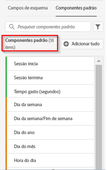

# Criar uma nova visualização de dados

>[!IMPORTANT]
>
>Essa funcionalidade estará disponível em geral em 22 de abril de 2021.

A criação de uma visualização de dados envolve a criação de métricas e dimensões a partir de elementos de esquema ou a utilização de componentes padrão. Criar métricas ou dimensões oferece uma enorme quantidade de flexibilidade. Anteriormente, a suposição era que se você tivesse conjuntos de dados no Adobe Experience Platform, os campos de sequência eram usados como dimensões e campos numéricos como métricas. Para alterar qualquer um desses campos, você tinha que editar seu esquema no Platform. A interface do usuário de visualizações de dados agora permite [mais definição de forma livre de métricas e dimensões](/help/data-views/data-views.md). Para obter mais casos de uso, consulte [Casos de uso das visualizações de dados](/help/data-views/data-views-usecases.md).

## 1. Definir configurações e contêineres de visualizações de dados

1. No Customer Journey Analytics, acesse a guia **[!UICONTROL Visualizações de dados]**.
2. Clique em **[!UICONTROL Adicionar]** para criar uma nova visualização de dados e definir suas configurações.

| Configuração | Descrição/Caso de uso |
| --- | --- |
| [!UICONTROL Conexão] | Esse campo vincula a visualização de dados à conexão estabelecida anteriormente, que contém um ou mais conjuntos de dados da Adobe Experience Platform. |
| [!UICONTROL Nome] | É obrigatório dar um nome à visualização de dados. |
| [!UICONTROL Descrição] | Uma descrição detalhada não é obrigatória, mas é recomendada. |
| [!UICONTROL Fuso horário] | Escolha em qual fuso horário você deseja que seus dados sejam apresentados. |
| [!UICONTROL Tags] | As tags permitem organizar as visualizações de dados em categorias. |
| [!UICONTROL Contêineres] | É possível renomear os contêineres aqui e é assim que eles serão exibidos em qualquer projeto do Workspace baseado nessa visualização de dados. Os contêineres são usados em filtros e fallout/fluxo, etc., para definir a amplitude ou o estreitamento do escopo ou do contexto. [Saiba mais](https://experienceleague.adobe.com/docs/analytics-platform/using/cja-components/cja-filters/filters-overview.html?lang=en#filter-containers) |
| [!UICONTROL O nome do contêiner de pessoa é...] | [!UICONTROL Pessoa]  (padrão). O contêiner [!UICONTROL Pessoa] inclui todas as visitas e visualizações de página de visitantes em um período especificado. Você pode renomear para &quot;Usuário&quot; ou qualquer outro termo que desejar. |
| [!UICONTROL O nome do contêiner da sessão é...] | [!UICONTROL Sessão]  (padrão). O contêiner [!UICONTROL Session] permite identificar interações de página, campanhas ou conversões para uma sessão específica. Você pode renomear para &quot;Visita&quot; ou qualquer outro termo que desejar. |
| [!UICONTROL O nome do contêiner de evento é...] | [!UICONTROL Event]  (padrão). O contêiner [!UICONTROL Event] define quais eventos de página você deseja incluir ou excluir de um filtro. |

Em seguida, você pode criar métricas e dimensões a partir de elementos do esquema. Você também pode usar os componentes Padrão.

## 2. Criar métricas e dimensões a partir de elementos de esquema

1. Em [!UICONTROL Customer Journey Analytics] > [!UICONTROL Visualizações de dados], clique na guia [!UICONTROL Componentes].

Você pode ver a [!UICONTROL Connection] no canto superior esquerdo, que contém os conjuntos de dados, e seus [!UICONTROL Campos de esquema] abaixo. Lembre-se:

* Os componentes já incluídos são os componentes obrigatórios padrão (gerados pelo sistema).
* Também aplicamos o filtro **[!UICONTROL Contém dados]** por padrão, para que sejam exibidos apenas campos de Esquema que contêm dados. Se estiver procurando um campo que não contenha dados, basta remover o filtro .

1. Agora arraste um campo de esquema, como [!UICONTROL pageTitle], do painel esquerdo para a seção Métricas ou Dimension.

   Você pode arrastar o mesmo campo de esquema nas seções de dimensões ou métricas várias vezes e configurar a mesma dimensão ou métrica de maneiras diferentes.
Por exemplo, no campo **[!UICONTROL pageTitle]**, é possível criar uma dimensão chamada &quot;Páginas de produto&quot; e outra &quot;Páginas de erro&quot;, etc., renomeando o **[!UICONTROL Nome do componente]** à direita. Em **[!UICONTROL pageTitle]**; , também é possível criar métricas a partir de um valor de string. Por exemplo, você pode criar uma ou mais métricas **[!UICONTROL Orders]** com diferentes configurações de atribuição e diferentes valores de inclusão/exclusão.

   

   >[!NOTE]
   >
   >Você pode arrastar todas as pastas de campo de esquema do painel esquerdo e elas serão classificadas automaticamente em seções tradicionais. Os campos de string terminarão na seção [!UICONTROL Dimension] e nos números na seção [!UICONTROL Metrics]. Ou clique em **[!UICONTROL Add all]** e todos os campos de esquema serão adicionados.

1. Depois de selecionar o componente, você verá várias configurações à direita. Configure o componente usando as configurações descritas abaixo.

### Definir configurações do componente

| Configuração | Descrição/Caso de uso |
| --- | --- |
| [!UICONTROL Tipo de componente] | Obrigatório. Permite alterar um componente de Métrica para Dimension ou vice-versa. |
| [!UICONTROL Nome do componente] | Obrigatório. Permite especificar o nome amigável que aparecerá no Analysis Workspace. É possível renomear um componente para atribuir a ele um nome específico da visualização de dados. |
| [!UICONTROL Descrição] | Opcional, mas recomendado, para fornecer informações sobre o componente para outros usuários. |
| [!UICONTROL Tags] | Opcional. Permite marcar o componente com tags personalizadas ou prontas para uso para facilitar a pesquisa/filtragem na interface do usuário do Analysis Workspace. |
| [!UICONTROL Nome do campo] | O nome do campo de esquema. |
| [!UICONTROL Tipo de conjunto de dados] | Obrigatório. Um campo não editável que mostra de qual tipo de conjunto de dados (evento, pesquisa ou perfil) o componente veio. |
| [!UICONTROL Conjunto de dados] | Obrigatório. Um campo não editável que mostra de qual tipo de campo o componente veio (por exemplo, String, Integer, etc.). Este campo pode conter vários conjuntos de dados, como quando você está combinando vários conjuntos de relatórios. |
| [!UICONTROL Tipo de esquema] | Refere-se a se o componente é uma string, um inteiro, etc. |
| [!UICONTROL ID de componente] | Obrigatório. A [API CJA](https://adobe.io/cja-apis/docs) usa esse campo para fazer referência ao componente. Você pode clicar no ícone editar e modificar essa ID de componente. No entanto, alterar essa ID de componente interrompe todos os projetos existentes do Workspace que contêm esse componente. Se você criar outra visualização de dados que use um campo diferente para uma dimensão pageTitle, será possível renomeá-la e tornar a visualização de dados cruzados compatível. |
| [!UICONTROL Path] | Obrigatório. Um campo não editável que mostra o caminho do esquema de onde o componente veio. |
| [!UICONTROL Ocultar componente nos relatórios] | Padrão = desativado. Permite preparar o componente para fora da Exibição de dados, quando usado em relatórios. Isso não afeta as permissões, apenas a preparação de componentes. Em outras palavras, você pode ocultar o componente de não Administradores nos relatórios. Os administradores ainda podem acessá-lo clicando em [!UICONTROL Mostrar todos os componentes] em um projeto do Analysis Workspace. |

### Definir configurações de Formato

As configurações de formato são somente para métricas.

| Configuração | Descrição/Caso de uso |
| --- | --- |
| [!UICONTROL Formato] | Permite que você especifique a formatação de uma métrica, como Decimal, Hora, Porcentagem ou Moeda. |
| [!UICONTROL Casas decimais] | Permite que você especifique o número de casas decimais que uma métrica deve exibir. |
| [!UICONTROL Exibir tendência ascendente como] | Permite especificar se uma tendência acima nessa métrica deve ser considerada boa (verde) ou ruim (vermelho). |
| [!UICONTROL Moeda] | Essa configuração aparece somente se o formato de métrica selecionado for [!UICONTROL Currency]. Uma lista de opções de moeda está disponível. O padrão é sem moeda. Isso permite representar a receita na moeda de sua escolha no relatório. Esta não é uma conversão de moeda, apenas uma opção de formatação de interface do usuário. |

### Definir configurações de Atribuição

| Configuração | Descrição/Caso de uso |
| --- | --- |
| [!UICONTROL Definir atribuição] | Permite que você especifique as configurações de atribuição que deseja aplicar a essa métrica por padrão quando ela for usada. Esse padrão pode ser substituído em uma Tabela de forma livre ou em uma Métrica calculada. |
| [!UICONTROL Modelo de atribuição] | Permite que você especifique um modelo de atribuição padrão - ativo somente quando você ativar a configuração [!UICONTROL Usar modelo de atribuição não padrão]. O padrão é [!UICONTROL Último contato]. As opções são: Último Contato, Primeiro Contato, Linear, Participação, Mesmo Toque, Forma De U, Curva De J, J Inverso, Declínio De Tempo, Personalizado, Algorítmico. Algumas dessas opções criam campos adicionais que precisam ser preenchidos - como Personalizado ou Declínio de tempo. É possível criar várias métricas usando o mesmo campo - isso significa que você pode ter uma métrica de receita [!UICONTROL Último contato] e uma métrica de receita [!UICONTROL Primeiro contato], mas com base no mesmo campo de receita no schema. |
| [!UICONTROL Janela de lookback] | Permite que você especifique uma janela de lookback padrão para uma métrica - ativa somente quando você ativa a configuração [!UICONTROL Usar modelo de atribuição não padrão]. As opções são: Pessoa (Janela Relatório), Sessão, Personalizada. Quando a opção Personalizado estiver selecionada, também oferecemos a opção de selecionar qualquer número de dias/semanas/meses/etc. (até 90 dias), exatamente como o Attribution IQ. Você pode ter várias métricas usando o mesmo campo de esquema, mas cada uma com uma janela de retrospectiva separada. |

### Configurar as configurações Incluir/Excluir valores

Essa configuração permite modificar os dados subjacentes nos quais você está relatando, no momento da consulta. Não é o mesmo que um filtro (anteriormente chamado de segmento). Mas os filtros respeitarão essa nova dimensão, assim como a definição de caminho e a atribuição.

Por exemplo, você pode criar uma dimensão fora do campo pageTitle , mas chamá-la de &quot;páginas de erro&quot; e incluir qualquer página que [!UICONTROL contenha a frase] &quot;erro&quot;.

| Configuração | Descrição/Caso de uso |
| --- | --- |
| [!UICONTROL Diferencia maiúsculas de minúsculas] | Padrão = Ativado. Essa configuração se aplica somente à seção [!UICONTROL Incluir/Excluir valores]. Isso permite dizer se a regra de inclusão/exclusão que você está aplicando deve diferenciar maiúsculas de minúsculas. |
| [!UICONTROL Corresponder] | Permite especificar quais valores você gostaria de considerar para os relatórios antes da atribuição e segmentação (por exemplo, use apenas valores contendo a frase &quot;erro&quot;). Você pode especificar: **[!UICONTROL Se todos os critérios forem atendidos]**, ou **[!UICONTROL Se algum critério for atendido]**. |
| [!UICONTROL Critérios] | Permite especificar a lógica de correspondência que deve ser aplicada a uma regra de filtro específica.<ul><li>**Sequência**: Contém a frase, Contém qualquer termo, Contém todos os termos, Não contém nenhum termo, Não contém a frase, É igual, Não é igual, Começa com, Termina com</li><li>**Duplo/Número inteiro**: é igual, não é igual, é maior que, é menor que, é maior que ou igual a, é menor que ou igual a</li><li>**Data**: é igual a, não é igual, é posterior a, é anterior, ocorre dentro de</li></ul> |
| [!UICONTROL Corresponder operando] | Permite especificar o operando de correspondência ao qual o operador de correspondência deve ser aplicado.<ul><li>**Sequência**: Campo de texto</li><li>**Duplo/Número inteiro**: Campo de texto com setas para cima/para baixo para valores numéricos</li><li>**Data**: Seletor de granularidade do dia (calendário)</li><li>**Data Hora**: Seletor de granularidade de data e hora</li></ul> |
| [!UICONTROL Adicionar regra] | Permite especificar um operador e um operando de correspondência adicional. |

### Definir configurações de comportamento

| Configuração | Descrição/Caso de uso |
| --- | --- |
| [!UICONTROL Contar instâncias] | Permite especificar se um campo numérico ou de tipo de data usado como uma métrica deve contar os horários em que foi definido, em vez do valor propriamente dito.  Se desejar adicionar as instâncias de um campo numérico e quiser simplesmente adicionar o número de vezes que um campo foi  ** diferente do valor real nele contido. Isso é útil para criar uma métrica de   Pedidos a partir de um campo de   Receita, por exemplo. Se a receita foi definida, devemos contar 1 pedido único em vez do valor numérico da receita. |

### Definir configurações [!UICONTROL Nenhuma opção de valor]

[!UICONTROL Nenhuma ] opção de valor é análoga a   Não especificado ou   Não avaliado no relatório. Na interface do usuário das visualizações de dados, em uma base componente por componente, é possível decidir como você deseja que esses valores sejam tratados nos relatórios. Você também pode renomear [!UICONTROL Nenhum valor] para algo que se ajuste melhor ao seu ambiente, como [!UICONTROL Null], [!UICONTROL Not set], ou outros.

Observe também que qualquer item especificado neste campo pode ser usado para o tratamento especial da interface do usuário do item de linha [!UICONTROL Sem valor] no relatório, conforme declarado na configuração [!UICONTROL Sem opções de valor].

| Configuração | Descrição/Caso de uso |
| --- | --- |
| [!UICONTROL Se for exibido, chame No value..] | É aqui que você pode renomear **[!UICONTROL No value]** para outra coisa. |
| [!UICONTROL Não mostrar Nenhum valor por padrão] | Não mostra esse valor no relatório. |
| [!UICONTROL Mostrar Nenhum valor por padrão] | Mostra esse valor no relatório. |
| [!UICONTROL Tratar valor Nenhum como um valor] | Essa configuração substituirá valores em branco nos dados pelo texto especificado em [!UICONTROL Se mostrado, chame No value ...]. Por exemplo, se você tiver tipos de dispositivo móvel como a dimensão, poderá renomear o item **[!UICONTROL No value]** para &quot;Desktop&quot;. Observe que ao alterar esse campo para um valor personalizado, o valor personalizado será tratado como um valor de sequência de caracteres legítimo. Portanto, se você inserir o valor &quot;Vermelho&quot; nesse campo, qualquer instância da string &quot;Vermelho&quot; que aparece nos próprios dados também será inserida sob o mesmo item de linha especificado. |

### Definir configurações de Persistência

Para obter mais informações, consulte o tópico em [Persistência](/help/data-views/persistence.md).

| Configuração | Descrição/Caso de uso |
| --- | --- |
| [!UICONTROL Definir persistência] | Alternar tecla |
| [!UICONTROL Alocação] | Permite especificar o modelo de alocação usado em uma dimensão para persistência. As opções são: [!UICONTROL Mais recente], [!UICONTROL Original], [!UICONTROL Instância], [!UICONTROL Tudo]. Se você quiser que um valor persista (semelhante às eVars no Analytics tradicional), é aqui que você o define. A única diferença principal é que a persistência máxima que você pode definir é 90 dias. Além disso, [!UICONTROL Nunca expirar] não é uma opção. |
| [!UICONTROL Expiração] | Permite especificar a janela de persistência para uma dimensão. As opções são: [!UICONTROL Sessão] (padrão), [!UICONTROL Pessoa], [!UICONTROL Tempo], [!UICONTROL Métrica]. Talvez seja necessário poder expirar a dimensão em uma compra (como termos de pesquisa interna ou outros casos de uso de merchandising).  Métricas permitem especificar qualquer uma das métricas definidas como a expiração dessa dimensão (por exemplo, uma métrica de   compras). |

### Definir configurações de bucket de valor

Por exemplo, um bucket de &quot;entre 5 e 10&quot; será exibido como um item de linha &quot;5 a 10&quot; nos relatórios do Workspace.

| Configuração | Descrição/Caso de uso |
| --- | --- |
| [!UICONTROL Valor do bloco] | Permite criar uma versão classificada de uma dimensão numérica. Isso permite relatar períodos de receita ou outros valores numéricos como uma dimensão no relatório. |
| [!UICONTROL Até] | Permite especificar os limites da primeira categoria de dimensão numérica. Isso se aplica somente a dimensões numéricas. |
| [!UICONTROL Entre e até] | Permite que você especifique os limites de compartimentos de dimensão numérica subsequentes. |
| [!UICONTROL Adicionar bloco] | Permite adicionar outro bucket ao dimensionamento de dimensão numérica. |

### Use [!UICONTROL Componentes padrão]

Além de criar métricas e dimensões a partir de elementos do esquema, você também pode usar componentes padrão em suas visualizações de dados.

[!UICONTROL Os ] componentes padrão são componentes que não são gerados a partir de campos de esquema do conjunto de dados, mas que são gerados pelo sistema. Alguns componentes do sistema são necessários em qualquer visualização de dados para facilitar os recursos de relatórios no Analysis Workspace, enquanto outros componentes do sistema são opcionais.

Por padrão, os componentes padrão obrigatórios são adicionados à visualização de dados.

| Nome do componente | Dimension ou métrica | Notas |
| --- | --- | --- |
| [!UICONTROL Pessoas] | Métrica | Essa métrica é baseada na ID de pessoa especificada em uma conexão. |
| [!UICONTROL Sessões] | Métrica | Essa métrica é baseada nas configurações de sessão especificadas abaixo. |
| [!UICONTROL Eventos] | Métrica | Essa métrica representa o número de linhas de todos os conjuntos de dados de eventos em uma conexão. |
| [!UICONTROL Dia] | Dimensão | A dimensão &quot;Dia&quot; informa o dia em que uma determinada métrica ocorreu. O primeiro item de dimensão é o primeiro dia no intervalo de datas, e o último item de dimensão é o último dia no intervalo de datas. |
| [!UICONTROL Semana] | Dimensão | A dimensão &quot;Semana&quot; informa a semana em que uma determinada métrica ocorreu. O primeiro item de dimensão é a primeira semana no intervalo de datas, e o último item de dimensão é a última semana no intervalo de datas. |
| [!UICONTROL Mês] | Dimensão | A dimensão Mês informa o mês em que uma determinada métrica ocorreu. O primeiro item de dimensão é o primeiro mês no intervalo de datas, e o último item de dimensão é o último mês no intervalo de datas. |
| [!UICONTROL Trimestre] | Dimensão | A dimensão &quot;Trimestre&quot; informa o trimestre em que uma determinada métrica ocorreu. O primeiro item de dimensão é o primeiro trimestre no intervalo de datas, e o último item de dimensão é o último trimestre no intervalo de datas. |
| [!UICONTROL Ano] | Dimensão | A dimensão &quot;Ano&quot; informa o ano em que uma determinada métrica ocorreu. O primeiro item de dimensão é o primeiro ano no intervalo de datas, e o último item de dimensão é o ano mais recente no intervalo de datas. |
| [!UICONTROL Hora] | Dimensão | A dimensão &quot;Hora&quot; informa a hora em que uma determinada métrica ocorreu (arredondada para baixo). O primeiro item de dimensão é a primeira hora no intervalo de datas, e o último item de dimensão é a última hora no intervalo de datas. |
| [!UICONTROL Minuto] | Dimensão | A dimensão &quot;Minuto&quot; informa o minuto em que uma determinada métrica ocorreu (arredondado para baixo). O primeiro item de dimensão é o primeiro minuto no intervalo de datas, e o último item de dimensão é o último minuto no intervalo de datas. |

### Componentes padrão opcionais

Os componentes padrão opcionais estão disponíveis na guia **[!UICONTROL Componentes padrão]**.

| Nome do componente | Dimension ou métrica | Notas |
| --- | --- | --- |
| [!UICONTROL Sessão inicia] | Métrica | Essa métrica conta o número de eventos que foram o primeiro evento de uma sessão. Quando usado em uma definição de filtro (por exemplo, &#39;[!UICONTROL Session Starts] exists&#39;), ela filtra somente para o primeiro evento de cada sessão. |
| [!UICONTROL Sessão termina] | Métrica | Essa métrica conta o número de eventos que foram o último evento de uma sessão. Semelhante a [!UICONTROL Inícios de sessão], também pode ser usado em uma definição de filtro para filtrar os itens para o último evento de cada sessão. |
| [!UICONTROL Tempo gasto (segundos)] | Métrica | A métrica [!UICONTROL Tempo gasto] adiciona o tempo entre dois valores diferentes para uma dimensão. |
| [!UICONTROL Tempo gasto por evento] | Dimensão | [!UICONTROL Tempo gasto por ] evento define a  [!UICONTROL métrica Tempo ] gasto em   eventos. |
| [!UICONTROL Tempo gasto por sessão] | Dimensão | [!UICONTROL Tempo gasto por ] sessão classifica a  [!UICONTROL métrica Tempo ] gasto em   sessões. |
| [!UICONTROL Tempo gasto por pessoa] | Dimensão | [!UICONTROL Tempo gasto por ] personalização define a métrica  [!UICONTROL Tempo ] gasto em   personalizações. |
| [!UICONTROL ID em lote] | Dimensão | Representa o lote de Experience Platform do qual um [!UICONTROL Event] fez parte. |
| [!UICONTROL ID do conjunto de dados] | Dimensão | Representa o conjunto de dados Experience Platform do qual um [!UICONTROL Event] fazia parte. |

### Filtrar campos de esquema e dimensões/métricas

Você pode filtrar campos de esquema no painel esquerdo pelos seguintes tipos de dados:

Também é possível filtrar por conjuntos de dados e por se um campo de esquema contém dados ou se é uma identidade. Por padrão, aplicamos o filtro **[!UICONTROL Contém dados]** a todas as visualizações de dados.

## 3. Adicionar um filtro global à visualização de dados

É possível adicionar filtros que se aplicam a toda a visualização de dados. Esse filtro será aplicado a qualquer relatório que você executar no Workspace.

1. Clique na guia [!UICONTROL Settings] em [!UICONTROL Data views].
1. Arraste um filtro da lista no painel à esquerda para o campo [!UICONTROL Add filters].
