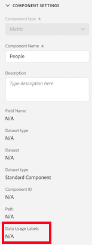

# Rótulos, políticas e ações de marketing

Ao criar um conjunto de dados na Experience Platform, é possível criar [rótulos de uso de dados](https://experienceleague.adobe.com/pt-br/docs/experience-platform/data-governance/labels/reference) para alguns ou todos os elementos no conjunto de dados. É possível visualizar esses rótulos e políticas no Customer Journey Analytics.

Os seguintes rótulos e ações de marketing são de especial interesse para o Customer Journey Analytics:

| Rótulo | Ação de marketing | Definição |
|---------|----------|---------|
| `C2` | [!UICONTROL Exportar para terceiros] | O rótulo e a ação de marketing associada significam que os dados não podem ser exportados para terceiros se a política DULE correspondente estiver habilitada. |
| `C3` | [!UICONTROL Combinar com dados diretamente identificáveis] | O rótulo e a ação de marketing associada significam que os dados não podem ser combinados ou usados com informações diretamente identificáveis, se a política DULE correspondente estiver habilitada. |
| `C8` | [!UICONTROL Analytics] | O rótulo e a ação de marketing associada significam que os dados não podem ser usados para análises nos sites ou aplicativos de sua organização, se a política DULE correspondente estiver habilitada. |
| `C9` | [!UICONTROL Ciência de dados] | O rótulo e a ação de marketing associada significam que os dados não podem ser usados em workflows de ciência de dados, se a política DULE correspondente estiver habilitada. |
| `C12` | [!UICONTROL Exportação de dados] | O rótulo e a ação de marketing associada significam que os campos de esquema rotulados dessa maneira não podem ser exportados ou baixados do Customer Journey Analytics (por meio de relatórios, exportação, API e assim por diante), se a política DULE correspondente estiver habilitada. |

>[!NOTE]
>
>Os rótulos de uso de dados não são propagados automaticamente para os conjuntos de dados compilados. No entanto, eles podem ser adicionados manualmente.

A rotulação por si só não significa que esses rótulos de uso de dados serão aplicados. É para isso que as políticas são usadas. Você pode criar suas políticas usando a [Interface da Experience Platform](https://experienceleague.adobe.com/pt-br/docs/experience-platform/data-governance/policies/user-guide) ou por meio da [API do serviço de política](https://experienceleague.adobe.com/pt-br/docs/experience-platform/data-governance/api/overview) na Experience Platform.

Cinco políticas definidas pela Adobe estão disponíveis no Experience Platform que podem aparecer no Customer Journey Analytics e afetar a geração de relatórios e a exportação de dados:

| Política | Rótulo |
|---------|----------|
| [!UICONTROL Restringir exportação de dados de terceiros] | `C2` |
| [!UICONTROL Restringir a combinação de dados diretamente identificáveis] | `C3` |
| [!UICONTROL Restringir análise de uso e medição baseada em usuário] | `C8` |
| [!UICONTROL Restringir ciência de dados] | `C9` |
| [!UICONTROL Restringir exportação de dados] | `C12` |

## Exibir rótulos de dados em visualizações de dados do Customer Journey Analytics

Os rótulos de dados que você ou outras pessoas criaram na Experience Platform são exibidos em três locais na interface do usuário das visualizações de dados:

| Localização | Descrição |
| --- | --- |
| Botão Informação em um campo do esquema | Clicar nesse botão indica quais [!UICONTROL rótulos de uso de dados] aplicam-se atualmente a um campo:
 |
| Painel direito em [Configurações do componente](/help/data-views/component-settings/overview.md) | Todos os [!UICONTROL rótulos de uso de dados] estão listados aqui:
 |
| Adicionar rótulos de dados como uma coluna | Você pode adicionar [!UICONTROL rótulos de uso de dados] como uma coluna nas colunas [!UICONTROL Componentes incluídos] nas visualizações de dados. Basta clicar no ícone do seletor de colunas e selecionar **[!UICONTROL Rótulos de uso de dados]**:
 |

{style="table-layout:auto"}

## Filtrar por rótulos de governança de dados nas visualizações de dados

No editor de visualizações de dados, selecione o ícone de [!UICONTROL filtro] no painel à esquerda e filtre os componentes de visualizações de dados por **[!UICONTROL Governança de dados]** e tipo de **[!UICONTROL Rótulo]**:

Clique em **[!UICONTROL Aplicar]** para ver quais componentes têm rótulos anexados a eles.

## Filtrar as políticas de governança de dados nas visualizações de dados

É possível verificar se uma política (por exemplo, uma política que você criou, denominada **[!UICONTROL Aplicar análise]**) está ativada. E se essa política bloqueia o uso de determinados elementos de visualização de dados do Customer Journey Analytics para análise ou exportação de dados.

Novamente, clique no ícone de [!UICONTROL filtro] no painel esquerdo, em **[!UICONTROL Governança de dados]** e selecione **[!UICONTROL Políticas]**:

Clique em **[!UICONTROL Aplicar]** para ver quais políticas estão habilitadas.

## Como as políticas habilitadas afetam as visualizações de dados

Se uma ou mais políticas forem ativadas com rótulos C1, C2, C3, C8, C9 ou C12, os componentes do esquema que têm determinados rótulos de dados aplicados não poderão ser adicionados às visualizações de dados.

Esses componentes ficam esmaecidos na lista [!UICONTROL Campos do esquema] no painel esquerdo:

Também não é possível salvar uma visualização de dados que tenha campos bloqueados.

Tenha cuidado ao tentar aplicar rótulos de acesso e governança de dados (por meio de políticas) em campos ou grupos de campos na Experience Platform para os quais você já tem componentes definidos na visualização de dados. Você poderá ver esta caixa de diálogo.

Primeiro, é necessário resolver a violação (por exemplo, remover os componentes da visualização de dados).

>[!MORELIKETHIS]
>
>[Baixar dados sigilosos](/help/analysis-workspace/export/download-send.md)

>[!MORELIKETHIS]
>
>[O que são os rótulos restritos no Report Builder?](https://experienceleague.adobe.com/pt-br/docs/analytics-platform/using/cja-reportbuilder/restricted-labels)

