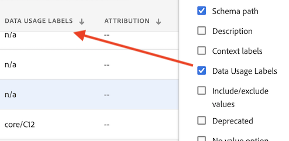

# Rótulos e políticas

Ao criar um conjunto de dados na Experience Platform, é possível criar [rótulos de uso de dados](https://experienceleague.adobe.com/docs/experience-platform/data-governance/labels/reference.html?lang=pt-BR) para alguns ou todos os elementos no conjunto de dados. É possível visualizar esses rótulos e políticas no Customer Journey Analytics.

Os rótulos seguintes são de especial interesse para o Customer Journey Analytics:

* O rótulo `C8` - **[!UICONTROL Sem medição]**. Esse rótulo significa que os dados não podem ser usados para análise nos sites ou aplicativos da sua organização.

* O rótulo `C12` - **[!UICONTROL Nenhuma exportação de dados gerais]**. Os campos de esquema rotulados dessa maneira não podem ser exportados nem baixados do Customer Journey Analytics (por meio de relatórios, exportação, API etc.)

>[!NOTE]
>
>Os rótulos de uso de dados não são propagados automaticamente para os conjuntos de dados compilados. No entanto, eles podem ser adicionados manualmente.

A rotulação por si só não significa que esses rótulos de uso de dados serão aplicados. É para isso que as políticas são usadas. Você cria suas políticas usando a [Interface da Experience Platform](https://experienceleague.adobe.com/docs/experience-platform/data-governance/policies/user-guide.html?lang=pt-BR) ou por meio da [API de serviço de política](https://experienceleague.adobe.com/docs/experience-platform/data-governance/api/overview.html?lang=pt-BR) na Experience Platform.

Duas políticas definidas pela Adobe são exibidas no Customer Journey Analytics e afetam os relatórios e o download/compartilhamento:

* Política **[!UICONTROL Forçar análise]**
* Política **[!UICONTROL Forçar download]**

## Exibir rótulos de dados em visualizações de dados do Customer Journey Analytics

Os rótulos de dados criados na Experience Platform são exibidos em três locais na interface das visualizações de dados:

| Localização | Descrição |
| --- | --- |
| Botão Informação em um campo do esquema | Clicar nesse botão indica quais [!UICONTROL rótulos de uso de dados] aplicam-se atualmente a um campo:
 |
| Painel direito em [Configurações do componente](/help/data-views/component-settings/overview.md) | Todos os [!UICONTROL rótulos de uso de dados] estão listados aqui:
 |
| Adicionar rótulos de dados como uma coluna | Você pode adicionar [!UICONTROL rótulos de uso de dados] como uma coluna nas colunas [!UICONTROL Componentes incluídos] nas visualizações de dados. Basta clicar no ícone do seletor de colunas e selecionar **[!UICONTROL Rótulos de uso de dados]**:
 |

{style="table-layout:auto"}

## Filtrar por rótulos de governança de dados nas visualizações de dados

No editor de visualizações de dados, clique no ícone de [!UICONTROL filtro] no painel à esquerda e filtre os componentes das visualizações de dados por **[!UICONTROL Governança de dados]** e tipo de **[!UICONTROL Rótulo]**:

Clique em **[!UICONTROL Aplicar]** para ver quais componentes têm rótulos anexados a eles.

## Filtrar as políticas de governança de dados nas visualizações de dados

É possível verificar se há uma política ativada que bloqueia o uso de determinados elementos de visualização de dados do Customer Journey Analytics para análise ou exportação.

Novamente, clique no ícone de [!UICONTROL filtro] no painel à esquerda em **[!UICONTROL Governança de dados]** e clique em **[!UICONTROL Políticas]**:

Clique em **[!UICONTROL Aplicar]** para ver quais políticas estão ativadas.

## Como as políticas ativadas afetam as visualizações de dados

Se as políticas **[!UICONTROL Forçar análise]** ou **[!UICONTROL Forçar download]** estiverem ativadas, os componentes do esquema que têm determinados rótulos de dados (como C8 ou C12) associados a eles não poderão ser adicionados às visualizações de dados.

Esses componentes estão esmaecidos na lista [!UICONTROL Campos de esquema] no painel à esquerda:

Também não é possível salvar uma visualização de dados que tenha campos bloqueados.

>[!MORELIKETHIS]
>[Baixar dados sigilosos](/help/analysis-workspace/export/download-send.md)

>[!MORELIKETHIS]
>[O que são os rótulos restritos no Report Builder?](https://experienceleague.adobe.com/docs/analytics-platform/using/cja-reportbuilder/restricted-labels.html?lang=pt-BR)

