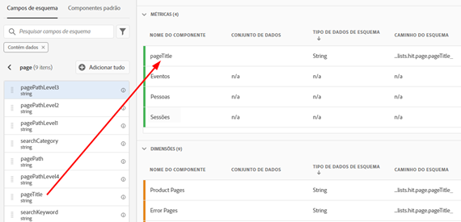
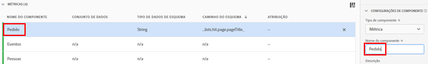
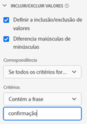
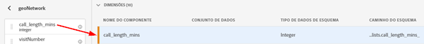
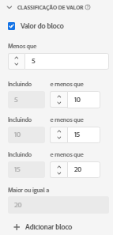

# Casos de uso de visualizações de dados

>[!IMPORTANT]
>
>Essa funcionalidade estará disponível em geral em 22 de abril de 2021.

Esses casos de uso que mostram a flexibilidade e o poder das visualizações de dados no Customer Journey Analytics.

## Criar uma métrica de Pedidos a partir de um campo de esquema pageTitle (cadeia de caracteres)

Por exemplo, ao criar uma visualização de dados, você pode criar uma métrica [!UICONTROL Orders] de um campo de esquema [!UICONTROL pageTitle] que seja uma cadeia de caracteres. Estas são as etapas:

1. Na guia Componentes, arraste o [!UICONTROL pageTitle] até a seção [!UICONTROL Métricas] em [!UICONTROL Componentes incluídos].
   
1. Agora, destaque a métrica que acabou de arrastar e renomeie-a em [!UICONTROL Configurações do componente] à direita:
   
1. Abra a caixa de diálogo [!UICONTROL Incluir/Excluir valores] à direita e especifique o seguinte:
   

   A frase &quot;confirmação&quot; indica que é um pedido. Depois de revisar todos os títulos de página onde esses critérios são atendidos, um &quot;1&quot; será contado para cada instância. O resultado é uma nova métrica (não uma métrica calculada). Funciona com Attribution IQ, filtros e em qualquer lugar que você pode usar as métricas padrão.
1. Você pode especificar ainda mais um modelo de atribuição para essa métrica, como [!UICONTROL Último contato], com uma [!UICONTROL Janela de pesquisa] de [!UICONTROL Sessão].
Você também pode criar outra métrica [!UICONTROL Orders] do mesmo campo e especificar um modelo de atribuição diferente para ele, como [!UICONTROL Primeiro contato], e uma [!UICONTROL janela de lookback] diferente, como [!UICONTROL 30 dias].

## Usar números inteiros como dimensões

Anteriormente, os números inteiros eram automaticamente tratados como métricas no CJA. Agora, os números (incluindo eventos personalizados do Adobe Analytics) podem ser tratados como dimensões. Exemplo:

1. Arraste o inteiro [!UICONTROL call_length_min] até a seção [!UICONTROL Dimension] em [!UICONTROL Componentes incluídos]:

   

1. Agora você pode adicionar [!UICONTROL Value Bucketing] para apresentar essa dimensão de forma segmentada nos relatórios. (Sem o agrupamento, cada instância dessa dimensão seria exibida como um item de linha no relatório do Workspace.)

   

Para obter mais informações sobre outras configurações de visualizações de dados, consulte [Criar visualizações de dados](/help/data-views/create-dataview2.md).
Para obter uma visão geral conceitual das visualizações de dados, consulte [Visão geral das visualizações de dados](/help/data-views/data-views.md).