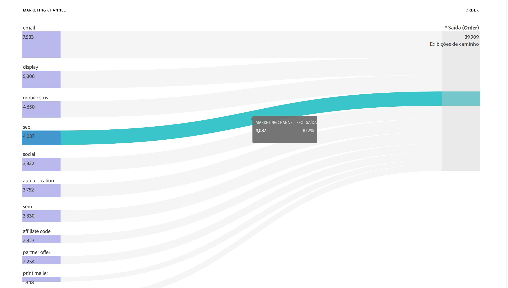
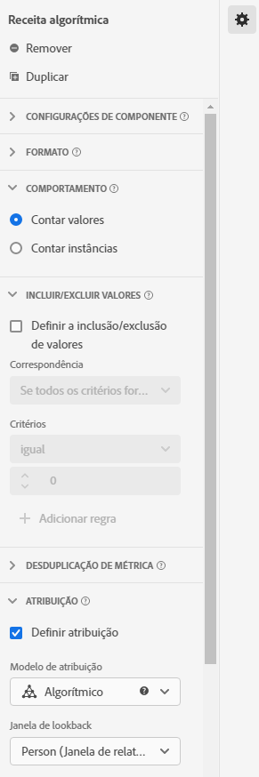

# Casos de uso de visualizações de dados

Esses casos de uso mostram a flexibilidade e o potencial das visualizações de dados no Customer Journey Analytics.

## 1. Criar uma métrica com base em um campo de esquema de cadeia de caracteres {#string}

Por exemplo, ao criar uma visualização de dados, você pode criar uma métrica [!UICONTROL Pedidos] de um campo de esquema [!UICONTROL pageTitle] que seja uma sequência. Estas são as etapas:

1. Na guia Componentes, arraste [!UICONTROL pageTitle] até a seção [!UICONTROL Métricas] em [!UICONTROL Componentes incluídos].
   
1. Agora, destaque a métrica que você acabou de arrastar e renomeie-a em [!UICONTROL Configurações do componente] à direita:
   
1. Abra a caixa de diálogo [!UICONTROL Incluir/Excluir valores] à direita e especifique o seguinte:
   

   A frase &quot;confirmação&quot; indica que é um pedido. Depois de examinar todos os títulos de página em que esses critérios são atendidos, &quot;1&quot; será contado para cada instância. O resultado é uma nova métrica (não uma métrica calculada). Uma métrica que tenha valores de inclusão/exclusão pode ser usada em qualquer outra métrica. Funciona com Attribution IQ, filtros e em qualquer lugar que você puder usar as métricas padrão.
1. Você pode especificar ainda mais um modelo de atribuição para essa métrica, como [!UICONTROL Último contato], com uma [!UICONTROL Janela de pesquisa] de [!UICONTROL Sessão].
Você também pode criar outra métrica [!UICONTROL Pedidos] do mesmo campo e especificar um modelo de atribuição diferente para ele, como [!UICONTROL Primeiro contato], e uma [!UICONTROL janela de pesquisa] diferente, como [!UICONTROL 30 dias].

Outro exemplo seria usar a ID de visitante, uma dimensão, como uma métrica para determinar quantas IDs de visitante sua empresa tem.

## 2. Usar números inteiros como dimensões {#integers}

Anteriormente, os números inteiros eram automaticamente tratados como métricas no CJA. Agora, os números (incluindo eventos personalizados do Adobe Analytics) podem ser tratados como dimensões. Exemplo:

1. Arraste o inteiro [!UICONTROL call_length_min] até a seção [!UICONTROL Dimensões] em [!UICONTROL Componentes incluídos]:

   

1. Agora você pode adicionar [!UICONTROL Classificação de valores] para apresentar essa dimensão de forma segmentada nos relatórios. (Sem a classificação, cada instância dessa dimensão seria exibida como um item da linha nos relatórios do Espaço de trabalho.)

   

## 3. Usar dimensões numéricas como &quot;métricas&quot; em diagramas de fluxo {#numeric}

Você pode usar uma dimensão numérica para inserir &quot;métricas&quot; na visualização [!UICONTROL Fluxo].

1. Na guia Visualizações de dados [Componentes](https://experienceleague.adobe.com/docs/analytics-platform/using/cja-dataviews/create-dataview.html?lang=pt-BR#configure-component-settings), arraste o campo de esquema [!UICONTROL Canais de marketing] para a área [!UICONTROL Métricas] em [!UICONTROL Componentes incluídos].
2. No relatório do Espaço de trabalho, esse fluxo mostra [!UICONTROL Canais de marketing] fluindo para [!UICONTROL Pedidos]:

## 4. Fazer filtragem de subeventos {#sub-event}

Esse recurso é especificamente aplicável a campos com base em matriz. A funcionalidade de inclusão/exclusão permite que você filtre no nível do subevento, enquanto os filtros (segmentos) criados no construtor de filtros fornecem apenas a filtragem no nível do evento. Assim, você pode fazer a filtragem de subeventos usando incluir/excluir em Visualizações de dados e, em seguida, fazer referência a essa nova métrica/dimensão em um filtro no nível do evento.

Por exemplo, use a funcionalidade de inclusão/exclusão nas Visualizações de dados para focalizar os produtos que geraram vendas de mais de 50 dólares. Portanto, se você tiver um pedido que inclua uma compra de produto de 50 dólares e uma compra de produto de 25 dólares, removeremos apenas a compra de produto de 25 dólares, não o pedido inteiro.

1. Na guia Visualizações de dados [Componentes](https://experienceleague.adobe.com/docs/analytics-platform/using/cja-dataviews/create-dataview.html#configure-component-settings), arraste o campo de esquema [!UICONTROL Receita] para a área [!UICONTROL Métricas] em [!UICONTROL Componentes incluídos].
1. Selecione a métrica e configure o seguinte no lado direito:
a. Em [!UICONTROL Formato], selecione [!UICONTROL Moeda].
b. Em [!UICONTROL Moeda], selecione USD.
c. Em [!UICONTROL Incluir/Excluir valores], marque a caixa de seleção ao lado de [!UICONTROL Definir valores de inclusão/exclusão].
d. Em [!UICONTROL Corresponder], selecione [!UICONTROL Se todos os critérios forem atendidos].
e. Em [!UICONTROL Critérios], selecione [!UICONTROL é maior ou igual a].
f. Especificar &quot;50&quot; como o valor.

Essas novas configurações permitem que você visualize somente a receita de alto valor e filtre qualquer valor abaixo de US$ 50.

## 5. Utilizar a configuração [!UICONTROL Nenhuma opção de valor] {#no-value}

Sua empresa pode ter passado tempo treinando os usuários para esperar &quot;Não especificado&quot; nos relatórios. O padrão em Visualizações de dados é &quot;Sem valor&quot;. Agora é possível [renomear &quot;Sem valor&quot; como &quot;Não especificado&quot;](https://experienceleague.adobe.com/docs/analytics-platform/using/cja-dataviews/create-dataview.html?lang=pt-BR#configure-no-value-options-settings) na interface de Visualizações de dados.

Outro exemplo seria uma dimensão para um registro de programa de associação. Nesse caso, você pode renomear &quot;Sem valor&quot; como &quot;Sem registro de programa de associação&quot;.

## 6. Criar várias métricas com diferentes configurações de [!UICONTROL Atribuição] {#attribution}

Usando o recurso [!UICONTROL Duplicar] no canto superior direito, crie várias métricas de Receita com diferentes configurações de atribuição, como [!UICONTROL Primeiro contato], [!UICONTROL Último contato] e [!UICONTROL Algorítmico].

Não se esqueça de renomear cada métrica para refletir as diferenças, como &quot;Receita algorítmica&quot;:

Para obter mais informações sobre outras configurações de visualizações de dados, consulte [Criar visualizações de dados](/help/data-views/create-dataview.md).
Para obter uma visão geral conceitual das visualizações de dados, consulte [Visão geral das visualizações de dados](/help/data-views/data-views.md).

## Relatório de sessão nova vs. repetição {#new-repeat}

Você pode determinar se uma sessão é realmente a primeira sessão de todos os tempos para um usuário, com base na janela de relatório que você definiu para essa visualização de dados e uma janela de retrospectiva de 13 meses. Esses relatórios permitem determinar, por exemplo:

* Qual a porcentagem de seus pedidos vem de sessões novas e repetidas?

* Para um determinado canal de marketing ou uma campanha específica, você está direcionando usuários pela primeira vez ou usuários de retorno? Como essas escolhas influenciaram as taxas de conversão?

Três componentes facilitam esse relatório:

* 1 dimensão: Sessões novas versus recorrentes

* 2 métricas: Novas sessões, sessões de retorno

Para acessar esses componentes:

1. Acesse o editor de visualização de dados.
1. Clique no botão **[!UICONTROL Componentes]** > **[!UICONTROL Componentes padrão opcionais]** no painel esquerdo.
1. Arraste-os para a visualização de dados.

95% a 99% do tempo, novas sessões serão relatadas com precisão. As únicas exceções são:

* Quando uma sessão ocorreu antes da janela de lookback de 13 meses. Esta sessão será ignorada.

* Quando uma sessão passa pela janela de retrospectiva e pela janela de relatórios. Digamos que você execute um relatório de 1 de junho a 15 de junho de 2022. A janela de lookback abrangeria 1º de maio de 2021 a 31 de maio de 2022. Se uma sessão tiver início em 30 de maio de 2022 e terminar em 1 de junho de 2022, pois a sessão está incluída na janela de lookback, todas as sessões na janela de relatório serão contadas como sessões recorrentes.

