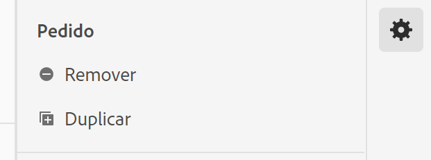

# Casos de uso de visualizações de dados

Esses casos de uso mostram a flexibilidade e o potencial das visualizações de dados no Customer Journey Analytics.

## 1. Crie uma métrica de Pedidos a partir de um campo de esquema pageTitle (cadeia de caracteres)

Por exemplo, ao criar uma visualização de dados, você pode criar uma métrica [!UICONTROL Pedidos] de um campo de esquema [!UICONTROL pageTitle] que seja uma sequência. Estas são as etapas:

1. Na guia Componentes, arraste [!UICONTROL pageTitle] até a seção [!UICONTROL Métricas] em [!UICONTROL Componentes incluídos].
   
1. Agora, destaque a métrica que você acabou de arrastar e renomeie-a em [!UICONTROL Configurações do componente] à direita:
   
1. Abra a caixa de diálogo [!UICONTROL Incluir/Excluir valores] à direita e especifique o seguinte:
   

   A frase &quot;confirmação&quot; indica que é um pedido. Depois de examinar todos os títulos de página em que esses critérios são atendidos, &quot;1&quot; será contado para cada instância. O resultado é uma nova métrica (não uma métrica calculada). Uma métrica que tenha valores de inclusão/exclusão pode ser usada em qualquer outra métrica. Funciona com Attribution IQ, filtros e em qualquer lugar que você puder usar as métricas padrão.
1. Você pode especificar ainda mais um modelo de atribuição para essa métrica, como [!UICONTROL Último contato], com uma [!UICONTROL Janela de pesquisa] de [!UICONTROL Sessão].
Você também pode criar outra métrica [!UICONTROL Pedidos] do mesmo campo e especificar um modelo de atribuição diferente para ele, como [!UICONTROL Primeiro contato], e uma [!UICONTROL janela de pesquisa] diferente, como [!UICONTROL 30 dias].

## 2. Usar números inteiros como dimensões

Anteriormente, os números inteiros eram automaticamente tratados como métricas no CJA. Agora, os números (incluindo eventos personalizados do Adobe Analytics) podem ser tratados como dimensões. Exemplo:

1. Arraste o inteiro [!UICONTROL call_length_min] até a seção [!UICONTROL Dimensões] em [!UICONTROL Componentes incluídos]:

   

1. Agora você pode adicionar [!UICONTROL Classificação de valores] para apresentar essa dimensão de forma segmentada nos relatórios. (Sem a classificação, cada instância dessa dimensão seria exibida como um item da linha nos relatórios do Workspace.)

   

## 3. Use dimensões numéricas como &quot;métricas&quot; em diagramas de fluxo

Você pode usar uma dimensão numérica para inserir &quot;métricas&quot; na visualização [!UICONTROL  Fluxo].

1. Na guia Visualizações de dados [Componentes](https://experienceleague.adobe.com/docs/analytics-platform/using/cja-dataviews/create-dataview.html?lang=en#configure-component-settings) , arraste o campo de esquema [!UICONTROL Canais de marketing] para a área [!UICONTROL Métricas] em [!UICONTROL Componentes incluídos].
2. No relatório do Workspace, esse fluxo mostra [!UICONTROL Canais de marketing] fluindo para [!UICONTROL Pedidos]:

## 4. Fazer filtragem de subeventos

Você pode filtrar eventos para exibir somente o que deseja ver. Por exemplo, use a funcionalidade de inclusão/exclusão nas Exibições de dados para se concentrar apenas nos produtos que geraram vendas de mais de 50 dólares. Portanto, se você tiver um pedido que inclua uma compra de produto de 50 dólares e uma compra de produto de 25 dólares, removeremos apenas a compra de produto de 25 dólares, não o pedido inteiro.

1. Na guia Visualizações de dados [Componentes](https://experienceleague.adobe.com/docs/analytics-platform/using/cja-dataviews/create-dataview.html?lang=en#configure-component-settings), arraste o campo de esquema [!UICONTROL Receita] para a área [!UICONTROL Métricas] em [!UICONTROL Componentes incluídos].
1. Selecione a métrica e configure o seguinte no lado direito:
a. Em [!UICONTROL Format], selecione [!UICONTROL Currency].
b. Em [!UICONTROL Currency], selecione USD.
c. Em [!UICONTROL Incluir/Excluir valores], marque a caixa de seleção ao lado de [!UICONTROL Definir valores de inclusão/exclusão].
d. Em [!UICONTROL Corresponder], selecione [!UICONTROL Se todos os critérios forem atendidos].
e. Em [!UICONTROL Critérios], selecione [!UICONTROL é maior ou igual a].
f. Especifique &quot;50&quot; como o valor.

Essas novas configurações permitem que você visualize somente a receita de alto valor e filtre qualquer valor abaixo de US$ 50.

## 5. Utilize a configuração [!UICONTROL Nenhuma opção de valor]

Sua empresa pode ter passado tempo treinando seus usuários para esperar &quot;Não especificado&quot; nos relatórios. O padrão em Visualizações de dados é &quot;Sem valor&quot;. Agora é possível [renomear &quot;Sem valor&quot; para &quot;Não especificado&quot;](https://experienceleague.adobe.com/docs/analytics-platform/using/cja-dataviews/create-dataview.html?lang=en#configure-no-value-options-settings) na interface do usuário de Exibições de dados.

## 6. Use o recurso [!UICONTROL Duplicar]

Duplicar uma métrica e depois modificar configurações específicas é uma maneira fácil de criar várias métricas ou dimensões a partir de um único campo de esquema.

Basta selecionar a configuração Duplicar abaixo do nome da métrica ou das dimensões na parte superior direita:

## Criar várias métricas com diferentes configurações de Atribuição

Usando o recurso [!UICONTROL Duplicar] mencionado acima, crie várias métricas de Receita com diferentes configurações de atribuição, como [!UICONTROL Primeiro contato], [!UICONTROL Último contato] e [!UICONTROL Algorítmico].

Não se esqueça de renomear cada métrica para refletir as diferenças, como &quot;Receita algorítmica&quot;:

Para obter mais informações sobre outras configurações de visualizações de dados, consulte [Criar visualizações de dados](/help/data-views/create-dataview.md).
Para obter uma visão geral conceitual das visualizações de dados, consulte [Visão geral das visualizações de dados](/help/data-views/data-views.md).