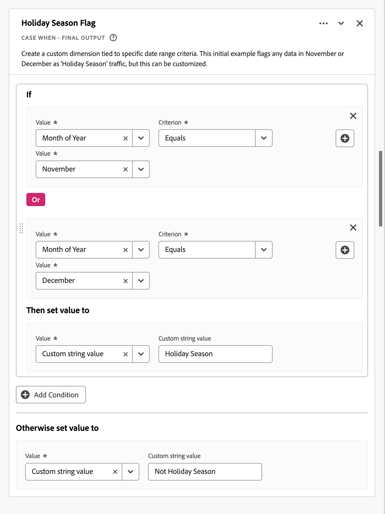
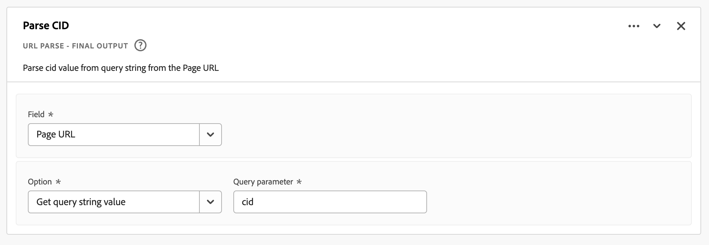

# Campos derivados {#derived-fields}

<!-- markdownlint-disable MD034 -->

>[!CONTEXTUALHELP]
>id="cja_dataview_derivedfields"
>title="Campos derivados"
>abstract="Um campo derivado permite definir manipulações de dados a qualquer momento por meio de um criador de regras personalizável. Em seguida, você pode usar esse campo derivado como um componente (métrica ou dimensão) no Workspace ou até mesmo definir como um componente na visualização de dados."

<!-- markdownlint-enable MD034 -->

Os campos derivados são um aspecto importante da funcionalidade de relatórios em tempo real no Adobe Customer Journey Analytics. Um campo derivado permite definir manipulações de dados (muitas vezes complexas) a qualquer momento, por meio de um criador de regras personalizável. Você pode usar esse campo derivado como um componente (métrica ou dimensão) no [Workspace](../../analysis-workspace/home.md) ou ainda definir o campo derivado como um componente na [Visualização de dados](../data-views.md).

Os campos derivados podem economizar uma quantidade significativa de tempo e esforço, em comparação à transformação ou manipulação de dados em outros locais fora do Customer Journey Analytics. Como o [Preparo de Dados](https://experienceleague.adobe.com/docs/experience-platform/data-prep/home.html?lang=pt-BR), o [Data Distiller](https://experienceleague.adobe.com/docs/experience-platform/query/data-distiller/overview.html) ou em seus próprios processos ETL (Extract Transform Load) / ELT (Extract Load Transform).

Os campos derivados são definidos em [Visualizações de dados](../data-views.md), são baseados em um conjunto de funções definidas como regras e aplicados a campos padrão e/ou de esquema disponíveis.

Exemplos de casos de uso:

- Defina um campo Nome de página derivado que corrija valores de nome de página coletados inadequados para corrigir valores de nome de página.

- Defina um campo Canal de marketing derivado que determine o canal de marketing adequado com base em uma ou mais condições (por exemplo, parâmetro de URL, URL da página, nome da página).

## Interface de campo derivada {#interface}

Ao criar ou editar um campo derivado, você usa a interface de campo derivado.

|  | Nome | Descrição |
|---------|----------|--------|
| 1 | **Seletor** | Use a área do seletor para selecionar e arrastar e soltar sua função, modelo de função, campo de esquema ou campo padrão no construtor de regras.  Use o menu suspenso para selecionar entre:   [!UICONTROL Funções] - listas disponíveis [Funções](#function-reference),   [!UICONTROL Modelos de função] - listas disponíveis [Modelos de função](#function-templates),   [!UICONTROL Campos de esquema] - lista campos disponíveis de categorias de conjunto de dados (evento, perfil, pesquisa) e campos derivados definidos anteriormente, e   [!UICONTROL 9}Campos padrão] - campos padrão disponíveis (como ID do conjunto de dados da plataforma). Somente os campos padrão de sequência e numérico são exibidos no seletor. Se a função suportar outros tipos de dados, os campos padrão com esses outros tipos de dados poderão ser selecionados para valores ou campos na interface de regras. Você pode pesquisar por função, modelos de função, esquema e campos padrão usando a caixa de pesquisa .  Você pode filtrar a lista de objetos selecionados selecionando  Filtrar e especificar filtros na caixa de diálogo [!UICONTROL Filtrar campos por]. Você pode remover filtros facilmente usando o  para cada filtro. |
| 2 | **Construtor de regras** | Você cria o campo derivado sequencialmente usando uma ou mais regras. Uma regra é uma implementação específica de uma função e, portanto, sempre está associada a apenas uma função. Crie uma regra arrastando e soltando uma função no construtor de regras. O tipo de função determina a interface da regra. Consulte a [Interface de regra](#rule-interface) para obter mais informações.  Você pode inserir uma função no início, fim ou entre regras já disponíveis no construtor de regras. A última regra no construtor de regras determina a saída final do campo derivado. |
| 3 | **[!UICONTROL ** Configurações do campo **]** | É possível nomear e descrever o campo derivado e inspecionar seu tipo de campo. |
| 4 | **[!UICONTROL ** Saída Final **]** | Essa área mostra uma visualização atualizada dinamicamente dos valores de saída, com base nos dados dos últimos 30 dias e nas alterações feitas no campo derivado no construtor de regras. |

{style="table-layout:auto"}

## Assistente de modelo de campo {#wizard}

Quando você acessa a interface de campo derivada pela primeira vez, o assistente [!UICONTROL Iniciar com um modelo de campo] é exibido.

1. Selecione o modelo que descreva com mais precisão o tipo de campo que você está tentando criar.
2. Selecione o botão **[!UICONTROL ** Selecionar **]** para continuar.

Sua caixa de diálogo de campo derivado é preenchida com regras (e funções) necessárias ou úteis para o tipo de campo selecionado. Consulte [Modelos de função](#function-templates) para obter mais informações sobre os modelos disponíveis.

## Interface de regras {#rules}

Ao definir uma regra no construtor de regras, use a interface de regras.

|  | Nome | Descrição |
|---------|----------|--------|
| A | **Nome da Regra** | Por padrão, o nome da regra é **Regra X** (X se refere a um número de sequência). Para editar o nome de uma regra, selecione seu nome e digite o novo nome, por exemplo `Query Parameter`. |
| B | **Nome da Função** | O nome de função selecionado para a regra, por exemplo [!UICONTROL URL PARSE]. Quando a função é a última na sequência de funções e determina os valores de saída finais, o nome da função é seguido por [!UICONTROL - SAÍDA FINAL], por exemplo [!UICONTROL URL PARSE - SAÍDA FINAL].  Para mostrar um pop-up com mais informações sobre a função, selecione . |
| C | **Descrição da regra** | Opcionalmente, é possível adicionar uma descrição a uma regra. Selecione  e **[!UICONTROL ** Adicionar Descrição **]** para adicionar uma descrição ou **[!UICONTROL ** Editar Descrição **]** para editar uma descrição existente. Use o editor para inserir uma descrição. Você pode usar a barra de ferramentas para formatar o texto (usando o seletor de estilo, negrito, itálico, sublinhado, direita, esquerda, centralizado, cor, lista de números, lista de marcadores) e adicionar links a informações externas.  Para concluir a edição da descrição, clique fora do editor. |
| D | **Área de função** | Define a lógica da função. A interface depende do tipo de função. A lista suspensa para [!UICONTROL Campo] ou [!UICONTROL Valor] mostra todas as categorias de campos (regras, campos padrão, campos) disponíveis, com base no tipo de entrada que a função espera. Como alternativa, você pode arrastar e soltar um campo do seletor de campos Esquema e Padrão em para um Campo ou Valor. Quando esse campo arrastado se origina de um conjunto de dados de Pesquisa, uma função de Pesquisa é inserida automaticamente antes da função definida.  Consulte [Referência de função](#function-reference) sobre informações detalhadas para cada uma das funções suportadas. |

{style="table-layout:auto"}

## Criar um campo derivado {#create}

1. Selecione uma visualização de dados existente ou crie uma visualização de dados. Consulte [Visualizações de dados](../data-views.md) para obter mais informações.

2. Selecione a guia **[!UICONTROL ** Componentes **]** da visualização de dados.

3. Selecione **[!UICONTROL ** Criar campo derivado **]** no painel esquerdo.

4. Para definir seu campo derivado, use a interface [!UICONTROL Criar campo derivado]. Consulte [Interface de campo derivada](#derived-field-interface).

   Para salvar o novo campo derivado, selecione **[!UICONTROL ** Salvar **]**.

5. O novo campo derivado é adicionado ao contêiner [!UICONTROL Campos derivados >], como parte dos **[!UICONTROL ** Campos de esquema **]** no painel esquerdo da visualização de dados.

## Editar um campo derivado {#edit}

1. Selecione uma visualização de dados existente. Consulte [Visualizações de dados](../data-views.md) para obter mais informações.

2. Selecione a guia **[!UICONTROL ** Componentes **]** da visualização de dados.

3. Selecione a guia **[!UICONTROL ** Campos de esquema **]** no painel [!UICONTROL Conexão] à esquerda.

4. Selecione **[!UICONTROL ** Campos derivados >**]** contêiner.

5. Passe o mouse sobre o campo derivado que você deseja editar e selecione .

6. Para editar o campo derivado, use a interface [!UICONTROL Editar campo derivado]. Consulte [Interface de campo derivada](#derived-field-interface).

   - Selecione **[!UICONTROL ** Salvar **]** para salvar o campo derivado atualizado.

   - Selecione **[!UICONTROL ** Cancelar **]** para cancelar todas as alterações feitas no campo derivado.

   - Selecione **[!UICONTROL ** Salvar como **]** para salvar o campo derivado como um novo campo derivado. O novo campo derivado tem o mesmo nome que o campo derivado editado original com `(copy)` adicionado a ele.

Como alternativa, se você tiver usado um campo derivado como um componente para dimensões ou métricas na visualização de dados:

1. Selecione o componente. Observe que o componente pode ter um nome diferente do seu campo derivado.

1. No painel Componente, selecione o  ao lado do campo derivado, abaixo do nome do campo Esquema.

1. Para editar o campo derivado, use a interface [!UICONTROL Editar campo derivado]. Consulte [Interface de campo derivada](#derived-field-interface).

   - Selecione **[!UICONTROL ** Salvar **]** para salvar o campo derivado atualizado.

   - Selecione **[!UICONTROL ** Cancelar **]** para cancelar todas as alterações feitas no campo derivado.

   - Selecione **[!UICONTROL ** Salvar como **]** para salvar o campo derivado como um novo campo derivado. O novo campo derivado tem o mesmo nome que o campo derivado editado original com `(copy)` adicionado a ele.

## Excluir um campo derivado {#delete}

1. Selecione uma visualização de dados existente. Consulte [Visualizações de dados](../data-views.md) para obter mais informações.

2. Selecione a guia **[!UICONTROL ** Componentes **]** da visualização de dados.

3. Selecione a guia **[!UICONTROL ** Campos de esquema **]** no painel [!UICONTROL Conexão].

4. Selecione **[!UICONTROL ** Campos derivados >**]** contêiner.

5. Passe o mouse sobre o campo derivado que você deseja excluir e selecione .

6. Na interface [!UICONTROL Editar campo derivado], selecione **[!UICONTROL Excluir]**.

   Uma caixa de diálogo [!UICONTROL Excluir componente] solicita que você confirme a exclusão. Considere todas as referências externas que possam existir ao campo derivado fora da visualização de dados.

   - Selecione **[!UICONTROL ** Continuar **]** para excluir o campo derivado.

Como alternativa, se você tiver usado um campo derivado como um componente para dimensões ou métricas na visualização de dados:

1. Selecione o componente. Observe que o componente pode ter um nome diferente do seu campo derivado.

1. No painel Componente, selecione o  ao lado do campo derivado, abaixo do nome do campo Esquema.

1. Na interface [!UICONTROL Editar campo derivado], selecione **[!UICONTROL Excluir]**.

   Uma caixa de diálogo [!UICONTROL Excluir componente] solicita que você confirme a exclusão. Considere todas as referências externas que possam existir ao campo derivado fora da visualização de dados.

   - Selecione **[!UICONTROL ** Continuar **]** para excluir o campo derivado.

>[!NOTE]
>
>Os campos derivados são gerenciados em um nível de Conexão no Customer Journey Analytics. Qualquer alteração feita em um campo derivado em qualquer uma das visualizações de dados associadas a essa conexão se aplica a todas essas visualizações de dados associadas.

## Modelos de função {#templates}

Para criar rapidamente um campo derivado para casos de uso específicos, os modelos de função estão disponíveis. Esses modelos de função podem ser acessados da área do seletor na interface de campo derivada ou são apresentados no primeiro uso no assistente [!UICONTROL Iniciar com um modelo de campo].

### Canais de marketing {#mchannel}

Este modelo de função usa uma coleção de regras para criar canais de marketing.

+++ Detalhes

Para usar o template, você deve especificar os parâmetros corretos para cada função listada como parte das regras no template. Consulte [Referência de função](#function-reference) para obter mais informações.

+++

### Rejeições {#bounces}

Este modelo de função usa um conjunto de regras para identificar rejeições de site.

+++ Detalhes

Para usar o template, você deve especificar os parâmetros corretos para cada função listada como parte das regras no template. Consulte [Referência de função](#function-reference) para obter mais informações.

+++

### Combinação de várias dimensões {#multi-dim}

Este modelo de função combina dois valores em um.

+++ Detalhes

Para usar o template, você deve especificar os parâmetros corretos para cada função listada como parte das regras no template. Consulte [Referência de função](#function-reference) para obter mais informações.

+++

### Nome amigável do conjunto de dados {#friendlyname}

Esse modelo de função fornece um nome de conjunto de dados legível.

+++ Detalhes

Para usar o template, você deve especificar os parâmetros corretos para cada função listada como parte das regras no template. Consulte [Referência de função](#function-reference) para obter mais informações.

+++

### Nome da página do URL {#pagename}

Este modelo de função cria um nome de página simples.

+++ Detalhes

Para usar o template, você deve especificar os parâmetros corretos para cada função listada como parte das regras no template. Consulte [Referência de função](#function-reference) para obter mais informações.

+++

### Temporada de feriados {#holiday}

Esse modelo de função classifica os principais momentos do ano.

+++ Detalhes

Para usar o template, você deve especificar os parâmetros corretos para cada função listada como parte das regras no template. Consulte [Referência de função](#function-reference) para obter mais informações.

+++

### Metas mensais {#goals}

Esse modelo de função define metas mensais personalizadas.

+++ Detalhes

Para usar o template, você deve especificar os parâmetros corretos para cada função listada como parte das regras no template. Consulte [Referência de função](#function-reference) para obter mais informações.

+++

### Obter todos os valores na lista delimitada {#allvalues}

Este modelo de função converte uma lista limitada em uma matriz.

+++ Detalhes

Para usar o template, você deve especificar os parâmetros corretos para cada função listada como parte das regras no template. Consulte [Referência de função](#function-reference) para obter mais informações.

+++

### Obter o primeiro valor na lista delimitada {#firstvalue}

Este modelo de função obtém o primeiro valor em uma lista delimitada.

+++ Detalhes

Para usar o template, você deve especificar os parâmetros corretos para cada função listada como parte das regras no template. Consulte [Referência de função](#function-reference) para obter mais informações.

+++

### Obter o último valor na lista delimitada {#lastvalue}

Este modelo de função obtém o último valor em uma lista delimitada.

+++ Detalhes

Para usar o template, você deve especificar os parâmetros corretos para cada função listada como parte das regras no template. Consulte [Referência de função](#function-reference) para obter mais informações.

+++

### Nome do Domínio {#domain}

Este modelo de função extrai o nome de domínio usando uma expressão regular.

+++ Detalhes

Para usar o template, você deve especificar os parâmetros corretos para cada função listada como parte das regras no template. Consulte [Referência de função](#function-reference) para obter mais informações.

+++

### Obter parâmetro da string de consulta {#querystring}

Este modelo de função extrai valores da sequência de consulta.

+++ Detalhes

Para usar o template, você deve especificar os parâmetros corretos para cada função listada como parte das regras no template. Consulte [Referência de função](#function-reference) para obter mais informações.

+++

### Campo de transição {#transition}

Esse modelo de função faz a transição dos relatórios de um campo para outro.

+++ Detalhes

Para usar o template, você deve especificar os parâmetros corretos para cada função listada como parte das regras no template. Consulte [Referência de função](#function-reference) para obter mais informações.

+++

### Detecção de bots simples {#botdetection}

Este modelo de função implementa a identificação de bots de luz.

+++ Detalhes

Para usar o template, você deve especificar os parâmetros corretos para cada função listada como parte das regras no template. Consulte [Referência de função](#function-reference) para obter mais informações.

+++

### Link de saída {#exit}

Este modelo de função identifica o último link clicado em uma sessão.

+++ Detalhes

Para usar o template, você deve especificar os parâmetros corretos para cada função listada como parte das regras no template. Consulte [Referência de função](#function-reference) para obter mais informações.

+++

### Link de download {#download}

Esse modelo de função sinaliza links de download comuns.

+++ Detalhes

Para usar o template, você deve especificar os parâmetros corretos para cada função listada como parte das regras no template. Consulte [Referência de função](#function-reference) para obter mais informações.

+++

<!--

+++ Data clean up template

>[!WARNING]
>
>Could not find any information on this template.
+++

-->

## Referência de função {#functionref}

{{select-package}}

Para cada função compatível, encontre os detalhes abaixo sobre:

- especificações:
   - tipo de dados de entrada: tipo de dados compatível,
   - input: valores possíveis para entrada,
   - operadores incluídos: operadores compatíveis com esta função (se houver),
   - limitações: limitações aplicáveis a esta função específica,
   - saída.

- Casos de uso do, incluindo:
   - dados antes de definir o campo derivado,
   - como definir o campo derivado,
   - dados após definir o campo derivado.

- restrições (se aplicável).

<!-- CASE WHEN -->

### Caso Quando {#casewhen}

<!-- markdownlint-disable MD034 -->

>[!CONTEXTUALHELP]
>id="cja_dataview_derivedfields_casewhen"
>title="Caso Quando"
>abstract="Esta função oferece a capacidade de aplicar condicionais com base em critérios definidos a partir de um ou mais campos. Esses critérios são usados para definir os valores no novo campo derivado com base na sequência das condições."

<!-- markdownlint-enable MD034 -->

Aplica condicionais, com base em critérios definidos de um ou mais campos. Esses critérios são usados para definir os valores em um novo campo derivado, com base na sequência das condições.

+++ Detalhes

## Especificações {#casewhen-io}

| Tipo de dados de entrada | Entrada | Operadores incluídos | Limitações | Saída |
|---|---|---|---|---|
| <ul><li>Sequência de caracteres</li><li>Numérico</li><li>Data</li></ul> | <ul><li>Contêiner [!UICONTROL If], [!UICONTROL Else If]:
<ul><li>[!UICONTROL Valor]</li><ul><li>Regras</li><li>Campos padrão</li><li>Campos</li></ul><li>[!UICONTROL Critério] (consulte os operadores incluídos, com base no tipo de valor selecionado)</li></ul></li><li>[!UICONTROL Em seguida, defina o valor como], [!UICONTROL Caso contrário, defina o valor como]:
<ul><li>[!UICONTROL Valor]</li><ul><li>Regras</li><li>Campos padrão</li><li>Campos</li></ul></ul></li></ul> | 
Strings
<ul><li>Igual a</li><li>Igual a qualquer termo</li><li>Contém a frase</li><li>Contém qualquer termo</li><li>Contém todos os termos</li><li>Começa com</li><li>Começa com qualquer termo</li><li>Termina com</li><li>Termina com qualquer termo</li><li>Não é igual</li><li>Não é igual a nenhum termo</li><li>Não contém a frase</li><li>Não contém nenhum termo</li><li>Não contém todos os termos</li><li>Não começa com</li><li>Não começa com nenhum termo</li><li>Não termina com</li><li>Não termina com nenhum termo</li><li>Está definido</li><li>Não está definido</li></ul>
Numérico
<ul><li>Igual a</li><li>Não é igual</li><li>É maior que</li><li>É maior que ou igual a</li><li>É menor que</li><li>É menor que ou igual a</li><li>Está definido</li><li>Não está definido</li></ul>
Datas
<ul><li>Igual a</li><li>Não é igual</li><li>É posterior a</li><li>É posterior ou igual a</li><li>É anterior a</li><li>É anterior ou igual a</li><li>Está definido</li><li>Não está definido</li></ul> | <ul><li>5 funções por campo derivado</li><li>200 [operadores](#operators) por campo derivado. Um exemplo de um único operador é &#39;Domínio de referência contém google&#39;. </li></ul> | 
Novo campo derivado
 |

{style="table-layout:auto"}

## Caso de uso 1 {#casewhen-uc1}

Você deseja definir regras para identificar vários canais de marketing, aplicando a lógica em cascata para definir um campo de canal de marketing com o valor correto:

- Se o referenciador for de um mecanismo de pesquisa e a página tiver um valor de sequência de consulta em que `cid` contém `ps_`, o canal de marketing deverá ser identificado como uma [!DNL *Pesquisa paga*].
- Se o referenciador for de um mecanismo de pesquisa e a página não tiver a cadeia de caracteres de consulta `cid`, o canal de marketing deverá ser identificado como uma [!DNL *Pesquisa natural*].
- Se uma página tiver um valor de sequência de consulta em que `cid` contenha `em_`, o canal de marketing deverá ser identificado como um [!DNL *Email*].
- Se uma página tiver um valor de sequência de consulta em que `cid` contenha `ds_`, o canal de marketing deverá ser identificado como um [!DNL *Anúncio de exibição*].
- Se uma página tiver um valor de sequência de consulta em que `cid` contenha `so_`, o canal de marketing deverá ser identificado como um [!DNL *Social pago*].
- Se o referenciador for de um domínio de referência de [!DNL twitter.com], [!DNL facebook.com], [!DNL linkedin.com] ou [!DNL tiktok.com], o canal de marketing deverá ser identificado como um [!DNL *Social Natural*].
- Se nenhuma das regras acima for correspondida, o canal de marketing deverá ser identificado como [!DNL *Outro referenciador*].

Caso seu site receba os seguintes eventos de exemplo, contendo [!UICONTROL Referenciador] e [!UICONTROL URL da Página], esses eventos deverão ser identificados da seguinte maneira:

| [!DNL Event] | [!DNL Referrer] | [!DNL Page URL] | [!DNL Marketing Channel] |
|:--:|----|----|----|
| 1 | `https://facebook.com` | `https://site.com/home` | [!DNL Natural Social] |
| 2 | `https://abc.com` | `https://site.com/?cid=ds_12345678` | [!DNL Display] |
| 3 | | `https://site.com/?cid=em_12345678` | [!DNL Email] |
| 4 | `https://google.com` | `https://site.com/?cid=ps_abc098765` | [!DNL Paid Search] |
| 5 | `https://google.com` | `https://site.com/?cid=em_765544332` | [!DNL Email] |
| 6 | `https://google.com` |  | [!DNL Natural Search] |

{style="table-layout:auto"}

### Dados anteriores a {#casewhen-uc1-databefore}

| [!DNL Referrer] | [!DNL Page URL] |
|----|----|
| `https://facebook.com` | `https://site.com/home` |
| `https://abc.com` | `https://site.com/?cid=ds_12345678` |
|  | `https://site.com/?cid=em_12345678` |
| `https://google.com` | `https://site.com/?cid=ps_abc098765` |
| `https://google.com` | `https://site.com/?cid=em_765544332` |
| `https://google.com` | |

{style="table-layout:auto"}

### Campo derivado {#casewhen-uc1-derivedfield}

Você define um campo derivado de `Marketing Channel`. Use as funções [!UICONTROL CASE WHEN] para definir regras que criem valores para o com base em valores existentes para os campos `Page URL` e `Referring URL`.

Observe o uso da função [!UICONTROL URL PARSE] para definir regras para buscar os valores de `Page Url` e `Referring Url` antes da aplicação das regras [!UICONTROL CASE WHEN].

### Dados após {#casewhen-uc1-dataafter}

| [!DNL Marketing Channel] |
|----|
| [!DNL Natural Social] |
| [!DNL Display] |
| [!DNL Email] |
| [!DNL Paid Search] |
| [!DNL Email] |
| [!DNL Natural Search] |

{style="table-layout:auto"}

## Caso de uso 2 {#casewhen-uc2}

Você coletou várias variações diferentes de pesquisa na sua dimensão [!DNL Product Finding Methods]. Para entender o desempenho geral da pesquisa em relação ao navegador, você deve gastar muito tempo combinando os resultados manualmente.

Seu site coleta os seguintes valores para sua dimensão [!DNL Product Finding Methods]. No final, todos esses valores indicam uma pesquisa.

| Valor coletado | Valor real |
|---|---|
| [!DNL search p13n_no] | [!DNL search] |
| [!DNL search p13n_yes] | [!DNL search] |
| [!DNL search refine p13n_no] | [!DNL search] |
| [!DNL search refine p13n_yes] | [!DNL search] |
| [!DNL search redirect p13n_yes] | [!DNL search] |
| [!DNL search-redirect] | [!DNL search] |

{style="table-layout:auto"}

### Dados anteriores a {#casewhen-uc2-databefore}

| [!DNL Product Finding Methods] |
|----|
| [!DNL search p13_no] |
| [!DNL search p13_yes] |
| [!DNL browse] |
| [!DNL search refine p13_no] |
| [!DNL search refine p13_yes] |
| [!DNL browse] |
| [!DNL search redirect p13_yes] |
| [!DNL search-redirect] |
| [!DNL browse] |

{style="table-layout:auto"}

### Campo derivado {#casewhen-uc2-derivedfield}

Você define um campo derivado de `Product Finding Methods (new)`. Você cria as seguintes regras [!UICONTROL CASE WHEN] no construtor de regras. Estas regras aplicam a lógica a todas as variações possíveis dos antigos valores de campo [!UICONTROL Métodos de Descoberta de Produto] para `search` e `browse` usando o critério [!UICONTROL Contém a frase].

### Dados após {#casewhen-uc2-dataafter}

| [!DNL Product Finding Methods (new)] |
|----|
| [!DNL search] |
| [!DNL search] |
| [!DNL browse] |
| [!DNL search] |
| [!DNL search] |
| [!DNL browse] |
| [!DNL search] |
| [!DNL search] |
| [!DNL browse] |

{style="table-layout:auto"}

## Caso de uso 3 {#casewhen-uc3}

Como empresa de viagens, você gostaria de medir a duração do percurso para viagens reservadas, para que possa relatar a duração dos percursos por período.

Suposições:

- A organização está coletando a duração do percurso em um campo numérico.
- Eles gostariam de agrupar durações de 1 a 3 dias em um compartimento chamado &#39;[!DNL short trip]&#39;
- Eles gostariam de agrupar durações de 4 a 7 dias em um compartimento chamado &#39;[!DNL medium trip]&#39;
- Eles gostariam de agrupar mais de 8 dias em um compartimento chamado &#39;[!DNL long trip]&#39;
- 132 viagens foram reservadas por um período de 1 dia
- 110 viagens foram reservadas por um período de 2 dias
- Foram reservadas 105 viagens por um período de 3 dias
- Foram reservadas 99 viagens por um período de 4 dias
- Foram reservadas 92 viagens por um período de 5 dias
- Foram reservadas 85 viagens por um período de 6 dias
- Foram reservadas 82 viagens por um período de 7 dias
- 78 viagens foram reservadas por um período de 8 dias
- 50 viagens foram reservadas por 9 dias
- 44 viagens foram reservadas por um período de 10 dias
- 38 viagens foram reservadas por 11 dias de duração
- 31 viagens foram reservadas por 12 dias de duração

O relatório desejado deve ter a seguinte aparência:

| [!DNL Trip Duration Type] | [!DNL Bookings] |
|----|---:|
| [!DNL medium trip] | 358 |
| [!DNL short trip] | 347 |
| [!DNL long trip] | 241 |

{style="table-layout:auto"}

### Dados anteriores a {#casewhen-uc3-databefore}

| [!DNL Trip Duration] |
|---:|
| 1 |
| 12 |
| 3 |
| 6 |
| 4 |
| 8 |
| 6 |
| 2 |
| 1 |
| 2 |
| 21 |
| 8 |

### Campo derivado {#casewhen-uc3-derivedfield}

Você define um campo derivado de `Trip Duration (bucketed)`. Você cria a seguinte regra [!UICONTROL CASE WHEN] no construtor de regras. Esta regra aplica a lógica para agrupar os antigos valores do campo [!UICONTROL Duração da viagem] em três valores: `short trip`, `medium  trip` e `long trip`.

### Dados após {#casewhen-uc3-dataafter}

| [!DNL Trip Duration (bucketed)] |
|---|
| [!DNL short trip] |
| [!DNL long trip] |
| [!DNL short trip] |
| [!DNL medium trip] |
| [!DNL medium trip] |
| [!DNL long trip] |
| [!DNL medium trip] |
| [!DNL short trip] |
| [!DNL short trip] |
| [!DNL short trip] |
| [!DNL long trip] |
| [!DNL long trip] |

## Mais informações {#casewhen-more-info}

O Customer Journey Analytics usa uma estrutura de contêiner aninhada, modelada a partir do [XDM](https://experienceleague.adobe.com/docs/experience-platform/xdm/home.html?lang=pt-BR) da Adobe Experience Platform (Experience Data Model). Consulte [Contêineres](../create-dataview.md#containers) e [Contêineres de filtro](../../components/filters/filters-overview.md#filter-containers) para obter mais informações de plano de fundo. Esse modelo de contêiner, embora flexível por natureza, impõe algumas restrições ao usar o construtor de regras.

O Customer Journey Analytics usa o seguinte modelo de contêiner padrão:

As restrições a seguir se aplicam e são aplicadas quando os valores *selecionando* e *configurando* são aplicados.

|  | Limitações |
|:---:|----|
| **A** | Os valores que você *seleciona* dentro da mesma construção [!UICONTROL If], [!UICONTROL Else If] (usando [!UICONTROL And] ou [!UICONTROL Or]) em uma regra devem se originar do mesmo contêiner e podem ser de qualquer tipo (cadeia de caracteres , numérico  e assim por diante).   |
| **B** | Todos os valores que você *definiu* em uma regra devem ser do mesmo contêiner e ter o mesmo tipo ou um valor derivado do mesmo tipo.    |
| **C** | Os valores que você *seleciona* em [!UICONTROL If], [!UICONTROL Else If] construções na regra *não* devem se originar do mesmo contêiner e *não* devem ser do mesmo tipo.    |

{style="table-layout:auto"}

+++

<!-- CLASSIFY -->

### Classificar {#classify}

<!-- markdownlint-disable MD034 -->

>[!CONTEXTUALHELP]
>id="cja_dataview_derivedfields_classify"
>title="Classificar"
>abstract="Esta função permite definir um conjunto de valores que são substituídos por valores correspondentes via inserção de texto."

<!-- markdownlint-enable MD034 -->

Define um conjunto de valores que são substituídos por valores correspondentes em um novo campo derivado.

+++ Detalhes

## Especificações {#classify-io}

| Tipo de dados de entrada | Entrada | Operadores incluídos | Limitações | Saída |
|---|---|---|---|---|
| <ul><li>Sequência de caracteres</li><li>Numérico</li><li>Data</li></ul> | <ul><li>[!UICONTROL Campo a ser classificado]:<ul><li>Regras</li><li>Campos padrão</li><li>Campos</li></ul></li><li>[!UICONTROL Quando o valor for igual a] e [!UICONTROL Substituir valores por]:
<ul><li>Sequência de caracteres</li></ul><li>Mostrar valores originais<ul><li>Booleano</li></ul></li></ul> | 
N/D
 | <ul><li>5 funções por campo derivado</li><li>200 [operadores](#operators) por campo derivado. Cada entrada para [!UICONTROL Quando o valor é igual ao valor original] [!UICONTROL Substituir valor por Novo valor] é considerada uma operação.</li></ul> | 
Novo campo derivado
 |

{style="table-layout:auto"}

## Caso de uso 1 {#classify-uc1}

Você tem um arquivo CSV que inclui uma coluna de chave para `hotelID` e uma ou mais colunas adicionais associadas ao `hotelID`: `city`, `rooms`, `hotel name`.
Você está coletando [!DNL Hotel ID] em uma dimensão, mas gostaria de criar uma dimensão [!DNL Hotel Name] derivada de `hotelID` no arquivo CSV.

**Estrutura e conteúdo do arquivo CSV**

| [!DNL hotelID] | [!DNL city] | [!DNL rooms] | [!DNL hotel name] |
|---|---|---:|---|
| [!DNL SLC123] | [!DNL Salt Lake City] | 40 | [!DNL SLC Downtown] |
| [!DNL LAX342] | [!DNL Los Angeles] | 60 | [!DNL LA Airport] |
| [!DNL SFO456] | [!DNL San Francisco] | 75 | [!DNL Market Street] |
| [!DNL AMS789] | [!DNL Amsterdam] | 50 | [!DNL Okura] |

{style="table-layout:auto"}

**Relatório atual**

| [!DNL Hotel ID] | Visualizações de produto |
|---|---:|
| [!DNL SLC123] | 200 |
| [!DNL LX342] | 198 |
| [!DNL SFO456] | 190 |
| [!DNL AMS789] | 150 |

{style="table-layout:auto"}

**Relatório desejado**

| [!DNL Hotel Name] | Visualizações de produto |
|----|----:|
| [!DNL SLC Downtown] | 200 |
| [!DNL LA Airport] | 198 |
| [!DNL Market Street] | 190 |

{style="table-layout:auto"}

### Dados anteriores a {#classify-uc1-databefore}

| [!DNL Hotel ID] |
|----|
| [!DNL SLC123] |
| [!DNL LAX342] |
| [!DNL SFO456] |
| [!DNL AMS789] |

{style="table-layout:auto"}

### Campo derivado {#classify-uc1-derivedfield}

Você define um campo derivado de `Hotel Name`. Use a função [!UICONTROL CLASSIFY] para definir uma regra na qual você possa classificar valores do campo [!UICONTROL ID do Hotel] e substituí-los por novos valores.

Se desejar incluir valores originais que você não definiu como parte dos valores a serem classificados (por exemplo, ID do Hotel AMS789), selecione **[!UICONTROL Mostrar valores originais]**. Isso garante que o AMS789 faça parte da saída do campo derivado, apesar de esse valor não ser classificado.

### Dados após {#classify-uc1-dataafter}

| [!DNL Hotel Name] |
|----|
| [!DNL SLC Downtown] |
| [!DNL LA Airport] |
| [!DNL Market Street] |

{style="table-layout:auto"}

## Caso de uso 2 {#classify-uc2}

Você coletou URLs em vez do nome de página amigável para várias páginas. Essa coleção mista de valores interrompe o relatório.

### Dados anteriores a {#classify-uc2-databefore}

| [!DNL Page Name] |
|---|
| [!DNL Home Page] |
| [!DNL Flight Search] |
| `http://www.adobetravel.ca/Hotel-Search` |
| `https://www.adobetravel.com/Package-Search` |
| [!DNL Deals & Offers] |
| `http://www.adobetravel.ca/user/reviews` |
| `https://www.adobetravel.com.br/Generate-Quote/preview` |

{style="table-layout:auto"}

### Campo derivado {#classify-uc2-derivedfield}

Você define um campo derivado de `Page Name (updated)`. Use a função [!UICONTROL CLASSIFY] para definir uma regra em que você possa classificar valores do campo [!UICONTROL Nome da Página] existente e substituí-los por valores corretos atualizados.

### Dados após {#classify-uc2-dataafter}

| [!DNL Page Name (updated)] |
|---|
| [!DNL Home Page] |
| [!DNL Flight Search] |
| [!DNL Hotel Search] |
| [!DNL Package Search] |
| [!DNL Deals & Offers] |
| [!DNL Reviews] |
| [!DNL Generate Quote] |

## Mais informações {#classify-moreinfo}

A seguinte funcionalidade adicional está disponível na interface Classificar regra:

- Para limpar rapidamente todos os valores de tabela, selecione  **[!UICONTROL Limpar todos os valores de tabela]**.
- Para carregar um arquivo CSV contendo valores originais para Quando os valores forem iguais e novos valores para Substituir valores por, selecione  **[!UICONTROL Carregar CSV]**.
- Para baixar um modelo para criar um arquivo CSV com valores originais e novos para carregar, selecione  **[!UICONTROL Baixar modelo CSV]**.
- Para baixar um arquivo CSV com todos os valores originais e novos preenchidos na interface de regras, selecione  **[!UICONTROL Baixar valores CSV]**.

+++

<!-- CONCATENATE -->

### Concatenar {#concatenate}

<!-- markdownlint-disable MD034 -->

>[!CONTEXTUALHELP]
>id="cja_dataview_derivedfields_concatenate"
>title="Concatenar"
>abstract="Esta função fornece a capacidade de combinar dois ou mais campos, campos derivados ou valores de string inseridos pelo usuário em um mesmo campo com delimitadores definidos"

<!-- markdownlint-enable MD034 -->

Combina valores de campo em um único campo derivado novo com delimitadores definidos.

+++ Detalhes

## Especificações {#concatenate-io}

| Tipo de dados de entrada | Entrada | Operadores incluídos | Limitações | Saída |
|---|---|---|---|---|
| <ul><li>Sequência de caracteres</li></ul> | <ul><li>[!UICONTROL Valor]:<ul><li>Regras</li><li>Campos padrão</li><li>Campos</li><li>Sequência de caracteres</li></ul></li><li>[!UICONTROL Delimitador]:<ul><li>Sequência de caracteres</li></ul></li> </ul> | 
N/D
 | 
2 funções por campo derivado
 | 
Novo campo derivado
 |

{style="table-layout:auto"}

## Caso de uso {#concatenate-uc}

Atualmente, você coleta códigos de aeroporto de origem e destino como campos separados. Você gostaria de pegar os dois campos e combiná-los em uma única dimensão separada por um hífen (-). Assim, você pode analisar a combinação de origem e destino para identificar as principais rotas reservadas.

Suposições:

- Os valores de origem e destino são coletados em campos separados na mesma tabela.
- O usuário determina o uso do delimitador &#39;-&#39; entre os valores.

Imagine que as seguintes reservas ocorram:

- Cliente ABC123 reserva um voo entre Salt Lake City (SLC) e Orlando (MCO)
- Cliente ABC456 reserva um voo entre Salt Lake City (SLC) e Los Angeles (LAX)
- Cliente ABC789 reserva um voo entre Salt Lake City (SLC) e Seattle (SEA)
- Cliente ABC987 reserva um voo entre Salt Lake City (SLC) e San Jose (SJO)
- Cliente ABC654 reserva um voo entre Salt Lake City (SLC) e Orlando (MCO)

O relatório desejado deve ser semelhante a:

| Origem / Destino | Reservas |
|----|---:|
| SLC-MCO | 2 |
| SLC-LAX | 1 |
| SLC-SEA | 1 |
| SLC-SJO | 1 |

{style="table-layout:auto"}

### Dados anteriores a {#concatenate-uc-databefore}

| Origem | Destino |
|----|---:|
| SLC | MCO |
| SLC | LAX |
| SLC | SEA |
| SLC | SJO |
| SLC | MCO |

{style="table-layout:auto"}

### Campo derivado {#concatenate-derivedfield}

Você define um campo derivado de `Origin - Destination`. Use a função [!UICONTROL CONCATENAR] para definir uma regra para concatenar os campos [!UICONTROL Original] e [!UICONTROL Destino] usando o `-` [!UICONTROL Delimitador].

### Dados após {#concatenate-dataafter}

| Origem - Destino (campo derivado) |
|---|
| SLC-MCO |
| SLC-LAX |
| SLC-SEA |
| SLC-SJO |
| SLC-MCO |

{style="table-layout:auto"}

+++

### Desduplicar {#dedup}

<!-- markdownlint-disable MD034 -->

>[!CONTEXTUALHELP]
>id="cja_dataview_derivedfields_deduplicate"
>title="Desduplicar"
>abstract="Esta função permite configurar um campo para contar apenas valores de forma não repetitiva na camada da sessão ou das pessoas. Além disso, uma ID de desduplicação pode ser usada para garantir que, com base em uma determinada ID (como uma ID de compra), apenas um valor seja usado (seja a primeira ou a última instância)."

<!-- markdownlint-enable MD034 -->

Impede a contagem de um valor várias vezes.

+++ Detalhes

## Especificações {#deduplicate-io}

| Tipo de dados de entrada | Entrada | Operadores incluídos | Limitações | Saída |
|---|---|---|---|---|
| <ul><li>Sequência de caracteres</li><li>Numérico</li></ul> | <ul><li>[!UICONTROL Valor]:<ul><li>Regras</li><li>Campos padrão</li><li>Campos</li><li>Sequência de caracteres</li></ul></li><li>[!UICONTROL Escopo]:<ul><li>Pessoa</li><li>Sessão</li></ul></li><li>[!UICONTROL ID de Eliminação de Duplicatas]:<ul><li>Regras</li><li>Campos padrão</li><li>Campos</li><li>Sequência de caracteres</li></ul><li>[!UICONTROL Valor a ser mantido]:<ul><li>Manter a primeira instância</li><li>Manter a última instância</li></ul></li></ul> | 
N/D
 | 
5 funções por campo derivado
 | 
Novo campo derivado
 |

{style="table-layout:auto"}

## Caso de uso 1 {#deduplicate-uc1}

Você deseja evitar a contagem de receita duplicada quando um usuário recarregar a página de confirmação de reserva. Use a ID de confirmação de reserva no identificador para não contar a receita novamente quando recebida no mesmo evento.

### Dados anteriores a {#deduplicate-uc1-databefore}

| ID de Confirmação de Reserva | Receita |
|----|---:|
| ABC123456789 | 359 |
| ABC123456789 | 359 |
| ABC123456789 | 359 |

{style="table-layout:auto"}

### Campo derivado {#deduplicate-uc1-derivedfield}

Você define um campo derivado de `Booking Confirmation`. Você usa a função [!UICONTROL DEDUPLICATE] para definir uma regra para desduplicar o [!UICONTROL Valor] [!DNL Booking] para o [!UICONTROL Escopo] [!DNL Person] usando a [!UICONTROL ID de Desduplicação] [!UICONTROL ID de Confirmação de Reserva]. Você seleciona [!UICONTROL Manter primeira instância] como [!UICONTROL Valor a ser mantido].

### Dados após {#deduplicate-uc1-dataafter}

| ID de Confirmação de Reserva | Receita |
|----|---:|
| ABC123456789 | 359 |
| ABC123456789 | 0 |
| ABC123456789 | 0 |

{style="table-layout:auto"}

## Caso de uso 2 {#deduplicate-uc2}

Você usa eventos como um proxy para click-throughs da campanha com campanhas de marketing externas. Recargas e redirecionamentos estão aumentando a métrica de evento. Você gostaria de desduplicar a dimensão do código de rastreamento para que somente a primeira seja coletada e minimizar a contagem excessiva do evento.

### Dados anteriores a {#deduplicate-uc2-databefore}

| ID de visitante | Canal de marketing | Eventos |
|----|---|---:|
| ABC123 | pesquisa paga | 1 |
| ABC123 | pesquisa paga | 1 |
| ABC123 | pesquisa paga | 1 |
| DEF123 | email | 1 |
| DEF123 | email | 1 |
| JKL123 | pesquisa natural | 1 |
| JKL123 | pesquisa natural | 1 |

{style="table-layout:auto"}

### Campo derivado {#deduplicate-uc2-derivedfield}

Você define um novo campo derivado de `Tracking Code (deduplicated)`. Use a função [!UICONTROL DEDUPLICATE] para definir uma regra para desduplicar o [!UICONTROL Código de Rastreamento] com um [!UICONTROL Escopo de desduplicação] de [!UICONTROL Sessão] e [!UICONTROL Manter a primeira instância] como o [!UICONTROL Valor a ser mantido].

### Dados após {#deduplicate-uc2-dataafter}

| ID de visitante | Canal de marketing | Eventos |
|----|---|---:|
| ABC123 | pesquisa paga | 1 |
| DEF123 | email | 1 |
| JKL123 | pesquisa natural | 1 |

{style="table-layout:auto"}

+++

<!-- FIND AND REPLACE -->

### Localizar e substituir {#find-and-replace}

<!-- markdownlint-disable MD034 -->

>[!CONTEXTUALHELP]
>id="cja_dataview_derivedfields_findandreplace"
>title="Localizar e substituir"
>abstract="Esta função permite localizar todos os valores em um campo selecionado e substituir esses valores por um valor diferente em um novo campo derivado."

<!-- markdownlint-enable MD034 -->

Localiza todos os valores em um campo selecionado e substitui esses valores por um valor diferente em um novo campo derivado.

+++ Detalhes

## Especificações {#findreplace-io}

| Tipo de dados de entrada | Entrada | Operadores incluídos | Limitações | Saída |
|---|---|---|---|---|
| <ul><li>Sequência de caracteres</li></ul> | <ul><li>[!UICONTROL Valor]<ul><li>Regras</li><li>Campos padrão</li><li>Campos</li></ul></li><li>[!UICONTROL Localizar todos], [!UICONTROL e substituir todos por]:<ul><li>Sequência de caracteres</li></ul></li></ul></ul> | 
Strings
<ul><li>[!UICONTROL Localizar todos], [!UICONTROL e substituir todos por]</li></ul> | 
5 funções por campo derivado
 | 
Novo campo derivado
 |

{style="table-layout:auto"}

## Caso de uso {#findreplace-uc}

Você recebeu alguns valores malformados para seu relatório de canais de marketing externos, por exemplo `email%20 marketing` em vez de `email marketing`. Esses valores malformados interrompem seus relatórios e dificultam a visualização do desempenho do email. Você deseja substituir `email%20marketing` por `email marketing`.

**Relatório Original**

| [!DNL External Marketing Channels] | [!DNL Sessions] |
|---|--:|
| [!DNL email marketing] | 500 |
| [!DNL email %20marketing] | 24 |

{style="table-layout:auto"}

**Relatório Preferencial**

| [!DNL External Marketing Channels] | [!DNL Sessions] |
|---|--:|
| [!DNL email marketing] | 524 |

### Dados anteriores a {#findreplace-uc-databefore}

| [!DNL External Marketing] |
|----|
| [!DNL email marketing] |
| [!DNL email%20marketing] |
| [!DNL email marketing] |
| [!DNL email marketing] |
| [!DNL email%20marketing] |

{style="table-layout:auto"}

### Campo derivado {#findreplace-uc-derivedfield}

Você define um campo derivado de `Email Marketing (updated)`. Você usa a função [!UICONTROL LOCALIZAR E SUBSTITUIR] para definir uma regra para localizar e substituir todas as ocorrências de `email%20marketing` por `email marketing`.

### Dados após {#findreplace-uc-dataafter}

| [!DNL External Marketing (updated)] |
|----|
| [!DNL email marketing] |
| [!DNL email marketing] |
| [!DNL email marketing] |
| [!DNL email marketing] |
| [!DNL email marketing] |

{style="table-layout:auto"}

+++

<!-- LOOKUP -->

### Pesquisa {#lookup}

<!-- markdownlint-disable MD034 -->

>[!CONTEXTUALHELP]
>id="cja_dataview_derivedfields_lookup"
>title="Pesquisa"
>abstract="Esta função permite usar campos de um conjunto de dados de pesquisa com uma chave correspondente entre conjuntos de dados."

<!-- markdownlint-enable MD034 -->

Valores de pesquisa usando um campo de um conjunto de dados de pesquisa e retorna um valor em um novo campo derivado ou para processamento de regras adicional.

+++ Detalhes

## Especificação {#lookup-io}

| Tipo de dados de entrada | Entrada | Operadores incluídos | Limite | Saída |
|---|---|---|---|---|
| <ul><li>Sequência de caracteres</li><li>Numérico</li><li>Data</li></ul> | <ul><li>[!UICONTROL Campo a ser aplicado à pesquisa]:</li><ul><li>Regras</li><li>Campos padrão</li><li>Campos</li></ul><li>[!UICONTROL Conjunto de dados de pesquisa]</li><ul><li>Conjunto de dados</li></ul><li>[!UICONTROL Chave correspondente]<ul><li>Regras</li><li>Campos</li></ul></li><li>Valores a serem retornados<ul><li>Regras</li><li>Campos</li></ul></li></ul> | 
N/D
 | 
3 funções por campo derivado
 | 
Novo campo ou valor derivado para processamento adicional na próxima regra
 |

{style="table-layout:auto"}

## Caso de uso {#lookup-uc}

Você gostaria de pesquisar o nome da atividade usando a ID da atividade coletada quando seus clientes clicaram em um banner personalizado exibido por meio do Adobe Target. Você deseja usar um conjunto de dados de pesquisa com atividades do Analytics for Target (A4T) contendo IDs de atividade e nomes de atividade.

### Conjunto de dados de pesquisa A4T {#lookup-uc-lookup}

| ID da atividade | Nome da atividade |
|---|---|
| 415851 | Páginas de categoria de teste MVT |
| 415852 | Luma - Campanha Max 2022 |
| 402922 | Banners da página inicial |

{style="table-layout:auto"}

### Campo derivado {#lookup-uc-derivedfield}

Você define um campo derivado de `Activity Name`. Use a função [!UICONTROL PESQUISA] para definir uma regra para pesquisar o valor a partir dos dados coletados, especificados no campo [!UICONTROL Campo a ser aplicado à pesquisa] (por exemplo **[!DNL ActivityIdentifier]**). Você seleciona o conjunto de dados de pesquisa na lista [!UICONTROL Conjunto de dados de pesquisa] (por exemplo, **[!DNL New CJA4T Activities]**). Em seguida, você seleciona o campo identificador (por exemplo, **[!DNL ActivityIdentifier]**) da lista [!UICONTROL Chave correspondente] e o campo a ser retornado da lista [!UICONTROL Valores a serem retornados] (por exemplo, **[!DNL ActivityName]**).

## Mais informações {#lookup-more-info}

A função Pesquisa é aplicada no momento do relatório aos dados recuperados pelo Customer Journey Analytics do conjunto de dados de pesquisa configurado como parte da conexão.

Você pode inserir rapidamente uma função [!UICONTROL Pesquisa] no construtor de regras, que já contém uma ou mais funções.

1. Selecione **[!UICONTROL Campos de esquema]** no seletor.
1. Selecione  **[!UICONTROL Conjuntos de dados de pesquisa]**.
1. Selecione seu conjunto de dados de pesquisa e localize o campo que deseja usar para pesquisa.
1. Arraste e solte o campo de pesquisa em qualquer um dos campos de entrada disponíveis para uma função (por exemplo, Caso Quando). Quando válida, uma caixa azul, rotulada **[!UICONTROL + Adicionar]**, permite soltar o campo e inserir automaticamente uma função de Pesquisa antes da função na qual você soltou o campo de pesquisa. A função Lookup inserida é preenchida automaticamente com valores relevantes para todos os campos.
   

+++

<!-- LOWERCASE -->

### Minúsculas {#lowercase}

<!-- markdownlint-disable MD034 -->

>[!CONTEXTUALHELP]
>id="cja_dataview_derivedfields_lowercase"
>title="Minúsculas"
>abstract="Esta função converte todo o texto da string para valores em minúsculas."

<!-- markdownlint-enable MD034 -->

Converte valores de um campo em minúsculas e o armazena em um novo campo derivado.

+++ Detalhes

## Especificação {#lowercase-io}

| Tipo de dados de entrada | Entrada | Operadores incluídos | Limite | Saída |
|---|---|---|---|---|
| <ul><li>Sequência de caracteres</li><li>Numérico</li><li>Data</li></ul> | <ul><li>[!UICONTROL Campo]:</li><ul><li>Regras</li><li>Campos padrão</li><li>Campos</li></ul> | 
N/D
 | 
2 funções por campo derivado
 | 
Novo campo derivado
 |

{style="table-layout:auto"}

## Caso de uso {#lowercase-uc}

Você gostaria de converter todos os nomes de produtos coletados em minúsculas para um relatório adequado.

### Dados anteriores a {#lowercase-uc-databefore}

| Nomes de produto coletados | Visualizações de produto |
|---|---:|
| Raquete de tênis | 35 |
| Raquete de Tênis | 33 |
| raquete de tênis | 21 |
| Bastão de beisebol | 15 |
| Bastão de Beisebol | 12 |
| taco de beisebol | 10 |

{style="table-layout:auto"}

### Campo derivado {#lowercase-uc-derivedfield}

Você define um campo derivado de `Product Names`. Use a função [!UICONTROL MINÚSCULAS] para definir uma regra para converter o valor do campo [!UICONTROL Nomes de Produtos Coletados] em minúsculas e armazená-lo no novo campo derivado.

### Dados após {#lowercase-uc-dataafter}

| Nomes de produto | Visualizações de produto |
|---|---|
| raquete de tênis | 89 |
| taco de beisebol | 37 |

{style="table-layout:auto"}

+++

<!-- MATH -->

### Matemática {#math}

<!-- markdownlint-disable MD034 -->

>[!CONTEXTUALHELP]
>id="cja_dataview_derivedfields_math"
>title="Matemática"
>abstract="Esta função permite executar operações matemáticas em um campo. A função pode ser usada para executar operações aritméticas básicas, como adição, subtração, multiplicação e divisão."

<!-- markdownlint-enable MD034 -->

Use operadores matemáticos básicos (adicionar, subtrair, multiplicar, dividir e elevar a uma potência) em campos numéricos.

+++ Detalhes

## Especificação {#math-io}

| Tipo de dados de entrada | Entrada | Operadores incluídos | Limite | Saída |
|---|---|---|---|---|
| <ul><li>Numérico</li></ul> | <ul><li>Um ou vários campos numéricos</li><li>Um ou vários operadores (adicionar, subtrair, multiplicar, dividir, elevar a uma potência)</li><li>Valor de entrada do usuário</li></ul> | <ul><li>`+` (adicionar)</li><li>`-` (subtrair)</li><li>`*` (multiplicar)</li><li>`/` (dividir)</li><li>`^` (elevar à potência)</li></ul> | <ul><li>25 operações por campo derivado</li><li>5 funções matemáticas por campo derivado</li></ul> | 
Novo campo derivado
 |

{style="table-layout:auto"}

## Caso de uso {#math-uc}

Devido à inflação, você deseja corrigir os números de receita de dados de CRM assimilados com 5% de inflação.

### Dados anteriores a {#math-uc-databefore}

| ID do CRM | Receita anual |
|---|---:|
| 1234 | 35.070.000 |
| 4133 | 7.500.000 |
| 8110 | 10.980 |
| 2201 | 42.620 |

{style="table-layout:auto"}

### Campo derivado {#math-uc-derivedfield}

Você define um campo derivado de `Corrected Annual Revenue`. Use a função [!UICONTROL MATH] para definir uma regra que multiplica o número da Receita Anual original por 1,05.

### Dados após {#math-uc-dataafter}

| ID do CRM | Receita anual corrigida |
|---|---:|
| 1234 | 36.823.500 |
| 4133 | 7.875.000 |
| 8110 | 11.529,00 |
| 2201 | 44.751 |

{style="table-layout:auto"}

## Mais informações {#math-more-info}

Para criar uma fórmula:

1. Basta começar a digitar no campo Fórmula e os campos numéricos que correspondem ao que você digita aparecerão em um menu pop-up. Como alternativa, você pode arrastar e soltar um campo numérico dos campos disponíveis no painel esquerdo.
   

1. Adicione o operando (por exemplo, `*` para multiplicar) seguido por outro campo ou um valor estático. Você pode usar parênteses para definir fórmulas mais complexas.

1. Para inserir um valor estático (por exemplo, `1.05`), digite o valor e selecione **[!UICONTROL Adicionar *x* como valor estático]** ou **[!UICONTROL Adicionar -*x* como valor estático negativo]** no menu pop-up.
   

1. Uma marca de seleção verde  indica se sua fórmula matemática é válida; caso contrário, você verá um aviso  e a mensagem [!UICONTROL Invalid formula expression].
   

Há algumas considerações importantes ao trabalhar com números estáticos na função [!UICONTROL MATH]:

- Os valores estáticos precisam ser associados a um campo. Por exemplo, não há suporte para o uso da função [!UICONTROL MATH] somente com campos estáticos.
- Você não pode usar o operador de elevação para potência (`ˆ`) em um valor estático.
- Se você estiver usando vários valores estáticos em uma fórmula, esses valores estáticos deverão ser agrupados usando parênteses para que a fórmula seja válida. Por exemplo:

   - Essa fórmula retorna um erro.
     

   - Esta fórmula é válida.
     

Use a função Math para cálculos baseados em nível de ocorrência. Use a função [Resumir](#summarize) para cálculos baseados em evento, sessão ou escopo de pessoa.

+++

<!-- MERGE FIELDS -->

### Mesclar campos {#merge}

<!-- markdownlint-disable MD034 -->

>[!CONTEXTUALHELP]
>id="cja_dataview_derivedfields_mergefields"
>title="Mesclar campos"
>abstract="Esta função permite pegar valores de dois campos diferentes e incluir seus respectivos valores em uma mesma dimensão. A regra verifica primeiro se o primeiro valor foi definido. Caso contrário, ela usará o segundo valor, e assim por diante."

<!-- markdownlint-enable MD034 -->

Mescla valores de dois campos diferentes em um novo campo derivado.

+++ Detalhes

## Especificação {#merge-fields-io}

| Tipo de dados de entrada | Entrada | Operadores incluídos | Limite | Saída |
|---|---|---|---|---|
| <ul><li>Sequência de caracteres</li><li>Numérico</li><li>Data</li></ul> | <ul><li>[!UICONTROL Campo]:</li><ul><li>Regras</li><li>Campos padrão</li><li>Campos</li></ul> | 
N/D
 | 
5 funções por campo derivado
 | 
Novo campo derivado
 |

{style="table-layout:auto"}

## Caso de uso {#merge-fields-uc}

Você gostaria de criar uma dimensão composta pelo campo de nome da página e pelo campo de motivo da chamada com a intenção de analisar a jornada entre canais.

### Dados anteriores a {#merge-fields-uc-databefore}

| Nome da página | Sessão | Visitantes |
|---|--:|--:|
| página de ajuda | 250 | 200 |
| home page | 500 | 250 |
| página de detalhes do produto | 300 | 200 |

{style="table-layout:auto"}

| Motivo da chamada | Sessão | Visitantes |
|---|--:|--:|
| perguntas sobre meu pedido | 275 | 250 |
| fazer uma alteração no meu pedido | 150 | 145 |
| problema com a ordenação | 100 | 95 |

{style="table-layout:auto"}

### Campo derivado {#merge-fields-uc-derivedfield}

Você define um campo derivado de `Cross Channel Interactions`. Use a função [!UICONTROL MERGE FIELDS] para definir uma regra para mesclar os valores do campo [!UICONTROL Nome da Página] e do campo [!UICONTROL Motivo da Chamada] e armazená-los no novo campo derivado.

### Dados após {#merge-fields-uc-dataafter}

| Interações entre canais | Sessões | Visitantes |
|---|--:|--:|
| home page | 500 | 250 |
| página de detalhes do produto | 300 | 200 |
| perguntas sobre meu pedido | 275 | 250 |
| página de ajuda | 250 | 200 |
| fazer uma alteração no meu pedido | 150 | 145 |
| problema com a ordenação | 100 | 95 |

{style="table-layout:auto"}

## Mais informações {#merge-fields-moreinfo}

Você deve selecionar o mesmo tipo de campos em uma regra Mesclar campos. Por exemplo, se você selecionar um campo Data, todos os outros campos que deseja mesclar devem ser campos Data.

+++

<!-- NEXT OR PREVIOUS -->

### Próximo ou anterior {#next-previous}

<!-- markdownlint-disable MD034 -->

>[!CONTEXTUALHELP]
>id="cja_dataview_derivedfields_nextprevious"
>title="Próximo ou anterior"
>abstract="Esta função permite observar o valor seguinte ou anterior coletado para um determinado campo."

<!-- markdownlint-enable MD034 -->

Pega um campo como entrada e resolve o valor seguinte ou anterior desse campo dentro do escopo da sessão ou do uso. Isso só se aplica aos campos da tabela Visita e Evento.

+++ Detalhes

## Especificação {#prevornext-io}

| Tipo de dados de entrada | Entrada | Operadores incluídos | Limite | Saída |
|---|---|---|---|---|
| <ul><li>Sequência de caracteres</li><li>Numérico</li><li>Data</li></ul> | <ul><li>[!UICONTROL Campo]:</li><ul><li>Regras</li><li>Campos padrão</li><li>Campos</li></ul><li>[!UICONTROL Método]:<ul><li>Valor anterior</li><li>Próximo valor</li></ul></li><li>[!UICONTROL Escopo]:<ul><li>Pessoa</li><li>Sessão</li></ul></li><li>[!UICONTROL Índice]:<ul><li>Numérico</li></ul><li>[!UICONTROL Incluir repetições]:<ul><li>Booleano</li></ul></li></ul> | 
N/D
 | 
3 funções por campo derivado
 | 
Novo campo derivado
 |

{style="table-layout:auto"}

## Caso de uso {#prevornext-uc1}

Você gostaria de entender o valor de **próximo** ou **anterior** dos dados recebidos, considerados os valores repetidos.

### Dados {#prevornext-uc1-databefore}

**Exemplo 1 - Manipular repetições de inclusão**

| Dados recebidos | Próximo valor Sessão Índice = 1 Incluir Repetições | Próximo valor Sessão Índice = 1 NÃO Incluir Repetições | Valor anterior Sessão Índice = 1 Incluir repetições | Valor anterior Sessão Índice = 1 NÃO Incluir Repetições |
|---|---|---|---|---|
| página inicial | página inicial | pesquisa | *Nenhum valor* | *Nenhum valor* |
| página inicial | pesquisa | pesquisa | página inicial | *Nenhum valor* |
| pesquisa | pesquisa | detalhes do produto | página inicial | página inicial |
| pesquisa | detalhes do produto | detalhes do produto | pesquisa | página inicial |
| detalhes do produto | pesquisa | pesquisa | pesquisa | pesquisa |
| pesquisa | detalhes do produto | detalhes do produto | detalhes do produto | detalhes do produto |
| detalhes do produto | pesquisa | pesquisa | pesquisa | pesquisa |
| pesquisa | pesquisa | *Nenhum valor* | detalhes do produto | detalhes do produto |
| pesquisa | *Nenhum valor* | *Nenhum valor* | pesquisa | detalhes do produto |

{style="table-layout:auto"}

**Exemplo 2 - Manipular repetições de inclusão com valores em branco nos dados recebidos**

| Dados recebidos | Próximo valor Sessão Índice = 1 Incluir Repetições | Próximo valor Sessão Índice = 1 NÃO Incluir Repetições | Valor anterior Sessão Índice = 1 Incluir repetições | Valor anterior Sessão Índice = 1 NÃO Incluir Repetições |
|---|---|---|---|---|
| página inicial | página inicial | pesquisa | *Nenhum valor* | *Nenhum valor* |
| página inicial | página inicial | pesquisa | página inicial | *Nenhum valor* |
| página inicial | pesquisa | pesquisa | página inicial | *Nenhum valor* |
| pesquisa | pesquisa | detalhes do produto | página inicial | página inicial |
|   |   |   |   |   |
| pesquisa | pesquisa | detalhes do produto | pesquisa | página inicial |
| pesquisa | detalhes do produto | detalhes do produto | pesquisa | página inicial |
| detalhes do produto | *Nenhum valor* | *Nenhum valor* | pesquisa | pesquisa |
|   |   |   |   |   |

{style="table-layout:auto"}

### Campo derivado {#prevnext-uc1-derivedfield}

Você define um campo derivado de `Next Value` ou `Previous value`. Use a função [!UICONTROL NEXT OU PREVIOUS] para definir uma regra que selecione o campo [!UICONTROL Dados recebidos], selecione [!UICONTROL Próximo valor] ou [!UICONTROL Valor anterior] como [!UICONTROL Método], [!UICONTROL Sessão] como Escopo e defina o valor de [!UICONTROL Índice] como `1`.

## Mais informações {#prevnext-moreinfo}

Você só pode selecionar campos que pertençam à tabela Visita ou Evento.

[!UICONTROL Incluir repetições] determina como tratar valores repetidos para a função [!UICONTROL NEXT OU PREVIOUS].

- Incluir aparências repetidas e os valores anteriores ou seguintes. Se [!UICONTROL Incluir repetições] estiver selecionado, ele ignorará qualquer repetição sequencial de valores anteriores ou seguintes da ocorrência atual.

- Linhas sem valores (em branco) para um campo selecionado não terão valores anteriores ou seguintes retornados como parte da saída da função [!UICONTROL NEXT OR PREVIOUS].

+++

<!-- REGEX REPLACE -->

### Substituir Regex {#regex-replace}

<!-- markdownlint-disable MD034 -->

>[!CONTEXTUALHELP]
>id="cja_dataview_derivedfields_regexreplace"
>title="Substituir Regex"
>abstract="Esta função permite extrair partes de uma string com base em expressões regulares."

<!-- markdownlint-enable MD034 -->

Substitui um valor de um campo usando uma expressão regular em um novo campo derivado.

+++ Detalhes

## Especificação {#regex-replace-io}

| Tipo de dados de entrada | Entrada | Operadores incluídos | Limite | Saída |
|---|---|---|---|---|
| <ul><li>Sequência de caracteres</li><li>Numérico</li></ul> | <ul><li>[!UICONTROL Campo]:</li><ul><li>Regras</li><li>Campos padrão</li><li>Campos</li></ul></ul><ul><li>[!UICONTROL Regex]:</li><ul><li>Sequência de caracteres</li></ul></li><li>[!UICONTROL Formato de saída]:<ul><li>Sequência de caracteres</li></ul></ul><ul><li>Diferenciar maiúsculas de minúsculas</li><ul><li>Booleano</li></ul></li></ul></li> | 
N/D
 | 
1 função por campo derivado
 | 
Novo campo derivado
 |

{style="table-layout:auto"}

## Caso de uso {#regex-replace-uc}

Você gostaria de coletar uma parte de um URL e usá-lo como um identificador de página exclusivo para analisar o tráfego. Use `[^/]+(?=/$|$)` para a expressão regular para capturar o final da URL e `$1` como padrão de saída.

### Dados anteriores a {#regex-replace-uc-databefore}

| URL da página |
|---|
| `https://business.adobe.com/products/analytics/adobe-analytics-benefits.html` |
| `https://business.adobe.com/products/analytics/adobe-analytics.html` |
| `https://business.adobe.com/products/experience-platform/customer-journey-analytics.html` |
| `https://business.adobe.com/products/experience-platform/adobe-experience-platform.html` |

{style="table-layout:auto"}

### Campo derivado {#regex-replace-uc-derivedfield}

Você cria um campo derivado `Page Identifier`. Use a função [!UICONTROL REGEX REPLACE] para definir uma regra para substituir o valor do campo [!UICONTROL URL de Referência] usando um [!UICONTROL Regex] de `[^/]+(?=/$|$)` e [!UICONTROL Formato de saída] de `$1`.

### Dados após {#regex-replace-uc-dataafter}

| Identificador da página |
|---|
| adobe-analytics-benefits.html |
| adobe-analytics.html |
| customer-journey-analytics.html |
| adobe-experience-platform.html |

## Mais informações {#regex-replace-more-info}

O Customer Journey Analytics usa um subconjunto da sintaxe de regex Perl. As seguintes expressões são suportadas:

| Expressão | Descrição |
| --- | --- |
| `a` | Um caractere único `a`. |
| `a\|b` | Um caractere único `a` ou `b`. |
| `[abc]` | Um caractere único `a`, `b` ou `c`. |
| `[^abc]` | Qualquer caractere único exceto `a`, `b` ou `c`. |
| `[a-z]` | Qualquer caractere único no intervalo de `a`-`z`. |
| `[a-zA-Z0-9]` | Qualquer caractere único no intervalo de `a`-`z`, `A`-`Z` ou dígitos `0`-`9`. |
| `^` | Corresponde ao início da linha. |
| `$` | Corresponde ao final da linha. |
| `\A` | Início da sequência. |
| `\z` | Final da sequência. |
| `.` | Corresponde a qualquer caractere. |
| `\s` | Qualquer caractere invisível. |
| `\S` | Sem caracteres diferentes de invisíveis. |
| `\d` | Qualquer dígito. |
| `\D` | Qualquer não dígito. |
| `\w` | Qualquer letra, número ou sublinhado. |
| `\W` | Qualquer caractere que não seja da palavra. |
| `\b` | Qualquer limite da palavra. |
| `\B` | Qualquer caractere que não seja um limite de palavra. |
| `\<` | Início da palavra. |
| `\>` | Fim da palavra. |
| `(...)` | Capturar tudo delimitado. |
| `(?:...)` | Captura sem marcação. Impede que a correspondência seja referenciada na string de saída. |
| `a?` | Zero ou um de `a`. |
| `a*` | Zero ou mais de `a`. |
| `a+` | Um ou mais de `a`. |
| `a{3}` | Exatamente 3 de `a`. |
| `a{3,}` | 3 ou mais de `a`. |
| `a{3,6}` | Entre 3 e 6 de `a`. |

É possível usar essas sequências no [!UICONTROL Formato de saída] qualquer número de vezes e em qualquer ordem para alcançar a saída da string desejada.

| Sequência de espaço reservado de saída | Descrição |
| --- | --- |
| `$&` | Gera o que correspondeu à expressão inteira. |
| `$n` | Gera o que correspondeu à subexpressão nth. Por exemplo, `$1` gera a primeira subexpressão. |
| ``$` `` | Gera o texto entre o fim da última correspondência encontrada (ou o início do texto se nenhuma correspondência anterior foi encontrada) e o início da correspondência atual. |
| `$+` | Gera o que correspondeu à última subexpressão marcada na expressão regular. |
| `$$` | Gera o caractere de string `"$"`. |

{style="table-layout:auto"}

+++

<!-- SPLIT -->

### Dividir {#split}

<!-- markdownlint-disable MD034 -->

>[!CONTEXTUALHELP]
>id="cja_dataview_derivedfields_split"
>title="Dividir"
>abstract="Esta função permite dividir um campo em vários campos com base em um delimitador."

<!-- markdownlint-enable MD034 -->

Divide um valor de um campo em um novo campo derivado.

+++ Detalhes

## Especificação {#split-io}

| Tipo de dados de entrada | Entrada | Operadores incluídos | Limite | Saída |
|---|---|---|---|---|
| <ul><li>Sequência de caracteres</li><li>Numérico</li></ul> | <ul><li>[!UICONTROL Campo]:</li><ul><li>Regras</li><li>Campos padrão</li><li>Campos</li></ul></ul><ul><li>[!UICONTROL Método]:</li><ul><li>Da esquerda</li><li>Da direita</li><li>Converter em matriz</li></ul></li><li>Para delimitador:<ul><li>Sequência de caracteres</li></ul><li>Para Índice:<ul><li>Numérico</li></ul></li> | 
N/D
 | 
5 funções por campo derivado
 | 
Novo campo derivado
 |

{style="table-layout:auto"}

## Caso de uso 1 {#split-uc1}

Você coleta respostas do aplicativo de voz em uma lista delimitada em uma única dimensão. Você deseja que cada valor na lista seja um valor único no relatório de respostas.

### Dados anteriores a {#split-uc1-databefore}

| Respostas do aplicativo de voz | Eventos |
|---|--:|
| foi ótimo, fez perfeito sentido, recomendará a outros | 1 |
| foi ótimo, um pouco confuso, recomendará a outros | 1 |
| não era ótimo, muito confuso, não recomendo para os outros | 1 |

{style="table-layout:auto"}

### Campo derivado {#split-u1-derivedfield}

Você cria um campo derivado `Responses`. Use a função [!UICONTROL SPLIT] para definir uma regra para usar o método [!UICONTROL Converter em matriz] para converter os valores do campo [!UICONTROL Resposta do Aplicativo de Voz] usando `,` como [!UICONTROL Delimitador].

### Dados após {#split-uc1-dataafter}

| Respostas | Eventos |
|---|--:|
| foi ótimo | 2 |
| recomendará a outras pessoas | 2 |
| não foi ótimo | 1 |
| fazia muito sentido | 1 |
| um pouco confuso | 1 |
| muito confuso | 1 |
| não recomendará a outras pessoas | 1 |

{style="table-layout:auto"}

## Caso de uso 2 {#split-uc2}

Você coleta respostas do aplicativo de voz em uma lista delimitada em uma única dimensão. Você deseja obter as respostas do primeiro valor da lista em sua própria dimensão. Você gostaria de colocar o último valor na lista em sua própria dimensão.

### Dados anteriores a {#split-uc2-databefore}

| Respostas | Eventos |
|---|--:|
| foi ótimo, fez todo sentido, recomendarei aos outros | 1 |
| foi ótimo, um pouco confuso, recomendará a outros | 1 |
| não era ótimo, muito confuso, não recomendo para os outros | 1 |

{style="table-layout:auto"}

### Campo derivado {#split-u2-derivedfield}

Você cria um campo derivado `First Response`. Use a função [!UICONTROL SPLIT] para definir uma regra para obter o primeiro valor do campo [!UICONTROL Respostas] à esquerda da resposta `,` como delimitador.

Você cria um campo derivado `Second Response` para pegar o último valor do campo [!UICONTROL Respostas] selecionando Da direita, 1 como Delimitador e 1 como Índice.

### Dados após {#split-uc2-dataafter}

| Primeira resposta | Eventos |
|---|--:|
| foi ótimo | 2 |
| não foi ótimo | 1 |

{style="table-layout:auto"}

| Segunda Resposta | Eventos |
|---|--:|
| recomendará a outras pessoas | 2 |
| não recomendará a outras pessoas | 1 |

{style="table-layout:auto"}

+++

<!-- SUMMARIZE -->

### Resumir {#summarize}

<!-- markdownlint-disable MD034 -->

>[!CONTEXTUALHELP]
>id="cja_dataview_derivedfields_summarize"
>title="Resumir"
>abstract="Esta função permite agregar valores nos níveis de eventos, sessões ou pessoas. Dependendo do tipo do campo selecionado, opções diferentes estarão disponíveis."

<!-- markdownlint-enable MD034 -->

Aplica funções do tipo agregação a métricas ou dimensões em níveis de evento, sessão e usuário.

+++ Detalhes

## Especificação {#summarize-io}

| Tipo de dados de entrada | Entrada | Operadores incluídos | Limite | Saída |
|---|---|---|---|---|
| <ul><li>Sequência de caracteres</li><li>Numérico</li><li>Data</li></ul> | <ul><li>Valor<ul><li>Regras</li><li>Campos padrão</li><li>Campos</li></ul></li><li>Resumir métodos</li><li>Escopo<ul><li>Evento</li><li>Sessão</li><li>Pessoa</li></ul></li></ul> | <ul><li>Numérico<ul><li>MAX - retorna o maior valor de um conjunto de valores</li><li>MIN - retorna o menor valor de um conjunto de valores</li><li>MEDIAN - retorna a mediana para um conjunto de valores</li><li>MEAN - retorna a média para um conjunto de valores</li><li>SUM - retorna a soma de um conjunto de valores</li><li>COUNT - retorna o número de valores recebidos</li><li>DISTINCT - retorna o conjunto de valores distintos</li></ul></li><li>Strings<ul><li>DISTINCT - retorna o conjunto de valores distintos</li><li>COUNT DISTINCT - retorna o número de valores distintos</li><li>MAIS COMUM - retorna o valor da string recebido com mais frequência</li><li>LEAST COMMON - retorna o valor da string com menos frequência recebida</li><li>PRIMEIRO - O primeiro valor recebido; aplicável somente para as tabelas de sessão e evento</li><li>LAST - O último valor recebido; aplicável somente para as tabelas de sessão e evento</li></ul></li><li>Datas<ul><li>DISTINCT - retorna o conjunto de valores distintos</li><li>COUNT DISTINCT - retorna o número de valores distintos</li><li>MAIS COMUM - retorna o valor da string recebido com mais frequência</li><li>LEAST COMMON - retorna o valor da string com menos frequência recebida</li><li>PRIMEIRO - O primeiro valor recebido; aplicável somente para as tabelas de sessão e evento</li><li>LAST - O último valor recebido; aplicável somente para as tabelas de sessão e evento</li><li>MAIS CEDO - O primeiro valor recebido (determinado pelo tempo); aplicável somente para as tabelas de sessão e evento</li><li>MAIS RECENTE - O valor mais recente recebido (determinado pelo tempo); aplicável somente para as tabelas de sessão e evento</li></ul></li></ul> | 3 funções por campo derivado | Novo campo derivado |

{style="table-layout:auto"}

## Caso de uso {#summarize-uc}

Você gostaria de categorizar Adicionar à receita do carrinho em três categorias diferentes: Pequena, Medium e Grande. Isso permite analisar e identificar as características de clientes de alto valor.

### Dados anteriores a {#summarize-uc-databefore}

Suposições:

- Adicionar ao carrinho A receita é coletada como um campo numérico.

Cenários:

- O CustomerABC123 adiciona US$ 35 ao carrinho para o ProductABC e, em seguida, adiciona separadamente o ProductDEF ao carrinho por US$ 75.
- O CustomerDEF456 adiciona US$ 50 ao carrinho para o ProductGHI e, separadamente, adiciona o ProductJKL ao carrinho por US$ 275.
- CustomerGHI789 adiciona $500 ao seu carrinho para ProductMNO.

Lógica:

- Se a Receita total adicionada ao carrinho de um visitante for inferior a US$ 150, defina como Pequeno.
- Se a Receita total adicionada ao carrinho de um visitante for maior que US$ 150, mas inferior a US$ 500, defina como Medium.
- Se a Receita total adicionada ao carrinho de um visitante for maior ou igual a US$ 500, defina como Grande.

Resultados:

- Total de Adição à Receita do Carrinho de US$ 110 para ClienteABC123.
- Total de receita adicionada ao carrinho de US$ 325 para CustomerDEF456.
- Total de receita adicionada ao carrinho de US$ 500 para CustomerGHI789.

### Campo derivado {#summarize-uc-derivedfield}

Você cria um campo derivado `Add To Cart Revenue Size`. Você usa a função [!UICONTROL SUMMARIZE] e o [!UICONTROL Sum] [!UICONTROL Método de resumo] com o [!UICONTROL Escopo] definido como [!UICONTROL Pessoa] para somar os valores do campo [!UICONTROL cart_add]. Você usa uma segunda regra [!UICONTROL CASE WHEN] para dividir o resultado nos tamanhos de categorias da árvore.

### Dados após {#summarize-uc-dataafter}

| Adicionar ao tamanho da receita do carrinho | Visitantes |
|---|--:|
| Pequena | 1 |
| Médio | 1 |
| Grande | 1 |

{style="table-layout:auto"}

## Mais informações {#summarize-more-info}

Use a função Resumir para cálculos baseados em evento, sessão ou escopo de pessoa. Use a função [Matemática](#math) para cálculos baseados em nível de ocorrência.

+++

<!-- TRIM -->

### Aparar

<!-- markdownlint-disable MD034 -->

>[!CONTEXTUALHELP]
>id="cja_dataview_derivedfields_trim"
>title="Aparar"
>abstract="Esta função permite aparar espaços em branco ou caracteres especiais do início ou do fim de uma string. Também é possível especificar o número de caracteres a serem usados para o valor retornado, seja do início ou do fim da string."

<!-- markdownlint-enable MD034 -->

Corta espaços em branco, caracteres especiais ou número de caracteres do início ou do fim dos valores de campo em um novo campo derivado.

+++ Detalhes

## Especificação {#trim-io}

| Tipo de dados de entrada | Entrada | Operadores incluídos | Limite | Saída |
|---|---|---|---|---|
| <ul><li>Sequência de caracteres</li></ul> | <ul><li>[!UICONTROL Campo]<ul><li>Regras</li><li>Campos padrão</li><li>Campos</li></ul></li><li>Cortar espaço em branco</li><li>Cortar caracteres especiais<ul><li>Entrada de caracteres especiais</li></ul></li><li>Cortar da esquerda<ul><li>De <ul><li>Início da string</li><li>Posição<ul><li>Posição #</li></ul></li><li>Sequência de caracteres<ul><li>Valor da string</li><li>Índice</li><li>Sinalizador para incluir cadeia de caracteres</li></ul></li></ul></li><li>Para<ul><li>Fim da string</li><li>Posição<ul><li>Posição #</li></ul></li><li>Sequência de caracteres<ul><li>Valor da string</li><li>Índice</li><li>Sinalizador para incluir cadeia de caracteres</li></ul></li><li>Extensão</li></ul></li></ul></li><li>Cortar da direita<ul><li>De <ul><li>Fim da string</li><li>Posição<ul><li>Posição #</li></ul></li><li>Sequência de caracteres<ul><li>Valor da string</li><li>Índice</li><li>Sinalizador para incluir cadeia de caracteres</li></ul></li></ul></li><li>Para<ul><li>Início da string</li><li>Posição<ul><li>Posição #</li></ul></li><li>Sequência de caracteres<ul><li>Valor da string</li><li>Índice</li><li>Sinalizador para incluir cadeia de caracteres</li></ul></li><li>Extensão</li></ul></li></ul></li></ul> | 
N/D
 | 
1 função por campo derivado
 | 
Novo campo derivado
 |

## Caso de uso 1 {#trim-uc1}

Os dados do produto são coletados, no entanto, esses dados contêm caracteres de espaço em branco ocultos que fragmentam os relatórios. Você gostaria de cortar facilmente qualquer espaço em branco em excesso

### Dados anteriores a {#trim-uc1-databefore}

| Identificação do produto | Eventos |
|---|--:|
| `"prod12356 "` | 1 |
| `"prod12356"` | 1 |
| `" prod12356"` | 1 |

{style="table-layout:auto"}

### Campo derivado {#trim-u1-derivedfield}

Você cria um campo derivado `Product Identifier`. Use a função [!UICONTROL TRIM] para definir uma regra para **[!UICONTROL Cortar espaço em branco]** do campo **[!UICONTROL ID do Produto]**.

### Dados após {#trim-uc1-dataafter}

| Identificador do produto | Eventos |
|---|--:|
| `"prod12356"` | 3 |

{style="table-layout:auto"}

## Caso de uso 2 {#trim-uc2}

Os dados nos nomes de página coletados incluem alguns caracteres especiais incorretos no final do nome da página que devem ser removidos.

### Dados anteriores a {#trim-uc2-databefore}

| Nome | Eventos |
|---|--:|
| página inicial# | 1 |
| home page? | 1 |
| página inicial% | 1 |
| página inicial&amp; | 1 |
| home page/ | 1 |

{style="table-layout:auto"}

### Campo derivado {#trim-u2-derivedfield}

Você cria um campo derivado `Page Name`. Use a função [!UICONTROL TRIM] para definir uma regra para [!UICONTROL Cortar caracteres especiais] do campo [!UICONTROL Nome] usando [!UICONTROL Caracteres especiais] `#?%&/`.

### Dados após {#trim-uc2-dataafter}

| Nome da página | Eventos |
|---|--:|
| home page | 5 |

{style="table-layout:auto"}

## Caso de uso 3 {#trim-uc3}

Você coleta dados, incluindo uma storeID. A storeID contém o código de estado abreviado dos EUA como os dois primeiros caracteres. Você deseja usar somente esse código de estado em seus relatórios.

### Dados anteriores a {#trim-uc3-databefore}

| storeID | Eventos |
|---|--:|
| CA293842 | 1 |
| CA423402 | 1 |
| UT123418 | 1 |
| UT189021 | 1 |
| ID028930 | 1 |
| OR234223 | 1 |
| NV22342 | 1 |

{style="table-layout:auto"}

### Campo derivado {#trim-u3-derivedfield}

Você cria um campo derivado `Store Identifier`. Use a função [!UICONTROL TRIM] para definir uma regra para [!UICONTROL Truncar da direita] o campo [!UICONTROL storeID] da extremidade da cadeia de caracteres para a posição `3`.

### Dados após {#trim-uc3-dataafter}

| Identificador da loja | Eventos |
|---|--:|
| CA | 2 |
| UT | 2 |
| ID | 1 |
| OR | 1 |
| NV | 1 |

{style="table-layout:auto"}
+++

<!-- URL PARSE -->

### Análise de URL

<!-- markdownlint-disable MD034 -->

>[!CONTEXTUALHELP]
>id="cja_dataview_derivedfields_urlparse"
>title="Análise de URL"
>abstract="Esta função permite analisar diferentes partes de um URL, incluindo os parâmetros de host, caminho ou consulta."

<!-- markdownlint-enable MD034 -->

Analisa diferentes partes de um URL, incluindo protocolo, host, caminho ou parâmetros de consulta.

+++ Detalhes

## Especificações {#urlparse-io}

| Tipo de dados de entrada | Entrada | Operadores incluídos | Limite | Saída |
|---|---|---|---|---|
| <ul><li>Sequência de caracteres</li></ul> | <ul><li>[!UICONTROL Campo]:</li><ul><li>Regras</li><li>Campos padrão</li><li>Campos</li></ul><li>[!UICONTROL Opção]:<ul><li>[!UICONTROL Obter protocolo]</li><li>[!UICONTROL Obter host]</li><li>[!UICONTROL Obter caminho]</li><li>[!UICONTROL Obter valor da cadeia de caracteres de consulta]<ul><li>[!UICONTROL Parâmetro de consulta]:<ul><li>Sequência de caracteres</li></ul></li></ul></li><li>[!UICONTROL Obter valor de hash]</li></ul></li></ul></li></ul> | 
N/D
 | 
5 funções por campo derivado
 | 
Novo campo derivado
 |

{style="table-layout:auto"}

## Caso de uso 1 {#urlparse-uc1}

Use o domínio de referência somente a partir do URL de referência como parte do conjunto de regras de um canal de marketing.

### Dados anteriores a {#urlparse-uc1-databefore}

| [!DNL Referring URL] |
|----|
| `https://www.google.com/` |
| `https://duckduckgo.com/` |
| `https://t.co/` |
| `https://l.facebook.com/` |

{style="table-layout:auto"}

### Campo derivado {#urlparse-uc1-derivedfield}

Você define um campo derivado de `Referring Domain`. Você usa a função [!UICONTROL URL PARSE] para definir uma regra para buscar o host do campo [!UICONTROL URL de Referência] e armazená-lo no novo campo derivado.

### Dados após {#urlparse-uc1-dataafter}

| [!DNL Referrer Domain] |
|----|
| [!DNL www.google.com] |
| [!DNL duckduckgo.com] |
| [!DNL t.co] |
| [!DNL l.facebook.com] |

{style="table-layout:auto"}

## Caso de uso 2 {#urlparse-uc2}

Você deseja usar o valor do parâmetro `cid` de uma cadeia de caracteres de consulta em um [!DNL Page URL] como parte da saída de um relatório de código de rastreamento derivado.

### Dados anteriores a {#urlparse-uc2-databefore}

| [!DNL Page URL] |
|----|
| `https://www.adobe.com/?cid=abc123` |
| `https://www.adobe.com/?em=email1234&cid=def123` |
| `https://www.adobe.com/landingpage?querystring1=test&test2=1234&cid=xyz123` |

{style="table-layout:auto"}

### Campo derivado {#urlparse-uc2-derivedfield}

Você define um campo derivado de `Query String CID`. Use a função [!UICONTROL URL PARSE] para definir uma regra para buscar o valor do parâmetro da cadeia de caracteres de consulta no campo [!UICONTROL URL da página], especificando `cid` como o parâmetro de consulta. O valor de saída é armazenado no novo campo derivado.

 da Análise de Url

### Dados após {#urlparse-uc2-dataafter}

| [!DNL Query String CID] |
|----|
| [!DNL abc123] |
| [!DNL def123] |
| [!DNL xyz123] |

{style="table-layout:auto"}

+++

## Limitações

As seguintes limitações se aplicam à funcionalidade Campo derivado em geral:

- Você pode usar no máximo dez campos de esquema diferentes (sem incluir campos padrão) ao definir regras para um campo derivado.
   - A partir desse máximo de dez campos de esquema diferentes, somente um máximo de três campos de esquema de pesquisa ou esquema de perfil são permitidos.
- Você pode ter no máximo 100 campos derivados por conexão Customer Journey Analytics.

### Resumo das limitações de função

| Função | Limitações |
|---|---|
| 
Caso Quando
 | <ul><li>5 Caso Quando funções por campo derivado</li><li>200 [operadores](#operators) por campo derivado</li></ul> |
| 
Classificar
 | <ul><li>5 Classificar funções por campo derivado</li><li>200 [operadores](#operators) por campo derivado</li></ul> |
| 
Concatenar
 | <ul><li>2 Funções concatenadas por campo derivado</li></ul> |
| 
Desduplicar
 | <ul><li>5 Desduplicar funções por campo derivado</li></ul> |
| 
Localizar e Substituir
 | <ul><li>2 Funções Localizar e Substituir por campo derivado</li></ul> |
| 
Pesquisa
 | <ul><li>5 Funções de pesquisa por campo derivado</li></ul> |
| 
Minúsculas
 | <ul><li>2 funções em minúsculas por campo derivado</li></ul> |
| 
Matemática
 | <ul><li>25 operações por campo derivado</li><li>5 funções matemáticas por campo derivado</li></ul> |
| 
Mesclar campos
 | <ul><li>2 funções Mesclar campos por campo derivado</li></ul> |
| 
Próximo ou anterior
 | <ul><li>3 Funções Next ou Previous por campo derivado</li></ul> |
| 
Substituir Regex
 | <ul><li>1 função Replace de Regex por campo derivado</li></ul> |
| 
Dividir
 | <ul><li>5 Funções de divisão por campo derivado</li></ul> |
| 
Resumir
 | <ul><li>3 Resumir funções por campo derivado</li></ul> |
| 
Aparar
 | <ul><li>1 função Trim por campo derivado</li></ul> |
| 
Análise de URL
 | <ul><li>5 funções de análise de URL por campo derivado</li></ul> |

{style="table-layout:auto"}

### Operadores

Um operador em uma construção If ou Else If em uma função Case When é a combinação de um critério com o valor **one**. Cada valor adicional para o critério adiciona ao número de operadores.

Como exemplo, a condição abaixo usa 13 operadores.

Um operador na função Classify é uma única entrada para [!UICONTROL Quando o valor for igual ao Valor original] [!UICONTROL Substituir valor por Novo valor].

Como exemplo, a regra Classify abaixo usa três operadores.

## Mais informações {#trim-more-info}

[`Trim`](#trim) e [`Lowercase`](#lowercase) são recursos já disponíveis nas configurações de componente em [Visualizações de dados](../component-settings/overview.md). Usar campos derivados permite combinar essas funções para fazer transformações de dados mais complexas diretamente no Customer Journey Analytics. Por exemplo, você pode usar `Lowercase` para remover a diferenciação entre maiúsculas e minúsculas em um campo de evento e, em seguida, usar [`Lookup`](#lookup) para corresponder o novo campo minúsculo a um conjunto de dados de pesquisa que tenha somente chaves de pesquisa em minúsculas. Ou você pode usar `Trim` para remover caracteres antes de configurar `Lookup` no novo campo.

O suporte para campos de pesquisa e perfil em Campos derivados permite transformar dados com base em pesquisas de evento e atributos de perfil. Isso pode ser especialmente útil em cenários B2B com dados a nível de conta em pesquisas ou conjuntos de dados de perfil. Além disso, esse suporte é útil para manipular dados em campos comuns a partir de dados de pesquisa (como informações da campanha e tipo de oferta) ou de dados de perfil (como nível de membro e tipo de conta).

Consulte para obter mais informações de fundo sobre Campos derivados:

- [Aproveitando ao máximo seus dados: uma estrutura para usar campos derivados no Customer Journey Analytics](https://experienceleaguecommunities.adobe.com/t5/adobe-analytics-blogs/making-the-most-of-your-data-a-framework-for-using-derived/ba-p/601670)

- [Casos de uso de campos derivados para Customer Journey Analytics](https://experienceleaguecommunities.adobe.com/t5/adobe-analytics-blogs/derived-fields-use-cases-for-customer-journey-analytics/ba-p/601679)
