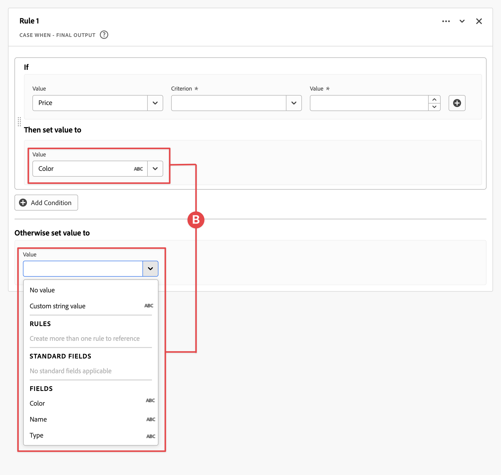
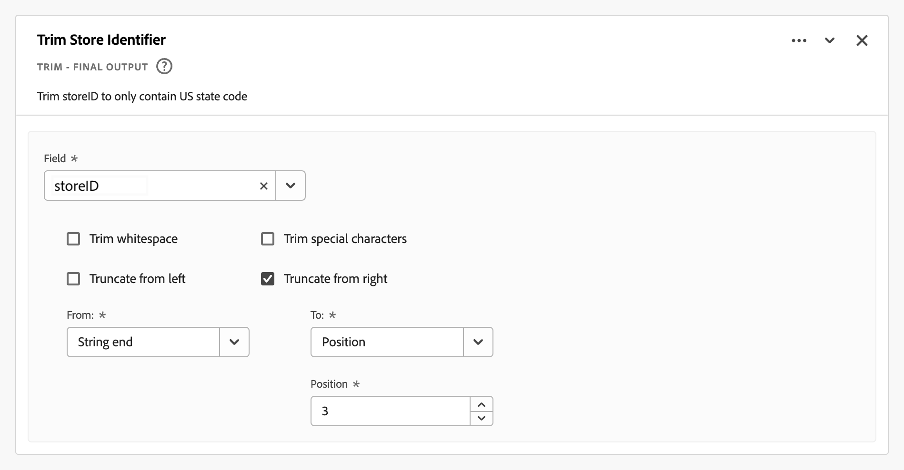

# Campos derivados

Os campos derivados são um aspecto importante da funcionalidade de relatórios em tempo real no Adobe Customer Journey Analytics. Um campo derivado permite definir manipulações de dados (muitas vezes complexas) a qualquer momento, por meio de um criador de regras personalizável. Em seguida, você pode usar esse campo derivado como um componente (métrica ou dimensão) no [Workspace](../../analysis-workspace/home.md) ou definir ainda mais o campo derivado como um componente em [Visualização de dados](../data-views.md).

Os campos derivados podem economizar uma quantidade significativa de tempo e esforço, em comparação à transformação ou manipulação de dados em outros locais fora do Customer Journey Analytics. Tais como [Preparação de dados](https://experienceleague.adobe.com/docs/experience-platform/data-prep/home.html?lang=pt-BR), [Distiller de dados](https://experienceleague.adobe.com/docs/experience-platform/query/data-distiller/overview.html), ou em seus próprios processos Extract Transform Load (ETL) / Extract Load Transform (ELT).

Os campos derivados são definidos em [Visualizações de dados](../data-views.md), são baseados em um conjunto de funções definidas como regras e aplicadas aos campos padrão e/ou de esquema disponíveis.

Exemplos de casos de uso:

- Defina um campo Nome de página derivado que corrija valores de nome de página coletados inadequados para corrigir valores de nome de página.

- Defina um campo Canal de marketing derivado que determine o canal de marketing adequado com base em uma ou mais condições (por exemplo, parâmetro de URL, URL da página, nome da página).

## Interface de campo derivada

Ao criar ou editar um campo derivado, você usa a interface de campo derivado.

|  | Nome | Descrição |
|---------|----------|--------|
| 1 | **Seletor** | Use a área do seletor para selecionar e arrastar e soltar sua função, modelo de função, campo de esquema ou campo padrão no construtor de regras.  Use o menu suspenso para selecionar entre:   [!UICONTROL Funções] - listas disponíveis [funções](#function-reference),   [!UICONTROL Modelos de função] - listas disponíveis [modelos de função](#function-templates),    [!UICONTROL Campos de esquema] - lista campos disponíveis nas categorias do conjunto de dados (evento, perfil, pesquisa) e campos derivados definidos anteriormente e   [!UICONTROL Campos padrão] - campos padrão disponíveis (como ID do conjunto de dados da plataforma). Somente os campos padrão de sequência e numérico são exibidos no seletor. Se a função suportar outros tipos de dados, os campos padrão com esses outros tipos de dados poderão ser selecionados para valores ou campos na interface de regras. Você pode pesquisar por função, templates de função, esquema e campos padrão usando o  Caixa de pesquisa.  Você pode filtrar a lista de objetos selecionados selecionando  Filtre e especifique filtros na [!UICONTROL Filtrar campos por] diálogo. É possível remover filtros facilmente usando  para cada filtro. |
| 2 | **Construtor de regras** | Você cria o campo derivado sequencialmente usando uma ou mais regras. Uma regra é uma implementação específica de uma função e, portanto, sempre está associada a apenas uma função. Crie uma regra arrastando e soltando uma função no construtor de regras. O tipo de função determina a interface da regra. Consulte a [Interface de regras](#rule-interface) para obter mais informações.  Você pode inserir uma função no início, fim ou entre regras já disponíveis no construtor de regras. A última regra no construtor de regras determina a saída final do campo derivado. |
| 3 | **[!UICONTROL ** Configurações do campo **]** | É possível nomear e descrever o campo derivado e inspecionar seu tipo de campo. |
| 4 | **[!UICONTROL ** Saída final **]** | Essa área mostra uma visualização atualizada dinamicamente dos valores de saída, com base nos dados dos últimos 30 dias e nas alterações feitas no campo derivado no construtor de regras. |

{style="table-layout:auto"}

## Assistente de modelo de campo

Ao acessar a interface de campo derivada pela primeira vez, a variável [!UICONTROL Iniciar com um modelo de campo] será exibido.

1. Selecione o modelo que descreva com mais precisão o tipo de campo que você está tentando criar.
2. Selecione o **[!UICONTROL ** Selecionar **]** para continuar.

Sua caixa de diálogo de campo derivado é preenchida com regras (e funções) necessárias ou úteis para o tipo de campo selecionado. Consulte [Modelos de função](#function-templates) para obter mais informações sobre os templates disponíveis.

## Interface de regras

Ao definir uma regra no construtor de regras, use a interface de regras.

|  | Nome | Descrição |
|---------|----------|--------|
| A | **Nome da regra** | Por padrão, o nome da regra é **Regra X** (X se refere a um número de sequência). Para editar o nome de uma regra, selecione seu nome e digite o novo nome, por exemplo `Query Parameter`. |
| B | **Nome da função** | O nome da função selecionada para a regra, por exemplo [!UICONTROL ANÁLISE DE URL]. Quando a função é a última na sequência de funções e determina os valores de saída finais, o nome da função é seguido por [!UICONTROL - REALIZAÇÃO FINAL], por exemplo [!UICONTROL ANÁLISE DE URL - SAÍDA FINAL].  Para mostrar um pop-up com mais informações sobre a função, selecione . |
| C | **Descrição da regra** | Opcionalmente, é possível adicionar uma descrição a uma regra. Selecionar e selecione **[!UICONTROL ** Adicionar descrição **]** para adicionar uma descrição ou **[!UICONTROL ** Editar descrição **]** para editar uma descrição existente. Use o editor para inserir uma descrição. Você pode usar a barra de ferramentas para formatar o texto (usando o seletor de estilo, negrito, itálico, sublinhado, direita, esquerda, centralizado, cor, lista de números, lista de marcadores) e adicionar links a informações externas.  Para concluir a edição da descrição, clique fora do editor. |
| D | **Área de função** | Define a lógica da função. A interface depende do tipo de função. A lista suspensa de [!UICONTROL Campo] ou [!UICONTROL Valor] mostra todas as categorias de campos (regras, campos padrão, campos) disponíveis, com base no tipo de entrada que a função espera. Como alternativa, você pode arrastar e soltar um campo do seletor de campos Esquema e Padrão em para um Campo ou Valor. Quando esse campo arrastado se origina de um conjunto de dados de Pesquisa, uma função de Pesquisa é inserida automaticamente antes da função definida.  Consulte [Referência de função](#function-reference) informações detalhadas sobre cada uma das funções suportadas. |

{style="table-layout:auto"}

## Criar um campo derivado

1. Selecione uma visualização de dados existente ou crie uma visualização de dados. Consulte [Visualizações de dados](../data-views.md) para obter mais informações.

2. Selecione o **[!UICONTROL ** Componentes **]** da Visualização de dados.

3. Selecionar **[!UICONTROL ** Criar campo derivado **]** do painel esquerdo.

4. Para definir o campo derivado, use o [!UICONTROL Criar campo derivado] interface. Consulte [Interface de campo derivada](#derived-field-interface).

   Para salvar o novo campo derivado, selecione **[!UICONTROL ** Salvar **]**.

5. O novo campo derivado é adicionado à variável [!UICONTROL Campos derivados >] contêiner, como parte de **[!UICONTROL ** Campos de esquema **]** no painel esquerdo da visualização de dados.

## Editar um campo derivado

1. Selecione uma visualização de dados existente. Consulte [Visualizações de dados](../data-views.md) para obter mais informações.

2. Selecione o **[!UICONTROL ** Componentes **]** da Visualização de dados.

3. Selecionar **[!UICONTROL ** Campos de esquema **]** na guia [!UICONTROL Conexão] à esquerda.

4. Selecionar **[!UICONTROL ** Campos derivados >**]** recipiente.

5. Passe o mouse sobre o campo derivado que deseja editar e selecione .

6. Para editar o campo derivado, use o [!UICONTROL Editar campo derivado] interface. Consulte [Interface de campo derivada](#derived-field-interface).

   - Selecionar **[!UICONTROL ** Salvar **]** para salvar o campo derivado atualizado.

   - Selecionar **[!UICONTROL ** Cancelar **]** para cancelar quaisquer alterações feitas no campo derivado.

   - Selecionar **[!UICONTROL ** Salvar como **]** para salvar o campo derivado como um novo campo derivado. O novo campo derivado tem o mesmo nome que o campo derivado editado original com `(copy)` adicionado a ele.

Como alternativa, se você tiver usado um campo derivado como um componente para dimensões ou métricas na visualização de dados:

1. Selecione o componente. Observe que o componente pode ter um nome diferente do seu campo derivado.

1. No painel Componente, selecione a  ao lado do campo derivado, abaixo do nome do campo Esquema.

1. Para editar o campo derivado, use o [!UICONTROL Editar campo derivado] interface. Consulte [Interface de campo derivada](#derived-field-interface).

   - Selecionar **[!UICONTROL ** Salvar **]** para salvar o campo derivado atualizado.

   - Selecionar **[!UICONTROL ** Cancelar **]** para cancelar quaisquer alterações feitas no campo derivado.

   - Selecionar **[!UICONTROL ** Salvar como **]** para salvar o campo derivado como um novo campo derivado. O novo campo derivado tem o mesmo nome que o campo derivado editado original com `(copy)` adicionado a ele.

## Excluir um campo derivado

1. Selecione uma visualização de dados existente. Consulte [Visualizações de dados](../data-views.md) para obter mais informações.

2. Selecione o **[!UICONTROL ** Componentes **]** da Visualização de dados.

3. Selecionar **[!UICONTROL ** Campos de esquema **]** guia em [!UICONTROL Conexão] painel.

4. Selecionar **[!UICONTROL ** Campos derivados >**]** recipiente.

5. Passe o mouse sobre o campo derivado que deseja excluir e selecione .

6. No [!UICONTROL Editar campo derivado] , selecione **[!UICONTROL Excluir]**.

   A [!UICONTROL Excluir componente] solicitará que você confirme a exclusão. Considere todas as referências externas que possam existir ao campo derivado fora da visualização de dados.

   - Selecionar **[!UICONTROL ** Continuar **]** para excluir o campo derivado.

Como alternativa, se você tiver usado um campo derivado como um componente para dimensões ou métricas na visualização de dados:

1. Selecione o componente. Observe que o componente pode ter um nome diferente do seu campo derivado.

1. No painel Componente, selecione a  ao lado do campo derivado, abaixo do nome do campo Esquema.

1. No [!UICONTROL Editar campo derivado] , selecione **[!UICONTROL Excluir]**.

   A [!UICONTROL Excluir componente] solicitará que você confirme a exclusão. Considere todas as referências externas que possam existir ao campo derivado fora da visualização de dados.

   - Selecionar **[!UICONTROL ** Continuar **]** para excluir o campo derivado.

>[!NOTE]
>
>Os campos derivados são gerenciados em um nível de Conexão no Customer Journey Analytics. Qualquer alteração feita em um campo derivado em qualquer uma das visualizações de dados associadas a essa conexão se aplica a todas essas visualizações de dados associadas.

## Modelos de função

Para criar rapidamente um campo derivado para casos de uso específicos, os modelos de função estão disponíveis. Esses templates de função podem ser acessados na área do seletor na interface de campo derivada ou são apresentados no primeiro uso na variável [!UICONTROL Iniciar com um modelo de campo] assistente.

### Canais de marketing

Este modelo está configurado para usar o [Análise De Url](#dnl-url-parse) e [Ocorrência Quando](#dnl-case-when) O funciona várias vezes para obter valores apropriados de um URL. A lógica é aplicada nesses valores para associar o URL a um canal de marketing específico.

+++ Detalhes

Para usar o template, você deve especificar os parâmetros corretos para cada função listada como parte das regras no template. Consulte [Referência de função](#function-reference) para obter mais informações.

+++

<!--

+++ Data clean up template

>[!WARNING]
>
>Could not find any information on this template.
+++

-->

## Referência de função

{{select-package}}

Para cada função compatível, encontre os detalhes abaixo sobre:

- especificações:
   - tipo de dados de entrada: tipo de dados compatível,
   - input: valores possíveis para entrada,
   - operadores incluídos: operadores compatíveis com esta função (se houver),
   - limitações: limitações aplicáveis a esta função específica,
   - saída.

- Casos de uso do, incluindo:
   - dados antes de definir o campo derivado,
   - como definir o campo derivado,
   - dados após definir o campo derivado.

- restrições (se aplicável).

>[!NOTE]
>
>A função Lookup foi renomeada para [Classificar](#classify). Consulte a [Classificar](#classify) para obter mais informações.

<!-- CASE WHEN -->

### Caso Quando

Aplica condicionais, com base em critérios definidos de um ou mais campos. Esses critérios são usados para definir os valores em um novo campo derivado, com base na sequência das condições.

+++ Detalhes

## Especificações {#casewhen-io}

| Tipo de dados de entrada | Entrada | Operadores incluídos | Limitações | Saída |
|---|---|---|---|---|
| <ul><li>Sequência de caracteres</li><li>Numérico</li><li>Data</li></ul> | <ul><li>[!UICONTROL Se], [!UICONTROL Else If] contêiner:
<ul><li>[!UICONTROL Valor]</li><ul><li>Regras</li><li>Campos padrão</li><li>Campos</li></ul><li>[!UICONTROL Critério] (consulte operadores incluídos, com base no tipo de valor selecionado)</li></ul></li><li>[!UICONTROL Em seguida, defina o valor como], [!UICONTROL Caso contrário, defina o valor como]:
<ul><li>[!UICONTROL Valor]</li><ul><li>Regras</li><li>Campos padrão</li><li>Campos</li></ul></ul></li></ul> | 
Strings
<ul><li>Igual a</li><li>Igual a qualquer termo</li><li>Contém a frase</li><li>Contém qualquer termo</li><li>Contém todos os termos</li><li>Começa com</li><li>Começa com qualquer termo</li><li>Termina com</li><li>Termina com qualquer termo</li><li>Não é igual</li><li>Não é igual a nenhum termo</li><li>Não contém a frase</li><li>Não contém nenhum termo</li><li>Não contém todos os termos</li><li>Não começa com</li><li>Não começa com nenhum termo</li><li>Não termina com</li><li>Não termina com nenhum termo</li><li>Está definido</li><li>Não está definido</li></ul>
Numérico
<ul><li>Igual a</li><li>Não é igual</li><li>É maior que</li><li>É maior que ou igual a</li><li>É menor que</li><li>É menor que ou igual a</li><li>Está definido</li><li>Não está definido</li></ul>
Datas
<ul><li>Igual a</li><li>Não é igual</li><li>É posterior a</li><li>É posterior ou igual a</li><li>É anterior a</li><li>É anterior ou igual a</li><li>Está definido</li><li>Não está definido</li></ul> | <ul><li>5 funções por campo derivado</li><li>200 [operadores](#operators) por campo derivado. Um exemplo de um único operador é &#39;Domínio de referência contém google&#39;. </li></ul> | 
Novo campo derivado
 |

{style="table-layout:auto"}

## Caso de uso 1 {#casewhen-uc1}

Você deseja definir regras para identificar vários canais de marketing, aplicando a lógica em cascata para definir um campo de canal de marketing com o valor correto:

- Se o referenciador for de um mecanismo de pesquisa e a página tiver um valor de sequência de consulta em que `cid` contém `ps_`, o canal de marketing deve ser identificado como um [!DNL *Pesquisa paga*].
- Se o referenciador for de um mecanismo de pesquisa e a página não tiver a sequência de consulta `cid`, o canal de marketing deve ser identificado como um [!DNL *Pesquisa natural*].
- Se uma página tiver um valor de sequência de consulta em que `cid` contém `em_`, o canal de marketing deve ser identificado como um [!DNL *E-mail*].
- Se uma página tiver um valor de sequência de consulta em que `cid` contém `ds_`, o canal de marketing deve ser identificado como um [!DNL *Exibir anúncio*].
- Se uma página tiver um valor de sequência de consulta em que `cid` contém `so_`, o canal de marketing deve ser identificado como um [!DNL *Social pago*].
- Se o referenciador for de um domínio referenciador de [!DNL twitter.com], [!DNL facebook.com], [!DNL linkedin.com]ou [!DNL tiktok.com], o canal de marketing deve ser identificado como um [!DNL *Social natural*].
- Se nenhuma das regras acima for correspondida, o canal de marketing deverá ser identificado como [!DNL *Outro referenciador*].

Caso seu site receba os seguintes eventos de amostra, contendo [!UICONTROL Referenciador] e [!UICONTROL URL da página], esses eventos devem ser identificados da seguinte forma:

| [!DNL Event] | [!DNL Referrer] | [!DNL Page URL] | [!DNL Marketing Channel] |
|:--:|----|----|----|
| 1 | `https://facebook.com` | `https://site.com/home` | [!DNL Natural Social] |
| 2 | `https://abc.com` | `https://site.com/?cid=ds_12345678` | [!DNL Display] |
| 3 | | `https://site.com/?cid=em_12345678` | [!DNL Email] |
| 4 | `https://google.com` | `https://site.com/?cid=ps_abc098765` | [!DNL Paid Search] |
| 5 | `https://google.com` | `https://site.com/?cid=em_765544332` | [!DNL Email] |
| 6 | `https://google.com` |  | [!DNL Natural Search] |

{style="table-layout:auto"}

### Dados anteriores a {#casewhen-uc1-databefore}

| [!DNL Referrer] | [!DNL Page URL] |
|----|----|
| `https://facebook.com` | `https://site.com/home` |
| `https://abc.com` | `https://site.com/?cid=ds_12345678` |
|  | `https://site.com/?cid=em_12345678` |
| `https://google.com` | `https://site.com/?cid=ps_abc098765` |
| `https://google.com` | `https://site.com/?cid=em_765544332` |
| `https://google.com` |

{style="table-layout:auto"}

### Campo derivado {#casewhen-uc1-derivedfield}

Você define um novo `Marketing Channel` campo derivado. Você usa o [!UICONTROL CASO QUANDO] para definir regras que criem valores para o com base em valores existentes para o `Page URL` e `Referring URL` campo.

Observe o uso da função [!UICONTROL ANÁLISE DE URL] para definir regras para buscar os valores de `Page Url` e `Referring Url` antes do [!UICONTROL CASO QUANDO] regras são aplicadas.

### Dados após {#casewhen-uc1-dataafter}

| [!DNL Marketing Channel] |
|----|
| [!DNL Natural Social] |
| [!DNL Display] |
| [!DNL Email] |
| [!DNL Paid Search] |
| [!DNL Email] |
| [!DNL Natural Search] |

{style="table-layout:auto"}

## Caso de uso 2 {#casewhen-uc2}

Você coletou várias variações diferentes de pesquisa no [!DNL Product Finding Methods] dimensão. Para entender o desempenho geral da pesquisa em relação ao navegador, você deve gastar muito tempo combinando os resultados manualmente.

Seu site coleta os seguintes valores para seus [!DNL Product Finding Methods] dimensão. No final, todos esses valores indicam uma pesquisa.

| Valor coletado | Valor real |
|---|---|
| [!DNL search p13n_no] | [!DNL search] |
| [!DNL search p13n_yes] | [!DNL search] |
| [!DNL search refine p13n_no] | [!DNL search] |
| [!DNL search refine p13n_yes] | [!DNL search] |
| [!DNL search redirect p13n_yes] | [!DNL search] |
| [!DNL search-redirect] | [!DNL search] |

{style="table-layout:auto"}

### Dados anteriores a {#casewhen-uc2-databefore}

| [!DNL Product Finding Methods] |
|----|
| [!DNL search p13_no] |
| [!DNL search p13_yes] |
| [!DNL browse] |
| [!DNL search refine p13_no] |
| [!DNL search refine p13_yes] |
| [!DNL browse] |
| [!DNL search redirect p13_yes] |
| [!DNL search-redirect] |
| [!DNL browse] |

{style="table-layout:auto"}

### Campo derivado {#casewhen-uc2-derivedfield}

Você define um `Product Finding Methods (new)` campo derivado. Você cria o seguinte [!UICONTROL CASO QUANDO] regras no construtor de regras. Essas regras aplicam lógica a todas as variações possíveis do antigo [!UICONTROL Métodos de descoberta de produtos] valores de campo para `search` e `browse` usando o [!UICONTROL Contém a frase] critério.

### Dados após {#casewhen-uc2-dataafter}

| [!DNL Product Finding Methods (new)] |
|----|
| [!DNL search] |
| [!DNL search] |
| [!DNL browse] |
| [!DNL search] |
| [!DNL search] |
| [!DNL browse] |
| [!DNL search] |
| [!DNL search] |
| [!DNL browse] |

{style="table-layout:auto"}

## Caso de uso 3 {#casewhen-uc3}

Como empresa de viagens, você gostaria de medir a duração do percurso para viagens reservadas, para que possa relatar a duração dos percursos por período.

Suposições:

- A organização está coletando a duração do percurso em um campo numérico.
- Eles gostariam de agrupar durações de 1 a 3 dias em um intervalo chamado &quot;[!DNL short trip]&#39;
- Eles gostariam de agrupar durações de 4 a 7 dias em um intervalo chamado &quot;[!DNL medium trip]&#39;
- Eles gostariam de agrupar durações de mais de 8 dias em um intervalo chamado &quot;[!DNL long trip]&#39;
- 132 viagens foram reservadas por um período de 1 dia
- 110 viagens foram reservadas por um período de 2 dias
- Foram reservadas 105 viagens por um período de 3 dias
- Foram reservadas 99 viagens por um período de 4 dias
- Foram reservadas 92 viagens por um período de 5 dias
- Foram reservadas 85 viagens por um período de 6 dias
- Foram reservadas 82 viagens por um período de 7 dias
- 78 viagens foram reservadas por um período de 8 dias
- 50 viagens foram reservadas por 9 dias
- 44 viagens foram reservadas por um período de 10 dias
- 38 viagens foram reservadas por 11 dias de duração
- 31 viagens foram reservadas por 12 dias de duração

O relatório desejado deve ter a seguinte aparência:

| [!DNL Trip Duration Type] | [!DNL Bookings] |
|----|---:|
| [!DNL medium trip] | 358 |
| [!DNL short trip] | 347 |
| [!DNL long trip] | 241 |

{style="table-layout:auto"}

### Dados anteriores a {#casewhen-uc3-databefore}

| [!DNL Trip Duration] |
|---:|
| 1 |
| 12 |
| 3 |
| 6 |
| 4 |
| 8 |
| 6 |
| 2 |
| 1 |
| 2 |
| 21 |
| 8 |

### Campo derivado {#casewhen-uc3-derivedfield}

Você define um `Trip Duration (bucketed)` campo derivado. Você cria o seguinte [!UICONTROL CASO QUANDO] regra no construtor de regras. Essa regra aplica lógica ao bucket do antigo [!UICONTROL Duração da viagem] valores de campo em três valores: `short trip`, `medium  trip`, e `long trip`.

### Dados após {#casewhen-uc3-dataafter}

| [!DNL Trip Duration (bucketed)] |
|---|
| [!DNL short trip] |
| [!DNL long trip] |
| [!DNL short trip] |
| [!DNL medium trip] |
| [!DNL medium trip] |
| [!DNL long trip] |
| [!DNL medium trip] |
| [!DNL short trip] |
| [!DNL short trip] |
| [!DNL short trip] |
| [!DNL long trip] |
| [!DNL long trip] |

## Mais informações

O Customer Journey Analytics Adobe Experience Platform usa uma estrutura de contêiner aninhada, modelada de acordo com a configuração [XDM](https://experienceleague.adobe.com/docs/experience-platform/xdm/home.html?lang=pt-BR) (Experience Data Model). Consulte [Contêineres](../create-dataview.md#containers) e [Filtrar contêineres](../../components/filters/filters-overview.md#filter-containers) para obter mais informações de referência. Esse modelo de contêiner, embora flexível por natureza, impõe algumas restrições ao usar o construtor de regras.

O Customer Journey Analytics usa o seguinte modelo de contêiner padrão:

As restrições a seguir se aplicam e são aplicadas quando *seleção* e *configuração* valores.

|  | Limitações |
|:---:|----|
| **A** | Valores que *selecionar* dentro do mesmo [!UICONTROL Se], [!UICONTROL Else If] construir (usando [!UICONTROL E] ou [!UICONTROL Ou]) em uma regra deve se originar do mesmo container e pode ser de qualquer tipo (string , numérico e assim por diante).   |
| **B** | Todos os valores *set* em uma regra deve ser do mesmo container e ter o mesmo tipo ou um valor derivado do mesmo tipo.    |
| **C** | Os valores que *selecionar* em [!UICONTROL Se], [!UICONTROL Else If] construções na regra do *não* têm de se originar do mesmo recipiente e não *não* devem ser do mesmo tipo.    |

{style="table-layout:auto"}

+++

<!-- CLASSIFY -->

### Classificar

Define um conjunto de valores que são substituídos por valores correspondentes em um novo campo derivado.

+++ Detalhes

>[!NOTE]
>
>Esta função foi originalmente chamada de Pesquisa, mas foi renomeada para Classificar para acomodar uma função de Pesquisa futura com funcionalidade diferente.

## Especificações {#classify-io}

| Tipo de dados de entrada | Entrada | Operadores incluídos | Limitações | Saída |
|---|---|---|---|---|
| <ul><li>Sequência de caracteres</li><li>Numérico</li><li>Data</li></ul> | <ul><li>[!UICONTROL Campo a ser classificado]:<ul><li>Regras</li><li>Campos padrão</li><li>Campos</li></ul></li><li>[!UICONTROL Quando o valor é igual a] e [!UICONTROL Substituir valores por]:
<ul><li>Sequência de caracteres</li></ul><li>Mostrar valores originais<ul><li>Booleano</li></ul></li></ul> | 
N/D
 | 
5 funções por campo derivado 100 linhas por função
 | 
Novo campo derivado
 |

{style="table-layout:auto"}

## Caso de uso 1 {#classify-uc1}

Você tem um arquivo CSV que inclui uma coluna de chave para `hotelID` e uma ou mais colunas adicionais associadas à variável `hotelID`: `city`, `rooms`, `hotel name`.
Você está coletando [!DNL Hotel ID] em uma dimensão, mas gostaria de criar uma [!DNL Hotel Name] dimensão derivada do `hotelID` no arquivo CSV.

**Estrutura e conteúdo do arquivo CSV**

| [!DNL hotelID] | [!DNL city] | [!DNL rooms] | [!DNL hotel name] |
|---|---|---:|---|
| [!DNL SLC123] | [!DNL Salt Lake City] | 40 | [!DNL SLC Downtown] |
| [!DNL LAX342] | [!DNL Los Angeles] | 60 | [!DNL LA Airport] |
| [!DNL SFO456] | [!DNL San Francisco] | 75 | [!DNL Market Street] |
| [!DNL AMS789] | [!DNL Amsterdam] | 50 | [!DNL Okura] |

{style="table-layout:auto"}

**Relatório atual**

| [!DNL Hotel ID] | Visualizações de produto |
|---|---:|
| [!DNL SLC123] | 200 |
| [!DNL LX342] | 198 |
| [!DNL SFO456] | 190 |
| [!DNL AMS789] | 150 |

{style="table-layout:auto"}

**Relatório desejado**

| [!DNL Hotel Name] | Visualizações de produto |
|----|----:|
| [!DNL SLC Downtown] | 200 |
| [!DNL LA Airport] | 198 |
| [!DNL Market Street] | 190 |

{style="table-layout:auto"}

### Dados anteriores a {#classify-uc1-databefore}

| [!DNL Hotel ID] |
|----|
| [!DNL SLC123] |
| [!DNL LAX342] |
| [!DNL SFO456] |
| [!DNL AMS789] |

{style="table-layout:auto"}

### Campo derivado {#classify-uc1-derivedfield}

Você define um `Hotel Name` campo derivado. Você usa o [!UICONTROL CLASSIFICAR] para definir uma regra em que você possa classificar valores de [!UICONTROL ID do Hotel] e substitua por novos valores.

Se desejar incluir valores originais que não foram definidos como parte dos valores a serem classificados (por exemplo, ID do Hotel AMS789), selecione **[!UICONTROL Mostrar valores originais]**. Isso garante que o AMS789 faça parte da saída do campo derivado, apesar de esse valor não ser classificado.

### Dados após {#classify-uc1-dataafter}

| [!DNL Hotel Name] |
|----|
| [!DNL SLC Downtown] |
| [!DNL LA Airport] |
| [!DNL Market Street] |

{style="table-layout:auto"}

## Caso de uso 2 {#classify-uc2}

Você coletou URLs em vez do nome de página amigável para várias páginas. Essa coleção mista de valores interrompe o relatório.

### Dados anteriores a {#classify-uc2-databefore}

| [!DNL Page Name] |
|---|
| [!DNL Home Page] |
| [!DNL Flight Search] |
| `http://www.adobetravel.ca/Hotel-Search` |
| `https://www.adobetravel.com/Package-Search` |
| [!DNL Deals & Offers] |
| `http://www.adobetravel.ca/user/reviews` |
| `https://www.adobetravel.com.br/Generate-Quote/preview` |

{style="table-layout:auto"}

### Campo derivado {#classify-uc2-derivedfield}

Você define um `Page Name (updated)` campo derivado. Você usa o [!UICONTROL CLASSIFICAR] para definir uma regra em que você possa classificar os valores dos seus [!UICONTROL Nome da página] e substitua por valores corretos atualizados.

### Dados após {#classify-uc2-dataafter}

| [!DNL Page Name (updated)] |
|---|
| [!DNL Home Page] |
| [!DNL Flight Search] |
| [!DNL Hotel Search] |
| [!DNL Package Search] |
| [!DNL Deals & Offers] |
| [!DNL Reviews] |
| [!DNL Generate Quote] |

## Mais informações {#classify-moreinfo}

A seguinte funcionalidade adicional está disponível na interface Classificar regra:

- Para limpar rapidamente todos os valores de tabela, selecione  **[!UICONTROL Limpar todos os valores da tabela]**.
- Para carregar um arquivo CSV contendo valores originais para Quando os valores são iguais e novos valores para Substituir valores por, selecione  **[!UICONTROL Fazer upload de CSV]**.
- Para baixar um modelo para criar um arquivo CSV com valores originais e novos para carregar, selecione  **[!UICONTROL Baixar modelo de arquivo CSV]**.
- Para baixar um arquivo CSV com todos os valores originais e novos preenchidos na interface de regras, selecione  **[!UICONTROL Baixar valores em CSV]**.

+++

<!-- CONCATENATE -->

### Concatenar

Combina valores de campo em um único campo derivado novo com delimitadores definidos.

+++ Detalhes

## Especificações {#concatenate-io}

| Tipo de dados de entrada | Entrada | Operadores incluídos | Limitações | Saída |
|---|---|---|---|---|
| <ul><li>Sequência de caracteres</li></ul> | <ul><li>[!UICONTROL Valor]:<ul><li>Regras</li><li>Campos padrão</li><li>Campos</li><li>Sequência de caracteres</li></ul></li><li>[!UICONTROL Delimitador]:<ul><li>Sequência de caracteres</li></ul></li> </ul> | 
N/D
 | 
2 funções por campo derivado
 | 
Novo campo derivado
 |

{style="table-layout:auto"}

## Caso de uso {#concatenate-uc}

Atualmente, você coleta códigos de aeroporto de origem e destino como campos separados. Você gostaria de pegar os dois campos e combiná-los em uma única dimensão separada por um hífen (-). Assim, você pode analisar a combinação de origem e destino para identificar as principais rotas reservadas.

Suposições:

- Os valores de origem e destino são coletados em campos separados na mesma tabela.
- O usuário determina o uso do delimitador &#39;-&#39; entre os valores.

Imagine que as seguintes reservas ocorram:

- Cliente ABC123 reserva um voo entre Salt Lake City (SLC) e Orlando (MCO)
- Cliente ABC456 reserva um voo entre Salt Lake City (SLC) e Los Angeles (LAX)
- Cliente ABC789 reserva um voo entre Salt Lake City (SLC) e Seattle (SEA)
- Cliente ABC987 reserva um voo entre Salt Lake City (SLC) e San Jose (SJO)
- Cliente ABC654 reserva um voo entre Salt Lake City (SLC) e Orlando (MCO)

O relatório desejado deve ser semelhante a:

| Origem / Destino | Reservas |
|----|---:|
| SLC-MCO | 2 |
| SLC-LAX | 1 |
| SLC-SEA | 1 |
| SLC-SJO | 1 |

{style="table-layout:auto"}

### Dados anteriores a {#concatenate-uc-databefore}

| Origem | Destino |
|----|---:|
| SLC | MCO |
| SLC | LAX |
| SLC | SEA |
| SLC | SJO |
| SLC | MCO |

{style="table-layout:auto"}

### Campo derivado {#concatenate-derivedfield}

Você define um novo [!UICONTROL Origem - Destino] campo derivado. Você usa o [!UICONTROL CONCATENAR] para definir uma regra para concatenar a variável [!UICONTROL Original] e [!UICONTROL Destino] campos usando o `-` [!UICONTROL Delimitador].

### Dados após {#concatenate-dataafter}

| Origem - Destino (campo derivado) |
|---|
| SLC-MCO |
| SLC-LAX |
| SLC-SEA |
| SLC-SJO |
| SLC-MCO |

{style="table-layout:auto"}

+++

<!-- FIND AND REPLACE -->

### Localizar e substituir

Localiza todos os valores em um campo selecionado e substitui esses valores por um valor diferente em um novo campo derivado.

+++ Detalhes

## Especificações {#findreplace-io}

| Tipo de dados de entrada | Entrada | Operadores incluídos | Limitações | Saída |
|---|---|---|---|---|
| <ul><li>Sequência de caracteres</li></ul> | <ul><li>[!UICONTROL Valor]<ul><li>Regras</li><li>Campos padrão</li><li>Campos</li></ul></li><li>[!UICONTROL Localizar tudo], [!UICONTROL e substituir tudo por]:<ul><li>Sequência de caracteres</li></ul></li></ul></ul> | 
Strings
<ul><li>[!UICONTROL Localizar tudo], [!UICONTROL e substituir tudo por]</li></ul> | 
5 funções por campo derivado
 | 
Novo campo derivado
 |

{style="table-layout:auto"}

## Caso de uso {#findreplace-uc}

Você recebeu alguns valores malformados para o relatório de canais de marketing externos, por exemplo `email%20 marketing` em vez de `email marketing`. Esses valores malformados interrompem seus relatórios e dificultam a visualização do desempenho do email. Você deseja substituir `email%20marketing` com `email marketing`.

**Relatório Original**

| [!DNL External Marketing Channels] | [!DNL Sessions] |
|---|--:|
| [!DNL email marketing] | 500 |
| [!DNL email %20marketing] | 24 |

{style="table-layout:auto"}

**Relatório Preferencial**

| [!DNL External Marketing Channels] | [!DNL Sessions] |
|---|--:|
| [!DNL email marketing] | 524 |

### Dados anteriores a {#findreplace-uc-databefore}

| [!DNL External Marketing] |
|----|
| [!DNL email marketing] |
| [!DNL email%20marketing] |
| [!DNL email marketing] |
| [!DNL email marketing] |
| [!DNL email%20marketing] |

{style="table-layout:auto"}

### Campo derivado {#findreplace-uc-derivedfield}

Você define um `Email Marketing (updated)` campo derivado. Você usa o [!UICONTROL LOCALIZAR E SUBSTITUIR] função para definir uma regra para localizar e substituir todas as ocorrências de `email%20marketing` com `email marketing`.

### Dados após {#findreplace-uc-dataafter}

| [!DNL External Marketing (updated)] |
|----|
| [!DNL email marketing] |
| [!DNL email marketing] |
| [!DNL email marketing] |
| [!DNL email marketing] |
| [!DNL email marketing] |

{style="table-layout:auto"}

+++

<!-- LOOKUP -->

### Pesquisa

Valores de pesquisa usando um campo de um conjunto de dados de pesquisa e retorna um valor em um novo campo derivado ou para processamento de regras adicional.

+++ Detalhes

## Especificação {#lookup-io}

| Tipo de dados de entrada | Entrada | Operadores incluídos | Limite | Saída |
|---|---|---|---|---|
| <ul><li>Sequência de caracteres</li><li>Numérico</li><li>Data</li></ul> | <ul><li>[!UICONTROL Campo para aplicar a pesquisa]:</li><ul><li>Regras</li><li>Campos padrão</li><li>Campos</li></ul><li>[!UICONTROL Conjunto de dados de pesquisa]</li><ul><li>Conjunto de dados</li></ul><li>[!UICONTROL Chave correspondente]<ul><li>Regras</li><li>Campos</li></ul></li><li>Valores a serem retornados<ul><li>Regras</li><li>Campos</li></ul></li></ul> | 
N/D
 | 
3 funções por campo derivado
 | 
Novo campo ou valor derivado para processamento adicional na próxima regra
 |

{style="table-layout:auto"}

## Caso de uso {#lookup-uc}

Você gostaria de pesquisar o nome da atividade usando a ID da atividade coletada quando seus clientes clicaram em um banner personalizado exibido por meio do Adobe Target. Você deseja usar um conjunto de dados de pesquisa com atividades do Analytics for Target (A4T) contendo IDs de atividade e nomes de atividade.

### Conjunto de dados de pesquisa A4T {#lookup-uc-lookup}

| ID da atividade | Nome da atividade |
|---|---|
| 415851 | Páginas de categoria de teste MVT |
| 415852 | Luma - Campanha Max 2022 |
| 402922 | Banners da página inicial |

{style="table-layout:auto"}

### Campo derivado {#lookup-uc-derivedfield}

Você define um `Activity Name` campo derivado. Você usa o [!UICONTROL PESQUISA] para definir uma regra para pesquisar o valor a partir dos dados coletados, especificado no campo [!UICONTROL Campo para aplicar a pesquisa] campo (por exemplo **[!DNL ActivityIdentifier]**). Você seleciona o conjunto de dados de pesquisa na [!UICONTROL Conjunto de dados de pesquisa] lista (por exemplo, **[!DNL New CJA4T Activities]**). Em seguida, você seleciona o campo de identificador (por exemplo, **[!DNL ActivityIdentifier]**) do [!UICONTROL Chave correspondente] e o campo a ser retornado da [!UICONTROL Valores a serem retornados] lista (por exemplo, **[!DNL ActivityName]**).

## Mais informações

Você pode inserir rapidamente um [!UICONTROL Pesquisa] no construtor de regras, que já contém uma ou mais funções.

1. Selecionar **[!UICONTROL Campos de esquema]** do seletor.
1. Selecionar  **[!UICONTROL Pesquisar conjuntos de dados]**.
1. Selecione seu conjunto de dados de pesquisa e localize o campo que deseja usar para pesquisa.
1. Arraste e solte o campo de pesquisa em qualquer um dos campos de entrada disponíveis para uma função (por exemplo, Caso Quando). Quando válida, uma caixa azul, rotulada **[!UICONTROL + Adicionar]**, permite soltar o campo e inserir automaticamente uma função Pesquisa antes da função em que você soltou o campo de pesquisa. A função Lookup inserida é preenchida automaticamente com valores relevantes para todos os campos.
   

+++

<!-- LOWERCASE -->

### Minúsculas

Converte valores de um campo em minúsculas e o armazena em um novo campo derivado.

+++ Detalhes

## Especificação {#lowercase-io}

| Tipo de dados de entrada | Entrada | Operadores incluídos | Limite | Saída |
|---|---|---|---|---|
| <ul><li>Sequência de caracteres</li><li>Numérico</li><li>Data</li></ul> | <ul><li>[!UICONTROL Campo]:</li><ul><li>Regras</li><li>Campos padrão</li><li>Campos</li></ul> | 
N/D
 | 
2 funções por campo derivado
 | 
Novo campo derivado
 |

{style="table-layout:auto"}

## Caso de uso {#lowercase-uc}

Você gostaria de converter todos os nomes de produtos coletados em minúsculas para um relatório adequado.

### Dados anteriores a {#lowercase-uc-databefore}

| Nomes de produto coletados | Visualizações de produto |
|---|---:|
| Raquete de tênis | 35 |
| Raquete de Tênis | 33 |
| raquete de tênis | 21 |
| Bastão de beisebol | 15 |
| Bastão de Beisebol | 12 |
| taco de beisebol | 10 |

{style="table-layout:auto"}

### Campo derivado {#lowercase-uc-derivedfield}

Você define um `Product Names` campo derivado. Você usa o [!UICONTROL MINÚSCULAS] para definir uma regra para converter o valor do [!UICONTROL Nomes de produto coletados] para minúsculas e armazene no novo campo derivado.

### Dados após {#lowercase-uc-dataafter}

| Nomes de produto | Visualizações de produto |
|---|---|
| raquete de tênis | 89 |
| taco de beisebol | 37 |

{style="table-layout:auto"}

+++

<!-- MERGE FIELDS -->

### Mesclar campos

Mescla valores de dois campos diferentes em um novo campo derivado.

+++ Detalhes

## Especificação {#merge-fields-io}

| Tipo de dados de entrada | Entrada | Operadores incluídos | Limite | Saída |
|---|---|---|---|---|
| <ul><li>Sequência de caracteres</li><li>Numérico</li><li>Data</li></ul> | <ul><li>[!UICONTROL Campo]:</li><ul><li>Regras</li><li>Campos padrão</li><li>Campos</li></ul> | 
N/D
 | 
5 funções por campo derivado
 | 
Novo campo derivado
 |

{style="table-layout:auto"}

## Caso de uso {#merge-fields-uc}

Você gostaria de criar uma dimensão composta pelo campo de nome da página e pelo campo de motivo da chamada com a intenção de analisar a jornada entre canais.

### Dados anteriores a {#merge-fields-uc-databefore}

| Nome da página | Sessão | Visitantes |
|---|--:|--:|
| página de ajuda | 250 | 200 |
| home page | 500 | 250 |
| página de detalhes do produto | 300 | 200 |

{style="table-layout:auto"}

| Motivo da chamada | Sessão | Visitantes |
|---|--:|--:|
| perguntas sobre meu pedido | 275 | 250 |
| fazer uma alteração no meu pedido | 150 | 145 |
| problema com a ordenação | 100 | 95 |

{style="table-layout:auto"}

### Campo derivado {#merge-fields-uc-derivedfield}

Você define um `Cross Channel Interactions` campo derivado. Você usa o [!UICONTROL MESCLAR CAMPOS] para definir uma regra para mesclar os valores da variável [!UICONTROL Nome da página] campo e [!UICONTROL Motivo da chamada] e armazená-lo no novo campo derivado.

### Dados após {#merge-fields-uc-dataafter}

| Interações entre canais | Sessões | Visitantes |
|---|--:|--:|
| home page | 500 | 250 |
| página de detalhes do produto | 300 | 200 |
| perguntas sobre meu pedido | 275 | 250 |
| página de ajuda | 250 | 200 |
| fazer uma alteração no meu pedido | 150 | 145 |
| problema com a ordenação | 100 | 95 |

{style="table-layout:auto"}

## Mais informações {#merge-fields-moreinfo}

Você deve selecionar o mesmo tipo de campos em uma regra Mesclar campos. Por exemplo, se você selecionar um campo Data, todos os outros campos que deseja mesclar devem ser campos Data.

+++

<!-- REGEX REPLACE -->

### Substituição de regex

Substitui um valor de um campo usando uma expressão regular em um novo campo derivado.

+++ Detalhes

## Especificação {#regex-replace-io}

| Tipo de dados de entrada | Entrada | Operadores incluídos | Limite | Saída |
|---|---|---|---|---|
| <ul><li>Sequência de caracteres</li><li>Numérico</li></ul> | <ul><li>[!UICONTROL Campo]:</li><ul><li>Regras</li><li>Campos padrão</li><li>Campos</li></ul></ul><ul><li>[!UICONTROL Regex]:</li><ul><li>Sequência de caracteres</li></ul></li><li>[!UICONTROL Formato de saída]:<ul><li>Sequência de caracteres</li></ul></ul><ul><li>Diferenciar maiúsculas de minúsculas</li><ul><li>Booleano</li></ul></li></ul></li> | 
N/D
 | 
1 função por campo derivado
 | 
Novo campo derivado
 |

{style="table-layout:auto"}

## Caso de uso {#regex-replace-uc}

Você gostaria de coletar uma parte de um URL e usá-lo como um identificador de página exclusivo para analisar o tráfego. Você usa `[^/]+(?=/$|$)` para que a expressão regular capture o final do URL e `$1` como o padrão de saída.

### Dados anteriores a {#regex-replace-uc-databefore}

| URL da página |
|---|
| `https://business.adobe.com/products/analytics/adobe-analytics-benefits.html` |
| `https://business.adobe.com/products/analytics/adobe-analytics.html` |
| `https://business.adobe.com/products/experience-platform/customer-journey-analytics.html` |
| `https://business.adobe.com/products/experience-platform/adobe-experience-platform.html` |

{style="table-layout:auto"}

### Campo derivado {#regex-replace-uc-derivedfield}

Você cria um `Page Identifier` campo derivado. Você usa o [!UICONTROL SUBSTITUIÇÃO DE REGEX] para definir uma regra que substitua o valor da variável [!UICONTROL URL de referência] campo usando um [!UICONTROL Regex] de `[^/]+(?=/$|$)` e [!UICONTROL Formato de saída] de `$1`.

### Dados após {#regex-replace-uc-dataafter}

| Identificador da página |
|---|
| adobe-analytics-benefits.html |
| adobe-analytics.html |
| customer-journey-analytics.html |
| adobe-experience-platform.html |

## Mais informações

O Customer Journey Analytics usa um subconjunto da sintaxe de regex Perl. As seguintes expressões são suportadas:

| Expressão | Descrição |
| --- | --- |
| `a` | Um caractere único `a`. |
| `a\|b` | Um caractere único `a` ou `b`. |
| `[abc]` | Um caractere único `a`, `b` ou `c`. |
| `[^abc]` | Qualquer caractere único exceto `a`, `b` ou `c`. |
| `[a-z]` | Qualquer caractere único no intervalo de `a`-`z`. |
| `[a-zA-Z0-9]` | Qualquer caractere único no intervalo de `a`-`z`, `A`-`Z` ou dígitos `0`-`9`. |
| `^` | Corresponde ao início da linha. |
| `$` | Corresponde ao final da linha. |
| `\A` | Início da sequência. |
| `\z` | Final da sequência. |
| `.` | Corresponde a qualquer caractere. |
| `\s` | Qualquer caractere invisível. |
| `\S` | Sem caracteres diferentes de invisíveis. |
| `\d` | Qualquer dígito. |
| `\D` | Qualquer não dígito. |
| `\w` | Qualquer letra, número ou sublinhado. |
| `\W` | Qualquer caractere que não seja da palavra. |
| `\b` | Qualquer limite da palavra. |
| `\B` | Qualquer caractere que não seja um limite de palavra. |
| `\<` | Início da palavra. |
| `\>` | Fim da palavra. |
| `(...)` | Capturar tudo delimitado. |
| `(?:...)` | Captura sem marcação. Impede que a correspondência seja referenciada na string de saída. |
| `a?` | Zero ou um de `a`. |
| `a*` | Zero ou mais de `a`. |
| `a+` | Um ou mais de `a`. |
| `a{3}` | Exatamente 3 de `a`. |
| `a{3,}` | 3 ou mais de `a`. |
| `a{3,6}` | Entre 3 e 6 de `a`. |

É possível usar essas sequências no [!UICONTROL Formato de saída] qualquer número de vezes e em qualquer ordem para alcançar a saída da string desejada.

| Sequência de espaço reservado de saída | Descrição |
| --- | --- |
| `$&` | Gera o que correspondeu à expressão inteira. |
| `$n` | Gera o que correspondeu à subexpressão nth. Por exemplo, `$1` gera a primeira subexpressão. |
| ``$` `` | Gera o texto entre o fim da última correspondência encontrada (ou o início do texto se nenhuma correspondência anterior foi encontrada) e o início da correspondência atual. |
| `$+` | Gera o que correspondeu à última subexpressão marcada na expressão regular. |
| `$$` | Gera o caractere de string `"$"`. |

{style="table-layout:auto"}

+++

<!-- SPLIT -->

### Dividir

Divide um valor de um campo em um novo campo derivado.

+++ Detalhes

## Especificação {#split-io}

| Tipo de dados de entrada | Entrada | Operadores incluídos | Limite | Saída |
|---|---|---|---|---|
| <ul><li>Sequência de caracteres</li><li>Numérico</li></ul> | <ul><li>[!UICONTROL Campo]:</li><ul><li>Regras</li><li>Campos padrão</li><li>Campos</li></ul></ul><ul><li>[!UICONTROL Método]:</li><ul><li>Da esquerda</li><li>Da direita</li><li>Converter em matriz</li></ul></li><li>Para delimitador:<ul><li>Sequência de caracteres</li></ul><li>Para Índice:<ul><li>Numérico</li></ul></li> | 
N/D
 | 
5 funções por campo derivado
 | 
Novo campo derivado
 |

{style="table-layout:auto"}

## Caso de uso 1 {#split-uc1}

Você coleta respostas do aplicativo de voz em uma lista delimitada em uma única dimensão. Você deseja que cada valor na lista seja um valor único no relatório de respostas.

### Dados anteriores a {#split-uc1-databefore}

| Respostas do aplicativo de voz | Eventos |
|---|--:|
| foi ótimo, fez perfeito sentido, recomendará a outros | 1 |
| foi ótimo, um pouco confuso, recomendará a outros | 1 |
| não era ótimo, muito confuso, não recomendo para os outros | 1 |

{style="table-layout:auto"}

### Campo derivado {#split-u1-derivedfield}

Você cria um `Responses` campo derivado. Você usa o [!UICONTROL DIVIDIR] função para definir uma regra para usar a variável  [!UICONTROL Converter em matriz] para converter os valores do [!UICONTROL Resposta do aplicativo de voz] campo usando `,` como o [!UICONTROL Delimitador].

### Dados após {#split-uc1-dataafter}

| Respostas | Eventos |
|---|--:|
| foi ótimo | 2 |
| recomendará a outras pessoas | 2 |
| não foi ótimo | 1 |
| fazia muito sentido | 1 |
| um pouco confuso | 1 |
| muito confuso | 1 |
| não recomendará a outras pessoas | 1 |

{style="table-layout:auto"}

## Caso de uso 2 {#split-uc2}

Você coleta respostas do aplicativo de voz em uma lista delimitada em uma única dimensão. Você deseja obter as respostas do primeiro valor da lista em sua própria dimensão. Você gostaria de colocar o último valor na lista em sua própria dimensão.

### Dados anteriores a {#split-uc2-databefore}

| Respostas | Eventos |
|---|--:|
| foi ótimo, fez todo sentido, recomendarei aos outros | 1 |
| foi ótimo, um pouco confuso, recomendará a outros | 1 |
| não era ótimo, muito confuso, não recomendo para os outros | 1 |

{style="table-layout:auto"}

### Campo derivado {#split-u2-derivedfield}

Você cria um  `First Response` campo derivado. Você usa o [!UICONTROL DIVIDIR] função para definir uma regra para obter o primeiro valor do [!UICONTROL Respostas] à esquerda da resposta `,` como delimitador.

Você cria um `Second Response` campo derivado para obter o último valor do [!UICONTROL Respostas] selecionando Da direita, 1 como o Delimitador e 1 como o Índice.

### Dados após {#split-uc2-dataafter}

| Primeira resposta | Eventos |
|---|--:|
| foi ótimo | 2 |
| não foi ótimo | 1 |

{style="table-layout:auto"}

| Segunda Resposta | Eventos |
|---|--:|
| recomendará a outras pessoas | 2 |
| não recomendará a outras pessoas | 1 |

{style="table-layout:auto"}

+++

<!-- TRIM -->

### Aparar

Corta espaços em branco, caracteres especiais ou número de caracteres do início ou do fim dos valores de campo em um novo campo derivado.

+++ Detalhes

## Especificação {#trim-io}

| Tipo de dados de entrada | Entrada | Operadores incluídos | Limite | Saída |
|---|---|---|---|---|
| <ul><li>Sequência de caracteres</li></ul> | <ul><li>[!UICONTROL Campo]<ul><li>Regras</li><li>Campos padrão</li><li>Campos</li></ul></li><li>Cortar espaço em branco</li><li>Cortar caracteres especiais<ul><li>Entrada de caracteres especiais</li></ul></li><li>Cortar da esquerda<ul><li>De <ul><li>Início da string</li><li>Posição<ul><li>Posição #</li></ul></li><li>Sequência de caracteres<ul><li>Valor da string</li><li>Índice</li><li>Sinalizador para incluir cadeia de caracteres</li></ul></li></ul></li><li>Para<ul><li>Fim da string</li><li>Posição<ul><li>Posição #</li></ul></li><li>Sequência de caracteres<ul><li>Valor da string</li><li>Índice</li><li>Sinalizador para incluir cadeia de caracteres</li></ul></li><li>Extensão</li></ul></li></ul></li><li>Cortar da direita<ul><li>De <ul><li>Fim da string</li><li>Posição<ul><li>Posição #</li></ul></li><li>Sequência de caracteres<ul><li>Valor da string</li><li>Índice</li><li>Sinalizador para incluir cadeia de caracteres</li></ul></li></ul></li><li>Para<ul><li>Início da string</li><li>Posição<ul><li>Posição #</li></ul></li><li>Sequência de caracteres<ul><li>Valor da string</li><li>Índice</li><li>Sinalizador para incluir cadeia de caracteres</li></ul></li><li>Extensão</li></ul></li></ul></li></ul> | 
N/D
 | 
1 função por campo derivado
 | 
Novo campo derivado
 |

{style="table-layout:auto"}

## Caso de uso 1 {#trim-uc1}

Os dados do produto são coletados, no entanto, esses dados contêm caracteres de espaço em branco ocultos que fragmentam os relatórios. Você gostaria de cortar facilmente qualquer espaço em branco em excesso

### Dados anteriores a {#trim-uc1-databefore}

| Identificação do produto | Eventos |
|---|--:|
| `"prod12356 "` | 1 |
| `"prod12356"` | 1 |
| `" prod12356"` | 1 |

{style="table-layout:auto"}

### Campo derivado {#trim-u1-derivedfield}

Você cria um `Product Identifier` campo derivado. Você usa o [!UICONTROL CORTAR] função para definir uma regra a **[!UICONTROL Cortar espaço em branco]** do **[!UICONTROL ID do produto]** campo.

### Dados após {#trim-uc1-dataafter}

| Identificador do produto | Eventos |
|---|--:|
| `"prod12356"` | 3 |

{style="table-layout:auto"}

## Caso de uso 2 {#trim-uc2}

Os dados nos nomes de página coletados incluem alguns caracteres especiais incorretos no final do nome da página que devem ser removidos.

### Dados anteriores a {#trim-uc2-databefore}

| Nome | Eventos |
|---|--:|
| página inicial# | 1 |
| home page? | 1 |
| página inicial% | 1 |
| página inicial&amp; | 1 |
| home page/ | 1 |

{style="table-layout:auto"}

### Campo derivado {#trim-u2-derivedfield}

Você cria um  `Page Name` campo derivado. Você usa o [!UICONTROL CORTAR] função para definir uma regra a [!UICONTROL Cortar caracteres especiais] do [!UICONTROL Nome] campo usando o [!UICONTROL Caracteres especiais] `#?%&/`.

### Dados após {#trim-uc2-dataafter}

| Nome da página | Eventos |
|---|--:|
| home page | 5 |

{style="table-layout:auto"}

## Caso de uso 3 {#trim-uc3}

Você coleta dados, incluindo uma storeID. A storeID contém o código de estado abreviado dos EUA como os dois primeiros caracteres. Você deseja usar somente esse código de estado em seus relatórios.

### Dados anteriores a {#trim-uc3-databefore}

| storeID | Eventos |
|---|--:|
| CA293842 | 1 |
| CA423402 | 1 |
| UT123418 | 1 |
| UT189021 | 1 |
| ID028930 | 1 |
| OR234223 | 1 |
| NV22342 | 1 |

{style="table-layout:auto"}

### Campo derivado {#trim-u3-derivedfield}

Você cria um  `Store Identifier` campo derivado. Você usa o [!UICONTROL CORTAR] função para definir uma regra a [!UICONTROL Truncar da direita] o [!UICONTROL storeID] campo da extremidade da cadeia de caracteres para a posição `3`.

### Dados após {#trim-uc3-dataafter}

| Identificador da loja | Eventos |
|---|--:|
| CA | 2 |
| UT | 2 |
| ID | 1 |
| OR | 1 |
| NV | 1 |

{style="table-layout:auto"}
+++

<!-- URL PARSE -->

### Análise de URL

Analisa diferentes partes de um URL, incluindo protocolo, host, caminho ou parâmetros de consulta.

+++ Detalhes

## Especificações {#urlparse-io}

| Tipo de dados de entrada | Entrada | Operadores incluídos | Limite | Saída |
|---|---|---|---|---|
| <ul><li>Sequência de caracteres</li></ul> | <ul><li>[!UICONTROL Campo]:</li><ul><li>Regras</li><li>Campos padrão</li><li>Campos</li></ul><li>[!UICONTROL Opção]:<ul><li>[!UICONTROL Obter protocolo]</li><li>[!UICONTROL Obter host]</li><li>[!UICONTROL Obter caminho]</li><li>[!UICONTROL Obter valor da sequência de consulta]<ul><li>[!UICONTROL Parâmetro de consulta]:<ul><li>Sequência de caracteres</li></ul></li></ul></li><li>[!UICONTROL Obter valor de hash]</li></ul></li></ul></li></ul> | 
N/D
 | 
5 funções por campo derivado
 | 
Novo campo derivado
 |

{style="table-layout:auto"}

## Caso de uso 1 {#urlparse-uc1}

Use o domínio de referência somente a partir do URL de referência como parte do conjunto de regras de um canal de marketing.

### Dados anteriores a {#urlparse-uc1-databefore}

| [!DNL Referring URL] |
|----|
| `https://www.google.com/` |
| `https://duckduckgo.com/` |
| `https://t.co/` |
| `https://l.facebook.com/` |

{style="table-layout:auto"}

### Campo derivado {#urlparse-uc1-derivedfield}

Você define um  `Referring Domain` campo derivado. Você usa o [!UICONTROL ANÁLISE DE URL] para definir uma regra para buscar o host no [!UICONTROL URL de referência] e armazená-lo no novo campo derivado.

### Dados após {#urlparse-uc1-dataafter}

| [!DNL Referrer Domain] |
|----|
| [!DNL www.google.com] |
| [!DNL duckduckgo.com] |
| [!DNL t.co] |
| [!DNL l.facebook.com] |

{style="table-layout:auto"}

## Caso de uso 2 {#urlparse-uc2}

Você deseja usar o valor de `cid` parâmetro de uma sequência de consulta em um [!DNL Page URL] como parte da saída de um relatório de código de rastreamento derivado.

### Dados anteriores a {#urlparse-uc2-databefore}

| [!DNL Page URL] |
|----|
| `https://www.adobe.com/?cid=abc123` |
| `https://www.adobe.com/?em=email1234&cid=def123` |
| `https://www.adobe.com/landingpage?querystring1=test&test2=1234&cid=xyz123` |

{style="table-layout:auto"}

### Campo derivado {#urlparse-uc2-derivedfield}

Você define um `Query String CID` campo derivado. Você usa o [!UICONTROL ANÁLISE DE URL] para definir uma regra para buscar o valor do parâmetro da string de consulta no [!UICONTROL URL da página] campo, especificação `cid` como o parâmetro de consulta. O valor de saída é armazenado no novo campo derivado.

### Dados após {#urlparse-uc2-dataafter}

| [!DNL Query String CID] |
|----|
| [!DNL abc123] |
| [!DNL def123] |
| [!DNL xyz123] |

{style="table-layout:auto"}

+++

## Limitações

As seguintes limitações se aplicam à funcionalidade Campo derivado em geral:

- Você pode usar no máximo dez campos de esquema diferentes (sem incluir campos padrão) ao definir regras para um campo derivado.
   - A partir desse máximo de dez campos de esquema diferentes, somente um máximo de três campos de esquema de pesquisa ou esquema de perfil são permitidos.
- Você pode ter no máximo 100 campos derivados por conexão Customer Journey Analytics.

### Resumo das limitações de função

| Função | Limitações |
|---|---|
| 
Caso Quando
 | <ul><li>5 Caso Quando funções por campo derivado</li><li>200 [operadores](#operators) por campo derivado</li></ul> |
| 
Classificar
 | <ul><li>5 Classificar funções por campo derivado</li><li>100 linhas por função</li></ul> |
| 
Concatenar
 | <ul><li>2 Funções concatenadas por campo derivado</li></ul> |
| 
Localizar e Substituir
 | <ul><li>2 Funções Localizar e Substituir por campo derivado</li></ul> |
| 
Pesquisa
 | <ul><li>5 Funções de pesquisa por campo derivado</li></ul> |
| 
Minúsculas
 | <ul><li>2 funções em minúsculas por campo derivado</li></ul> |
| 
Mesclar campos
 | <ul><li>2 funções Mesclar campos por campo derivado</li></ul> |
| 
Substituição de regex
 | <ul><li>1 função Replace de Regex por campo derivado</li></ul> |
| 
Dividir
 | <ul><li>5 Funções de divisão por campo derivado</li></ul> |
| 
Aparar
 | <ul><li>1 função Trim por campo derivado</li></ul> |
| 
Análise de URL
 | <ul><li>5 funções de análise de URL por campo derivado</li></ul> |

{style="table-layout:auto"}

### Operadores

Um operador em uma construção If ou Else If em uma função Case When é a combinação de um critério com **um** valor. Cada valor adicional para o critério adiciona ao número de operadores.

Como exemplo, a condição abaixo usa 13 operadores.

## Mais informações

[`Trim`](#trim) e [`Lowercase`](#lowercase) são recursos já disponíveis nas configurações de componente no [Visualizações de dados](../component-settings/overview.md). Usar campos derivados permite combinar essas funções para fazer transformações de dados mais complexas diretamente no Customer Journey Analytics. Por exemplo, você pode usar `Lowercase` para remover a diferenciação entre maiúsculas e minúsculas em um campo de evento, e use [`Lookup`](#lookup) para corresponder o novo campo em minúsculas a um conjunto de dados de pesquisa que tenha somente chaves de pesquisa em minúsculas. Ou você pode usar `Trim` para remover caracteres antes de configurar `Lookup` no novo campo.

O suporte para campos de pesquisa e perfil em Campos derivados permite transformar dados com base em pesquisas de evento e atributos de perfil. Isso pode ser especialmente útil em cenários B2B com dados a nível de conta em pesquisas ou conjuntos de dados de perfil. Além disso, esse suporte é útil para manipular dados em campos comuns a partir de dados de pesquisa (como informações da campanha e tipo de oferta) ou de dados de perfil (como nível de membro e tipo de conta).

Consulte para obter mais informações de fundo sobre Campos derivados:

- [Aproveitando ao máximo seus dados: uma estrutura para usar campos derivados no Customer Journey Analytics](https://experienceleaguecommunities.adobe.com/t5/adobe-analytics-blogs/making-the-most-of-your-data-a-framework-for-using-derived/ba-p/601670)

- [Casos de uso de campos derivados do Customer Journey Analytics](https://experienceleaguecommunities.adobe.com/t5/adobe-analytics-blogs/derived-fields-use-cases-for-customer-journey-analytics/ba-p/601679)
