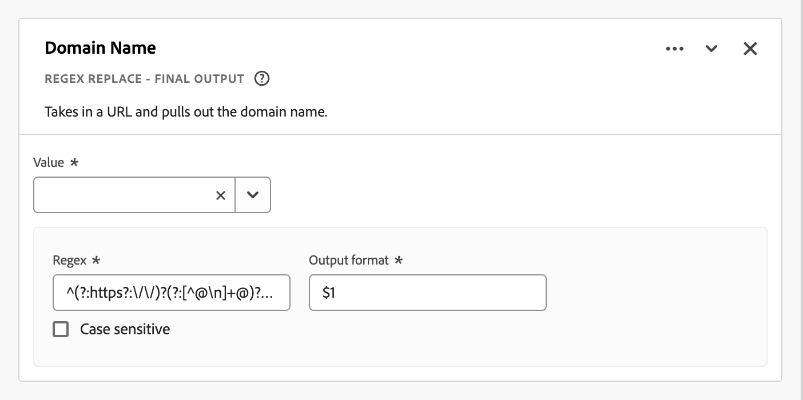
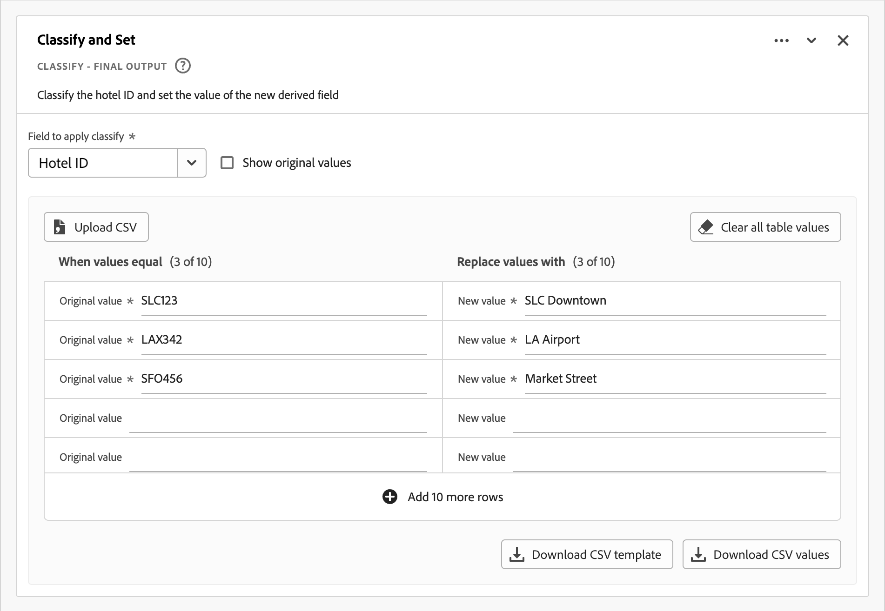
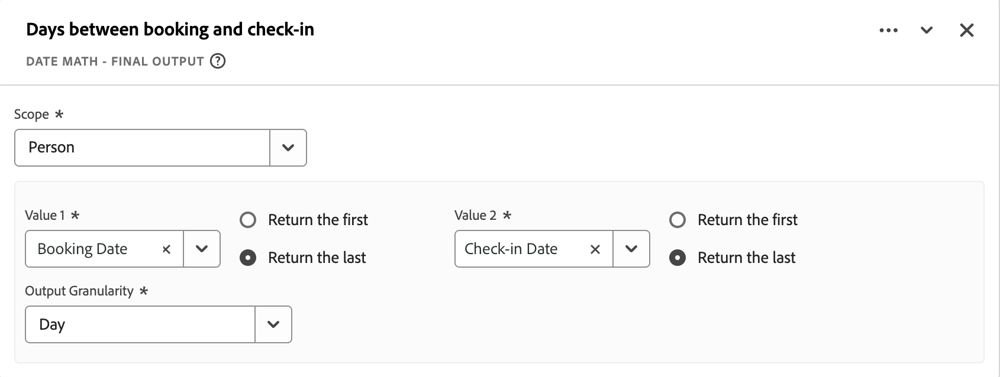
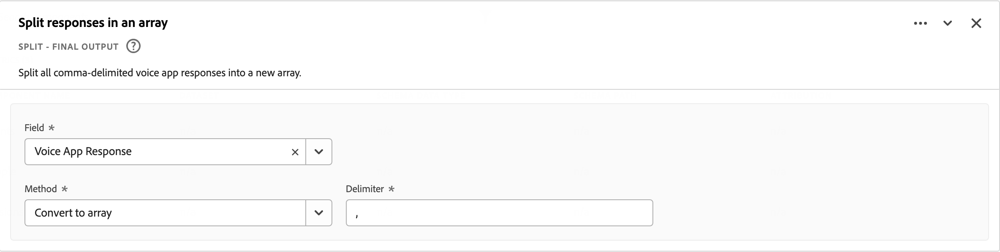
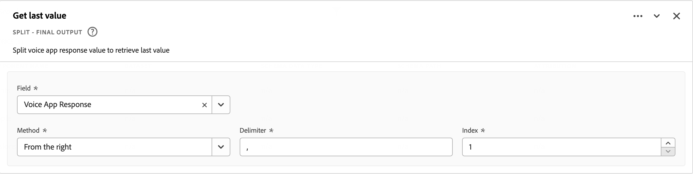

# Campos derivados {#derived-fields}

>[!CONTEXTUALHELP]
>id="dataview_derivedfields"
>title="Campos derivados"
>abstract="Um campo derivado permite definir manipulações de dados a qualquer momento por meio de um criador de regras personalizável. Em seguida, você pode usar esse campo derivado como um componente (métrica ou dimensão) no Workspace ou até mesmo definir como um componente na visualização de dados."

Os campos derivados são um aspecto importante da funcionalidade de relatórios em tempo real do Adobe Customer Journey Analytics. Um campo derivado permite definir manipulações de dados (muitas vezes complexas) a qualquer momento, por meio de um criador de regras personalizável. Em seguida, você pode usar esse campo derivado como um componente (métrica ou dimensão) no [Workspace](../../analysis-workspace/home.md) ou até mesmo defini-lo como um componente na [Visualização de dados](../data-views.md).

Os campos derivados podem economizar uma quantidade significativa de tempo e esforço, em comparação com a transformação ou manipulação de dados em outros locais fora do Customer Journey Analytics. Como a [Preparação de dados](https://experienceleague.adobe.com/pt-br/docs/experience-platform/data-prep/home), o [Destilador de dados](https://experienceleague.adobe.com/pt-br/docs/experience-platform/query/data-distiller/overview) ou nos seus próprios processos de ETL (extração, transformação, carga) / ELT (extração, carga, transformação).

Os campos derivados são definidos na [Visualizações de dados](../data-views.md), baseados em um conjunto de funções definidas como regras e aplicados a campos padrão e/ou campos do esquema disponíveis.

>[!NOTE]
>
>[Os componentes padrão](../component-reference.md) estão vinculados e associados aos conjuntos de dados do evento. Como resultado, os componentes padrão usados como parte de um campo derivado só funcionam com base nos dados de um conjunto de dados de evento.
>

Exemplos de casos de uso:

- Defina um campo “Nome da página” derivado que corrija valores incorretos do nome da página coletado para corrigir os valores do nome da página.

- Defina um campo “Canal de marketing” derivado que determine o canal de marketing adequado com base em uma ou mais condições (por exemplo, parâmetro de URL, URL da página, nome da página).

Os componentes padrão são compatíveis somente com conjuntos de dados de evento em campos derivados.

## Interface de campos derivados {#interface}

Ao criar ou editar um campo derivado, você usa a interface de campos derivados.

|  | Nome | Descrição |
|---------|----------|--------|
| 1 | **Selector** | Use a área do seletor para selecionar, arrastar e soltar a sua função, modelo de função, campo do esquema ou campo padrão no construtor de regras.  Use o menu suspenso para selecionar entre:   [!UICONTROL Funções]: lista as [funções](#function-reference) disponíveis;   [!UICONTROL Modelos de função]: lista os [Modelos de função](#function-templates) disponíveis;   [!UICONTROL Campos do esquema]: lista os campos disponíveis a partir de categorias de conjunto de dados (evento, perfil, pesquisa) e campos derivados definidos anteriormente; e   [!UICONTROL Campos padrão]: campos padrão disponíveis (como ID do conjunto de dados da Platform). Somente os campos padrão de strings e números são exibidos no seletor. Se a função permitir outros tipos de dado, os campos padrão com esses outros tipos de dado poderão ser selecionados para valores ou campos na interface de regras. É possível pesquisar por função, modelos de função, campos do esquema e campos padrão, utilizando-se a caixa de pesquisa .  Você pode filtrar a lista de objetos selecionados por meio de  Filtrar e especificar filtros na caixa de diálogo [!UICONTROL Filtrar campos por]. Você pode remover filtros facilmente por meio do  de cada filtro. |
| 2 | **Construtor de regras** | Você cria o campo derivado sequencialmente com base em uma ou mais regras. Uma regra é uma implementação específica de uma função e, portanto, sempre está associada a apenas uma função. Para criar uma regra, arraste e solte uma função no construtor de regras. O tipo de função determina a interface da regra. Consulte [Interface da regra](#rule-interface) para mais informações.  É possível inserir uma função no início, fim ou entre regras já disponíveis no construtor de regras. A última regra no construtor de regras determina a saída final do campo derivado. |
| 3 | **[!UICONTROL **&#x200B; Configurações do campo &#x200B;**]** | É possível nomear e descrever o campo derivado e inspecionar seu tipo de campo. |
| 4 | **[!UICONTROL **&#x200B; Saída final &#x200B;**]** | Esta área mostra uma visualização atualizada dinamicamente dos valores de saída com base nos dados dos últimos 30 dias e nas alterações feitas no campo derivado no construtor de regras. |

{style="table-layout:auto"}

## Assistente de modelos de campo {#wizard}

Quando você acessa a interface de campos derivados pela primeira vez, o assistente [!UICONTROL Iniciar com um modelo de campo] é exibido.

1. Selecione o modelo que melhor descreva o tipo de campo que você está tentando criar.
2. Clique no botão **[!UICONTROL **&#x200B; Selecionar &#x200B;**]** para continuar.

A caixa de diálogo de campos derivados é preenchida com as regras (e funções) necessárias ou úteis para o tipo de campo selecionado. Consulte [Modelos de função](#function-templates) para mais informações sobre os modelos disponíveis.

## Interface de regras {#rules}

Para definir uma regra no construtor de regras, use a interface de regras.

|  | Nome | Descrição |
|---------|----------|--------|
| A | **Nome da regra** | Por padrão, o nome da regra é **Regra X** (X refere-se a um número de sequência). Para editar o nome de uma regra, selecione-o e digite o novo nome, como `Query Parameter`. |
| B | **Nome da função** | O nome de função selecionado para a regra, como [!UICONTROL URL PARSE]. Quando a função é a última da sequência de funções e determina os valores da saída final, o nome da função é seguido por [!UICONTROL - FINAL OUTPUT]; por exemplo, [!UICONTROL URL PARSE - FINAL OUTPUT].   Para mostrar uma janela pop-up com mais informações sobre a função, selecione o . |
| C | **Descrição da regra** | Também é possível adicionar uma descrição a uma regra. Selecione o  e **[!UICONTROL ** Adicionar descrição **]** para adicionar uma descrição, ou **[!UICONTROL **&#x200B; Editar descrição &#x200B;**]** para editar uma descrição existente. Use o editor para inserir uma descrição. Você pode usar a barra de ferramentas para formatar o texto (utilizando o seletor de estilo, negrito, itálico, sublinhado, direita, esquerda, centralizado, cor, lista numerada, lista com marcadores) e adicionar links para informações externas.  Para concluir a edição da descrição, clique fora do editor. |
| D | **Área da função** | Define a lógica da função. A interface depende do tipo de função. O menu suspenso do [!UICONTROL Campo] ou [!UICONTROL Valor] mostra todas as categorias de campos (regras, campos padrão, campos) disponíveis, com base no tipo de entrada que a função espera. Alternativamente, você pode arrastar e soltar um campo do seletor de campos do esquema e campos padrão em um campo ou valor. Quando esse campo arrastado advém de um conjunto de dados de pesquisa, uma função de pesquisa é inserida automaticamente antes da função definida.  Consulte [Referência da função](#function-reference) para informações detalhadas sobre cada uma das funções permitidas. |

{style="table-layout:auto"}

## Criar um campo derivado {#create}

1. Selecione uma visualização de dados existente ou crie uma visualização de dados. Consulte [Visualizações de dados](../data-views.md) para mais informações.

2. Selecione a guia **[!UICONTROL **&#x200B; Componentes &#x200B;**]** da visualização de dados.

3. Selecione **[!UICONTROL **&#x200B; Criar campo derivado &#x200B;**]** no painel esquerdo.

4. Para definir o campo derivado, use a interface [!UICONTROL Criar campo derivado]. Consulte [Interface de campos derivados](#derived-field-interface).

   Para salvar o novo campo derivado, selecione **[!UICONTROL **&#x200B; Salvar &#x200B;**]**.

5. O novo campo derivado é adicionado ao container [!UICONTROL Campos derivados >] como parte dos **[!UICONTROL **&#x200B; Campos do esquema &#x200B;**]** no painel esquerdo da visualização de dados.

## Editar um campo derivado {#edit}

1. Selecione uma visualização de dados existente. Consulte [Visualizações de dados](../data-views.md) para mais informações.

2. Selecione a guia **[!UICONTROL **&#x200B; Componentes &#x200B;**]** da visualização de dados.

3. Selecione a guia **[!UICONTROL **&#x200B; Campos do esquema &#x200B;**]** no painel [!UICONTROL Conexão] à esquerda.

4. Selecione o container **[!UICONTROL **&#x200B; Campos derivados >**]**.

5. Passe o mouse sobre o campo derivado que você deseja editar e selecione o .

6. Para editar o campo derivado, use a interface [!UICONTROL Editar campo derivado]. Consulte [Interface de campos derivados](#derived-field-interface).

   - Selecione **[!UICONTROL **&#x200B; Salvar &#x200B;**]** para salvar o campo derivado atualizado.

   - Selecione **[!UICONTROL **&#x200B; Cancelar &#x200B;**]** para cancelar todas as alterações feitas no campo derivado.

   - Selecione **[!UICONTROL **&#x200B; Salvar como &#x200B;**]** para salvar o campo derivado como um novo campo derivado. O novo campo derivado tem o mesmo nome que o campo derivado editado original, com a adição de `(copy)`.

Alternativamente, se você tiver usado um campo derivado como um componente para dimensões ou métricas na visualização de dados:

1. Selecione o componente. Observe que o componente pode ter um nome diferente do seu campo derivado.

1. No painel “Componente”, selecione o  ao lado do campo derivado, abaixo do nome do campo do esquema.

1. Para editar o campo derivado, use a interface [!UICONTROL Editar campo derivado]. Consulte [Interface de campos derivados](#derived-field-interface).

   - Selecione **[!UICONTROL **&#x200B; Salvar &#x200B;**]** para salvar o campo derivado atualizado.

   - Selecione **[!UICONTROL **&#x200B; Cancelar &#x200B;**]** para cancelar todas as alterações feitas no campo derivado.

   - Selecione **[!UICONTROL **&#x200B; Salvar como &#x200B;**]** para salvar o campo derivado como um novo campo derivado. O novo campo derivado tem o mesmo nome que o campo derivado editado original, com a adição de `(copy)`.

## Excluir um campo derivado {#delete}

1. Selecione uma visualização de dados existente. Consulte [Visualizações de dados](../data-views.md) para mais informações.

2. Selecione a guia **[!UICONTROL **&#x200B; Componentes &#x200B;**]** da visualização de dados.

3. Selecione a guia **[!UICONTROL **&#x200B; Campos do esquema &#x200B;**]** no painel [!UICONTROL Conexão].

4. Selecione o container **[!UICONTROL **&#x200B; Campos derivados >**]**.

5. Passe o mouse sobre o campo derivado que você deseja excluir e selecione o .

6. Na interface [!UICONTROL Editar campo derivado], selecione **[!UICONTROL Excluir]**.

   A caixa de diálogo [!UICONTROL Excluir componente] solicita que você confirme a exclusão. Considere todas as referências externas que possam existir ao campo derivado fora da visualização de dados.

   - Selecione **[!UICONTROL **&#x200B; Continuar &#x200B;**]** para excluir o campo derivado.

Alternativamente, se você tiver usado um campo derivado como um componente para dimensões ou métricas na visualização de dados:

1. Selecione o componente. Observe que o componente pode ter um nome diferente do seu campo derivado.

1. No painel “Componente”, selecione o  ao lado do campo derivado, abaixo do nome do campo do esquema.

1. Na interface [!UICONTROL Editar campo derivado], selecione **[!UICONTROL Excluir]**.

   A caixa de diálogo [!UICONTROL Excluir componente] solicita que você confirme a exclusão. Considere todas as referências externas que possam existir ao campo derivado fora da visualização de dados.

   - Selecione **[!UICONTROL **&#x200B; Continuar &#x200B;**]** para excluir o campo derivado.

>[!NOTE]
>
>Os campos derivados são gerenciados na camada da conexão no Customer Journey Analytics. Qualquer alteração feita em um campo derivado em qualquer uma das visualizações de dados associadas a essa conexão se aplicará a todas essas visualizações de dados associadas.

## Modelos de função {#templates}

Para criar um campo derivado rapidamente para casos de uso específicos, os modelos de função estão disponíveis. Esses modelos de função podem ser acessados na área do seletor, na interface de campos derivados, ou aparecem durante o primeiro uso do assistente [!UICONTROL Comece com um modelo de campo].

### Canais de marketing {#mchannel}

Este modelo de função usa uma coleção de regras para criar canais de marketing.

+++ Detalhes

Para usar o modelo, é necessário especificar os parâmetros corretos para cada função listada como parte das regras no modelo. Consulte [Referência da função](#function-reference) para mais informações.

+++

### Rejeições {#bounces}

Este modelo de função usa uma coleção de regras para identificar rejeições do site.

+++ Detalhes

{{select-package}}

Para usar o modelo, é necessário especificar os parâmetros corretos para cada função listada como parte das regras no modelo. Consulte [Referência da função](#function-reference) para mais informações.

+++

### Combinação de várias dimensões {#multi-dim}

Este modelo de função combina dois valores em um.

+++ Detalhes

{{select-package}}

Para usar o modelo, é necessário especificar os parâmetros corretos para cada função listada como parte das regras no modelo. Consulte [Referência da função](#function-reference) para mais informações.

+++

### Nome amigável do conjunto de dados {#friendlyname}

Este modelo de função fornece um nome legível para o conjunto de dados.

+++ Detalhes

{{select-package}}

Para usar o modelo, é necessário especificar os parâmetros corretos para cada função listada como parte das regras no modelo. Consulte [Referência da função](#function-reference) para mais informações.

+++

### Nome da página do URL {#pagename}

Este modelo de função cria um nome simples para a página.

+++ Detalhes

{{select-package}}

Para usar o modelo, é necessário especificar os parâmetros corretos para cada função listada como parte das regras no modelo. Consulte [Referência da função](#function-reference) para mais informações.

+++

### Temporada de feriados {#holiday}

Este modelo de função classifica os principais momentos do ano.

+++ Detalhes

{{select-package}}

Para usar o modelo, é necessário especificar os parâmetros corretos para cada função listada como parte das regras no modelo. Consulte [Referência da função](#function-reference) para mais informações.

+++

### Metas mensais {#goals}

Este modelo de função define metas mensais personalizadas.

+++ Detalhes

{{select-package}}

Para usar o modelo, é necessário especificar os parâmetros corretos para cada função listada como parte das regras no modelo. Consulte [Referência da função](#function-reference) para mais informações.

+++

### Obter todos os valores na lista delimitada {#allvalues}

Este modelo de função converte uma lista limitada em uma matriz.

+++ Detalhes

{{select-package}}

Para usar o modelo, é necessário especificar os parâmetros corretos para cada função listada como parte das regras no modelo. Consulte [Referência da função](#function-reference) para mais informações.

+++

### Obter o primeiro valor na lista delimitada {#firstvalue}

Este modelo de função obtém o primeiro valor de uma lista delimitada.

+++ Detalhes

{{select-package}}

Para usar o modelo, é necessário especificar os parâmetros corretos para cada função listada como parte das regras no modelo. Consulte [Referência da função](#function-reference) para mais informações.

+++

### Obter o último valor na lista delimitada {#lastvalue}

Este modelo de função obtém o último valor de uma lista delimitada.

+++ Detalhes

{{select-package}}

Para usar o modelo, é necessário especificar os parâmetros corretos para cada função listada como parte das regras no modelo. Consulte [Referência da função](#function-reference) para mais informações.

+++

### Nome do Domínio {#domain}

Este modelo de função extrai o nome de domínio por meio de uma expressão regular.

+++ Detalhes

{{select-package}}

Para usar o modelo, é necessário especificar os parâmetros corretos para cada função listada como parte das regras no modelo. Consulte [Referência da função](#function-reference) para mais informações.

+++

### Obter parâmetro da string de consulta {#querystring}

Este modelo de função extrai valores da string de consulta.

+++ Detalhes

{{select-package}}

Para usar o modelo, é necessário especificar os parâmetros corretos para cada função listada como parte das regras no modelo. Consulte [Referência da função](#function-reference) para mais informações.

+++

### Campo de transição {#transition}

Este modelo de função faz a transição dos relatórios de um campo para outro.

+++ Detalhes

{{select-package}}

Para usar o modelo, é necessário especificar os parâmetros corretos para cada função listada como parte das regras no modelo. Consulte [Referência da função](#function-reference) para mais informações.

+++

### Detecção de bots simples {#botdetection}

Este modelo de função implementa a identificação leve de bots.

+++ Detalhes

{{select-package}}

Para usar o modelo, é necessário especificar os parâmetros corretos para cada função listada como parte das regras no modelo. Consulte [Referência da função](#function-reference) para mais informações.

+++

### Link de saída {#exit}

Este modelo de função identifica o último link clicado em uma sessão.

+++ Detalhes

{{select-package}}

Para usar o modelo, é necessário especificar os parâmetros corretos para cada função listada como parte das regras no modelo. Consulte [Referência da função](#function-reference) para mais informações.

+++

### Link de download {#download}

Este modelo de função sinaliza links de download comuns.

+++ Detalhes

{{select-package}}

Para usar o modelo, é necessário especificar os parâmetros corretos para cada função listada como parte das regras no modelo. Consulte [Referência da função](#function-reference) para mais informações.

+++

### Latitude do estado {#state-latitude}

Este modelo de função obtém a latitude para um estado dos EUA com uma precisão de 5 dígitos.

+++ Detalhes

{{select-package}}

Para usar o modelo, é necessário especificar os parâmetros corretos para cada função listada como parte das regras no modelo. Consulte [Referência da função](#function-reference) para mais informações.

+++

### Longitude do estado {#state-longitude}

Este modelo de função obtém a longitude de um estado dos EUA com uma precisão de 5 dígitos.

+++ Detalhes

{{select-package}}

Para usar o modelo, é necessário especificar os parâmetros corretos para cada função listada como parte das regras no modelo. Consulte [Referência da função](#function-reference) para mais informações.

+++

<!--

+++ Data clean up template

>[!WARNING]
>
>Could not find any information on this template.
+++

-->

## Referência da função {#functionref}

{{select-package}}

Para cada função compatível, confira os detalhes abaixo sobre:

- especificações:
   - tipo de dado de entrada: tipo de dado compatível,
   - entrada: valores possíveis para a entrada,
   - operadores inclusos: operadores compatíveis com esta função (se houver),
   - limitações: limitações aplicáveis a esta função específica,
   - saída.

- casos de uso, incluindo:
   - dados antes de definir o campo derivado,
   - como definir o campo derivado,
   - dados após definir o campo derivado.

- restrições (se aplicável).

<!-- CASE WHEN -->

### Case When {#casewhen}

>[!CONTEXTUALHELP]
>id="dataview_derivedfields_casewhen"
>title="Case When"
>abstract="Esta função oferece a capacidade de aplicar condicionais com base em critérios definidos a partir de um ou mais campos. Esses critérios são usados para definir os valores no novo campo derivado, com base na sequência das condições."

Aplica condicionais com base em critérios definidos de um ou mais campos. Em seguida, esses critérios são usados para definir os valores em um novo campo derivado com base na sequência das condições.

+++ Detalhes

## Especificações {#casewhen-io}

| Tipo de dado de entrada | Entrada | Operadores inclusos | Limitações | Saída |
|---|---|---|---|---|
| <ul><li>String</li><li>Numérico</li><li>Data</li></ul> | <ul><li>Contêiner [!UICONTROL If], [!UICONTROL Else If]:
<ul><li>[!UICONTROL Valor]</li><ul><li>Regras</li><li>Campos padrão</li><li>Campos</li></ul><li>[!UICONTROL Critério] (consulte os operadores inclusos com base no tipo de valor selecionado)</li></ul></li><li>[!UICONTROL Em seguida, defina o valor como], [!UICONTROL Caso contrário, defina o valor como]:
<ul><li>[!UICONTROL Valor]</li><ul><li>Regras</li><li>Campos padrão</li><li>Campos</li></ul></ul></li></ul> | 
Strings
<ul><li>Igual a</li><li>Igual a qualquer termo</li><li>Contém a frase</li><li>Contém qualquer termo</li><li>Contém todos os termos</li><li>Começa com</li><li>Começa com qualquer termo</li><li>Termina com</li><li>Termina com qualquer termo</li><li>Não é igual a</li><li>Não é igual a nenhum termo</li><li>Não contém a frase</li><li>Não contém nenhum termo</li><li>Não contém todos os termos</li><li>Não começa com</li><li>Não começa com nenhum termo</li><li>Não termina com</li><li>Não termina com nenhum termo</li><li>Está definido</li><li>Não está definido</li></ul>
Numérico
<ul><li>Igual a</li><li>Não é igual a</li><li>É superior a</li><li>É superior ou igual a</li><li>É inferior a</li><li>É inferior ou igual a</li><li>Está definido</li><li>Não está definido</li></ul>
Datas
<ul><li>Igual a</li><li>Não é igual a</li><li>É posterior a</li><li>É posterior ou igual a</li><li>É anterior a</li><li>É anterior ou igual a</li><li>Está definido</li><li>Não está definido</li></ul> | <ul><li>Cinco funções por campo derivado</li><li>Duzentos [operadores](#operators) por campo derivado. Um exemplo de um operador único é “O domínio de referência contém Google”. </li></ul> | 
Novo campo derivado
 |

{style="table-layout:auto"}

## Caso de uso 1 {#casewhen-uc1}

Você quer definir regras para identificar vários canais de marketing, aplicando a lógica em cascata para definir um campo de canal de marketing com o valor correto:

- Se o referenciador for de um mecanismo de pesquisa e a página tiver um valor de sequência de consulta no qual `cid` contém `ps_`, o canal de marketing deverá ser identificado como uma [!DNL *Pesquisa paga*].
- Se o referenciador for de um mecanismo de pesquisa e a página não tiver a string de consulta `cid`, o canal de marketing deverá ser identificado como uma [!DNL *Pesquisa natural*].
- Se uma página tiver um valor da string de consulta no qual `cid` contém `em_`, o canal de marketing deverá ser identificado como um [!DNL *Email*].
- Se uma página tiver um valor da string de consulta no qual `cid` contém `ds_`, o canal de marketing deverá ser identificado como um [!DNL *Anúncio de exibição*].
- Se uma página tiver um valor da string de consulta no qual `cid` contém `so_`, o canal de marketing deverá ser identificado como um [!DNL *Social pago*].
- Se o referenciador for de um domínio de referência de [!DNL twitter.com], [!DNL facebook.com], [!DNL linkedin.com] ou [!DNL tiktok.com], o canal de marketing deverá ser identificado como um [!DNL *Social natural*].
- Se nenhuma das regras acima for correspondida, o canal de marketing deverá ser identificado como [!DNL *Outro referenciador*].

Caso o seu site receba os seguintes eventos de exemplo, contendo [!UICONTROL Referenciador] e [!UICONTROL URL da página], esses eventos deverão ser identificados da seguinte maneira:

| [!DNL Event] | [!DNL Referrer] | [!DNL Page URL] | [!DNL Marketing Channel] |
|:--:|----|----|----|
| 1 | `https://facebook.com` | `https://site.com/home` | [!DNL Natural Social] |
| 2 | `https://abc.com` | `https://site.com/?cid=ds_12345678` | [!DNL Display] |
| 3 | | `https://site.com/?cid=em_12345678` | [!DNL Email] |
| 4 | `https://google.com` | `https://site.com/?cid=ps_abc098765` | [!DNL Paid Search] |
| 5 | `https://google.com` | `https://site.com/?cid=em_765544332` | [!DNL Email] |
| 6 | `https://google.com` |  | [!DNL Natural Search] |

{style="table-layout:auto"}

### Dados anteriores a {#casewhen-uc1-databefore}

| [!DNL Referrer] | [!DNL Page URL] |
|----|----|
| `https://facebook.com` | `https://site.com/home` |
| `https://abc.com` | `https://site.com/?cid=ds_12345678` |
|  | `https://site.com/?cid=em_12345678` |
| `https://google.com` | `https://site.com/?cid=ps_abc098765` |
| `https://google.com` | `https://site.com/?cid=em_765544332` |
| `https://google.com` | |

{style="table-layout:auto"}

### Campo derivado {#casewhen-uc1-derivedfield}

Você define um campo derivado de `Marketing Channel`. Use as funções [!UICONTROL CASE WHEN] para definir regras que criem valores com base em valores existentes para os campos `Page URL` e `Referring URL`.

Observe o uso da função [!UICONTROL URL PARSE] para definir regras para obter os valores de `Page Url` e `Referring Url` antes da aplicação das regras [!UICONTROL CASE WHEN].

### Dados após {#casewhen-uc1-dataafter}

| [!DNL Marketing Channel] |
|----|
| [!DNL Natural Social] |
| [!DNL Display] |
| [!DNL Email] |
| [!DNL Paid Search] |
| [!DNL Email] |
| [!DNL Natural Search] |

{style="table-layout:auto"}

## Caso de uso 2 {#casewhen-uc2}

Você coletou diversas variações de pesquisa diferentes na sua dimensão [!DNL Product Finding Methods]. Para entender o desempenho geral da pesquisa em relação ao navegador, você precisa passar muito tempo combinando os resultados manualmente.

O seu site coleta os seguintes valores para a sua dimensão [!DNL Product Finding Methods]. No fim, todos esses valores indicam uma pesquisa.

| Valor coletado | Valor real |
|---|---|
| [!DNL search p13n_no] | [!DNL search] |
| [!DNL search p13n_yes] | [!DNL search] |
| [!DNL search refine p13n_no] | [!DNL search] |
| [!DNL search refine p13n_yes] | [!DNL search] |
| [!DNL search redirect p13n_yes] | [!DNL search] |
| [!DNL search-redirect] | [!DNL search] |

{style="table-layout:auto"}

### Dados anteriores a {#casewhen-uc2-databefore}

| [!DNL Product Finding Methods] |
|----|
| [!DNL search p13_no] |
| [!DNL search p13_yes] |
| [!DNL browse] |
| [!DNL search refine p13_no] |
| [!DNL search refine p13_yes] |
| [!DNL browse] |
| [!DNL search redirect p13_yes] |
| [!DNL search-redirect] |
| [!DNL browse] |

{style="table-layout:auto"}

### Campo derivado {#casewhen-uc2-derivedfield}

Você define um campo derivado de `Product Finding Methods (new)`. Você cria as seguintes regras [!UICONTROL CASE WHEN] no construtor de regras. Essas regras aplicam a lógica a todas as variações possíveis dos antigos valores do campo [!UICONTROL Métodos de descoberta de produtos] para `search` e `browse`, usando o critério [!UICONTROL Contém a frase].

### Dados após {#casewhen-uc2-dataafter}

| [!DNL Product Finding Methods (new)] |
|----|
| [!DNL search] |
| [!DNL search] |
| [!DNL browse] |
| [!DNL search] |
| [!DNL search] |
| [!DNL browse] |
| [!DNL search] |
| [!DNL search] |
| [!DNL browse] |

{style="table-layout:auto"}

## Caso de uso 3 {#casewhen-uc3}

Trabalhando para uma agência de viagens, você gostaria de medir a duração do percurso para viagens reservadas, para poder relatar a duração dos percursos por período.

Suposições:

- A organização está coletando a duração do percurso em um campo numérico.
- Ela gostaria de agrupar durações de um a três dias em um compartimento chamado “[!DNL short trip]”
- Ela gostaria de agrupar durações de quatro a sete dias em um compartimento chamado “[!DNL medium trip]”
- Eles gostariam de agrupar mais de oito dias em um compartimento chamado “[!DNL long trip]”
- 132 viagens foram reservadas por um período de um dia
- 110 viagens foram reservadas por um período de dois dias
- 105 viagens foram reservadas por um período de três dias
- 99 viagens foram reservadas por um período de quatro dias
- 92 viagens foram reservadas por um período de cinco dias
- 85 viagens foram reservadas por um período de seis dias
- 82 viagens foram reservadas por um período de sete dias
- 78 viagens foram reservadas por um período de oito dias
- 50 viagens foram reservadas por um período de nove dias
- 44 viagens foram reservadas por um período de 10 dias
- 38 viagens foram reservadas por um período de 11 dias
- 31 viagens foram reservadas por um período de 12 dias

O relatório desejado deve ficar assim:

| [!DNL Trip Duration Type] | [!DNL Bookings] |
|----|---:|
| [!DNL medium trip] | 358 |
| [!DNL short trip] | 347 |
| [!DNL long trip] | 241 |

{style="table-layout:auto"}

### Dados anteriores a {#casewhen-uc3-databefore}

| [!DNL Trip Duration] |
|---:|
| 1 |
| 12 |
| 3 |
| 6 |
| 4 |
| 8 |
| 6 |
| 2 |
| 1 |
| 2 |
| 21 |
| 8 |

### Campo derivado {#casewhen-uc3-derivedfield}

Você define um campo derivado de `Trip Duration (bucketed)`. Você cria a seguinte regra [!UICONTROL CASE WHEN] no construtor de regras. Essa regra aplica a lógica para agrupar os antigos valores do campo [!UICONTROL Duração da viagem] em três valores: `short trip`, `medium  trip` e `long trip`.

### Dados após {#casewhen-uc3-dataafter}

| [!DNL Trip Duration (bucketed)] |
|---|
| [!DNL short trip] |
| [!DNL long trip] |
| [!DNL short trip] |
| [!DNL medium trip] |
| [!DNL medium trip] |
| [!DNL long trip] |
| [!DNL medium trip] |
| [!DNL short trip] |
| [!DNL short trip] |
| [!DNL short trip] |
| [!DNL long trip] |
| [!DNL long trip] |

## Mais informações {#casewhen-more-info}

O Customer Journey Analytics usa uma estrutura de container aninhado baseada no [XDM](https://experienceleague.adobe.com/pt-br/docs/experience-platform/xdm/home) (Experience Data Model) da Adobe Experience Platform. Consulte [Contêineres](../create-dataview.md#containers) e [Contêineres de segmentos](/help/components/segments/seg-overview.md#containers) para obter mais informações sobre a tela de fundo. Este modelo de contêiner, embora flexível por natureza, impõe algumas restrições ao usar o construtor de regras.

O Customer Journey Analytics usa o seguinte modelo de container padrão:

As restrições a seguir aplicam-se e são impostas ao *selecionar* e *configurar* valores.

|  | Limitações |
|:---:|----|
| **A** | Os valores que você *seleciona* dentro da mesma construção [!UICONTROL If], [!UICONTROL Else If] (usando [!UICONTROL And] ou [!UICONTROL Or]) em uma regra devem advir do mesmo container e podem ser de qualquer tipo (string , numérico  e assim por diante).   |
| **B** | Todos os valores que você *define* em uma regra devem ser do mesmo container e do mesmo tipo, ou um valor derivado do mesmo tipo.    |
| **C** | Os valores que você *seleciona* em construções [!UICONTROL If], [!UICONTROL Else If] na regra *não* precisam advir do mesmo container e *não* precisam ser do mesmo tipo.    |

{style="table-layout:auto"}

+++

<!-- CLASSIFY -->

### Classificar {#classify}

>[!CONTEXTUALHELP]
>id="dataview_derivedfields_classify"
>title="Classificar"
>abstract="Esta função permite definir um conjunto de valores que são substituídos por valores correspondentes via inserção de texto."

Define um conjunto de valores que são substituídos por valores correspondentes em um novo campo derivado.

+++ Detalhes

## Especificações {#classify-io}

| Tipo de dado de entrada | Entrada | Operadores inclusos | Limitações | Saída |
|---|---|---|---|---|
| <ul><li>String</li><li>Numérico</li><li>Data</li></ul> | <ul><li>[!UICONTROL Campo a ser classificado]:<ul><li>Regras</li><li>Campos padrão</li><li>Campos</li></ul></li><li>[!UICONTROL Quando o valor for igual a] e [!UICONTROL Substituir valores por]:
<ul><li>String</li></ul><li>Mostrar valores originais<ul><li>Booleano</li></ul></li></ul> | 
N/A
 | <ul><li>Cinco funções por campo derivado</li><li>Duzentos [operadores](#operators) por campo derivado. Cada entrada para [!UICONTROL Quando o valor for igual ao valor original] [!UICONTROL Substituir valor por novo valor] é considerada uma operação.</li></ul> | 
Novo campo derivado
 |

{style="table-layout:auto"}

## Caso de uso 1 {#classify-uc1}

Você tem um arquivo CSV que inclui uma coluna de chaves para `hotelID` e uma ou mais colunas adicionais associadas a `hotelID`: `city`, `rooms`, `hotel name`.
Você está coletando [!DNL Hotel ID] em uma dimensão, mas gostaria de criar uma dimensão [!DNL Hotel Name] derivada de `hotelID` no arquivo CSV.

**Estrutura e conteúdo do arquivo CSV**

| [!DNL hotelID] | [!DNL city] | [!DNL rooms] | [!DNL hotel name] |
|---|---|---:|---|
| [!DNL SLC123] | [!DNL Salt Lake City] | 40 | [!DNL SLC Downtown] |
| [!DNL LAX342] | [!DNL Los Angeles] | 60 | [!DNL LA Airport] |
| [!DNL SFO456] | [!DNL San Francisco] | 75 | [!DNL Market Street] |
| [!DNL AMS789] | [!DNL Amsterdam] | 50 | [!DNL Okura] |

{style="table-layout:auto"}

**Relatório atual**

| [!DNL Hotel ID] | Visualizações de produtos |
|---|---:|
| [!DNL SLC123] | 200 |
| [!DNL LX342] | 198 |
| [!DNL SFO456] | 190 |
| [!DNL AMS789] | 150 |

{style="table-layout:auto"}

**Relatório desejado**

| [!DNL Hotel Name] | Visualizações de produtos |
|----|----:|
| [!DNL SLC Downtown] | 200 |
| [!DNL LA Airport] | 198 |
| [!DNL Market Street] | 190 |

{style="table-layout:auto"}

### Dados anteriores a {#classify-uc1-databefore}

| [!DNL Hotel ID] |
|----|
| [!DNL SLC123] |
| [!DNL LAX342] |
| [!DNL SFO456] |
| [!DNL AMS789] |

{style="table-layout:auto"}

### Campo derivado {#classify-uc1-derivedfield}

Você define um campo derivado de `Hotel Name`. Use a função [!UICONTROL CLASSIFY] para definir uma regra com base na qual você possa classificar os valores do campo [!UICONTROL ID do Hotel] e substituí-los por novos valores.

Se quiser incluir os valores originais que você não definiu como parte dos valores a serem classificados (por exemplo, ID do Hotel AMS789), selecione **[!UICONTROL Mostrar valores originais]**. Isso garante que o AMS789 faça parte da saída do campo derivado, apesar de esse valor não ser classificado.

### Dados após {#classify-uc1-dataafter}

| [!DNL Hotel Name] |
|----|
| [!DNL SLC Downtown] |
| [!DNL LA Airport] |
| [!DNL Market Street] |

{style="table-layout:auto"}

## Caso de uso 2 {#classify-uc2}

Você coletou URLs em vez do nome da página amigável para várias páginas. Essa coleta mista de valores causa rupturas nos relatórios.

### Dados anteriores a {#classify-uc2-databefore}

| [!DNL Page Name] |
|---|
| [!DNL Home Page] |
| [!DNL Flight Search] |
| `http://www.adobetravel.ca/Hotel-Search` |
| `https://www.adobetravel.com/Package-Search` |
| [!DNL Deals & Offers] |
| `http://www.adobetravel.ca/user/reviews` |
| `https://www.adobetravel.com.br/Generate-Quote/preview` |

{style="table-layout:auto"}

### Campo derivado {#classify-uc2-derivedfield}

Você define um campo derivado de `Page Name (updated)`. Use a função [!UICONTROL CLASSIFY] para definir uma regra segundo a qual você possa classificar os valores do campo [!UICONTROL Nome da página] existente e substituí-los por valores corretos atualizados.

### Dados após {#classify-uc2-dataafter}

| [!DNL Page Name (updated)] |
|---|
| [!DNL Home Page] |
| [!DNL Flight Search] |
| [!DNL Hotel Search] |
| [!DNL Package Search] |
| [!DNL Deals & Offers] |
| [!DNL Reviews] |
| [!DNL Generate Quote] |

## Mais informações {#classify-moreinfo}

A seguinte funcionalidade adicional está disponível na interface das regras de classificação:

- Para limpar rapidamente todos os valores da tabela, selecione  **[!UICONTROL Limpar todos os valores da tabela]**.
- Para carregar um arquivo CSV com os valores originais para quando os valores forem iguais e novos valores para a substituição de valores, selecione  **[!UICONTROL Carregar CSV]**.
- Para baixar um modelo e criar um arquivo CSV com os valores originais e novos para carregar, selecione  **[!UICONTROL Baixar modelo CSV]**.
- Para baixar um arquivo CSV com todos os valores originais e novos preenchidos na interface de regras, selecione  **[!UICONTROL Baixar valores CSV]**.

+++

<!-- CONCATENATE -->

### Concatenar {#concatenate}

<!-- markdownlint-disable MD034 -->

>[!CONTEXTUALHELP]
>id="dataview_derivedfields_concatenate"
>title="Concatenar"
>abstract="Esta função fornece a capacidade de combinar dois ou mais campos, campos derivados ou valores de string inseridos pelo usuário em um mesmo campo com delimitadores definidos"

<!-- markdownlint-enable MD034 -->

Combina valores de campos em um mesmo novo campo derivado com delimitadores definidos.

+++ Detalhes

## Especificações {#concatenate-io}

| Tipo de dado de entrada | Entrada | Operadores inclusos | Limitações | Saída |
|---|---|---|---|---|
| <ul><li>String</li></ul> | <ul><li>[!UICONTROL Valor]:<ul><li>Regras</li><li>Campos padrão</li><li>Campos</li><li>String</li></ul></li><li>[!UICONTROL Delimitador]:<ul><li>String</li></ul></li> </ul> | 
N/A
 | 
Duas funções por campo derivado
 | 
Novo campo derivado
 |

{style="table-layout:auto"}

## Caso de uso {#concatenate-uc}

Atualmente, você coleta códigos de aeroportos de origem e destino como campos separados. Você gostaria de combinar os dois campos em uma mesma dimensão separada por hífen (-). Assim, você pode analisar a combinação de origem e destino para identificar as principais rotas reservadas.

Suposições:

- Os valores de origem e destino são coletados em campos separados na mesma tabela.
- O usuário determina o uso do delimitador “-” entre os valores.

Imagine que as seguintes reservas ocorram:

- Cliente ABC123 reserva um voo entre Salt Lake City (SLC) e Orlando (MCO)
- Cliente ABC456 reserva um voo entre Salt Lake City (SLC) e Los Angeles (LAX)
- Cliente ABC789 reserva um voo entre Salt Lake City (SLC) e Seattle (SEA)
- Cliente ABC987 reserva um voo entre Salt Lake City (SLC) e San Jose (SJO)
- Cliente ABC654 reserva um voo entre Salt Lake City (SLC) e Orlando (MCO)

O relatório desejado deve ficar assim:

| Origem / Destino | Reservas |
|----|---:|
| SLC-MCO | 2 |
| SLC-LAX | 1 |
| SLC-SEA | 1 |
| SLC-SJO | 1 |

{style="table-layout:auto"}

### Dados anteriores a {#concatenate-uc-databefore}

| Origem | Destino |
|----|---:|
| SLC | MCO |
| SLC | LAX |
| SLC | SEA |
| SLC | SJO |
| SLC | MCO |

{style="table-layout:auto"}

### Campo derivado {#concatenate-derivedfield}

Você define um campo derivado de `Origin - Destination`. Use a função [!UICONTROL CONCATENAR] para definir uma regra para concatenar os campos [!UICONTROL Origem] e [!UICONTROL Destino] por meio do [!UICONTROL Delimitador] `-`.

### Dados após {#concatenate-dataafter}

| Origem - Destino (campo derivado) |
|---|
| SLC-MCO |
| SLC-LAX |
| SLC-SEA |
| SLC-SJO |
| SLC-MCO |

{style="table-layout:auto"}

+++

<!-- DATE MATH -->

### Matemática de data {#datemath}

>[!CONTEXTUALHELP]
>id="dataview_derivedfields_datemath"
>title="Matemática de data"
>abstract="Essa função permite descobrir a diferença entre dois campos de data ou data e hora. Os campos baseados em pessoas (dos conjuntos de dados de perfil) não têm opções para **[!UICONTROL Retornar o primeiro]** e **[!UICONTROL Retornar o último]**."

Retorna a diferença entre dois campos de datas ou de data e hora.

+++ Detalhes

## Especificações {#datemath-io}

| Tipo de dado de entrada | Entrada | Operadores inclusos | Limitações | Saída |
|---|---|---|---|---|
| <ul><li>Data</li><li>Data-hora</li></ul> | <ul><li>[!UICONTROL Escopo]<ul><li>Evento</li><li>Sessão</li><li>Pessoa</li></ul></li><li>[!UICONTROL Valor]:<ul><li>Data</li><li>Data/hora</li><li>Data estática (entrada do usuário)</li><li>Data e hora estáticas (entrada do usuário)</li><li>Data dinâmica<ul><li>Hoje</li></ul></li><li>Data e hora dinâmicas<ul><li>Agora</li></ul></li></ul></li><li>[!UICONTROL Granularidade]:<ul><li>Seconds</li><li>Minutes</li><li>Horas</li><li>Days</li><li>Weeks</li><li>Months</li><li>Trimestres</li><li>Anos</li></ul></li><li>Para cada retorno de Data ou Data e hora:<ul><li>Primeiro (dentro da sessão ou pessoa)</li><li>Último (dentro da sessão ou pessoa)</li></ul></li></ul> | 
N/A
 | 
Duas funções por campo derivado
 | 
Novo campo derivado
 |

{style="table-layout:auto"}

## Caso de uso 1 {#datemath-uc1}

Como analista de marketing de uma empresa de hotéis, você gostaria de entender a diferença do número de dias entre as datas de check-in dos clientes e as datas de reserva na última semana.

### Campo derivado {#datemath-uc1-derivedfield}

Você define um campo derivado de `Days between booking and check-in`. Use a função [!UICONTROL DATA MATH] para definir uma regra para calcular os dias do [!UICONTROL Escopo] [!DNL Person] entre a [!UICONTROL Data de Reserva] e a [!UICONTROL Data de Check-in]. Você seleciona [!UICONTROL Dia] como [!UICONTROL Granularidade da saída]. E você seleciona [!UICONTROL Retornar o último] para [!UICONTROL Data da reserva] e [!UICONTROL Data de check-in] para garantir que o valor de escopo da última pessoa seja usado no cálculo.

## Caso de uso 2 {#datemath-uc2}

Como analista de marketing de uma loja física, você quer entender quantos dias atrás foi a última visita de um cliente à loja. Você usa a funcionalidade de geolocalização em um aplicativo móvel e beacons na loja para capturar visitas físicas de clientes.

### Campo derivado {#datemath-uc2-derivedfield}

Você define um novo campo derivado de `Days Since Visit To Shop`. Use a função [!UICONTROL DATA MATH] para definir uma regra para calcular os dias entre uma Data-Hora Personalizada (que você especifica em [!UICONTROL Data]) e a [!UICONTROL Hora Local] (do grupo de campos [!UICONTROL placeContext] do conjunto de dados do evento) com um [!UICONTROL Escopo de desduplicação] de [!UICONTROL Pessoa]. Você seleciona [!UICONTROL Retornar o(s) último(s)] para garantir que o valor de escopo da última pessoa para [!UICONTROL Hora local] seja usado no cálculo. Você seleciona Dia como a [!UICONTROL Granularidade da saída].

Como alternativa, você pode usar o valor de conveniência de Intervalo de datas dinâmico Agora para calcular agora até a [!UICONTROL Hora local] (do grupo de campos [!UICONTROL placeContext] do conjunto de dados do evento)

## Caso de uso 3 {#datemath-uc3}

Você quer entender o tempo de pesquisa em minutos antes que um cliente em uma sessão faça um pedido.

Você define um novo campo derivado `Time Between Search And Order In Minutes` que é o resultado de duas funções [[!UICONTROL CASE WHEN]](#case-when) para definir valores de [!UICONTROL Tempo de Pesquisa] e [!UICONTROL Tempo de Pedido].
Em seguida, use esses dois valores para calcular a diferença com uma função [!UICONTROL DATE MATH] com [!UICONTROL Scope] definido como [!UICONTROL Session], valores definidos como [!UICONTROL Tempo de Pesquisa] e [!UICONTROL Tempo de Ordem] e [!UICONTROL Granularidade de saída] definidos como [!UICONTROL Minuto]. Para ambos os valores, selecione [!UICONTROL Retornar o primeiro] para garantir que o primeiro [!UICONTROL Tempo de Pesquisa] e o [!UICONTROL Tempo de Pedido] sejam retornados.

## Mais informações {#datemath-more-info}

As opções para [!UICONTROL Retornar o primeiro] ou [!UICONTROL Retornar o último] não estão disponíveis ao selecionar um campo com base em pessoa (de um conjunto de dados de perfil). Um campo baseado em pessoa pode ter apenas um valor para um campo Data ou Data-hora para uma pessoa.
+++

<!-- DEDUPLICATE -->

### Desduplicar {#dedup}

>[!CONTEXTUALHELP]
>id="dataview_derivedfields_deduplicate"
>title="Desduplicar"
>abstract="Esta função permite configurar um campo para contar apenas valores de forma não repetitiva na camada da sessão ou das pessoas. Além disso, uma ID de desduplicação pode ser usada para garantir que, com base em uma determinada ID (como uma ID de compra), apenas um valor seja usado (seja a primeira ou a última instância)."

Impede a contagem de um valor várias vezes.

+++ Detalhes

## Especificações {#deduplicate-io}

| Tipo de dado de entrada | Entrada | Operadores inclusos | Limitações | Saída |
|---|---|---|---|---|
| <ul><li>String</li><li>Numérico</li></ul> | <ul><li>[!UICONTROL Valor]:<ul><li>Regras</li><li>Campos padrão</li><li>Campos</li><li>String</li></ul></li><li>[!UICONTROL Escopo]:<ul><li>Pessoa</li><li>Sessão</li></ul></li><li>[!UICONTROL ID de desduplicação]:<ul><li>Regras</li><li>Campos padrão</li><li>Campos</li><li>String</li></ul><li>[!UICONTROL Valor a manter]:<ul><li>Manter a primeira instância</li><li>Manter a última instância</li></ul></li></ul> | 
N/A
 | 
Cinco funções por campo derivado
 | 
Novo campo derivado
 |

{style="table-layout:auto"}

## Caso de uso 1 {#deduplicate-uc1}

Você deseja evitar a contagem duplicada da receita quando um usuário recarregar a página de confirmação de reserva. Use o ID de confirmação da reserva no identificador para não contar a receita novamente quando recebida no mesmo evento.

### Dados anteriores a {#deduplicate-uc1-databefore}

| ID da confirmação da reserva | Receita |
|----|---:|
| ABC123456789 | 359 |
| ABC123456789 | 359 |
| ABC123456789 | 359 |

{style="table-layout:auto"}

### Campo derivado {#deduplicate-uc1-derivedfield}

Você define um campo derivado de `Booking Confirmation`. Você usa a função [!UICONTROL DEDUPLICATE] para definir uma regra para desduplicar o [!UICONTROL Valor] [!DNL Booking] do [!UICONTROL Escopo] [!DNL Person] por meio do [!UICONTROL ID de desduplicação] [!UICONTROL ID da confirmação da reserva]. Você seleciona [!UICONTROL Manter primeira instância] como [!UICONTROL Valor a manter].

### Dados após {#deduplicate-uc1-dataafter}

| ID da confirmação da reserva | Receita |
|----|---:|
| ABC123456789 | 359 |
| ABC123456789 | 0 |
| ABC123456789 | 0 |

{style="table-layout:auto"}

## Caso de uso 2 {#deduplicate-uc2}

Você usa eventos como um proxy para a taxa de cliques de campanhas de marketing externas. Recargas e redirecionamentos estão inflando a métrica de eventos. Você gostaria de desduplicar a dimensão do código de rastreamento, de modo que somente a primeira seja coletada, e minimizar a contagem excessiva de eventos.

### Dados anteriores a {#deduplicate-uc2-databefore}

| ID de visitante | Canal de marketing | Eventos |
|----|---|---:|
| ABC123 | pesquisa paga | 1 |
| ABC123 | pesquisa paga | 1 |
| ABC123 | pesquisa paga | 1 |
| DEF123 | email | 1 |
| DEF123 | email | 1 |
| JKL123 | pesquisa natural | 1 |
| JKL123 | pesquisa natural | 1 |

{style="table-layout:auto"}

### Campo derivado {#deduplicate-uc2-derivedfield}

Você define um novo campo derivado de `Tracking Code (deduplicated)`. Use a função [!UICONTROL DEDUPLICATE] para definir uma regra para desduplicar o [!UICONTROL Código de rastreamento] com um [!UICONTROL Escopo de desduplicação] da [!UICONTROL Sessão] e [!UICONTROL Manter a primeira instância] como o [!UICONTROL Valor a manter].

### Dados após {#deduplicate-uc2-dataafter}

| ID de visitante | Canal de marketing | Eventos |
|----|---|---:|
| ABC123 | pesquisa paga | 1 |
| DEF123 | email | 1 |
| JKL123 | pesquisa natural | 1 |

{style="table-layout:auto"}

+++

<!-- DEPTH -->

### Profundidade {#depth}

>[!CONTEXTUALHELP]
>id="dataview_derivedfields_depth"
>title="Profundidade"
>abstract="Essa função fornece a capacidade de retornar a profundidade de qualquer campo, sendo semelhante à funcionalidade do componente padrão de profundidade de evento."

Retorna a profundidade de um campo, semelhante ao que é possível com a [dimensão Profundidade do Evento padrão](/help/components/dimensions/overview.md#standard-dimensions) predefinida.

+++ Detalhes

## Especificações {#depth-io}

| Tipo de dado de entrada | Entrada | Operadores inclusos | Limitações | Saída |
|---|---|---|---|---|
| Qualquer | Qualquer campo | N/A | Três funções por campo derivado | Novo campo derivado |

{style="table-layout:auto"}

## Caso de uso {#depth-uc1}

Você deseja compreender a profundidade da pesquisa interna (que também pode ser interpretada como o número de pesquisas). Portanto, você pode usar essa profundidade de pesquisa interna posteriormente para detalhar o termo de pesquisa associado a uma profundidade de pesquisa específica.

### Campo derivado {#depth-uc1-derivedfield}

Você define um novo campo derivado de `Internal Search Depth`. Use a função [!UICONTROL DEPTH] para definir uma regra para recuperar a profundidade do [!UICONTROL Termo de Pesquisa Interna] e armazená-lo em um novo campo derivado.

E, em seguida, usar esse novo campo derivado em uma visualização para analisar qual termo foi usado para pesquisar na primeira pesquisa.

+++

<!-- FIND AND REPLACE -->

### Localizar e substituir {#find-and-replace}

<!-- markdownlint-disable MD034 -->

>[!CONTEXTUALHELP]
>id="dataview_derivedfields_findandreplace"
>title="Localizar e substituir"
>abstract="Esta função permite localizar todos os valores em um campo selecionado e substituir esses valores por um valor diferente em um novo campo derivado."

Esta função permite encontrar todos os valores em um campo selecionado e substituí-los por um valor diferente em um novo campo derivado.

+++ Detalhes

## Especificações {#findreplace-io}

| Tipo de dado de entrada | Entrada | Operadores inclusos | Limitações | Saída |
|---|---|---|---|---|
| <ul><li>String</li></ul> | <ul><li>[!UICONTROL Valor]<ul><li>Regras</li><li>Campos padrão</li><li>Campos</li></ul></li><li>[!UICONTROL Localizar todos] [!UICONTROL e substituir todos por]:<ul><li>String</li></ul></li></ul></ul> | 
Strings
<ul><li>[!UICONTROL Localizar todos] [!UICONTROL e substituir todos por]</li></ul> | 
Cinco funções por campo derivado
 | 
Novo campo derivado
 |

{style="table-layout:auto"}

## Caso de uso {#findreplace-uc}

Você recebeu alguns valores malformados para o seu relatório de canais de marketing externos, como `email%20 marketing` em vez de `email marketing`. Esses valores malformados causam uma ruptura nos seus relatórios e dificultam a visualização do desempenho dos emails. Você deseja substituir `email%20marketing` por `email marketing`.

**Relatório original**

| [!DNL External Marketing Channels] | [!DNL Sessions] |
|---|--:|
| [!DNL email marketing] | 500 |
| [!DNL email %20marketing] | 24 |

{style="table-layout:auto"}

**Relatório preferido**

| [!DNL External Marketing Channels] | [!DNL Sessions] |
|---|--:|
| [!DNL email marketing] | 524 |

### Dados anteriores a {#findreplace-uc-databefore}

| [!DNL External Marketing] |
|----|
| [!DNL email marketing] |
| [!DNL email%20marketing] |
| [!DNL email marketing] |
| [!DNL email marketing] |
| [!DNL email%20marketing] |

{style="table-layout:auto"}

### Campo derivado {#findreplace-uc-derivedfield}

Você define um campo derivado de `Email Marketing (updated)`. Você usa a função [!UICONTROL LOCALIZAR E SUBSTITUIR] para definir uma regra para localizar e substituir todas as ocorrências de `email%20marketing` por `email marketing`.

### Dados após {#findreplace-uc-dataafter}

| [!DNL External Marketing (updated)] |
|----|
| [!DNL email marketing] |
| [!DNL email marketing] |
| [!DNL email marketing] |
| [!DNL email marketing] |
| [!DNL email marketing] |

{style="table-layout:auto"}

+++

<!-- LOOKUP -->

### Pesquisa {#lookup}

>[!CONTEXTUALHELP]
>id="dataview_derivedfields_lookup"
>title="Pesquisa"
>abstract="Esta função permite usar campos de um conjunto de dados de pesquisa com uma chave correspondente entre conjuntos de dados."

Valores de pesquisa que utilizam um campo de um conjunto de dados de pesquisa e retornam um valor em um novo campo derivado ou para processamento de regras adicional.

+++ Detalhes

## Especificação {#lookup-io}

| Tipo de dado de entrada | Entrada | Operadores inclusos | Limite | Saída |
|---|---|---|---|---|
| <ul><li>String</li><li>Numérico</li><li>Data</li></ul> | <ul><li>[!UICONTROL Campo para aplicar a pesquisa]:</li><ul><li>Regras</li><li>Campos padrão</li><li>Campos</li></ul><li>[!UICONTROL Conjunto de dados de pesquisa]</li><ul><li>Conjunto de dados</li></ul><li>[!UICONTROL Chave correspondente]<ul><li>Regras</li><li>Campos</li></ul></li><li>Valores a serem retornados<ul><li>Regras</li><li>Campos</li></ul></li></ul> | 
N/A
 | 
Três funções por campo derivado
 | 
Novo campo derivado ou valor para processamento adicional na próxima regra
 |

{style="table-layout:auto"}

## Caso de uso {#lookup-uc}

Você gostaria de pesquisar o nome da atividade com base no ID da atividade coletado quando os seus clientes clicaram em um banner personalizado exibido por meio do Adobe Target. Você quer usar um conjunto de dados de pesquisa com atividades do Analytics for Target (A4T) que contenham IDs de atividades e nomes de atividades.

### Conjunto de dados de pesquisa do A4T {#lookup-uc-lookup}

| ID da atividade | Nome da atividade |
|---|---|
| 415851 | Páginas de categoria de teste MVT |
| 415852 | Luma - Campanha Max 2022 |
| 402922 | Banners da página inicial |

{style="table-layout:auto"}

### Campo derivado {#lookup-uc-derivedfield}

Você define um campo derivado de `Activity Name`. Use a função [!UICONTROL PESQUISA] para definir uma regra para pesquisar o valor a partir dos dados coletados e especificados no campo [!UICONTROL Campo a ser aplicado à pesquisa] (por exemplo, **[!DNL ActivityIdentifier]**). Você seleciona o conjunto de dados de pesquisa na lista [!UICONTROL Conjunto de dados de pesquisa] (por exemplo, **[!DNL New CJA4T Activities]**). Em seguida, você seleciona o campo do identificador (por exemplo, **[!DNL ActivityIdentifier]**) na lista [!UICONTROL Chave correspondente] e o campo a ser retornado da lista [!UICONTROL Valores a retornar] (por exemplo, **[!DNL ActivityName]**).

## Mais informações {#lookup-more-info}

A função de pesquisa é aplicada no momento do relatório aos dados recuperados pelo Customer Journey Analytics a partir do conjunto de dados de pesquisa configurado como parte da conexão.

Você pode inserir rapidamente uma função de [!UICONTROL Pesquisa] no construtor de regras, que já contém uma ou mais funções.

1. Selecione **[!UICONTROL Campos do esquema]** no seletor.
1. Selecione o  **[!UICONTROL Conjuntos de dados de pesquisa]**.
1. Selecione o seu conjunto de dados de pesquisa e localize o campo que deseja usar para pesquisar.
1. Arraste e solte o campo de pesquisa em qualquer um dos campos de entrada disponíveis para uma função (por exemplo, “Case When”). Quando válida, uma caixa azul rotulada **[!UICONTROL + Adicionar]** permite soltar o campo e inserir automaticamente uma função de pesquisa antes da função na qual você soltou o campo de pesquisa. A função de pesquisa inserida é preenchida automaticamente com valores relevantes para todos os campos.
   

+++

<!-- LOWERCASE -->

### Minúsculas {#lowercase}

>[!CONTEXTUALHELP]
>id="dataview_derivedfields_lowercase"
>title="Minúsculas"
>abstract="Esta função converte todo o texto da string para valores em minúsculas."

Converte valores de um campo em minúsculas e armazena-os em um novo campo derivado.

+++ Detalhes

## Especificação {#lowercase-io}

| Tipo de dado de entrada | Entrada | Operadores inclusos | Limite | Saída |
|---|---|---|---|---|
| <ul><li>String</li><li>Numérico</li><li>Data</li></ul> | <ul><li>[!UICONTROL Campo]:</li><ul><li>Regras</li><li>Campos padrão</li><li>Campos</li></ul> | 
N/A
 | 
Duas funções por campo derivado
 | 
Novo campo derivado
 |

{style="table-layout:auto"}

## Caso de uso {#lowercase-uc}

Você gostaria de converter todos os nomes de produtos coletados em minúsculas para obter relatórios adequados.

### Dados anteriores a {#lowercase-uc-databefore}

| Nomes de produtos coletados | Visualizações de produtos |
|---|---:|
| Raquete de tênis | 35 |
| Raquete de Tênis | 33 |
| raquete de tênis | 21 |
| Taco de beisebol | 15 |
| Taco de Beisebol | 12 |
| taco de beisebol | 10 |

{style="table-layout:auto"}

### Campo derivado {#lowercase-uc-derivedfield}

Você define um campo derivado de `Product Names`. Use a função [!UICONTROL LOWERCASE] para definir uma regra para converter o valor do campo [!UICONTROL Nomes de produtos coletados] em minúsculas e armazená-lo no novo campo derivado.

### Dados após {#lowercase-uc-dataafter}

| Nomes de produtos | Visualizações de produtos |
|---|---|
| raquete de tênis | 89 |
| taco de beisebol | 37 |

{style="table-layout:auto"}

+++

<!-- MATH -->

### Matemática {#math}

>[!CONTEXTUALHELP]
>id="dataview_derivedfields_math"
>title="Matemática"
>abstract="Esta função permite executar operações matemáticas em um campo. A função pode ser usada para executar operações aritméticas básicas, como adição, subtração, multiplicação e divisão."

Use operadores matemáticos básicos (adicionar, subtrair, multiplicar, dividir e elevar a uma potência) em campos numéricos.

+++ Detalhes

## Especificação {#math-io}

| Tipo de dado de entrada | Entrada | Operadores inclusos | Limite | Saída |
|---|---|---|---|---|
| <ul><li>Numérico</li></ul> | <ul><li>Um ou vários campos numéricos</li><li>Um ou vários operadores (adicionar, subtrair, multiplicar, dividir, elevar a uma potência)</li><li>Valor da entrada do usuário</li></ul> | <ul><li>`+` (adicionar)</li><li>`-` (subtrair)</li><li>`*` (multiplicar)</li><li>`/` (dividir)</li><li>`^` (elevar a uma potência)</li></ul> | <ul><li>25 operações por campo derivado</li><li>Cinco funções matemáticas por campo derivado</li></ul> | 
Novo campo derivado
 |

{style="table-layout:auto"}

## Caso de uso {#math-uc}

Devido à inflação, você quer corrigir os números de receita dos dados de CRM assimilados com 5% de inflação.

### Dados anteriores a {#math-uc-databefore}

| ID do CRM | Receita anual |
|---|---:|
| 1234 | 35.070.000 |
| 4133 | 7.500.000 |
| 8110 | 10.980 |
| 2201 | 42.620 |

{style="table-layout:auto"}

### Campo derivado {#math-uc-derivedfield}

Você define um campo derivado de `Corrected Annual Revenue`. Use a função [!UICONTROL MATH] para definir uma regra que multiplica o número da receita anual original por 1,05.

### Dados após {#math-uc-dataafter}

| ID do CRM | Receita anual corrigida |
|---|---:|
| 1234 | 36.823.500 |
| 4133 | 7.875.000 |
| 8110 | 11.529,00 |
| 2201 | 44.751 |

{style="table-layout:auto"}

## Mais informações {#math-more-info}

Para criar uma fórmula:

1. Basta começar a digitar no campo “Fórmula”, e os campos numéricos que correspondem ao que você digitar aparecerão em um menu pop-up. Alternativamente, você pode arrastar e soltar um campo numérico a partir dos campos disponíveis no painel esquerdo.
   

1. Adicione o operando (por exemplo, `*` para multiplicar) seguido por outro campo ou um valor estático. Você pode usar parênteses para definir fórmulas mais complexas.

1. Para inserir um valor estático (por exemplo, `1.05`), digite o valor e selecione **[!UICONTROL Adicionar *x* como valor estático]** ou **[!UICONTROL Adicionar -*x* como valor estático negativo]** no menu pop-up.
   

1. Uma marca de seleção verde  indica se a sua fórmula matemática é válida; caso contrário, você verá um aviso  e a mensagem [!UICONTROL Expressão de fórmula inválida].
   

Há algumas considerações importantes ao trabalhar com números estáticos na função [!UICONTROL MATH]:

- Os valores estáticos precisam ser associados a um campo. Por exemplo, não é permitido usar a função [!UICONTROL MATH] somente com campos estáticos.
- Você não pode usar o operador de elevação a uma potência (`ˆ`) em um valor estático.
- Se você estiver usando vários valores estáticos em uma fórmula, esses valores estáticos deverão ser agrupados por meio de parênteses, para que a fórmula seja válida. Por exemplo:

   - Esta fórmula retorna um erro.
     

   - Esta fórmula é válida.
     

Use a função de matemática para cálculos baseados no nível de ocorrência. Use a função [Resumir](#summarize) para cálculos baseados em eventos, sessões ou escopos de pessoas.

+++

<!-- MERGE FIELDS -->

### Mesclar campos {#merge}

>[!CONTEXTUALHELP]
>id="dataview_derivedfields_mergefields"
>title="Mesclar campos"
>abstract="Esta função permite pegar valores de dois campos diferentes e incluir seus respectivos valores em uma mesma dimensão. A regra verifica primeiro se o primeiro valor foi definido. Caso contrário, ela usará o segundo valor, e assim por diante."

Mescla valores de dois campos diferentes em um novo campo derivado.

+++ Detalhes

## Especificação {#merge-fields-io}

| Tipo de dado de entrada | Entrada | Operadores inclusos | Limite | Saída |
|---|---|---|---|---|
| <ul><li>String</li><li>Numérico</li><li>Data</li></ul> | <ul><li>[!UICONTROL Campo]:</li><ul><li>Regras</li><li>Campos padrão</li><li>Campos</li></ul> | 
N/A
 | 
Cinco funções por campo derivado
 | 
Novo campo derivado
 |

{style="table-layout:auto"}

## Caso de uso {#merge-fields-uc}

Você gostaria de criar uma dimensão composta pelo campo do nome da página e pelo campo do motivo da chamada com a intenção de analisar a jornada entre canais.

### Dados anteriores a {#merge-fields-uc-databefore}

| Nome da página | Sessão | Visitantes |
|---|--:|--:|
| página de ajuda | 250 | 200 |
| página inicial | 500 | 250 |
| página de detalhes do produto | 300 | 200 |

{style="table-layout:auto"}

| Motivo da chamada | Sessão | Visitantes |
|---|--:|--:|
| perguntas sobre o meu pedido | 275 | 250 |
| alterar o meu pedido | 150 | 145 |
| problema com pedidos | 100 | 95 |

{style="table-layout:auto"}

### Campo derivado {#merge-fields-uc-derivedfield}

Você define um campo derivado de `Cross Channel Interactions`. Use a função [!UICONTROL MERGE FIELDS] para definir uma regra para mesclar os valores do campo [!UICONTROL Nome da página] e do campo [!UICONTROL Motivo da chamada], e armazená-los no novo campo derivado.

### Dados após {#merge-fields-uc-dataafter}

| Interações entre vários canais | Sessões | Visitantes |
|---|--:|--:|
| página inicial | 500 | 250 |
| página de detalhes do produto | 300 | 200 |
| perguntas sobre o meu pedido | 275 | 250 |
| página de ajuda | 250 | 200 |
| alterar o meu pedido | 150 | 145 |
| problema com pedidos | 100 | 95 |

{style="table-layout:auto"}

## Mais informações {#merge-fields-moreinfo}

É necessário selecionar o mesmo tipo de campo em uma regra de mesclar campos. Por exemplo, se você selecionar um campo de data, todos os outros campos que deseja mesclar devem ser campos de data.

+++

<!-- NEXT OR PREVIOUS -->

### Próximo ou anterior {#next-previous}

>[!CONTEXTUALHELP]
>id="dataview_derivedfields_nextprevious"
>title="Próximo ou anterior"
>abstract="Esta função permite observar o valor seguinte ou anterior coletado para um determinado campo."

Pega um campo como entrada e resolve o valor seguinte ou anterior desse campo dentro do escopo da sessão ou uso. Aplica-se apenas aos campos da tabela “Visita” e “Evento”.

+++ Detalhes

## Especificação {#prevornext-io}

| Tipo de dado de entrada | Entrada | Operadores inclusos | Limite | Saída |
|---|---|---|---|---|
| <ul><li>String</li><li>Numérico</li><li>Data</li></ul> | <ul><li>[!UICONTROL Campo]:</li><ul><li>Regras</li><li>Campos padrão</li><li>Campos</li></ul><li>[!UICONTROL Método]:<ul><li>Valor anterior</li><li>Próximo valor</li></ul></li><li>[!UICONTROL Escopo]:<ul><li>Pessoa</li><li>Sessão</li></ul></li><li>[!UICONTROL Índice]:<ul><li>Numérico</li></ul><li>[!UICONTROL Incluir repetições]:<ul><li>Booleano</li></ul></li></ul> | 
N/A
 | 
Três funções por campo derivado
 | 
Novo campo derivado
 |

{style="table-layout:auto"}

## Caso de uso {#prevornext-uc1}

Você gostaria de entender o **próximo** valor ou o valor **anterior** dos dados recebidos, considerando valores repetidos.

### Dados {#prevornext-uc1-databefore}

**Exemplo 1: tratar com repetições**

| Dados recebidos | Próximo valor Sessão Índice = 1 Incluir repetições | Próximo valor Sessão Índice = 1 NÃO incluir repetições | Valor anterior Sessão Índice = 1 Incluir repetições | Valor anterior Sessão Índice = 1 NÃO incluir repetições |
|---|---|---|---|---|
| página inicial | página inicial | pesquisa | *Nenhum valor* | *Nenhum valor* |
| página inicial | pesquisa | pesquisa | página inicial | *Nenhum valor* |
| pesquisa | pesquisa | detalhes do produto | página inicial | página inicial |
| pesquisa | detalhes do produto | detalhes do produto | pesquisa | página inicial |
| detalhes do produto | pesquisa | pesquisa | pesquisa | pesquisa |
| pesquisa | detalhes do produto | detalhes do produto | detalhes do produto | detalhes do produto |
| detalhes do produto | pesquisa | pesquisa | pesquisa | pesquisa |
| pesquisa | pesquisa | *Nenhum valor* | detalhes do produto | detalhes do produto |
| pesquisa | *Nenhum valor* | *Nenhum valor* | pesquisa | detalhes do produto |

{style="table-layout:auto"}

**Exemplo 2: tratar com repetições e valores em branco nos dados recebidos**

| Dados recebidos | Próximo valor Sessão Índice = 1 Incluir repetições | Próximo valor Sessão Índice = 1 NÃO incluir repetições | Valor anterior Sessão Índice = 1 Incluir repetições | Valor anterior Sessão Índice = 1 NÃO incluir repetições |
|---|---|---|---|---|
| página inicial | página inicial | pesquisa | *Nenhum valor* | *Nenhum valor* |
| página inicial | página inicial | pesquisa | página inicial | *Nenhum valor* |
| página inicial | pesquisa | pesquisa | página inicial | *Nenhum valor* |
| pesquisa | pesquisa | detalhes do produto | página inicial | página inicial |
|   |   |   |   |   |
| pesquisa | pesquisa | detalhes do produto | pesquisa | página inicial |
| pesquisa | detalhes do produto | detalhes do produto | pesquisa | página inicial |
| detalhes do produto | *Nenhum valor* | *Nenhum valor* | pesquisa | pesquisa |
|   |   |   |   |   |

{style="table-layout:auto"}

### Campo derivado {#prevnext-uc1-derivedfield}

Você define um campo derivado de `Next Value` ou `Previous value`. Use a função [!UICONTROL NEXT OR PREVIOUS] para definir uma regra que seleciona o campo [!UICONTROL Dados recebidos], seleciona [!UICONTROL Próximo valor] ou [!UICONTROL Valor anterior] como [!UICONTROL Método], [!UICONTROL Sessão] como Escopo e define o valor de [!UICONTROL Índice] como `1`.

## Mais informações {#prevnext-moreinfo}

Você só pode selecionar campos que pertençam à tabela “Visita” ou “Evento”.

[!UICONTROL Incluir repetições] determina como tratar valores repetidos para a função [!UICONTROL NEXT OU PREVIOUS].

- Incluir repetições considera os valores anteriores ou seguintes. Se a opção de [!UICONTROL Incluir repetições] for selecionada, ela ignorará qualquer repetição sequencial de valores anteriores ou seguintes à ocorrência atual.

- Linhas sem valores (em branco) de um campo selecionado não terão valores anteriores ou seguintes retornados como parte da saída da função [!UICONTROL NEXT OR PREVIOUS].

+++

<!-- REGEX REPLACE -->

### Substituição de Regex {#regex-replace}

>[!CONTEXTUALHELP]
>id="dataview_derivedfields_regexreplace"
>title="Substituição de Regex"
>abstract="Esta função permite extrair partes de uma string com base em expressões regulares."

Substitui um valor de um campo por meio de uma expressão regular em um novo campo derivado.

+++ Detalhes

## Especificação {#regex-replace-io}

| Tipo de dado de entrada | Entrada | Operadores inclusos | Limite | Saída |
|---|---|---|---|---|
| <ul><li>String</li><li>Numérico</li></ul> | <ul><li>[!UICONTROL Campo]:</li><ul><li>Regras</li><li>Campos padrão</li><li>Campos</li></ul></ul><ul><li>[!UICONTROL Regex]:</li><ul><li>String</li></ul></li><li>[!UICONTROL Formato de saída]:<ul><li>String</li></ul></ul><ul><li>Diferenciar maiúsculas de minúsculas</li><ul><li>Booleano</li></ul></li></ul></li> | 
N/A
 | 
Uma função por campo derivado
 | 
Novo campo derivado
 |

{style="table-layout:auto"}

## Caso de uso {#regex-replace-uc}

Você gostaria de coletar parte de um URL e usá-la como um identificador de página exclusivo para analisar o tráfego. Use `[^/]+(?=/$|$)` para que a expressão regular capte o fim do URL e `$1` como padrão de saída.

### Dados anteriores a {#regex-replace-uc-databefore}

| URL da página |
|---|
| `https://business.adobe.com/products/analytics/adobe-analytics-benefits.html` |
| `https://business.adobe.com/products/analytics/adobe-analytics.html` |
| `https://business.adobe.com/products/experience-platform/customer-journey-analytics.html` |
| `https://business.adobe.com/products/experience-platform/adobe-experience-platform.html` |

{style="table-layout:auto"}

### Campo derivado {#regex-replace-uc-derivedfield}

Você cria um campo derivado de `Page Identifier`. Use a função [!UICONTROL REGEX REPLACE] para definir uma regra para substituir o valor do campo [!UICONTROL URL de referência] por meio de um [!UICONTROL Regex] de `[^/]+(?=/$|$)` e um [!UICONTROL Formato de saída] de `$1`.

### Dados após {#regex-replace-uc-dataafter}

| Identificador da página |
|---|
| adobe-analytics-benefits.html |
| adobe-analytics.html |
| customer-journey-analytics.html |
| adobe-experience-platform.html |

## Mais informações {#regex-replace-more-info}

O CJA usa um subconjunto da sintaxe de regex Perl. As seguintes expressões são suportadas:

| Expressão | Descrição |
| --- | --- |
| `a` | Um caractere único `a`. |
| `a\|b` | Um caractere único `a` ou `b`. |
| `[abc]` | Um caractere único `a`, `b` ou `c`. |
| `[^abc]` | Qualquer caractere único exceto `a`, `b` ou `c`. |
| `[a-z]` | Qualquer caractere único no intervalo de `a`-`z`. |
| `[a-zA-Z0-9]` | Qualquer caractere único no intervalo de `a`-`z`, `A`-`Z` ou dígitos `0`-`9`. |
| `^` | Corresponde ao início da linha. |
| `$` | Corresponde ao final da linha. |
| `\A` | Início da sequência. |
| `\z` | Final da sequência. |
| `.` | Corresponde a qualquer caractere. |
| `\s` | Qualquer caractere invisível. |
| `\S` | Sem caracteres diferentes de invisíveis. |
| `\d` | Qualquer dígito. |
| `\D` | Qualquer não dígito. |
| `\w` | Qualquer letra, número ou sublinhado. |
| `\W` | Qualquer caractere que não seja da palavra. |
| `\b` | Qualquer limite da palavra. |
| `\B` | Qualquer caractere que não seja um limite de palavra. |
| `\<` | Início da palavra. |
| `\>` | Fim da palavra. |
| `(...)` | Capturar tudo delimitado. |
| `(?:...)` | Captura sem marcação. Impede que a correspondência seja referenciada na string de saída. |
| `a?` | Zero ou um de `a`. |
| `a*` | Zero ou mais de `a`. |
| `a+` | Um ou mais de `a`. |
| `a{3}` | Exatamente 3 de `a`. |
| `a{3,}` | 3 ou mais de `a`. |
| `a{3,6}` | Entre 3 e 6 de `a`. |

É possível usar essas sequências no [!UICONTROL Formato de saída] qualquer número de vezes e em qualquer ordem para alcançar a saída da string desejada.

| Sequência de espaço reservado de saída | Descrição |
| --- | --- |
| `$&` | Gera o que correspondeu à expressão inteira. |
| `$n` | Gera o que correspondeu à enésima subexpressão. Por exemplo, `$1` gera a primeira subexpressão. |
| ``$` `` | Gera o texto entre o fim da última correspondência encontrada (ou o início do texto, se nenhuma correspondência anterior tiver sido encontrada) e o início da correspondência atual. |
| `$+` | Gera o que correspondeu à última subexpressão marcada na expressão regular. |
| `$$` | Gera o caractere de string `"$"`. |

{style="table-layout:auto"}

+++

<!-- SPLIT -->

### Dividir {#split}

>[!CONTEXTUALHELP]
>id="dataview_derivedfields_split"
>title="Dividir"
>abstract="Esta função permite dividir um campo em vários campos com base em um delimitador."

Divide o valor de um campo em um novo campo derivado.

+++ Detalhes

## Especificação {#split-io}

| Tipo de dado de entrada | Entrada | Operadores inclusos | Limite | Saída |
|---|---|---|---|---|
| <ul><li>String</li><li>Numérico</li></ul> | <ul><li>[!UICONTROL Campo]:</li><ul><li>Regras</li><li>Campos padrão</li><li>Campos</li></ul></ul><ul><li>[!UICONTROL Método]:</li><ul><li>Da esquerda</li><li>Da direita</li><li>Converter em matriz</li></ul></li><li>Para o delimitador:<ul><li>String</li></ul><li>Para o índice:<ul><li>Numérico</li></ul></li> | 
N/A
 | 
Duas funções por campo derivado
 | 
Novo campo derivado
 |

{style="table-layout:auto"}

## Caso de uso 1 {#split-uc1}

Você coleta respostas do aplicativo de voz em uma lista delimitada em uma mesma dimensão. Você deseja que cada valor da lista seja um valor exclusivo no relatório de respostas.

### Dados anteriores a {#split-uc1-databefore}

| Respostas do aplicativo de voz | Eventos |
|---|--:|
| foi ótimo, fez total sentido, recomendarei aos outros | 1 |
| foi ótimo, um pouco confuso, recomendarei aos outros | 1 |
| não foi ótimo, muito confuso, não recomendarei aos outros | 1 |

{style="table-layout:auto"}

### Campo derivado {#split-u1-derivedfield}

Você cria um campo derivado de `Responses`. Use a função [!UICONTROL SPLIT] para definir uma regra para usar o método [!UICONTROL Converter em matriz] para converter os valores do campo [!UICONTROL Resposta do aplicativo de voz], usando `,` como [!UICONTROL Delimitador].

### Dados após {#split-uc1-dataafter}

| Respostas | Eventos |
|---|--:|
| foi ótimo | 2 |
| recomendarei aos outros | 2 |
| não foi ótimo | 1 |
| fez total sentido | 1 |
| um pouco confuso | 1 |
| muito confuso | 1 |
| não recomendarei aos outros | 1 |

{style="table-layout:auto"}

## Caso de uso 2 {#split-uc2}

Você coleta respostas do aplicativo de voz em uma lista delimitada em uma mesma dimensão. Você gostaria de colocar as respostas do primeiro valor da lista em sua própria dimensão. Você gostaria de colocar o último valor da lista em sua própria dimensão.

### Dados anteriores a {#split-uc2-databefore}

| Respostas | Eventos |
|---|--:|
| foi ótimo, fez total sentido, recomendarei aos outros | 1 |
| foi ótimo, um pouco confuso, recomendarei aos outros | 1 |
| não foi ótimo, muito confuso, não recomendarei aos outros | 1 |

{style="table-layout:auto"}

### Campo derivado {#split-u2-derivedfield}

Você cria um campo derivado de `First Response`. Use a função [!UICONTROL SPLIT] para definir uma regra para obter o primeiro valor do campo [!UICONTROL Respostas] à esquerda da resposta `,` como delimitador.

Você cria um campo derivado de `Second Response` para pegar o último valor do campo [!UICONTROL Respostas], selecionando da direita, 1 como delimitador e 1 como índice.

### Dados após {#split-uc2-dataafter}

| Primeira resposta | Eventos |
|---|--:|
| foi ótimo | 2 |
| não foi ótimo | 1 |

{style="table-layout:auto"}

| Segunda resposta | Eventos |
|---|--:|
| recomendarei aos outros | 2 |
| não recomendarei aos outros | 1 |

{style="table-layout:auto"}

+++

<!-- SUMMARIZE -->

### Resumir {#summarize}

>[!CONTEXTUALHELP]
>id="dataview_derivedfields_summarize"
>title="Resumir"
>abstract="Esta função permite agregar valores nos níveis de eventos, sessões ou pessoas. Dependendo do tipo do campo selecionado, opções diferentes estarão disponíveis."

Permite aplicar funções do tipo agregação a métricas ou dimensões nas camadas dos eventos, sessões e usuários.

+++ Detalhes

## Especificação {#summarize-io}

| Tipo de dado de entrada | Entrada | Operadores inclusos | Limite | Saída |
|---|---|---|---|---|
| <ul><li>String</li><li>Numérico</li><li>Data</li></ul> | <ul><li>Valor<ul><li>Regras</li><li>Campos padrão</li><li>Campos</li></ul></li><li>Métodos de resumo</li><li>Escopo<ul><li>Evento</li><li>Sessão</li><li>Pessoa</li></ul></li></ul> | <ul><li>Numérico<ul><li>MAX: retorna o maior valor de um conjunto de valores</li><li>MIN: retorna o menor valor de um conjunto de valores</li><li>MEDIAN: retorna o valor mediano de um conjunto de valores</li><li>MEAN: retorna o valor médio de um conjunto de valores</li><li>SUM: retorna a soma de um conjunto de valores</li><li>COUNT: retorna o número de valores recebidos</li><li>DISTINCT: retorna o conjunto de valores distintos</li></ul></li><li>Strings<ul><li>DISTINCT: retorna o conjunto de valores distintos</li><li>COUNT DISTINCT: retorna o número de valores distintos</li><li>MOST COMMON: retorna o valor da string recebido com mais frequência</li><li>LEAST COMMON: retorna o valor da string recebido com menos frequência</li><li>FIRST: o primeiro valor recebido; aplicável somente às tabelas de sessões e eventos</li><li>LAST: o último valor recebido; aplicável somente às tabelas de sessões e eventos</li></ul></li><li>Datas<ul><li>DISTINCT: retorna o conjunto de valores distintos</li><li>COUNT DISTINCT: retorna o número de valores distintos</li><li>MOST COMMON: retorna o valor da string recebido com mais frequência</li><li>LEAST COMMON: retorna o valor da string recebido com menos frequência</li><li>FIRST: o primeiro valor recebido; aplicável somente às tabelas de sessões e eventos</li><li>LAST: o último valor recebido; aplicável somente às tabelas de sessões e eventos</li><li>EARLIEST: o primeiro valor recebido (determinado pelo tempo); aplicável somente às tabelas de sessões e eventos</li><li>LATEST: o valor mais recente recebido (determinado pelo tempo); aplicável somente às tabelas de sessões e eventos</li></ul></li></ul> | Três funções por campo derivado | Novo campo derivado |

{style="table-layout:auto"}

## Caso de uso {#summarize-uc}

Você gostaria de categorizar a receita de adição ao carrinho em três categorias diferentes: pequena, média e grande. Isso permite analisar e identificar as características de clientes de alto valor.

### Dados anteriores a {#summarize-uc-databefore}

Suposições:

- A receita de adição ao carrinho é coletada como um campo numérico.

Casos:

- O ClienteABC123 adiciona US$ 35 ao carrinho para o ProdutoABC e, em seguida, adiciona separadamente o ProdutoDEF ao carrinho por US$ 75.
- O ClienteDEF456 adiciona US$ 50 ao carrinho para o ProdutoGHI e, separadamente, adiciona o ProdutoJKL ao carrinho por US$ 275.
- O ClienteGHI789 adiciona US$ 500 ao seu carrinho pelo ProdutoMNO.

Lógica:

- Se a receita de adição ao carrinho total de um visitante for inferior a US$ 150, ela será definida como pequena.
- Se a receita de adição ao carrinho total de um visitante for superior a US$ 150, mas inferior a US$ 500, ela será definida como média.
- Se a receita de adição ao carrinho total de um visitante for igual ou superior a US$ 500, ela será definida como grande.

Resultados:

- Total de receita adicionada ao carrinho de US$ 110 para CustomerABC123.
- Total de receita adicionada ao carrinho de US$ 325 para CustomerDEF456.
- Total de receita adicionada ao carrinho de US$ 500 para CustomerGHI789.

### Campo derivado {#summarize-uc-derivedfield}

Você cria um campo derivado `Add To Cart Revenue Size`. Você usa a função [!UICONTROL SUMMARIZE] e o [!UICONTROL Sum] [!UICONTROL Método de resumo] com o [!UICONTROL Escopo] definido como [!UICONTROL Pessoa] para somar os valores do campo [!UICONTROL cart_add]. Você usa uma segunda regra [!UICONTROL CASE WHEN] para dividir o resultado nos tamanhos de categorias da árvore.

### Dados após {#summarize-uc-dataafter}

| Tamanho da raceita adicionada ao carrinho | Visitantes |
|---|--:|
| Pequena | 1 |
| Médio | 1 |
| Grande | 1 |

{style="table-layout:auto"}

## Mais informações {#summarize-more-info}

Use a função Resumir para cálculos baseados em evento, sessão ou escopo de pessoa. Use a função [Matemática](#math) para cálculos baseados em nível de ocorrência.

+++

<!-- TRIM -->

### Cortar {#trim}

>[!CONTEXTUALHELP]
>id="dataview_derivedfields_trim"
>title="Cortar"
>abstract="Esta função permite aparar espaços em branco ou caracteres especiais do início ou do fim de uma string. Também é possível especificar o número de caracteres a serem usados para o valor retornado, seja do início ou do fim da string."

Corta espaços em branco, caracteres especiais ou número de caracteres do início ou do fim dos valores de campo em um novo campo derivado.

+++ Detalhes

## Especificação {#trim-io}

| Tipo de dado de entrada | Entrada | Operadores inclusos | Limite | Saída |
|---|---|---|---|---|
| <ul><li>String</li></ul> | <ul><li>[!UICONTROL Campo]<ul><li>Regras</li><li>Campos padrão</li><li>Campos</li></ul></li><li>Cortar espaço em branco</li><li>Cortar caracteres especiais<ul><li>Entrada de caracteres especiais</li></ul></li><li>Cortar a partir da esquerda<ul><li>De<ul><li>Início da string</li><li>Posição<ul><li>Nº da posição</li></ul></li><li>String<ul><li>Valor da string</li><li>Índice</li><li>Sinalizador para incluir string</li></ul></li></ul></li><li>Para<ul><li>Fim da string</li><li>Posição<ul><li>Nº da posição</li></ul></li><li>String<ul><li>Valor da string</li><li>Índice</li><li>Sinalizador para incluir string</li></ul></li><li>Extensão</li></ul></li></ul></li><li>Cortar a partir da direita<ul><li>De<ul><li>Fim da string</li><li>Posição<ul><li>Nº da posição</li></ul></li><li>String<ul><li>Valor da string</li><li>Índice</li><li>Sinalizador para incluir string</li></ul></li></ul></li><li>Para<ul><li>Início da string</li><li>Posição<ul><li>Nº da posição</li></ul></li><li>String<ul><li>Valor da string</li><li>Índice</li><li>Sinalizador para incluir string</li></ul></li><li>Extensão</li></ul></li></ul></li></ul> | 
N/A
 | 
Uma função por campo derivado
 | 
Novo campo derivado
 |

## Caso de uso 1 {#trim-uc1}

Você coleta dados do produto, porém esses dados contêm caracteres de espaço em branco ocultos que fragmentam os relatórios. Você gostaria de cortar facilmente qualquer espaço em branco em excesso

### Dados anteriores a {#trim-uc1-databefore}

| Identificação do produto | Eventos |
|---|--:|
| `"prod12356 "` | 1 |
| `"prod12356"` | 1 |
| `" prod12356"` | 1 |

{style="table-layout:auto"}

### Campo derivado {#trim-u1-derivedfield}

Você cria um campo derivado `Product Identifier`. Use a função [!UICONTROL TRIM] para definir uma regra para **[!UICONTROL Cortar espaço em branco]** do campo **[!UICONTROL ID do produto]**.

### Dados após {#trim-uc1-dataafter}

| Identificador do produto | Eventos |
|---|--:|
| `"prod12356"` | 3 |

{style="table-layout:auto"}

## Caso de uso 2 {#trim-uc2}

Os dados nos nomes de página coletados incluem alguns caracteres especiais incorretos no final do nome da página que devem ser removidos.

### Dados anteriores a {#trim-uc2-databefore}

| Nome | Eventos |
|---|--:|
| página inicial# | 1 |
| página inicial? | 1 |
| página inicial% | 1 |
| página inicial&amp; | 1 |
| página inicial/ | 1 |

{style="table-layout:auto"}

### Campo derivado {#trim-u2-derivedfield}

Você cria um campo derivado `Page Name`. Use a função [!UICONTROL TRIM] para definir uma regra para [!UICONTROL Cortar caracteres especiais] do campo [!UICONTROL Nome] usando [!UICONTROL Caracteres especiais] `#?%&/`.

### Dados após {#trim-uc2-dataafter}

| Nome da página | Eventos |
|---|--:|
| página inicial | 5 |

{style="table-layout:auto"}

## Caso de uso 3 {#trim-uc3}

Você coleta dados, incluindo uma storeID. A storeID contém o código de estado abreviado dos EUA como os dois primeiros caracteres. Você deseja usar somente esse código de estado em seus relatórios.

### Dados anteriores a {#trim-uc3-databefore}

| storeID | Eventos |
|---|--:|
| CA293842 | 1 |
| CA423402 | 1 |
| UT123418 | 1 |
| UT189021 | 1 |
| ID028930 | 1 |
| OR234223 | 1 |
| NV22342 | 1 |

{style="table-layout:auto"}

### Campo derivado {#trim-u3-derivedfield}

Você cria um campo derivado `Store Identifier`. Use a função [!UICONTROL TRIM] para definir uma regra para [!UICONTROL Truncar a partir da direita] o campo [!UICONTROL storeID] do fim da string para a posição `3`.

### Dados após {#trim-uc3-dataafter}

| Identificador da loja | Eventos |
|---|--:|
| CA | 2 |
| UT | 2 |
| ID | 1 |
| OR | 1 |
| NV | 1 |

{style="table-layout:auto"}

+++

<!-- TYPECASE -->

### Conversão de tipo {#typecast}

>[!CONTEXTUALHELP]
>id="dataview_derivedfields_typecast"
>title="Conversão de tipo"
>abstract="Essa função permite alterar o tipo de campo a qualquer momento para disponibilizá-lo para transformações adicionais no Customer Journey Analytics."

Altera o tipo de um campo para disponibilizá-lo para transformações adicionais no Customer Journey Analytics.

+++ Detalhes

## Especificações {#typecast-io}

| Tipo de dado de entrada | Entrada | Operadores inclusos | Limite | Saída |
|---|---|---|---|---|
| <ul><li>Numérico</li><li>Data</li><li>Data-hora</li><li>String</li></ul> | <ul><li>[!UICONTROL Campo] | 
<ul><li>Número inteiro<ul><li>Para string</li></ul></li><li>Duplo<ul><li>Para string<ul><li>Incluir o número de casas decimais a serem herdadas (máx. 5?)</li></ul></li><li>Para número inteiro</li></ul></li><li>Byte<ul><li>Para string</li></ul></li><li>Longo<ul><li>Para string</li></ul></li><li>Data<ul><li>Para string<ul><li>Fornecer a capacidade de definir o formato de saída</li></ul></li><li>Exemplos<ul><li>Data (exemplo de 7 de janeiro de 2025)<ul><li data-stringify-indent="1" data-stringify-border="0">DD-MM-AA<ul><li data-stringify-indent="2" data-stringify-border="0">Ex. 07-01-25</li></ul></li><li data-stringify-indent="1" data-stringify-border="0">DD-MM-AAAA<ul><li data-stringify-indent="2" data-stringify-border="0">Ex. 07-01-2025</li></ul></li><li data-stringify-indent="1" data-stringify-border="0">DD-MM-AA<ul><li data-stringify-indent="2" data-stringify-border="0">Ex. 01-07-25</li></ul></li><li data-stringify-indent="1" data-stringify-border="0">DD-MM-AAAA<ul><li data-stringify-indent="2" data-stringify-border="0">Ex. 01-07-2025</li></ul></li><li data-stringify-indent="1" data-stringify-border="0">DD-MM-AA<ul><li data-stringify-indent="2" data-stringify-border="0">Ex. 01-25-07</li></ul></li><li data-stringify-indent="1" data-stringify-border="0">DD-MM-AAAA<ul><li data-stringify-indent="2" data-stringify-border="0">Ex. 01-2025-07</li></ul></li><li data-stringify-indent="1" data-stringify-border="0">DD/MM/AA<ul><li data-stringify-indent="2" data-stringify-border="0">Ex. 07/01/25</li></ul></li><li data-stringify-indent="1" data-stringify-border="0">DD/MM/AAAA<ul><li data-stringify-indent="2" data-stringify-border="0">Ex. 07/01/2025</li></ul></li><li data-stringify-indent="1" data-stringify-border="0">DD/MM/AAAA<ul><li data-stringify-indent="2" data-stringify-border="0">Ex. 01/2025/07</li></ul></li><li data-stringify-indent="1" data-stringify-border="0">DD/MM/AA<ul><li data-stringify-indent="2" data-stringify-border="0">Ex. 01/25/07</li></ul></li><li data-stringify-indent="1" data-stringify-border="0">DD de MMM de AAAA<ul><li data-stringify-indent="2" data-stringify-border="0">Ex. quarta-feira, 7 de janeiro de 2025</li></ul></li></ul></li></ul></li></ul></li><li>Data-hora<ul><li>Para string<ul><li>Fornecer a capacidade de definir o formato de saída</li></ul></li><li>Exemplos<ul><li data-stringify-indent="0" data-stringify-border="0">Data e hora (exemplo de 7 de janeiro de 2025 em 1:30pm, 52 segundos)<ul><li data-stringify-indent="2" data-stringify-border="0">DD-MM-AAAA hhmmss<ul><li data-stringify-indent="3" data-stringify-border="0">Ex. 07-01-25 13:30:52</li></ul></li><li data-stringify-indent="2" data-stringify-border="0">hhmmss de MM-DD-YYYY<ul><li data-stringify-indent="3" data-stringify-border="0">Ex. 07-01-2025 13:30:52</li></ul></li><li data-stringify-indent="2" data-stringify-border="0">hhmmss DD-MM-AA<ul><li data-stringify-indent="3" data-stringify-border="0">Ex. 01-07-25 13:30:52</li></ul></li><li data-stringify-indent="2" data-stringify-border="0">DD-MM-AAAA hhmmss<ul><li data-stringify-indent="3" data-stringify-border="0">Ex. 01-07-2025 13:30:52</li></ul></li><li data-stringify-indent="2" data-stringify-border="0">DD-MM-AA hhmmss<ul><li data-stringify-indent="3" data-stringify-border="0">Ex. 01-25-07 13:30:52</li></ul></li><li data-stringify-indent="2" data-stringify-border="0">DD-MM-AAAA hhmmss<ul><li data-stringify-indent="3" data-stringify-border="0">Ex. 01-01-2025 13:30:52</li></ul></li><li data-stringify-indent="2" data-stringify-border="0">DD/MM/AA hhmmss<ul><li data-stringify-indent="3" data-stringify-border="0">Ex. 07/01/25 13:30:52</li></ul></li><li data-stringify-indent="2" data-stringify-border="0">DD/MM/AAAA hhmmss<ul><li data-stringify-indent="3" data-stringify-border="0">Ex. 07/01/2025 13:30:52</li></ul></li><li data-stringify-indent="2" data-stringify-border="0">DD/MM/AAAA hhmmss<ul><li data-stringify-indent="3" data-stringify-border="0">Ex. 01/2025/07 13:30:52</li></ul></li><li data-stringify-indent="2" data-stringify-border="0">AA/MM/DD hh:mm :ss<ul><li data-stringify-indent="3" data-stringify-border="0">Ex. 01/25/07 13:30:52</li></ul></li><li data-stringify-indent="2" data-stringify-border="0">DD de MMM de AAAA hhmmss<ul><li data-stringify-indent="3" data-stringify-border="0">Ex. 07 de janeiro de 2025 13:30:52</li></ul></li></ul></li></ul></li><li>String<ul><li>Para numérico<ul><li>Se tivermos valores que não são de natureza numérica, eles retornarão null.</li><li>Precisaremos que o usuário insira a precisão e a localidade a serem usadas. </li></ul></li></ul></li></ul></li></ul>
 | 
Três funções por campo derivado
 | 
Novo campo derivado
 |

{style="table-layout:auto"}

## Caso de uso 1 {#typecast-uc1}

Você tem um campo inteiro, altura da tela (por exemplo, device.screenHeight do conjunto de dados do evento), que gostaria de usar como uma dimensão baseada em sequência.

### Campo derivado {#typecast-uc1-derivedfield}

Você define um campo derivado `Screen Height`. Você usa a função [!UICONTROL TYPECAST] para definir uma regra para [!UICONTROL Typecast para] [!UICONTROL Cadeia de caracteres] o campo [!UICONTROL Altura da tela] e armazená-lo no novo campo derivado.

## Caso de uso 2 {#typecast-uc2}

Você deseja usar Receita em uma tabela de Coorte (que só suporta números inteiros), mas o campo Receita tem um tipo Duplo.

### Campo derivado {#typecast-uc2-derivedfield}

Você define um campo derivado `Revenue (integer)`. Você usa a função [!UICONTROL TYPECAST] para definir uma regra para [!UICONTROL Typecast para] [!UICONTROL Integer] o campo [!UICONTROL Revenue] e armazená-lo no novo campo derivado.

+++

<!-- URL PARSE -->

### Análise de URL {#urlparse}

>[!CONTEXTUALHELP]
>id="dataview_derivedfields_urlparse"
>title="Análise de URL"
>abstract="Esta função permite analisar diferentes partes de um URL, incluindo os parâmetros de host, caminho ou consulta."

Analisa diferentes partes de um URL, incluindo protocolo, host, caminho ou parâmetros de consulta.

+++ Detalhes

## Especificações {#urlparse-io}

| Tipo de dado de entrada | Entrada | Operadores inclusos | Limite | Saída |
|---|---|---|---|---|
| <ul><li>String</li></ul> | <ul><li>[!UICONTROL Campo]:</li><ul><li>Regras</li><li>Campos padrão</li><li>Campos</li></ul><li>[!UICONTROL Opção]:<ul><li>[!UICONTROL Obter protocolo]</li><li>[!UICONTROL Obter host]</li><li>[!UICONTROL Obter caminho]</li><li>[!UICONTROL Obter valor da string de consulta]<ul><li>[!UICONTROL Parâmetro de consulta]:<ul><li>String</li></ul></li></ul></li><li>[!UICONTROL Obter valor de hash]</li></ul></li></ul></li></ul> | 
N/A
 | 
Cinco funções por campo derivado
 | 
Novo campo derivado
 |

{style="table-layout:auto"}

## Caso de uso 1 {#urlparse-uc1}

Use o domínio referenciador somente a partir do URL de referência como parte do conjunto de regras de um canal de marketing.

### Dados anteriores a {#urlparse-uc1-databefore}

| [!DNL Referring URL] |
|----|
| `https://www.google.com/` |
| `https://duckduckgo.com/` |
| `https://t.co/` |
| `https://l.facebook.com/` |

{style="table-layout:auto"}

### Campo derivado {#urlparse-uc1-derivedfield}

Você define um campo derivado `Referring Domain`. Use a função [!UICONTROL URL PARSE] para definir uma regra para buscar o host do campo [!UICONTROL URL de referência] e armazená-lo no novo campo derivado.

### Dados após {#urlparse-uc1-dataafter}

| [!DNL Referrer Domain] |
|----|
| [!DNL www.google.com] |
| [!DNL duckduckgo.com] |
| [!DNL t.co] |
| [!DNL l.facebook.com] |

{style="table-layout:auto"}

## Caso de uso 2 {#urlparse-uc2}

Você deseja usar o valor do parâmetro `cid` de uma string de consulta em um [!DNL Page URL] como parte da saída de um relatório de código de rastreamento derivado.

### Dados anteriores a {#urlparse-uc2-databefore}

| [!DNL Page URL] |
|----|
| `https://www.adobe.com/?cid=abc123` |
| `https://www.adobe.com/?em=email1234&cid=def123` |
| `https://www.adobe.com/landingpage?querystring1=test&test2=1234&cid=xyz123` |

{style="table-layout:auto"}

### Campo derivado {#urlparse-uc2-derivedfield}

Você define um campo derivado `Query String CID`. Use a função [!UICONTROL URL PARSE] para definir uma regra para buscar o valor do parâmetro da string de consulta no campo [!UICONTROL URL da página], especificando `cid` como o parâmetro de consulta. O valor de saída é armazenado no novo campo derivado.

### Dados após {#urlparse-uc2-dataafter}

| [!DNL Query String CID] |
|----|
| [!DNL abc123] |
| [!DNL def123] |
| [!DNL xyz123] |

{style="table-layout:auto"}

+++

## Limitações

As seguintes limitações se aplicam à funcionalidade Campo derivado em geral:

- Você pode usar no máximo dez campos de esquema diferentes (sem incluir campos padrão) ao definir regras para um campo derivado.
   - A partir desse máximo de dez campos de esquema diferentes, somente um máximo de três campos de esquema de pesquisa ou esquema de perfil são permitidos.
- É possível ter um número máximo de campos derivados por conexão do Customer Journey Analytics, dependendo do pacote que você licenciar. Consulte a [Descrição do produto](https://helpx.adobe.com/br/legal/product-descriptions/customer-journey-analytics.html){target="_blank"} para obter mais informações.

### Resumo das limitações de função

| Função | Limitações |
|---|---|
| 
Case When
 | <ul><li>5 Funções Case When por campo derivado</li><li>200 [operadores](#operators) por campo derivado</li></ul> |
| 
Classificar
 | <ul><li>5 Classificar funções por campo derivado</li><li>200 [operadores](#operators) por campo derivado</li></ul> |
| 
Concatenar
 | <ul><li>2 Funções concatenadas por campo derivado</li><li>3 valores por função Concatenar</ul> |
| 
Matemática de data
 | <ul><li>2 funções Date Math por campo derivado</li></ul> |
| 
Desduplicar
 | <ul><li>5 Desduplicar funções por campo derivado</li></ul> |
| 
Profundidade
 | <ul><li>3 Função Profundidade por campo derivado</li></ul> |
| 
Localizar e Substituir
 | <ul><li>2 Funções Localizar e Substituir por campo derivado</li></ul> |
| 
Pesquisa
 | <ul><li>5 Funções de pesquisa por campo derivado</li></ul> |
| 
Minúsculas
 | <ul><li>2 Funções em minúsculas por campo derivado</li></ul> |
| 
Matemática
 | <ul><li>25 operações por campo derivado</li><li>Cinco funções matemáticas por campo derivado</li></ul> |
| 
Mesclar campos
 | <ul><li>2 Funções Mesclar campos por campo derivado</li></ul> |
| 
Próximo ou anterior
 | <ul><li>3 Funções Próximo ou Anterior por campo derivado</li></ul> |
| 
Substituição de Regex
 | <ul><li>1 Função Substituição de Regex por campo derivado</li></ul> |
| 
Dividir
 | <ul><li>2 funções de divisão por campo derivado</li></ul> |
| 
Resumir
 | <ul><li>3 Resumir funções por campo derivado</li></ul> |
| 
Cortar
 | <ul><li>1 Função Cortar por campo derivado</li></ul> |
| 
Conversão de tipo
 | <ul><li>3 funções Typecast por campo derivado</li></ul> |
| 
Análise de URL
 | <ul><li>5 Funções de análise de URL por campo derivado</li></ul> |

{style="table-layout:auto"}

### Operadores

Um operador em uma construção If ou Else If em uma função Case When é a combinação de um critério com o valor **one**. Cada valor adicional para o critério adiciona ao número de operadores.

Como exemplo, a condição abaixo usa 13 operadores.

Um operador na função Classificar é uma entrada única para [!UICONTROL Quando o valor for igual ao valor original] [!UICONTROL Substituir valor por novo valor].

Como exemplo, a regra Classificar abaixo usa 3 operadores.

## Mais informações {#trim-more-info}

[`Trim`](#trim) e [`Lowercase`](#lowercase) são recursos já disponíveis nas configurações de componente em [Exibições de dados](../component-settings/overview.md). Usar campos derivados permite combinar essas funções para fazer transformações de dados mais complexas diretamente no Customer Journey Analytics. Por exemplo, você pode usar `Lowercase` para remover a diferenciação entre maiúsculas e minúsculas em um campo de evento e, em seguida, usar [`Lookup`](#lookup) para corresponder o novo campo em minúsculas a um conjunto de dados de pesquisa que tenha somente chaves de pesquisa em minúsculas. Ou você pode usar `Trim` para remover caracteres antes de configurar `Lookup` no novo campo.

O suporte para campos de pesquisa e perfil em Campos derivados permite transformar dados com base em pesquisas de evento e atributos de perfil. Isso pode ser especialmente útil em cenários B2B com dados em nível de conta em conjuntos de dados de pesquisa ou perfil. Além disso, esse suporte é útil para manipular dados em campos comuns a partir de dados de pesquisa (como informações da campanha e tipo de oferta) ou de dados de perfil (como nível de membro e tipo de conta).

>[!MORELIKETHIS]
>
>- [Blog: como aproveitar ao máximo seus dados: uma estrutura para usar campos derivados no Customer Journey Analytics](https://experienceleaguecommunities.adobe.com/t5/adobe-analytics-blogs/making-the-most-of-your-data-a-framework-for-using-derived/ba-p/601670?profile.language=pt)
>- [Blog: casos de uso de campos derivados no Customer Journey Analytics](https://experienceleaguecommunities.adobe.com/t5/adobe-analytics-blogs/derived-fields-use-cases-for-customer-journey-analytics/ba-p/601679)
>- [Blog: melhorias nos campos derivados do Adobe Customer Journey Analytics](https://experienceleaguecommunities.adobe.com/t5/adobe-analytics-blogs/adobe-customer-journey-analytics-derived-fields-enhancements/ba-p/697808)

