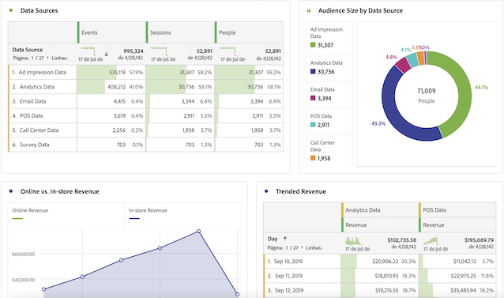

# Guia do usuário para usuários do Adobe Analytics

Se sua organização estiver começando a usar o Adobe Customer Journey Analytics, você poderá notar algumas semelhanças e diferenças entre o Adobe Analytics e o Customer Journey Analytics. Esta página tem como objetivo explicar essas diferenças para ajudar a adaptar sua organização à nova implementação e fluxo de trabalho de relatórios. Esta página também fornece recursos adicionais sobre novos conceitos e outras etapas para tornar sua jornada como analista mais fácil e bem-sucedida.

Vários recursos do Customer Journey Analytics foram renomeados e redesenhados para se alinharem aos padrões do setor. Alguns termos atualizados incluem segmentos, conjuntos de relatórios virtuais, classificações, atributos do cliente e nomes de container. As limitações de eVars e props não existem mais, oferecendo dimensões e métricas personalizadas flexíveis.

## O que não mudou

Muito do que você conhece no lado dos relatórios não mudou.

* Você ainda pode usar o potencial do [Analysis Workspace](/help/analysis-workspace/home.md) para analisar seus dados. O Espaço de trabalho opera da mesma forma que no Adobe Analytics tradicional.
* A mesma versão dos [painéis do Adobe Analytics](/help/mobile-app/home.md) está disponível e funciona de forma semelhante no Customer Journey Analytics e no Adobe Analytics.
* O [Report Builder](/help/report-builder/report-buider-overview.md) tem uma nova interface e é executado no MS Windows, no MacOS e na versão web do Excel. (Antes dessa versão do Report Builder, você não podia usá-lo no Mac a menos que o executasse no VMware.) Essa versão ainda não oferece suporte à solicitação tradicional de dados do AA.

## Alterações nos relatórios

Você tem acesso a muito mais dados entre canais para analisar. Por exemplo, você pode criar um projeto de espaço de trabalho que analise o desempenho de vários canais, desde que esses conjuntos de dados sejam assimilados por sua organização e incluídos em visualizações de dados usadas pelo Customer Journey Analytics (consulte “Alterações na arquitetura de dados” abaixo).

## Alterações na arquitetura de dados {#architecture}

O Customer Journey Analytics obtém os dados da Adobe Experience Platform. A Experience Platform permite centralizar e padronizar dados e conteúdo de clientes de qualquer sistema ou canal e aplicar a ciência de dados e o aprendizado de máquina para melhorar o design e a entrega de experiências personalizadas.

Os dados do cliente na Experience Platform são armazenados como conjuntos de dados, que consistem em um [esquema](https://experienceleague.adobe.com/docs/platform-learn/tutorials/schemas/schemas-and-experience-data-model.html?lang=pt-BR) e lotes de dados. Para obter mais detalhes sobre a plataforma, consulte a [Visão geral da arquitetura da Adobe Experience Platform](https://experienceleague.adobe.com/docs/platform-learn/tutorials/intro-to-platform/basic-architecture.html?lang=pt-BR).

Admins do Customer Journey Analytics estabelecem [conexões](/help/connections/create-connection.md) com conjuntos de dados na Experience Platform. Em seguida, criam [visualizações de dados](/help/data-views/data-views.md) usando essas conexões. As visualizações de dados são conceitualmente semelhantes aos conjuntos de relatórios virtuais e são a base dos relatórios no Customer Journey Analytics. Como a Experience Platform gera todos os dados para relatórios, os conjuntos de relatórios não existem mais como um container de dados.

Uma conexão permite que admins do Analytics integrem conjuntos de dados da Adobe Experience Platform no Customer Journey Analytics, o que é descrito no vídeo a seguir:

>[!VIDEO](https://video.tv.adobe.com/v/35111/?quality=12)

A Adobe oferece várias maneiras de trazer dados para a Adobe Experience Platform, incluindo dados do conjunto de relatórios por meio do conector de origem do Analytics ou do SDK da Web. As implementações existentes de vários conjuntos de relatórios podem ser combinadas na Experience Platform. As conexões e visualizações de dados baseadas nesses conjuntos de dados podem combinar dados que existiam anteriormente em conjuntos de relatórios separados.

## Alterações no conceito de conjuntos de relatórios virtuais {#data-views}

As [!UICONTROL Visualizações de dados] seguem o conceito de conjuntos de relatórios virtuais como eles existem hoje e os expande para [ativar controles adicionais nos dados](/help/data-views/create-dataview.md) disponibilizado por conexões. Essas alterações fazem com que configurações gerais, como fuso horário e intervalos de tempo limite da sessão, sejam configuráveis e retroativas. Configurações de variável individuais, como atribuição e expiração, também podem ser personalizadas em um relatório ou nível de visualização de dados. Essas configurações são não destrutivas e retroativas.

Observe que o seletor de conjunto de relatórios no canto superior direito agora permite escolher entre as visualizações de dados disponíveis:

Consulte [Casos de uso de visualizações de dados](/help/use-cases/data-views/data-views-usecases.md) para obter mais informações sobre esse conceito.

## Alterações no conceito de eVars e props

Os conceitos de [!UICONTROL eVars], [!UICONTROL props] e [!UICONTROL eventos] do Adobe Analytics tradicional não existem mais no [!UICONTROL Customer Journey Analytics]. No Adobe Analytics, as eVars e as props armazenam descrições de conteúdo, clientes, campanhas etc. e eventos contam itens como receita, assinaturas ou leads gerados. O Customer Journey Analytics preserva ambos os tipos de dados e você pode acessá-los da mesma maneira: no painel esquerdo do Analysis Workspace, em Dimensão ou Métricas, respectivamente.

No Customer Journey Analytics, há elementos de esquema ilimitados disponíveis, incluindo dimensões, métricas e campos de lista. Eles são mapeados para elementos de esquema ilimitados, incluindo dimensões, métricas e campos de lista na Experience Platform. Todas as configurações de visita e atribuição aplicadas após as regras de processamento no Adobe Analytics agora se aplicam no momento da consulta no Customer Journey Analytics.

Com essa flexibilidade, você pode encontrar situações em que um único campo de esquema pode ser usado como dimensões e uma métrica para oferecer suporte a diferentes necessidades de rastreamento.

## Alterações no conceito de segmentos

Embora os segmentos não sejam tecnicamente migrados do Adobe Analytics para o Customer Journey Analytics, é possível usar a ferramenta de migração de componentes para recriar seus segmentos do Adobe Analytics no Customer Journey Analytics. Os segmentos são recriados no Customer Journey Analytics com base nas dimensões e métricas mapeadas. Para obter mais informações, consulte [Preparar-se para migrar componentes e projetos do Adobe Analytics para o Customer Journey Analytics](https://experienceleague.adobe.com/docs/analytics/admin/admin-tools/component-migration/prepare-component-migration.html?lang=pt-BR).

Embora ainda não seja possível compartilhar ou publicar [!UICONTROL filtros] ([!UICONTROL segmentos]) do [!DNL Customer Journey Analytics] para o Perfil unificado da Experience Platform, essa funcionalidade está em desenvolvimento.

Além do conceito de alteração de segmentos, os containers de segmentos também são atualizados.

* **Os containers de ocorrência agora são containers [!UICONTROL Evento].** O container de [!UICONTROL Evento] permite detalhar as informações da pessoa com base em eventos individuais.
* **Os containers de visita agora são containers de [!UICONTROL Sessão].** O container [!UICONTROL Sessão] permite identificar as interações de página, campanhas ou conversões de uma sessão específica.
* **Os containers do visitante agora são containers [!UICONTROL Pessoa]**. O container de [!UICONTROL Pessoa] inclui todas as sessões e eventos de uma pessoa dentro do intervalo de tempo especificado.

## Alterações no conceito de métricas calculadas

As métricas calculadas são nomeadas de forma semelhante no Adobe Analytics e no Customer Journey Analytics. No entanto, o [!UICONTROL Customer Journey Analytics] não usa mais eVars, props ou eventos e, agora, usa qualquer elemento de esquema da Experience Platform. Com essa mudança fundamental, nenhuma das métricas calculadas existentes é compatível com o [!UICONTROL Customer Journey Analytics]. Se você quiser mover as métricas calculadas do Adobe Analytics para o Customer Journey Analytics, assista ao vídeo a seguir:

>[!VIDEO](https://video.tv.adobe.com/v/31788/?quality=12)

## Alterações nas configurações de atribuição e expiração da variável

O [!UICONTROL Customer Journey Analytics] aplica todas as configurações de variável, incluindo atribuição e expiração, no momento do relatório. Essas configurações agora ficam nas [visualizações de dados](/help/data-views/component-settings/persistence.md), e algumas configurações de variáveis (como atribuição) podem ser alteradas em projetos do Espaço de trabalho.

É possível ter várias versões da mesma variável na mesma visualização de dados. Por exemplo, você pode ter uma dimensão Código de rastreamento que expira após 30 dias e outra que expira no final de uma sessão. Ambas as dimensões do Código de rastreamento usam os mesmos dados de origem, mas usam configurações de atribuição diferentes.

Você também pode ter várias visualizações de dados com base na mesma conexão. Por exemplo, você pode ter uma visualização de dados com um tempo limite de sessão de 30 minutos e outra com um tempo limite de sessão de 15 minutos. Ambas as visualizações de dados aparecem no seletor superior direito para que você possa fazer a transição sem interrupções entre elas.

## Alterações ao conceito de classificações

“Classificações” agora são conhecidas como “Conjuntos de dados de pesquisa”. Os conjuntos de dados de pesquisa são usados para procurar valores ou chaves encontrados nos dados do Evento ou Perfil. Por exemplo, você pode fazer o upload de dados de pesquisa que mapeiam IDs numéricas nos dados do evento para nomes de produtos. Consulte [Adicionar dados a conta como um conjunto de dados de pesquisa](/help/use-cases/b2b/b2b.md) para obter um exemplo de caso de uso.

## Alterações no conceito de atributos do cliente

“Atributos do cliente” agora são conhecidos como “Conjuntos de dados de perfil”. Conjuntos de dados de perfil contém dados que são aplicados a pessoas, usuários ou clientes nos dados de [!UICONTROL Evento]. Por exemplo, permite carregar dados do CRM sobre seus clientes. Você pode escolher a ID de pessoa que deseja incluir. Cada conjunto de dados definido no [!DNL Experience Platform] tem seu próprio conjunto de uma ou mais IDs de pessoa definidas.

## Alterações na forma como o Adobe identifica visitantes

O Customer Journey Analytics expande os conceitos de identidades além das ECIDs para incluir qualquer ID que você deseja usar, incluindo: ID de cliente, ID de cookie, ID compilada, ID de usuário, código de rastreamento e assim por diante. Usar uma ID de namespace comum em conjuntos de dados ou usar a [compilação](../stitching/overview.md) ajuda a conectar pessoas em diferentes conjuntos de dados. Qualquer usuário que configurar um projeto do espaço de trabalho no Customer Journey Analytics deve entender as IDs usadas nos conjuntos de dados. Assista ao vídeo a seguir que destaca o uso de identidades no Customer Journey Analytics:

>[!VIDEO](https://video.tv.adobe.com/v/30750/?quality=12)

## Alterações no conceito de item de dimensão de tráfego baixo

No Adobe Analytics tradicional, uma variável que recebe muitos valores únicos inicia a definição de itens de dimensão em [!UICONTROL Tráfego baixo]. O Customer Journey Analytics tem menos limitações para campos de alta cardinalidade. As alterações na arquitetura de relatórios permitem que o Analysis Workspace relate muitos itens de dimensão exclusivos. Consulte [Dimensões de alta cardinalidade](../components/dimensions/high-cardinality.md) para obter mais informações sobre como o Customer Journey Analytics otimiza os relatórios para dimensões com vários valores únicos.
