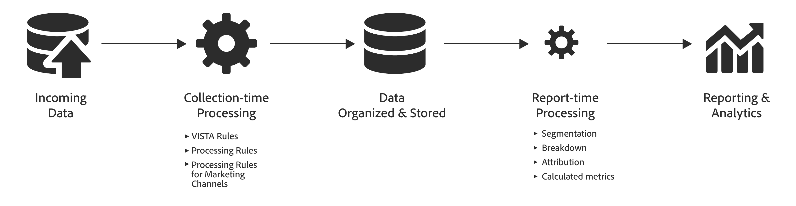

# Compare o processamento de dados entre o Adobe Analytics e o Customer Journey Analytics.

Geralmente, é necessário ter a capacidade de processar dados antes que sejam úteis para os relatórios. Você pode processar esses dados em vários estágios na jornada, desde a coleta de dados até a geração do relatório ou da visualização.

No Adobe Analytics, a maior parte desse processamento de dados ocorre imediatamente após a coleta dos dados. Funcionalidades como Regras VISTA, Regras de processamento, Regras de processamento de canais de marketing estão disponíveis para oferecer suporte a isso **processamento de tempo de coleta**.
Os dados são armazenados e, no momento do relatório, é possível aplicar processamento adicional. Por exemplo, analise dimensões, aplique segmentação ou selecione um modelo de atribuição diferente. Este **processamento de tempo do relatório** acontece em tempo real.

No Adobe Analytics, o processamento no tempo do relatório geralmente representa uma quantidade de processamento menor do que o que acontece no momento da coleta.

Por outro lado, o Customer Journey Analytics foi projetado para exigir tempo mínimo de coleta antecipada antes que os dados sejam organizados e armazenados. A arquitetura subjacente do Customer Journey Analytics foi projetada para funcionar com os dados armazenados no momento do relatório e oferece sua eficiente funcionalidade de processamento no tempo do relatório, não apenas no Espaço de trabalho, mas também, e ainda mais importante, por meio da definição de [componentes](/help/data-views/component-settings/overview.md) e [campos derivados](/help/data-views/derived-fields/derived-fields.md) em suas Visualizações de dados.

Entender as diferenças no processamento de dados para os vários recursos de relatório pode ser útil para compreender quais métricas estão disponíveis, onde e por que elas podem ser diferentes.

Por exemplo, como &quot;visitas&quot; como uma métrica no Adobe Analytics é definida no momento do processamento de dados, e &quot;sessões&quot; como uma métrica em Customer Journey Analytics é calculada no momento do relatório, as duas métricas podem diferir com base nas regras usadas para a definição da sessão na visualização de dados Customer Journey Analytics.

Além disso, visitas e sessões como uma métrica não estão disponíveis em conjuntos de dados criados pelo Conector de origem do Analytics e, portanto, seriam necessárias para definir a sessão na lógica de consulta para fazer comparações.

## Terminologia {#terms}

A tabela abaixo define a terminologia dos diferentes tipos de lógica de processamento que são aplicados ao Adobe Analytics e ao Customer Journey Analytics:

| Termo | Definição | Notas |
| --- | --- | --- |
| Processamento de tempo de coleta | Lógica que é executada quando os dados estão sendo coletados e processados, antes de ser armazenada para fins de relatório e análise. | Essa lógica é “embutida” em dados históricos e geralmente não pode ser facilmente alterada. |
| Processamento de tempo do relatório | Lógica que é executada no momento em que um relatório é executado. | Essa lógica pode ser aplicada aos dados futuros e históricos no tempo de execução do relatório de maneira não destrutiva. |
| Lógica de nível de ocorrência | Lógica aplicada em nível de linha por linha. | Exemplos: Regras de processamento, VISTA, determinadas regras de canal de marketing. |
| Lógica de nível de visita | Lógica aplicada no nível da visita. | Exemplos: definição de visita e sessão. |
| Lógica em nível de visitante | Lógica aplicada no nível da pessoa. | Exemplo: compilação de pessoa entre dispositivos/canais. |
| Lógica do segmento (filtro) | Avaliação de regras de segmento de evento/visita/pessoa (evento/sessão/pessoa) (filtro). | Exemplo: pessoas que compraram sapatos vermelhos. |
| Métricas calculadas | Avaliação de métricas personalizadas criadas pelo cliente que podem ser baseadas em fórmulas complexas, incluindo segmentos e filtros. | Exemplo: número de pessoas que compraram sapatos vermelhos. |
| Lógica de atribuição | Lógica para calcular atribuição. | Exemplo: persistência do eVar. |
| Configurações de componente | Aplicação de personalizações a métricas ou dimensões, como atribuição, comportamento, formato e outros | Exemplo: segmentação de valores para combinar valores numéricos com base em um intervalo |
| Campos derivados | A lógica se aplica aos campos de esquema ou padrão como parte da definição de componentes em uma visualização de dados. | Exemplo: criação de uma nova dimensão de canal de marketing |

{style="table-layout:auto"}

Com o tempo, a Adobe Analytics e a Customer Journey Analytics melhoraram a flexibilidade ao permitir que a lógica de dados no nível de visita e de pessoa seja executada no tempo de execução do relatório.

## Tipos de processamento de dados {#types}

As etapas de processamento de dados executadas para Adobe Analytics e Customer Journey Analytics e o tempo dessas etapas variam de recurso para recurso do Analytics. A tabela abaixo fornece um resumo dos tipos de processamento de dados para cada recurso do Analytics e quando o processamento de dados é aplicado.

| Recurso | Aplicado no momento do processamento | Aplicado no momento do relatório | Não disponível | Notas |
| --- | --- | --- | --- | --- |
| [Adobe Analytics](https://experienceleague.adobe.com/docs/analytics.html?lang=pt-BR) relatórios (sem incluir conjuntos de relatórios virtuais ou Attribution IQ com processamento de tempo de relatório) | <ul><li>[Regras de processamento](https://experienceleague.adobe.com/docs/analytics/admin/admin-tools/processing-rules/processing-rules.html?lang=pt-BR)</li><li>[Regras VISTA](https://experienceleague.adobe.com/docs/analytics/technotes/terms.html?lang=pt-BR)</li><li>[Regras de canal de marketing](https://experienceleague.adobe.com/docs/analytics/admin/admin-tools/manage-report-suites/edit-report-suite/marketing-channels/c-rules.html?lang=pt-BR) no nível da ocorrência</li><li>Regras de canal de marketing no nível de visita (consulte a observação)</li><li>Definição de visita</li><li>Lógica de atribuição</li></ul> | <ul><li>Lógica de segmento</li><li>Métricas calculadas</li></ul> | <ul><li>Análise entre dispositivos (consulte a observação)</li></ul> | <ul><li>O CDA exige o uso de conjuntos de relatórios virtuais com processamento de tempo de relatório.</li><li>As “Regras de canal de marketing no nível da visita” incluem o seguinte: **É a primeira página da visita**, **Substituir canal de último contato** e **Expiração de canal de marketing**. (Consulte a [documentação](https://experienceleague.adobe.com/docs/analytics-platform/using/cja-usecases/marketing-channels.html?lang=pt-BR).)</li></ul> |
| Adobe Analytics [Data Warehouse](https://experienceleague.adobe.com/docs/analytics/export/data-warehouse/data-warehouse.html?lang=pt-BR) | <ul><li>Regras de processamento</li><li>Regras VISTA</li><li>Regras de canal de marketing no nível da ocorrência</li><li>Regras de canal de marketing no nível da visita</li><li>Definição de visita</li><li>Lógica de atribuição</li></ul> | <ul><li>Lógica de segmento</li></ul> | <ul><li>Métricas calculadas</li><li>Análise entre dispositivos</li></ul> |     |
| Adobe Analytics [Feeds de dados](https://experienceleague.adobe.com/docs/analytics/export/analytics-data-feed/data-feed-overview.html?lang=pt-BR) | <ul><li>Regras de processamento</li><li>Regras VISTA</li><li>Regras de canal de marketing no nível da ocorrência</li><li>Regras de canal de marketing no nível da visita</li><li>Definição de visita (campo visitnum)</li><li>Lógica de atribuição (em colunas de publicação)</li></ul> |   | <ul><li>Lógica de segmento</li><li>Métricas calculadas</li><li>Análise entre dispositivos</li></ul> | <ul><li>Os mapeamentos de ID para determinadas colunas relacionadas ao canal de marketing em feeds de dados não são incluídos nos feeds de dados. (Consulte a [documentação do feed de dados](https://experienceleague.adobe.com/docs/analytics/export/analytics-data-feed/data-feed-contents/datafeeds-reference.html?lang=pt-BR).)</li></ul> |
| Adobe Analytics [Livestream](https://github.com/AdobeDocs/analytics-1.4-apis/blob/master/docs/live-stream-api/getting_started.md) | <ul><li> Regras de processamento</li><li>Regras VISTA</li><ul> |   | <ul><li>Regras de canal de marketing no nível da ocorrência</li><li>Regras de canal de marketing no nível da visita</li><li>Lógica da visita</li><li>Lógica de atribuição</li><li>Lógica de segmento</li><li>Métricas calculadas</li><li>Análise entre dispositivos</li></ul> |  |
| Adobe Analytics [Attribution IQ](https://experienceleague.adobe.com/docs/analytics/analyze/analysis-workspace/attribution/overview.html?lang=pt-BR) | <ul><li>Regras de processamento</li><li>Regras VISTA</li><li>Definição de visita (consulte a observação)</li><li>Análise entre dispositivos (consulte a observação)</li></ul> | <ul><li>Regras de canal de marketing no nível de ocorrência (consulte a observação)</li><li>Regras de canal de marketing no nível da visita (consulte a observação) Lógica de atribuição</li><li>Lógica de segmento</li><li>Métricas calculadas</li></ul> |  | <ul><li>O CDA exige o uso de conjuntos de relatórios virtuais com processamento de tempo de relatório.</li><li>O Attribution IQ no Core Analytics usa canais de marketing que são totalmente derivados no momento do relatório (ou seja, valores médios derivados).</li><li>O Attribution IQ usa uma definição de visita de tempo de processamento, exceto quando usada em um VRS de processamento de tempo de relatório.</li></ul> |
| Conjuntos de relatórios virtuais do Adobe Analytics com [processamento de tempo do relatório](https://experienceleague.adobe.com/docs/analytics/components/virtual-report-suites/vrs-report-time-processing.html?lang=pt-BR) (VRS RTP) | <ul><li>Regras de processamento</li><li>Regras VISTA</li><li>[Análise entre dispositivos](https://experienceleague.adobe.com/docs/analytics/components/cda/overview.html?lang=pt-BR)</li></ul> | <ul><li>Definição de visita</li><li>Lógica de atribuição</li><li>Lógica de segmento</li><li>Métricas calculadas</li><li>Outras configurações de VRS RTP</li></ul> | <ul><li>Regras de canal de marketing no nível da ocorrência</li><li>Regras de canal de marketing no nível da visita</li></ul> | <ul><li>Consulte a [documentação](https://experienceleague.adobe.com/docs/analytics/components/virtual-report-suites/vrs-report-time-processing.html?lang=pt-BR) do VRS RTP.</li></ul> |
| [Conector de origem do Analytics](https://experienceleague.adobe.com/docs/experience-platform/sources/connectors/adobe-applications/analytics.html?lang=pt-BR)Conjunto de dados baseado em no Adobe Experience Platform data lake | <ul><li>Regras de processamento</li><li>Regras VISTA</li><li>Regras de canal de marketing no nível da ocorrência</li><li>Compilação em campo (consulte a observação)</li></ul> |   | <ul><li>[Regras de canal de marketing no nível da visita](https://experienceleague.adobe.com/docs/analytics-platform/using/cja-usecases/marketing-channels.html?lang=pt-BR)</li><li>Lógica da visita</li><li>Lógica de atribuição</li><li>Lógica de filtro</li></ul> | <ul><li>Deve aplicar sua própria lógica de filtro e métricas calculadas</li><li>A compilação em campo cria um conjunto de dados compilado separado, além do conjunto criado pelo Conector de origem do Analytics.</li></ul> |
| Relatórios do [Customer Journey Analytics](https://experienceleague.adobe.com/docs/analytics-platform/using/cja-landing.html?lang=pt-BR) | <ul><li>Implementado como parte da Coleção de dados da Adobe Experience Platform</li></ul> | <ul><li>Definição de sessão</li><li>Configurações de [visualização de dados](https://experienceleague.adobe.com/docs/analytics-platform/using/cja-dataviews/data-views.html?lang=pt-BR)<li>Lógica de atribuição</li><li>Métricas calculadas</li><li>Lógica de filtro</li></ul> | <ul><li>Regras de canal de marketing no nível da visita</li></ul> | <ul><li>Deve usar conjuntos de dados compilados para aproveitar a análise entre canais.</li></ul> |

{style="table-layout:auto"}
