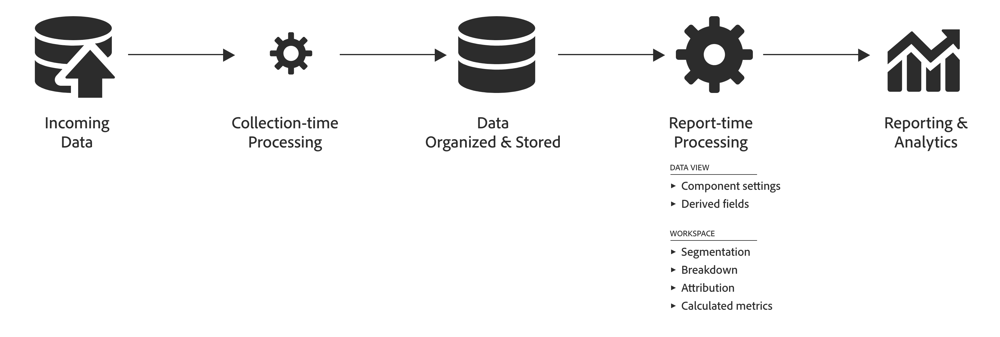

# Compare o processamento de dados do Adobe Analytics e do Customer Journey Analytics

Geralmente, é necessário ter a capacidade de processar dados antes que sejam úteis para os relatórios. Você pode processar esses dados em vários estágios na jornada, desde a coleta de dados até a geração do relatório ou da visualização.

No Adobe Analytics, a maior parte desse processamento de dados ocorre imediatamente após a coleta dos dados. Funcionalidades como as regras VISTA, regras de processamento e regras de processamento de canais de marketing estão disponíveis para permitir esse **processamento durante a coleta**.
Os dados são armazenados e, ao criar o relatório, é possível aplicar processamento adicional. Por exemplo: detalhar dimensões, aplicar segmentações ou selecionar um modelo de atribuição diferente. Este **processamento durante o relatório** acontece em tempo real.

No Adobe Analytics, o processamento durante o relatório geralmente é mais curto do que o realizado durante a coleta.

Por outro lado, o Customer Journey Analytics foi projetado para exigir tempo mínimo de processamento de coleta antecipada antes que os dados sejam organizados e armazenados. A arquitetura subjacente do Customer Journey Analytics foi projetada para funcionar com os dados armazenados no momento do relatório. O Customer Journey Analytics oferece sua eficiente funcionalidade de processamento no tempo do relatório, não apenas no Analysis Workspace. A funcionalidade adicional de processamento de tempo do relatório está disponível por meio da definição de [componentes](/help/data-views/component-settings/overview.md) e [campos derivados](/help/data-views/derived-fields/derived-fields.md) em suas visualizações de dados.

Entender as diferenças no processamento de dados dos vários recursos de relatório pode ser útil para compreender quais métricas estão disponíveis e onde, além do por que elas podem ser diferentes.

Por exemplo, *visitas* é definida como uma métrica no Adobe Analytics no momento do processamento de dados. E *sessões* é calculada como uma métrica no Customer Journey Analytics no momento do relatório. Como resultado, as duas métricas podem ser diferentes com base nas regras para a definição da sessão em uma visualização de dados do Customer Journey Analytics.

Além disso, visitas e sessões como uma métrica não estão disponíveis em conjuntos de dados criados pelo conector de origem do Analytics. E, portanto, exigiria que você definisse a sessão na lógica da consulta para fazer comparações.

## Terminologia {#terms}

A tabela abaixo define a terminologia dos diferentes tipos de lógica de processamento que são aplicados ao Adobe Analytics e ao Customer Journey Analytics:

| Termo | Definição | Notas |
| --- | --- | --- |
| Processamento durante a coleta | Lógica executada quando os dados estão sendo coletados e processados, antes de serem armazenados para fins de relatório e análise. | Essa lógica é “embutida” em dados históricos e geralmente não pode ser facilmente alterada. |
| Processamento durante o relatório | Lógica que é executada no momento em que um relatório é executado. | Essa lógica pode ser aplicada aos dados futuros e históricos no tempo de execução do relatório de maneira não destrutiva. |
| Lógica de nível de ocorrência | Lógica aplicada em nível de linha por linha. | Exemplos: Regras de processamento, VISTA, determinadas regras de canal de marketing. |
| Lógica de nível de visita | Lógica aplicada no nível da visita. | Exemplos: definição de visita e sessão. |
| Lógica em nível de visitante | Lógica que é aplicada no nível da pessoa. | Exemplo: compilação de visitantes entre dispositivos/canais. |
| Lógica de segmento | Avaliação das regras de segmento de evento/visita/pessoa (evento/sessão/pessoa). | Exemplo: pessoas que compraram sapatos vermelhos. |
| Métricas calculadas | Avaliação de métricas personalizadas criadas pelo cliente. As métricas calculadas podem ser baseadas em fórmulas complexas, incluindo segmentos. | Por exemplo, o número de pessoas que compraram sapatos vermelhos. |
| Lógica de atribuição | Lógica para calcular atribuição. | Exemplo: persistência do eVar. |
| Configurações de componente | Aplicação de personalizações a métricas ou dimensões, como atribuição, comportamento, formato e outros | Exemplo: classificação de valor para combinar valores numéricos com base em um intervalo |
| Campos derivados | Lógica que se aplica ao esquema ou aos campos padrão como parte da definição de componentes em uma visualização de dados. | Exemplo: criação de uma nova dimensão de canal de marketing |

{style="table-layout:auto"}

Com o tempo, o Adobe Analytics e agora o Customer Journey Analytics melhoraram sua flexibilidade ao permitir que a lógica de dados em nível de visita e de pessoa seja executada no tempo de execução do relatório.

## Tipos de processamento de dados {#types}

As etapas de processamento de dados executadas pelo Adobe Analytics e Customer Journey Analytics e o tempo dessas etapas variam de recurso para recurso. A tabela abaixo fornece um resumo dos tipos de processamento de dados para cada recurso e quando o processamento de dados é aplicado.

| Recurso | Aplicado no momento do processamento | Aplicado no momento do relatório | Não disponível | Notas |
| --- | --- | --- | --- | --- |
| [Relatórios do Adobe Analytics](https://experienceleague.adobe.com/en/docs/analytics?lang=pt-BR) (sem incluir recursos de atribuição avançados ou conjuntos de relatórios virtuais com processamento de tempo de relatório) | <ul><li>[Regras de processamento](https://experienceleague.adobe.com/en/docs/analytics/admin/admin-tools/manage-report-suites/edit-report-suite/report-suite-general/c-processing-rules/processing-rules)</li><li>[Regras VISTA](https://experienceleague.adobe.com/en/docs/analytics/technotes/terms)</li><li>[Regras de canal de marketing](https://experienceleague.adobe.com/en/docs/analytics/admin/admin-tools/manage-report-suites/edit-report-suite/marketing-channels/c-rules) no nível da ocorrência</li><li>Regras de canal de marketing no nível de visita (consulte a observação)</li><li>Definição de visita</li><li>Lógica de atribuição</li></ul> | <ul><li>Lógica de segmento</li><li>Métricas calculadas</li></ul> | <ul><li>Análise entre dispositivos (consulte a observação)</li></ul> | <ul><li>O Cross-Device Analytics requer o uso de conjuntos de relatórios virtuais com processamento de tempo de relatório.</li><li>As “Regras de canal de marketing no nível da visita” incluem o seguinte: **É a primeira página da visita**, **Substituir canal de último contato** e **Expiração de canal de marketing**. (Consulte a [documentação](https://experienceleague.adobe.com/pt-br/docs/analytics-platform/using/cja-usecases/aa-data/marketing-channels).)</li></ul> |
| [Data Warehouse](https://experienceleague.adobe.com/pt-br/docs/analytics/export/data-warehouse/data-warehouse) do Adobe Analytics | <ul><li>Regras de processamento</li><li>Regras VISTA</li><li>Regras de canal de marketing no nível da ocorrência</li><li>Regras de canal de marketing no nível da visita</li><li>Definição de visita</li><li>Lógica de atribuição</li></ul> | <ul><li>Lógica de segmento</li></ul> | <ul><li>Métricas calculadas</li><li>Análise entre dispositivos</li></ul> |     |
| [Feeds de dados](https://experienceleague.adobe.com/pt-br/docs/analytics/export/analytics-data-feed/data-feed-overview) do Adobe Analytics | <ul><li>Regras de processamento</li><li>Regras VISTA</li><li>Regras de canal de marketing no nível da ocorrência</li><li>Regras de canal de marketing no nível da visita</li><li>Definição de visita (campo visitnum)</li><li>Lógica de atribuição (em colunas de publicação)</li></ul> |   | <ul><li>Lógica de segmento</li><li>Métricas calculadas</li><li>Análise entre dispositivos</li></ul> | <ul><li>Os mapeamentos de ID para determinadas colunas relacionadas ao canal de marketing em feeds de dados não são incluídos nos feeds de dados. (Consulte a [documentação do feed de dados](https://experienceleague.adobe.com/en/docs/analytics/export/analytics-data-feed/data-feed-contents/datafeeds-reference).)</li></ul> |
| [Transmissão ao vivo](https://github.com/AdobeDocs/analytics-1.4-apis/blob/master/docs/live-stream-api/getting_started.md) do Adobe Analytics | <ul><li> Regras de processamento</li><li>Regras VISTA</li><ul> |   | <ul><li>Regras de canal de marketing no nível da ocorrência</li><li>Regras de canal de marketing no nível da visita</li><li>Lógica da visita</li><li>Lógica de atribuição</li><li>Lógica de segmento</li><li>Métricas calculadas</li><li>Análise entre dispositivos</li></ul> |  |
| [Recursos de atribuição avançados](https://experienceleague.adobe.com/en/docs/analytics/analyze/analysis-workspace/attribution/overview) do Adobe Analytics | <ul><li>Regras de processamento</li><li>Regras VISTA</li><li>Definição de visita (consulte a observação)</li><li>Análise entre dispositivos (consulte a observação)</li></ul> | <ul><li>Regras de canal de marketing no nível de ocorrência (consulte a observação)</li><li>Regras de canal de marketing no nível da visita (consulte a observação) Lógica de atribuição</li><li>Lógica de segmento</li><li>Métricas calculadas</li></ul> |  | <ul><li>O Cross-Device Analytics requer o uso de conjuntos de relatórios virtuais com processamento de tempo de relatório.</li><li>Os recursos avançados de atribuição no Core Analytics usam canais de marketing que são totalmente derivados no momento do relatório (ou seja, valores médios derivados).</li><li>Os recursos avançados de atribuição usam uma definição de visita de tempo de processamento, exceto quando usada em um conjunto de relatórios virtuais de processamento de tempo de relatório.</li></ul> |
| Conjuntos de relatórios virtuais do Adobe Analytics com [processamento de tempo de relatório](https://experienceleague.adobe.com/pt-br/docs/analytics/components/virtual-report-suites/vrs-report-time-processing) | <ul><li>Regras de processamento</li><li>Regras VISTA</li><li>[Análise entre dispositivos](https://experienceleague.adobe.com/en/docs/analytics/components/cda/overview)</li></ul> | <ul><li>Definição de visita</li><li>Lógica de atribuição</li><li>Lógica de segmento</li><li>Métricas calculadas</li><li>Outras configurações de processamento de tempo de relatório do conjunto de relatórios virtual</li></ul> | <ul><li>Regras de canal de marketing no nível da ocorrência</li><li>Regras de canal de marketing no nível da visita</li></ul> | <ul><li>Consulte a [documentação](https://experienceleague.adobe.com/pt-br/docs/analytics/components/virtual-report-suites/vrs-report-time-processing) sobre o processamento no tempo de relatório do conjunto de relatórios virtual.</li></ul> |
| Conjunto de dados baseado no [conector de origem do Analytics](https://experienceleague.adobe.com/pt-br/docs/experience-platform/sources/connectors/adobe-applications/analytics) no data lake da Adobe Experience Platform | <ul><li>Regras de processamento</li><li>Regras VISTA</li><li>Regras de canal de marketing no nível da ocorrência</li><li>Compilação em campo (consulte a observação)</li></ul> |   | <ul><li>[Regras de canal de marketing no nível da visita](https://experienceleague.adobe.com/pt-br/docs/analytics-platform/using/cja-usecases/aa-data/marketing-channels)</li><li>Lógica da visita</li><li>Lógica de atribuição</li><li>Lógica de segmento</li></ul> | <ul><li>Aplicar sua própria lógica de segmento e métricas calculadas</li><li>A compilação baseada em campo cria um conjunto de dados compilado separado, além do conjunto criado pelo conector de origem do Analytics.</li></ul> |
| Relatórios do [Customer Journey Analytics](https://experienceleague.adobe.com/en/docs/analytics-platform/using/cja-landing) | <ul><li>Implementado como parte da coleta de dados da Adobe Experience Platform</li></ul> | <ul><li>Definição de sessão</li><li>Configurações de [visualização de dados](https://experienceleague.adobe.com/pt-br/docs/analytics-platform/using/cja-dataviews/data-views)<li>Lógica de atribuição</li><li>Métricas calculadas</li><li>Lógica de segmento</li></ul> | <ul><li>Regras de canal de marketing no nível da visita</li></ul> | <ul><li>Use conjuntos de dados compilados para aproveitar a análise entre canais.</li></ul> |

{style="table-layout:auto"}
