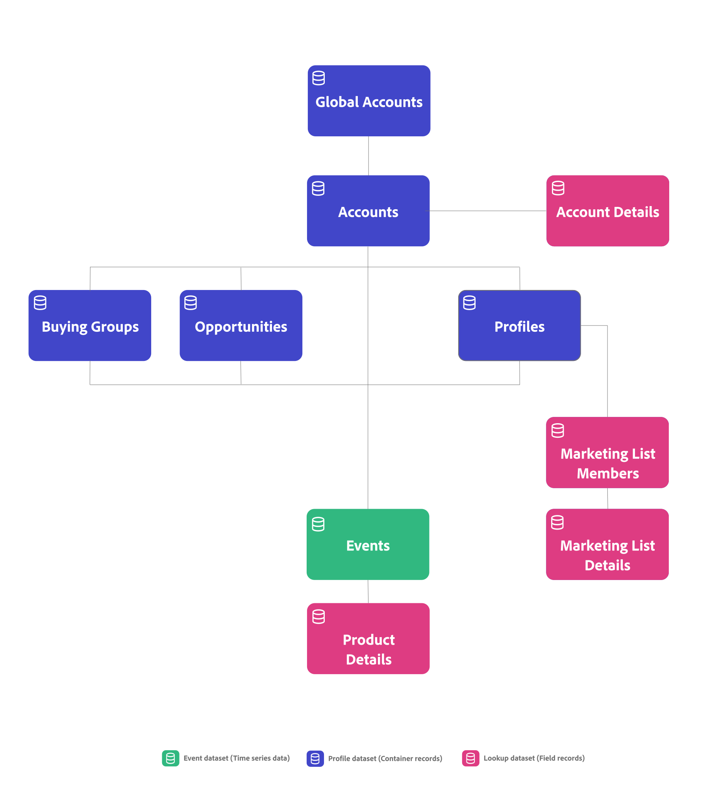

# Conceitos e recursos do B2B edition

{{draft-b2b}}

Este artigo explica conceitos como conexões, identificadores, contêineres e conjuntos de dados, normalmente usados no Customer Journey Analytics. E como o Customer Journey Analytics B2B edition adiciona recursos adicionais a esses conceitos.

## Conexões e identificadores

No Customer Journey Analytics, você escolhe um identificador comum, conhecido como ID de pessoa, para conectar seus dados de evento a outros conjuntos de dados, como conjunto de dados de perfil e conjuntos de dados de pesquisa. Esse tipo de conexão é conhecida como conexão com base em pessoas, o que facilita a geração de relatórios e a análise com base em pessoas.

No Customer Journey Analytics B2B edition, você pode selecionar entre uma conexão com base em pessoa ou uma conexão com base em conta. Uma conexão baseada em conta facilita a emissão de relatórios e a análise baseadas em conta.

* Para uma conexão com base em pessoas, você seleciona Pessoa como o identificador principal. Em seguida, você pode configurar e configurar sua conexão, visualização de dados e projetos do espaço de trabalho para relatórios com base em pessoas.
* Para uma conexão baseada em conta, você seleciona Conta como o identificador principal. Opcionalmente, é possível adicionar contêineres adicionais para Conta global, Grupo de compra e Oportunidade. Se você adicionar ou não uma Conta global, seu identificador principal será um identificador de conta ou um identificador de conta global.

## Containers

Em Customer Journey Analytics, os containers são gerados como parte da configuração de uma conexão e visualização de dados e fornecem a estrutura e o escopo de dados. Os contêineres armazenam grupos de identificadores para sequenciar todos os carimbos de data e hora do evento por identificadores exclusivos. Esse armazenamento facilita a execução rápida e eficiente de funcionalidades como segmentação, atribuição e visualizações.

### Contêineres padrão

O Customer Journey Analytics é construído com base no conceito de três contêineres: Pessoa, Sessão e Evento. Durante uma configuração, esses containers são gerados implicitamente.

É possível redefinir como esses containers são nomeados ao configurar uma visualização de dados, mas a hierarquia e os relacionamentos entre os containers são predeterminados. O contêiner Sessão é gerado com base em como você define uma sessão nas [Configurações de sessão](/help/data-views/session-settings.md) da sua visualização de dados.

{zoomable="yes"}

### Contêineres B2B

No Customer Journey Analytics B2B edition, um contêiner de Conta é adicionado à lista de contêineres gerados. E você tem a opção de configurar a geração de contêineres adicionais, como Conta global, Grupo de compra e Oportunidade.

A hierarquia e os relacionamentos entre os contêineres são predeterminados. Oportunidade, Grupo de Compras e Pessoa são todos contêineres irmãos do contêiner Conta. Nessa hierarquia, o contêiner Sessão entre o contêiner Pessoa e o contêiner Evento é gerado com base em como você define uma sessão nas [Configurações da sessão](/help/data-views/session-settings.md) na sua visualização de dados. Os contêineres de sessão adicionais, por exemplo, entre o contêiner Conta e o contêiner Evento, não são gerados e suportados no momento. Consulte a tabela abaixo para obter uma descrição e a utilização básica dos containers B2B.

{zoomable="yes"}

| Contêiner B2B | Descrição Caso de uso básico |
|---|---|
| Conta | Uma empresa que é um cliente ou um cliente potencial de seu negócio. A empresa pode ser uma subsidiária ou divisão de uma organização maior. Conta representa a organização para a qual você está vendendo e que deseja rastrear nesse nível de organização. |
| Conta global (opcional) | A principal empresa-mãe de um grupo de empresas relacionadas. Uma conta global não tem uma empresa principal, mas pode ter subsidiárias ou divisões pertencentes à conta global. Quando você tem o contêiner de Conta global configurado em sua conexão, uma conta que não tem pai ou subsidiárias deve ser listada nos campos conta e conta global. |
| Oportunidade (opcional) | Uma coleção de produtos e serviços que são vendidos juntos. Uma oportunidade frequentemente envolvia várias etapas do ciclo de vendas até o fechamento da venda. Você usaria os dados para medir a progressão da oportunidade pelo funil de vendas. Por exemplo, um relatório que fornece detalhes sobre as principais oportunidades que passaram do estágio 3 para o estágio 4. |
| Grupo de compras (opcional) | Uma coleção de pessoas em uma organização que está envolvida no processo de tomada de decisão para comprar um produto ou serviço.  Você usaria os dados do grupo de compras para acompanhar grupos de compras através do gerenciamento de campanhas. Por exemplo, crie um segmento de público-alvo de grupos-chave de compra.  Provavelmente você deseja realizar uma pesquisa a partir do grupo de compras para os dados do perfil, para poder relatar as pessoas de um grupo de compras. |
| Pessoa | Um indivíduo, geralmente identificado por um endereço de e-mail exclusivo que interagiu com a empresa.  Você usaria os dados do perfil para identificar as pessoas que trabalham em uma conta. Por exemplo: direcione a todas as pessoas em uma conta que se inscreveram para uma conferência. |

>[!IMPORTANT]
>
>* Se você tiver **habilitado** o contêiner de Conta Global em uma conexão baseada em conta, cada registro nos conjuntos de dados do evento deverá conter uma ID de Conta e uma ID de Conta Global. Caso contrário, o registro será ignorado.
>* Se você **não habilitou** o contêiner de Conta Global em uma conexão baseada em conta, cada registro nos conjuntos de dados do evento deve conter uma ID de Conta. Caso contrário, o registro será ignorado.

Você pode usar os contêineres B2B para a funcionalidade B2B específica no Analysis Workspace:

* **Segmentação**: [Contêineres de segmentos B2B](/help/components/filters/filters-overview.md#b2b-containers) permitem que você crie segmentos com um escopo de contêiner além de pessoa, sessão ou evento. Por exemplo: um segmento Contas com registro de evento ou contas dos EUA com grupos de compra e segmento de oportunidades de estágio 5.

  >[!NOTE]
  >
  >Os dados do evento B2B em uma configuração baseada em conta no Customer Journey Analytics B2B edition podem conter linhas de dados sem uma pessoa ou sessão. Por exemplo: uma linha que detalha a progressão do estágio de oportunidade. Ao avaliar seu segmento, lembre-se de que as pessoas e as sessões podem não ser mais os critérios corretos.
  >

* **Atribuição**: você pode usar os novos contêineres B2B no [painel de atribuição](/help/analysis-workspace/c-panels/attribution.md), nas [configurações de componente de atribuição](/help/data-views/component-settings/attribution.md), nas [métricas calculadas](/help/components/calc-metrics/cm-workflow/m-metric-type-alloc.md) ou nas [colunas em uma tabela de Forma livre](/help/analysis-workspace/visualizations/freeform-table/column-row-settings/column-settings.md). As pesquisas de conta são estendidas para 13 meses.

* **Visualizações**: [Fall out](/help/analysis-workspace/visualizations/fallout/fallout-flow.md), [Flow](/help/analysis-workspace/visualizations/c-flow/flow.md), [Tela de Jornada](/help/analysis-workspace/visualizations/journey-canvas/journey-canvas.md) e [Tabela de coorte](/help/analysis-workspace/visualizations/cohort-table/cohort-analysis.md), as visualizações dão suporte aos novos contêineres B2B. Por exemplo: você pode usar os novos contêineres para entender como os grupos de compras consomem conteúdo ou como os coortes de oportunidades avançam para o fechamento de uma venda.
Você também pode definir o container padrão para essas visualizações nas [preferências do usuário](/help/analysis-workspace/user-preferences.md#visualizations-preferences).

Segmentos, atribuição e visualizações junto com os contêineres B2B oferecem suporte a você na análise e nos insights B2B profundos.

## Conjuntos de dados

O B2B do Customer Journey Analytics distingue entre os seguintes tipos de dados e conjuntos de dados.

| Tipo de dados | Séries cronológicas | Registros de contêiner | Registros de campo |
|---|---|---|---|
| **Conjuntos de dados** | **Conjuntos de dados de eventos**  Por exemplo:<ul><li>Análise digital</li><li>Eventos do CRM</li><li>Eventos presenciais</li><li>Dados da central de atendimento</li></ul> | **Conjuntos de dados de perfil**  Por exemplo:<ul><li>Registros CRM</li><li>Registros B2B do AJO</li><li>Registros da CDP</li><ul> | **Classificações**  Por exemplo:<ul><li>Registros de campanha</li><li>Registros da lista de marketing</li><li>Metadados de conteúdo</li><li>Registros de produto</li></ul> |
| Requisitos | **Carimbo de data/hora**  Todos os registros precisam:<ul><li>ID da Conta</li><li>ID da conta global</li><li>ID da pessoa</li></ul> | **ID da conta**  Os registros precisam de uma ID de contêiner, como:<ul><li>Conta</li><li>Pessoa</li><li>Oportunidade</li><li>Grupo de compra</li></ul> | **Chave correspondente**  Os registros precisam de uma ID contida em um contêiner ou conjunto de dados de evento, como:<ul><li>ID da campanha</li><li>ID de conteúdo</li><li>Identificação do produto</li></ul> |

{style="table-layout:fixed"}

Um exemplo de conexão baseada em conta no B2B edition do Customer Journey Analytics:

O Customer Journey Analytics B2B edition oferece a interface [Mapa de conexão](/help/connections/create-connection.md#connection-map) para fornecer uma visão geral das relações entre conjuntos de dados na sua conexão.

Assim como o Customer Journey Analytics, os dados de séries de tempo baseadas em eventos estão no núcleo do Customer Journey Analytics B2B edition. A principal diferença para uma conexão baseada em conta é que você precisa de uma ID de conta em cada registro em seu conjunto de dados de evento, em vez de uma ID de pessoa.

Ao definir [configurações de conjuntos de dados](/help/connections/create-connection.md#dataset-settings) para sua conexão baseada em conta no Customer Journey Analytics B2B edition, as opções disponíveis para algumas das configurações dependem do [tipo de conjunto de dados](/help/connections/create-connection.md#dataset-types). Por exemplo, é necessário:

* Especifique identificadores para cada um dos containers configurados para seus conjuntos de dados de eventos.
* Defina um campo de conta ou um campo de conta global para seus conjuntos de dados de perfil.
* Defina chaves e como correspondê-las (por contêiner de campo) para conjuntos de dados de pesquisa.

## Corresponder por contêiner ou campo

Você pode definir para cada conjunto de dados de pesquisa, se você corresponder o conjunto de dados por campo ou por container.

### Corresponder por container

Se um conjunto de dados de registro usar uma correspondência por contêiner, ele será tratado como um tipo de conjunto de dados de perfil e como um conjunto de dados de perfil na interface do usuário. Use a correspondência por contêiner em conjuntos de dados que contêm registros de contêiner e que oferecem suporte aos contêineres configurados. Por exemplo, um conjunto de dados do Grupo de compra.

### Corresponder por campo

Se um conjunto de dados de registro usar um campo Corresponder por, o conjunto de dados de registro será tratado como um tipo de conjunto de dados de pesquisa e como um conjunto de dados de Pesquisa na interface do usuário. Use a correspondência por campo em conjuntos de dados que contêm detalhes de classificação adicionais por meio de pesquisa. Por exemplo, um conjunto de dados de Membro da lista de marketing ou um conjunto de dados de Detalhes do produto.

## Relatório sobre dados baseados em pessoa e conta

Se quiser criar relatórios sobre contêineres com base em pessoas (e identidades de pessoas) e contêineres com base em contas (e identidades de contas), configure duas conexões separadas no Customer Journey Analytics. Uma conexão em que você seleciona Pessoa como a ID principal e uma conexão em que você seleciona Conta como a ID principal. O Customer Journey Analytics não oferece suporte a relatórios com base em pessoas e em contas de uma única hierarquia de contêiner.

