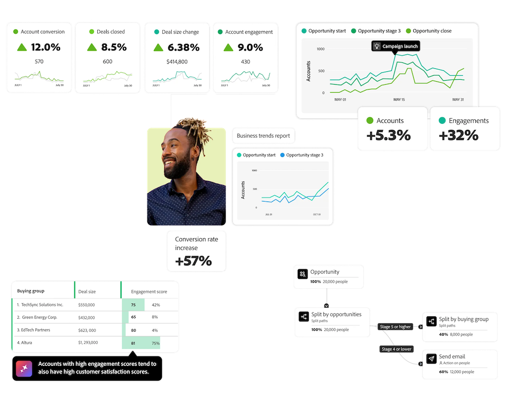

# Customer Journey Analytics B2B Edition

{{b2b-edition}}

O Adobe Analytics começou como uma ferramenta de análise digital e da web para profissionais de marketing, e o Customer Journey Analytics ampliou o escopo para incluir dados de vários canais, dados offline e dados de várias plataformas.  Ambas as ferramentas ajudam as empresas que utilizam o modelo B2C (empresa para consumidor) a analisar e otimizar suas campanhas de marketing e experiências do cliente. Isso também aumentou o foco em **relatórios e análises baseados em pessoas**: entenda a jornada do cliente, onde “o cliente” é uma pessoa que interage com sua marca em vários canais.

O Customer Journey Analytics B2B edition adiciona **análise e relatório baseados em conta**. Nas vendas com o modelo B2B (empresa para empresa), a jornada de compra envolve várias partes, pontos de contato online e offline e estágios essenciais antes de fechar um acordo. As empresas B2B precisam rastrear todas essas interações em uma visualização de jornada unificada para analisar e otimizar as campanhas de marketing e as experiências de conta com eficácia.

As características típicas das vendas B2B são:

* grandes valores de transação
* longos ciclos de vendas
* vários tomadores de decisão e influenciadores, que geralmente compõem um “grupo de compras”
* compradores mais informados
* foco maior na retenção de clientes e na venda adicional
* compradores B2B da geração Y (millenials) esperam uma experiência de compra mais fluida como “consumidor digital”

O marketing B2B se concentra na otimização de pontos de contato e na redução do ciclo de compra e consideração. Como os ciclos de vendas B2B dependem muito de reuniões presenciais, interações offline (como eventos em tempo real) e da colaboração com grupos de compra, usar apenas dados digitais baseados em pessoas não é o suficiente. As organizações B2B complementam isso com dados de sistemas CRM e soluções especializadas. No entanto, os componentes de marketing B2C tradicionais como leads, campanhas, canais e visitantes do site ainda desempenham um papel crucial no marketing B2B.

As vendas e o marketing B2B evoluíram além dos funis tradicionais de geração de leads para focar nos ciclos de vida do cliente e nos grupos de compra. Essa mudança reflete a natureza mutável das compras B2B, em que as decisões envolvem várias partes interessadas em vários pontos de contato. Os compradores B2B de hoje seguem um processo de tomada de decisão complexo e não linear. Como os clientes B2C, eles preferem pesquisar de forma independente antes de interagir com as equipes de vendas. O “boca a boca” e as redes sociais agora desempenham papéis importantes na formação de suas decisões de compra.

Profissionais de marketing B2B enfrentam uma pressão crescente para demonstrar como suas atividades contribuem para a geração de receita.  Embora o alinhamento das campanhas de marketing com as metas comerciais e a medição do impacto sobre a receita sejam cruciais, várias ferramentas de medição são projetadas para cenários B2C. Como resultado, os profissionais de marketing B2B estão buscando ferramentas dedicadas que forneçam insights precisos e se alinhem aos seus objetivos específicos.

O Customer Journey Analytics B2B Edition ajuda as empresas B2B a alinhar suas equipes de marketing, vendas e produtos fornecendo insights de conta acionáveis que impulsionam o crescimento da receita. Com a conta posicionada no centro do modelo de dados, toda a análise se concentra na jornada da conta. Adicionar uma nova camada de entidades (contas, oportunidades e grupos de compras) sobre eventos baseados em pessoas e eventos baseados em tempo cria uma imagem completa do ciclo de vida de marketing e receita B2B.

>[!MORELIKETHIS]
>
>[Conceitos e recursos B2B](cja-b2b-concepts-features.md)
>&#x200B;>[Guia de início rápido B2B](cja-b2b-quick-start-guide.md)
>&#x200B;>[Guia de transição B2B](cja-b2b-transition.md)
>&#x200B;>[Casos de uso B2B](/help/use-cases/b2b/b2b-edition/use-cases-overview.md)
>
