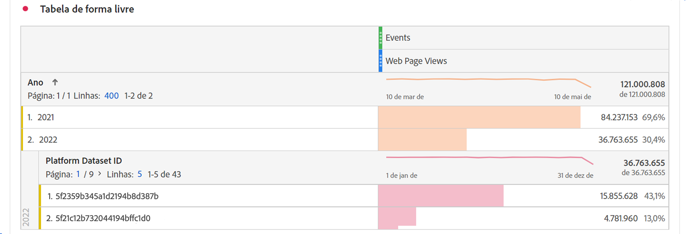

# Perguntas frequentes

O Adobe Customer Journey Analytics é o produto de análise de próxima geração. Este artigo fornece respostas para perguntas frequentes sobre o Customer Journey Analytics. Para obter mais informações, consulte [Suporte aos recursos do Customer Journey Analytics](/help/getting-started/aa-vs-cja/cja-aa.md).

## 1. Pré-requisitos {#prerequisites}

+++**Preciso do [!UICONTROL Private Device Graph] ou do [!UICONTROL Device Coop] para o [!UICONTROL Customer Journey Analytics]?**

Não, o [!UICONTROL Private Device Graph] ou o [!UICONTROL Device Coop] não são necessários para o [!UICONTROL Customer Journey Analytics]. Na verdade, eles ainda não são compatíveis.

+++

+++**Preciso da [!UICONTROL Experience Cloud ID] (ECID) para o [!UICONTROL Customer Journey Analytics]?**

Não, o [!UICONTROL Customer Journey Analytics] é compatível com qualquer ID em um conjunto de dados, seja [!UICONTROL ECID] ou outra ID escolhida.

+++

+++**E se for necessário extrair, transformar, carregar (ETL) meus dados antes do [!UICONTROL Customer Journey Analytics]?**

O Customer Journey Analytics inclui recursos de [Preparação de dados](https://experienceleague.adobe.com/docs/experience-platform/data-prep/api/overview.html?lang=pt-BR) para ajudar a transformar seus dados antes de colocá-los no data lake da Adobe Experience Platform. Se ETL for necessário depois que os dados já tiverem sido assimilados, o [Adobe Experience Platform Query Service](https://experienceleague.adobe.com/docs/platform-learn/tutorials/queries/understanding-query-service.html?lang=pt-BR#queries) fornecerá algumas opções limitadas, embora possa haver a cobrança de tarifas adicionais.

+++

## 2. Compilação de dados {#stitching}

+++**O [!UICONTROL Customer Journey Analytics] pode compilar todos os dispositivos ou conjuntos de dados?**

Sim. O [!UICONTROL Customer Journey Analytics] tem a funcionalidade de [compilação](../stitching/overview.md) que opera em eventos autenticados e não autenticados em um conjunto de dados. Essa compilação permite consolidar registros desiguais em uma única ID compilada, para realizar uma análise entre dispositivos no nível da pessoa.
Além disso, quando uma ID de namespace comum (ID de pessoa) é usada em conjuntos de dados de uma [Conexão](/help/connections/overview.md), é possível executar análises em uma combinação perfeita de vários conjuntos de dados “compilados” no nível da pessoa.

+++

+++**É possível transformar um comportamento anônimo em um comportamento autenticado?**

Sim. A [compilação](../stitching/overview.md) examina os dados do usuário de sessões autenticadas e não autenticadas para gerar uma ID compilada.

+++

+++**Como a “repetição” funciona na compilação?**

A compilação “repete” dados com base em identificadores únicos que foram memorizados. A repetição tem como objetivo compilar eventos inicialmente não autenticados de dispositivos que foram identificados durante esse período. [Saiba mais](../stitching/overview.md)

+++

+++**Como funciona a compilação de dados históricos (preenchimento retroativo)?**

Quando ativado pela primeira vez, a Adobe fornece um preenchimento retroativo de dados compilados que remonta ao período selecionado por você (até 25 meses, no máximo, dependendo do pacote do Customer Journey Analytics ao qual você tem direito). Para fazer esse preenchimento retroativo, a ID transitória deve existir nos dados não compilados até aquele momento. [Saiba mais](../stitching/overview.md)

+++

+++**Qual é o comportamento esperado para registros de conjunto de dados de perfil não compilados?**

**Exemplo de cenário**: você associa dois conjuntos de dados em uma conexão do Customer Journey Analytics usando `CRMid` como a ID da pessoa. Um é um conjunto de dados de Evento da Web com `CRMid` em todos os registros. O outro conjunto de dados é um conjunto de dados de perfil do CRM. 40% do conjunto de dados do CRM tem `CRMid` presente no conjunto de dados do evento web. Os outros 60% não estão presentes no conjunto de dados de eventos da Web. Esses registros aparecem nos relatórios do Analysis Workspace?
 **Resposta**: as linhas de perfil que não têm eventos vinculados a elas são armazenadas no Customer Journey Analytics. No entanto, não é possível visualizá-las no Analysis Workspace até que um evento vinculado a essa ID seja exibido.

+++

## 3. Enviar dados para o [!UICONTROL Customer Journey Analytics] {#ingest}

+++**É possível combinar dados de diferentes sandboxes da [!UICONTROL Adobe Experience Platform] em uma conexão do [!UICONTROL Customer Journey Analytics]?**

Não, não é possível acessar dados em sandboxes. É possível combinar somente conjuntos de dados localizados na mesma sandbox. [Saiba mais](https://experienceleague.adobe.com/docs/analytics-platform/using/cja-connections/create-connection.html?lang=pt-BR#select-sandbox-and-datasets)

+++

+++**Como conectar os dados online aos dados offline no [!UICONTROL Customer Journey Analytics]?**

Contanto que a ID de pessoa corresponda entre os conjuntos de dados, o [!UICONTROL Customer Journey Analytics] pode conectar filtros, atribuições, fluxos, fallouts e assim por diante, entre conjuntos de dados.

+++

+++**Como posso trazer meus dados offline para o [!UICONTROL Customer Journey Analytics]?**

Seu direito ao Customer Journey Analytics permite assimilar dados na Experience Platform. Em seguida, você pode criar conexões com esses dados e visualizações de dados no [!UICONTROL Customer Journey Analytics] para criar relatórios no Analysis Workspace. A equipe de integração de dados da Experience Platform pode ajudar a fornecer recomendações ou consultoria, se necessário.

+++

+++**Como posso enviar dados do [!UICONTROL Adobe Analytics] para o [!UICONTROL Customer Journey Analytics]?**

Os dados do [!UICONTROL Adobe Analytics] podem ser conectados à Experience Platform por meio do [conector de origem do Analytics](https://experienceleague.adobe.com/docs/experience-platform/sources/connectors/adobe-applications/analytics.html?lang=pt-BR). A maioria dos campos do [!UICONTROL Adobe Analytics] está no formato XDM, mas outros campos ainda não estão disponíveis.

+++

+++**Qual é o tempo de montagem dos elementos do conjunto de dados em uma visualização de dados?**

Algumas horas para começar e alguns dias para preencher retroativamente os últimos 13 meses de dados.

+++

+++**É necessário trazer os dados de PII para estabelecer as conexões entre os dados?**

Não, você pode usar qualquer ID, incluindo um hash de uma ID do cliente, que não seja PII.

+++

+++**Quais são os limites para assimilação de datas/carimbos de data e hora passados ou futuros em conjuntos de dados de evento do Customer Journey Analytics?**

<ul><li>Em relação a datas/carimbos de data e hora anteriores: dados de eventos de até 10 anos.</li><li>Em relação a datas/carimbos de data e hora futuros: dados de eventos (preditivo) de até um mês no futuro.</li></ul>

+++

## 4. Considerações sobre latência {#latency}

>[!NOTE]
>Não há um tamanho de dados fixo no Customer Journey Analytics e, portanto, a Adobe não pode definir um tempo de assimilação padrão. A Adobe está trabalhando ativamente para reduzir essas latências por meio de novas atualizações e otimizações de assimilação.

<ul><li>Dados ou eventos ao vivo: processados e assimilados em 90 minutos, quando os dados estão disponíveis na Adobe Experience Platform. (Tamanho do lote &gt; 50 milhões de linhas: superior a 90 minutos.) **Observação:** se a compilação estiver ativada, a assimilação pode levar até 3,25 horas. Consulte [guardrails](https://experienceleague.adobe.com/en/docs/analytics-platform/using/technotes/guardrails) para obter mais detalhes.</li><li>Preenchimentos retroativos pequenos: dentro de sete dias<li>Preenchimentos retroativos grandes: dentro de 30 dias</li></ul>

A Adobe alterou recentemente a forma do processamento de dados no Customer Journey Analytics:

<ul><li>Os dados do evento do dia “atual” são transmitidos como dados em tempo real. Dados com uma hora de evento anterior a 11:59:59 PM (23:59:59) no dia anterior são tratados como preenchimento retroativo.</li><li>Quaisquer dados de evento com um carimbo de data e hora superior a 24 horas (mesmo que estejam no mesmo lote que os dados mais recentes) são considerados de preenchimento retroativo e serão assimilados com uma prioridade mais baixa.</li></ul>

## 5. Definir janela contínua para retenção de dados de [!UICONTROL conexão] {#data-retention}

A configuração [**[!UICONTROL Habilitar janela de dados contínua ]**](https://experienceleague.adobe.com/docs/analytics-platform/using/cja-connections/create-connection.html?lang=pt-BR#create-connection) permite definir a retenção de dados do Customer Journey Analytics como uma janela contínua em meses (três meses, seis meses, etc). Ela é definida no nível de uma [!UICONTROL conexão], não no nível de um [!UICONTROL conjunto de dados]. A retenção de dados tem por base os carimbos de data e hora do conjunto de dados do evento e se aplica somente aos conjuntos de dados do evento. Não há configuração de retenção de dados para o perfil ou conjuntos de dados de pesquisa, pois não há carimbos de data e hora aplicáveis.

O principal benefício é armazenar ou relatar apenas dados que sejam aplicáveis e úteis, além de excluir dados mais antigos que não sejam mais úteis. Isso ajuda você a ficar dentro dos limites do contrato e reduz o risco de custo excedente.

## 6. Implicações da exclusão de componentes de dados {#deletion}

Para exclusão de dados, você deve considerar seis tipos de componentes: sandbox, esquema, conjunto de dados, conexão, visualização de dados e projeto do Workspace. Veja alguns cenários possíveis para excluir qualquer um desses componentes:

| Se você... | Isso acontece... |
| --- | --- |
| Excluir uma sandbox na [!UICONTROL Adobe Experience Platform] | A exclusão de uma sandbox interromperá o fluxo de dados para qualquer conexão do [!UICONTROL Customer Journey Analytics] com conjuntos de dados nessa sandbox. Conexões, exibições de dados, métricas e dimensões relacionadas a essa sandbox excluída também serão excluídas. | |
| Excluir um esquema na [!UICONTROL Adobe Experience Platform], mas não os conjuntos de dados associados a esse esquema | [!UICONTROL A Adobe Experience Platform] não permite a exclusão de [!UICONTROL esquemas] que tenham um ou mais [!UICONTROL conjuntos de dados] associados a eles. No entanto, um Administrador com o conjunto apropriado de direitos pode excluir os conjuntos de dados primeiro e, em seguida, excluir o esquema. |
| Exclusão de um conjunto de dados no data lake da [!UICONTROL Adobe Experience Platform] | A exclusão de um conjunto de dados no data lake da Adobe Experience Platform interrompe seu fluxo de dados para qualquer conexão do Customer Journey Analytics que o inclua. Qualquer dado desse conjunto de dados é excluído automaticamente das conexões associadas do Customer Journey Analytics. |
| Excluir um conjunto de dados no [!UICONTROL Customer Journey Analytics] | Entre em contato com sua equipe de contas da Adobe para iniciar o processo de exclusão de um conjunto de dados em uma conexão salva. |
| Excluir um lote de um conjunto de dados (na [!UICONTROL Adobe Experience Platform]) | Se um lote for excluído de um conjunto de dados da [!UICONTROL Adobe Experience Platform], o mesmo lote será removido de qualquer conexão do Customer Journey Analytics que contenha esse lote específico. O Customer Journey Analytics é notificado de exclusões de lotes na [!UICONTROL Adobe Experience Platform]. |
| Exclusão de um lote **enquanto ele está sendo assimilado** no [!UICONTROL Customer Journey Analytics] | Se houver apenas um lote no conjunto de dados, nenhum dado ou dado parcial desse lote será exibido no [!UICONTROL Customer Journey Analytics]. A assimilação será revertida. Por exemplo, caso haja cinco lotes no conjunto de dados e três deles já tenham sido assimilados antes do conjunto de dados ser excluído, os dados desses 3 lotes aparecerão no [!UICONTROL Customer Journey Analytics]. |
| Excluir uma conexão no [!UICONTROL Customer Journey Analytics] | Uma mensagem de erro indica que:<ul><li>Qualquer visualização de dados criada para a conexão excluída não funcionará mais.</li><li> Da mesma forma, qualquer projeto do Workspace que dependa de visualizações de dados da conexão excluída deixará de funcionar.</li></ul> |
| Exclusão de uma visualização de dados no [!UICONTROL Customer Journey Analytics] | Uma mensagem de erro indicará que todos os projetos do Workspace que dependem da visualização de dados excluída deixarão de funcionar. |

## 7. Considerações ao mesclar conjuntos de relatórios no Customer Journey Analytics {#merge-reportsuite}

Caso planeje assimilar dados do Adobe Analytics por meio do [conector de origem do Adobe Analytics](https://experienceleague.adobe.com/docs/experience-platform/sources/connectors/adobe-applications/analytics.html?lang=pt-BR), considere essas ramificações ao mesclar dois ou mais conjuntos de relatórios do Adobe Analytics.

| Problema | Consideração |
| --- | --- |
| Variáveis | Variáveis como [!UICONTROL eVars] podem não se alinhar em conjuntos de relatórios. Por exemplo, a eVar1 no conjunto de relatórios 1 pode apontar para **[!UICONTROL Página]**. No conjunto de relatórios 2, a eVar1 pode apontar para **[!UICONTROL Campanha interna]**, gerando relatórios mistos e imprecisos. |
| Contagens de [!UICONTROL Sessões] e [!UICONTROL Pessoas] | Elas são desduplicadas em conjuntos de relatórios. Como resultado, as contagens podem não corresponder. |
| Desduplicação de métrica | Desduplica instâncias de uma métrica (por exemplo, [!UICONTROL Pedidos]) se várias linhas tiverem a mesma ID de transação (por exemplo, [!UICONTROL ID de compra]). Isso evita a contagem excessiva de métricas principais. Como resultado, métricas como [!UICONTROL Pedidos] podem não se corresponder em conjuntos de relatórios. |
| Moeda | A conversão de moeda ainda não é permitida no Customer Journey Analytics. Se os conjuntos de relatórios que você está tentando mesclar usarem moedas base diferentes, podem ocorrer problemas. |
| [!UICONTROL Persistência] | A [Persistência](../data-views/component-settings/persistence.md) se estende pelos conjuntos de relatórios, o que afeta os [!UICONTROL filtros], a [!UICONTROL atribuição] e assim por diante. Os números podem não ser correspondidos corretamente. |
| [!UICONTROL Classificações] | As [!UICONTROL Classificações] não são automaticamente desduplicadas ao mesclar conjuntos de relatórios. Ao combinar vários arquivos de classificações em um único conjunto de dados de [!UICONTROL pesquisa], você pode encontrar problemas. |

## 8. Componentes do [!UICONTROL Adobe Analytics]

+++**É possível compartilhar/publicar [!UICONTROL públicos-alvo] do [!DNL Customer Journey Analytics] para a Real-Time CDP da Experience Platform ou para outros aplicativos da Experience Cloud?**

Você pode [criar e publicar públicos-alvo](https://experienceleague.adobe.com/pt-br/docs/analytics-platform/using/cja-components/audiences/publish) identificados no Customer Journey Analytics no Perfil do cliente em tempo real na Adobe Experience Platform para direcionamento e personalização de clientes. 

+++

+++**O que aconteceu com minha antiga configuração de [!UICONTROL eVar]?**

[!UICONTROL eVars], [!UICONTROL props] e [!UICONTROL eventos], da maneira em que eram utilizados no Adobe Analytics, não existem mais no [!UICONTROL Customer Journey Analytics]. Você possui elementos de esquema ilimitados (dimensões, métricas, campos de lista). Portanto, todas as configurações de atribuição que você costumava aplicar durante o processo de coleta de dados agora são aplicadas no momento da consulta.

+++

+++**Onde estão todas as minhas configurações de sessão e persistência de variável agora?**

O [!UICONTROL Customer Journey Analytics] aplica todas essas configurações durante o relatório e elas agora residem nas visualizações de dados. As alterações dessas configurações agora são retroativas e é possível ter várias versões usando múltiplas visualizações de dados.

+++

+++**O que acontece com os seus segmentos/métricas calculadas já existentes?**

O [!UICONTROL Customer Journey Analytics] não usa mais eVars, props ou eventos, e agora utiliza qualquer esquema da Adobe Experience Platform. Isso significa que nenhum dos segmentos ou métricas calculadas já existentes é compatível com o [!UICONTROL Customer Journey Analytics].

+++

+++**Como o [!UICONTROL Customer Journey Analytics] lida com limitações `Uniques Exceeded`?**

[!UICONTROL O Customer Journey Analytics] não tem limitações de valor exclusivo, portanto, não é necessário se preocupar com elas.

+++

+++**Se eu for um cliente atual do [!DNL Data Workbench], posso migrar para o [!UICONTROL Customer Journey Analytics] agora?**

Depende do seu caso de uso, então trabalhe com sua equipe de contas da Adobe. Seu caso de uso atual pode já ser adequado para o Customer Journey Analytics.

+++

## 9. Estimar tamanho da conexão {#estimate-size}

Consulte [Estimar e gerenciar o uso](/help/technotes/estimate-usage.md).

## 10. Em relação às sobreposições de uso {#overage}

Os limites de uso são monitorados e aplicados regularmente pela Adobe. “Linhas de dados” são as linhas médias diárias de dados disponíveis para análise no Customer Journey Analytics.

Por exemplo, digamos que o seu contrato dê direito a um milhão de linhas de dados. Suponha que, no primeiro dia de uso do Customer Journey Analytics, você faça o upload de dois milhões de linhas de dados. No dia 2, você exclui 1 milhão de linhas e mantém seu uso no máximo permitido (ou seja, um milhão de linhas de dados) durante o restante do Prazo da licença. Dependendo dos termos contratuais, você ainda poderá incorrer em taxas de uso excessivo proporcionais em relação ao dia 1, já que você excedeu o direito de licença de “linhas de dados”.

## 11. Diagnosticar discrepâncias de dados {#discrepancies}

Às vezes, você pode notar que o número total de eventos assimilados pela sua conexão é diferente do número de linhas no conjunto de dados da [!UICONTROL Adobe Experience Platform]. Neste exemplo, o conjunto de dados &quot;Impressão B2B&quot; tem 7650 linhas, mas o conjunto de dados contém 3830 linhas na [!UICONTROL Adobe Experience Platform]. Há várias razões pelas quais podem ocorrer discrepâncias, e as seguintes etapas podem ser executadas para diagnosticar:

1. Detalhe essa dimensão pela **[!UICONTROL ID de conjunto de dados da Platform]** e você observará dois conjuntos de dados com o mesmo tamanho, mas com diferentes **[!UICONTROL IDs de conjunto de dados da Platform]**. Cada conjunto de dados tem 3825 registros. Isso significa que o [!UICONTROL Customer Journey Analytics] ignorou cinco registros devido a IDs de pessoa ausentes ou a carimbos de data e hora ausentes:

   

1. Além disso, é possível verificar que não há um conjunto de dados com a ID “5f21c12b732044194bffc1d0” na [!UICONTROL Adobe Experience Platform], o que significa que alguém excluiu esse conjunto de dados específico da [!UICONTROL Adobe Experience Platform] quando a conexão inicial foi criada. Mais tarde, esse conjunto de dados foi adicionado ao Customer Journey Analytics novamente, mas uma [!UICONTROL ID de conjunto de dados da Platform] diferente foi gerada pela [!UICONTROL Adobe Experience Platform].

Leia mais sobre as [implicações da exclusão de conjuntos de dados e conexões](https://experienceleague.adobe.com/docs/analytics-platform/using/cja-overview/cja-faq.html?lang=pt-BR#implications-of-deleting-data-components) no [!UICONTROL Customer Journey Analytics] e na [!UICONTROL Adobe Experience Platform].

## 12. Coleta de dados regionais

A Adobe Experience Cloud usa a Coleta de Dados Regionais (RDC) para que as interações entre seus visitantes e as soluções da Adobe e de terceiros ocorram o mais próximo possível de seus visitantes. Depois que os dados são coletados regionalmente em um Centro de Coleta de Dados (DCC, também conhecido como local da borda, parte da rede de borda da Platform), eles são encaminhados por uma conexão segura para as soluções relevantes com base na configuração do fluxo de dados e/ou encaminhamento de eventos.

O processo de coleta de dados regionais usa as seguintes etapas:

1. O DNS resolve automaticamente o nome de host da coleta para o endereço IP do Centro de Coleta de Dados mais próximo do visitante.
1. O visitante enviará os dados para esse local.
1. Os dados são encaminhados imediatamente por uma conexão segura para as soluções definidas pela configuração de encaminhamento de eventos ou de sequência de dados.

O uso da coleta de dados regionais oferece vários benefícios:

* **Desempenho**: com a RDC, seus visitantes se conectam ao DCC mais próximo. Essa otimização fornece o tempo de resposta mais rápido, resultando em rastreamentos mais precisos e em tempos de carregamento mais rápidos.
* **Redundância**: no caso de uma interrupção na comunicação entre o DCC e seu DPC, a infraestrutura de RDC da Adobe salva os dados localmente e os encaminha para o DPC quando as comunicações forem restauradas.

Atualmente, a RDC inclui as seguintes localidades (sujeito a mudança):

| Tipo da RDC | Centros de coleta de dados |
| --- | --- |
| Global (Padrão) | Oregon, Virgínia, Irlanda, Paris, Mumbai, Singapura, Tóquio, Sydney |
| Somente Américas | Oregon, Virgínia |
| Somente Europa | Irlanda, Paris |
| Somente Pacífico Asiático | Mumbai, Singapura, Tóquio, Sidney |

{style="table-layout:auto"}

Quando os dados chegam ao data center regional, a configuração da sequência de dados determina como os dados serão roteados posteriormente.

O Customer Journey Analytics exige conjuntos de dados da Adobe Experience Platform, portanto, a configuração de encaminhamento de eventos/sequência de dados precisa que o serviço da Adobe Experience Platform encaminhe os dados do data center regional para o data center em que sua instância da Adobe Experience Platform está localizada. O Customer Journey Analytics e seus serviços e infraestrutura de suporte são implantados na mesma instância da Adobe Experience Platform.

Consulte [Visão geral da coleção de dados](https://experienceleague.adobe.com/docs/experience-platform/collection/home.html?lang=pt-BR) para obter mais informações sobre o processo de coleção de dados além da rede de borda da Adobe Experience Platform e seus data centers regionais.
