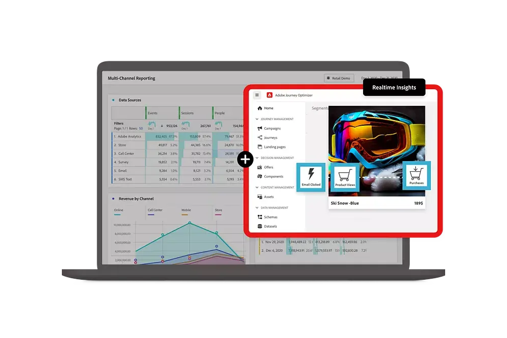

# Guia do Customer Journey Analytics

Este guia de documentação técnica fornece ajuda para o Customer Journey Analytics. O Customer Journey Analytics permite migrar dados de cliente de qualquer canal escolhido (online e offline) para a Adobe Experience Platform. Em seguida, é possível analisar esses dados da mesma forma que faria usando os dados digitais existentes do Analysis Workspace.

O Customer Journey Analytics permite controlar como você conecta os dados online e offline no Analysis Workspace em qualquer ID de cliente comum, e é possível criar atribuições, filtros, fluxos, fallouts etc. em dados de cliente.

## Novidades

Dê uma olhada nos últimos aprimoramentos do produto e da documentação do Customer Journey Analytics. Para obter uma lista de todos os recursos, melhorias e correções, confira as [Notas de versão](../release-notes/latest.md) detalhadas. Acesse a [página de atualizações da documentação](../release-notes/doc-changes.md) para ver as alterações mais recentes.

>[!BEGINTABS]

>[!TAB Assistente de IA]

O Assistente de IA é uma experiência de conversação que permite que os profissionais executem tarefas em um ritmo rápido, seja entender conceitos, solucionar problemas ou pesquisar informações. Também permite que não especialistas realizem tarefas especializadas e aumenta a qualidade geral do trabalho.

>[!TAB Análise guiada]

A Análise guiada agora está disponível diretamente no Analysis Workspace, permitindo que os usuários criem painéis com insights abrangentes a partir de painéis, visualizações e análises guiadas.

>[!TAB Legendas inteligentes v2]

Agora há suporte para legendas inteligentes, com melhorias adicionais na interface, para visualizações de [Linha](/help/analysis-workspace/visualizations/line.md) (incluindo várias linhas), [Barra](/help/analysis-workspace/visualizations/bar.md), [Barra horizontal](/help/analysis-workspace/visualizations/horizontal-bar.md), [Área](/help/analysis-workspace/visualizations/area.md) (incluindo várias linhas de Área), [Rosca](/help/analysis-workspace/visualizations/donut.md), [Fallout](/help/analysis-workspace/visualizations/fallout/fallout-flow.md) e [Fluxo](/help/analysis-workspace/visualizations/c-flow/flow.md).

>[!TAB Alertas]

Os alertas permitem que você seja notificado com base em pontos de dados específicos ou porcentagens alteradas. Você pode visualizar a frequência de acionamento de um alerta, enviar alertas por email ou SMS, criar alertas empilhados e muito mais.

>[!TAB Dados de resumo]

Permite trazer dados de série temporal que não têm uma ID de pessoa. Esses dados de série temporal podem ser usados para apoiar vários casos de uso, como

- Apresentar indicadores de desempenho de alto nível como parte dos dados em nível de evento ou ao lado deles.
- Fazer upload de metas ou objetivos por hora ou diariamente e, em seguida, posicionar essas metas ou objetivos em relação a métricas de nível de evento.

>[!TAB Compilação baseada em gráfico*]

Por meio da compilação baseada em gráfico, é possível usar o gráfico de identidade do Experience Platform Identity Service para obter uma visão melhor da jornada do cliente por: <ul><li>Associar conjuntos de dados com identificadores diferentes sem precisar extrair, transformar e carregar dados adicionais para refletir um único identificador.</li> <li>Aprimorar a cobertura de identidade preferencial ou “ouro” de um único conjunto de dados ao compartilhar identidades entre conjuntos de dados.</li><li>Alinhamento dos perfis criados na Real-Time Customer Data Platform e no Journey Optimizer com pessoas no Customer Journey Analytics.</li></ul>

*_Você precisa ter o pacote Prime para a compilação baseada em gráfico._*

>[!TAB Pesquisas B2B]

Como parte da configuração de uma conexão, você pode transformar conjuntos de dados para esquemas de pesquisa B2B específicos para oferecer um melhor suporte a pesquisas baseadas em pessoas em dados B2B.

>[!TAB Campos derivados]

Há novas funções de campos derivados (Matemática, Próximo ou Anterior, Resumo, Desduplicar) e modelos de função adicionais (como Rejeições, Nome amigável do conjunto de dados, Temporada de festas, Metas mensais, Detecção de bots simples e outros) disponíveis.

>[!TAB Extensão BI*]

A extensão BI permite acesso SQL às visualizações de dados definidas no Customer Journey Analytics. Agora você pode usar sua ferramenta de BI favorita (Power BI Desktop, Tableau Desktop, Looker, Juyter Notebook e RStudio) para criar relatórios e painéis com base nas mesmas visualizações de dados que os usuários do Customer Journey Analytics usam com seus projetos do Analysis Workspace. [Casos de uso](/help/use-cases/data-views/bi-extension-usecases.md) são fornecidos.

*_Você deve ter o pacote Select ou superior para usar a extensão de BI._*

>[!ENDTABS]

## Comece com as noções básicas

Comece lendo o material nos links abaixo para familiarizar-se com os recursos e as funcionalidades do Customer Journey Analytics.

<table style="table-layout:fixed">
  <tr style="border: 0;">
    <td>
    
    
<strong>Além dos dados online</strong> Saiba como o Customer Journey Analytics se compara ao Adobe Analytics, quais recursos são compartilhados e como você pode usar os dados do Analytics.

    </td>
    <td>
    
    
<strong>Assimilar e usar dados</strong> Conheça as opções disponíveis para assimilar dados na Experience Platform e usá-los para criar análises e relatórios no Customer Journey Analytics.

    </td>
    <td>
    
    
<strong>Análise guiada</strong> Saiba como usar fluxos de trabalho para obter dados e insights sobre a experiência de produto do cliente. Product Analytics através da análise guiada…
    

    </td>
    <td>
    
    
<strong>Analysis Workspace</strong> Use o Analysis Workspace para executar análises básicas e avançadas, como atribuição, diagramas de fluxo e fallout e detalhamentos de dimensões.

    </td>
  </tr>
  <tr style="border: 0;">
    <td align="center"></td>
    <td align="center"></td>
    <td align="center"></td>
    <td align="center"></td>
    </tr>
</table>

## Explorar a documentação

Veja como o Customer Journey Analytics se compara ao Adobe Analytics. Além disso, descubra como inserir seus dados na solução e, em seguida, preparar, exibir, analisar e democratizar esses dados, bem como a análise e os relatórios resultantes.

<table style="table-layout:fixed">
  <tr style="border: 0;">
    <td>
       
      <strong>Comparar ao Adobe Analytics</strong> <a href="/help/getting-started/aa-vs-cja/overview.md">Visão geral</a> - <a href="/help/getting-started/aa-to-cja.md">Evolução</a> - <a href="/help/getting-started/aa-vs-cja/aa-data-in-cja.md">Usar dados do Adobe Analytics</a> - <a href="/help/getting-started/aa-vs-cja/cja-aa.md">Suporte de recursos</a> - <a href="/help/getting-started/aa-vs-cja/terminology.md">Terminologia</a> - <a href="/help/getting-started/aa-vs-cja/data-processing-comparisons.md">Processamento de dados</a>
    </td>
    <td>
       
      <strong>Conexões</strong> <a href="/help/connections/overview.md">Visão geral</a> - <a href="/help/connections/create-connection.md">Criar</a> - <a href="/help/connections/manage-connections.md">Gerenciar</a> - <a href="/help/stitching/overview.md">Compilar</a> - <a href="/help/connections/combined-dataset.md">Conjuntos de dados de evento combinados</a> - <a href="/help/connections/standard-lookups.md">Pesquisas padrão</a>
    </td>
     <td>
       
      <strong>Visualizações de dados</strong> <a href="/help/data-views/data-views.md">Visão geral</a> - <a href="/help/data-views/create-dataview.md">Criar ou editar</a> - <a href="/help/data-views/session-settings.md">Configurações da sessão</a> - <a href="/help/data-views/derived-fields/derived-fields.md">Campos derivados</a> - <a href="/help/data-views/summary-data.md">Dados de resumo</a> - <a href="/help/data-views/component-reference.md">Referência de componente</a>
    </td>

</tr>
  <tr style="border: 0;">
    <td>
       
      <strong>Projetos do Workspace</strong> <a href="/help/analysis-workspace/home.md">Analysis Workspace</a> - <a href="/help/analysis-workspace/perform-basic-analysis.md">Análise básica</a> e <a href="/help/analysis-workspace/perform-adv-analysis.md">avançada</a> - <a href="/help/analysis-workspace/build-workspace-project/freeform-overview.md">Projetos</a> - <a href="/help/analysis-workspace/visualizations/freeform-analysis-visualizations.md">Visualizações</a> -<a href="/help/analysis-workspace/c-panels/freeform-panel.md">Painéis</a>
    </td>
    <td>
       
      <strong>Análise guiada</strong> <a href="/help/guided-analysis/overview.md">Visão geral</a> – <a href="/help/guided-analysis/types/active-growth.md">Crescimento do usuário</a> – <a href="/help/guided-analysis/types/trends.md">Tendências</a> – <a href="/help/guided-analysis/types/funnel.md">Funil</a> – <a href="/help/guided-analysis/types/release-impact.md">Impacto</a> – <a href="/help/guided-analysis/industry-use-cases.md">Casos de uso do setor</a>
    </td>
    <td>
       
      <strong>Compartilhar, exportar, integrar</strong> <a href="/help/analysis-workspace/curate-share/share-projects.md">Projetos</a> – <a href="/help/mobile-app/home.md">Painéis do Analytics</a> – <a href="/help/report-builder/report-buider-overview.md">Report Builder</a> – <a href="/help/components/exports/manage-exports.md">Exportação na nuvem</a> – <a href="/help/integrations/overview.md">Integrações</a>
    </td>
  </tr>
</table>

## Recursos adicionais

<table style="table-layout:fixed"><tr style="border: 0;">
<td><strong>Customer Journey Analytics</strong> 
<a href="https://experienceleague.adobe.com/pt-br/docs/customer-journey-analytics-learn/tutorials/overview" target="_blank">Tutoriais</a> – <a href="https://helpx.adobe.com/br/legal/product-descriptions/customer-journey-analytics.html" target="_blank">Descrição do produto Customer Journey Analytics</a> – <a href="https://helpx.adobe.com/br/legal/product-descriptions/adobe-analytics-addon-customer-journey-analytics.html" target="_blank">Descrição do produto Adobe Analytics (complemento do Customer Journey Analytics)</a> – <a href="https://developer.adobe.com/cja-apis/docs/" target="_blank">APIs do Customer Journey Analytics</a> – <a href="/help/ai-assistant.md">Assistente de IA</a>
</td>
<td><strong>Assimilação de dados</strong> <a href="/help/data-ingestion/data-ingestion.md">Visão geral</a> - <a href="/help/data-ingestion/analytics.md">Analytics</a> - <a href="/help/data-ingestion/aepwebsdk.md">SDK da Web</a> - <a href="/help/data-ingestion/aepmobilesdk.md">SDK móvel</a> - <a href="/help/data-ingestion/batch.md">Em lote</a> - <a href="/help/data-ingestion/streaming.md">Transmissão</a> - <a href="/help/data-ingestion/sources.md">Origens</a> - <a href="/help/data-ingestion/serverapi.md">API do servidor</a>
</td>
</tr>
</table>

<table style="table-layout:auto" class="tablelayout-is-fixed"><tbody><tr style="border: 0;"><td></td><td>
<b>Obtenha as informações mais recentes, contribua com a comunidade e aprimore sua experiência com o Customer Journey Analytics.</b> Visite a comunidade do Adobe Analytics para conversar sobre a funcionalidade com outros(as) profissionais. <a href="https://experienceleaguecommunities.adobe.com/t5/adobe-analytics/ct-p/adobe-analytics-community?profile.language=pt">Participe da comunidade hoje mesmo.</a></td></tr></tbody></table>
