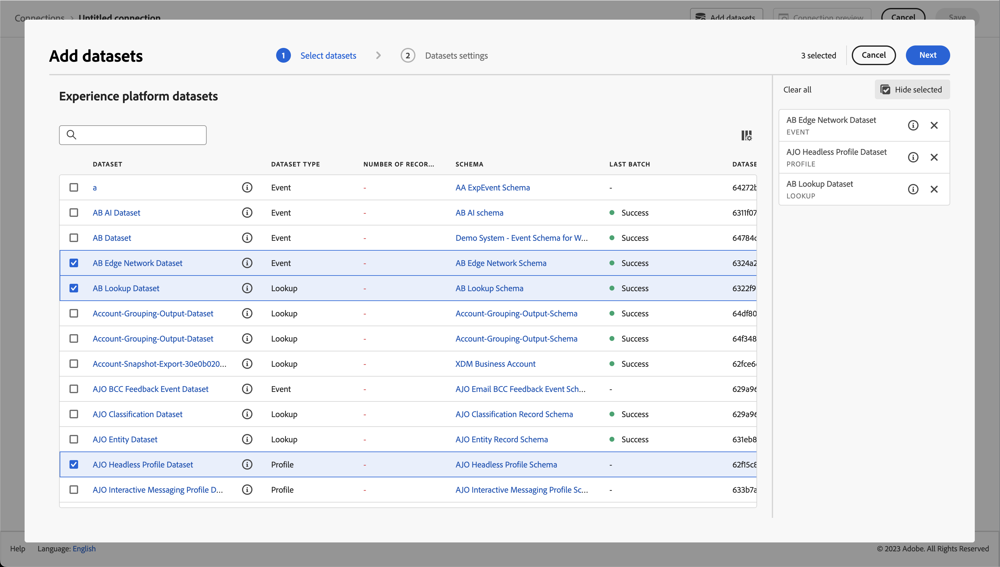

# Criar e configurar uma conexão para usar com o Customer Journey Analytics {#upgrade-create-connection}

<!-- markdownlint-disable MD034 -->

>[!CONTEXTUALHELP]
>id="cja-upgrade-connection"
>title="Criar uma conexão no Customer Journey Analytics"
>abstract="Uma conexão permite converter dados do Adobe Experience Platform em um formato otimizado para relatórios do Customer Journey Analytics. Criar uma conexão no Customer Journey Analytics é simples, leva apenas alguns minutos para ser concluído."

<!-- markdownlint-enable MD034 -->

>[!NOTE]
> 
>Siga as etapas desta página somente após concluir todas as etapas de atualização anteriores. Você pode seguir as [etapas de atualização recomendadas](/help/getting-started/cja-upgrade/cja-upgrade-recommendations.md#recommended-upgrade-steps-for-most-organizations) ou seguir as etapas de atualização que foram geradas dinamicamente para sua organização com o [questionário de atualização do Adobe Analytics para o Customer Journey Analytics](https://gigazelle.github.io/cja-ttv/).
>
>Após concluir as etapas desta página, continue seguindo as etapas de atualização recomendadas ou as etapas de atualização geradas dinamicamente.

<!-- Should we single source this instead of duplicate it? The following steps were copied from: /help/connections/create-connection.md -->

As informações a seguir explicam como criar e configurar uma conexão, bem como adicionar conjuntos de dados do Experience Platform à conexão criada. Para obter informações adicionais sobre como criar e configurar uma conexão, consulte [Criar ou editar uma conexão](/help/connections/create-connection.md).

## Criar e configurar a conexão {#create-connection}

1. No Customer Journey Analytics, selecione a guia **[!UICONTROL Conexões]**.
1. Selecione **[!UICONTROL Criar nova conexão]**.

   

1. Defina as configurações de conexão.

   | Configuração | Descrição |
   | --- | --- |
   | **[!UICONTROL Nome da conexão]** | Digite um nome exclusivo para a conexão. |
   | **[!UICONTROL Descrição da conexão]** | Descreva a finalidade desta conexão. |
   | **[!UICONTROL Sandbox]** | Escolha uma sandbox na Experience Platform que contenha os conjuntos de dados para os quais você deseja criar uma conexão.
A Adobe Experience Platform fornece [sandboxes](https://experienceleague.adobe.com/pt-br/docs/experience-platform/sandbox/home) que particionam uma única instância da Platform em ambientes virtuais separados para ajudar a desenvolver aplicativos de experiência digital. Você pode considerar as sandboxes como “silos de dados” que contêm conjuntos de dados. As sandboxes são usadas para controlar o acesso aos conjuntos de dados.
Depois de selecionar a sandbox, o painel esquerdo mostra todos os conjuntos de dados que você pode obter dela. |
   | **[!UICONTROL Ativar janela de dados contínuos]** | Essa caixa de seleção, se marcada, permite definir a retenção de dados do Costumer Journey Analytics como uma janela contínua em meses (1 mês, 3 meses, 6 meses etc.), no nível da conexão.
A retenção de dados tem por base os carimbos de data e hora do conjunto de dados do evento e se aplica somente aos conjuntos de dados do evento. Não existe configuração de janela de dados contínuos para conjuntos de dados de perfil ou pesquisa, pois não há carimbos de data/hora aplicáveis. No entanto, se sua conexão incluir qualquer perfil ou conjuntos de dados de pesquisa (além de um ou mais conjuntos de dados de evento), esses dados serão retidos pelo mesmo período.
 O principal benefício é armazenar ou relatar apenas dados que sejam aplicáveis e úteis, além de excluir dados mais antigos que não sejam mais úteis. Isso ajuda você a ficar dentro dos limites do contrato e reduz o risco de custo excedente.
Se deixar o padrão (desmarcado), a configuração de retenção de dados da Adobe Experience Platform terá precedência sobre o período de retenção. Se você tiver dados correspondentes a 25 meses na Experience Platform, o Customer Journey Analytics obterá 25 meses de dados por meio de preenchimento retroativo. Se você excluiu 10 desses meses na Platform, o Customer Journey Analytics manterá os 15 meses restantes. |
   | **[!UICONTROL Adicionar conjuntos de dados]** (veja abaixo) | Adicione conjuntos de dados se nenhum conjunto de dados for exibido na lista do conjunto de dados. |
   | **[!UICONTROL Nome do conjunto de dados]** | Selecione um ou mais conjuntos de dados que você deseja inserir no Customer Journey Analytics e clique em **[!UICONTROL Adicionar]**.
(Se tiver vários conjuntos de dados, você poderá pesquisar os corretos usando a barra de consulta Pesquisar conjuntos de dados acima da lista de conjuntos de dados.) |
   | **[!UICONTROL Última atualização]** | Somente para conjuntos de dados de eventos, essa configuração é definida automaticamente para o campo de carimbo de data e hora padrão em esquemas baseados em eventos na Experience Platform. “N/A” significa que esse conjunto de dados não contém dados. |
   | **[!UICONTROL Número de registros]** | O total de registros no mês anterior do conjunto de dados na Experience Platform. |
   | **[!UICONTROL Esquema]** | O [esquema](https://experienceleague.adobe.com/pt-br/docs/experience-platform/xdm/schema/composition) que foi usado como base para criar o conjunto de dados na Adobe Experience Platform. |
   | **[!UICONTROL Tipo de conjunto de dados]** | Para cada conjunto de dados adicionado a essa conexão, o Customer Journey Analytics define automaticamente o tipo de conjunto de dados de acordo com os dados recebidos. Há 3 tipos diferentes de conjunto de dados: dados de Evento, dados de Perfil e dados de Pesquisa. Consulte a tabela abaixo para obter uma explicação dos tipos de conjunto de dados. |
   | **[!UICONTROL Granularidade]** | A granularidade dos dados no conjunto de dados, aplicável somente para conjuntos de dados de resumo. |
   | **[!UICONTROL Tipo de fonte de dados]** | O tipo de fonte de dados do conjunto de dados. Não aplicável para conjuntos de dados de resumo. |
   | **[!UICONTROL ID de pessoa]** | Selecione uma ID de pessoa na lista suspensa de identidades disponíveis. Essas identidades foram definidas no esquema do conjunto de dados na Experience Platform. Consulte abaixo para obter informações sobre como usar o Mapa de identidade como uma ID de pessoa.
IMPORTANTE: se não houver IDs de pessoa para escolher, significa que uma ou mais IDs de pessoa não foram definidas no esquema. Assista a [este vídeo](https://www.youtube.com/watch?v=G_ttmGl_LRU) sobre como definir uma identidade na Experience Platform. |
   | **[!UICONTROL Chave]** | Somente para conjuntos de dados de pesquisa (como _id). |
   | **[!UICONTROL Chave correspondente]** | Somente para conjuntos de dados de pesquisa (como _id). |
   | **[!UICONTROL Importar novos dados]** | Defina como Ligado ou Desligado. |
   | **[!UICONTROL Dados de preenchimento retroativo]** | Você pode solicitar o preenchimento retroativo de dados em um conjunto de dados. Por exemplo, é possível solicitar o preenchimento retroativo dos dados dos últimos 7 dias. Configure o conjunto de dados corretamente e teste sua conexão. Se tudo estiver correto, você pode preencher os dados restantes com facilidade.
Além disso, é possível habilitar a importação de novos dados por conjunto de dados. |
   | **[!UICONTROL Status de preenchimento retroativo]** | Esse status indica se algum dado de preenchimento retroativo está sendo processado. |

   {style="table-layout:auto"}

## Adicionar e configurar conjuntos de dados {#add-dataset}

É possível adicionar um conjunto de dados do Experience Platform ao criar uma conexão.

1. Na caixa de diálogo Configurações de conexão, clique em **[!UICONTROL Adicionar conjuntos de dados]**.

1. Na etapa [!UICONTROL Selecionar conjuntos de dados], você verá uma lista dos conjuntos de dados da Experience Platform.

   

   Para cada conjunto de dados, a lista mostra:

   | Coluna | Descrição |
   |---|---|
   | Conjunto de dados | Nome do conjunto de dados. Selecione o nome para acessar o conjunto de dados na Experience Platform. Selecione  para exibir uma janela pop-up com mais detalhes sobre o conjunto de dados. Você pode selecionar **[!UICONTROL Editar na plataforma]** para editar o conjunto de dados diretamente na Experience Platform. |
   | Tipo de conjunto de dados | O tipo de conjunto de dados: evento, perfil, pesquisa ou resumo. |
   | Número de registros | O total de registros no mês anterior do conjunto de dados na Experience Platform. |
   | Esquema | O esquema do conjunto de dados. Selecione o nome para acessar o esquema na Experience Platform. |
   | Último lote | O estado do último lote assimilado na Experience Platform. Consulte [Estados dos lotes](https://experienceleague.adobe.com/pt-br/docs/experience-platform/ingestion/batch/troubleshooting#batch-states) para mais informações. |
   | ID do conjunto de dados | O ID do conjunto de dados. |
   | Última atualização | O carimbo de data e hora da última atualização do conjunto de dados. |

1. Selecione um ou mais conjuntos de dados e clique em **[!UICONTROL Próximo]**. Pelo menos um conjunto de dados de evento deve fazer parte da conexão.
   * Para alterar as colunas exibidas para a lista de conjuntos de dados, selecione  e selecione as colunas a serem exibidas na caixa de diálogo [!UICONTROL Personalizar tabela].
   * Para pesquisar um conjunto de dados específico, use o campo .
   * Para alternar entre mostrar ou ocultar os conjuntos de dados selecionados, clique em  **[!UICONTROL Ocultar selecionados]** ou **[!UICONTROL Mostrar selecionados]**.
   * Para remover um conjunto de dados da lista de conjuntos de dados selecionados, use . Para remover todos os conjuntos de dados selecionados, clique em **[!UICONTROL Limpar tudo]**.

1. Agora, configure os conjuntos de dados um por um.

   

   | Configuração | Descrição |
   | --- | --- |
   | **[!UICONTROL ID de pessoa]** | Disponível somente para conjuntos de dados de evento e perfil. Selecione uma ID de pessoa na lista suspensa de identidades disponíveis. Essas identidades foram definidas no esquema do conjunto de dados na Experience Platform. Consulte abaixo para obter informações sobre como usar o Mapa de identidade como uma ID de pessoa.
Se não houver IDs de pessoa para escolher, significa que uma ou mais IDs de pessoa não foram definidas no esquema. Consulte [Definir campos de identidade na interface](https://experienceleague.adobe.com/pt-br/docs/experience-platform/xdm/ui/fields/identity) para obter mais informações. 
O valor da ID de pessoa selecionada diferencia maiúsculas de minúsculas. Por exemplo, `abc123` e `ABC123` são dois valores diferentes. |
   | **[!UICONTROL Carimbo de data e hora]** | Somente para conjuntos de dados de evento e resumo, essa configuração é definida automaticamente para o campo de carimbo de data e hora padrão em esquemas baseados em eventos na Experience Platform. |
   | **[!UICONTROL Chave]** | Disponível somente para conjuntos de dados de pesquisa. A chave a ser usada para um conjunto de dados de pesquisa. |
   | **[!UICONTROL Chave correspondente]** | Disponível somente para conjuntos de dados de pesquisa. A chave correspondente a ser associada a um dos conjuntos de dados do evento. Se essa lista estiver vazia, você provavelmente não adicionou nem configurou um conjunto de dados de evento. |
   | **[!UICONTROL Fuso horário]** | Disponível somente para dados de resumo. Selecione o fuso horário apropriado para os dados de resumo da série temporal. |
   | **[!UICONTROL Tipo de fonte de dados]** | Selecione um tipo de fonte de dados.  Os tipos de fontes de dados incluem: <ul><li>[!UICONTROL Dados da Web]</li><li>[!UICONTROL Dados do aplicativo móvel]</li><li>[!UICONTROL Dados de POS]</li><li>[!UICONTROL Dados de CRM]</li><li>[!UICONTROL Dados de pesquisa]</li><li>[!UICONTROL Dados da central de atendimento]</li><li>[!UICONTROL Dados de produto]</li><li> [!UICONTROL Dados de contas]</li><li> [!UICONTROL Dados de transação]</li><li>[!UICONTROL Dados de feedback de clientes]</li><li> [!UICONTROL Outro]</li></ul>Este campo é usado para consultar os tipos de fontes de dados que estão sendo usados. |
   | **[!UICONTROL Importar novos dados]** | Habilite essa opção se quiser estabelecer uma conexão contínua. Com uma conexão contínua, novos lotes de dados adicionados aos conjuntos de dados ficam disponíveis automaticamente no Workspace. |
   | **[!UICONTROL Preenchimento retroativo do conjunto de dados]** | Habilitar a opção **[!UICONTROL Preenchimento retroativo de todos os dados existentes]** para garantir que todos os dados existentes sejam preenchidos retroativamente.  Selecione **[!UICONTROL Solicitar preenchimento retroativo]** para preencher dados históricos retroativamente por um período específico. Você pode definir até 10 períodos de preenchimento retroativo de conjunto de dados.<ol><li>Defina o período inserindo dados de início e término ou selecionando datas usando o .</li><li>Selecione **[!UICONTROL Preenchimento retroativo de fila]** para adicionar o preenchimento retroativo à lista, ou **[!UICONTROL Cancelar]** para cancelar.</li></ol>Para cada entrada, selecione  para editar o período ou  para excluir a entrada.  Em preenchimentos retroativos:<ul><li>Você pode preencher cada conjunto de dados individualmente.</li><li>Prioriza-se a adição de novos dados a um conjunto de dados na conexão, de modo que esses dados tenham a latência mais baixa.</li><li>Qualquer dado de preenchimento retroativo (histórico) é importado mais lentamente. A quantidade de dados históricos influencia a latência.</li><li>O conector de origem do Analytics importa até 13 meses de dados (independentemente do tamanho) para sandboxes de produção. O preenchimento retroativo em sandboxes de não produção é limitado a 3 meses.</li></ul> |
   | **[!UICONTROL Transformar conjunto de dados]** | Para conjuntos de dados de pesquisa B2B específicos, é possível habilitar a transformação de um conjunto de dados para cenários de relatório adequados baseados em pessoas B2B. |
   | **[!UICONTROL Status de preenchimento retroativo]** | Os possíveis indicadores de status são:<ul><li>Sucesso</li><li>Processamento de X preenchimentos retroativos</li><li>Desligado</li></ul> |
   | **[!UICONTROL ID do conjunto de dados]** | Essa ID é gerada automaticamente. |
   | **[!UICONTROL Descrição]** | A descrição fornecida para esse conjunto de dados quando ele foi criado. |
   | **[!UICONTROL Tamanho do conjunto de dados]** | O tamanho do conjunto de dados. |
   | **[!UICONTROL Esquema]** | É o esquema que foi usado como base para criar o conjunto de dados na Adobe Experience Platform. |
   | **[!UICONTROL Conjunto de dados]** | O nome do conjunto de dados. |
   | **[!UICONTROL Visualização: *nome do conjunto de dados *]** | Visualiza o conjunto de dados com colunas de data, minha ID e identificador. |
   | **[!UICONTROL Remover]** | Você pode excluir ou remover o conjunto de dados e alterar a ID de pessoa sem excluir toda a conexão. A exclusão ou remoção reduz os custos envolvidos na assimilação de dados e o complicado processo de recriar toda a conexão e as visualizações de dados associadas. |

   {style="table-layout:auto"}

1. Continue seguindo as [etapas de atualização recomendadas](/help/getting-started/cja-upgrade/cja-upgrade-recommendations.md#recommended-upgrade-steps-for-most-organizations) ou as [etapas de atualização geradas dinamicamente](https://gigazelle.github.io/cja-ttv/).
