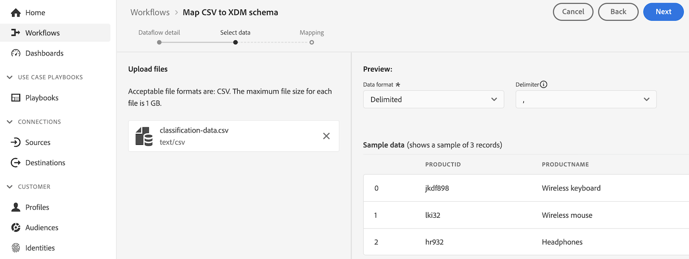

# Criar conjuntos de dados de pesquisa para classificar dados no Customer Journey Analytics

>[!NOTE]
> 
>Siga as etapas desta página somente após concluir todas as etapas de atualização anteriores. Você pode seguir as [etapas de atualização recomendadas](/help/getting-started/cja-upgrade/cja-upgrade-recommendations.md#recommended-upgrade-steps-for-most-organizations) ou seguir as etapas de atualização que foram geradas dinamicamente para a sua organização com o [questionário de atualização do Adobe Analytics para o Customer Journey Analytics](https://gigazelle.github.io/cja-ttv/).
>
>Após concluir as etapas desta página, continue seguindo as etapas de atualização recomendadas ou as etapas de atualização geradas dinamicamente.

Semelhante aos dados de classificações no Adobe Analytics, os conjuntos de dados de pesquisa são o método para classificar dados no Customer Journey Analytics.

Ao usar o conector de origem do Analytics, alguns conjuntos de dados de pesquisa padrão são aplicados automaticamente no momento do relatório. Para obter mais informações, consulte [Adicionar pesquisas padrão aos seus conjuntos de dados](/help/connections/standard-lookups.md).

Para classificar dados no Customer Journey Analytics ao usar o SDK da Web do Experience Platform, é necessário criar um esquema XDM e um conjunto de dados de pesquisa para cada dimensão que contenha dados que você deseja classificar.

## Criar um esquema XDM para usar com o conjunto de dados de pesquisa

Crie um novo esquema XDM para cada dimensão que contenha dados que você deseja classificar no Customer Journey Analytics. Ao criar o conjunto de dados de pesquisa em uma etapa posterior, ele fará referência a esse esquema.

Repita esse processo para cada dimensão que contenha dados que você deseja classificar.

Para criar um esquema para usar com um conjunto de dados de pesquisa no Customer Journey Analytics:

1. No Adobe Experience Platform, selecione **[!UICONTROL Esquemas]** na seção **[!UICONTROL Gerenciamento de dados]** no painel esquerdo.

1. Selecione **[!UICONTROL Criar esquema]**.

   

1. Selecione **[!UICONTROL Manual]**. Isso permite adicionar campos e grupos de campos manualmente ao esquema. Escolha **[!UICONTROL Selecionar]** para prosseguir para a próxima página do assistente de criação.

1. Na página **[!UICONTROL Detalhes do esquema]**, selecione **[!UICONTROL Outros]** e **[!UICONTROL Personalizado]**.

   

1. Selecione **[!UICONTROL Criar classe]**.

   <!-- add screenshot -->

1. Na caixa de diálogo **[!UICONTROL Criar classe]**, especifique um nome e uma descrição para o esquema, selecione **[!UICONTROL Gravar]** e **[!UICONTROL Criar]**.

1. Continuar com [Criar um conjunto de dados de pesquisa](#create-a-lookup-dataset).

## Criar um conjunto de dados de pesquisa

Depois de [criar um esquema XDM](#create-an-xdm-schema-for-lookup-datasets) para usar em um conjunto de dados de pesquisa, você precisa criar o conjunto de dados de pesquisa e mapeá-lo para o esquema.

Repita esse processo para cada dimensão que contenha dados que você deseja classificar.

Para criar um conjunto de dados de pesquisa para uso com um esquema no Customer Journey Analytics:

>[!NOTE]
>
>O processo a seguir usa um arquivo CSV para criar o conjunto de dados. Você também pode usar qualquer outro método disponível para importar dados para o Experience Platform, como configurar um fluxo de dados.

1. No Adobe Experience Platform, selecione **[!UICONTROL Fluxos de trabalho]** no painel esquerdo.

   

1. Selecione **[!UICONTROL Mapear CSV para esquema XDM]** e **[!UICONTROL Iniciar]**.

1. Na seção **[!UICONTROL Detalhes do conjunto de dados]**, selecione **[!UICONTROL Novo conjunto de dados]**.

1. Especifique um nome e uma descrição para o conjunto de dados.

1. No campo **[!UICONTROL Esquema]**, selecione o esquema criado para conjuntos de dados de pesquisa, conforme descrito em [Criar um esquema para conjuntos de dados de pesquisa](#create-a-schema-for-lookup-datasets).

1. Selecione **[!UICONTROL Próximo]**.

1. Na **[!UICONTROL página Mapear CSV para esquema XDM]**, na seção **[!UICONTROL Carregar arquivos]**, selecione **[!UICONTROL Escolher arquivos]** e procure no sistema de arquivos o arquivo que contém as informações de classificação da dimensão à qual você deseja aplicar os dados de classificação. Por exemplo, pode ser uma planilha que lista as IDs de campo e os nomes de campo correspondentes. <!-- correct? How can I better explain what this file is?-->

   

1. Selecionar **[!UICONTROL Próximo]**

1. Depois que o arquivo for carregado, revise os mapeamentos para verificar se estão precisos. As colunas do arquivo CSV estão listadas em **[!UICONTROL Dados do Source]** e seus campos de esquema XDM correspondentes estão listados em **[!UICONTROL Campo de Destino]**.

   A Platform fornece recomendações inteligentes automaticamente para campos mapeados automaticamente com base no esquema ou conjunto de dados de destino selecionado. Você pode ajustar manualmente as regras de mapeamento para atender aos seus casos de uso.

   Para obter mais informações sobre o processo de mapeamento, consulte [Mapear um arquivo CSV para um esquema XDM existente](https://experienceleague.adobe.com/en/docs/experience-platform/ingestion/tutorials/map-csv/existing-schema) na documentação do Experience Platform.

1. Selecione **[!UICONTROL Concluir]**.

1. Continue com [Adicionar o conjunto de dados de pesquisa à sua conexão no Customer Journey Analytics](#add-the-lookup-dataset-to-your-connection-in-customer-journey-analytics).

## Adicionar o conjunto de dados de pesquisa à sua conexão no Customer Journey Analytics

Depois de [criar um esquema XDM](#create-an-xdm-schema-for-lookup-datasets) e [criar um conjunto de dados de pesquisa](#create-a-lookup-dataset), é necessário adicionar o conjunto de dados de pesquisa à sua conexão no Customer Journey Analytics.

Repita esse processo para cada dimensão que contenha dados que você deseja classificar.

Para adicionar o conjunto de dados de pesquisa à sua conexão no Customer Journey Analytics:

1. No Customer Journey Analytics, selecione a guia **[!UICONTROL Conexões]**.

1. Selecione  ao lado da conexão à qual você deseja adicionar o conjunto de dados de pesquisa e selecione **[!UICONTROL Editar]**.

   <!-- add screenshot -->

1. Selecione **[!UICONTROL Adicionar conjuntos de dados]**.

1. Na caixa de diálogo **[!UICONTROL Adicionar conjuntos de dados]**, selecione o conjunto de dados de pesquisa criado e clique em **[!UICONTROL Avançar]**.

1. No campo **[!UICONTROL ID de pessoa]**, selecione uma ID de pessoa entre as identidades disponíveis definidas no esquema do conjunto de dados configurado no Experience Platform. <!-- fill out other fields? -->

1. Selecione **[!UICONTROL Adicionar conjuntos de dados]** e **[!UICONTROL Salvar]**.

   <!-- is there a step right in between here where you select the dataset -->

1. Usando o campo **[!UICONTROL Chave]** e o campo **[!UICONTROL Chave correspondente]**, crie uma correlação entre o campo no conjunto de dados de pesquisa e o campo no conjunto de dados de evento ou resumo.

1. Depois que todos os conjuntos de dados de pesquisa forem adicionados à sua conexão no Customer Journey Analytics, continue seguindo as [etapas de atualização recomendadas](/help/getting-started/cja-upgrade/cja-upgrade-recommendations.md#recommended-upgrade-steps-for-most-organizations) ou as [etapas de atualização geradas dinamicamente](https://gigazelle.github.io/cja-ttv/).

