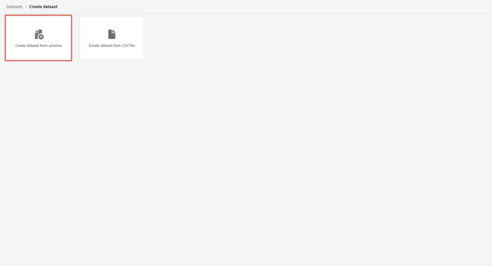

# Criar um conjunto de dados para usar com o Customer Journey Analytics {#upgrade-create-dataset}

<!-- markdownlint-disable MD034 -->

>[!CONTEXTUALHELP]
>id="cja-upgrade-dataset-create"
>title="Criar um conjunto de dados na Adobe Experience Platform"
>abstract="Um conjunto de dados é um local onde residem os dados coletados. Crie esse local na Adobe Experience Platform.  Se você já tiver um esquema em mente, criar um conjunto de dados levará apenas alguns minutos."

<!-- markdownlint-enable MD034 -->

{{upgrade-note-step}}

<!-- Should we single source this instead of duplicate it? The following steps were copied from: /help/data-ingestion/aepwebsdk.md-->

Um conjunto de dados é a construção que armazena e gerencia os dados coletados na Adobe Experience Platform.

Para criar um conjunto de dados:

1. Na Adobe Experience Platform, no painel esquerdo, selecione **[!UICONTROL Conjuntos de dados]** em [!UICONTROL GERENCIAMENTO DE DADOS].

1. Selecione **[!UICONTROL Criar conjunto de dados]**.

   

1. Selecione **[!UICONTROL Criar conjunto de dados a partir do esquema]**.

   

1. Selecione o esquema criado anteriormente e selecione **[!UICONTROL Próximo]**.

1. Nomeie seu conjunto de dados e (opcional) forneça uma descrição.

   

1. Selecione **[!UICONTROL Concluir]**.

1. Selecione a opção **[!UICONTROL Perfil]**.

   Você deve habilitar o conjunto de dados para perfil. Depois de habilitado, o conjunto de dados enriquece os perfis do cliente em tempo real com seus dados assimilados.

   >[!IMPORTANT]
   >
   >    Você só pode habilitar um conjunto de dados para perfil quando o esquema, ao qual o conjunto de dados corresponde, também estiver habilitado para perfil.

   

   Consulte [Guia da IU de conjuntos de dados](https://experienceleague.adobe.com/docs/experience-platform/catalog/datasets/user-guide.html?lang=pt-BR) para obter muito mais informações sobre como visualizar, exibir, criar e excluir um conjunto de dados. Aprenda também a habilitar um conjunto de dados para o perfil do cliente em tempo real.

{{upgrade-final-step}}
