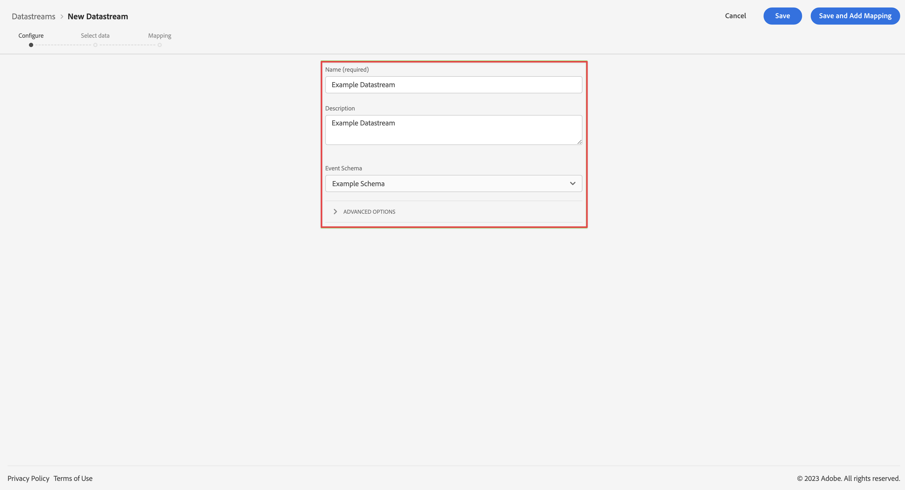

# Criar uma sequência de dados para usar com o Customer Journey Analytics {#upgrade-create-datastream}

<!-- markdownlint-disable MD034 -->

>[!CONTEXTUALHELP]
>id="cja-upgrade-datastream-create"
>title="Criar uma sequência de dados na Adobe Experience Platform"
>abstract="Uma sequência de dados é um local intermediário que transmite seus dados para todos os serviços configurados. Crie esse local na Adobe Experience Platform.  A criação inicial de uma sequência de dados na interface da Platform leva apenas alguns minutos."

<!-- markdownlint-enable MD034 -->

{{upgrade-note-step}}

<!-- Should we single source this instead of duplicate it? The following steps were copied from: /help/data-ingestion/aepwebsdk.md-->

Uma sequência de dados representa a configuração do lado do servidor ao implementar os SDKs móveis e da Web da Adobe Experience Platform. Ao coletar dados com os SDKs da Adobe Experience Platform, os dados são enviados para a Rede de borda da Adobe Experience Platform. É a sequência de dados que determina para quais serviços os dados são encaminhados.

Na configuração, você deseja configurar a sequência de dados para enviar os dados coletados para seu conjunto de dados na Adobe Experience Platform.

>[!NOTE]
>
>As etapas a seguir são necessárias somente para implementações do Adobe Analytics que usam AppMeasurement ou a extensão do Analytics (tags).
>
>Se sua implementação do Adobe Analytics usar o SDK da web ou a extensão do SDK da web, a sequência de dados já existe em seu ambiente do Adobe Analytics.

Para configurar seu armazenamento de dados:

1. Na Adobe Experience Platform, selecione **[!UICONTROL Sequências de dados]** em [!UICONTROL COLEÇÃO DE DADOS] no painel esquerdo.

1. Selecione **[!UICONTROL Novo fluxo de dados]**.

1. Nomeie e descreva o armazenamento de dados. Selecione o esquema na lista [!UICONTROL Esquema do evento].

   

1. Selecione **[!UICONTROL Salvar]**.

{{upgrade-final-step}}
